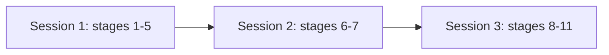

# Phase 6 continuation prompt

Phase 6 is the build. Read this file at the start of any session that continues build work. It is written to be sufficient on its own: reading it is the whole handoff, and no other instruction is needed to begin.

## Table of contents

- [Start here](#start-here)
- [State now](#state-now)
- [Which session to open, before anything else](#which-session-to-open-before-anything-else)
- [The next session starts here](#the-next-session-starts-here)
- [Build phase 4.4, done](#build-phase-44-done)
- [Read before opening the next phase](#read-before-opening-the-next-phase)
- [Build phase 3.0, done](#build-phase-30-done)
- [Build phase 3.1, done](#build-phase-31-done)
- [Build phase 3.2, done](#build-phase-32-done)
- [Build phase 3.3, done](#build-phase-33-done)
- [Build phase 3.4, done](#build-phase-34-done)
- [Build phase 3.5, done](#build-phase-35-done)
- [Step 6.2, done](#step-62-done)
- [Build phase 4.3, done](#build-phase-43-done)
- [Build phase 4.0, done](#build-phase-40-done)
- [Build phase 4.1, done](#build-phase-41-done)
- [Build phase 4.10, done](#build-phase-410-done)
- [Build phase 4.9, done](#build-phase-49-done)
- [Build phase 4.8, done](#build-phase-48-done)
- [Open items](#open-items)
- [Handover](#handover)

## Start here

If you were handed this file and nothing else, this section is the instruction. Work it top to bottom, then stop reading and act.

### Step 1: know which session you are in

Run this first. It is one command and it decides what you are allowed to do:

```bash
echo "${ANTHROPIC_BASE_URL:-primary provider}"
```

- Prints `primary provider`: you are on the subscription. Every stage is available to you. Go to step 2.
- Prints a URL: you are on the alternate metered backend, and only some stages are yours to run. Read "Which session to open, before anything else" below for which, then come back. If the next action is one you may not run, stop and say so rather than running it anyway.

Do not skip this. The constraint is not recoverable once a session is running, and the failure is silent: a judge dispatched on the alternate backend runs on the builder's model and nothing reports the substitution.

### Step 2: do the next action

The next action is always one line, kept current at the top of "State now" below. Right now it is:

- BUILD PHASE 4.13, DURABLE CROSS-RELOAD SEARCH HISTORY, IS MERGED as PR #69 on 2026-08-27, with all four CI gates green on the pull request. Separately, the harness gained the WRITE-FIRST rule as PR #70 the same day, after four agents died in one session and one died mid-sentence holding this phase's blocking regression. A person's past questions now survive closing the browser: an owner-scoped read over the `interactions` rows build phase 4.6 writes, `GET /v1/history`, and the rail that renders them. Verified: backend 4126 passing with ZERO failed, frontend 235, browser suite 47 passed with the one documented pre-existing failure, and the reload path proven in a real browser AND proven red under mutation.
- THE NEXT ACTION IS BUILD PHASE 4.15, the two-environment release flow, which 4.14 unblocked. Then 5.0 and 5.1.
- WHAT IT COST: THREE review rounds against a two-round budget, with the third authorised by the product owner, plus a fourth blocking finding from the final verifier. The review loop's STOP CONDITION FIRED FOR THE FIRST TIME since it was written, and on exactly the shape it was written for.
- THE MOST TRANSFERABLE RESULT, and it is not the feature: TWO separate defects shipped because a change made an UNSTATED INVARIANT false. F-4.13-RV-01: a re-ask fix replaced a reducer that never shrank the list with one that can, while the id generator on the line above still read `${current.length}`, so two rows took one id and clicking BRCA1 ran CFTR. F-4.13-FV-01: this phase added `mergeServerHistory` as a SECOND writer to the same list, keying on `traceId` and never on text, so the meta effect's match-by-question-text rewrote a restored row with today's numbers. Neither changed line was wrong when written.
- WHY BOTH SURVIVED REVIEW, which is the part worth carrying: in each case a comment asserted the invariant that SURVIVED. The re-ask fix's comment correctly says it preserves one-row-per-question-text, and it does. A comment asserting a NEIGHBOURING invariant is worse than no comment, because it tells the next reader identity was already thought about. Where a fix depends on a property, write the property down, including the ones you did not change.
- THE SECOND RECURRING FAILURE, twice in one phase: a reviewer's SEVERITY is trustworthy and its SCOPE is not, because a review is bounded to a diff and a defect class is bounded by nothing. F-4.13-A-01 was filed against one endpoint and was six routes wide. F-4.13-FV-01 was filed as out-of-phase because `git blame` dated the line to two weeks earlier, when this phase is what made it reachable. Before choosing a fix for any missing-check finding, grep the siblings and count the instances; that count decides whether you are fixing a bug or a class.
- THREE THINGS MERGE OPEN, all product-owner decisions taken 2026-08-27, none of them a surprise: a reload still signs an account out, so history appears only after signing in again, and "keep me signed in" is its own phase (F-4.13-02); on a shared browser one person's guest searches follow whoever signs up next, owned with build phase 4.10's migration rather than here (F-4.13-A-04); and three minor latent findings carry named owners (F-4.13-FV-03/04/05).
- READ `tracker/phase_4.13.md` before touching the rail or the history read path. It carries all 21 findings, four review reports, and the coverage statement naming what the gate does NOT cover, including the sharpest omission: the gate holds one bearer token in a Python variable across its two clients, which is exactly what no browser does.
- Previously: BUILD PHASE 4.14, CONTINUOUS INTEGRATION, MERGED as PR #68 on 2026-08-26, and CI IS LIVE AND GREEN on `develop`. Section 24's ten gates now run on every pull request. The deployed product was re-probed after the merge: web HTTP 200, api `/health` `{"status":"ok"}`.
- TWO THINGS MERGED OPEN, and the first needs a PRODUCT-OWNER DECISION rather than code. NOTHING MAKES THESE GATES MERGE-BLOCKING: branch protection needs GitHub Pro or a public repository, and `gh api .../branches/develop/protection` returns 403. A red check currently sits beside a working Merge button, which is a real improvement over nothing running and is NOT what Section 24 claims. Options: upgrade to Pro, make the repository public, or accept advisory CI and say so wherever the deliverable is described (F-4.14-A-04).
- The second: GATE 5's STRICT PATH HAS NEVER EXECUTED. Every green so far is its honest NOT RUN branch, because the graph credential is not available to CI. It is wired and asserted, just unexercised (F-4.14-RV-08).
- WHAT CI FOUND ON ITS OWN, four pre-existing defects invisible to every gate, premise test and review round in this repository: `pip install -e .` had been broken for the LIFE OF THE PROJECT, so `s3` and `s3-kgx-export` were uninstallable by anyone since build phase 4.2; the suite needs about thirty environment values a clean machine lacks, which means every earlier "verified locally" figure had been measured against a developer's own `.env`; a build phase 4.7 mutation arm called a HEALTHY assertion vacuous depending on core count; and 25 tests could never run in CI at all, hidden behind a green `4019 passed`.
- WHAT IT COST, and it is not the workflow: THREE review rounds and a RULE 4 STOP. The premise gate was defeated TWICE by text that read correctly and executed nothing. The second defeat is the one to remember: `run: ":;#ruff check"` runs NOTHING, because bash begins a comment at `#` whenever `#` starts a word and `;` ends a word, while the checker stripped comments only after WHITESPACE. Eight of ten gates were neutralised with all 97 tests green, including the mutation harness whose job was proving those arms could fail.
- THE FIX WAS A CHANGE OF APPROACH, MADE BY PRODUCT-OWNER DECISION, not a fifth patch: handling `;#` would have been the fifth instance of a class whose sixth was always going to be `&&#`, `(#`, or a YAML block scalar. THE SHELL LEFT THE WORKFLOW. Every gate's command is a checked-in script under `.github/gates/`, and every gate step's `run:` is exactly one token, that script's path. The check became a whole-string EQUALITY, which has no room for a comment or a second command, and ONE structural arm now catches all eight injection variants.
- THE TRANSFERABLE LESSON: a mutation harness proves only what it mutates. Harness 1 mutated structure and was beaten on content; harness 2 mutated content and was beaten on shell semantics. When a check keeps losing to inputs of the same shape, stop hardening the check and change what it is checking.
- READ `tracker/phase_4.14.md` before touching CI. It carries all 24 findings, the three review rounds, and the coverage statement naming what the gates do NOT cover.

- Full detail on what PR #23 (build phase 3.1's re-review debt) fixed, the two things deliberately left as open product decisions rather than fixed unilaterally (F-3.1-41, F-3.1-42), and three new minor follow-ups filed by the final reviewer (F-3.1-50, F-3.1-51, plus one already-tracked as F-3.1-46), is `tracker/phase_3.1.md`'s Findings table, current as of 2026-08-07.
- Full detail on the F-2.1-C15 fix, including the bypass a fresh-context review found in its own first version before merge and the second review that confirmed the fix, is `tracker/fix_c15_generation_bound.md`.

### Step 3: how a phase runs across sessions

`/bossman` runs stages 1 to 11 and stops only at the phase boundary. The provider split cuts across those stages and cannot change inside a running session. Those two facts collide, so a budget-split phase is three sessions, not one:

| Session | Launch | Stages | Tell it |
|---------|--------|--------|---------|
| 1 | `claude` | 1 to 5 | "open the phase, stop once the premise gate is written and failing" |
| 2 | `claude-build` | 6 to 7 | "work the tickets, stop at the judge" |
| 3 | `claude` | 8 to 11 | "judge, adversary, gates, open the pull request" |



Bossman does not stop at stage boundaries on its own, so each session needs its stop condition stated in the prompt.

The simpler default, and the right one while subscription budget is healthy: run the whole phase in one session on `claude`. The three-session split exists to rescue a week that would otherwise be lost, not as a daily routine. Reach for it when the limit is close, not before. In one line: use `claude` until it stops working, then use `claude-build`.

## State now

NEXT ACTION, the single line "Start here" step 2 refers to. Keep it current: whoever finishes a stage updates this line before ending the session, because it is what the next session reads first.

- Build phase 4.16 is MERGED as PR #63 on 2026-08-25.
- Seven defects closed: the Act step now emits `tool_start` and `tool_result` AT DISPATCH via LangGraph's custom stream; a conversation thread keeps earlier turns on screen; client-side routing over `/`, `/integrations`, `/about`, `/docs` with no router dependency; the integrations page names the five surfaces that actually shipped; a citation chip no longer repeats its own source; the `ask` outcome no longer blames the reader for single-source evidence; and the feedback thumb no longer renders outside its own button.
- Then build phase 4.13 (durable cross-reload history).
- WHAT THIS PHASE COST AND TAUGHT, and it is not the features. SIX assertions that could not fail were found, FIVE of them written by the lead during this phase, every one caught by mutation or by a screenshot and NONE by reading:
  - A landed-signal that waited for the "New search" button, which BOTH the run screen and the answer screen render, so it passed the instant a question was dispatched. Two second-turn tests passed in under two seconds proving nothing. Caught by screenshotting the deployed demo and seeing a run screen with five pending pips.
  - An integrations guard whose fixture read the raw file and matched the old wrong values inside the COMMENT documenting them, where the tempting fix was deleting the comment.
  - That same guard's populate-check asserting page CONTENT rather than fixture health, so under mutation it fired first and masked all four real failures, reporting a broken harness for an intact page.
  - That same guard's surfaces arm using a substring, so "GraphQL" passed against "GraphQLXX".
- THE DEEPEST ONE IS NOT ON THAT LIST.
- Both of this phase's existing second-turn arms were CORRECT, honest, and blind: they asked "can a second turn be taken" and answered yes, on every path, in two environments, while the actual defect was that the previous turn vanished.
- A test can be right and measuring the wrong property, and that is why defect 2 survived two rounds of being looked for directly.
- THREE HARNESS GAPS FOUND, each recorded with an owner rather than worked around.
- The guest path had NEVER been exercisable in the browser suite, because the e2e mock omits `ANON_DAILY_RUN_CAP` and `_read_int_env` raises rather than defaulting, so every anonymous run 500'd; no spec had ever asked a question without signing up first, which is the only way the demo is used.
- The browser suite cannot reach a REAL tool dispatch at all, since the mock fakes only the model and `plan_node` needs a live NCBI lookup first, which is also why `query-stream-and-stop`'s `answer-cap` arm fails.
- And two live diagnostic specs were written claiming "skipped by default" with no skip, which would have fired at the public demo on every CI run.
- A DESIGN-SYSTEM GAP WORTH FIXING BEFORE THE NEXT UI PHASE: the follow-up field and the conversation thread exist ONLY in `prototype/app.html` and in NO component card, and `design-system/components/trust-pills.html` has no `ask` state.
- `Design_to_build_workflow.md` makes the cards the thing builders build against and gates assert on, so a surface absent from them is a surface nothing can grade.
- That is how a missing conversation thread shipped through build phases 4.8 and 4.9 with every gate green.

Separately from any build phase, the HARNESS itself changed on 2026-08-25 across three pull requests:

- PR #64: the `doc-readability` skill, a preservation script plus a `doc-auditor` agent that together enforce a no-information-lost guarantee on any restructured document.
- PR #65: a cost-model correction, replacing an estimated hosting figure with a measured one.
- PR #66: a phase checkpoint followed by a five-document readability pass over `Plan.md`, this file, `PROGRESS.md`, `CLAUDE.md` and `AGENTS.md`. It also carried the most serious gate fix so far, described below, and produced `tracker/locked_docs_readability_report.md`, a report-only analysis of the two LOCKED requirements documents that is ready to execute the moment the Step 6.2 reconciliation lifts the lock. Neither locked document was edited.

- Running the new gate against real documents found EIGHT defects in the gate itself, every one a FALSE POSITIVE, which is the direction that gets a gate switched off rather than trusted. Where each came from:
  - `docs/build/Build_workflow_cadence.md`, four: union candidates ranked by raw overlap so a diagram outranked the bullets a sentence split into; the candidate pool truncated away a bullet holding only an identifier; the negation check read a single anchor; the comma-chain arm counted across a whole line and required no coordinator.
  - `README.md`, three: a bare noun list flagged as a wall; a heading designator read as title case and reported twice; inline code DELETED before counting series items, which inflated the average and fired a false wall.
  - The five-document batch, one, and it is the worst: the gate was NON-DETERMINISTIC. String hashing is randomized per process and the candidate ranking followed set order, so byte-identical input produced different answers between runs. Fixed by sorting; proven by running a real pair under six hash seeds. A gate whose answer moves is worse than no gate, because a real finding becomes indistinguishable from noise.
- The determinism TEST was itself vacuous on its first two attempts, and that is recorded because it is the trap: with the fix reverted, the bundled fixture, a fixture built deliberately to force ties, and a real 355-line pair with zero findings ALL passed. Only a real pair carrying findings caught it. A green determinism result on a clean pair proves nothing.
- All six were FALSE POSITIVES, closed by calibrating the gate rather than by changing the documents.
- Full evidence, one row per run: `tracker/doc_readability_runs.md`.

- Build phase 3.1 merged as PR #22 (superseded by PR #23) on 2026-08-05 without the adversarial pass over its own fix round, which was the stated pre-merge condition.
- That gap closed across three re-review rounds, all 2026-08-07: a first re-review found the merged commit FAIL (11 of 26 findings closed clean, 15 reopened, 9 new defects including two critical), a fix round closed nearly all of it, a second re-review of THAT fix round found one more critical soundness gap (alias-matching in gene resolution could silently return a confidently WRONG gene, not just fail to resolve) plus a scattering of smaller issues, and a FOURTH reviewer, dispatched specifically because every fix so far had only been checked in the same session that wrote it, independently re-verified the whole branch fresh against live NCBI and returned APPROVE.
- Merged as PR #23.
- Full account: `tracker/phase_3.1.md`'s Findings table, including the "Final independent review" section at the bottom.

Two things were deliberately left open rather than fixed, both genuine product decisions, not bugs: whether the stopword list should exclude entries that are themselves real gene symbols (F-3.1-41), and what happens when a gene is mentioned in lowercase (F-3.1-42). Three more minor, non-blocking findings from the final review are carried to before `ncbi_efetch` gets wired into `act_node` (F-3.1-50, F-3.1-51, and F-3.1-46 already tracked).

- F-2.1-C15's generation half, the finding where a generated query took the graph server down for every user, closed on `fix/c15-generation-bound` the same day: `validate_cypher` now rejects any generated Cypher carrying a variable-length relationship pattern (`[:orthologous_to*]` or similar) before execution, the mechanism behind the original OOM.
- The existing `_MEMORY_GUARD_SQL` session-level mitigation is unchanged.
- This fix's own first version, sliced from the existing relationship-hop regex, was itself found bypassable by a fresh-context adversarial review before merge: a nested bracket (a list-valued property) alongside the variable-length spec defeated it, the same non-nesting-regex defect class already fixed once in this file for node patterns (F-2.1-A9) and never generalized to relationship hops.
- Rebuilt as a standalone, wildcard-free pattern matched directly against the quote-masked query string, independent of the hop regex entirely.
- A second independent review confirmed the bypass closed, found no new one, checked for ReDoS (none), and found one narrow, non-blocking gap against full Cypher grammar unreachable by this system's actual generation, documented rather than fixed.
- F-2.2-01 (a separate, lower-severity generation flake, roughly 1 run in 10) was deliberately left open rather than folded into the same branch, per the ticket's own allowed alternative.
- Full account: `tracker/fix_c15_generation_bound.md`.

- Twelve build phases are done, all twelve merged into `develop` (renamed from `main` at Step 6.2).
- The first six complete the Step 6.1 prototype group; 3.0 through 3.5 are all six of the Step 6.3 tool-and-trust v1 phases, and with 3.4's merge every one of them is now closed:

| Phase | Delivered | PR |
|-------|-----------|-----|
| 1.0 | FastAPI skeleton, the typed event contract, Pydantic boundary validation | #5 |
| 1.1 | Auth service, the PostgreSQL user-data schema | #6 |
| 2.0 | Real LangGraph agent loop, the three-tier harness | #9 |
| 1.2 | React shell, SSE streaming, chat UI wired end to end | #12 |
| 2.1 | cypher_query over Layer 1, first live graph access | #15 |
| 2.2 | Deterministic cite-or-refuse, Layer 1 provenance, the first trust signal | #18 |
| 3.0 | The full Section 10 guardrail, replacing the passthrough stub | #19 |
| 3.1 | ncbi_efetch, the first Layer 2 tool: seven actions across three API families, live gene-symbol resolution replacing the one-entry hardcoded table | Merged as PR #22 on 2026-08-05, PR #23 on 2026-08-07 |
| 3.2 | ncbi_dbsnp, the second Layer 2 tool: Variation Services normalization plus dbSNP ESummary clinical and population data, six review passes | #25 |
| 3.3 | pubtator_annotate and litvar2_lookup, the two Layer 3 enrichment tools, ten review rounds | #26 |
| 3.4 | Provenance extended to Layers 2 and 3 (the four added CitationPayload fields), the two-tier risk gate, data freshness and conflict resolution, T-3.1-28 (Act-step dispatch of a second layer) folded in. Two judge rounds, an adversary round (7 findings, 1 critical), a fix round, a final confirmation round | #28 |
| 3.5 | pathogen_detection and clinicaltrials_search, completing the seven-tool roster. A judge round and an adversary round that found the judge round's own fix had introduced two new critical regressions of the identical shape, both closed and live re-verified | Merged on `phase/3.5-pathogen-clinicaltrials-tools` |

Current counts, stated once here:

- Python tests: 4286 (4126 passing, 159 skipped, 1 xfailed, ZERO FAILED) on `phase/4.13-durable-history`, re-measured 2026-08-27 rather than carried forward.
  - The figure at build phase 4.14's close was 4226 (4066 passing) on `phase/4.14-ci-gates`, measured 2026-08-25; build phase 4.13 adds 60, which are the premise gate's 11 arms plus the unit, endpoint, auth-liveness and boundary arms its three review rounds produced.
  - The figure at build phase 4.12's close was 4090 (3930 passing) on `phase/4.12-demo-deploy`; build phase 4.16 adds 12, being a 5-arm premise gate and a 7-case mutation harness.
  - THE STANDING SIX-FAILURE BASELINE IS GONE, and it was never six broken tests: all six were in `test_citation_trust_full_premise.py`, all six pass under `RUN_PREMISE_GATE=1`, and that file FAILED where it should have SKIPPED because its `live_only` mark gated on a model key existing rather than on outbound HTTP being permitted. Build phase 4.12 fixed it.
  - The figure before that was 4046 (3887 passing, 6 failed) on `develop` with both fix branches merged (PR #59, F-4.7-A-02, and PR #60, F-4.7-A-01), against a baseline RE-MEASURED in a throwaway worktree at `4d759da`: 3826 passing, 146 skipped, 6 failed. Neither branch's own figure is reproduced here, deliberately: each measured only its own branch, and the merged tree is neither of them, so carrying either number forward would record a total that was never true of this commit.
  - The figure recorded at build phase 4.7's close was 3979 total / 3826 passing, and the total was already 13 stale when that line was written, which is the exact failure the rest of this bullet warns about. The 6 are all PRE-EXISTING and none belong to build phase 4.7: all six are in `test_citation_trust_full_premise.py`, and they fail because that file's live Layer 2 and Layer 3 calls are blocked in the ordinary unit run.
  - RE-MEASURED AT THIS BRANCH POINT rather than carried forward, which is the practice this line exists to enforce: the figure recorded at build phase 4.4's close was 10, and the 3 `test_cypher_query_e2e.py` failures in it are simply gone, because build phase 4.11 moved Layer 1 behind an HTTPS service and those tests no longer depend on a hand-opened tunnel. The seventh `test_citation_trust_full_premise.py` failure recorded there is also gone. Neither disappearance was caused by build phase 4.7.
  - A stale baseline is how a genuine regression hides, since the next reader compares against a number that was never true, so re-measure at each phase close rather than carrying it forward, and say which commit you measured at.
- Frontend tests: 235
- Playwright end-to-end tests: 43 declarations, 50 executed cases, of which 2 are LIVE DIAGNOSTICS gated off by default behind `RUN_LIVE_DIAGNOSTICS=1` because they reach the deployed demo and spend real budget.
  - Re-run in full on 2026-08-25 during build phase 4.16.
  - The one failure is `query-stream-and-stop.spec.ts`'s "a signed-in query streams through the pipeline and produces an answer", waiting for `answer-cap`, and it is PROVEN PRE-EXISTING rather than asserted: the same spec was run at `e486310`, build phase 4.16's branch point, where it fails identically with none of that phase's changes present. Unowned as of this line.
  - The previous figure here, 29 declarations and 30 executed ALL PASSING, was measured at build phase 4.10's close on 2026-08-15 and had been carried forward through five merged phases without re-measurement, which is exactly what this file's own baseline rule forbids.
  - A webServer timeout seen during that run was an orphaned probe process squatting on the backend port, diagnosed rather than assumed, since this suite once carried an IPv6-binding defect as "environmental" for five phases. First green as of 2026-08-13, the first green run since build phase 3.0.
  - The previous note here said these were "unverifiable, a webServer-orchestration timeout unrelated to any file either phase touched, confirmed by starting the dev server directly, HTTP 200". That diagnosis was wrong and is corrected rather than deleted, because the way it was wrong is the lesson: the check started the server by hand and queried `localhost`, which resolves to `::1` on macOS, while Playwright probes `127.0.0.1`. Vite bound IPv6-only, so the evidence gathered proved a different address than the one failing.
  - Behind that timeout sat a second, older breakage: the e2e mock backend's Guard-tier response had not matched the classifier's schema since build phase 3.0, so the suite would have failed even had it started. Both are fixed
- Premise gate, cypher_query: 9 of 9
- Premise gate, write-step grounding: 11 passed, 1 xfailed by design
- Premise gate, guardrail: 20 of 20
- Premise gate, ncbi_efetch: 19 passed, 1 skipped (tunnel)
- Premise gate, ncbi_dbsnp: 8 of 8, live, no tunnel-gated skip
- Premise gate, pubtator_annotate + litvar2_lookup: 12 of 12, live, no tunnel-gated skip
- Premise gate, pathogen_detection: 5 of 5, live, no tunnel-gated skip
- Premise gate, clinicaltrials_search: 3 of 3, live, no tunnel-gated skip
- Premise gate, citation trust full (Layer 2/3 provenance, the two-tier risk gate, freshness, conflict detection): 10 of 10, live, no tunnel-gated skip, graded pass@8 on its one Synth-sampling-sensitive case (F-3.4-T05-05)
- Premise gate, build phase 4.0's own gate (a normal test file, not one of the seven live tool gates above): 26 of 26
- Premise gate, build phase 4.1's own gate (the MCP server, a normal test file, not one of the seven live tool gates above): 48 of 48
- Premise gate, build phase 4.10's own gate (the guest allowance, a normal test file, not one of the seven live tool gates above): 36 of 36, every clause mutation-proven, two-armed throughout since a control that refuses every guest passes every attack test and destroys the product
- Decisions logged: 430
- Learnings entries: 135, plus a retrospective. Restructured 2026-08-10 (PR #38): every entry from build phase 1.0 onward is now a short table row ending "Full account below," pointing to a verbatim detail section, since the table cells had grown into 100 to 500-plus word paragraphs. Nothing was reworded; only relocated. See LEARNINGS.md's own table of contents

- Build phase 3.4, citation trust extended to Layers 2 and 3, closed 2026-08-10 on `phase/3.4-citation-trust-full`, merged as PR #28 (see "Build phase 3.4, done" below).
- This was the last of the six Step 6.3 tool-and-trust phases (3.0 through 3.5) named in Section 25's dependency graph; all six are now merged, and nothing in that group is left to open.

- The build phase 3.1 tool surface is complete and its findings are settled: 40 of 42 numbered findings closed, F-3.1-04's answer-path half (Act-step wiring, Layer 2 citation, trust gate) closed by T-3.1-28, folded into build phase 3.4 as T-3.4-05, and exactly two left open on genuine product decisions, F-3.1-41 and F-3.1-42, detailed in `tracker/phase_3.1.md`.

- Step 6.2 moved on 2026-08-03 to run AFTER the 3.x tool phases rather than between 2.2 and 3.0, because its own written reasoning names 3.x as the code its security scan most exists for, and because reconciling the frozen documents after the tool phases is better input than reconciling before them.
- With build phase 3.4's merge, that condition was met, and Step 6.2 ran and closed the same day, 2026-08-10 (see "Step 6.2, done" below).
- Its security scan stays separately PAUSED INDEFINITELY on cost, with one condition that turns it back on: exposure.
- First contact with a real user, a deploy, or a public URL triggers it, whichever comes first.
- Step 6.3 continues at build phase 4.0.

Per-phase detail lives in `tracker/phase_N.M.md`. Phase narrative lives in `requirements/Plan.md`'s Revision history. Phase status and the flags that gate a phase live in `tracker/BOARD.md`.

- READ THE BOARD'S FLAG COUNT AS TWO NUMBERS, not one.
- Its flags table is a LEDGER, not a queue: a closed finding keeps its row so the trail survives, so the total only ever grows and is not a backlog.
- `render_board.py` reports the split, currently `flags: 57 open, 29 closed` (86 total), after the single number was read as 83 outstanding problems on 2026-08-23 when 26 of them were already closed.
- Of the open ones, most are CONDITIONAL, worded "whenever X is next touched": those are notes attached to code, not scheduled work, and they become work only if someone touches that code.
- The rows that are genuinely queued name a phase or a branch.

One exception to the one-owner convention, stated rather than left to be discovered.

- The Open items table below is NOT a copy of `tracker/BOARD.md`.
- Measured 2026-08-04: of its 28 tracked identifiers, 14 also appear on the board and 14 appear nowhere else in the repository.
- So the table is the full forward backlog by owner and is the sole record for half its rows, while the board carries the subset that blocks a specific phase from closing.
- Where an item appears in both, the board's "Resolve before" column is authoritative.

That split is a known wart rather than a design: the board is the incomplete one. Folding the 14 orphans into it would break the renderer's invariant that every phase's flag count matches the Open flags table, so it is a deliberate task and not a tidy-up. Until then, do not delete a row here on the assumption the board already has it.

## Which session to open, before anything else

Added 2026-08-04. The build harness has an alternate, metered model backend for when the primary provider's weekly budget runs out. It is scoped by ROLE, not by phase, and the choice is not recoverable after the fact, so make it before opening anything.

| Cadence stage | Launch with | Why |
|---------------|-------------|-----|
| 3, 5, 8, 9: decompose, premise gate, judge, adversary | `claude` | The only stages that genuinely need the primary provider. Everything spent elsewhere is taken from here |
| 1, 2, 4, 6, 7, 10, 11: open, learnings, dispatch, build, log, gates, close | `claude-build` | Cheap and metered. Every token spent here is a token those four stages keep |
| 8, 9 when the primary budget is gone | `claude-review` | Records findings, closes nothing, and stages 8 and 9 re-run on `claude` before anything merges |

Three rules that are not negotiable, each with a reason:

- Never open a phase on the alternate backend. Stages 3 and 5 are where a bad split or a weak gate cascades into every builder dispatched afterwards.
- A review produced on the alternate backend is non-binding. It records findings and closes no ticket.
- Do not spend the primary provider on builder volume. The scarce resource is not money, it is capacity for the four stages that cannot run anywhere else. Burn it on building and you reach the limit with those four unfinished, which stalls the phase completely.

Why this needs a separate session rather than a per-dispatch model argument: on the alternate backend a session-wide subagent model overrides both the per-invocation model parameter and any subagent's own frontmatter, so a judge dispatched at Depth silently runs on the builder's model. Role tiering there is done by launching a different command, full stop.

The capability bands and the alternate-backend column are in `docs/build/Build_workflow_cadence.md` under "Provider mapping". The three commands above are local wrappers; the model identifiers, prices and credential location behind them are deliberately not in any tracked file and live in a local, uncommitted note under `docs/build/multi-model-harness/`. If the wrappers are not on this machine, that folder will not be either, and plain `claude` is unaffected.

## The next session starts here

BUILD PHASE 4.16, THE UI DEFECTS, IS MERGED as PR #63 on 2026-08-25 and is LIVE at https://search-agent-web-production.up.railway.app.

MEASURED ON THE DEPLOYED API AFTER THE MERGE, which is the evidence that the top fix worked rather than the claim:

| Event | Elapsed |
|-------|---------|
| guard | 2.21s |
| think | 4.77s |
| plan | 5.53s |
| tool_start | 5.53s |
| tool_result | 8.35s |
| tool_start | 8.35s |
| tool_result | 8.61s |
| answer | 15.02s |

- The 10.9-second silence is GONE and the Act step reports itself twice.
- ONE RESIDUAL, named rather than glossed: 6.4 seconds still pass between the last `tool_result` and the answer, because the Write step synthesises and emits nothing while it does. That is the same defect class one step further along and it is T-4.16-08.

WHAT SHIPPED, in one line each:

- `tool_start` and `tool_result` emitted AT DISPATCH from `act_node`, through LangGraph's custom stream, so the Act step is visible for the first time on every surface. Both are also returned through `sink.result()` so the replay buffer, the run record and the capture row still see them; `run_streaming` de-duplicates on `seq`.
- `ToolStartPayload.status` gains `"running"`, additive under pattern 10, because a start event is written before dispatch and every existing member would have asserted an outcome that does not exist yet. `ToolResultPayload` re-narrows so "finished and still running" stays unrepresentable.
- A conversation thread on the answer screen: each finished turn collapses into a `<details>` and stays, per the prototype's `archiveCurrent()`. "New search" clears it; the follow-up field extends it.
- Client-side routing over the History API, no router dependency, with the back and forward buttons working.
- The integrations page corrected to the five surfaces that shipped, guarded by a PYTHON test that cross-checks every command it prints against `pyproject.toml` and every path against the FastAPI route table.
- A citation chip no longer repeats its own source, fixed at display time so the wire keeps a resolvable CURIE.
- The `ask` outcome reads "Single source, not independently confirmed" instead of blaming the reader's question.
- The feedback thumb-down renders inside its own button: its rotation was on the outermost `<svg>`, where `transform` is a CSS transform in the element's own pixel space rather than an SVG one in viewBox coordinates.

THE POST-MERGE RE-MEASURE IS DONE, and F-4.16-03 is CLOSED by it. All four answer-screen gaps that traced to the missing tool events closed on deploy exactly as predicted, verified by screenshotting the live product. The two separate defects were already fixed in the phase itself.

- WHAT TO READ BEFORE OPENING ANY PHASE THAT WRITES A TEST: `tracker/phase_4.16.md`'s account of six assertions that could not fail, five written by the lead, none caught by reading.
- The transferable rule is that a test can be correct, honest, and measuring the wrong property, which is how the reported defect survived two direct investigations.

## Build phase 4.4, done

Merged as PR #51 on 2026-08-19. The fifth of the six delivery surfaces, and the first phase to run under the review cap.

What shipped: a query-scoped subgraph export. Seed CURIEs, bounded hops over Layer 1 through the existing read-only path, writing `nodes.tsv`, `edges.tsv` and a manifest. Not a full-graph snapshot.

Four things it leaves for whoever builds next, in order of how much they cost to learn:

- A STATED BLIND SPOT IS NOT A SAFE ONE. The premise gate passed 6 of 6 while the default invocation returned 500 Articles and zero of the twelve disease edges the gate itself pinned. Five of six cases passed an explicit edge-label list; the default path was tested by nothing, and the gate's coverage statement had named that omission from day one. Test the path a real caller hits first, before the path that is convenient to write.
- CONSTRUCT THE INPUT THAT MAKES YOUR ASSERTION FAIL. The lead's own second gate case passed on first run against code that was provably lying, because it used a single-label list where the two sets it compared cannot diverge by construction. An assertion you cannot make fail is decoration.
- RE-MEASURE A BASELINE, NEVER CARRY IT FORWARD. The recorded suite baseline said 6 known failures; the real figure was 10, and had been wrong for some time. Proving the 10 were pre-existing took one throwaway worktree at the pre-phase commit and about eight minutes, and converted a plausible argument into evidence.
- FIX THE SCHEDULER, NOT THE ORDER. The critical was one shared budget consumed sequentially, so the highest-cardinality label starved twelve others. Reordering the list or special-casing that label would have moved the starvation one position along.

- Two findings carried forward with owners, both on `tracker/BOARD.md`: the console script cannot be verified end to end until `pip install .` is fixed (build phase 6.1, shared with build phase 4.2's `s3`), and the export CLI classifies an input problem by catching `ValueError`, a proxy rather than a declaration, verified latent.

Full record: `tracker/phase_4.4.md`, plus `tracker/phase_4.4_judge_report.md` and `tracker/phase_4.4_adversary_report.md`.

### What build phase 4.3 leaves for whoever opens 4.4

Four things. The first two are the most transferable results this project has produced, and they cost six review rounds and two criticals to learn.

- CHECK THE VALUE, NOT ITS PROVENANCE. Build phase 4.3 shipped the same critical twice, three rounds apart, in the same decision: may the caller see this exception? Each version answered it with a PROXY for safety, the package a class was declared in, then its class family, then the phase the error came from. Each proxy was defeated by the first case its author had not imagined, and two of them returned a live database DSN with credentials. The property that mattered was a fact about the STRING, and all three were merely correlates of it. The fourth attempt checks the text against shapes captured from the installed library. Whenever a check must decide about a value, check the value.
- A REVIEW LOOP NEEDS A MERGE BAR OR IT CANNOT TERMINATE. Five rounds were briefed as "find anything", which on a surface this size always has an answer, so nothing could end the loop. A done-when had been written for the build and never for the review. The phase converged in one round after the product owner set one: a critical or a REACHABLE major blocks, minors and latent findings are tracked with an owner. Write the review's done-when when you write the build's.
- THE MAKER-CHECKER SPLIT APPLIES TO FIXES, NOT ONLY TO REVIEWS. Five of six fix rounds here were run by the lead, who then wrote the tests pinning those fixes, and six of the phase's FOURTEEN vacuous gate arms came from exactly that. The round that finally closed the phase was fixed by a fresh agent with the lead verifying. It closed both blockers, found a second half of one finding nobody had filed, and correctly DISPUTED the review on a third.
- CAPTURE FROM THE INSTALLED LIBRARY, NEVER FROM WHAT YOU EXPECT IT TO SAY. A message allowlist written from belief blunted fifteen ordinary caller errors into a generic literal, missing the real wording by ONE WORD in three places, while the file's own header claimed everything in it had been verified against the installed package. A comment claiming verification is not verification.

Then build phases 4.5 to 4.7, in Section 25's order.

### Carried into 4.4 and beyond

`tracker/phase_4.3.md`'s findings table records a disposition for every finding that phase did not close, and `tracker/BOARD.md` carries the five that remain open as flags. The one worth knowing before touching the GraphQL surface again: the masking layer is BYPASSED for an error that escapes Strawberry's operation context (an unknown fragment spread reaches it), so the premise "every error passes the content rule" is false on a live path. It discloses only the caller's own text today, which is why it did not block, and build phase 6.1 owns it.

The product-decision queue is EMPTY. The eight items cleared on 2026-08-15 stayed cleared, and build phase 4.3 added none.

## Read before opening the next phase

- Build phase 4.12, the demo deployment, MERGED as PR #62 on 2026-08-24, on `phase/4.12-demo-deploy`.
- The two fix branches below merged on 2026-08-24, PR #59 and PR #60, and their rows are kept struck through rather than deleted so the trail from build phase 4.7's adversary round to their closure stays readable, and so the residuals each one carried stay visible.

### What is next, in order

Build phase 4.12 is MERGED and the product is live. The product owner ranked THE UI DEFECTS first, on 2026-08-25: they shipped as BUILD PHASE 4.16, MERGED as PR #63 on 2026-08-25 (full detail in "State now" and "The next session starts here" above).

1. THE UI DEFECTS, six of them, recorded in the product owner's own words in `tracker/phase_4.12.md`.
   - Start with streaming: defects 1 and 3 are plausibly one defect, since the API emits `token` events across a 15.8-second answer and a reader seeing none of them incrementally experiences "super slow".
   - Defect 4, answer presentation, has a defined source of truth in `docs/build/design/Design_to_build_workflow.md` and must not be guessed at.
   - Defect 6 needs a router only: the app is served by `serve -s dist`, which is SPA mode, so deep links resolve once routes exist.
   - DONE, as build phase 4.16, PR #63, 2026-08-25.
2. BUILD PHASE 4.14, CI, newly inserted 2026-08-24. Section 24's ten gates, already specified. Pulled forward because 4.12 wired CD, so a merge to `develop` auto-deploys to a public URL and nothing runs the 3930-test suite on a pull request. NEXT.
3. BUILD PHASE 4.13, durable cross-reload history, still unstarted.

Then 5.0 and 5.1 (LangSmith tracing, PostHog, the 50-query golden dataset and the eval harness), then 6.0 and 6.1, then 7.0 and 7.1.

ONE OPEN DEFECT WORTH READING BEFORE TOUCHING ENTITY RESOLUTION: `GCK` resolves locally and is refused on the deployed API, on identical code. Recorded as an unproven HYPOTHESIS rather than a finding, because its traceback could not be read: Railway's log stream returns container startup and `/health` lines and no request-level logs. `tracker/phase_4.12.md` names what would settle it.

## Build phase 3.0, done

Merged as PR #19 on 2026-08-04, in one session, after one judge round and one adversary round.

- What changed, stated against what was there before: `guardrail_node` previously made a throwaway Guard-tier call, discarded the response, and emitted a hardcoded `passed=True, category="ok"` for every query.
- It now runs Section 10.1's pipeline: the cheap non-LLM pre-filter (10.2), boundary validation closed to spec (10.3), Guard-tier classification of injection AND off-topic (10.4), and the forbidden-type and read-only screen (10.5).

Release gate outcome:

| Gate | Result |
|------|--------|
| Premise gate | 20 passed, 0 failed, re-run after every fix round |
| Python suite | 1261 passed, 62 skipped, 1 xfailed |
| `ruff check src/` | Clean |
| Guardrail unit tests | 148 across 6 files |
| Judge round 1 | FAIL, 2 confirmed defects, both fixed |
| Adversary round 1 | 8 findings, 4 acted on |
| Doc drift | 0 stale, 0 structural |

The premise gate has TWO ARMS, and that design decision is the phase's most transferable output. A guardrail has no safe direction of failure: `return refuse` scores one hundred percent on every attack test ever written and destroys the product. So nine of its eighteen cases are legitimate questions that must be ADMITTED, anchored on the v1 must-pass moat questions, including three collision traps where a real biomedical question shares a word with a block rule.

Three defects are worth carrying forward as patterns rather than as fixed bugs:

- The judge returned FAIL with all 34 acceptance criteria individually passing. `"What is the capital of the USA?"` was fully admitted, because the pre-filter's deliberately over-broad symbol pattern was excused by a code comment claiming the classifier would refuse it, and the classifier judged only injection. A deliberate weakness justified by "another layer covers it" is a claim about a DIFFERENT module and must be verified there. It is the F-2.1-J5-01 pattern, committed by an agent that had cited F-2.1-J5-01 by name an hour earlier.
- The adversary found four third-person clinical questions passing every layer. `"Should this patient be started on tamoxifen given her BRCA1 status?"` is not obfuscated. The pre-filter keyed on first person, the forbidden screen on literals, the classifier on injection, and nothing owned advice about a third party. A composition defect, invisible to 148 per-layer unit tests.
- The first allowlist refused the flagship question, because it carried `disease` and the question said `diseases`. Fixed by stemming the input rather than enumerating plurals, which is the allowlist-over-blocklist lesson already recorded on 2026-08-03.

Two tickets did not land and are carried, both on `tracker/BOARD.md` with dated positions: T-3.0-07 (clearing the F-2.1-J4-02 xfail needs the graph tunnel, which cannot be opened from this environment) and T-3.0-08 (F-2.1-C15's generation half, untouched, now dated to immediately after 3.1 merges).

## Build phase 3.1, done

Merged as PR #22 on 2026-08-05, then closed out fully via PR #23 on 2026-08-07 after its outstanding re-review debt was paid off. The answer-path half (Act-step wiring, Layer 2 citation, trust gate) is carried to T-3.1-28 by the product owner's decision.

- What shipped: the `ncbi_efetch` tool, seven actions across three API families.
- E-utilities body-inspecting actions (search, summary, fetch, link), Datasets v2 gene/genome reports (status-coded), PubChem PUG REST property lookup (status-coded), and a five-step dbVar/ClinVar coordinate-overlap procedure with live-verified chromosome normalization.
- Live gene-symbol resolution via NCBI Datasets v2 and ESearch, replacing the one-entry hardcoded table.

PR #22 merged without the adversarial pass over its own fix round, the stated pre-merge condition, a recorded product-owner decision. PR #23 is that gap closed, across three re-review rounds run 2026-08-07:

| Round | Result |
|-------|--------|
| 1: six fresh-context reviewers, one per file cluster plus an adversary | FAIL. 11 of 26 findings closed clean, 15 reopened, 9 new defects including two critical (gene-symbol resolution completely broken; a field-tag fix using invalid Entrez syntax) |
| Fix round: six parallel builders in isolated worktrees | Closed nearly all of round 1's findings. Integrating their branches surfaced two cross-file seams no single builder could see alone |
| 2: three more fresh-context reviewers, live against NCBI | Found a genuine soundness gap neither round caught: NCBI's `[sym]` tag and the Datasets symbol endpoint both match on gene aliases, so an "unambiguous" match could silently return a confidently WRONG gene. Also a pre-existing bug that left one round-1 critical fix unreachable in production, a second URL-encoding gap, and a regression in round 2's own wait-budget fix. All fixed same-day |
| Final: one more fresh-context reviewer, dispatched specifically to avoid trusting same-session self-verification | APPROVE. Live re-confirmed both critical fixes and the alias-matching fix, re-ran the full gate suite independently, confirmed no test assertion was weakened, spot-checked 10 closed findings. Three new minor non-blocking findings filed. Merged as commit `97aec83` |

- Final release gate, as measured for PR #23: 1798 Python tests (1715 passed, 82 skipped, 1 xfailed), `ruff check src/ tests/` at the same 4 pre-existing errors this branch found and confirmed unrelated, doc drift clean, premise gate 19 passed / 1 skipped (tunnel-gated case 16).
- Full per-finding detail, all 42 numbered findings, and the final reviewer's evidence: `tracker/phase_3.1.md`.

Transferable lessons for the remaining tool phases:
- Capture fixtures from live responses, never author them from a reading of the docs. Two of round 1's criticals were hidden by fixtures hand-written from documentation, which tested the author's belief rather than the interface; the same pattern reappeared inside a FIX round's own new test fixtures during round 2.
- A tool that talks to a live external API needs an adversary who probes the actual API, not just a judge who reads the code. Every critical, in both the original phase and its fix round, came from the gap between what the API actually returns and what someone believed it returns.
- A same-session self-check is not an independent review, however thorough. Measured 3-for-3 this same day: the original merge, the six-builder fix round, and two of the lead's own individual patches each had a real defect only a fresh pass caught. Budget for the fresh pass, every time, not just once per phase.

## Build phase 3.2, done

Closed 2026-08-08 on `phase/3.2-ncbi-dbsnp`, merged as PR #25, after six full review passes: a blocking premise gate written and watched failing first, an adversary round, a judge round (FAIL), a fix round, an independent fresh-context re-review of that fix round, and a second fix round.

- What shipped: the `ncbi_dbsnp` tool, variant normalization and dbSNP record retrieval over two sequential API families, NCBI Variation Services (primary, canonical SPDI normalization) and dbSNP ESummary via E-utilities (secondary, clinical and population fields).
- A new `variation` rate-limit family (~1 req/s, its own pool, separate from `eutils`) landed in `tools/ncbi_transport.py`.
- Registered into the tool schema and the stable prompt prefix, `TOOL_REGISTRY_VERSION` bumped v2 to v3 (now `cypher_query`, `ncbi_dbsnp`, `ncbi_efetch`).
- As with 3.1, whether the tool is dispatched as an answer-bearing tool from `act_node` is the same open product-owner scope decision carried to T-3.1-28; this phase delivers the tool itself, not the wiring.

Pre-build live probing against Variation Services and dbSNP ESummary, before any fixture was written, surfaced two findings at design time rather than at review time: F-3.2-01 (`global_mafs[].freq` is a compound string, `"A=0.027356/137"`, not separate fields) and F-3.2-02 (`clinical_significance` and `fxn_class` are comma-separated strings in raw ESummary, not arrays). Both closed in the tool's first version, pinned by the premise gate.

| Round | Result |
|-------|--------|
| Premise gate, written first | 8 failed, 0 passed, every failure `ModuleNotFoundError` (the correct direction, no tool code existed yet) |
| Adversary, live against real NCBI endpoints | 14 findings, 2 critical: `_cap()` silently truncated over-length values and shipped them as `status: "ok"` (a dropped clinical term, a wrong-length variant), and a bare numeric rsid (`query_type: "rsid"`) returned a confident, cited, unrelated variant, since every integer is valid input to `refsnp/{id}` |
| Judge, FAIL | Independently reproduced both criticals live, plus 6 new findings: the premise gate's own coverage statement omitted the two gaps that mattered most (`goal-contracts.md`'s coverage-declaration discipline), and `ClassificationResult` carried no HTTP status field, so a 429 and a 404 were indistinguishable downstream |
| Fix round 1 | All 5 confirmed-blocking findings closed: refuse-not-truncate over silent truncation, an `rs`-prefix shape requirement at the schema layer (closes the bare-numeric-rsid gap before any network call), an `allele_role` label on population frequencies, HTTP status threaded locally into `ncbi_dbsnp.py`'s error messages |
| Independent fresh-context re-review | 2 new findings inside the fix round's own code: the refuse-not-truncate policy refused roughly 10.4 percent of real clinically-cited variants outright, since two standard ClinVar vocabulary terms (`conflicting-interpretations-of-pathogenicity`, 44 chars; `no-classifications-from-unflagged-records`, 41 chars) exceed the locked spec's 40-char item cap; and a genuine deterministic input error (a reference-sequence mismatch, itself a 5xx) was told to the agent as "retry, may be transient," the exact opposite of the truth |
| Fix round 2 | Both closed. The truncation fix changed from whole-call refusal to field-level withholding (`fields_withheld`), naming what was dropped rather than blocking the whole record; `spdi_canonical` stays whole-call refusal, the one field without which there is no variant identity to attach anything else to. The 5xx message now distinguishes a deterministic, permanent input rejection from a genuinely transient one |

- Final gates, lead-verified independently a third time: full suite 1830 passed, 90 skipped, 1 xfailed (net +29 from the phase's 1801 baseline at judge round 1), the live `ncbi_dbsnp` premise gate, 8 of 8, no tunnel-gated skip (unlike `ncbi_efetch`'s), `ruff check` clean on every file this phase touches.
- Every finding this phase's review found was real; zero rejected across two full review rounds.
- Full per-finding detail, all 16 adversary findings and 6 judge findings, and the ledger close: `tracker/phase_3.2.md`.

- Three spec-versus-reality gaps carried to Step 6.2, none fixed unilaterally: Section 25's build-order line for this phase names a dbVar two-step coordinate-overlap sub-tool that already shipped in build phase 3.1 as `tools/ncbi_coordinate_overlap.py`; Section 6.3 names `spdi/{spdi}/canonical_representative` as the SPDI normalization endpoint, live-confirmed broken server-side (HTTP 500 on every well-formed input tried, including NCBI's own documented example), substituted with the live-working `/spdi/{spdi}/contextual`, unverified beyond not crashing on malformed input since the premise gate's `spdi` coverage is error-path only; and the locked `clinical_significance` 40-char item cap itself, too tight for real, standard ClinVar vocabulary.

- Transferable lessons, extending 3.1's list: pre-build live probing before any fixture is written catches a defect class (compound-string fields, comma-joined arrays) that a fixture authored from documentation cannot, and a gate's own "not exercised" coverage statement can itself be incomplete in exactly the direction that turns out to matter most, which is why stating coverage is not the same as stating it correctly.

## Build phase 3.3, done

- Closed 2026-08-08 on `phase/3.3-enrichment-tools`, merged as PR #26, after ten review rounds: a blocking premise gate written and watched failing first (12 failed, 0 passed, every failure `ModuleNotFoundError`), a judge round (FAIL, 6 findings), a fix round, an independent fresh-context re-review of that fix round (FAIL, found a real regression the fix round introduced), a second fix round, an adversary round against the live APIs (13 findings, 1 critical, 6 major), a third fix round, a fourth fix round closing several findings that had initially been left as documented product decisions but turned out on reconsideration to be addressable without one (a citation for `entity_lookup`, a real dbSNP citation over LitVar2's own unverifiable client-rendered UI, and disclosure parity between the two sibling tools), an independent re-review of that fourth round (FAIL, found a real regression: a multi-match result citing only its first, unrelated match as if it covered the whole answer, plus a vacuous regression test), and a fifth fix round closing both.
- Every round's findings, closures, and carried-open dispositions are in `tracker/phase_3.3.md`'s Findings table; this section is the narrative, not the record.

- What shipped: `pubtator_annotate` (PubTator3: entity normalization for free text, entity annotation on publications) and `litvar2_lookup` (LitVar2: variant-to-literature evidence), the first two Layer 3 enrichment tools and the first tools whose retrieved content is genuinely untrusted external text rather than a structured API record.
- Two new rate-limit families (`"pubtator"`, `"litvar2"`, 5 req/s provisional throttle each) landed in `tools/ncbi_transport.py`, alongside a shared `{"detail": ...}` error-message branch both tools' live error bodies use.
- Registered into the tool schema and the stable prompt prefix, `TOOL_REGISTRY_VERSION` bumped v3 to v4 (now `cypher_query`, `litvar2_lookup`, `ncbi_dbsnp`, `ncbi_efetch`, `pubtator_annotate`, alphabetical).
- As with 3.1 and 3.2, whether either tool is dispatched as an answer-bearing tool from `act_node` is the same open product-owner scope decision carried to T-3.1-28; this phase delivers the tools themselves, not the wiring.

- Pre-build live probing (before any fixture was written) found three findings at design time: F-3.3-01 (PubTator3 silently drops nonexistent PMIDs from a mixed batch under `status: "ok"`, closed with an additive `pmids_not_found` field), F-3.3-02 (a third, undocumented PubTator3 error shape, a bare JSON array of strings, on an empty query; closed with `minLength: 1` at the schema layer), and F-3.3-03 (`litvar2_lookup`'s locked `clinical_significance` item cap, `maxLength: 30`, too tight for real ClinVar vocabulary, the same class of finding phase 3.2 made for `ncbi_dbsnp`'s cap; closed with withhold-not-truncate and an additive `fields_withheld` field, the same precedent `ncbi_dbsnp.py` set).

| Round | Result |
|-------|--------|
| Judge round 1 | FAIL. Two majors, both inside the F-3.3-03 fix path, both with zero test coverage: `fields_withheld` had no pre-construction count cap against the schema's own `max_length=20`, so more than 20 withholding notes crashed a successful call into `status: "error"` (F-3.3-J-01); `_variant_search` returned a fabricated `status: "ok"` with an empty `variant_matches` when a non-empty API body yielded zero parseable matches, the exact shape the phase premise forbids (F-3.3-J-02). Plus a minor index bug (F-3.3-J-03) and a gate-coverage gap (F-3.3-J-05), both fixed; two genuine product-owner decisions surfaced rather than fixed (F-3.3-J-04, a disclosure-policy asymmetry between the two sibling tools; F-3.3-J-06, `litvar2_lookup`'s citation pointing at a search UI rather than a per-record page, spec-bound) |
| Fix round 1 | Closed J-01, J-02, J-03, J-05, with new regression tests for each |
| Independent re-review of fix round 1 | FAIL. Found the fix round's own F-3.3-J-02 closure had introduced a real regression (F-3.3-RR-01, major): the new `status: "empty"` guard discarded the `fields_withheld` disclosure notes already computed for the excluded rows, so a wholly-excluded response became byte-identical to a genuine no-match, and the same commit had removed the one test that would have caught it. Also filed a minor, deliberately-unfixed gap (F-3.3-RR-02: the guard is count-based, not content-based) |
| Fix round 2 | Closed RR-01 by routing the pre-existing disclosure notes through the `empty` path instead of discarding them, and restored the removed test assertion. RR-02 left open and documented, judged too risky to touch a second time on a guard that had already regressed once |
| Adversary round, live against real PubTator3 and LitVar2 | 13 findings, 1 critical: both tools silently discarded the upstream API's own relevance signal (a `match` field on every autocomplete row), so a bare number (`query="334"`) or a common word (`query="the"`) returned confidently cited but wholly unrelated data under `status: "ok"` (F-3.3-A-01/02/03). Six more majors: `pmids_not_found` diffed raw strings, not identities, so a leading-zero PMID could be reported missing while its data was simultaneously returned (F-3.3-A-04); F-3.3-02's own fix had a gap, `pmids=[]` still reached the live API (F-3.3-A-06); a content-free fallback error message (F-3.3-A-07); `error` not documented as untrusted content, though already capped (F-3.3-A-08); `entity_lookup` ships no citation at all, spec-bound (F-3.3-A-05). Six minors, mostly documented rather than fixed |
| Fix round 3 | Closed A-01/A-02/A-03 together (an additive, optional `matched_on` field disclosing the raw upstream signal, deliberately disclosure-only, no auto-refusal heuristic built), A-04 (PMID identity normalized before the diff), A-06 (`min_length=1` on `pmids`), A-07 (the generic-fallback short-circuit fixed), A-08 and A-09 (documentation-only). Left A-05, A-10, A-11, A-12, A-13 open and documented, each per its own reachability or scope-decision reasoning |

- Final gates, lead-verified independently: full suite 2037 passed, 102 skipped, 1 xfailed, 0 failed (2140 total, after the fourth and fifth fix rounds added coverage); the live combined premise gate, 12 of 12, no tunnel-gated skip; `ruff check` clean on every file this phase touched (the whole-repo `ruff check .` found 16 pre-existing errors, all in files this phase never touched, confirmed via `git log main..HEAD`).
- Two entries added to LEARNINGS.md by hand after `tracker/check_learnings_coverage.py 3.3` returned a false "nothing to cover": the script only recognizes a narrative `### F-x:` block with a `Status:` line, and this phase's judge and adversary findings live in table rows, a parsing gap now flagged on `tracker/BOARD.md` rather than silently trusted.
- One check could not be completed in this session: the Playwright end-to-end suite's webServer orchestration timed out waiting for the mock backend, though the backend itself starts and answers `/health` with 200 when run directly; a pre-existing environment quirk unrelated to any file this phase touched, not a code defect.

Full per-finding detail, every judge, re-review, adversary, and fix-round finding with file:line citations: `tracker/phase_3.3.md`.

## Build phase 3.4, done

Closed 2026-08-10 on `phase/3.4-citation-trust-full`, merged as PR #28, the last of the six Step 6.3 tool-and-trust phases (3.0 through 3.5). Depended on 2.2 and 3.1 through 3.5, all merged before this phase opened.

- What shipped:
  - Section 9.1/9.2 provenance (the four `CitationPayload` fields, `evidence_kind`/`assertion_confidence`/`population_ancestry_context`/`license`) extended to all six Layer 2/3 tools via a shared per-tool default table (`synthesis/provenance_defaults.py`) and one `build_citation`/`build_layer2_citation` function per tool.
  - The F-2.2-A-05 fix (the flagship gene-disease claim now classifies `high` risk via the traversed `gene_associated_with_condition` edge label, read straight off the already-generated Cypher text, not the bare `Disease` node type).
  - T-3.1-28 folded in, wiring `act_node` to dispatch `ncbi_efetch` as a second answer-bearing tool alongside `cypher_query` for a Gene-anchored question, the first dual-layer dispatch this repo has ever run.
  - Section 7.1 (live-wins-for-currency) and Section 7.4 (staleness auto-cross-verify) as `write_node` post-processing.
  - And Section 7.2 (conflict detection), a code-level field comparison that floors a genuine cross-layer disagreement's `trust_outcome` at `flag`.
- Section 7.3's `as_of` wire marker was deliberately scoped out (T-3.4-06, `DECISIONS.md`, 2026-08-09): it needs a new SSE event type, a bigger contract decision than this phase's time budget could safely absorb.

- Ten review rounds before close: a blocking premise gate written first and watched failing (4 of 10 failing on real missing behavior, 6 on `ModuleNotFoundError`, the correct direction), a first judge round (5 of 7 tickets closed clean, 2 held against two new findings), a fix round closing both, a judge confirmation round (all 7 of 7 tickets `done`), an adversary round against the live system (7 findings, 1 critical), a fix round closing the critical and two majors, and a final judge confirmation round verifying that fix round live rather than trusting its own report.

| Round | Result |
|-------|--------|
| Premise gate, written first | 4 of 10 fail on real missing behavior (Layer 2 absent from a dual-layer question, F-2.2-A-05 live-reproduced, `triangulated` stuck at `None`), 6 fail on `ModuleNotFoundError`/`ImportError`, no syntax or fixture error in the gate itself |
| Judge round 1 | 5 of 7 tickets closed `done` outright. Two new findings on the remaining two: F-3.4-J-01 (LEARNINGS.md carried zero entries for a phase that found and fixed four real, time-costly defects, `check_learnings_coverage.py`'s own regex silently missing this file's flat-bullet finding format), F-3.4-J-02 (an arithmetic error in the pass@8 grading docstring, conflating "probability all 8 fail" with "probability all 8 succeed", claiming under 0.002% when the real figure is roughly 10%) |
| Fix round | Both closed: three substantive dated LEARNINGS.md rows added by hand; the docstring, assertion message, and DECISIONS.md corrected to the right figure, an exact, logic-untouched diff |
| Judge round 2 (confirmation) | Independently re-verified rather than trusted: recomputed `0.75**8` by hand, confirmed the LEARNINGS.md rows are substantive, re-ran the live gate (10 of 10, zero regression from the docstring-only edit). All 7 of 7 tickets `done` |
| Adversary round, live against the real system | 7 findings, 1 critical: a two-gene query silently drops the second gene under a confident `answer` outcome, no citation, no disclosure (F-3.4-A-01). 2 majors: a realistic two-hop query shape reopens F-2.2-A-05's own risk-misclassification for the ambiguous-edge case (F-3.4-A-02); the exact-field-name pairing every Section 7 mechanism depends on never fires for this system's own most common dual-layer citation pair, Gene `name` vs `symbol` (F-3.4-A-03). 3 moderate (a premise-gate coverage overclaim, a dormant staleness-note precision gap, a URL-pattern end-anchor gap), 1 informational (an OpenRouter per-call affordability failure that limited this round's own live-testing budget, resolved by a product-owner credit top-up) |
| Fix round | Closed the critical and both majors. F-3.4-A-01: `write_node` now floors `trust_outcome` at `ask` and discloses which named entity went unaddressed, whenever surviving citations cover a strict subset of a multi-entity question's own entities. F-3.4-A-02: a second, independent "ambiguous edges include a high-risk one" signal, closing without ever guessing a specific wrong edge. F-3.4-A-03: one explicit alias table entry (Gene `name` to `symbol`) plus a containment-based compatibility check, closing a false-negative without manufacturing a false conflict on every normal dual-layer answer. A fourth, unfiled defect surfaced and was closed in the same round: the alias fix, once it made field-name pairing reachable in practice, exposed that the pairing had never verified "same subject entity", and could pair two different genes' facts as if they were one |
| Judge round 3 (final confirmation) | Read every changed line by hand, re-ran the full non-live suite and lint independently, live-verified F-3.4-A-02 and F-3.4-A-03 itself since the fix round could not (a shared OpenRouter credit exhaustion blocked the fix round's own live re-run mid-round). Verdict: acceptable to ship. Zero regressions in the full suite or lint |

- Three real defects were found and fixed while live re-verifying the dual-layer dispatch mechanism itself, none caused by a mistake in the dispatch code (each reproduced with `ncbi_efetch` excluded): F-3.4-T05-01 (a "derived" sibling row silently overwrote a real row's traversed edge type on collision), F-3.4-T05-02 (a Layer 2 finding's normal `total_available=None` poisoned a known Layer 1 total), F-3.4-T05-03 (a heuristic tuned for a MedGen ETL leak false-positived on the legitimate 5-character gene symbol "BRCA1").
- A fourth, F-3.4-T05-04, was two things at once: a real, separately-confirmed crash risk (an uncaught `pydantic.ValidationError` on an OMIM-sourced citation URL, fixed) and genuine Synth sampling variance in how reliably the model cites both layers in one narrative (not a code defect; mitigated by grading that one gate case pass@8 rather than on a single run, F-3.4-T05-05).

- Final gates, judge-verified independently: full non-live suite 2406 passed, 66 skipped, 1 xfailed, 3 pre-existing failures (guardrail_node's `step_error` gap, F-3.4-T03-01, confirmed present on the unmodified base commit, not a phase 3.4 regression, carried open), zero new failures from this phase.
- Live premise gate (`test_citation_trust_full_premise.py`), 10 of 10, no tunnel-gated skip.
- `ruff check` clean on every file this phase touched.
- Four items carried open rather than fixed this round, each with its own named reason in `tracker/phase_3.4.md`: F-3.4-T06-01 (Section 7.4's staleness check is real and wired but cannot fire against this graph's current ingest, a System 1/2 gap, not a System 3 defect), F-3.4-A-04 (the premise gate's own coverage claim overclaims a real triangulation verdict it cannot yet produce with only one second origin wired), F-3.4-A-05 (dormant, depends on F-3.4-T06-01), F-3.4-A-06 (a URL-pattern end-anchor gap, not currently exploitable through this phase's own code).
- F-3.4-T03-01, found incidentally and confirmed pre-existing, is build phase 3.0 territory and was not this phase's to fix.

Full per-finding detail, every ticket, judge round, adversary finding, and fix round: `tracker/phase_3.4.md`.

The transferable lesson: a fix round is exactly where a regression hides best, because the fixer's attention is on the finding named, not on every call site sharing the same shape. Both F-3.4-A-01's own investigation (which surfaced a second, unfiled defect in F-3.4-A-03's fix) and the judge's insistence on live-verifying the fix round itself rather than trusting its report caught what a same-session self-check would have missed, the same pattern `tracker/phase_3.5.md` already named for the prior phase.

## Build phase 3.5, done

- Closed 2026-08-08 on `phase/3.5-pathogen-clinicaltrials-tools`, completing the seven-tool roster: `pathogen_detection` (bulk isolate, cluster, and AMR-genotype access over the NCBI Pathogen Detection FTP snapshot tree, Section 6.6) and `clinicaltrials_search` (the disease-to-trials path over ClinicalTrials.gov API v2, Section 6.7).
- A new `"clinicaltrials"` rate-limit family landed in `tools/ncbi_transport.py`; a new streaming-only FTP transport module, `tools/pathogen_ftp_transport.py`, was built for the pathogen tool, since bulk FTP retrieval shares no HTTP-status-coded convention with any prior tool.
- Registered into the tool schema and the stable prompt prefix, `TOOL_REGISTRY_VERSION` bumped v4 to v5 (now all seven tools, alphabetical).
- As with every prior tool phase, whether either tool is dispatched as an answer-bearing tool from `act_node` is the same open product-owner scope decision carried to T-3.1-28; this phase delivers the tools themselves, not the wiring.

Pre-build live probing found the phase's own binding constraint before any tool code existed: the Salmonella `SNP_distances.tsv` snapshot file measured roughly 411 GB, three orders of magnitude past a normal bulk TSV, ruling out a full download and forcing a wall-clock-bounded streamed scan instead (decision logged in DECISIONS.md, 2026-08-08).

A dispatch-ordering gap cost a real fix-and-reconcile pass, now recorded in `LEARNINGS.md`: two worktree-isolated builders were dispatched before the lead's own shared prerequisites (the transport module, both premise gates) were committed to the phase branch, so neither builder's worktree could see them. One builder read outside its own worktree to work around it; the other correctly refused to fabricate the missing dependency and flagged every resulting assumption instead. The lead reconciled both against the real, now-committed files and live data after the fact.

| Round | Result |
|-------|--------|
| Judge round | FAIL. One critical: the streaming transport's early-exit logic assumed a filter key is always unique per row, so a shared cluster id stopped the scan after its first matching row and reported an incomplete 4-member cluster as a complete 2-member one. Plus three majors (an unbounded 120-second wait on an optional enrichment step, three of four network read sites reporting a routine snapshot rotation as an unclassified tool defect, stale module docstrings still describing the dispatch-ordering accident as the shipped state) and two minors |
| Fix round 1 | All findings closed, lead-verified with a live premise gate pass, 8 of 8 |
| Adversary round, live against real NCBI/ClinicalTrials.gov endpoints | 15 findings, TWO NEW criticals, both regressions the judge round's own fix introduced, both coexisting with the green judge verdict and the passing premise gate: `cluster_snp_neighbors` could no longer ever return a successful result at all (the fix's own early-exit removal had no fallback, so a cutoff scan always discarded what it had already found); `clinicaltrials_search` pagination errored on every second page, since ClinicalTrials.gov omits its total-count field from every paginated response regardless of what the first fix assumed |
| Fix round 2 | Both criticals closed, plus 3 more majors and 2 minors. Live re-verified against the adversary's own exact repro case |
| Live re-verification | Found the cluster_snp_neighbors fix incomplete: an upstream scan step was consuming the entire shared deadline, starving its own mandatory follow-up read of any budget one call downstream, so the tool still returned an empty result even after the first half of the fix landed |
| Fix round 2b | Closed by reserving a fixed slice of the shared budget for the mandatory follow-up read, regardless of how long the upstream scan runs. Live re-verified a second time: exact match to the adversary's own hand-computed ground truth |

- Two majors and five moderate-or-minor adversary findings were deliberately carried open rather than fixed this round, each with its own named reason in `tracker/phase_3.5.md`: a query-syntax-parsing risk (`query_cond` is parsed as an Essie expression, so a term containing `NOT` can silently invert a search), an undisclosed weak-match shape reproducing phase 3.3's own finding on a different tool, a status value overloaded for two different meanings, a spec-locked `overall_status` enum narrower than the live API's real values, and others.

- Final gates, lead-verified independently: full suite at the time stood at 2331 Python tests (2220 passed, 110 skipped, 1 xfailed, up from the phase's 2140 baseline), both live premise gates re-confirmed multiple times across both fix rounds (pathogen_detection 5 of 5, clinicaltrials_search 3 of 3, no tunnel-gated skip on either), `ruff check` clean on every file this phase touched.
- Frontend suite unaffected (no frontend files touched this phase); Playwright's webServer orchestration hit the same pre-existing, already-documented timeout from build phase 3.3, confirmed unrelated by starting the dev server directly (HTTP 200).

Full per-finding detail, every judge, adversary, and fix-round finding with file:line citations: `tracker/phase_3.5.md`.

The transferable lesson, the sharpest one this phase produced: a fix for a discard-real-data defect is exactly the kind of change most likely to reintroduce the identical defect one layer over, since the fixer's attention is on the one call site the finding named, not on every other call site sharing the same resource-exhaustion shape. Only live re-verification against the adversary's own repro case, re-run after every round of changes, caught both regressions here; a fully green mocked test suite caught neither.

## Step 6.2, done

Closed 2026-08-10, across eight PRs (#29 through #36) merged to `develop`. Ran immediately after build phase 3.4's merge, per the 2026-08-03 resequencing decision naming the 3.x tool phases as the code this reconciliation most exists for. Measured against `Plan.md`'s own Step 6.2 section, the authoritative list of what it was scoped to deliver:

- Default branch renamed `main` to `develop` (PR #29): every genuine branch reference swept across 8 rule/skill files, README, and Section 24 of the tech spec, `main agent`/`main loop`/`main session` references left untouched.
- PR #30 resolved all 4 grounding findings carried from earlier in the build: Section 8.2's matching rule and F-2.2-05's number-formatting fix absorbed into the tech spec as new steps 5a and 5b; F-2.2-A-05 confirmed already closed previously (the tracker had gone stale saying otherwise, corrected); F-2.2-T-01-residual kept open by explicit product-owner decision, real engineering work, already safely pinned by a strict xfail.
- PR #31 folded an earlier premise-gate cadence change into the tech spec as a new Section 23 subsection, the process change Section 25's locked build order could not gain a ticket for mid-build.
- The two remaining process decisions resolved (PR #32): Section 23's offline gate stays scheduled for build phase 5.1 rather than run early, even though it became runnable for the first time this reconciliation; the `release-workflow` phase-end mandate, measured at 0-of-6 real dispatches, rewritten in `bossman-mode.md` to name the judge round, adversary round, and stage-10 gates as the real requirement.
- Every item explicitly tagged "Step 6.2" as owner in the Open items table below closed (PR #34, 14 items):
  - four pure spec corrections (10 vs 11 concept labels, the broken `%s` parameter-mechanism claim, the two-shape per-step timeout budget, the `PER_USER_DAILY_QUERY_CAP` env var name)
  - plus real fixes spanning a live safety gap (F-3.1-50's unbounded list truncation, live-reachable since build phase 3.4 wired `ncbi_efetch` into `act_node`), a new `write_seeking` guardrail category (F-3.0-01, also catching a second hand-maintained copy of the category set in the frontend that would have silently rejected the event), two Layer 3 citation schema widenings (F-3.3-J-06, F-3.3-A-05), a `pathogen_detection` status split (F-3.5-A-09), and a live-probed 14-value `overall_status` enum widen (F-3.5-A-12, live-confirmed via `GET /api/v2/stats/field/values`, 14 real values against the 12 previously estimated).
- F-3.4-A-06 scheduled as its own dedicated task rather than rushed: the naive one-line fix would have broken every real citation URL.
- The new-intake folder swept (PR #35): 19 notes triaged into `personal-os-work`'s permanent Reference folders via `git mv`, none forcing a locked-document edit. 3 phase-relevant suggestions, MCP server statelessness for build phase 4.1, signal-based feedback-loop review sampling for build phase 4.6, a semantic guardrail layer with no phase yet, got a one-line pointer in the Open items table below rather than only living in the note.
- An informal manual smoke test run against the live system (PR #36): the 7 v1 must-pass moat questions asked directly through the real FastAPI backend, real LLM calls, real NCBI APIs, answers read by hand, deliberately not the formal graded eval-harness gate (that stays deferred to build phase 5.1). The live knowledge graph was unreachable from the session that ran it (the SSH tunnel cannot be opened from a sandboxed coding session; a structural limitation, not a defect), so Layer 1 answers were read as untested-here rather than failed. Surfaced F-2.0-15: `think_node`'s real query classification was never built past its build-phase-2.0 stub (`query_class` hardcoded to `"lookup"`, entity resolution always empty), causing 4 of 7 must-pass questions to refuse outright ("I could not identify that gene," a false-positive gene-symbol guess off database names like GTR, AMR, SRA mentioned in the question) and a 5th to answer near-empty. Filed in `tracker/BOARD.md`'s Open flags table; product-owner decision, 2026-08-10, assigns it to build phase 4.7 as that phase's real deliverable, not just its closest candidate.

- The whole-repository security scan stays PAUSED INDEFINITELY on cost, unchanged by this reconciliation.
- Exposure, a deploy, a public URL, or first contact with a user who is not the product owner, is the only thing that turns it back on.

## Build phase 4.3, done

Merged as PR #48 on 2026-08-17, after SIX independent review rounds. It is the most-reviewed phase in this build, and the reason is worth reading before opening any phase that touches an error path or a security boundary.

What shipped: a GraphQL surface at `/graphql`, served by Strawberry from the same FastAPI process, sharing the REST surface's auth and its tools. Four operations (`ask`, `run`, `citations`, `stopRun`) over the one agent core.

Three scope readings the locked documents did not settle, each recorded before any code was written, since Section 13 names this surface and then explicitly declines to specify it:

- "Shared tools" means through the one core, NOT a resolver per tool. Section 13.2 had already ruled on that exact PRD phrase for MCP: a per-tool passthrough lets a caller bypass cite-or-refuse and the cost caps entirely.
- Registered accounts only, no guest path, matching both existing programmatic surfaces. The guest allowance is an ordering, not a function, and reproducing it on a second surface doubles a surface with a known accepted residual.
- Request/response only. Subscriptions were available, and deliberately not built, so this surface advertises no WebSocket protocol at all.

| Round | Result |
|-------|--------|
| Lead's own mutation sweep | 5 vacuous gate arms found in the lead's own gate, before any reviewer saw it |
| Judge | FAIL. 3 major, 8 minor, plus 5 more vacuous arms. Premise clause C5 (anything dropped is disclosed) NOT MET |
| Adversary | 1 CRITICAL, 13 major, 6 minor. The critical was a working credential-disclosure primitive the lead had rated minor: an exception was trusted because of the PACKAGE its class was declared in, and a crafted class returned a live DSN |
| Re-review of the fix round | FAIL, 5 major. The critical's own fix had silently masked two actionable errors, and its commit message stated a claim about Python inheritance that was false |
| Fifth round | FAIL, 1 CRITICAL. A run that died could report an answer, citations and a healthy trust signal, because the fatal disclosure lived only in a capped list and was evicted. Also: the second disclosure proxy had leaked again |
| Sixth round, the first run against a MERGE BAR | DO-NOT-MERGE, 2 blocking. Both the lead's. Fixed by a fresh agent with the lead verifying, then MERGED |

Final gates:

- 4286 Python tests (3188 passing, the same six live-network-gated cases carried since build phase 4.0)
- the GraphQL package alone 206 to 300 tests
- 181 frontend
- ruff clean
- doc drift 0 stale 0 structural

Five findings are carried open with owners, all on `tracker/BOARD.md`. The one to know: the masking layer is bypassed for an error escaping Strawberry's operation context, reachable via an unknown fragment spread, disclosing only the caller's own text. Build phase 6.1 owns it.

Full per-round detail: `tracker/phase_4.3.md`, plus one report per round at `tracker/phase_4.3_judge_report.md`, `_adversary_report.md`, `_rereview_report.md`, `_rereview2_report.md`, `_review5_report.md`, `_review6_report.md`.

## Build phase 4.0, done

Merged to `develop` as PR #39, 2026-08-11, from `phase/4.0-rest-sse-hardening`, now deleted. Depended on 2.2, already merged. Full ticket-level record, every judge and adversary finding with its evidence: `tracker/phase_4.0.md`. This section is a pointer plus current state, not a copy.

- What shipped: `core/run_registry.py` rebuilt with a multi-consumer, `seq`-indexed event log (closing F-1.2-03), lazy eviction past a retention window (F-1.2-01), and cumulative-unwatched-time abandonment cancellation (F-1.2-02, redesigned mid-phase after an adversary found the original timer-reset version bypassable by reconnect churn).
- `adapters/web_sse/app.py`'s `GET /events` gained real resumability (a wire-level SSE `id:` line, strict cursor validation), a new `GET /citations` export endpoint, and operator-mode visibility now derived purely server-side.
- The legacy buffered `POST /query` endpoint is removed.

| Round | Verdict | What it found or confirmed |
| --- | --- | --- |
| Judge 1 | FAIL | 2 blocking: no SSE `id:` line (real resumability was never possible for a standards-conforming client), an unverifiable "failing-first" premise-gate claim. 5 non-blocking |
| Fix round 1 | n/a | All 7 closed |
| Judge 2 | PASS | Independently re-verified all 7 with live probes, not the fix round's own new tests |
| Adversary round | 14 filed | 4 major, 5 moderate, 5 minor, all real and reproduced twice. Two root causes explained 9 of the 14: "watched" meant connected, not delivered (a churn or an idle socket could bypass abandonment), and a cancelled run was treated identically to a completed one everywhere downstream (no terminal event, an undisclosed partial citation export) |
| Fix round 2 | n/a | 8 fixed, judge-confirmed; 2 resolved by documenting them as intentional; 4 carried open with a named owner each |
| Judge 3 | PASS | Independently re-verified all 8 fixes with fresh live probes. Filed one new finding (a CORS `expose_headers` gap making the new disclosure headers unreadable cross-origin) and corrected the lead's own citation of `v1-scope-boundary.md` for the carried findings, which was imprecise |
| Fix round 3 | n/a | CORS gap closed; carried-finding reasoning corrected; all four carries recorded in `tracker/BOARD.md`'s Open flags table with a named owner |
| Judge 4 | PASS | Confirmed the CORS fix live. Filed one tracker-tooling defect (a board status typo blocking `render_board.py`), not shipped code |

Test counts at close:

- Python suite 2517 collected (2397 passing, 113 skipped, 1 xfailed, 6 failed on the same pre-existing live-network-opt-in-gated tests every prior phase has carried, confirmed unrelated by `git diff` showing zero touched lines in that directory)
- this phase's own premise gate file fully green at 26 tests
- frontend 120 of 120
- Playwright blocked by the same pre-existing webServer-orchestration timeout documented since build phase 3.3 (confirmed environmental, not a regression, by starting the dev server directly and getting a real 200)

- Four adversary findings carried open, each with a named owner on `tracker/BOARD.md`'s Open flags table rather than left only in `tracker/phase_4.0.md`, per judge round 3's explicit condition (the F-2.0-15 precedent: a well-reasoned deferral with no owner fell through twelve phases): F-4.0-A-10/A-11 (unbounded run creation, and the O(n) eviction sweep's cost under it) to build phase 6.0; F-4.0-A-12 (the citations export drops the upstream truncation disclosure) to whichever phase next touches `write_node`'s `DonePayload` construction; F-4.0-A-14 (an idle socket suppresses the abandonment check) to a future round revisiting `RunRegistry` abandonment logic.
- One judge finding, F-4.0-J-08 (a now-stale frontend comment about the SSE `id:` field), carried to build phase 4.2 where the client actually starts consuming it.

## Build phase 4.1, done

Merged to `develop` as PR #40, 2026-08-11, from `phase/4.1-mcp-server`, now deleted. Depended on 3.4, already merged; also drew on build phase 4.0, since it wraps the same `RunRegistry`/`run_streaming` core that phase finalized. Full ticket-level record, every judge and adversary finding with its evidence: `tracker/phase_4.1.md`. This section is a pointer plus current state, not a copy.

- What shipped: `adapters/mcp/server.py`, an outbound-only MCP server exposing a single advertised tool, `ask_biomedical_question`.
- The tool folds the same core `run()` loop build phase 4.0 finalized (iterating `RunRegistry.subscribe` to the terminal event) into one JSON result, never a stream: no `think`, `plan`, or `tool_start` event ever reaches the caller, and the internal `token`/`tool_result`/`citation`/`trust_signal` events fold into a final `answer`, `citations`, `trust_signal`, `run_id` shape matching Section 13.2's locked schema exactly.
- Auth reuses the same bearer-JWT decode-then-lookup logic every other surface already uses, extracted into a small shared callable rather than duplicated; a missing, malformed, or invalid token fails before `create_run` is ever called, so no run and no budget is spent.
- `operator_mode` is hard-pinned false for this surface in code, so no MCP response can ever carry a cost field regardless of the authenticated account's allowlist status.
- `list_tools()` advertises exactly one tool; none of the seven internal tools (`cypher_query`, `ncbi_efetch`, `ncbi_dbsnp`, `pubtator_annotate`, `litvar2_lookup`, `pathogen_detection`, `clinicaltrials_search`) is ever separately reachable.
- New dependency: the official `mcp` Python SDK (`mcp>=2.0`), supply-chain checked and product-owner approved before any code (see `tracker/phase_4.1.md`'s pre-build source read).

- The phase premise was amended at judge round 3 to state three guarantees the original eight clauses were silent on, all found necessary by the adversary round: a run that dies on a fatal error or is cancelled never presents its partial text as a complete answer (the top-level `trust_signal` floors to no better than `flag`, never raises); the top-level `trust_signal` never asserts a verdict the run's own events contradict, aggregating claim-scoped signals worst-wins when no answer-scope signal arrived; and the tool call carries its own 240-second wall-clock budget independent of the core it waits on.

| Round | Verdict | What it found or confirmed |
| --- | --- | --- |
| Judge 1 | FAIL | A gate-integrity bug in the premise gate's own leak-detection assertions: two test assertions compared a key name against a list of values, so they could never fail regardless of what the code under test actually did. One blocking, three non-blocking |
| Fix round 1 | n/a | All four closed |
| Judge 2 | PASS | Independently re-confirmed all four fixes |
| Adversary round | 16 filed | 2 critical, 4 major, 4 moderate, 6 minor, against the live mounted app. Both criticals shared one shape: the fold loop asserted a positive trust verdict, a complete grounded low-risk answer, that the run's own events sometimes directly contradicted (a fatal or cancelled run's partial text presented as complete; a silent fallback branch manufacturing `grounded`/`risk_tier` from nothing) |
| Fix round 2 | n/a | 12 closed outright; one closed on its `grounded` half with the `risk_tier` half carried as F-4.1-J3-02; one closed with its underlying `core/graph.py` raw-exception-stringification pattern carried as F-4.1-J3-01; two carried open as genuine product-level calls, F-4.1-A-10 and F-4.1-A-15 |
| Judge 3 | PASS | Fresh-context, independently re-derived both criticals and the two structural surface guarantees (the single-tool surface, the never-cost rule) directly against the code rather than trusting either prior round's report, including live counterfactual mutation testing |

- Test counts at close: Python suite 2565 collected (2445 passing, 113 skipped, 1 xfailed, 6 failed on the same pre-existing live-network-opt-in-gated set every prior phase has carried, confirmed unrelated), this phase's own premise gate file fully green at 48 tests.
- `/verify` READY, `dev-standards` READY with 0 blocking issues, `eval-harness` determined not applicable in full (an outbound protocol adapter over the same already-graded core, reasoning documented in `tracker/phase_4.1.md`).
- Learnings-coverage verified by hand: `check_learnings_coverage.py`'s table-row parsing gap (the same one already flagged for build phase 3.3) means the script cannot see this phase's table-format findings, so its "nothing to cover" result was not trusted.

- Two adversary findings carried open, each with a named owner on `tracker/BOARD.md`'s Open flags table: F-4.1-A-10 (content originating in untrusted third-party sources, a PubMed abstract field reaching `citations[].claim_text` and the narrative `answer` built from it, relays to an MCP caller with no field, wrapper, or flag distinguishing relayed source text from the system's own words; no clean small fix exists, since labelling would need either a new response field or a framing convention no other surface uses, and whether the obligation runs outward when this system becomes somebody else's tool is a product-level call) to whenever the product owner decides, or build phase 6.1's hardening pass, whichever comes first; F-4.1-A-15 (a caller-supplied `session_id` passed straight into `Query` with length validation only, no check that it belongs to the authenticated `User`; harmless today since nothing reads `Query.session_id` yet, becomes a live authorization gap the moment build phase 4.5 or 4.6 wires a consumer) to build phase 4.5 or 4.6, whichever first wires a `Query.session_id` consumer, and before either ships.

The same day, build phase 4.8 (Web UI visual design) was inserted into the build order immediately after this phase, ahead of 4.2 through 4.7 (see "State now" above and `DECISIONS.md`'s 2026-08-11 entries).

## Build phase 4.10, done

Merged as PR #46 on 2026-08-15. The anonymous run path and the server-side guest allowance, split out of build phase 6.0 and pulled ahead of 4.2 to 4.7 by product-owner directive on 2026-08-14.

- What shipped: a signed guest identity whose key is domain-separated from the access-token key; the allowance counted server-side by one conditional UPDATE; run ownership for a caller with no `users` row via a namespaced `owner_id`; migration of a guest's live runs at signup; three bounds on anonymous spend; `snapshot_date` and `entity_name` on `CitationPayload`; F-4.0-A-10 closed; and three false user-visible strings replaced with true ones.

Seven rounds, four of them FAIL. The order matters because each critical was created by the fix for the previous one:

| Round | Worst finding |
|-------|---------------|
| Judge, FAIL | Two premise-gate clauses could not fail. The domain-separation clause forged its token for a UUID with no row, so its asserted 401 came from the unknown-guest path, never from signature rejection |
| Adversary | 40 paid pipelines in 0.25 seconds from a caller with no account. Both pre-existing cost caps are structurally unable to reach a guest, so nothing was behind it |
| Re-review, FAIL | The refund that closed the above removed the only per-identity bound: one token, 200 pipelines, 1.68 seconds, the whole day gone |
| Verification, FAIL | The attempt ceiling that closed THAT was defeated by using 20 identities: 200 pipelines, 1.56 seconds, the same outcome |

The fourth bound is the first one minting does not increase: a source's share of the day, so 20 identities or 200 buy the same 20 runs.

Five lessons, all in `LEARNINGS.md` and all measured rather than argued:

- Every bound keyed on something the caller can mint more of is defeated by minting more. Three rounds proved it before the fourth changed what the bound was keyed on.
- A gate can be green while the property it claims is absent, five distinct ways in one phase: a 401 from the wrong path, a clause masked by a second cap of the same value, a clause hollowed out without being edited, a clause importing the constant it should pin, and a mutation that did not fire.
- A lead's brief can be factually wrong and a builder will implement it faithfully. The phase's worst finding traces to a cost claim asserted without being checked against `core/graph.py`.
- A real accepted risk can be used to wave through a much larger unaccepted one on the strength of the two sounding similar. "Clearing your browser gives five more searches" and "a script mints identities in parallel" differ by 157 paid pipelines per second.
- A control with no safe direction of failure needs both arms. The mint throttle's first version refused the gate's own admit arm, one screen below where that rule is written down.

Full account: `tracker/phase_4.10.md`, and the four review reports beside it.

## Build phase 4.9, done

Merged as PR #44 on 2026-08-14, followed by the design-system pass as PR #45.

- What shipped: the nine fidelity gaps between the running app and the approved prototype, plus the account menu.
- The nav order, the status strip with its outcome word and `Show work` disclosure, a reasoning log shared by the run screen and that disclosure, collapsible sources with a count, each source's layer named in words, citation chips carrying their source identity, the follow-up moved above the rating, the trust pill stating a layer count, and the prototype's account menu.

Four of those nine were found by SCREENSHOTTING the running app beside the prototype in the same four states, which had never been done in this repository before. That comparison also found a live bug in the same pass, F-4.8-P-04, an anonymous visitor being shown the whole stored-searches rail.

- Three review rounds, all three FAIL, and the order they ran in is the point:

| Round | Verdict | Findings | What it caught that the previous one could not |
|-------|---------|----------|-----------------------------------------------|
| Adversary | | 19: 4 critical | Product lies: raw cost figures on screen, trust pills surviving a crash |
| Judge | FAIL | 14: 3 major | The GATE was blind, not the product |
| Re-review of the fix round | FAIL | 14: 5 major | Three regressions the fix round itself introduced |

Three lessons worth carrying, all in `LEARNINGS.md`:

- The judge deleted the sources count badge and the gate stayed green, because `toHaveTextContent("3")` read the whole `<details>` and the fixture's third source id contains a "3". Sixteen of the lead's own mutations had missed it, because the lead chose them where the lead was already looking.
- The fixture was collinear on every axis it asserted, so it graded the shape of the code rather than its behaviour. Rebuilding it honestly immediately exposed two shipped defects it had been structurally incapable of seeing.
- Three of the four critical fixes were themselves wrong, which is the pattern this repository has measured across four consecutive phases.

Two findings need a PRODUCT decision rather than a fix, and are carried: F-4.9-A-09 (this phase's source collapse put the off-host citation warning two disclosures deep, so a security mitigation is now opt-in) and F-4.9-A-08 (a stopped run gives no terminal signal because the client aborts the stream before the backend's `cancelled` event arrives).

Full account: `tracker/phase_4.9.md`, and the three filed reports beside it.

## Build phase 4.8, done

- Merged to `develop` as PR #41 on 2026-08-13, plus a post-merge fix as `e08c656`.
- The web UI's visual design: MUI adopted, a real theme transcribed from the approved design system, and every screen built in build phase 1.2 restyled.
- All 15 tickets closed.
- Full ticket-level account, every finding and its state: `tracker/phase_4.8.md`.

- Gated first by a design review that ran OUTSIDE the build cadence, which is the one structural difference between this phase and every phase before it.
- A visual deliverable has no natural failing test, so the design system serves as the premise gate's fixture, and a fixture that moves mid-build is not a fixture.
- The product owner iterated on a clickable prototype in Claude Design, the lead pulled and validated it, corrections went back, and an explicit approval opened the phase.

Three independent review rounds ran. ALL THREE returned FAIL, filing 56 findings between them: 48 closed, 8 carried with a named owner each on `tracker/BOARD.md`. Each round's worst defect sat inside the previous round's fix, which is the pattern the build phase 2.1 retrospective predicts.

| Round | Worst finding |
|-------|---------------|
| 1, judge | An anonymous visitor asking ANY question was shown a fabricated, fully cited answer carrying a real NCBI source URL and a "Grounded, every claim cited" pill, bypassing the build phase 3.0 guardrail on the most-travelled path in the product |
| 2, adversary | The root cause of a whole family: `marker_ids`, the wire's exact token-to-citation binding, had no production consumer at all, and the UI re-derived the binding with a substring heuristic, so a citation whose `claim_text` was "cancer" cited every sentence containing the word |
| 3, re-review | Round 2's own fix skipped the run screen for every question after the first, making Stop unreachable on a cost-capped loop |
| Post-merge visual pass | Two major layout defects found by starting the application and looking at it: the whole app rendered in a 720px strip, and the provenance spine's segments drifted out of register with the claims they describe |

Two long-standing repository defects were unmasked and fixed along the way, neither of them this phase's own work:

- The Playwright `webServer` timeout carried as "environmental" since build phase 3.3 was Vite binding IPv6-only against an IPv4 probe. The earlier diagnosis had queried `localhost`, which resolves differently, so the evidence gathered proved a different address than the one failing.
- Behind it, the e2e mock backend's Guard-tier response had not matched the classifier's schema since build phase 3.0. No browser test in this repository had run green for five phases.

Gates at close:

- premise gate 24
- vitest 147
- Playwright 19 executed cases
- typecheck clean
- production build succeeds
- doc drift clean

Six assertions that could not fail were found in this phase, four of them the lead's own, every one caught by deliberately breaking the code and watching the clause stay green rather than by reading it. The generalization, now consistent enough to be predictive: an assertion written against the structure that produced the output tends to restate that structure instead of testing it.

## Open items

One decision below is still waiting on the product owner: whether `security/` stays gitignored. Still ignored today (`.gitignore:50`). This decides whether the Step 6.2 scan results are ever committed.

| Item | Description | Owner |
|------|-------------|-------|
| F-3.1-41: stopword list vs. real gene symbols | Product decision, not a bug. Detailed in `tracker/phase_3.1.md` DECIDED 2026-08-15: folded into build phase 4.7's entity-resolution design, because the stopword list it turns on is the heuristic 4.7 replaces | Build phase 4.7 |
| F-3.1-42: lowercase gene mentions fall through silently | Product decision, not a bug. Detailed in `tracker/phase_3.1.md` DECIDED 2026-08-15 with F-3.1-41, same reason | Build phase 4.7 |
| F-3.1-50, F-3.1-51: RESOLVED, Step 6.2, 2026-08-10 | Re-checked live-exploitability now that `ncbi_efetch` is wired into `act_node` (T-3.4-05). F-3.1-50 confirmed live-reachable and real (`ncbi_datasets_actions`'s nested lists had no item-count bound); fixed, matching the sibling module's existing `_MAX_NESTED_ITEMS` pattern, regression test added. F-3.1-51 was a docstring overclaiming 429/503 coverage it never had; corrected | Closed |
| F-3.1-46: minor gap in code `act_node` cannot reach yet | Re-checked alongside F-3.1-50/51: `ncbi_coordinate_overlap`'s dict-recursion gap has no current caller that constructs a dict-valued field, so it stays latent, not live-reachable. No fix applied | Whenever the product owner decides, or before a future field addition nests a dict |
| F-2.2-T-01-residual | A declarative injected as a comma-spliced clause inside a single wh-question still licenses its own words. Needs clause-level rather than sentence-level filtering. Pinned by a strict xfail. Product-owner decision, Step 6.2, 2026-08-10: keep tracking rather than fix inline, real engineering work better scoped as its own task | Whenever picked up as a dedicated task |
| F-3.4-T06-01: staleness cannot fire | Section 7.4's staleness auto-cross-verify (build phase 3.4) is real, wired, and unit-tested, but every Layer 1 vertex this graph's current ingest returns carries only a generic BioLink property set, never a field named in the staleness field-class tables, so the check never fires against live data today. A System 1/2 ingest gap, not fixable from this repo. Confirmed still true at Step 6.2, 2026-08-10. Detailed in `tracker/phase_3.4.md` | Whenever System 1/2's ingest carries a richer per-domain property |
| F-3.4-A-04: premise gate coverage overclaim | `test_citation_trust_full_premise.py`'s own coverage statement claims a real concordant/discordant triangulation verdict is exercised; live-confirmed the flagship claim is structurally stuck at `insufficient` given the current single-second-origin wiring. Detailed in `tracker/phase_3.4.md` | Whenever a second live origin is wired, or the doc is corrected to state the real coverage |
| F-3.4-A-05: staleness-note precision gap | Dormant, depends on F-3.4-T06-01 firing first. When it does, the note "no live cross-check was dispatched" cannot distinguish "never dispatched" from "dispatched but timed out or errored". Detailed in `tracker/phase_3.4.md` | Whenever F-3.4-T06-01 is closed and this becomes live-reachable |
| F-3.4-A-06: source_url pattern end-anchor gap | `NCBI_SOURCE_URL_PATTERN`/`NCBI_EFETCH_RECORD_URL_PATTERN` are anchored at the start but carry no `$` end anchor, so a Pydantic `pattern=` only enforces a prefix match. Still not exploitable through any current call site (all seven verified URL-encode first, live-checked at Step 6.2, 2026-08-10). Product-owner decision, 2026-08-10: worth fixing properly, not urgent enough to rush. A naive `$` appended right after the host prefix would reject every real citation URL, since all of them carry a path or id after the host (`/gene/7157`); the real fix needs a character-class restriction on what may follow (e.g. `[A-Za-z0-9/_.\-]*$`), a scoped design decision, not a one-line edit. Detailed in `tracker/phase_3.4.md` | Scheduled as its own dedicated task, before build phase 6.1's hardening pass or before any new citation-building call site is added, whichever comes first |
| F-3.4-T03-01: guardrail step_error missing keys, RESOLVED Step 6.2, 2026-08-10 | `guardrail_node`'s `ClassificationUnavailableError` branch built a `step_error` dict missing the `fatal`/`scope` keys every other site supplies, crashing uncaught. Added both keys, matching every sibling `_step_error_kwargs`-shaped site. Detailed in `tracker/phase_3.4.md` | Closed |
| F-3.4-A-07's diagnostic gap, PARTIALLY RESOLVED Step 6.2, 2026-08-10 | The real provider error text (e.g. an OpenRouter 402) now reaches `HarnessCallError`'s internal message, so an "unexpected"-classed provider error is no longer root-causeable only by live manual reproduction. The end-user-facing message stays deliberately generic. The separate question, whether "unexpected" errors should auto-retry, is real harness-territory work, explicitly deferred rather than fixed here. Detailed in `tracker/phase_3.4.md` | A dedicated harness review round |
| Section 8.2 matching rule, RESOLVED Step 6.2, 2026-08-10 | The substring branch answered whether a clause MENTIONS the cited value, never whether it is TRUE about it. The prototype's two additions (`numbers_are_supported`, `claim_introduces_no_new_content`) are now written into the tech spec as Section 8.2 steps 5a and 5b | Closed |
| Section 23 offline gate, RESOLVED (as a decision) Step 6.2, 2026-08-10 | Now runnable for the first time (all seven tools merged). Product-owner decision: keep it scheduled for build phase 5.1 rather than run the smaller version early; running now would be setup work redone properly at 5.1, not saved work | Build phase 5.1 |
| `release-workflow` dispatch gap, RESOLVED Step 6.2, 2026-08-10 | Marked mandatory in `bossman-mode.md`, measured 0 of 6 real dispatches, an ownerless requirement by this repo's own `attack-the-constraint` standard. Rewrote the rule to name the judge round, adversary round, and stage-10 gates as the real phase-end requirement; `release-workflow` stays available as a direct invocation | Closed |
| Whole-repository security scan | No build-phase code has ever been scanned. One scan predates phase 1.0. Confirmed unchanged at Step 6.2, 2026-08-10: still PAUSED INDEFINITELY on cost | EXPOSURE (a deploy, a public URL, or first contact with a non-product-owner user), not a phase number |
| F-2.1-02, RESOLVED Step 6.2, 2026-08-10 | Section 6.1 documented a parameter mechanism that cannot work; corrected to describe the real shipped PREPARE/EXECUTE mechanism. `docs/ncbi/Tool_implementation_mechanics.md` and `.claude/rules/production-examples.md` were already correct before this reconciliation | Closed |
| F-2.1-01, RESOLVED Step 6.2, 2026-08-10 | The spec said 10 concept labels, the live graph has 11 (the eleventh is `NamedThing`). Corrected, five occurrences | Closed |
| F-2.1-16, RESOLVED Step 6.2, 2026-08-10 | `budget_for_step` diverges from Section 19.1's per-query-class shape by design (a separate per-tier budget for model-calling steps, deliberately chosen over the spec's single shape after the spec's own shape measurably failed). Section 19.1 corrected to describe the real two-shape budget | Closed |
| Env var name divergence, RESOLVED Step 6.2, 2026-08-10 | Section 24 named `PER_USER_DAILY_CAP_USD`; the code uses `PER_USER_DAILY_QUERY_CAP`, since it holds a query count, not dollars. Corrected | Closed |
| F-2.2-01 | Generation intermittently emits Cypher with no parentheses around node patterns, the graph rejects it, and nothing retries. Roughly 1 run in 10, last measured at build phase 2.2's open. Deliberately NOT fixed on `fix/c15-generation-bound`: the ticket's own acceptance criteria allowed either a retry or recording it as still open, and a retry would touch `cypher_query.py`'s error-handling path in the same review pass as a critical safety fix, which `tracker/fix_c15_generation_bound.md` argues against. Cannot be re-measured live from this environment (same tunnel constraint as T-3.0-07) | Whenever the live graph tunnel is reachable |
| F-2.1-J4-02, prompt injection | The guardrail now refuses the injected-instruction shape at admission, verified by 3.0's own premise gate. The `xfail` marker itself is NOT cleared: doing so needs 2.1's gate run five consecutive times against the live graph, and the SSH tunnel cannot be opened from this environment (the Layer-7 proxy cannot tunnel raw SSH, and `block-bash-delete.sh` blocks `ssh` as an execution wrapper). Roughly ten minutes of work whenever the tunnel is reachable | T-3.0-07, environment-gated, not phase-gated |
| F-3.0-01, RESOLVED Step 6.2, 2026-08-10 | Section 10.5 requires refusing a write-seeking request and named no `GuardPayload.category` for it; `off_topic` was reused and the real explanation lived only in the reason string. Added `write_seeking` as a new enum member (additive, v1-legal). Also found and fixed a second hand-maintained copy of the category set in the frontend's runtime type guard, which would have silently rejected a real `write_seeking` event at the UI layer | Closed |
| ADV-03, ADV-06, ADV-07 | Three guardrail defense-in-depth gaps where the Guard-tier classifier remains the covering layer: non-Latin-script injection phrases are invisible to the pre-filter's literal phrase list, the write-verb list has gaps, and `classifier.build_messages` does not escape a `</query>` in the payload. Re-homed 2026-08-04 from "the next round", which was never scheduled | 6.1 |
| ADV-02-residual | A non-English question written in pure ASCII with no cognate and no identifier is still refused as off-topic by the pre-filter. Measured: "Welche Krankheiten sind mit dem Gen assoziiert?" A keyword allowlist cannot do language detection, and per-language vocabulary is the infinite-blocklist trap. Mitigated: the classifier now judges off-topic, and the pre-filter abstains on any non-ASCII letter or on a query containing no English function word | 6.1, with the other guardrail hardening |
| F-2.1-07 | Gene symbol resolution beyond a one-entry seed table, needs the Layer 2 NCBI lookup. Also the real fix for build phase 2.2's symbol-versus-CURIE false reject | 3.1 |
| F-2.1-B10 | Same cause as F-2.1-07; an unresolvable symbol errors rather than refuses | 3.1 |
| PubTator3 relations endpoint | Path and fields still not live-verified as of build phase 3.3's close; `pubtator_annotate` has no `mode` for it. Confirmed still unverified at Step 6.2, 2026-08-10, deliberately not probed live this reconciliation (no build decision needed until someone spends the verification work) | A fast-follow ticket once verified |
| F-3.3-J-04: disclosure-policy asymmetry | `pubtator_annotate` withholds an over-cap field silently (`None`); `litvar2_lookup`, built the same phase, discloses every withholding via `fields_withheld`. Product decision, not a bug. Detailed in `tracker/phase_3.3.md` DECIDED 2026-08-15: one rule, if the system drops or shortens anything it discloses that it did. Also settles F-3.5-10 | Next backend ticket touching either tool |
| F-3.3-J-06: litvar2_lookup citation quality | RESOLVED, Step 6.2, 2026-08-10. Section 6.5 widened (additive) with two new fields: `variant_matches[].source_url`, this match's own dbSNP page, populated for every match with a real rsid regardless of match count (the output-level `source_url` stays correctly gated to the single-match case); and `pmid_source_urls`, one canonical PubMed URL per `pmids` entry. Two new regression tests | Closed |
| F-3.3-A-05: entity_lookup has no citation | RESOLVED, Step 6.2, 2026-08-10. Section 6.4's locked entity item schema widened (additive) with `source_url`, formalizing what build phase 3.3's code already shipped beyond the locked schema's `additionalProperties: false` (populated for the two live-verified db types, `ncbi_gene` and `ncbi_mesh`; `None` for `litvar`/`cvcl`, unverified record-page shapes, not attempted here) | Closed |
| F-3.3-RR-02: litvar2 empty-guard is count-based, not content-based | A row that parses as a dict but carries no identity (`_id`, `rsid` both absent) still ships as an all-`None` match under `status: "ok"`. Not reachable on live data today; deliberately not fixed a second time on a guard that already regressed once (F-3.3-RR-01) | Whenever live data actually produces this shape |
| F-3.3-A-10: non-rsid litvar_id source_url fallback | Cites a raw internal identifier as a human search term when the id doesn't match the `litvar@rs...##` shape; live-reachable (1 of 5 rows for `query="334"`) unlike most of this module's fallbacks | Whenever the product owner decides |
| F-3.3-A-11: cross-tool id-shape mismatch | `pubtator_annotate`'s `db_id` for a `litvar`-sourced entity and `litvar2_lookup`'s expected `litvar_id` are shaped differently; a plan-tier model could pass one tool's output into the other's input and get a 400. Still not reachable: build phase 3.4 (T-3.4-05, closing T-3.1-28) wired only `ncbi_efetch` into `act_node` as a second answer-bearing tool, neither `pubtator_annotate` nor `litvar2_lookup` | Whenever either tool is wired into `act_node` |
| F-3.3-A-12: undisclosed annotation/variant_matches truncation | `_MAX_ANNOTATIONS` and `_MAX_VARIANT_MATCHES` cap silently, with no companion total field, unlike `pmids`'s honest `total_pmids`. Not reachable on live data sampled this phase (max observed: 26 of 100, 5 of 10) | Whenever live data actually produces this shape |
| F-3.3-A-13: asymmetric batch-failure disposition | One malformed (non-numeric) PMID fails an `annotate_publications` batch closed with no partial result, while a numeric-but-nonexistent PMID in the same position preserves the rest of the batch (F-3.3-01's own disposition). Undocumented asymmetry, safe direction (refuses, does not fabricate) | Whenever the product owner decides |
| F-3.5-A-03: clinicaltrials_search query syntax risk | RESOLVED, Step 6.2, 2026-08-10, by disclosure. `query_cond` is parsed as an Essie expression, not a literal phrase, so a real clinical term containing `NOT` silently returns the exact inverse of what was asked, `status: "ok"`, confidently cited. Live-proven arithmetic (`Carcinoma` 27,619 minus `Carcinoma Otherwise Specified` 31 equals `Carcinoma NOT Otherwise Specified` 27,588). Product-owner decision: disclose the risk in the field's own schema description rather than escape caller text, since escaping would silently break a caller's intentional boolean search. The plan-tier model now sees the risk directly in the tool schema it is given | Closed |
| F-3.5-A-07: clinicaltrials_search weak-match shape, PARTIALLY RESOLVED Step 6.2, 2026-08-10 | The phase 3.3 weak-match shape (F-3.3-A-01/02/03) reproduces here undisclosed: `query_cond="5"`/`"the"`/`"a"` all return confident, wholly generic citations. The tool now sends `sort=@relevance`, the only concrete lever available, since ClinicalTrials.gov's `/studies` endpoint returns no per-result relevance score to disclose the way phase 3.3's fix did. Ordering improves; there is still no disclosable score | A future fix round, if the API ever exposes a disclosable relevance signal |
| F-3.5-A-09: pathogen_detection empty overloaded | RESOLVED, Step 6.2, 2026-08-10. Added `"timeout"` as a fourth `status` enum value (additive, Section 6.6 widened), and `_deadline_exceeded_output` now returns it instead of `"empty"`. `"empty"` now means only a genuine no-such-record; `"timeout"` means the wall-clock budget ran out before a qualifying row was found. No downstream consumer branched on the old 3-value set (pathogen_detection is not yet wired into `act_node`). Four tests updated | Closed |
| F-3.5-A-10: pathogen_detection dead cluster_list read | `_cluster_snp_neighbors`'s `cluster_list.tsv` membership check is unconditionally overwritten before use once the SNP scan's own results are known, so its only surviving effect is an existence check while consuming real time from the already budget-starved shared deadline | Whenever the product owner decides |
| F-3.5-A-11: pathogen_detection latent distance-column fallback | `_SNP_DISTANCES_DISTANCE_COLUMN_CANDIDATES`'s fallback to `delta_positions_unambiguous` is a genuinely different metric, not a synonym, and live sampling shows the two routinely disagree. Not observed firing on ~9,400 sampled rows; documented as a defense-in-depth-only risk | Whenever live data actually produces this shape |
| F-3.5-A-12: clinicaltrials_search overall_status enum gap | RESOLVED, Step 6.2, 2026-08-10. The locked 6-value input enum was narrower than the live API's real values, live-confirmed at 14 total (not the 12 estimated when this was filed) via `GET /api/v2/stats/field/values?fields=OverallStatus`. Widened (additive) to all 14 in Section 6.7 and the code schema. 8 new values added to the parametrized acceptance test | Closed |
| F-3.5-A-14: clinicaltrials_search punctuation error message | An unbalanced-punctuation `query_cond` (a stray closing paren) is correctly classified as a permanent HTTP 400 rejection, but the message gives no hint that punctuation is the likely cause | Whenever the product owner decides |
| F-2.2-06 | A truncated answer discloses the cut but not its scale on a listing query, since `total_available` is None for that shape. Upstream of the Write step | 3.x, whichever phase touches `cypher_query`'s totals |
| F-2.1-A5-05 | `mentioned_in` from BRCA1 costs 27 seconds forward plus the full budget reversed, despite being indexed, anchored, and LIMIT 25. Described, deliberately not reproduced | 3.x |
| F-06 | 2 of 6 model calls per query bypass the stable prompt prefix, a cost inefficiency, not a correctness defect. The Write step's own call is not one of them as of 2.2 | 4.0 |
| F-1.2-01 | The run registry never evicts a completed or abandoned run | 4.0 |
| F-1.2-02 | An abandoned client SSE connection does not halt the server-side task | 4.0 |
| F-1.2-03 | The per-run event queue is single-consumer | 4.0 |
| F-4.1-A-10: untrusted content relayed unlabelled to an agent consumer | Content originating in untrusted third-party sources (a PubMed abstract field, the narrative answer built from it) reaches an MCP caller byte-identical to the system's own words, with no field distinguishing the two. A product-level call, not a fix to invent mid-round. Detailed in `tracker/phase_4.1.md` | Whenever the product owner decides, or build phase 6.1's hardening pass, whichever comes first |
| F-4.1-A-15: caller-supplied session_id unbound to the caller | The MCP tool accepts a caller-supplied `session_id` with length validation only, no ownership check. Harmless today (nothing reads it yet); becomes a live authorization gap the moment a session-memory or interaction-capture consumer is wired. Detailed in `tracker/phase_4.1.md` | Build phase 4.5 or 4.6, whichever first wires a `Query.session_id` consumer, and before either ships |
| New-intake: design the MCP server stateless from the start, RESOLVED build phase 4.1, 2026-08-11 | An intake note on MCP's 2026-07-28 spec update (moved to a stateless request/response core, rich behavior pushed into versioned extensions, auth hardened to OAuth 2.0/OIDC) landed at Step 6.2, 2026-08-10. Followed: `adapters/mcp/server.py` mounts `streamable_http_app(stateless_http=True)`, no session state between calls. OAuth 2.0/OIDC alignment stays deliberately unbuilt in favor of reusing the existing bearer-JWT mechanism (see `tracker/phase_4.1.md`'s scope-boundary note); revisit if this ever faces real external auth rather than a custom token scheme. Full note: `personal-os-work/NIH/Agentic-Search/Reference/system-3-brainstorming/MCP_stateless_core_extensions_and_hardened_auth.md` | Closed |
| F-2.0-04 | Nothing writes `interactions` rows, so both daily cost caps read zero | 4.6 |
| F-2.0-10 | `trace_id` is client-supplied and never server-overwritten | 4.6 |
| New-intake: signal-based sampling for the manual feedback-loop review step | An intake note landed at Step 6.2, 2026-08-10: instead of random or longest-conversation sampling for which captured interactions a human reviews, score by signal (user had to correct the answer, a tool call looped, a refusal that should have answered) and review those first. One cited study reports 82 percent versus 54 percent informative-review yield from signal-based sampling. Applies to Decision G's manual-review stage. Full note: `personal-os-work/NIH/Agentic-Search/Reference/system/Serverless_on_prem_and_edge_designing_efficient_AI_systems.md` | 4.6, or 5.1 if the review step lands there instead |
| Golden fixture domain sign-off | Nobody is named to verify the clinical and human-variation expected answers | 5.1 |
| Curate LEARNINGS.md into the golden eval dataset | Product owner's idea, 2026-08-10, raised directly rather than via a new-intake note: several LEARNINGS.md findings (the bare-number and common-word weak-match cases from build phase 3.3, the third-person clinical questions from build phase 3.0, the two-gene dropped-answer case from build phase 3.4, the `NOT`-in-query risk from build phase 3.5) are concrete "a real user could ask this and get a confidently wrong answer" cases, currently pinned only as narrative plus scattered unit and regression tests, never as golden-set eval questions. Ideally LEARNINGS.md feeds the evaluation playbook, not just the codebase. Not an automatic import: most entries describe internal plumbing bugs rather than realistic user questions, and none carry a rubric score or expected citation yet, so this needs a real curation pass against the actual playbook rubric, not a bulk copy | 5.0, when the golden 50-query dataset is built |
| F-1.2-04 | Signup's 409 response undermines login's anti-enumeration guarantee. Pair with F-1.1-10, same defect class in the same endpoint | 6.1 |
| Python lockfile | Every backend dependency floats on `>=`, including security-critical ones | 6.1 |
| Stand up CI | No `.github/workflows/` exists; every gate every phase has passed was run by hand | 6.1 |
| Fix `pip install .` | Fails outright on a `package-dir` mapping error, pre-existing | 6.1 |

Unowned, needing an explicit decision rather than an assumed phase:

- F-1.1-10, F-1.1-11's `User-Agent` half, and F-1.1-18: deferred from build phase 1.1 to 1.2, and 1.2's own ticket list never touched any of the three.
- Auth-path logging: RFC 6819 family revocation still fires silently. Scheduled for build phase 1.2, did not happen, needs a new home.
- New-intake: a semantic guardrail layer, not just a shape one. An intake note landed at Step 6.2, 2026-08-10, arguing today's multi-agent schema gate only checks shape (valid JSON matching the schema), never meaning, and proposing a second layer between Act and Write that validates against MeSH, Gene Ontology, and NCBI taxonomy, catching a case like "this variant is linked to the wrong organism" that passes schema validation cleanly. A plausible enhancement to Section 10's guardrail design, not scoped anywhere yet and no trigger defined. Full note: `personal-os-work/NIH/Agentic-Search/Reference/system/Ontologies_as_guardrails_for_agentic_AI.md`

## Handover

- If a different agent takes over, read the "Running this project with a different agent" section in `CLAUDE.md`, which `AGENTS.md` mirrors.
- Short version: the file artifacts and the model tiering port cleanly, skills and rules port as content but not as invocation, and the four security hooks do not port at all.
- They are the only structural enforcement in this repo, so substituting them is the first handover step.

- One operational note that cost real time on 2026-08-03 and is not obvious from any other file: this machine's network dropped three times in one session, killing two premise-gate runs and three review agents, and every failure they produced looked like a code defect at first glance.
- Before diagnosing any model-dependent failure, check reachability with `curl -s -o /dev/null -w "%{http_code}" --max-time 15 https://openrouter.ai/api/v1/models`.
- An outage shows every premise-gate failure carrying `source='guardrail'`, the first model call in the loop, with an empty narrative and no citations, so nothing reaches synthesis at all.
- A genuine Write-step defect reaches synthesis and fails later.

Last updated: 2026-08-27.
