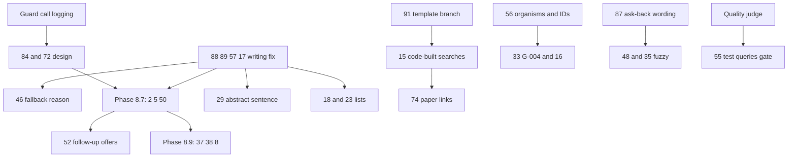

# Board plan

- The order in which every card on the board gets built
- What blocks what
- What the owner decides up front

Written 2026-10-05 from six read-only scout reports and seven diagnoses, all in `testing/Developer/reports/2026-10-05_board_plan/` and `testing/Developer/reports/2026-10-05_card*/`.

The test every step is ranked against, in the owner's words: a person types a question in natural language and gets an answer. A card that stops that comes before a card that degrades it, and both come before a card about a screen.

## Table of contents

- [Progress](#progress)
- [The answer in numbers](#the-answer-in-numbers)
- [Cards that close or change without a build](#cards-that-close-or-change-without-a-build)
- [The root causes](#the-root-causes)
- [Dependencies](#dependencies)
- [Waves](#waves)
- [How each change is checked](#how-each-change-is-checked)
- [Decisions for the owner](#decisions-for-the-owner)
- [Keeping the list from growing back](#keeping-the-list-from-growing-back)

## Progress

Newest first.

- 2026-10-08, overnight: cards 71 (part), 54, 101 (part), 103, 104, 67 and 59 are live and wait for the owner's retest (#202 to #208); cards 103 and 104 were filed from the product checks' loose ends. The guardrail design for cards 84 and 72 is written for the owner's yes or no and its two parked branches are deleted (`DECISIONS.md`, 2026-10-08).
- 2026-10-07, overnight: cards 22, 23 and 102 are live and wait for the owner's retest (#197 to #199); card 102 (a saved answer listed no sources) was found by card 22's product review and built the same night. Card 101's copied-cut fix is parked on `fix/card101-copied-cuts` for the owner's decision. Factory's next cards are 75, 24 and 100 (`DECISIONS.md`, 2026-10-07).
- 2026-10-06: cards 43, 43b, 44, 47 and 61 (Factory), 99 and part of 101 went live and wait for retest; card 56's smallest fix is live and the card stays open (#181 to #193).
- 2026-10-06: Factory resumes with a written brief, `docs/build/Factory_onboarding.md`: cards 43, 44 and 47, then 61, one at a time; cards 18, 23, 24 and 25 leave its lane (`DECISIONS.md`, 2026-10-06).
- 2026-10-06: card 56's remaining miss diagnosed (develop's plan model names nothing on some runs) and its fix built; card 99 measured on the full set and the owner said build it (`DECISIONS.md`, 2026-10-06).
- 2026-10-05, night: the Factory trial is paused. Its lane is provisional and its eight cards are pending, not being built, until the owner gives renewed instructions; its trial worktree and branch were removed with no work in them (`DECISIONS.md`, 2026-10-05).
- 2026-10-05, final test run: 9 of 10 passed on develop; card 56 (SARS-CoV-2) failed live although it passed locally, so it is back in To do for a diagnosis (`testing/Developer/reports/2026-10-05_final_test_queries/results.md`).
- 2026-10-05, late: a second development agent, Factory, takes the screen and wording lane: cards 43, 44, 18, 23, 24, 25, 47 and the rest of 61, each in its own worktree on a `factory/` branch. The lead keeps the answer path, this plan, the board and the merge queue (`DECISIONS.md`, 2026-10-05).
- 2026-10-05, evening: waves 0 and 1 and most of wave 2 are live on develop, plus wave 3's first steps, in pull requests #155 to #175 (21 merged).
  - In Retest: cards 46, 74, 79, 80, 86 to 89, 91, 92, the part of card 94 for the colistin search, the Plain language table and the searched-families note, 95 to 97, and the page sentences of 85.
  - Card 13 is proposed for closing.
  - New card 99 (dropped qualifiers) waits on a measurement.
  - Phase 8.7 waits on an OpenRouter top-up (about $38.50 left against its $60).
  - The guardrail design (cards 84 and 72) waits on a fuller day of guard-call logs.
  - D9 is decided: organisms resolve through NCBI Taxonomy, no semantic search.

## The answer in numbers

| Measure | Count |
|---|---|
| Cards in To do on 2026-10-05, after the clean-up | 64 |
| Close without a build: done, superseded, not reproducible or not seen by a user | 5 (39, 41, 13, 11, 32) |
| Close as a side effect of another card's build | 1 (4, with card 15) |
| Root causes behind the rest | 16 |
| Architecture discussions, scheduled rather than built | 2, plus the hybrid retrieval question |

The 64 cards are not 64 pieces of work. Sixteen root causes account for nearly all of them, so fixing a cause closes several cards at once. Five waves, with the waves' work running in parallel where the code does not overlap, take roughly three to four weeks. That estimate assumes each wave's test queries are run by agent runners in parallel, and that the decisions below are answered up front.

## Cards that close or change without a build

| Card | What happens |
|---|---|
| 39 | Done: `visualizations/System_3_deep_dive.md` is merged |
| 41 | Done in the tracked tree (pull request 109); only git history holds the address, and rewriting it is the owner's call |
| 13 | Superseded by 11.20: both MODY runs today returned the six genes; its "not yet confirmed" tail is card 88's cause |
| 11 | Not reproducible on 2026-09-25 or today; parked in `testing/Future.md` |
| 32 | No user would notice it; moves to `testing/Future.md`, and card 15 makes it moot |
| 4 | Moot once card 15 is built; kept only if card 15 is delayed |
| 16 | Narrowed: G-022 answers 3 of 3 since 2026-09-29; what remains is G-036 and G-005, inside card 56 |
| 23, 24 | Decided on 2026-09-25 in `DECISIONS.md`; the board's "your decision" was stale. They stay as builds, not decisions |

## The root causes

| Root cause, in plain words | Cards | Size |
|---|---|---|
| 1. The writing step writes a good answer and the check then deletes it; the fallback hides why | 88, 89, 57, 17, 46, 30 (disclosure half), blocks 2 | M, being built |
| 2. A record whose first field is a list is dropped; a gene family that can never match | 92, 94 colistin | S |
| 3. What was searched, and what failed, is said only under Show work, never in the answer | 94 note, 91 wording, 77 | S |
| 4. The guard model replies too slowly and the question gets no answer | 72, 84, the tail of 50 | M to L, design first |
| 5. The model writes its own graph search and it fails or answers a different question | 15, 91, 74, 33 (G-006), 4, 32 | L |
| 6. Understanding the question knows only genes, diseases, variants and PubMed numbers | 56, 16, 33 (G-004) | M |
| 7. One ask-back choice is wrong both ways: it asks clear short questions and never fuzzy long ones | 87, 48, 35 | S then M |
| 8. The first sentence never answers the question, the writer is not the strongest model, answers take over 20 seconds | 2, 5, 50, 14 | L, phase 8.7 resumed |
| 9. The records found never carry the field the question asked for | 37, 38, 30 (retrieval half) | M to L, phase 8.9 |
| 10. Plain language lists titles only, so an isolate shows no genes | 94 table, 38 | S |
| 11. An isolate answer leaves nothing for a follow-up to point at; one isolate is never looked up | 94 follow-up, 94 single isolate, 20 | M |
| 12. A reopened answer is a different record from the one read | 54, 67, 71, 59, 36 | M |
| 13. Several totals, unlabelled; the trust verdict varies | 22, 12, 8 | S to M |
| 14. Page wording and the facts checker | 51, 79, 80, 85, 47, 61 wording, 19 | S, one batch |
| 15. The citation chip on a phone and its contrast | 43, 44, then 25 | S |
| 16. No model judge for answer quality, so the test queries cannot gate | 9, 55, 42, 40 | M |

Cards outside these causes:

- 86 (license text, S)
- 18 and 23 (record list rows and the provenance note, S, after root cause 1)
- 24 (mode switch, S)
- 29 (the answering sentence from an abstract, M, after root cause 1)
- 75 and the rest of 61 (command line and agent bridge, M, needs a production release first)
- 52 (follow-up offers, M, after phase 8.7)
- The two architecture discussions, 6 and 7

## Dependencies

Two cards that change the same function are built one after the other; everything else runs in parallel. The functions that force an order: the grounding check and the citation map (root cause 1), `select_template` (91 then 15), `_ASK_BACK` (87 then 48), the guardrail (84 with 72), `write_node` (root cause 1, then phase 8.7, then 8.9), and the two page files (root cause 14, one batch).

## Waves

Wave 0, running now: root cause 1 (cards 88, 89, 57, 17) on `fix/card88-89-answers-survive`.

Wave 1, start at once, all in parallel, each in its own worktree. None touches the writing step:

| Build | Cards | Size |
|---|---|---|
| Records that are never dropped, and a test per record type against a real record | 92, 94 colistin | S |
| The ask-back description counts a subject plus a request as a question | 87 | S |
| A count question about a gene uses the checked graph search | 91 template | S |
| Log each guard call's time and provider | 72 logging | S |
| License text for every package, and CI fails on any missing one | 86 | S |
| The facts checker's two broken patterns | 51 | S |

Wave 2, after wave 0 merges:

| Build | Cards | Size |
|---|---|---|
| When no written answer survives, list what was found with citations and say why in one plain line | 46, the hidden note | S to M |
| Say in the answer what was searched and what failed | 94 note, 91 wording, 77 | S |
| The citation chip on a phone, and its contrast | 43, 44 | S |
| The page batch | 79, 80, 85, 61 wording, 47, 19 | S |
| Diagnose the 50-citation cap on reopened answers | 54 | S |
| A runner for the test queries, with exact checks first, since it automates the gate; model grading follows with card 9 | 55 runner | M |
| Record lists and the provenance note | 18, 23 | S |

Wave 3, the large answer-path work:

| Build | Cards | Size |
|---|---|---|
| Phase 8.7 resumed: the first sentence answers, records within seconds, the strongest writer | 2, 5, 50, 14 | L |
| The guardrail design, agreed with the owner, then built | 84, 72 | L |
| No model-written graph search except true count questions | 15, 74, 33 (G-006) | L |
| Understanding organisms, isolates and accessions | 56, 16, 33 (G-004) | M |

Wave 4:

| Build | Cards | Size |
|---|---|---|
| Phase 8.9: records carry the field asked for; the trust line says what was checked | 37, 38, 8, 30 | M to L |
| Isolates: the table in Plain language, follow-ups, one isolate, year and place | 94 table, 94 follow-up, 94 single, 20 | M |
| Fuzzy and off-topic questions | 48, 35 | M |
| The reopened answer matches the live one | 54, 67, 71, 59, 36 | M |
| Totals and the trust verdict | 22, 12, 24 | S to M |

Wave 5:

| Build | Cards | Size |
|---|---|---|
| The quality judge for the test queries, the verify loop | 9, 55 grading, 42, 40 | M |
| Follow-up offers at the end of every answer | 52 | M |
| The sentence from each paper's abstract that answers the question | 29 | M |
| The design system package | 25 | M |
| The agent bridge, after a production release carries the server field | 75, 61 rest | M |

Discussions, scheduled rather than built, each ending in a yes or no from the owner:

- Card 6, the agentic loop: a step that reads the tools' results and re-plans when something comes back empty or wrong. Owner's direction of 2026-09-23. After wave 3.
- Card 7 and hybrid retrieval: see the decision below. Before wave 3, because root cause 6 is where it would first be used.

## How each change is checked

The judge and the adversary are set aside on the owner's word of 2026-10-05. What stays:

- Every change: the CI gates' exact commands, and a unit test that fails on the old code.
- An answer-path change: five or more repeated live runs of its own questions before merge, and its test queries from `testing/Test_queries_and_workflows.md`.
- The gate, the owner's standard: the test queries in `testing/Test_queries_and_workflows.md` for every card in the wave, plus every query that passed the 2026-09-29 batch retest and touches the same code, run by agent runners on develop in the browser and through the API. No query that passed before may fail. If one does, the wave's changes are reverted one at a time to find the cause.
- The golden run is an alarm for an answering collapse, never a gate: its expected answers were never checked by an expert (the owner, 2026-09-26 and 2026-10-05).
- The lead's own look in the browser at each changed screen before a card reaches Retest.

## Decisions for the owner

Decided by the owner on 2026-10-05:

| # | Decision | Answer |
|---|---|---|
| D1 | When no written answer survives, show one plain line saying why, reversing the 2026-09-21 choice to hide it | Yes |
| D2 | A short question that names a subject and what is wanted ("recent-onset diabetes treatment") is answered, and query 76's expectation is amended | Yes |
| D3 | What gates a wave | The test queries document, not the golden run, which "was just a hypothetical benchmark not validated" |
| D4 | The itemised change to two pattern lines under `.claude/` for the facts checker | Yes |

Needed before wave 3:

| # | Decision | Recommendation |
|---|---|---|
| D5 | No model-written graph search except true count questions | Yes |
| D6 | One guardrail design for 84 and 72 in which a refusal beats an admit on every guard call, decided after a week of guard-call logs | Yes |
| D7 | Resume phase 8.7 with the strongest writer model, after waves 0 to 2 | Yes |
| D8 | The 20 second target is for nine answers in ten, not the median | Yes |
| D9 | Hybrid retrieval: try semantic matching of a person's words to graph concepts (organisms, diseases, accessions), measured on the questions that fail today, versus keeping exact matching only | The lead recommends the trial; the 2026-09-23 scoping found no measured need for vectors. Both positions are in `w6_architecture.md` and `w2_think_and_search.md` |

Needed before wave 4, recommendations taken unless the owner objects:

| # | Decision | Recommendation |
|---|---|---|
| D10 | Open phase 8.9 | Yes, the rs334 filter first |
| D11 | Plain language shows an isolate table with genes, an exception to rule 12.9 | Yes |
| D12 | The year and place in an isolate question are read by a classifier decision, and the parked fixed-pattern parser is dropped | Yes |
| D13 | Jev decides what counts as a fuzzy question; the relevancy decision always runs after an answered question | Yes |
| D14 | One unit for totals: "N sources" means distinct records everywhere | Yes |
| D15 | Card 30 keeps its list, says plainly that classification was not retrieved, and its trust verdict is "ask" | Yes |
| D16 | Card 71: the saved copy is right about the "could not be verified" note | Yes |
| D17 | Card 67: the outage note is dated when the answer is saved | Yes |
| D18 | Card 59: an answer that finished before Stop arrived stands | Yes |
| D19 | Card 33, G-004: answer with what is findable rather than asking for a resistance gene | Yes |
| D20 | Card 47: edit the local copy of the design prototype | Yes |
| D21 | Card 24: switching the mode on an answer re-runs the question and uses one of the day's questions, with that cost shown | Yes |

Later, each when its wave opens:

- A production release for card 75's server field
- The spend cap for card 55's first baseline run
- Whether to rewrite git history for card 41 (recommendation: no)

## Keeping the list from growing back

- A review finding reaches the board only if a person would notice it (`DECISIONS.md`, 2026-10-05).
- A new card that is not a user-visible regression joins the last wave, not the front of the queue.
- The plan is re-ordered once a week, not each time a card arrives.
- A card closes when its root cause's build merges and its test queries pass, so one build can close several cards in one step.
