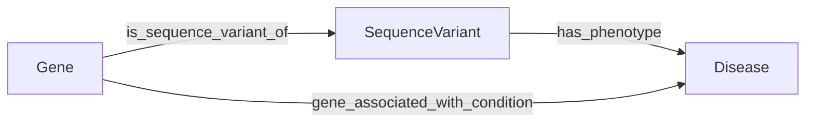
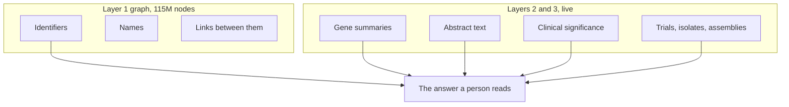

# Hard edges and soft edges: what the numbers say before we pick a technology

Fix-plan item 11.29, scoped on the night of 2026-09-22 into 2026-09-23. This is
a document and not a build. It exists to establish the question before anyone
answers it.

The ask, in the product owner's own words: think big about connecting the dots.
If everything were in the knowledge graph, from PubMed literature to sequence,
clinical and PubChem data, how do we find hard edges (direct relationships) and
soft edges (indirect, through multi-hop)? Do we need RAG pipelines, vector
embeddings, a hybrid knowledge-graph model?

The bar it has to clear, also theirs: not "does it cite" but "is it worth
reading instead of a general chatbot".

Vector embeddings, a RAG pipeline and a hybrid graph are three answers. Every
number in this document was measured from material this repository already
holds, before any of the three is discussed, because a recommendation with no
count behind it is an opinion. The counts turned out to point somewhere none of
the three names.

## Table of contents

- [The short version](#the-short-version)
- [What was counted, and against what](#what-was-counted-and-against-what)
- [Count one: hard edges alone answer twenty of thirty-seven](#count-one-hard-edges-alone-answer-twenty-of-thirty-seven)
- [Count two: five questions need two hops, and they all walk the same path](#count-two-five-questions-need-two-hops-and-they-all-walk-the-same-path)
- [Count three: twelve questions need data the graph does not hold](#count-three-twelve-questions-need-data-the-graph-does-not-hold)
- [The fact that reframes the whole question: the graph holds no values](#the-fact-that-reframes-the-whole-question-the-graph-holds-no-values)
- [Count four: where answers actually fail today](#count-four-where-answers-actually-fail-today)
- [The two constraints any proposal has to live inside](#the-two-constraints-any-proposal-has-to-live-inside)
- [The three named answers, measured](#the-three-named-answers-measured)
- [Soft edges nobody has asked for yet](#soft-edges-nobody-has-asked-for-yet)
- [What was not checked](#what-was-not-checked)
- [Options, ordered, for the product owner](#options-ordered-for-the-product-owner)

## The short version

Six things, in the order they change what a person typing a question gets.
Points two and three were rewritten on 2026-09-23 after the planner ran the
live graph probe this document's coverage section had asked for.

- The graph is an index of identifiers and links, not a store of facts. A Gene
  vertex carries seven properties and not one of them says anything about the
  gene. Every sentence of content in every answer comes from a live API call at
  query time. "Put everything in the graph" as currently modelled would add
  more identifiers, not more content, and would not move the bar.
- The one human-readable field the graph does have holds the wrong value for
  diseases. Measured graph-wide on 2026-09-23: zero `Disease` vertices anywhere
  have "syndrome" in their name, and zero have "marfan". The `name` property
  holds a source vocabulary label such as `GARD`, `MONDO` or `SNOMEDCT_US`. No
  disease can be found by name in the graph, ever.
- Five golden questions got zero graph rows on all three passes of the most
  recent measurement, and they split two ways. Four target hops a live probe
  showed returning tens of rows in under 1.5 seconds, so those are probably a
  defect, and all four already answer from live NCBI so nobody sees it. The
  fifth, G-022, was probed on 2026-09-23 and is different in kind: the query is
  correct and the data is absent, so it refuses "I could not find evidence"
  every time about a disease MedGen describes in detail. That refusal is a
  false statement rather than a gap, and it is the worst thing in the set.
- Soft edges are barely asked for. Across the fifty golden questions, five need
  a path of two or more hops. All five walk the same single path. That path is
  already hardcoded as three templates. Nothing needs three hops.
- The reason answers read as surface level is not retrieval and not topology.
  It is the grounding gate. Measured on 2026-09-21: against a long free-text
  source the gate accepts a verbatim excerpt and rejects a faithful paraphrase.
  The product is structurally able to quote and structurally unable to explain.
- Of the three technologies named in the ask, the motivating count for vector
  embeddings on the retrieval path is zero among the questions we measure, the
  motivating count for a RAG pipeline is close to zero for the same reason, and
  the only one with a real count is the hybrid idea, in a form that belongs to
  the data-engineering repository rather than this one.

## What was counted, and against what

Three sources, all already in the repository, none generated for this document.

| Source | What it is |
|---|---|
| `eval/golden/golden_dataset.json` | The 50 golden questions, version 2, each pinning what it must resolve and cite |
| `testing/Developer/reports/2026-09-22_10.3_consistency/` | 150 runs, three passes of each golden question against develop at commit `63ec316` |
| `src/system_03_search_agent/tools/graph_schema_constants.py` | The authoritative 11 vertex labels and 14 edge predicates, verified against the live graph on 2026-07-29 |

Two more were used to check the first three: the live graph probe of
2026-09-14 (`2026-09-14_handover_inputs/breadth/graph_probe.jsonl`), which ran
every single-hop template against the real graph, and the call-ceiling
measurement of 2026-09-22 (`2026-09-22_call_ceiling/`).

The denominator matters and it is not fifty. Thirteen of the fifty golden
questions are meant to refuse, ask or flag: a bare number, a prompt injection,
a request for medical advice, a BLAST job, a fake gene. They are not about
edges at all. Thirty-seven expect an answer, and that is the denominator for
every count below.

The three counts are mutually exclusive by design, so they sum: 20 plus 5 plus
12 equals 37. Each question is placed by the binding constraint on answering
it. Overlaps are stated where they exist.

## Count one: hard edges alone answer twenty of thirty-seven

Twenty questions are answerable from vertex records and single direct edges,
all of it inside the graph's own five databases.

| Id | Question, abbreviated | Edge it needs |
|---|---|---|
| G-010 | BRCA1 variant of uncertain significance, what does the evidence say | is_sequence_variant_of |
| G-011 | Diseases associated with BRCA1 and BRCA2 | gene_associated_with_condition |
| G-013 | What diseases are linked to brca1 | gene_associated_with_condition |
| G-016 | Known orthologs of TP53 | orthologous_to |
| G-017 | Biological processes BRCA1 is involved in | participates_in |
| G-018 | Where in the cell TP53 is located | located_in |
| G-019 | MeSH terms assigned to PMID 11237011 | has_mesh_annotation |
| G-020 | Which organism the gene CFTR belongs to | in_taxon |
| G-021 | Papers mentioning CFTR | mentioned_in |
| G-022 | Phenotypic features of Marfan syndrome | has_phenotype, and see below: the edge is empty |
| G-023 | Clinically significant variants in CFTR | is_sequence_variant_of |
| G-026 | Genes associated with cystic fibrosis | gene_associated_with_condition |
| G-028 | Evidence linking APOE to late-onset Alzheimer | gene_associated_with_condition, mentioned_in |
| G-029 | Genes associated with Li-Fraumeni syndrome | gene_associated_with_condition |
| G-031 | Molecular activity of the KRAS gene product | actively_involved_in |
| G-032 | Pathways PTEN participates in | participates_in |
| G-033 | Compare MLH1 and MSH2 in colorectal cancer risk | gene_associated_with_condition, twice |
| G-034 | How many genes are associated with breast cancer | gene_associated_with_condition, counted |
| G-039 | Explain in plain terms what BRCA1 does | the Gene record itself |
| G-050 | The same question as G-013, in German | gene_associated_with_condition |

Twenty of thirty-seven, or 54 percent, need nothing more than one direct
relationship. That is the single largest group, and it is the group where the
product already works: eighteen of these twenty answered on all three passes.

Two of them did not, and what is wrong with each is different in kind. That
difference is the first thing that should change what gets built.

### The hard edges that are not landing

The live graph probe of 2026-09-14 ran each hop against the real graph and
recorded the rows it returned:

| Hop | Anchor | Rows returned | Median seconds |
|---|---|---|---|
| participates_in | BRCA1 | 54 | 0.72 |
| actively_involved_in | BRCA1 | 27 | 0.55 |
| located_in | BRCA1 | 24 | 1.42 |
| participates_in | GCK | 27 | 0.58 |

The consistency run of 2026-09-22 asked the golden questions that target
exactly those hops. Each made one `cypher_query` call. Each came back with
`status: empty`, zero rows, no tool error, on all three passes:

| Id | Hop it targets | Graph rows, three passes | What the person got |
|---|---|---|---|
| G-017 | participates_in | 0 / 0 / 0 | An answer, built entirely from live NCBI |
| G-018 | located_in | 0 / 0 / 0 | An answer, built entirely from live NCBI |
| G-031 | actively_involved_in | 0 / 0 / 0 | An answer, built entirely from live NCBI |
| G-032 | participates_in | 0 / 0 / 0 | An answer, built entirely from live NCBI |
| G-022 | has_phenotype, Disease to PhenotypicFeature | 0 / 0 / 0 | "No evidence", three times out of three |

Four of the five were rescued by Layer 2, so nobody saw a failure. G-022 was
not. A person asking what Marfan syndrome looks like is told there is no
evidence, on every attempt.

The first draft of this document offered two candidate mechanisms for all five,
a shape-keyword miss and a two-shape ambiguity, and said one probe of Marfan's
`has_phenotype` edge would settle G-022 in a second. The probe was run on
2026-09-23 (`probe_g022.py` and `probe_disease_names.py`, both committed in this
folder). It settled it, and against both candidates. They are named here as
ruled out rather than quietly dropped, because a wrong diagnosis that
disappears is worse than one that is corrected.

### G-022: ruled out as a routing defect, and it is worse than one

The query is built correctly. The data is absent, for two independent reasons
either of which is sufficient:

- No `Disease` vertex in the graph has an outgoing `has_phenotype` edge at all,
  graph-wide, with no filter. The 6,076,735 `has_phenotype` rows are all
  `SequenceVariant` to `Disease`, which `graph_schema_constants.py:108` already
  recorded from the 2026-09-14 work.
- Every `PhenotypicFeature` vertex sampled is an unpopulated stub of the shape
  `[stub] HP:0000002`, with `source` reading `stub` and an empty `source_url`.

So `cypher_templates.py:253`, the `("Disease", "phenotypes")` hop, is a shipped
template that cannot return a row for any input. Both halves of this were
already in `graph_schema_constants.py` and nobody had joined them: line 87
declares the primary pair `("Disease", "PhenotypicFeature")` and line 108
records the measured pair `("SequenceVariant", "Disease")`, with a comment
explaining that widening the primary pair "would silently drop the
Disease-to-PhenotypicFeature expansion". That expansion does not exist.

From the person's chair this is the worst failure in the whole set, and it is
worse than a defect. The refusal says "I could not find evidence", which a
reader hears as "nothing is known about what Marfan syndrome looks like".
MedGen carries plenty. The product is making a false statement about the world
because it asked the graph a question the graph cannot hold.

### The other four remain unexplained, and the two candidates are still live for them

The probes covered Marfan, FBN1 and sampled Disease and PhenotypicFeature
vertices. They did not touch `participates_in`, `located_in` or
`actively_involved_in`. For G-017, G-018, G-031 and G-032 the contradiction
stands exactly as measured: the 2026-09-14 probe returned 54, 27 and 24 rows
for those hops on BRCA1 in under 1.5 seconds, and the 2026-09-22 run got zero
from the same shapes. The shape-keyword and ambiguity candidates remain the
best explanations and remain untested.

One further constraint bears on those four, measured live on 2026-09-20: the
graph rejects relationship-type alternation, so `[:a|b|c]` fails with a
SyntaxError although the offline validator accepts it. That is why the GO
breadth template traverses `participates_in` alone and why molecular activities
and cellular components are not reached at all.

So the count splits. One of the five zero-row cases is absent data and is not
fixable here. Four are probably a defect, all four already answer from Layer 2,
and what they would gain is graph citations rather than an answer where there
was none. That is a materially smaller prize than the first draft claimed, and
[Options](#options-ordered-for-the-product-owner) below is re-costed for it.

## Count two: five questions need two hops, and they all walk the same path

Five questions strictly require a path of two or more hops where both edges
exist in the graph.

| Id | Question, abbreviated | The path |
|---|---|---|
| G-002 | Everything NCBI knows about BRCA1, including variants and their conditions | Gene to SequenceVariant to Disease |
| G-003 | Lynch syndrome: causal genes, condition record, clinical variants | Disease to Gene to SequenceVariant |
| G-025 | What the MTHFR C677T variant does | SequenceVariant to Gene to process |
| G-030 | EGFR mutations in non-small cell lung cancer | Gene to SequenceVariant to Disease |
| G-040 | Full technical detail on BRCA1 variant classification evidence | Gene to SequenceVariant to Disease |

Four of the five walk the same pattern and the fifth is its mirror:



No golden question needs three hops. No golden question needs a second distinct
two-hop pattern. And this one pattern is already built: `cypher_templates`
carries `gene_variant_diseases_one`, `gene_variant_disease_link` and
`disease_genes_*` with its variant fallback, all added on 2026-09-14 after the
live measurement that proved the SequenceVariant to Disease edge exists.

So the count that would motivate a general multi-hop traversal engine is one
path shape, and that shape already ships. Stated plainly because the brief asks
for it: building a general traversal engine for the demand this dataset
records would cost real work and buy nothing that is not already there.

The honest caveat is in [What was not checked](#what-was-not-checked), and it
is a large one: the golden set was written to pin the shapes the product
already handles, so counting hops in it measures what was asked for rather than
what a researcher would want.

## Count three: twelve questions need data the graph does not hold

Twelve questions cannot be answered from the graph at all, whatever the
traversal. What is missing is data, not technology.

| Id | What it asks for | What is missing from the graph |
|---|---|---|
| G-001 | Genes, dbVar and ClinVar records overlapping a GRCh38 window | Genomic coordinates, and dbVar entirely |
| G-004 | A Salmonella isolate's SNP cluster, AMR genes and near neighbours | Pathogen Detection isolates, BioSample |
| G-005 | SRA runs of SARS-CoV-2 on Illumina from respiratory samples | SRA runs and their metadata |
| G-006 | What sequence data, BioProjects, GEO series and assemblies link to a PMID | BioProject, GEO, Assembly, and the ELink relationships |
| G-007 | A BioProject's BioSamples, SRA runs and assemblies | BioProject, BioSample, SRA, Assembly |
| G-012 | Clinical trials for carcinoma not otherwise specified | ClinicalTrials.gov |
| G-024 | What rs334 is and what condition it carries | An rs number as a key; SequenceVariant is keyed on ClinVar ids |
| G-027 | Genetic tests available for Huntington disease | GTR |
| G-035 | E. coli isolates carrying ESBL genes | Pathogen Detection |
| G-036 | Available M. tuberculosis genome assemblies | Assembly and Datasets |
| G-037 | GEO expression datasets studying TP53 | GEO |
| G-038 | The tree of life | Taxon to taxon hierarchy; `in_taxon` goes Gene to OrganismTaxon and stops |

Four of the five multi-hop questions in count two also need one outside source:

- G-002: GTR, for the genetic tests half.
- G-003: ClinicalTrials.gov, for the current trials half.
- G-030: ClinicalTrials.gov, for the recruiting trials half.
- G-025: a judgement about evidence quality, which exists in no database at any
  layer.

So sixteen of thirty-seven questions touch something the graph does not carry.

Most of these are already served by Layer 2 and Layer 3 tools, which is why
six of the twelve answer at least sometimes today: G-004, G-006, G-012, G-024,
G-027 and G-037. The six that never answer are G-001, G-005, G-007, G-035,
G-036 and G-038. Pathogen Detection work landed on 2026-09-22, so G-035 is
being worked already.

The point for 11.29: this count is a question about which databases have tools,
not about hard and soft edges. Putting these databases into the graph would be
Systems 1 and 2 work in the other repository, forbidden here by
`.claude/rules/file-protection.md` by direction of data flow, and it is not
what would make these questions answerable anyway. What makes them answerable
is a tool, which several of them now have.

## The fact that reframes the whole question: the graph holds no values

This is the finding I did not expect and it changes what "if everything were in
the knowledge graph" would actually buy.

Here is a real Gene vertex, read off the live graph on 2026-09-14, in full:

```json
{"id": "NCBIGene:672",
 "name": "BRCA1 DNA repair associated",
 "xrefs": "HGNC:1100|OMIM:113705|ENSEMBL:ENSG00000012048",
 "source": "NCBI Gene",
 "agent_type": "",
 "source_url": "https://www.ncbi.nlm.nih.gov/gene/672",
 "knowledge_level": ""}
```

Seven properties. An identifier, a label, some cross-references, a provenance
tag, a link. Not one of them says anything about BRCA1. There is no summary, no
sequence, no coordinates, no function text, no clinical significance. The same
is true of every other label: a SequenceVariant carries its HGVS name and its
ClinVar link, and nothing about what the variant does.



The graph is a navigation index. Every sentence of content in every answer is
fetched live, at query time, from an API. That is why the citation split over
the 86 answered runs looks the way it does: 2,957 Layer 1 citations against
1,173 Layer 2 and 618 Layer 3. The graph supplies most of the links and almost
none of the words.

### And the one readable field it does have holds the wrong value

The probes of 2026-09-23 sharpened this further, and this is the strongest
single piece of evidence in the document.

The graph has exactly one human-readable property, `name`. For `Disease`
vertices it does not hold the disease name. It holds the name of the source
vocabulary the row came from.

| Probe | Result |
|---|---|
| `Disease` vertices whose name matches `marfan`, case-insensitive | Zero, graph-wide |
| `Disease` vertices whose name matches `syndrome`, case-insensitive | Zero, graph-wide |
| The 8 diseases FBN1 links to | Named `GARD`, `MONDO` and `MedGen` |
| Three arbitrary `Disease` vertices | Named `SNOMEDCT_US`, `MedGen`, `MeSH` |
| `Gene {id: NCBIGene:2200}` | Correct: `fibrillin 1` |

A graph carrying MedGen's 200,845 diseases in which not one vertex has
"syndrome" anywhere in its name is not a graph with patchy names. The field
holds the wrong value everywhere. Ids and `source_url` values are correct, so
the navigation index is sound; it is the words that are absent.

Two things follow that are worth saying out loud.

- No disease can be found by name in the graph. Any disease-name lookup has to
  go to Layer 2, and any code matching on `Disease.name` is matching a
  vocabulary label.
- This is a plausible root cause for the `MedGen:C0346153` defect that reversed
  the build ordering on 2026-08-31, where an answer named a disease by its
  identifier. Build phase 6.2 closed it by adding a two-call Layer 2 resolution
  path (ESearch on `[ConceptId]`, then ESummary). That fix was correct, and
  this measurement is why it was unavoidable rather than a workaround.

One correction to the record, because the difference changes what to do next.
This was NOT unknown. It is filed as F-2.1-B07, "Vocabulary artifacts shipped
as asserted primary evidence", raised at build phase 2.1's second adversary
pass and still open. `core/graph.py` carries `_is_vocabulary_token_artifact`
specifically to detect it, and finding F-2.1-J5-04 in the same comment block
records an exhaustive census of all 200,845 `Disease` rows on 2026-07-31 naming
seven leaked vocabulary tokens with their row counts. `tracker/BOARD.md` says
build phase 6.2 found the root cause "ALREADY RECORDED in this codebase as
F-2.1-B07".

What the 2026-09-23 probe adds is the graph-wide form, which removes any
reading that some names are fine, and the join to the dead template below. What
it does not add is discovery. The constraint has never been knowing; it is that
nothing in this repository is allowed to fix it, which is exactly what
`.claude/rules/file-protection.md` predicts and is the blocked stop to hand
over.

The same defect reaches at least one label beyond `Disease`. From the
2026-09-14 probe file, an `OntologyClass` vertex reads
`{"id": "MeSH:D000595", "name": "[MeSH] D000595"}`, the ETL stub form. That
matters because golden question G-019 asks which MeSH terms a paper carries,
sits in count one as a healthy hard-edge question, returns 26 Layer 1 rows and
answers on two of three passes. Whether a person sees terms or identifiers is
not established here and is one live run away from being known.

### Three consequences for the ask

- "If everything were in the graph" as the graph is modelled today would mean
  more identifiers and more links, not more to say. It would widen what can be
  found and would not change how much is worth reading. The product owner's
  verdict that answers look surface level is, in part, a direct consequence of
  this modelling choice.
- Every content fact costs an API call, and the call budget is nearly full
  (below). Depth in the answer and depth in the traversal compete for the same
  twenty calls.
- The version of "hybrid knowledge-graph model" with a real motivating count is
  not graph plus vectors. It is graph plus values: storing the gene summary,
  the abstract text and the clinical significance next to the identifier, so
  the answer has something to say without spending a call to find it out. Its
  cheapest first instalment is not new data at all, it is putting the right
  string in the `name` field that already exists. That is a Systems 1 and 2
  decision, in the other repository.

## Count four: where answers actually fail today

From the 150-run consistency measurement, restricted to the thirty-seven
questions that expect an answer.

| Outcome | Questions |
|---|---|
| Answered on all three passes | 25 |
| Answered on some passes | 5 (G-003, G-006, G-012, G-019, G-027) |
| Never answered | 7 (G-001, G-005, G-007, G-022, G-035, G-036, G-038) |

Of the seven that never answer, six fail because the data is not reachable and
one, G-022, fails because a declared relationship in the schema holds no rows
at all. Not one of the seven
fails because the right record could not be matched to the person's words. That
number matters for the embeddings question below and it is zero.

Three more measures worth carrying into any proposal:

- Citation coverage against what each row pins: 127 of 172, or 74 percent, over
  the answered runs. A quarter of what a question says it must cite does not
  appear.
- Latency: median 11.8 seconds, p90 30.5 seconds, worst 110.1 seconds. The four
  runs over sixty seconds are all G-039, the plain-terms student question.
- Stability: 42 of 50 questions gave the same outcome on all three passes,
  eight did not. The instability is in the data path, not the wording: G-003
  returned 12 graph rows twice and zero once with nothing else changing, which
  is the L-01 defect already recorded.

And the one that sets the bar, measured on 2026-09-21 and unchanged in the code
tonight. `ground_claim` accepts a sentence against its source only when one
string contains the other after normalization. Against a short structured
value this works well and is how ordinary answers are built. Against a long
free-text source such as a PubMed abstract, only a verbatim contiguous excerpt
can pass. A faithful paraphrase that introduces no new word at all, merely
reordering the abstract's own words, is stripped. Nineteen candidate sentences
were run through the real gate. Three survived. All three were literal
excerpts.

That is the mechanism behind "the answers all look surface level". It is not
that synthesis is written badly. Anything other than restatement is deleted
before it reaches the page.

## The two constraints any proposal has to live inside

### The twenty-call ceiling, and the trap inside it

`harness/call_budget.py` allows at most twenty Layer 2 and Layer 3 calls per
query, measured and deliberately kept at twenty on 2026-09-22.

The consistency run appears to show enormous headroom: over its 86 answered
runs the maximum number of tool calls is 10 and the median is 9. That reading
is wrong, and anyone proposing a feature from that number will get it wrong the
same way. The consistency run counts `tool_start` events on the stream. The
budget charges at the transports, which also see Think's live confirmation of
every gene symbol, disease mention and organism, and Write's MedGen name
resolution, none of which ever appears as a `tool_start`.

Counted where it is actually charged, the worst observed cold pass spends 17 of
20, and the theoretical cold worst case is above 20. The headroom is three
calls, not ten.

The corollary is the useful half, and it is the single most actionable
architectural fact in this document. `harness/call_budget.py` states in its own
docstring that Layer 1 is out of scope of the ceiling by Section 21.3's
wording. A deeper graph traversal costs nothing against the budget.

Going deeper in the graph is free. Going wider in the APIs is not.

### The cite-or-refuse gate, which is where connect-the-dots designs die

`production-standards` makes this non-negotiable and it is not a preference:
every claim carries an inline citation to a specific retrieved record, and a
citation-grounding check decides accept or reject by deterministic rule, never
by a fuzzy similarity threshold, because a fuzzy accept silently passes a
hallucinated quote.

A soft edge is, by construction, a claim about a relationship no single record
asserts. "BRCA1 and PALB2 both appear in papers about homologous recombination
repair" is not written down in any record; it is a conclusion drawn from a
path. Under the gate as it stands, such a sentence has nothing to be checked
against and is stripped.

There are exactly two honest ways through this, and both are product decisions
rather than engineering ones.

- Cite the path, not the conclusion. State each hop as its own claim against
  its own record, and let the layout show the chain. A person sees "BRCA1
  appears in PMID 10026184 [1]" and "PMID 10026184 is annotated with
  homologous recombination [2]" side by side, and draws the conclusion
  themselves. This is safe, it is deterministic, it fits the existing gate with
  no change, and it is genuinely more than a chatbot gives, because every step
  is checkable. It is also more work to read.
- Change the gate. Relax contiguity for long free-text sources and add a second
  deterministic control to replace what contiguity was doing. That was measured
  on 2026-09-21 and the naive version fails: with contiguity dropped and the
  content-token allowlist alone, three of four attempted reorderings shipped
  sentences whose every word was licensed and whose meaning was wrong. A
  similarity score cannot be the replacement, because the rule forbids a fuzzy
  accept. A structured claim, where the model emits subject, predicate, object
  and source id and each field is checked against the record separately, could
  be, and stays deterministic.

## The three named answers, measured

### Vector embeddings

Motivating count on the retrieval path: zero.

Of the seven questions that never answer, not one fails because the right
record could not be matched to the person's words. Six fail because the data is
not reachable and one fails on an empty hard edge. Entity resolution is
already exact-identifier-first with every model-extracted span live-confirmed,
and the golden set's resolution failures are deliberate ones it pins on
purpose: a fake gene, a discontinued record, a forged processing header.

Motivating count as a grounding control: zero, and the rule forbids it anyway.
`production-standards` is explicit that acceptance is by deterministic rule and
never by a fuzzy similarity threshold. An embedding similarity score is exactly
the fuzzy accept that rule names. It could rank repair suggestions; it can
never gate acceptance.

This one costs nothing to skip, and that is written down here as the brief
asks.

### A RAG pipeline

Motivating count: close to zero, for a reason worth stating precisely.

The product already does retrieval-augmented generation. It retrieves PubMed
abstracts, PubTator annotations, LitVar records, gene summaries, trial records
and graph rows, and it synthesizes an answer from them with inline citations.
Whole abstracts became citeable on 2026-09-20. What a conventional RAG pipeline
would add over that is chunking and vector recall over a document store, and
the measurement says recall is not where this fails: the retrieval lands, and
then the gate deletes everything except direct quotation of it.

Building a better retriever in front of a gate that forbids explaining what was
retrieved would make no observable difference to a person typing a question.
That is the constraint, and optimizing a non-bottleneck is the failure this
repository's own `attack-the-constraint` rule exists to prevent.

### A hybrid knowledge-graph model

This is the one with a real count, and the phrase usually means something
different from what the numbers point at.

If "hybrid" means graph plus vector index: see above, count zero.

If "hybrid" means the graph storing values beside identifiers, so that a Gene
vertex carries its summary and a SequenceVariant carries its clinical
significance, then the count is every answered question. All 86 answered runs
spend Layer 2 calls on content the graph could have held, against a budget
whose worst observed cold pass is already 17 of 20. This would cut calls, cut
latency, and give the answer something to say without a round trip.

It is also not this repository's to build. Writing into the graph is Systems 1
and 2, in the data-engineering repository, and `.claude/rules/file-protection.md`
forbids it here by direction of data flow. The right output of this discussion,
if the product owner wants that, is a request to the other repository with the
measurement attached, not a ticket here.

## Soft edges nobody has asked for yet

Count two is five two-hop questions out of thirty-seven. That number could be
read as "soft edges do not matter", and that reading would be wrong, so it is
worth saying why. The golden set was written to pin what the product already
handles. Counting hops in it measures the demand that was written down, not the
demand that exists.

Here are soft edges the current graph could express, that no golden question
asks for, and that a researcher plausibly would. Each is two or three hops over
edges that exist today, and each costs zero against the call ceiling because
Layer 1 is outside it.

The verdict column is the revision the 2026-09-23 probes forced. The first
draft listed all six as available. One is dead and two are degraded, for the
same reason: a hop whose far end is an unnamed vertex returns identifiers, and
an answer made of identifiers is the `MedGen:C0346153` defect again.

| Shape | The path | What a person would type | Verdict |
|---|---|---|---|
| Literature co-mention | Gene to Article to Gene | "Which other genes turn up in the same papers as BRCA1?" | Available. `Gene.name` and `Article.name` are both correct |
| Shared mechanism | Gene to BiologicalProcess to Gene | "What else does double-strand break repair?" | Available. GO names are correct, for example "double-strand break repair via homologous recombination" |
| Citation lineage | Article to Article, via cited_in | "What did this paper build on?" | Available. Article titles are real |
| Topic neighbourhood | Gene to Article to MeSH term | "What subjects is the CFTR literature actually about?" | Degraded. `OntologyClass.name` reads `[MeSH] D000595`, so it returns codes unless a Layer 2 call resolves them |
| Model organism evidence | Gene to ortholog to Disease | "Has anything been linked to the mouse version of this gene?" | Degraded. The Disease end is unnamed, so it needs the build phase 6.2 resolution path |
| Phenotype overlap | Disease to PhenotypicFeature to Disease | "What else presents like Marfan syndrome?" | DEAD. No Disease has an outgoing `has_phenotype` edge and every PhenotypicFeature is a stub |

One shape is available that the first draft missed, and it is the strongest of
the set because both ends are correctly named and the edge is densely
populated: variant-level condition overlap, `SequenceVariant` to `Disease` and
back, which is the real `has_phenotype`. HNF1A alone has 2,075 such rows over
1,158 variants and 36 diseases. "Which other conditions are asserted for
variants in this gene" is already half built as `gene_variant_diseases_one`.

Four of the fourteen edge labels are used by no template at all today:
`cited_in` with 3,924,906 rows, `subclass_of` with 2,832,513, `close_match`
with 410,000 and `exact_match` with 970. `cited_in` and `subclass_of` between
them are the entire basis for citation lineage and for ontology
generalization, and nothing in the product reads either.

That gap is cheap to close where the names hold: each shape is one more
single-edge Cypher call, free under the ceiling, against a graph that answers a
labelled hop in roughly 0.1 to 1.5 seconds. It needs no new technology
whatsoever. The three degraded and dead rows are a reminder that a traversal is
only as useful as the words at its far end, which is the same constraint as the
central finding above rather than a separate one.

One mechanical constraint to respect when building any of them, measured live
on 2026-09-20: the graph rejects relationship-type alternation. Both
`[:a|b|c]` and `[:a|:b|:c]` fail with a SyntaxError, although the offline
validator accepts them. Each edge is its own call. That is why the GO breadth
template traverses `participates_in` alone today and why molecular activities
and cellular components are not reached, which is very likely part of why
G-018 and G-031 show zero graph rows.

## What was not checked

Per `.claude/rules/goal-contracts.md`, a verify surface has to state its own
coverage. Here is what would change the conclusions above.

- I did not query the live graph myself. Every graph figure in the first draft
  came from the 2026-09-14 probe file and the reference document. The planner
  then ran the one probe this section had asked for, and it overturned the
  G-022 diagnosis. That is recorded above rather than silently absorbed, and it
  is the clearest evidence that this section is the useful half of the
  document: the thing I named as unchecked was the thing that was wrong.
- The 2026-09-23 probes cover Marfan, FBN1, three arbitrary `Disease` vertices,
  sampled `PhenotypicFeature` vertices, and two graph-wide name regex checks.
  They do NOT cover every disease, and they do not touch `participates_in`,
  `located_in` or `actively_involved_in` at all.
- So the mechanism behind FOUR of the five zero-row hops is still unconfirmed.
  G-017, G-018, G-031 and G-032 remain a contradiction between two
  measurements with two named, untested candidate causes. The fix depends on
  which it is, and if it turns out to be absent data rather than routing then
  option three below collapses to nothing.
- The `OntologyClass` naming claim rests on one vertex in a probe file, not on
  a graph-wide check. If MeSH names are correct in general and that row was an
  outlier, the topic-neighbourhood shape moves from degraded back to available
  and G-019 needs no attention.
- I did not open a live answer for any question. Whether a person actually sees
  `[MeSH] D000595` on the G-019 answer page, or a resolved term, is not
  established. One live run settles it.
- I did not run the consistency questions myself. Every outcome, latency and
  row count is read from `runs.jsonl` as another session recorded it.
- The two-hop count of five is a count over a dataset that was designed around
  the product's existing shapes. It measures recorded demand, not real demand.
  If the product owner's view is that the golden set is a first attempt rather
  than a settled target, which is exactly what the evaluation track was parked
  for on 2026-08-31, then count two should be treated as a floor and not as an
  estimate. The section above on soft edges nobody has asked for is my attempt
  to say what the count is missing, but it is my judgement and not a
  measurement.
- I classified each question by hand into one of three buckets. The
  classification is auditable from the tables and the rule is stated, but
  another reader could reasonably move a question or two. G-021 is the closest
  call: I placed it in count one because "what do the papers cover" is
  answerable from article titles, and it belongs in count two if it should be
  answered from MeSH terms instead.
- I did not measure cost. Every recommendation below is argued on latency,
  calls and what a person sees, and none of them on dollars.
- I did not test any proposal. Nothing here has been built or prototyped, by
  design, because 11.29 is a discussion that precedes a build.
- I did not look at what happens under load or concurrency, and the consistency
  run itself was deliberately run at concurrency two to avoid tripping the NCBI
  pool. A multi-hop feature that adds graph calls is free against the API
  ceiling but is not free against wall-clock latency, and the p90 is already
  30.5 seconds.

## Options, ordered, for the product owner

Ordered by what the person typing a question feels first, not by what is
easiest or most interesting to build. The architecture call is yours; these are
the options with their prices.

This list was re-ordered and re-costed after the 2026-09-23 probes. The first
draft led with "make the hard edges land" at roughly a day, on the belief that
the hops work and the rows are not arriving. One of its five cases turned out
to be absent data, and it was the only one of the five that a person actually
notices. So that option has split in two: the half that matters is now option
one and is a product decision rather than a code change, and the half that is a
code change has dropped to option three and buys much less than claimed.

### One: stop the graph's absences reading as "nothing is known"

What a person gets: they ask what Marfan syndrome looks like and get an answer
instead of "I could not find evidence". This is the only item on the list that
turns a refusal into an answer, and the refusal it removes is not merely
unhelpful, it is false. The same shape will recur for every question that
routes to a graph edge the data does not populate, so the fix is worth more
than the one question it is measured on.

What it costs: the narrow change is to stop asking the graph a question it
cannot answer and let the question reach Layer 2, where MedGen carries the
phenotype data. That is small in code and large in principle, because it
changes what the product answers on the strength of a discovery that overturns
a standing assumption about the data. There is a second, cheaper half that is
pure honesty and costs almost nothing: when a search finds nothing because a
layer holds nothing, say that rather than "I could not find evidence".

What would have to be true: you want the product to reach past the graph when
the graph is empty rather than report the graph's emptiness as the world's.
This was deliberately not done overnight, since it was not on the list you
approved, and it is the first thing to decide in the morning.

### Two: decide the grounding gate question

What a person gets: an answer that explains what the records mean instead of
quoting them. This is the only item on the list that moves the bar you set,
because no amount of better retrieval or deeper traversal survives a gate that
deletes everything except restatement.

What it costs: a design decision with a real safety cost, and a second
deterministic control to replace what contiguity is doing today. The measured
naive version is unsafe: three of four reorderings shipped licensed words in
the wrong order. The two candidate replacements are a structured claim checked
field by field, and citing the path rather than the conclusion. Neither is
small.

What would have to be true: you accept that some relaxation of the gate is on
the table at all. If it is not, then the product's ceiling is quotation, and
every other item on this list is presentation.

### Three: make the four remaining zero-row hops land

Demoted from first place, and honestly costed this time.

What a person gets: nothing new. All four of G-017, G-018, G-031 and G-032
already answer on every pass. What they would gain is graph-cited rows in place
of rows fetched from a live API, so the visible change is the source list, not
the answer. The real prize is indirect and is the call budget: four questions
stop spending Layer 2 calls on facts the graph holds, against a worst cold pass
already at 17 of 20.

What it costs: one read-only probe to distinguish the two candidate causes, and
then either a small fix in `cypher_templates` shape matching or nothing at all,
because if the cause turns out to be absent data this option disappears. Half a
day to know, and the knowing is most of the value.

What would have to be true: nothing, to run the probe. Run the probe before
budgeting the fix, because the last time this document guessed at a cause
without one it guessed wrong.

### Four: turn on the soft edges the graph already has

What a person gets: "which other genes turn up in the same papers as this one",
"what else does this process", "what did this paper build on". These are the
connect-the-dots answers and the ones a general chatbot cannot give with
sources.

What it costs: one single-edge Cypher template per shape, each free against the
twenty-call ceiling because Layer 1 sits outside it, each roughly 0.1 to 1.5
seconds of latency. Three of the seven shapes are clean. Two are degraded and
need the build phase 6.2 resolution path on their far end. One, phenotype
overlap, is dead. Two of the clean shapes use edge labels nothing reads today,
`cited_in` and `subclass_of`, together carrying 6.7 million rows.

What would have to be true: option two is settled first, or the shape is
presented as a cited path rather than a stated conclusion. A soft edge whose
conclusion cannot be cited cannot be stated as a fact, and pretending otherwise
is the failure this product exists to avoid. And build the clean three first: a
traversal is only as useful as the words at its far end.

### Five: hand the data findings to the data-engineering repository

What a person gets: faster answers with more to say, and disease names that are
disease names.

What it costs: nothing in this repository, and a real piece of work in the
other one. Writing into the graph is Systems 1 and 2 work and
`.claude/rules/file-protection.md` forbids it here by direction of data flow,
so this is a blocked stop to hand over rather than work to scope. The right
artifact is a request with three measurements attached, in this order:

- Every `Disease` vertex is named after its source vocabulary rather than the
  disease. Zero vertices graph-wide contain "syndrome". Filed here since build
  phase 2.1 as F-2.1-B07, still open, censused over all 200,845 rows on
  2026-07-31. This is the cheapest fix with the largest effect, because the
  field already exists and holds the wrong string.
- No `Disease` vertex has an outgoing `has_phenotype` edge, and every
  `PhenotypicFeature` is an unpopulated stub, so an entire declared
  relationship in the schema is empty.
- The Gene vertex has seven properties and none of them is a fact, the worst
  cold pass spends 17 of 20 calls, and 2,957 of 4,748 citations come from a
  layer that supplies no words.

What would have to be true: for the first item, nothing beyond somebody in the
other repository having the time, since it is a correctness bug in a field that
already exists. For the rest, Systems 1 and 2 have the capacity and you want
the graph to be a content store rather than an index. That second part is a
genuine architectural fork and it is not reversible cheaply.

### Six: vector embeddings, a RAG pipeline, or a hybrid vector graph

What a person gets: nothing that can be measured from what this repository
holds. The motivating count for each on the retrieval path is zero.

What it costs: skipping all three costs nothing, which is recorded here
explicitly. Each also sits on the v1 out-of-scope or fast-follow lists in
`.claude/rules/v1-scope-boundary.md`, so building any of them needs a named
trigger confirmed by you rather than assumed.

What would have to be true for any of them to earn a place: a measured failure
where the right record exists and was not found because the person's words did
not match it. That failure does not appear in the 150 runs. If you believe it
exists, the cheapest next step is not to build a retriever but to write ten
questions of that shape and run them, which would give the count this document
could not.
