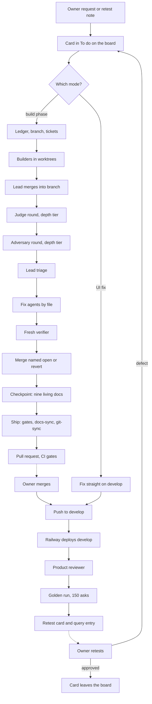

# Build harness review

How this product gets built with LLM agents, reviewed on 2026-09-25 at the product owner's request: "review our harness: understand the harness and what can be done to improve it. Because I do not think our harness works well right now." This report covers the build harness only: bossman mode and its cadence, the skills, rules, sub-agents and hooks under `.claude/`, the tracker scripts, the review rounds, the golden run, the UI fix loop and the session-closing skills. The product's own question-to-answer loop is reviewed separately in `product_harness.md`.

Every problem below cites a file and line, a commit, a ledger row, a count computed for this report, or one of the lead's eleven observations from the session of 2026-09-25 (listed under "The lead's observations" so each citation is checkable). A claim that could not be verified is labelled a hypothesis. Nothing under `.claude/` was changed for this report, and nothing was deleted. The measurements were taken with two scratch scripts outside the repository: a token counter over `CLAUDE.md` and `.claude/rules/`, and a probe that feeds harmless commands through the two Bash hooks.

## Table of contents

- [For the product owner, in plain words](#for-the-product-owner-in-plain-words)
- [How a change travels today](#how-a-change-travels-today)
- [What was measured](#what-was-measured)
- [What is wrong](#what-is-wrong)
- [What to change, deletions first](#what-to-change-deletions-first)
- [What to keep](#what-to-keep)
- [Open questions for the product owner](#open-questions-for-the-product-owner)
- [The lead's observations](#the-leads-observations)
- [What could not be measured](#what-could-not-be-measured)

## For the product owner, in plain words

What building one change costs today, measured on the overnight build of 2026-09-25 and the two weeks of the fix loop before it:

- Time: a build phase took between 4 hours 37 minutes and 7 hours 28 minutes from opening to merge. Between a quarter and a half of that, about 40 percent on average, was the review chain after the builders had finished (2 hours 25 minutes, 2 hours 47 minutes and 1 hour 42 minutes for the three phases). Then a 30-minute golden run, then the product review, then the change joins a queue of 37 cards waiting for your retest. A UI fix reaches develop the same day, but with no engineering review at all.
- Money: the product's model spend is measured ($6.00 for the night's two golden runs and a writer bench). The build's own model spend is not measured anywhere. What can be measured is that every agent the harness starts reads about 41,000 tokens of rules and instructions before it reads a single file of the ticket it was given. About 25 agents ran overnight, so about a million tokens went on rulebook alone, and three quarters of that rulebook is written for the lead or for a situation the builder is not in.
- Your attention: 45 decisions of yours were recorded on 2026-09-25 alone. The overnight plan asked you 34 questions in one sitting, and by this report's reading 11 of them were choices the lead was already allowed to make under your own rule of 2026-09-22 (decide from the user's chair). Your retest column grew from 24 cards to 37 in one day, because your verdict is the only thing that closes any card. Twice an explanation confused you, and once you had to correct the lead on which money matters.

The three biggest reasons, in order:

1. You are the only closer and the biggest queue is yours. Every card, from a wording change to an answer-path fix, waits for your verdict, and every choice with any product flavour is put to you. The harness treats your attention as free.
2. The harness spends more on its own bookkeeping than on the product. 47 percent of the last two weeks' commits are documentation. 87 of the 92 commits to `CLAUDE.md` in that window change only a count or a date. Nine "living documents" must carry today's date before anything can be pushed. There are two boards, and the older one does not know the current phases exist. The handoff file named a branch that did not exist one day after it was rewritten.
3. Work starts before the cause is known, and the review then reverts it. The overnight plan itself said three cards had "no diagnosed cause yet". All three were dispatched as fixes anyway, all three were reverted after the judge and adversary found they made answers less trustworthy, and a fourth phase with zero lines of product code still ran a full judge round, a verifier and a revert.

The first three changes this report would make:

1. Take you off the critical path for everything except answer quality. The lead decides wording, placement and housekeeping cards inside its remit and tells you what it chose. A card the product reviewer passed at both widths closes on its own after seven days unless you object. Questions come to you as one morning list, each a yes, no or pick-one with a recommendation, at most ten a day. This reverses part of your decisions of 2026-09-01 and 2026-09-12 that only your verdict closes a card, and the open question at the end asks you plainly.
2. Delete the bookkeeping: stop stating test and decision counts in `CLAUDE.md`, `AGENTS.md`, `requirements/Plan.md` and `PROGRESS.md`; drop the rule that every living document must be dated today before a push; retire `tracker/BOARD.md` for current work so there is one board. Expected effect: about 85 fewer commits a fortnight, two fewer minutes of test collection at every checkpoint, and one fewer place to be wrong.
3. No fix without a diagnosis, and a risk dial now. A card with no known cause gets a diagnosis ticket and nothing else; a fix ticket opens only after the lead has read the diagnosis. The two modes merge into one cadence with the risk dial you accepted on 2026-09-24, whose trigger ("after the next build phase closes") has now fired three times, so a documentation-only phase stops paying for a judge round.

Then, close behind: cut the always-loaded rulebook to the ten thousand tokens every agent needs and load the rest on demand, and fix the two hooks that block harmless commands, both of which need your itemized approval because they live under `.claude/`.

## How a change travels today

One flowchart for both modes. The dashed nodes are where a change waits on the product owner.

Where each step is defined:

- The board and the card: `testing/UI_fix_plan.md` (To do, Build in progress, Retest) with detail in `testing/UI_fixes_done.md`. Build phases also keep a ledger in `tracker/phase_N.M.md`, so a build-phase card lives in two systems at once.
- The mode choice: `.claude/skills/bossman-mode/SKILL.md`, "Pick the mode first".
- Builders, worktrees, fences: `reference/Phase_execution.md` steps 3 and 4. Worktrees are cut from develop's tip, not the phase branch (observation 2, verified: `2c6374f` is an ancestor of the phase-open commit `13d2f2d`).
- Judge, adversary, fix, verifier: `reference/Review_rounds.md`; agents `.claude/agents/phase-reviewer.md`.
- Checkpoint and ship: `.claude/skills/phase-checkpoint/SKILL.md` (steps 0 to 7, nine documents named in `tracker/Living_documents.md`) and `.claude/skills/ship/SKILL.md` (gates, two sub-agents, the stray-file sweep, worktree cleanup).
- CI: `.github/workflows/ci.yml`, ten gates, running again since the billing block lifted (runs on 2026-09-25 and 2026-09-26 completed).
- Product review and golden run: `reference/Product_review.md`; agent `.claude/agents/product-reviewer.md`; instrument `testing/Developer/reports/2026-09-22_10.3_consistency/run_consistency.py`.
- Retest: the card sits in the board's Retest column with a query number in `testing/Test_queries_and_workflows.md` until the owner's verdict.

## What was measured

### Cycle time, the three merged overnight phases

From `git log`, the pull requests (`gh pr view`) and each phase's ledger. "Build" is phase open to pull request opened; "review to merge" is pull request opened to merged, which holds the judge, the adversary, the fix round, the verifier, the gates and the merge.

| Phase | Opened (UTC) | Open to merge | Build | Review to merge | Commits | Tickets | Delivered | Findings round 1 / round 2 | Reverts | Product lines | Test lines | Record lines |
|---|---|---|---|---|---|---|---|---|---|---|---|---|
| 8.1, good questions stop failing (PR #105) | 05:05 | 4 h 37 m | 2 h 12 m | 2 h 25 m | 38 | 8 | 4 | 33 / 5 | 3, plus one fix withdrawn | +887 | +1,676 | +7,879 |
| 8.2, one place where every choice is made (PR #106) | 05:05 | 7 h 28 m | 4 h 41 m | 2 h 47 m | 26 | 8 | 8, with 11 findings left open for the owner | 33 / 5 | 0 | +2,661 | +2,567 | +1,606 |
| 8.5, housekeeping nobody sees (PR #107) | 05:35 | 6 h 31 m | 4 h 49 m | 1 h 42 m | 15 | 6 | 4 | 10 / 8 | 1 | 0 | +106 | +934 |
| 8.4, answers worth reading | built | not merged | | | | | 0 | | | | | |

Notes on the table:

- Delivered counts tickets whose change is on develop. In 8.1, T-8.1-04, T-8.1-05 and T-8.1-07 were withdrawn to To do and T-8.1-03 was diagnosed only (`tracker/phase_8.1.md`, "Lead decision after round 2"). In 8.5, T-8.5-04's deletion was reverted (`a4b6a7f`) and T-8.5-05 was investigated only.
- Of 8.1's 7,879 record lines, 4,926 are two probe JSON files under `testing/Developer/reports/2026-09-25_phase_8.4/litsense_probe/` and 1,000 are the ledger itself.
- The five reverts observation 9 names: `e911956` (card 19, same papers), `76a0578` (card 21, MODY), `c9b3441` (card 20, trust verdict), the withdrawal of the prompt-slot reservation after F-8.1-V01, and `a4b6a7f` (card 37, the four streaming test files).
- 96 findings were filed over 22 tickets in one night, about 4.4 per ticket. In the two answer-path phases the share of findings about the phase's own tests or documents was 5 of 38 and 6 of 38 (13 and 16 percent), well under the stop line of half. In 8.5 it was 15 of 18, because the deliverables were documents, which the stop rule does not distinguish.
- Phase 8.4 is on the tag `parked/phase-8.4-2026-09-25`. `HANDOFF.md` line 18 and the board's rows 8, 17 and 24 say it is on the branch `phase/8.4-answers-worth-reading`, which no longer exists (`git branch -a` lists no 8.4 branch).
- The golden runs: 8.1's ran from 09:46 to 10:13 UTC (starts) and answered 99 of 150; 8.2's ran 13:01 to 13:33 and answered 102 of 150, median time to answer 21.9 seconds from 17.1 (`testing/Developer/reports/2026-09-25_phase_8.1_golden/summary.md`, `2026-09-25_phase_8.2_golden/summary.md`). Product-side spend for the night, read from the OpenRouter credits endpoint: $6.00 (`testing/Overnight_build_plan_2026-09-25.md`, night log).

### The idiot index: product against process

`git diff --numstat` from the last develop commit before 2026-09-11 to develop's tip on 2026-09-26, classed by path. Product is `src/`, `frontend/src/` (excluding test files), `services/`, `deploy*` and `.github/gates/`; tests are `tests/`, `frontend/e2e/`, `e2e_support` and any `.test.` or `.spec.` file; record is `tracker/`, `docs/`, `requirements/`, `testing/` and any `.md`.

| Measure | Two weeks on develop |
|---|---|
| Product lines added | 29,768 |
| Test lines added | 40,763 |
| Record, markdown, lines added | 31,720 |
| Record, scripts under report folders, lines added | 12,382 |
| Record, data (json, jsonl, txt, png, html), lines added | 546,702 |
| Non-merge commits | 347 |
| Of which `docs` type | 162 (47 percent) |
| Commits touching `CLAUDE.md` | 92, of which 87 change two lines or fewer. In a sample of 60 of those, 57 changed the Current focus build row that carries the counts and 3 changed the "Last updated" line |
| Commits touching `AGENTS.md` | 91 (the mirror the `sync-agents-md.sh` hook makes) |
| Commits touching `requirements/Plan.md` | 70, of which 49 change three lines or fewer |
| Commits touching `testing/UI_fix_plan.md` | 137 |
| Commits whose subject names a count, drift, checkpoint, handoff, board, tracker or date line | 72 |

For the overnight phases specifically: 8.1 wrote 887 product lines and 7,879 record lines; 8.2 wrote 2,661 and 1,606; 8.5 wrote 0 and 934. The build-phase comparison in `docs/build/Bossman_mode_redesign.md` (Part 1) measured the 35 earlier phases at 69,989 product lines against 41,539 of record, so the record's share has grown, not shrunk, since the redesign.

### The always-loaded context

`CLAUDE.md` plus every file in `.claude/rules/` loads into every session and every dispatched agent. Measured with tiktoken (cl100k_base), a close proxy for a modern tokenizer:

| Group | Files | Tokens |
|---|---|---|
| `CLAUDE.md` | 1 | 5,814 |
| Rules every agent needs on every task (writing-style, production-standards, git-workflow, design-consistency, anti-rationalization, public-repository-privacy, decide-from-the-users-chair, file-protection, communication-style) | 9 | 10,305 |
| Rules only the lead's session uses (goal-contracts, self-eval-loop, bossman-mode, plan-then-fan-out, v1-scope-boundary, system-design-patterns, attack-the-constraint, preserve-your-thinking, decision-logging) | 9 | 13,468 |
| Rules for one kind of change (production-examples, supply-chain-security, tool-call-budgets, prompt-cache-discipline, ai-security-standards, sandbox-diagnosis, dependency-tracking) | 7 | 11,873 |
| Total, loaded into every agent | 26 | 41,460 (2,344 lines, 184,623 bytes) |

For comparison: the 2026-08-03 post-mortem measured the same set at 150,664 bytes (`docs/build/Build_velocity_post_mortem.md`, "The harness's own overhead"). It has grown 23 percent since, through the 2026-09-24 redesign that moved the build narrative out of `CLAUDE.md`. On demand, the bossman-mode skill and its four reference files are another 15,225 tokens for the lead, `phase-checkpoint` 7,462, `eval-harness` 7,696, `task-tracker` 4,567 and `ship` 4,435; the nine agent definitions total 10,979. The live description of the one build loop runs to 1,268 lines across seven files (`SKILL.md`, the four reference files, `docs/build/Build_workflow_cadence.md` and the `bossman-mode` rule).

A builder fixing one ticket needs the first group and `CLAUDE.md`'s architecture section, roughly 12,000 tokens. It is handed 41,460. A phase of eight dispatches therefore reads about 330,000 tokens of rulebook before any agent opens a file; the overnight build's roughly 25 dispatches, about a million. The dollar figure cannot be computed, because no billing log exists for the build side (a hypothesis in scale only; the token count is measured).

### The owner's attention

- Decisions recorded from the owner on 2026-09-25: 45 of the day's 54 `DECISIONS.md` rows name the product owner in their reason; 9 are the lead's own.
- Questions the overnight plan put to the owner in one sitting: 19 (group b), 6 (group c) and 9 rule-mandated grants, 34 in all (`testing/Overnight_build_plan_2026-09-25.md`, "Group b", "Group c", "What needs a yes before the run starts").
- Of the 19 group b questions, 11 were inside the lead's remit under `.claude/rules/decide-from-the-users-chair.md` by this report's reading: cards 23 (checked searches for named questions), 28 (which isolate filters), 43 (a byte ceiling that follows from card 6), 31 (labelling the numbers), 32 (a provenance note already proposed on 2026-09-14), 15 (keep a grey line), 5 (four golden rows), 36 (a reconciliation entry), 37 (test files), 18 (a lock file) and 34 (four type values). The other eight (1, 14, 42, 6, 33, 16, 17, 35) touched scope, a cost cap, a design placement, copy the owner owns, or a new dependency, and needed the owner.
- The Retest column: 37 cards today (`testing/UI_fix_plan.md`, rows 1 to 37 under Retest), up from 24 on 2026-09-24 (`docs/build/Bossman_mode_redesign.md`, "What the UI fix loop did better, and worse"). Cards waiting on "Your decision": 5.
- Decision rows per working day across the fix loop, from 2026-09-12: 9, 42, 28, 18, 7, 25, 8, 23, 54. Learnings rows on the same days: 0, 0, 0, 0, 0, 17, 3, 13, 7. Either nothing broke on the five busiest days, or the "write at the moment of failure" rule in the `learnings` skill is honoured only when `/phase-checkpoint` Step 1b batch-writes the rows. The 17 on 2026-09-22 read like the latter (hypothesis).
- Observation 10: two explanations confused the owner (Jev's role, a byte ceiling), and the owner corrected the lead on which balance matters.

## What is wrong

Each item states the defect, then its evidence.

### 1. The owner is the only closer, and the biggest queue is theirs

- Every card, whatever its risk, waits in Retest for the owner's verdict: `.claude/skills/bossman-mode/reference/UI_fix_loop.md`, "The loop", step 6; `.claude/skills/task-tracker/SKILL.md` line 87. This is the product owner's decision of 2026-09-01 ("judging is my domain now") and 2026-09-12, recorded in `DECISIONS.md`.
- The queue grows faster than it drains: 24 cards on 2026-09-24, 37 on 2026-09-25.
- Every choice with product flavour is put to the owner, including 11 of 19 that the users-chair rule already assigns to the lead (the list above). 45 owner decisions in one day.
- The rules multiply the asks: nine separate grants were needed for one night's unattended run (`testing/Overnight_build_plan_2026-09-25.md`, "What needs a yes before the run starts"), because `reference/Phase_execution.md` step 7 and the `bossman-mode` rule each carry a standing deny that only an itemized grant lifts.

### 2. Bookkeeping outweighs the product, and the living documents drift anyway

- 47 percent of commits are documentation; 87 of `CLAUDE.md`'s 92 commits change only its counts row and date (measured above). Each `DECISIONS.md` row changes counts carried in four files (observation 4), and the `sync-agents-md.sh` hook doubles every one of those diffs into `AGENTS.md`.
- Nine living documents must carry today's date before `/ship` will push: `tracker/Living_documents.md`, the registry, and `.claude/skills/ship/SKILL.md` lines 44 and 244 (`check_living_docs.py --fresh`). `/phase-checkpoint` runs the drift check twice per run, and the check collects the whole test suite each time, about two minutes (`.claude/skills/phase-checkpoint/SKILL.md` lines 229 and 245).
- The documents drift within a day of being refreshed. `HANDOFF.md` line 18 names branch `phase/8.4-answers-worth-reading`; the branch does not exist and the work sits on the tag `parked/phase-8.4-2026-09-25`. `testing/UI_fix_plan.md` rows 8, 17 and 24 name the same branch. `tracker/Living_documents.md` line 54 says the decision guard is "Guarded through DECISIONS.md row 716", while `DECISIONS.md` has 699 dated rows and 728 lines: 716 is a line number, which line 52 of the same file says the watermark must never be. `.claude/skills/ship/SKILL.md` line 50 still says CI "has not run since 2026-09-22", while `gh run list` shows completed runs on develop on 2026-09-25 and 2026-09-26, so a skill that runs at every push carries a stale fact about the push.
- There are two boards. `tracker/BOARD.md` has no row for any 8.x phase (zero matches for `^| 8.`), still says `done` is set by "Judge only, never the builder" (line 21) against the 2026-09-24 decision that the owner's verdict sets it, and still lists phase 6.2 as `in-progress` though it merged on 2026-09-01 as PR #92. It cannot hold the current phases because `task-tracker` forbids a phase Section 25 does not define (`SKILL.md` line 268), yet the 8.x ledgers live beside it under `tracker/`. `testing/UI_fix_plan.md` is the board people actually read, and it was edited 137 times in two weeks.

### 3. Work starts before the cause is known, and the review then reverts it

- The plan said so before the night began: "Cards 19, 20 and 22 have no diagnosed cause yet, so their phase work starts with the diagnosis" (`testing/Overnight_build_plan_2026-09-25.md`, line 79). All three, and card 21, were dispatched to builders as fix tickets (T-8.1-07, T-8.1-05, T-8.1-03, T-8.1-04).
- All three fixes were reverted after review: `e911956` (the same-papers overfetch, F-8.1-03: "the variance did not reproduce"), `c9b3441` (the full-retrieval conflict floor, after F-8.1-A13, A14 and A15 showed it labelled correct gene answers "Sources disagree" on 3 of 3 live questions), `76a0578` (the MODY stacked-marker check, after F-8.1-J01 and A01 showed a wrong gene-disease pairing shipping cited). Card 22 ended as a diagnosis only (F-8.1-05).
- So 4 of 8.1's 8 tickets put nothing on develop, while the judge, the adversary and the verifier spent their one round each on them: 38 of the phase's findings, and 2 hours 25 minutes of review-to-merge.
- The same shape at smaller scale in 8.5: a phase with zero product lines ran a judge round, a verifier round, 18 findings and a revert, because the cadence has no dial between "documentation-only" and "runnable behaviour" until the two modes merge (`SKILL.md`, "Pick the mode first", last paragraph). The trigger for that merge, "after the next build phase closes", fired three times on 2026-09-25.

### 4. Every agent carries the whole rulebook

- 41,460 tokens load into every agent; about 12,000 of it is what a builder needs (measured above). The lead-only rules (13,468 tokens) instruct a builder never to do things it cannot do (dispatch, fan out, grade its own output), and the conditional rules (11,873) cover installing a dependency, writing a tool, touching the prompt prefix, a sandbox failure and hook headers.
- `production-examples.md` (2,767 tokens) is teaching material with worked code, not a rule.
- The 2026-08-03 post-mortem ranked shrinking the rules last, as "a dollar-cost lever, not a wall-clock lever". Since then the record shows the lever is also a budget one: agents have died together on the provider's session limit (LEARNINGS.md, 2026-07-31; `docs/build/Bossman_mode_redesign.md`, "Model tiering"), and the cadence's own provider note plans for the primary weekly budget running out mid-phase (`reference/Phase_execution.md`, "Agent teams setup").
- The 2026-08-02 consolidation moved content between rule files and did not shrink the total (post-mortem, same section). The 2026-09-24 redesign cut the narrative from `CLAUDE.md` and the total still rose from 150,664 to 184,623 bytes, because three rules were added and others grew.

### 5. Gates written into the cadence do not all run

- `reference/Phase_execution.md` step 5 names six gates: `verify`, `eval-harness`, `dev-standards`, `check_learnings_coverage.py`, `ship`, `task-tracker --close`. No 8.x ledger or report mentions `eval-harness`, `dev-standards` or `check_learnings_coverage` (searched across `tracker/phase_8.*.md` and every report folder of the night). `dev-standards` has zero commit mentions since 2026-08-25.
- `eval-harness` (7,696 tokens) operationalises a grader the board itself calls "known broken" and parked (`tracker/BOARD.md`, row 5.2; `CLAUDE.md`, Current focus, row 4).
- `task-tracker --close` could not run as written, because the 8.x phases are not on the board it closes.
- This is the shape `release-workflow` had before 2026-08-10: mandatory in the document, 0 of 6 in practice (`docs/build/Build_workflow_cadence.md`, "The stages"). An unrun gate is an ownerless requirement by the repository's own `attack-the-constraint` standard.

### 6. Two hooks block harmless commands, and the workaround blinds them

Fed through the hooks as they are wired in `.claude/settings.json`, with the probe script written for this report:

| Command | Hook | Result | Why |
|---|---|---|---|
| `bash -c "kill -0 12345 2>/dev/null && echo alive"` | block-bash-delete | blocked | pattern 2 pairs any wrapper with `>[[:space:]]*/dev/`, which `2>/dev/null` matches |
| `python3 -c "import json; d=json.load(open('runs.json')); print(d)" 2>/dev/null` | block-bash-delete | blocked | same |
| `python3 -c "print('perform the check')"` | block-bash-delete | blocked | `rm[[:space:]]` matches inside "perform " |
| `ssh host "systemctl status caddy 2>/dev/null"` | block-bash-delete | blocked | same as the first row |
| `grep -rn "api_key=settings" src/` | scan-secrets | blocked | the field pattern reads a search string as an assignment |
| `rm -rf build/` | block-bash-delete | blocked | correct |
| `git rm --cached file.txt` | block-bash-delete | allowed | correct |

Observation 3 records the lead's workaround: write the command into a script file and run it by path. That takes the command's text out of the hook's view entirely, so the hook now protects less than it did while costing a file per command. The `.claude/hooks/block-bash-delete.sh` lines are 27 and 28; the `scan-secrets.sh` field pattern is line 22.

### 7. The drift check certifies what it did not compute

- `tracker/check_doc_drift.py` lines 275 to 292: without `venv/bin/python` the test-count fact is `SKIPPED`, and the run still prints `ok` and exits 0. Filed as F-8.5-J04 and carried as F-8.5-V05 (`tracker/phase_8.5.md`), and in LEARNINGS.md on 2026-09-25: the check "reported ok in integration worktrees while the Python test count it tracks was stale".
- The same function parses `^(\d+)\s+tests? collected` and never reads an error count. When a test module fails to import, the collected number falls by that module's tests and the check reports the smaller number as the truth. Consistent with observation 8 (5457 on the owner's machine against 5704 here); the exact pytest wording for collection errors was not reproduced for this report, so the mechanism is a hypothesis and the regex is a fact.

### 8. Budgets are counted by hand and the build's cost is unmeasured

- The ledgers record the dispatch budget as a plan ("Dispatches: 8. Planned: 3 builders, 1 judge ...", `tracker/phase_8.1.md` line 29) and 8.2 as "Used before review: builder D and builder J". Nothing records the running count, the model, or the tokens per dispatch. Observation 11.
- `SKILL.md` line 141: "Tokens: Not set: no billing log exists in this repository". The product side was measured to the cent overnight because the OpenRouter credits endpoint exists; the build side has no equivalent, so the owner cannot be told what a phase cost to build.

### 9. Worktrees are cut from the wrong commit and left behind

- Observation 2, verified: the phase-open commit `13d2f2d` holds only `tracker/phase_8.6.md` (58 lines), and the builders' worktrees sit at its parent `2c6374f`. Harmless this time; a trap when the lead commits code to the phase branch before dispatching.
- Four leftover worktrees are on disk (about 447 MB, all marked `locked`) and four `worktree-agent-*` branches, one day after a decision deleted eight (`DECISIONS.md`, 2026-09-25). `.claude/skills/ship/SKILL.md` Step 3 is a 40-line manual procedure with three questions to answer per worktree.

### 10. Analyst reports go unchecked, and "answered" is not "good"

- Observation 7, with its source: the 8.1 golden summary's own table says the run's starts spanned 09:46:23 to 10:13:18 (27 minutes); the 8.2 run started at 13:01:31, three hours and fifteen minutes later. A report that conflates the two is caught only if the lead reads the table.
- The product review of 8.1 (`testing/Developer/reports/2026-09-25_product_review_8.1/report.md`, "Verdict") shows why the golden number cannot stand alone: "The 99 is not 99 good answers ... Of the 17 golden questions whose answers I read, 11 fail rubric line 2", and G-005's gain from 0 to 3 was an SRA question answered with a SARS pathway. LEARNINGS.md 2026-09-25 records 3 of the 13 gained runs as not real answers.

### 11. The worker brief is missing two lines

- Observation 1: a worker ended its turn while its own background run was still going, twice, and no results file was written. `reference/Phase_execution.md`'s agent prompt template says nothing about processes a worker starts.
- Observation 7: the template does not say that a report's headline numbers are pasted from the script's output, never retyped.

### 12. One loop is described in seven files

- `SKILL.md` (191 lines), `Phase_execution.md` (274), `Review_rounds.md` (169), `Product_review.md` (115), `UI_fix_loop.md` (88), `docs/build/Build_workflow_cadence.md` (335) and the `bossman-mode` rule (96): 1,268 live lines, plus `Phase_6_execution_flow.html`. `Phase_execution.md` line 8 says the cadence document is not restated, yet the cadence document carries the stage table, the budgets and the review rules a second time. The deletion inventory shows what that costs: one change to the premise-gate stage was made in four files (`docs/build/Bossman_redesign_deletion_inventory.md`, lines 211 to 247).

## What to change, deletions first

Ordered by `.claude/rules/attack-the-constraint.md`: question the requirement, delete, simplify, accelerate, automate. Each entry names what it removes or changes, its size, its risk and how to tell it worked. "Approval" marks a change under `.claude/`, which needs the product owner's itemized sign-off before anyone edits it. "Reverses" names the `DECISIONS.md` row it would reopen, which is the owner's to reopen.

### Delete

| # | Change | Removes | Size | Risk | How to tell it worked |
|---|---|---|---|---|---|
| D1 | Stop stating test, decision and learning counts in `CLAUDE.md`, `AGENTS.md`, `requirements/Plan.md` and `PROGRESS.md`; reduce `tracker/check_doc_drift.py` to its structural checks (table integrity, table of contents, duplicate headings, stale dates). Reverses in part: 2026-08-02 "one owner per fact ... enforce mechanically with check_doc_drift.py" | About 85 commits a fortnight to `CLAUDE.md` and `AGENTS.md`, two minutes of pytest collection at each of the two checkpoint runs, observation 4's staleness churn | Four sentences in four files; the fact-pattern half of a 1,624-line script becomes unreachable and can go later | Low. Nobody acts on the counts; the board and the ledgers carry the state | `git log --since=<date> -- CLAUDE.md` shows commits only when instructions change; the checkpoint no longer runs pytest |
| D2 | Drop `check_living_docs.py --fresh` from `/ship` Step 0 and the rule that `/phase-checkpoint` runs before every push. A session end rewrites `HANDOFF.md`; every other living document is edited when its fact changes, not because a date is due. Reverses in part: 2026-09-24 "One registry ... `/ship`'s freshness check", and the 2026-09-20 "checkpoint then ship" convention. Approval | Eight dated lines per session, most of the 162 `docs` commits, the nine-document checkpoint as a gate | Two lines in `ship/SKILL.md`, one column in `Living_documents.md` | `PROGRESS.md` and Plan.md's revision history lag by days. They are narrative, and the ledgers hold the facts | The `docs` share of non-merge commits falls below 25 percent from 47 |
| D3 | Retire `tracker/BOARD.md`, `tracker/render_board.py`, `tracker/board.html` and the `sync-board.sh` hook for current work: freeze the board with a header saying it ends at phase 6.2, and keep phase ledgers under `tracker/`. One board: `testing/UI_fix_plan.md`. Approval for the hook entry and `task-tracker/SKILL.md` | A board that does not know the current phases exist and contradicts the 2026-09-24 decision on who sets `done`; a hook that runs on every Edit and Write in the repository | One header, one hook entry, about 40 lines of `task-tracker/SKILL.md` | Low. History stays in git | One file answers "what is in flight"; no stale status row anywhere |
| D4 | Remove from the phase-end chain the gates that left no trace overnight: `eval-harness` (its grader is parked), `dev-standards`, `check_learnings_coverage.py`. Keep the ship gates (ruff, isort, the unit suite, the frontend build) and the golden run. The skills stay available on demand | Three unrun steps from `Phase_execution.md` step 5 and the cadence stage 7 row | Four lines | None measurable: they did not run | The cadence lists only gates a ledger records as run, with the result line pasted |
| D5 | Collapse the cadence to one home: keep `SKILL.md` and its four reference files; turn `docs/build/Build_workflow_cadence.md` into a 30-line pointer with the provider mapping table, which is the one thing it alone holds; drop the HTML flow page or regenerate it from the skill. Approval for the skill side only if wording moves | About 300 of 1,268 live lines, and the four-places edit | One document rewritten to a pointer | None | `wc -l` of the live cadence files under 950; a cadence change touches one file |
| D6 | Move `production-examples.md` out of `.claude/rules/` into `docs/build/` and point to it from `production-standards.md`. Approval | 2,767 tokens from every agent's context | `git mv` plus one line | None: it is worked examples of the rule that stays | `context_tokens.py` total drops by 2,767 |

### Simplify

| # | Change | Changes | Size | Risk | How to tell it worked |
|---|---|---|---|---|---|
| S1 | Load rules by audience. The nine every-agent rules and `CLAUDE.md` stay always-on (about 16,000 tokens). The nine lead-only rules load into the lead's session through the bossman skill (or a `lead` skill) and the seven conditional rules move to `docs/rules/` behind one pointer line each in `CLAUDE.md` ("adding a dependency: read ..."). Approval | 41,460 tokens per agent to about 16,000; the lead keeps everything | `git mv` of 16 files, 16 pointer lines, one skill edit | A builder skips a rule it needed. Mitigation: the lead's brief already names the constraints that apply (the prompt template's "Constraints" line), and the pointer names the trigger | `context_tokens.py` total under 17,000; builder briefs cite the rule for their ticket |
| S2 | Fix the two hook patterns. `block-bash-delete.sh` pattern 2: match `rm` and `rmdir` as words (`(^|[[:space:];&|(])(rm|rmdir)[[:space:]]`, plus `rmtree(`), and pin the device pattern to `>[[:space:]]*/dev/(sd|disk|nvme|rdisk|hd)` so a redirect to `/dev/null` is not destructive. `scan-secrets.sh`: skip commands whose first word is `grep`, `rg` or `git grep`, and keep both checks for everything else. Approval | Observation 3's false blocks; the script-file workaround becomes unnecessary, so the hooks see the commands again | Two regular expressions and one condition | A destructive command inside a wrapper phrased in a way the new pattern misses. The old pattern missed `rm -r` inside a heredoc too, and the token-prefix scan is untouched | The probe script's harmless rows all read ALLOW and `rm -rf build/` still reads BLOCK |
| S3 | Make the drift check honest about what it skipped: in `--check` mode a `SKIPPED` fact is a failure line ("could not compute Python tests: venv missing"), and the collected-count parser also reads pytest's error count and fails when it is non-zero | F-8.5-V05 and observation 8 | About 15 lines in `tracker/check_doc_drift.py` | None | A run in a worktree exits non-zero and says why; a module that fails to import turns the check red instead of lowering the count |
| S4 | The living-documents watermark becomes what its text says it is: the date and first words of the last guarded decision, never a line number | Line 54's "row 716" against 699 rows | One line and one sentence in `phase-checkpoint/SKILL.md` Step 0 (approval) | None | The watermark can be found by searching `DECISIONS.md` for its text |
| S5 | Worktrees start on the phase branch. The lead pushes the phase branch before dispatching and the worker brief's first line is `git fetch origin && git merge --ff-only origin/<phase branch>`; the lead records each builder's base commit in the ledger's History | Observation 2 | One line in the prompt template (approval) and one History line per builder | None | Every builder's base in the ledger equals the phase branch's head at dispatch |
| S6 | A dispatch table in every ledger's Budget section: role, model, effort, started, ended, tokens from the task notification. The lead appends the row at dispatch and at return | Observation 11; the "8 of 8" is read, not counted; the first record of build-side tokens | One line per dispatch | None | Every 8.x ledger has the table; the checkpoint quotes dispatches used and tokens spent from it |
| S7 | Two lines in the worker brief template: "If you start a process, do not end your turn until it has exited; poll it and read its output." and "Numbers in your report are pasted from the script's output, never retyped." | Observations 1 and 7 | Two lines (approval, `Phase_execution.md`) | None | No worker returns with a running process; a summary's headline matches its table |
| S8 | No fix without a diagnosis. A card whose cause is unknown becomes a diagnosis ticket, and only that; a fix ticket opens after the lead has read the written diagnosis. Written into `Phase_execution.md` step 3 (approval) | The pattern behind three of the night's five reverts | One sentence | A trivially obvious cause waits one extra hand-off. The lead may write the diagnosis itself when the cause is plain | Reverts per phase; findings per delivered ticket |
| S9 | Say what the learnings practice is. Either the skill's "write at the moment of failure" is enforced (a builder brief line: "a failure that cost you more than five minutes is a LEARNINGS.md row before you continue") or the skill says rows are written at the checkpoint. Today it says the first and the record shows the second on five of nine days | A rule nobody follows | One paragraph | None | Learnings rows are dated across the working days, not clustered on checkpoint days |

### Accelerate

| # | Change | Changes | Size | Risk | How to tell it worked |
|---|---|---|---|---|---|
| A1 | Take the owner off the critical path for everything except answer quality. Three parts: the lead decides in-remit cards (wording, placement, housekeeping) and reports the choice in the user's words; a copy or layout card the product reviewer passed at 1280 and 390 closes on its own seven days after it reaches Retest unless the owner objects, while every answer-path card still waits for the owner; questions reach the owner as one morning list, each a yes, no or pick-one with a recommendation, capped at ten. Reverses in part: 2026-09-01 "judging is my domain now" and 2026-09-12 (the owner's retest is the verification). Approval for `UI_fix_loop.md` and `task-tracker/SKILL.md` | 37 cards in Retest to a queue the owner can actually clear; 45 decisions a day to a shortlist | Two paragraphs and a "closes on" column on the board | A layout defect the reviewer missed closes unseen. Mitigation: the seven-day window and the owner's standing right to reopen | Retest cards under 15; owner decisions per day under 15; no card in Retest older than seven days without an owner note |
| A2 | Merge the two modes into one cadence with the risk dial now. The 2026-09-24 decision scheduled it "after the next build phase closes"; three have. A copy or layout change: builder, clerk, product review. Runnable behaviour: adds the judge and the adversary. Auth, the graph credential, the event schema or `.claude/`: adds a branch and a pull request. Approval | A judge round and a verifier on documentation-only phases (8.5 spent 1 hour 42 minutes of review on zero product lines); the "which mode" question in every brief | The `bossman-mode` rule's carve-out text and `SKILL.md`'s mode table | The develop carve-out was bounded by mode on purpose (`bossman-mode` rule); the dial must name the same boundary. It does: the third position is the branch-and-PR row | One cadence table; no phase with zero product lines runs a judge |
| A3 | Report two golden numbers, not one: answered (the floor) and answered well (the rubric read of a fixed sample of ten answered questions). Keep "any drop in answered" blocking; add "answered every time" as the stable count to watch, since it varied by 0 and 2 questions across the two overnight runs where the 2026-09-12 baseline varied on 15 of 32 | The gap the 8.1 product review found: 99 answered, 11 of 17 read failing rubric line 2 | About 30 lines in `summarize.py` and one line in `Product_review.md` | None | The summary prints both numbers; a phase that raises "answered" and lowers "answered well" is visible on one line |

### Automate, last

Nothing new until D1 to D4 have landed and been felt for a week. Then one candidate, already sanctioned: the nightly golden run on develop, which `reference/Product_review.md` allows once the product review has run by hand on two phases. It has (8.1 and 8.2). The instrument exists; the schedule is the only new part.

## What to keep

Named so the deletions above are not read as a mood.

- The judge, the adversary and the fresh verifier at the depth tier, one round each. In one night they caught a wrong gene-disease pairing shipping fully cited (F-8.1-J01, F-8.1-A01), a false "Sources disagree" on 3 of 3 live gene questions (F-8.1-A13 to A15), Jev overruling the guard wrongly at every measured confidence (F-8.2-A11), off-topic follow-ups admitted after any answered question (F-8.2-A01), publication limits read silently from a patient count (F-8.2-J01, A07) and a "3-second timeout" that was a per-read timeout (F-8.2-J03). Each of those would have reached a person.
- The two-round cap with no third round. It held on all three phases; each ended with a written "Lead decision after round 2" that merged named open or reverted.
- Write-first ledger rows and the finder-never-closes rule. Every 8.x finding was a row the moment it existed; the 2026-08-27 loss did not recur.
- File fences and worktree isolation for parallel builders. Eleven builders overnight (A to H, J, K and L in the night log), one accepted fence crossing (`tracker/phase_8.2.md`, History), zero collisions.
- The product reviewer. It caught what the golden count called gains: an SRA question answered with a SARS pathway and a "MedGen lists no clinical features" sentence in 15 unrelated answers, and it grades the way the owner does.
- The golden run as a blocking floor, with its two accounts, three passes and rate-limit contamination rule.
- `HANDOFF.md` as the one file a fresh session reads, and the rule that it is rewritten in place. Fix its drift by removing the pressure that makes eight other documents compete with it (D2), not by adding a tenth.
- The rollback tag and `testing/Developer/scripts/bin_overnight.py`, proven in two throwaway clones before the night. This is what let the owner say "keep it" without fear.
- `tracker/preflight.py`, one probe per transport, and CI's one-token `run:` design in `.github/workflows/ci.yml`.
- The secret-scanning hooks and the delete guard, once S2 stops them blocking harmless commands. The token-prefix scan and the `rm` word check are right.
- `.claude/rules/public-repository-privacy.md` and `decide-from-the-users-chair.md`. The second already licenses most of A1; the harness simply did not use it.
- `tracker/Living_documents.md` as a registry of who owns which document. Keep the registry, drop the freshness gate (D2).

## Open questions for the product owner

One at a time, each answerable yes, no or pick one, with this report's recommendation.

1. Let the lead decide wording, placement and housekeeping cards inside its remit and report the choice, rather than ask you? Recommendation: yes. Your rule of 2026-09-22 already says so; 11 of 19 questions on 2026-09-25 did not need you.
2. Let a copy or layout card the product reviewer passed at both widths close by itself seven days after reaching Retest, with answer-path cards still waiting for you? This reverses part of your decisions of 2026-09-01 and 2026-09-12. Recommendation: yes. Your queue went from 24 to 37 in a day and you are the only closer.
3. Stop stating test, decision and learning counts in `CLAUDE.md`, `AGENTS.md`, `requirements/Plan.md` and `PROGRESS.md`, and reduce the drift check to structure? This reverses part of 2026-08-02. Recommendation: yes. 87 of 92 `CLAUDE.md` commits in two weeks were those counts.
4. Drop the rule that every living document carries today's date before a push, keeping only `HANDOFF.md` as the session-end rewrite? This reverses part of 2026-09-24. Recommendation: yes. The documents drifted within a day of being dated.
5. Retire `tracker/BOARD.md` and its renderer for current work, leaving `testing/UI_fix_plan.md` as the one board? Recommendation: yes. The old board has no 8.x rows and contradicts your 2026-09-24 decision on who sets `done`.
6. Move the lead-only and conditional rules out of every agent's context as S1 describes, and `production-examples.md` to `docs/`? This needs your itemized approval under `.claude/`. Recommendation: yes. It cuts about 25,000 tokens per dispatched agent and leaves the lead with everything.
7. Fix the two hook patterns as S2 describes? Itemized approval. Recommendation: yes. The probe shows `2>/dev/null` and the word "perform" being read as destruction, and the workaround already blinds the hooks.
8. Merge the two modes into one cadence with the risk dial now, rather than after "the next build phase"? Recommendation: yes. The trigger fired three times on 2026-09-25, and a zero-product-line phase paid for a judge round.
9. Remove `eval-harness`, `dev-standards` and `check_learnings_coverage.py` from the phase-end chain, keeping them as skills you can ask for? Recommendation: yes. None ran overnight and one grades with a parked grader.
10. Report "answered well" beside "answered" from every golden run, as A3 describes, keeping "any drop in answered" blocking? Recommendation: yes. 99 answered was 11 of 17 read failing your own rubric.

## The lead's observations

The lead's own notes from the session of 2026-09-25, which the repository does not hold. Numbered so the sections above can cite them as "observation N".

1. A Sonnet bench worker twice ended its turn while its own background run was still going, so no results file was written; the lead watched the process and resumed the worker by message.
2. Agent worktrees are created from develop's tip at dispatch, not from the phase branch: phase 8.6's builders started at `2c6374f` while the phase branch was at `13d2f2d`. Harmless when the phase commit holds only its ledger, a trap when it holds code.
3. The Bash deletion hook blocked a liveness check (`kill -0 <pid>`) and an inline Python snippet that only read JSON; the lead moved both into script files. The secret-scan hook blocks commands containing credential words, so sign-in scripts are written to files and run by path.
4. The doc drift check went stale several times in one session: each DECISIONS.md row changes counts carried in CLAUDE.md, AGENTS.md, requirements/Plan.md and PROGRESS.md. The Living_documents watermark counts file lines, not rows.
5. The pre-commit local-reference check blocked absolute paths in ledgers and scripts; scripts now derive the repository root from their own file path.
6. A stray " 2" copy of a ref file inside `.git` broke `git fetch`, likely from iCloud Desktop sync; the owner keeps the repository where it is.
7. An analyst's report said its two golden runs started 27 minutes apart; its own table showed 3 hours 15 minutes. Nothing checks an analyst's report before the lead reads it.
8. The owner's machine reported, as measured on 2026-09-25, 5457 Python tests where this checkout computes 5704, likely about 247 tests failing to collect there; nothing reports collection errors.
9. The overnight build of 2026-09-25 merged three phases with five review-driven reverts, and parked a fourth phase (8.4) unmerged on a local tag.
10. The owner twice said an explanation confused them (Jev's role, a byte ceiling), and once corrected the lead on cost: the money that matters is the OpenRouter balance, not develop's $10 brake.
11. The per-phase dispatch cap of 8 and the concurrency ask-line of 8 are counted by the lead by hand.

Observations 5 and 6 were verified as consistent with the repository (the local pre-commit hook exists and is not committed; the 2026-09-25 decision keeps the repository where it is) and are not repeated as findings: the first is a privacy control working as intended, the second is outside the harness.

## What could not be measured

- Build-side tokens or dollars per phase or per dispatch. No billing log exists; the rulebook figure above is a token count multiplied by a dispatch count, not a bill.
- Wall time before a phase's first commit, and the lead's own hours. The cycle-time table starts at the phase-open commit or the first branch commit.
- Cycle time per UI fix card. Cards carry no timestamps; the done file's session tables date a day, not an item.
- Which model each overnight dispatch ran. The plan names Sonnet for builders and the depth tier for reviewers; the ledgers do not record it per dispatch (S6 would).
- How many of the owner's 45 answers changed what was built. The classification of 11 in-remit questions is this report's reading of the users-chair rule, not a measurement.
- The exact pytest wording on a collection error, and the exact commands that tripped the hooks in observation 3. The probe reproduces the class of false block; the regex is the fact.
- Whether the learnings rows clustered on checkpoint days were written late or nothing broke on the other days. The pattern is stated as a hypothesis.
