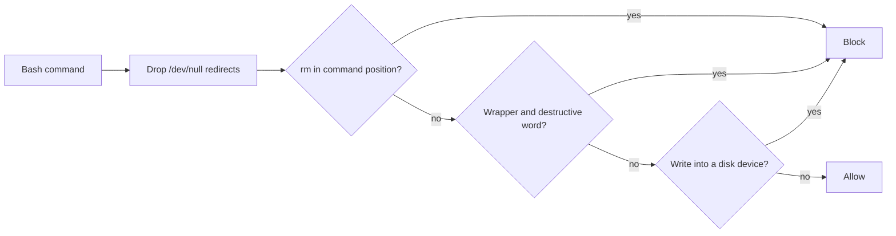

# Builder H3: the three approved hook changes

Build harness fix on branch `chore/harness-hooks`, 2026-09-26. The product owner approved these changes item by item on 2026-09-25 (DECISIONS.md, "Four security-layer changes approved item by item", items 1, 2 and 4), after the build harness review (`build_harness.md` in this folder, finding 6) measured both Bash guard hooks blocking harmless commands.

This report gives:

- The exact old and new patterns.
- The order the verification ran in, with each command's output.
- Every case, before and after.

Every number and table below was pasted from a command's output or generated from one.

## Table of contents

- [For the product owner, in plain words](#for-the-product-owner-in-plain-words)
- [What changed](#what-changed)
- [How it was verified](#how-it-was-verified)
- [Every case, before and after](#every-case-before-and-after)
- [Probes beyond the suite](#probes-beyond-the-suite)
- [What the hooks still miss or still block](#what-the-hooks-still-miss-or-still-block)
- [Documents left describing the board hook](#documents-left-describing-the-board-hook)
- [Commits](#commits)

## For the product owner, in plain words

What a working session notices:

- `2>/dev/null` inside `bash -c`, `ssh` or after `python3 -c` no longer blocks a command.
- A word that merely contains the letters rm, such as "perform" or "platform", no longer blocks one.
- A `grep`, `rg` or `git grep` for a field name, such as `api_key=settings`, no longer blocks one.
- The board page is no longer re-rendered after every edit. Run `python3 tracker/render_board.py` when it should change.

What did not get weaker:

- Delete guard: all 35 destructive commands the old hook blocked are still blocked, 0 lost.
- Secret scan: every secret-shaped value is still blocked on every command, a search included. Of 11 blocking cases, 0 changed.

What the delete guard now stops that used to slip past it:

- 32 of the suite's 67 destructive commands, including five named in the brief: `sudo rm -rf /`, `find . -name x -exec rm {} \;`, `xargs rm`, `dd if=/dev/zero of=/dev/disk2` and `echo x > /dev/sda`.
- The permission deny list in `.claude/settings.json` already refused some of these (`sudo`, `dd`), but not `xargs rm`, `find -exec rm` or a redirect into a disk.

What it costs:

- A few rare harmless commands are now blocked. Each is listed under [Probes beyond the suite](#probes-beyond-the-suite).
- One residual the approval accepts, in the secret scan, is described under [What the hooks still miss or still block](#what-the-hooks-still-miss-or-still-block).

## What changed

The delete guard now runs one normalisation step and three checks, in this order:



### 1. The delete guard, `.claude/hooks/block-bash-delete.sh`

Old checks, verbatim from `origin/develop`:

```bash
# 1) rm / rmdir as a command word: at command start or after a shell separator.
if printf '%s' "$CMD" | grep -qE '(^|[;&|][[:space:]]*)(rm|rmdir)([[:space:]]|-)'; then
  echo 'Blocked: file deletion via bash (rm/rmdir). Ask user first.' >&2
  exit 2
fi

# 2) Destructive command smuggled inside an execution wrapper's quoted argument,
#    e.g. ssh host "rm -rf /", python -c "os.system('rm -rf ~')", bash -c "...".
#    block-bash-delete's segment check above never sees these because the rm sits
#    inside quotes; catch them by pairing a wrapper with a destructive keyword.
if printf '%s' "$CMD" | grep -qE '(ssh[[:space:]]|python3?[[:space:]]+-c|perl[[:space:]]+-e|ruby[[:space:]]+-e|node[[:space:]]+-e|bash[[:space:]]+-c|sh[[:space:]]+-c|zsh[[:space:]]+-c|eval[[:space:]])' \
   && printf '%s' "$CMD" | grep -qE '(rm[[:space:]]|rmdir|rmtree|dd[[:space:]]+if=|mkfs|>[[:space:]]*/dev/)'; then
  echo 'Blocked: destructive command inside an execution wrapper (ssh/python -c/bash -c). Ask user first.' >&2
  exit 2
fi
```

New checks, verbatim:

```bash
QUOTE='["'"'"']'                          # a double or a single quote
END='([[:space:];&|)`"'"'"']|$)'           # what may follow a device name: a delimiter or the end
WORD_END='([^[:alnum:]_]|$)'              # rm ends here, so "rmtree" and "rms" are not rm
REDIRECT='[0-9]*>[>|&]?[[:space:]]*'      # >, >>, >|, >&, 2> and the like
DEVICE_WRITE="(>[>|&]?[[:space:]]*|(^|[^[:alnum:]_])of=)$QUOTE?/dev/"

# 0) Drop every redirect to /dev/null (>, >>, >|, >&, 2>, quoted or not) and
#    dd's of=/dev/null. /dev/null must end at a delimiter, so /dev/nullb0 stays
#    and is checked like any device. The delimiter is kept, so a separator right
#    after the redirect still separates. An & before the > is kept too: bash
#    reads &> as one redirect, but POSIX sh reads the & as the end of a command.
SCAN=$(printf '%s' "$CMD" | sed -E \
  -e "s#$REDIRECT$QUOTE?/dev/null$QUOTE?$END# \\1#g" \
  -e "s#of=$QUOTE?/dev/null$QUOTE?$END# \\1#g")

# Command position: the start of a line, after a shell separator or opener
# (; & | ( ) { } backtick), or after find's -exec. Then any shell keyword, and
# any runner that takes a command as its argument (sudo, env, exec, nice, nohup,
# time, timeout, xargs) with its options. Then the command word itself, which may
# be quoted, escaped with a backslash, or given as a path such as /bin/rm.
SEP='[;&|(){}`]'
LEAD="((^|$SEP)[[:space:]]*|[[:space:]]-(exec|execdir|ok|okdir)[[:space:]]+)"
KEYWORD='(then|do|else|if|elif|while|until|!)[[:space:]]+'
RUNNER='(sudo|doas|env|exec|nice|nohup|time|timeout|xargs)([[:space:]]+[^[:space:];&|]+)*[[:space:]]+'
PREFIX="($KEYWORD|$RUNNER)*"
CMDWORD="$QUOTE?"'(\\|/([[:alnum:]_.-]+/)*)?'

# 1) rm / rmdir as a command word, as a whole word. `git rm` is a git
#    subcommand, not in command position, and stays allowed as before.
if printf '%s' "$SCAN" | grep -qE "$LEAD$PREFIX$CMDWORD(rm|rmdir)$QUOTE?$WORD_END"; then
  echo 'Blocked: file deletion via bash (rm/rmdir). Ask user first.' >&2
  exit 2
fi

# 2) Destructive command smuggled inside an execution wrapper's quoted argument,
#    e.g. ssh host "rm -rf /", python -c "os.system('rm -rf ~')", bash -c "...".
#    Check 1 never sees these because the rm sits inside quotes; catch them by
#    pairing a wrapper with a destructive word. rm is a whole word here too.
#    rmdir, rmtree, dd if= and mkfs stay substring matches, as before, because
#    a whole-word rmdir would let fs.rmdirSync(...) through. Any write into
#    /dev other than /dev/null stays blocked inside a wrapper, as before.
WRAPPER='(ssh[[:space:]]|python3?[[:space:]]+-c|perl[[:space:]]+-e|ruby[[:space:]]+-e|node[[:space:]]+-e|bash[[:space:]]+-c|sh[[:space:]]+-c|zsh[[:space:]]+-c|eval[[:space:]])'
INSIDE="(^|[^[:alnum:]_])rm$WORD_END|rmdir|rmtree|dd[[:space:]]+if=|mkfs|$DEVICE_WRITE"
if printf '%s' "$SCAN" | grep -qE "$WRAPPER" \
   && printf '%s' "$SCAN" | grep -qE "$INSIDE"; then
  echo 'Blocked: destructive command inside an execution wrapper (ssh/python -c/bash -c). Ask user first.' >&2
  exit 2
fi

# 3) A write to a disk device outside a wrapper: a redirect into /dev, dd's of=
#    into /dev, or mkfs as a command word. /dev/null was dropped in step 0. The
#    stream devices (stdout, stderr, tty, fd/N) are dropped too: they hold no
#    data, and outside a wrapper they were never checked before.
STREAMS='(stdout|stderr|tty|fd/[0-9]+)'
DISKSCAN=$(printf '%s' "$SCAN" | sed -E \
  -e "s#$REDIRECT$QUOTE?/dev/$STREAMS$QUOTE?$END# \\2#g" \
  -e "s#of=$QUOTE?/dev/$STREAMS$QUOTE?$END# \\2#g")
MKFS="$LEAD$PREFIX${CMDWORD}mkfs$WORD_END"
if printf '%s' "$DISKSCAN" | grep -qE "$DEVICE_WRITE|$MKFS"; then
  echo 'Blocked: write to a disk device (a redirect into /dev, dd of=/dev/..., mkfs). To discard output, redirect to /dev/null. Ask user first.' >&2
  exit 2
fi
```

What each step does:

- Step 0: every redirect to `/dev/null` (`>`, `>>`, `>|`, `>&`, `2>`, quoted or not) and dd's `of=/dev/null` is dropped before any check. `/dev/null` must end at a delimiter, so `/dev/nullb0` or `/dev/null/../disk2` is still checked. An `&` in front of the `>` is kept, because POSIX sh reads it as the end of a command.
- Check 1: `rm` or `rmdir` as a whole word in command position. That is the start of a line, after `; & | ( ) { }` or a backtick, or after find's `-exec`. Then any shell keyword (`then`, `do`, `else`, `if`, `elif`, `while`, `until`, `!`) and any runner that takes a command (`sudo`, `doas`, `env`, `exec`, `nice`, `nohup`, `time`, `timeout`, `xargs`), with its options. The command word may be quoted, escaped as `\rm`, or given as a path such as `/bin/rm`. `git rm` is not in command position and stays allowed, as before.
- Check 2: the wrapper list is unchanged. `rm` inside a wrapper is now a whole word, so "perform" no longer matches. Inside a wrapper any write into `/dev` other than `/dev/null` stays blocked, as before.
- Check 3, new: a write into `/dev` outside a wrapper (a redirect or dd's `of=`), or `mkfs` as a command word. The stream devices `/dev/stdout`, `/dev/stderr`, `/dev/tty` and `/dev/fd/N` hold no data and were never checked outside a wrapper, so they stay allowed there.

Where the old behaviour was kept on purpose, per the brief's blocked-stop:

- `rmdir` inside a wrapper: stays a substring match, as do `rmtree`, `dd if=` and `mkfs`. A whole-word `rmdir` would let `node -e "require('fs').rmdirSync('x')"` through; case `node-rmdirsync` pins it.
- A stream device inside a wrapper: the approval exempts `/dev/null` alone, so `bash -c "echo hi > /dev/stderr"` stays blocked. Case `wrapper-stderr-as-before` pins it.
- `--rm` inside a wrapper, as in `ssh host "docker run --rm alpine echo hi"`: stays blocked, because `-` is not a word character, so `rm` there is a whole word.

### 2. The secret scan, `.claude/hooks/scan-secrets.sh`

Old condition, verbatim from `origin/develop`:

```bash
if printf '%s' "$COMMAND" | grep -qE "$PREFIX" || printf '%s' "$COMMAND" | grep -qiE "$FIELD"; then
  echo "BLOCKED: Command contains what looks like a secret/token. Use an environment variable instead." >&2
  exit 2
fi
```

New, verbatim. The two patterns, `PREFIX` and `FIELD`, are unchanged:

```bash
# Is the first word grep, rg or git grep? Leading whitespace is ignored. Any
# other first word, including egrep or a cd before the grep, is not a search.
TRIMMED=${COMMAND#"${COMMAND%%[![:space:]]*}"}
SEARCH=0
case $TRIMMED in
  grep|rg|grep[[:space:]]*|rg[[:space:]]*) SEARCH=1 ;;
  git[[:space:]]*)
    REST=${TRIMMED#git}
    REST=${REST#"${REST%%[![:space:]]*}"}
    case $REST in
      grep|grep[[:space:]]*) SEARCH=1 ;;
    esac
    ;;
esac

if printf '%s' "$COMMAND" | grep -qE "$PREFIX" \
   || { [ "$SEARCH" = 0 ] && printf '%s' "$COMMAND" | grep -qiE "$FIELD"; }; then
  echo "BLOCKED: Command contains what looks like a secret/token. Use an environment variable instead." >&2
  exit 2
fi
```

- Token-prefix check (`PREFIX`): runs on every command, as before.
- Field check (`FIELD`): skipped only when the first word, after leading whitespace, is `grep`, `rg`, or `git` followed by `grep`.
- Everything else keeps both checks exactly as before: `egrep`, `sudo grep`, `LC_ALL=C grep`, `/usr/bin/grep`, `git -C dir grep`, `git --no-pager grep`, and a `cd` or a pipe before the grep.
- Narrower than the approval's wording: DECISIONS.md says the scan "skips commands whose first word is grep, rg or git grep". The builder brief kept the token-prefix check on those commands, and so does the hook, since a real secret inside a search string leaks just the same.

### 3. The board sync hook, `.claude/settings.json` and `.claude/hooks/sync-board.sh`

- `settings.json`: the one PostToolUse entry that ran `sync-board.sh` after every Edit or Write is removed.
- `sync-board.sh`: stays on disk. Its `depended_by` no longer names `.claude/settings.json`, and a new header line says it is not wired since 2026-09-26, on the owner's approval of 2026-09-25, and runs only by hand with `--force`.
- Nothing else in `settings.json` changed. A structural comparison against `origin/develop`:

```text
permissions identical: True
env identical: True
top-level keys identical: True
hook entries before: 10 after: 9
removed: [('PostToolUse', 'Edit|Write', 'bash "$CLAUDE_PROJECT_DIR/.claude/hooks/sync-board.sh"')]
added: []
```

## How it was verified

In the order the brief set.

### Step 1: the suite came first

`tests/ci/test_claude_hooks.py` feeds each command to a hook the way the harness does: `bash <hook>`, the tool call as JSON on stdin, exit 2 read as blocked and exit 0 as allowed. Secret-shaped values are assembled from fragments at run time, so none sits in the file. Its docstring states what it covers and what it does not.

### Step 2: against today's hooks, before any edit

```text
44 failed, 74 passed in 20.08s
```

The failures were the ones that prove the suite can go red:

- Delete guard, harmless commands blocked: 8.
- Secret scan, harmless searches blocked: 6.
- Delete guard, destructive commands today's hook never caught: 30.

The suite then grew by five cases while the hook changed: two stream-device cases allowed outside a wrapper, `wrapper-stderr-as-before`, `exec-rm` and `ampersand-before-devnull`. The final suite against unchanged copies of `origin/develop`'s hooks:

```text
46 failed, 77 passed in 23.86s
```

### Step 3: after the changes

```text
123 passed in 17.34s
```

### Step 4: lint and the unit suite

`ruff check .` from the repository root, then the import-order gate, `isort --check-only --diff src tests services tracker alembic .claude .github`:

```text
All checks passed!
ruff exit=0
Skipped 2 files
isort exit=0
```

The unit suite exactly as CI gate 4 runs it, `pytest -m "not integration" -q -rs --junitxml=unit-results.xml`, with the placeholder environment block from `.github/workflows/ci.yml`. CI itself has not run since 2026-09-22 (`.claude/skills/ship/SKILL.md`, Step 0), so this local run is the gate:

```text
6 failed, 5350 passed, 212 skipped, 24 deselected, 1 xfailed, 7 warnings in 206.13s (0:03:26)
gate04 exit=1
```

Inside that run, `tests/ci/test_claude_hooks.py` passed 123 of 123. The six failures are one database error: this machine's PostgreSQL has no `postgres` role, which CI's placeholder URL expects and only CI's service container provides. None of them imports a hook, and this branch changes no Python outside the new test file:

```text
FAILURE tests.system_03_search_agent.adapters.graphql.test_no_cost_channel.TestNeverCost::test_no_cost_figure_appears_anywhere_in_the_response
    sqlalchemy.exc.OperationalError: (psycopg2.OperationalError) connection to server at "localhost" (::1), port 5432 failed: FATAL:  role "postgres" does not exist
FAILURE tests.system_03_search_agent.adapters.graphql.test_no_cost_channel.TestNeverCost::test_operator_mode_is_pinned_false_for_every_caller
    sqlalchemy.exc.OperationalError: (psycopg2.OperationalError) connection to server at "localhost" (::1), port 5432 failed: FATAL:  role "postgres" does not exist
FAILURE tests.system_03_search_agent.adapters.graphql.test_no_cost_channel.TestRegisteredAccountsOnly::test_a_valid_guest_token_is_refused_with_an_actionable_message
    sqlalchemy.exc.OperationalError: (psycopg2.OperationalError) connection to server at "localhost" (::1), port 5432 failed: FATAL:  role "postgres" does not exist
FAILURE tests.system_03_search_agent.core.test_think_retry::test_one_unusable_reply_is_retried_and_the_run_continues
    sqlalchemy.exc.OperationalError: (psycopg2.OperationalError) connection to server at "localhost" (::1), port 5432 failed: FATAL:  role "postgres" does not exist
FAILURE tests.system_03_search_agent.core.test_think_retry::test_two_unusable_replies_end_the_run_as_before_and_never_a_third_call
    sqlalchemy.exc.OperationalError: (psycopg2.OperationalError) connection to server at "localhost" (::1), port 5432 failed: FATAL:  role "postgres" does not exist
FAILURE tests.system_03_search_agent.core.test_think_retry::test_a_valid_first_reply_makes_exactly_one_think_call
    sqlalchemy.exc.OperationalError: (psycopg2.OperationalError) connection to server at "localhost" (::1), port 5432 failed: FATAL:  role "postgres" does not exist
```

```text
 .claude/hooks/block-bash-delete.sh |  75 +++++++--
 .claude/hooks/scan-secrets.sh      |  26 ++-
 .claude/hooks/sync-board.sh        |   6 +-
 .claude/settings.json              |   4 -
 tests/ci/test_claude_hooks.py      | 333 +++++++++++++++++++++++++++++++++++++
 5 files changed, 426 insertions(+), 18 deletions(-)
```

## Every case, before and after

"Before" is the final suite run against unchanged copies of `origin/develop`'s two hooks. "After" is this branch. "pass" means the hook gave the verdict the case expects. `\n` stands for a newline inside the command.

### Delete guard, must block

Before: 35 passed, 32 failed. After: 67 passed, 0 failed.

| Case | Command | Before (origin/develop) | After (this branch) |
|---|---|---|---|
| `rm-rf` | `rm -rf build/` | blocked (pass) | blocked (pass) |
| `rm-r` | `rm -r x` | blocked (pass) | blocked (pass) |
| `rmdir` | `rmdir d` | blocked (pass) | blocked (pass) |
| `sudo-rm` | `sudo rm -rf /` | allowed (fail) | blocked (pass) |
| `find-exec-rm` | `find . -name x -exec rm {} \;` | allowed (fail) | blocked (pass) |
| `xargs-rm` | `xargs rm` | allowed (fail) | blocked (pass) |
| `python-os-system-rm` | `python3 -c "import os; os.system('rm -rf ~')"` | blocked (pass) | blocked (pass) |
| `python-rmtree` | `python3 -c "import shutil; shutil.rmtree('x')"` | blocked (pass) | blocked (pass) |
| `bash-c-rm` | `bash -c "rm -rf /tmp/x"` | blocked (pass) | blocked (pass) |
| `ssh-rm` | `ssh host "rm -rf /data"` | blocked (pass) | blocked (pass) |
| `dd-to-disk` | `dd if=/dev/zero of=/dev/disk2` | allowed (fail) | blocked (pass) |
| `redirect-to-disk` | `echo x > /dev/sda` | allowed (fail) | blocked (pass) |
| `after-semicolon` | `ls; rm -rf x` | blocked (pass) | blocked (pass) |
| `after-and` | `true && rm -rf x` | blocked (pass) | blocked (pass) |
| `after-or` | `false \|\| rm -rf x` | blocked (pass) | blocked (pass) |
| `after-pipe` | `true \| rm -rf x` | blocked (pass) | blocked (pass) |
| `after-background` | `sleep 1 & rm -rf x` | blocked (pass) | blocked (pass) |
| `rm-long-options` | `rm --recursive --force x` | blocked (pass) | blocked (pass) |
| `rm-on-second-line` | `echo start\nrm -rf x` | blocked (pass) | blocked (pass) |
| `python-c-rm` | `python -c "import os; os.system('rm -rf /')"` | blocked (pass) | blocked (pass) |
| `perl-e-rm` | `perl -e 'system("rm -rf x")'` | blocked (pass) | blocked (pass) |
| `ruby-e-rm` | `ruby -e 'system("rm -rf x")'` | blocked (pass) | blocked (pass) |
| `node-e-rm` | `node -e "require('child_process').execSync('rm -rf x')"` | blocked (pass) | blocked (pass) |
| `sh-c-rm` | `sh -c "rm -rf x"` | blocked (pass) | blocked (pass) |
| `zsh-c-rm` | `zsh -c "rm -rf x"` | blocked (pass) | blocked (pass) |
| `eval-rm` | `eval "rm -rf x"` | blocked (pass) | blocked (pass) |
| `ssh-rmdir` | `ssh host "rmdir /data/old"` | blocked (pass) | blocked (pass) |
| `node-rmdirsync` | `node -e "require('fs').rmdirSync('x')"` | blocked (pass) | blocked (pass) |
| `python-os-rmdir` | `python3 -c "import os; os.rmdir('x')"` | blocked (pass) | blocked (pass) |
| `perl-rmtree` | `perl -e 'use File::Path; rmtree("x")'` | blocked (pass) | blocked (pass) |
| `bash-c-dd` | `bash -c "dd if=/dev/zero of=/dev/sda"` | blocked (pass) | blocked (pass) |
| `ssh-dd` | `ssh host "dd if=/dev/zero of=/dev/sdb bs=1M"` | blocked (pass) | blocked (pass) |
| `ssh-mkfs` | `ssh host "mkfs.ext4 /dev/sdb1"` | blocked (pass) | blocked (pass) |
| `bash-c-redirect-to-disk` | `bash -c "echo x > /dev/sda"` | blocked (pass) | blocked (pass) |
| `ssh-redirect-to-disk` | `ssh host "cat disk.img > /dev/disk2"` | blocked (pass) | blocked (pass) |
| `ssh-rm-then-devnull` | `ssh host "rm -rf /data" 2>/dev/null` | blocked (pass) | blocked (pass) |
| `rm-then-devnull` | `rm -rf x 2>/dev/null` | blocked (pass) | blocked (pass) |
| `devnull-then-rm` | `kill -0 1 2>/dev/null && rm -rf x` | blocked (pass) | blocked (pass) |
| `bash-c-rm-devnull-inside` | `bash -c "rm -rf /tmp/x 2>/dev/null"` | blocked (pass) | blocked (pass) |
| `redirect-before-rm` | `>/dev/null rm -rf x` | allowed (fail) | blocked (pass) |
| `ampersand-before-devnull` | `true&>/dev/null rm -rf x` | allowed (fail) | blocked (pass) |
| `sudo-u-rm` | `sudo -u root rm -rf /var/www` | allowed (fail) | blocked (pass) |
| `pipe-xargs-rm` | `ls \| xargs -0 rm -f` | allowed (fail) | blocked (pass) |
| `find-exec-bin-rm` | `find . -type f -exec /bin/rm -f {} +` | allowed (fail) | blocked (pass) |
| `absolute-path-rm` | `/bin/rm -rf x` | allowed (fail) | blocked (pass) |
| `backslash-rm` | `\rm -rf x` | allowed (fail) | blocked (pass) |
| `loop-rm` | `for f in a b; do rm "$f"; done` | allowed (fail) | blocked (pass) |
| `then-rm` | `if [ -d x ]; then rm -rf x; fi` | allowed (fail) | blocked (pass) |
| `command-substitution-rm` | `echo $(rm -rf x)` | allowed (fail) | blocked (pass) |
| `group-rm` | `{ rm -rf x; }` | allowed (fail) | blocked (pass) |
| `backtick-rm` | `` echo `rm -rf x` `` | allowed (fail) | blocked (pass) |
| `nohup-rm` | `nohup rm -rf x &` | allowed (fail) | blocked (pass) |
| `env-rm` | `env FOO=1 rm -rf x` | allowed (fail) | blocked (pass) |
| `exec-rm` | `exec rm -rf x` | allowed (fail) | blocked (pass) |
| `timeout-rm` | `timeout 5 rm -rf x` | allowed (fail) | blocked (pass) |
| `xargs-I-rm` | `xargs -I {} rm {}` | allowed (fail) | blocked (pass) |
| `quoted-rm` | `"rm" -rf x` | allowed (fail) | blocked (pass) |
| `python-subprocess-list-rm` | `python3 -c "import subprocess; subprocess.run(['rm', '-rf', 'x'])"` | allowed (fail) | blocked (pass) |
| `dd-to-raw-disk` | `dd if=/dev/zero of=/dev/rdisk2 bs=1m` | allowed (fail) | blocked (pass) |
| `cat-to-disk` | `cat image.iso > /dev/disk2` | allowed (fail) | blocked (pass) |
| `append-to-disk` | `echo x >> /dev/sda` | allowed (fail) | blocked (pass) |
| `fd-redirect-to-disk` | `echo x 1> /dev/sda` | allowed (fail) | blocked (pass) |
| `quoted-disk-path` | `echo x > "/dev/sda"` | allowed (fail) | blocked (pass) |
| `mkfs` | `mkfs.ext4 /dev/sdb1` | allowed (fail) | blocked (pass) |
| `sudo-mkfs` | `sudo mkfs -t ext4 /dev/sdb1` | allowed (fail) | blocked (pass) |
| `devnull-prefix-is-not-devnull` | `echo x > /dev/nullb0` | allowed (fail) | blocked (pass) |
| `wrapper-stderr-as-before` | `bash -c "echo hi > /dev/stderr"` | blocked (pass) | blocked (pass) |

### Delete guard, must allow

Before: 25 passed, 8 failed. After: 33 passed, 0 failed.

| Case | Command | Before (origin/develop) | After (this branch) |
|---|---|---|---|
| `bash-c-devnull` | `bash -c "kill -0 12345 2>/dev/null && echo alive"` | blocked (fail) | allowed (pass) |
| `python-c-then-devnull` | `python3 -c "import json; d=json.load(open('runs.json')); print(d)" 2>/dev/null` | blocked (fail) | allowed (pass) |
| `perform` | `python3 -c "print('perform the check')"` | blocked (fail) | allowed (pass) |
| `ssh-devnull` | `ssh host "systemctl status caddy 2>/dev/null"` | blocked (fail) | allowed (pass) |
| `git-rm-cached` | `git rm --cached file.txt` | allowed (pass) | allowed (pass) |
| `ls` | `ls -la` | allowed (pass) | allowed (pass) |
| `echo-perform` | `echo perform` | allowed (pass) | allowed (pass) |
| `python-print-devnull` | `python3 -c "print(1)" 2>/dev/null` | blocked (fail) | allowed (pass) |
| `redirect-devnull` | `cmd > /dev/null` | allowed (pass) | allowed (pass) |
| `kill-devnull` | `kill -0 12345 2>/dev/null && echo alive \|\| echo gone` | allowed (pass) | allowed (pass) |
| `kill` | `kill -0 12345 && echo alive` | allowed (pass) | allowed (pass) |
| `python-escaped-quotes` | `python3 -c "import json; d=json.load(open(\"runs.json\")); print(len(d))"` | allowed (pass) | allowed (pass) |
| `platform` | `python3 -c "import platform; print(platform.platform())"` | allowed (pass) | allowed (pass) |
| `ssh-uptime` | `ssh host "uptime"` | allowed (pass) | allowed (pass) |
| `devnull-and-stderr` | `cmd >/dev/null 2>&1` | allowed (pass) | allowed (pass) |
| `both-to-devnull` | `cmd &>/dev/null` | allowed (pass) | allowed (pass) |
| `append-devnull` | `cmd >> /dev/null` | allowed (pass) | allowed (pass) |
| `stderr-devnull-spaced` | `cmd 2> /dev/null` | allowed (pass) | allowed (pass) |
| `quoted-devnull` | `cmd > "/dev/null"` | allowed (pass) | allowed (pass) |
| `bash-c-build-devnull` | `bash -c "make build > /dev/null"` | blocked (fail) | allowed (pass) |
| `ssh-tail-devnull` | `ssh host "tail -n 50 /var/log/app.log 2>/dev/null"` | blocked (fail) | allowed (pass) |
| `pytest-devnull` | `python3 -m pytest tests/ci -q 2>/dev/null` | allowed (pass) | allowed (pass) |
| `dd-to-devnull` | `dd if=big.img of=/dev/null bs=1m` | allowed (pass) | allowed (pass) |
| `words-containing-rm` | `python3 -c "print('transform the uniform format')"` | blocked (fail) | allowed (pass) |
| `grep-for-rm` | `grep -rn "rm -rf" docs/` | allowed (pass) | allowed (pass) |
| `commit-mentions-rm` | `git commit -m "docs: explain the rm guard"` | allowed (pass) | allowed (pass) |
| `commit-mentions-prefixed-rm` | `git commit -m "Block sudo rm and xargs rm in the delete guard"` | allowed (pass) | allowed (pass) |
| `docker-rm-flag` | `docker run --rm alpine echo hi` | allowed (pass) | allowed (pass) |
| `stderr-fd` | `echo hi >&2` | allowed (pass) | allowed (pass) |
| `stderr-device` | `echo hi > /dev/stderr` | allowed (pass) | allowed (pass) |
| `fd-device` | `printf x >/dev/fd/2` | allowed (pass) | allowed (pass) |
| `read-from-device` | `head -c 16 < /dev/urandom` | allowed (pass) | allowed (pass) |
| `list-dev` | `ls /dev/ \| head` | allowed (pass) | allowed (pass) |

### Secret scan, must block

Before: 7 passed, 0 failed. After: 7 passed, 0 failed.

| Case | Command | Before (origin/develop) | After (this branch) |
|---|---|---|---|
| `export-literal-key` | `export NCBI_API_KEY=abcdefgh12345` | blocked (pass) | blocked (pass) |
| `curl-literal-password` | `curl -s -X POST https://example.invalid/login -d "email=a@b.c&password=Passw0rd123"` | blocked (pass) | blocked (pass) |
| `token-in-echo` | `echo <token with the sk- prefix>` | blocked (pass) | blocked (pass) |
| `token-inside-grep` | `grep -rn "<token with the ghp_ prefix>" src/` | blocked (pass) | blocked (pass) |
| `token-inside-rg` | `rg "<key with the AKIA prefix>" .` | blocked (pass) | blocked (pass) |
| `token-inside-git-grep` | `git grep "<token with the xoxb- prefix>"` | blocked (pass) | blocked (pass) |
| `key-header-inside-grep` | `grep -rn "<private-key header>" .` | blocked (pass) | blocked (pass) |

### Secret scan, field check kept when a search does not lead

Before: 4 passed, 0 failed. After: 4 passed, 0 failed.

| Case | Command | Before (origin/develop) | After (this branch) |
|---|---|---|---|
| `grep-after-a-pipe` | `cat config.py \| grep "api_key=settings"` | blocked (pass) | blocked (pass) |
| `grep-after-cd` | `cd src && grep -rn "api_key=settings" .` | blocked (pass) | blocked (pass) |
| `egrep-is-not-grep` | `egrep "api_key=settings" src/` | blocked (pass) | blocked (pass) |
| `echo-field-literal` | `echo api_key=settings123` | blocked (pass) | blocked (pass) |

### Secret scan, must allow

Before: 6 passed, 6 failed. After: 12 passed, 0 failed.

| Case | Command | Before (origin/develop) | After (this branch) |
|---|---|---|---|
| `grep-field-name` | `grep -rn "api_key=settings" src/` | blocked (fail) | allowed (pass) |
| `rg-field-name` | `rg "token=" docs` | allowed (pass) | allowed (pass) |
| `git-grep-field-name` | `git grep "password="` | allowed (pass) | allowed (pass) |
| `grep-ci-placeholder` | `grep -rn "AUTH_SECRET=ci-not-a-real-secret" .github/` | blocked (fail) | allowed (pass) |
| `rg-field-with-value` | `rg -n "PG_PASSWORD=postgres123" tests/` | blocked (fail) | allowed (pass) |
| `git-grep-env-lookup` | `git grep -n "NCBI_API_KEY=os.environ"` | blocked (fail) | allowed (pass) |
| `grep-after-leading-space` | `  grep -rn "api_key=settings" src/` | blocked (fail) | allowed (pass) |
| `grep-piped-to-head` | `grep -rn "api_key=settings" src/ \| head -20` | blocked (fail) | allowed (pass) |
| `grep-bare-field` | `grep -n "PASSWORD" env.example` | allowed (pass) | allowed (pass) |
| `export-reference` | `export OPENROUTER_API_KEY=$OPENROUTER_API_KEY` | allowed (pass) | allowed (pass) |
| `prose-mentions-field` | `echo "the AUTH_SECRET variable must be set"` | allowed (pass) | allowed (pass) |
| `sign-in-script` | `python3 scripts/sign_in.py --accounts accounts.json` | allowed (pass) | allowed (pass) |

Across all groups, before: 77 passed, 46 failed; after: 123 passed, 0 failed.

## Probes beyond the suite

The same commands through both versions, to show what the change does to commands the suite does not pin. A changed verdict is marked.

### Delete guard probes

| Command | Before (origin/develop) | After (this branch) |
|---|---|---|
| `echo hi > /dev/stderr` | allowed | allowed |
| `echo hi \| tee /dev/stderr` | allowed | allowed |
| `ssh host "docker run --rm alpine echo hi"` | blocked | blocked |
| `git ls-files -d \| xargs git rm` | allowed | blocked (changed) |
| `command -v rm` | allowed | allowed |
| `if grep -q rm file; then echo x; fi` | allowed | allowed |
| `time python3 tool.py rm` | allowed | blocked (changed) |
| `find . -name '*.pyc' -delete` | allowed | allowed |
| `python3 -c "import os; os.remove('x')"` | allowed | allowed |
| `unlink x` | allowed | allowed |
| `git clean -fdx` | allowed | allowed |
| `echo "a" > /dev/null; rm -rf x` | blocked | blocked |
| `echo x >/dev/null/../disk2` | allowed | blocked (changed) |
| `cat > notes.txt <<EOF\nline one\nrm -rf is dangerous\nEOF` | blocked | blocked |
| `git commit -m "fix: stop using rm -rf in scripts"` | allowed | allowed |
| `git commit -m "Use find -exec rm instead"` | allowed | blocked (changed) |
| `ssh host "which rm"` | allowed | blocked (changed) |
| `python3 -c "print('rm')"` | allowed | blocked (changed) |
| `echo "(rm)"` | allowed | blocked (changed) |
| `bash -c "echo hi > /dev/stderr"` | blocked | blocked |
| `rg -n "rm -rf" .claude/` | allowed | allowed |
| `sed -i '' 's/rm -rf/trash/' file.sh` | allowed | allowed |
| `awk '{print $1}' list \| xargs -I{} rm {}` | allowed | blocked (changed) |
| `npm run build 2>&1 \| tail -5` | allowed | allowed |
| `curl -s https://x.invalid -o /dev/null -w "%{http_code}"` | allowed | allowed |
| `exec 3>/dev/tcp/example.com/80` | allowed | blocked (changed) |
| `echo x > /dev/tty` | allowed | allowed |
| `yes \| head -n 3 > /dev/null` | allowed | allowed |
| `python3 - <<'EOF'\nimport shutil\nshutil.rmtree('x')\nEOF` | allowed | allowed |
| `echo $( rm -rf x )` | allowed | blocked (changed) |
| `x=$(ls); rm -rf "$x"` | blocked | blocked |
| `true&>/dev/null&&rm -rf x` | blocked | blocked |
| `cmd 2>/dev/null>/dev/sda` | allowed | blocked (changed) |
| `ssh host 'rm -rf /data'` | blocked | blocked |
| `python3 -c 'import os; os.system("rm -rf /")'` | blocked | blocked |
| `bash -c 'kill -0 1 2>/dev/null \|\| echo gone'` | blocked | allowed (changed) |
| `python3 -c "import sys; print(sys.argv)" -- --rm` | allowed | blocked (changed) |
| `ls -la >/dev/null 2>/dev/null && echo ok` | allowed | allowed |
| `make test > /dev/null 2>&1; echo $?` | allowed | allowed |
| `GIT_TRACE=0 git status 2>/dev/null` | allowed | allowed |
| `echo 'rm -rf /' > danger.txt` | allowed | allowed |
| `printf '%s\n' "a" "b" \| xargs echo` | allowed | allowed |

Reading the changed rows:

- Destructive, now blocked: `echo x >/dev/null/../disk2`, `awk '{print $1}' list | xargs -I{} rm {}`, `echo $( rm -rf x )` and `cmd 2>/dev/null>/dev/sda`.
- The approved fix: `bash -c 'kill -0 1 2>/dev/null || echo gone'`.
- Harmless, now blocked, all rare:
  - `git ls-files -d | xargs git rm`: rm after xargs. Arguably right, since `git rm` deletes the files.
  - `time python3 tool.py rm`: rm as a word after a runner.
  - `git commit -m "Use find -exec rm instead"`: `-exec rm` inside a commit message.
  - `ssh host "which rm"`, `python3 -c "print('rm')"` and `python3 -c "..." -- --rm`: rm as a whole word inside or beside a wrapper.
  - `echo "(rm)"`: rm after `(`.
  - `exec 3>/dev/tcp/example.com/80`: a network pseudo-device outside a wrapper. The message calls it a disk device, which it is not.

### Secret scan probes

| Command | Before (origin/develop) | After (this branch) |
|---|---|---|
| `grep -rn "api_key=settings" src/` | blocked | allowed (changed) |
| `\tgrep -rn "api_key=settings" src/` | blocked | allowed (changed) |
| `\ngrep -rn "api_key=settings" src/` | blocked | allowed (changed) |
| `git  grep -n "api_key=settings"` | blocked | allowed (changed) |
| `git\tgrep -n "api_key=settings"` | blocked | allowed (changed) |
| `git -C src grep -n "api_key=settings"` | blocked | blocked |
| `git --no-pager grep -n "api_key=settings"` | blocked | blocked |
| `gitgrep -n "api_key=settings"` | blocked | blocked |
| `grepx "api_key=settings"` | blocked | blocked |
| `rgrep "api_key=settings" .` | blocked | blocked |
| `rg` | allowed | allowed |
| `grep` | allowed | allowed |
| `sudo grep -rn "api_key=settings" /etc` | blocked | blocked |
| `LC_ALL=C grep -rn "api_key=settings" src/` | blocked | blocked |
| `/usr/bin/grep -rn "api_key=settings" src/` | blocked | blocked |
| `grep -q x f; export API_KEY=abcdefgh12345` | blocked | allowed (changed) |
| `export API_KEY=abcdefgh12345; grep -q x f` | blocked | blocked |
| `grep -E "password=\|api_key=settings" src/` | blocked | allowed (changed) |
| `git log -p \| grep "api_key=settings"` | blocked | blocked |

## What the hooks still miss or still block

### Destructive commands neither version catches

- Deletion that never names rm or rmdir: `find . -delete`, `unlink`, `shred`, `git clean -fdx`, and `os.remove` inside `python3 -c`.
- `shutil.rmtree` in a Python heredoc, `python3 - <<'EOF' ... EOF`: heredoc input is not a wrapper.
- `RM -rf x` in capitals. The default macOS filesystem is case-insensitive, so it runs `/bin/rm`.
- `tee /dev/sda` and `cp image.iso /dev/disk2`: disk writes with no redirect and no `of=`.
- A redirect to a file before the command word, as in `>out.txt rm -rf x`.
- The hooks' no-Python fallback in `lib/_json.sh`: the suite never exercises it.

### Harmless commands both versions still block

- A shell separator inside a quoted string, just before rm, as in `grep -E "a|rm-b"`. The hook reads text, not shell syntax, so it cannot tell a quoted `|` from a pipe. This builder hit it once while checking this report's tables.
- `ssh host "docker run --rm alpine echo hi"`: `--rm` is a whole word inside a wrapper.
- A search for the private-key header, `grep -rn "<private-key header>" .`: the token-prefix check runs inside a search, by design.
- `git -C dir grep` or `git --no-pager grep` for a field name: not led by `git grep`.

### The secret-scan residual the approval accepts

The exemption goes by first word, so in a grep-led chain the field check does not see a later command: `grep -q x f; export API_KEY=abcdefgh12345` now passes. The token-prefix check still sees every segment. Narrowing the exemption to the first command only would close it, but splitting at an unquoted `;` or `|` needs quote-aware parsing the hook does not have, and a naive split would re-block `grep -E "password=|api_key=settings" src/`. Left for the owner to decide.

### Timing

The new delete guard does more work on very large commands. Each figure is a single run on this machine, and the same input varies between runs: compare the unchanged old hook's `DECISIONS.md` row across the two runs below. Read them as orders of magnitude.

Three synthetic shapes, first run:

```text
before (origin/develop):
block-bash-delete.sh   5000-line heredoc            exit=0   0.39s
scan-secrets.sh        5000-line heredoc            exit=0   0.37s
block-bash-delete.sh   one 200 KB line              exit=0   0.15s
scan-secrets.sh        one 200 KB line              exit=0   0.18s
block-bash-delete.sh   one 20 KB line of runners    exit=0   0.09s
scan-secrets.sh        one 20 KB line of runners    exit=0   0.08s
after (this branch):
block-bash-delete.sh   5000-line heredoc            exit=0   1.97s
scan-secrets.sh        5000-line heredoc            exit=0   0.50s
block-bash-delete.sh   one 200 KB line              exit=0   0.42s
scan-secrets.sh        one 200 KB line              exit=0   0.25s
block-bash-delete.sh   one 20 KB line of runners    exit=0   0.16s
scan-secrets.sh        one 20 KB line of runners    exit=0   0.09s
```

The same, second run:

```text
before (origin/develop):
block-bash-delete.sh   5000-line heredoc            exit=0   0.43s
scan-secrets.sh        5000-line heredoc            exit=0   0.37s
block-bash-delete.sh   one 200 KB line              exit=0   0.14s
scan-secrets.sh        one 200 KB line              exit=0   0.16s
block-bash-delete.sh   one 20 KB line of runners    exit=0   0.08s
scan-secrets.sh        one 20 KB line of runners    exit=0   0.07s
after (this branch):
block-bash-delete.sh   5000-line heredoc            exit=0   1.70s
scan-secrets.sh        5000-line heredoc            exit=0   0.54s
block-bash-delete.sh   one 200 KB line              exit=0   0.72s
scan-secrets.sh        one 200 KB line              exit=0   0.25s
block-bash-delete.sh   one 20 KB line of runners    exit=0   0.18s
scan-secrets.sh        one 20 KB line of runners    exit=0   0.14s
```

Heredocs carrying real repository files, from a normal size up to far beyond anything an agent sends. All three exit 2 in both versions, because each file quotes a destructive command in command position. First run:

```text
before (origin/develop):
tests/ci/test_claude_hooks.py      333 lines    16 KB exit=2  0.09s
LEARNINGS.md                       942 lines   391 KB exit=2  0.50s
DECISIONS.md                       727 lines   819 KB exit=2  1.31s
after (this branch):
tests/ci/test_claude_hooks.py      333 lines    16 KB exit=2  0.13s
LEARNINGS.md                       942 lines   391 KB exit=2  0.39s
DECISIONS.md                       727 lines   819 KB exit=2  0.41s
```

The same, second run:

```text
before (origin/develop):
tests/ci/test_claude_hooks.py      333 lines    16 KB exit=2  0.12s
LEARNINGS.md                       942 lines   391 KB exit=2  0.25s
DECISIONS.md                       727 lines   819 KB exit=2  0.31s
after (this branch):
tests/ci/test_claude_hooks.py      333 lines    16 KB exit=2  0.07s
LEARNINGS.md                       942 lines   391 KB exit=2  0.23s
DECISIONS.md                       727 lines   819 KB exit=2  0.33s
```

Reading them: a normal command costs about the same in both versions. The case where the new hook is clearly slower is the synthetic 5000-line heredoc, far larger than a normal Bash call.

## Documents left describing the board hook

The brief allowed no other edit under `.claude/`, so these stay for the lead:

- `.claude/skills/task-tracker/SKILL.md`, line 199: still says `sync-board.sh` "runs the renderer on every Edit or Write to a `.md` file under `tracker/`". It no longer does.
- `CLAUDE.md` and `AGENTS.md`, line 227: list `sync-board.sh` among the sync hooks whose absence leaves stale generated files. Still true, and now true in this harness as well.
- `.claude/hooks/lib/_json.sh`: its `depended_by` omits `sync-board.sh`, which sources it. That gap predates this change.

## Commits

On `chore/harness-hooks`, cut from `origin/develop` at `c985afe`, not pushed:

- `12dce31 security(hooks): narrow the Bash guards to what the owner approved`
- `adfd7dd ci(hooks): stop re-rendering the board after every edit`
- This report, in a third commit.
