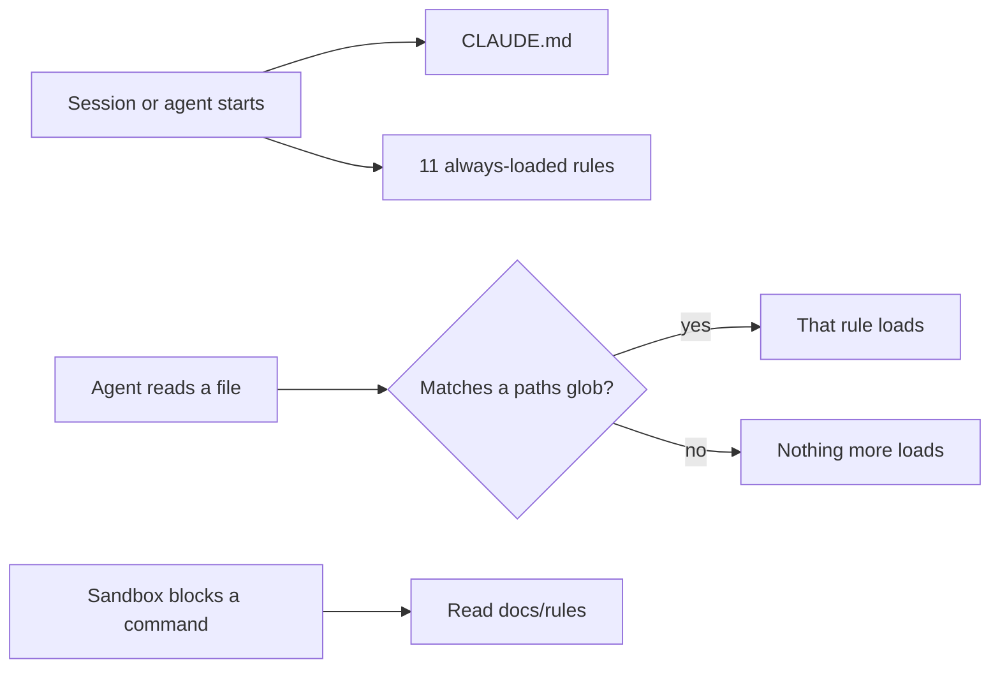

# Builder H4: the lighter rulebook and the consistency pass

Builder H4's report on two jobs from the build harness fixes. Job 1 is the lighter rulebook the product owner approved item by item on 2026-09-25 (DECISIONS.md, "Four security-layer changes approved item by item", item 3). Job 2 is a consistency pass, so no document still describes the process as it was before the fixes of 2026-09-25 and 2026-09-26. The work is on the branch `chore/harness-rules`, cut from `chore/build-harness` at `3effc90`. Nothing was pushed.

Every number below is pasted from the command that printed it. The measuring scripts are scratch files outside the repository; each is described where its output appears.

## Table of contents

- [For the product owner, in plain words](#for-the-product-owner-in-plain-words)
- [What changed, by commit](#what-changed-by-commit)
- [How rules load now](#how-rules-load-now)
- [Job 1: the rules and their globs](#job-1-the-rules-and-their-globs)
- [Two departures from the brief](#two-departures-from-the-brief)
- [The measurements](#the-measurements)
- [Job 2: the consistency pass](#job-2-the-consistency-pass)
- [Verify results](#verify-results)
- [What was refused, and what cost time](#what-was-refused-and-what-cost-time)
- [Left open for the lead](#left-open-for-the-lead)

## For the product owner, in plain words

- Every agent now starts with 20,451 tokens of instructions, down from 41,710.
- A builder working in `src/` and `tests/` reaches at most 27,551. Four rules, for tools, prompts, module dependencies and code examples, join only when it opens a matching file.
- The lead, once it reads `HANDOFF.md`, holds 34,625: its nine orchestration rules plus everything every agent holds.
- The two security rules, `ai-security-standards` and `supply-chain-security`, still load into every agent, as you asked.
- One saving does not happen. A builder in a numbered phase reads its phase ledger, and the ledger loads the lead's nine rules, so that builder still carries 41,725. That is the lead's call, listed at the end.
- No document now describes the two modes, the frozen board as current work, or the old drift check as live.

## What changed, by commit

| Commit | Subject | Files |
|---|---|---|
| `f34fb61` | docs(rules): load thirteen rules only where they apply, and move the sandbox rule to docs/rules | 23 |
| `fe0bdc6` | docs(rules): name the golden consistency run as the grounding gate's instrument | 1 |
| `7eaebb8` | docs: describe the one cadence, the frozen board and the structure-only drift check everywhere | 17 |
| `a325983` | docs: keep the verify skill's drift-check paragraph under the wall length | 1 |
| The commit that adds this file | docs: builder H4's report | 1 |

The first commit carries only the Job 1 lines of `CLAUDE.md`, `AGENTS.md`, `README.md`, `docs/README.md`, the ship skill and the git-sync agent, so each commit reads as one change. `AGENTS.md` was regenerated at each step with the sync hook's own generator, `--force` with `CLAUDE_PROJECT_DIR` pointed at this worktree, since the hook does not sync a worktree by itself. The main checkout's copy was not touched.

## How rules load now

The documentation, fetched on 2026-09-26 from code.claude.com/docs/en/memory.md ("Organize rules with .claude/rules/", "Path-specific rules", "Rule frontmatter reference") and code.claude.com/docs/en/sub-agents.md ("What loads at startup"), says, verbatim:

- "Rules without a `paths` field are loaded unconditionally and apply to all files. Path-scoped rules trigger when Claude reads files matching the pattern, not on every tool use."
- "`paths` is the only field Claude Code reads from a rule; any other field is ignored without an error. Claude Code removes the frontmatter before loading the rule into context."
- "If the YAML between the markers doesn't parse, Claude Code ignores the frontmatter and loads the rule as if it had no `paths`."
- A subagent's initial context holds "every level of the CLAUDE.md hierarchy the main conversation loads, including ... project rules".
- The `paths` field "Accepts a YAML list or a comma-separated string", with `**` globs and brace expansion.

That is the mechanism the brief described, so the blocked-stop did not apply. One nuance: the trigger is a read. An edit follows a read in practice, so "read or edited" holds.



## Job 1: the rules and their globs

Each glob list comes from the rule's own scope statement. A scratch script counted the tracked files each glob matches: none matches zero files.

### tool-call-budgets

Its scope statement names three things:

- Any tool in `system_03_search_agent/tools/`.
- The read-only HTTPS graph query service.
- The integration test suite that exercises live APIs.

The globs:

- `src/system_03_search_agent/tools/**/*`: the tool modules, 31 files.
- `src/system_03_search_agent/harness/call_budget.py`: Section 21.3's call ceiling and 21.4's wait ceiling, the rule's "Wait queues and fail-fast" section in code.
- `services/graph_query_service/**/*`: the graph query service.
- `tests/system_03_search_agent/tools/**/*`: the tool tests, including the live integration tests and premise gates.
- `tests/system_03_search_agent/harness/test_call_budget*.py` and `tests/services/graph_query_service/**/*`: their tests.
- `.github/gates/gate05_integration.sh`: the gate that runs the integration suite.
- `docs/ncbi/Tool_implementation_mechanics.md`: it defers every timeout and pool to this rule.

### prompt-cache-discipline

Its scope, per the brief: the prompt assembly in `harness/` and wherever the loop builds a model prompt. The list names each module that assembles the stable prefix or feeds it, and each that builds a model prompt:

- `src/system_03_search_agent/harness/**/*` and `src/system_03_search_agent/orchestrator/**/*`, which holds the few-shot pool of obligation 3.
- `core/graph.py`, `core/run.py`, `core/clarify.py` and `core/session_memory.py` under `src/system_03_search_agent/`.
- `guardrail/classifier.py`, `synthesis/findings.py` and `feedback/promotion.py`.
- `tools/cypher_generation.py`, `tools/cypher_query.py`, `tools/schema_slice.py`, `tools/catalogue.py` and `tools/graph_schema_constants.py`.
- `tests/system_03_search_agent/harness/**/*` and `tests/system_03_search_agent/synthesis/test_prompt_cache_prefix.py`, the byte-equality tests.

### dependency-tracking

Its scope: "hooks under `.claude/`, and every Python module under `src/system_03_search_agent/`".

- `.claude/hooks/**/*`
- `.claude/settings.json`, the index that wires hooks, which the rule names as a `depended_by` target.
- `src/system_03_search_agent/**/*.py`

Its "Exempt" bullet for rules said every rule loads each session. It now says how a rule with `paths:` loads, and that the rule in `docs/rules/` is named in `CLAUDE.md`.

### production-examples

Its scope: it "load[s] alongside `production-standards.md` when working in System 3 code", and example 5 concerns the settings allowlist and the delete guard.

- `src/**/*`, `frontend/src/**/*` and `services/**/*`
- `.claude/settings.json` and `.claude/hooks/block-bash-delete.sh`

### The nine lead-only rules

goal-contracts, self-eval-loop, bossman-mode, plan-then-fan-out, v1-scope-boundary, system-design-patterns, attack-the-constraint, preserve-your-thinking and decision-logging each carry the same line:

```text
paths: ["HANDOFF.md", "DECISIONS.md", "LEARNINGS.md", "testing/UI_fix_plan.md", "testing/UI_fixes_done.md", "docs/build/*", ".claude/skills/bossman-mode/*", ".claude/skills/bossman-mode/reference/*", "{tracker,requirements}/**/*"]
```

That is the brief's list with two changes of form and one of reach, all explained in the next section.

### sandbox-diagnosis

- Moved with `git mv` to `docs/rules/Sandbox_diagnosis.md`. A paragraph at its top says why it moved and lists the situations that call for it; its body is unchanged.
- Every live pointer to the old path now names the new one: the git-sync agent, the ship skill and a docstring in `tests/system_03_search_agent/tools/test_graph_query_service_premise.py`.
- `README.md` and `docs/README.md` gained a row for it.
- `docs/README.md`'s "Moved paths" table gains the old path, which `LEARNINGS.md` and two records under `tracker/` still cite.

### What CLAUDE.md now says

The line "All rules are in `.claude/rules/` and loaded automatically" became a short list:

- The eleven rules that always load, by name.
- The four one-situation rules, each with its paths in a phrase.
- The lead's nine rules, which load when the handoff, the board, a ledger or the decisions are read, and the note that a lead session reads `HANDOFF.md` first.
- The one rule read on demand, with the situations: "operation not permitted", a blocked host, a failed SSH push, and always before disabling the sandbox.

`alwaysApply: true`, a field the harness does not read, was set to `false` on the five scoped rules that carried it and on the moved sandbox rule, so it no longer contradicts how they load.

## Two departures from the brief

### The top level of docs/build, not all of it

The brief listed `docs/build/**`. That also matches `docs/build/design/`, the design system that the always-loaded `design-consistency` rule tells every UI builder to open first. So every UI builder would carry the lead's nine rules. The lines use `docs/build/*` instead, which still matches every build-process document the lead reads there.

Measured with a scratch copy of the rules holding the literal glob:

```text
UI BUILDER, reads frontend/src/ and the design system under docs/build/design/: 37352 tokens = 20451 at launch + 16901 from 10 scoped rules (attack-the-constraint.md, bossman-mode.md, decision-logging.md, goal-contracts.md, plan-then-fan-out.md, preserve-your-thinking.md, production-examples.md, self-eval-loop.md, system-design-patterns.md, v1-scope-boundary.md)
```

With `docs/build/*`, on this branch:

```text
UI BUILDER, reads frontend/src/ and the design system under docs/build/design/: 23178 tokens = 20451 at launch + 2727 from 1 scoped rules (production-examples.md)
```

The lead loses nothing: it reads `HANDOFF.md` first, and that alone loads the nine. To widen it back, replace `"docs/build/*"` with a `docs/build/**/*` glob in the nine files.

### One line per file, not a block list

The four one-situation rules use the documented block list. The nine lead rules carry theirs on one line, a YAML flow sequence, for two reasons found by the house-style checker:

- It counts frontmatter lines toward its 100-line table-of-contents threshold. A ten-line block pushed `bossman-mode.md` from 100 lines and 0 hard findings to 110 lines and 1, and two other rules the same way.
- It pairs `**` on one line as bold text. A flow line holding `tracker/**/*` and `requirements/**/*` read as bold. So the recursive globs share one brace group, `{tracker,requirements}/**/*`, and the skill's files are named without `**`.

A YAML parser reads the line as a list of nine in every file; the output is under "Verify results".

## The measurements

Method: tiktoken `cl100k_base`, as the build harness review used, over `CLAUDE.md` and each rule's body. The frontmatter is removed first, as the harness removes it. The path header the harness prints above each loaded file is not counted. Which scoped rules load is decided by matching their globs against `git ls-files`.

A check of the counter: at the review's own commit, `7f46fa7`, it gives 40,785 tokens where the review printed 41,460. The review's script is not in the repository. `CLAUDE.md` matches exactly (5,814), and the per-rule gap of about 27 tokens fits a per-file header the review may have counted.

Before, on `chore/build-harness` at `3effc90`:

```text
CLAUDE.md: 5824 tokens
Rules with no paths (load at launch): 25 files, 35886 tokens
Rules with paths (load on a matching read): 0 files, 0 tokens
AT LAUNCH, every session and agent: 41710 tokens (CLAUDE.md + 25 rules)
ALL RULES loaded (no scoping): 41710 tokens
```

After, on `chore/harness-rules` at `a325983`:

```text
CLAUDE.md: 6830 tokens
Rules with no paths (load at launch): 11 files, 13621 tokens
Rules with paths (load on a matching read): 13 files, 21274 tokens
AT LAUNCH, every session and agent: 20451 tokens (CLAUDE.md + 11 rules)
BUILDER, reads every tracked file under src/ and tests/ (worst case): 27551 tokens = 20451 at launch + 7100 from 4 scoped rules (dependency-tracking.md, production-examples.md, prompt-cache-discipline.md, tool-call-budgets.md)
BUILDER, reads one synthesis module and its test: 24269 tokens = 20451 at launch + 3818 from 2 scoped rules (dependency-tracking.md, production-examples.md)
BUILDER, reads only files under tests/: 23733 tokens = 20451 at launch + 3282 from 2 scoped rules (prompt-cache-discipline.md, tool-call-budgets.md)
LEAD, after reading HANDOFF.md: 34625 tokens = 20451 at launch + 14174 from 9 scoped rules (attack-the-constraint.md, bossman-mode.md, decision-logging.md, goal-contracts.md, plan-then-fan-out.md, preserve-your-thinking.md, self-eval-loop.md, system-design-patterns.md, v1-scope-boundary.md)
BUILDER in a numbered phase, reads src/, tests/ and its ledger ['tracker/phase_8.5.md']: 41725 tokens = 20451 at launch + 21274 from 13 scoped rules (attack-the-constraint.md, bossman-mode.md, decision-logging.md, dependency-tracking.md, goal-contracts.md, plan-then-fan-out.md, preserve-your-thinking.md, production-examples.md, prompt-cache-discipline.md, self-eval-loop.md, system-design-patterns.md, tool-call-budgets.md, v1-scope-boundary.md)
UI BUILDER, reads frontend/src/ and the design system under docs/build/design/: 23178 tokens = 20451 at launch + 2727 from 1 scoped rules (production-examples.md)
UI BUILDER, reads only frontend/src/: 23178 tokens = 20451 at launch + 2727 from 1 scoped rules (production-examples.md)
BUILDER, reads the Debugging guide: 34625 tokens = 20451 at launch + 14174 from 9 scoped rules (attack-the-constraint.md, bossman-mode.md, decision-logging.md, goal-contracts.md, plan-then-fan-out.md, preserve-your-thinking.md, self-eval-loop.md, system-design-patterns.md, v1-scope-boundary.md)
BUILDER, reads the technical specification: 34625 tokens = 20451 at launch + 14174 from 9 scoped rules (attack-the-constraint.md, bossman-mode.md, decision-logging.md, goal-contracts.md, plan-then-fan-out.md, preserve-your-thinking.md, self-eval-loop.md, system-design-patterns.md, v1-scope-boundary.md)
ALL RULES loaded (no scoping): 41725 tokens
```

Reading them:

- `CLAUDE.md` grew by 1,006 tokens, the rules list and the rewritten rows.
- The rules loaded at launch fell by 22,265 tokens: fourteen rules that weighed 22,364 left launch, and production-standards grew by 99.
- "Worst case" means the builder opens a file matching every scoped rule under `src/` and `tests/`. A builder on one synthesis module loads 24,269.

## Job 2: the consistency pass

### The files the brief named

| File | What it said | What it says now |
|---|---|---|
| `CLAUDE.md`, skills table | bossman-mode in "two modes", build-phase mode and UI fix mode | One cadence with a risk dial since 2026-09-25, its three positions in the owner's words, a numbered phase keeping its branch, the eleven stages, 8 hours and 8 dispatches |
| `CLAUDE.md`, reference docs | The cadence document as the quick reference with the stage table; the flow page as "the same cadence" | A pointer that keeps the provider mapping and says where each fact moved; the flow page as the record of 2026-09-24 |
| `CLAUDE.md`, Current focus | `tracker/BOARD.md` for build phases | The board for every card, the ledgers for numbered phases, the frozen board as the record through 6.2 |
| `CLAUDE.md`, portability | `BOARD.md` as a live artifact; the renderer; two sync hooks leaving stale files | The board of cards and the ledgers; the renderer run by hand; the board hook unwired since 2026-09-26; the `AGENTS.md` hook's worktree gap |
| `AGENTS.md` | The mirror | Regenerated from `CLAUDE.md` |
| `README.md` | Open items on `tracker/BOARD.md`; the cadence document's "twelve stages" and "Stage 5, the premise gate"; the flow page as the cadence | The board and ledgers; the cadence document as a pointer, with its premise gate retired on 2026-09-24; the flow page as a record |
| `docs/README.md` | "Run a build phase" at the cadence document; its twelve stages and premise gate; current status on `BOARD.md` | The skill as the loop's home; the cadence document's history in the past tense; status in `HANDOFF.md`, the board and the ledgers |
| `docs/build/README.md` | The twelve stages in the cadence document; "the markdown is the source and the page is regenerated" | The loop's home in the skill; the two forms' history, then the skill as the source and the page as a record |
| ship skill | Push targets by mode | Push targets by the dial's positions, as the bossman-mode rule's Deny entry bounds them; the description and the Step 0 paragraph likewise |
| verify skill, check 6 | Counts from source and a last-updated check | The structural checks, what stopped on 2026-09-25, and `--counts` |
| docs-sync agent | Counts owned by "/phase-checkpoint Step 5d"; the board as a live Tier 2 document | No count stated, `--counts` on demand; the board frozen; the rules routing row points at the new rules list |
| Debugging guide | The drift check computing every tracked count; the renderer as live; `check_learnings_coverage.py` as a phase-close gate | Structural checks and `--counts`; the renderer run by hand; the coverage script on demand |
| `tracker/Living_documents.md` | The board row owned by `task-tracker` as build phase status | The frozen record through 6.2, owned by nobody for current work, with the two decisions that set it |
| task-tracker skill | Already correct on this branch: its renderer section says the hook is removed | Unchanged |
| production-standards rule | "Grade this with the `eval-harness` skill ... measured with pass@k ... before any answer-generation feature ships" | The same two criteria, pass/fail, against the same 50-query dataset, before any answer-generation feature ships; the golden consistency run named as the instrument while the grader is parked; `eval-harness` available on demand |

The production-standards line is no weaker:

- The requirement, the dataset and the ship condition are unchanged.
- The golden run blocks on any drop.
- The rule's Deny entries were not touched.
- It says what the golden run records, since the run's gate is the answered count: each run classed as answered with citations or refused with none, and its must-cite hits (`run_consistency.py` in the 2026-09-22 consistency report folder).

### Files beyond the list, each describing the old process

- `.claude/agents/git-sync.md`: push targets by mode, now by the dial.
- `.claude/skills/best-practices/SKILL.md`: "never directly on `develop`" and a Deny line against pushing anywhere but the phase branch. Both now read by the dial and cite the bossman-mode rule's Deny entry, which the owner approved on 2026-09-26.
- `.claude/skills/standup/SKILL.md`: read `tracker/BOARD.md` for the phase in flight; now the board of cards and the ledgers.
- `.claude/skills/phase-checkpoint/SKILL.md`: its one-owner table gave phase status to the board; now the ledger.
- `.claude/skills/bossman-mode/SKILL.md`: one sentence now says the bossman-mode rule reaches the lead through its `paths:`.
- `.github/pull_request_template.md`: the documentation-sync box listed `tracker/BOARD.md`; now the board of cards, with the frozen board named as taking no update.
- `docs/build/design/README.md` and `Design_to_build_workflow.md`: pointed at "the twelve-stage cadence" in the cadence document; now at the skill, with the phase 4.8 history kept.
- `docs/ncbi/Tool_implementation_mechanics.md`: said every rule loads every session; now names which rules carry its policy and when `tool-call-budgets` loads.
- `docs/build/README.md`'s row for the local `Mixed_model_cadence.html`, which does show twelve stages: now says it is the loop before 2026-09-24.

## Verify results

### House style, every changed markdown file

`check_style.py` on each file, before the work (left) and after it (right):

| File | Before | After |
|---|---|---|
| `CLAUDE.md` | 0 hard, 1 advisory | 0 hard, 1 advisory |
| `AGENTS.md` | 0 hard, 1 advisory | 0 hard, 1 advisory |
| `README.md` | 1 hard | 1 hard |
| `docs/README.md` | 0 hard, 1 advisory | 0 hard, 1 advisory |
| `docs/build/README.md` | 3 hard, 1 advisory | 2 hard, 1 advisory |
| `docs/build/Debugging_guide.md` | 0 hard | 0 hard |
| `docs/build/design/README.md` | 6 hard, 1 advisory | 6 hard, 1 advisory |
| `docs/build/design/Design_to_build_workflow.md` | 7 hard, 1 advisory | 7 hard, 1 advisory |
| `docs/ncbi/Tool_implementation_mechanics.md` | 3 hard, 8 advisory | 3 hard, 8 advisory |
| `docs/rules/Sandbox_diagnosis.md`, before at `.claude/rules/sandbox-diagnosis.md` | 0 hard | 0 hard |
| `tracker/Living_documents.md` | 0 hard, 1 advisory | 0 hard, 1 advisory |
| ship skill | 0 hard, 1 advisory | 0 hard, 1 advisory |
| verify skill | 9 hard, 2 advisory | 8 hard, 2 advisory |
| standup skill | 4 hard | 4 hard |
| phase-checkpoint skill | 4 hard, 4 advisory | 4 hard, 4 advisory |
| best-practices skill | 3 hard, 1 advisory | 3 hard, 1 advisory |
| bossman-mode skill | 0 hard | 0 hard |
| docs-sync agent | 0 hard, 1 advisory | 0 hard, 1 advisory |
| git-sync agent | 0 hard, 1 advisory | 0 hard, 1 advisory |
| `production-standards.md` | 2 hard | 2 hard |
| `dependency-tracking.md` | 3 hard | 3 hard |
| `tool-call-budgets.md` | 5 hard, 1 advisory | 5 hard, 1 advisory |
| `prompt-cache-discipline.md` | 7 hard | 7 hard |
| `production-examples.md` | 5 hard | 5 hard |
| `goal-contracts.md` | 5 hard | 5 hard |
| `self-eval-loop.md` | 5 hard | 5 hard |
| `bossman-mode.md` rule | 0 hard | 0 hard |
| `plan-then-fan-out.md` | 2 hard | 2 hard |
| `v1-scope-boundary.md` | 5 hard | 5 hard |
| `system-design-patterns.md` | 2 hard | 3 hard |
| `attack-the-constraint.md` | 14 hard | 14 hard |
| `preserve-your-thinking.md` | 3 hard | 3 hard |
| `decision-logging.md` | 12 hard | 12 hard |
| `.github/pull_request_template.md` | 0 hard, 2 advisory | 0 hard, 2 advisory |

Every file that passed still passes. Every file that failed before carries no more hard findings than it did, with one exception. No other finding sits on a line this work wrote.

The exception is `system-design-patterns.md`, which gained `toc-missing`. Its three frontmatter lines take it from 99 to 102 lines, past the checker's 100-line threshold. Its text is unchanged. It is under "Left open".

### The checks, pasted

```text
$ python3 tracker/check_doc_drift.py --check
ok: 2 facts computed | 0 could not be computed | 0 stale | 0 structural
drift exit=0
$ python3 tracker/check_living_docs.py --shape
living documents: 12 rows, shape as registered
shape exit=0
$ ../../../venv/bin/ruff check .
All checks passed!
ruff exit=0
$ ../../../venv/bin/python -m pytest -q -p no:cacheprovider tests/tracker tests/system_03_search_agent/test_debugging_guide_coverage.py tests/ci
226 passed in 109.25s (0:01:49)
pytest exit=0
```

`../../../venv` is the main checkout's venv, three levels above this worktree's root. The one test module whose docstring changed also collects: `59 tests collected in 0.18s`.

### Every rule's frontmatter, parsed with a YAML parser

```text
ai-security-standards.md: frontmatter parses, no paths, loads at launch
anti-rationalization.md: frontmatter parses, no paths, loads at launch
attack-the-constraint.md: paths parses as a list of 9
bossman-mode.md: paths parses as a list of 9
communication-style.md: no frontmatter, loads at launch
decide-from-the-users-chair.md: no frontmatter, loads at launch
decision-logging.md: paths parses as a list of 9
dependency-tracking.md: paths parses as a list of 3
design-consistency.md: no frontmatter, loads at launch
file-protection.md: frontmatter parses, no paths, loads at launch
git-workflow.md: frontmatter parses, no paths, loads at launch
goal-contracts.md: paths parses as a list of 9
plan-then-fan-out.md: paths parses as a list of 9
preserve-your-thinking.md: paths parses as a list of 9
production-examples.md: paths parses as a list of 5
production-standards.md: frontmatter parses, no paths, loads at launch
prompt-cache-discipline.md: paths parses as a list of 16
public-repository-privacy.md: frontmatter parses, no paths, loads at launch
self-eval-loop.md: paths parses as a list of 9
supply-chain-security.md: frontmatter parses, no paths, loads at launch
system-design-patterns.md: paths parses as a list of 9
tool-call-budgets.md: paths parses as a list of 8
v1-scope-boundary.md: paths parses as a list of 9
writing-style.md: frontmatter parses, no paths, loads at launch
ok: 0 bad frontmatter blocks
```

### The grep for the old process

The phrase `BOARD.md` followed by "for build phases" matched `CLAUDE.md` and `AGENTS.md` on the branch base and matches nothing now:

```text
$ git grep -n -i -c "BOARD.md\` for build phases" 3effc90 -- CLAUDE.md AGENTS.md
3effc90:AGENTS.md:1
3effc90:CLAUDE.md:1
$ git grep -n -i "BOARD.md\` for build phases" -- .
exit=1
```

"two modes" and `--fresh`, outside the report folders and the two decision logs, per file:

```text
.claude/rules/bossman-mode.md:2
.claude/skills/bossman-mode/SKILL.md:1
.claude/skills/doc-readability/SKILL.md:3
.claude/skills/ship/SKILL.md:1
CHANGELOG.md:1
PROGRESS.md:1
docs/build/Bossman_mode_redesign.md:2
docs/build/Phase_6_execution_flow.html:1
docs/ncbi/Tool_implementation_mechanics.md:2
frontend/src/components/controls/DepthControl.test.tsx:1
frontend/src/components/controls/DepthControl.tsx:2
frontend/src/components/tour/OnboardingTour.tsx:1
frontend/src/personaIdentity.test.tsx:2
requirements/Plan.md:1
src/system_03_search_agent/core/isolate_search.py:1
src/system_03_search_agent/tools/litvar2_lookup.py:1
src/system_03_search_agent/tools/pubtator_annotate.py:1
testing/Overnight_build_plan_2026-09-25.md:1
testing/Product/Product_workflows.md:1
testing/Product/reports/2026-09-12_consistency_and_test_1.md:2
testing/Test_queries_and_workflows.md:1
testing/UI_fix_plan.md:1
testing/UI_fixes_done.md:10
tests/system_03_search_agent/tools/test_litvar2_lookup_premise.py:1
tests/system_03_search_agent/tools/test_pubtator_annotate_premise.py:1
tests/tracker/test_check_living_docs.py:1
tracker/check_living_docs.py:1
tracker/phase_8.5.md:1
visualizations/Schema_visualization.md:3
```

Every remaining line, by kind:

- Records of the merge itself, true today: the bossman-mode rule's two lines, and the skill's note that phase 8.6 finishes under the two modes.
- History: the redesign document, the flow page's own note that it shows 2026-09-24, the overnight plan and `tracker/phase_8.5.md`.
- `--fresh` in the past tense: the ship skill ("used to require"), `tracker/check_living_docs.py` and its test ("Until 2026-09-25").
- A different "two modes": the product's Plain language and Researcher modes, the doc-readability skill's modes (also the Plan.md line), and the PubTator3, LitVar2 and Pathogen Detection tool modes.
- The board's own files, which this builder may not edit or which move with a card: card 27 on `testing/UI_fix_plan.md` and its two lines in `testing/UI_fixes_done.md`. They are listed under "Left open".

## What was refused, and what cost time

The permission check refused nothing: it allowed every edit, including the thirteen rules, the production-standards line and the best-practices Deny line. Two other checks stopped a command of mine, and both were right:

- One edit named the main checkout's `docs-sync.md` path instead of this worktree's. The isolation check refused it before writing, and a grep shows the main checkout's file still holds its old line.
- The delete guard blocked `rm -rf` on one of this builder's scratch folders. A fresh folder was used instead.

What cost time, noted for `LEARNINGS.md`, which this brief does not let me edit:

- A rule's loaded text hides its frontmatter, since the harness strips it. Fifteen rules already carried frontmatter, and the first edit to `production-examples.md` added a second block under the first. A read of the file's head caught it, and the two blocks were merged. Read a rule file before adding frontmatter to it.
- The style checker counts frontmatter lines and pairs `**` across a line, as described above. About fifteen minutes to find, measure and fix.
- The first version of the token counter split the flow list on commas and broke the brace group, so two scenarios read as not loading the lead rules. It was replaced by a YAML parser before any number reached this report.
- The worktree isolation check refused several read-only commands: a loop, a `sed` over a variable, and any command naming the `eval/` directory, which it reads as the shell's `eval`. They were rerun as plain commands or as scripts run by path.

## Left open for the lead

- `system-design-patterns.md` gained one hard finding, `toc-missing`, because its three frontmatter lines take it past 100 lines. Either give the rule a table of contents, or have the style checker skip frontmatter lines. The second changes a verify surface, so it is not this builder's to make.
- A builder in a numbered phase reads its ledger, per `reference/Phase_execution.md` ("Every builder reads the ledger's Findings section"), and `tracker/**` then loads the lead's nine rules: 41,725 tokens. Options: paste the Findings rows into the brief instead of having builders read the ledger, or narrow the lead's glob to files builders never open. A reader of the Debugging guide or the technical specification also loads them, 34,625.
- `system-design-patterns` is among the lead's nine, as approved. Its patterns on one tool per layer, provenance, truncation and contract versioning bear on a builder writing a tool, who now meets them only through the spec, the ledger or the brief.
- `HANDOFF.md`, "Where the facts live": "Build phase status and open flags" still points at `tracker/BOARD.md`. `/phase-checkpoint` rewrites that file.
- `PROGRESS.md`: "The current state of every sprint, as a visual board" still points at `tracker/board.html`. Also owned by `/phase-checkpoint`.
- Card 27 on `testing/UI_fix_plan.md`, "Merge bossman mode's two modes, due with the next build phase", and its detail in `testing/UI_fixes_done.md`. The merge is done on this branch's base; the card moves with the board.
- `.claude/hooks/scan-context-injection.sh` scans `.claude/rules/*.md` at session start and not `docs/rules/`. The moved rule is read on demand, like any document, but no longer scanned. A hook change needs the owner's item-by-item yes.
- `production-examples.md`, example 5, says `block-bash-delete.sh` does not look inside quotes. Its second pattern has checked wrappers since 2026-07-20, and builder H3 changed it again. It is a security rule's text, so it was left for the lead.
- `src/system_03_search_agent/export/traversal.py` cites the cadence document for a one-hop timing it never held (no commit to that document ever contained 23.2 seconds). The eleven premise-test docstrings citing its "stage 5", and the flow page's footer, are as builder H2 reported.
- `.claude/skills/phase-checkpoint/SKILL.md` still lists `tracker/BOARD.md` under `depends_on`.
- The rule counter in the build harness review read 41,460 at its commit where this report's reads 40,785; the review's script is not in the repository.
