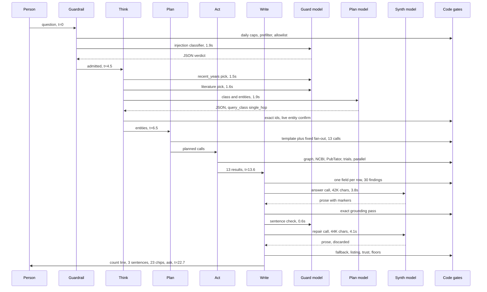

# Review of the product harness: how a question becomes an answer

Written 2026-09-25 for the product owner, on their words "review our harness: understand the harness and what can be done to improve it. Because I do not think our harness works well right now." This report covers the product's harness only: the machinery in `src/system_03_search_agent/` that turns a typed question into a cited answer. The build harness (skills, rules, hooks, bossman mode) is a separate report, `build_harness.md`.

Every defect below cites a file and line, a saved golden run, a number computed from the 150 saved phase 8.2 runs, or one of five live runs made for this review. A claim that could not be verified is labelled a hypothesis. Live spend for the review: under 10 cents in total (five traced questions at 1.7 to 2.0 cents each, plus three probe calls of a fraction of a cent).

## Table of contents

- [In plain words](#in-plain-words)
- [How the harness works today](#how-the-harness-works-today)
- [What the writer model is actually given](#what-the-writer-model-is-actually-given)
- [What the 150 saved runs measure](#what-the-150-saved-runs-measure)
- [What is wrong](#what-is-wrong)
- [What to change, ranked by what the person notices first](#what-to-change-ranked-by-what-the-person-notices-first)
- [What not to change](#what-not-to-change)
- [Whether phases 8.6 and 8.7 aim at the constraint](#whether-phases-86-and-87-aim-at-the-constraint)
- [Open questions for the product owner](#open-questions-for-the-product-owner)
- [Method and evidence](#method-and-evidence)

## In plain words

What a person asking a question gets today, measured over the 102 golden runs that answered on 2026-09-25 and five questions traced live for this review:

- An answer that opens with a count of records ("Found 4 disease records for brca1: ..."), never with a sentence that answers the question. This holds on 102 of 102 answered runs.
- Under that line, in 43 of 102 answered runs, not one sentence written by the writing model: 30 runs fell back to the code-built record list outright, and 13 more kept zero model sentences. Where model sentences do survive, the median is 2.
- A long record list, grouped by type, with a citation chip per row. Median 24 citations, up to 84.
- A trust line reading "Based on N sources, not yet confirmed" on 57 of 102 answered runs. No run in the set ever reads "Confirmed by N independent sources".
- About 27 seconds of waiting (median 26.6, p90 39.1 seconds), of which the writing step is 73 percent at the median, and nothing on the screen until the whole answer lands.

The three biggest reasons it falls short:

1. The writer is asked to answer from records that often do not contain the answer, and one field per record is all it is shown. TP53's orthologs reach it as forty lines of "Gene NCBIGene:..., name: tumor protein p53" with no organism; CFTR's papers reach it as thirty lines of "Article record PMID:..." with no title, because the harness strips a graph Article's title as untrusted free text; rs334 reaches it as one line of clinical significance values, although the dbSNP record also carries the linked gene. No writer model can say what is not in its prompt, and the exact citation gate is right to strip whatever it invents to fill the gap. This is the constraint on answer quality, and it sits in retrieval and prompt assembly, not in the writer and not in the gate.
2. The writing step does twice the work it needs to, on every question. A second, "completeness repair" call to the writing model fires on nearly every answered question because the check meant to skip it compares record views by citation id while the listing it probes collapses them by record. In four of five traced questions the second call's reply contributed nothing to the final answer. Each writing call also carries a 32,914-character prefix of which 27,669 characters are the seven tool schemas, which the writer is forbidden to use. Two such calls are about 90 percent of the cost of a question and most of its wait.
3. The trust line hedges by construction, not by evidence. A gene-to-disease claim is classed high risk and can only be "confirmed" through a value table that holds seven clinical-significance words. A disease name is not in that table, so every gene-to-disease answer reads "not yet confirmed" whatever the evidence says. The person reads a warning about their answer; the code is reporting a missing lookup table.

The first three changes I would make, in the order a person would notice them:

1. Make the second writing call fire only when it can change the answer (a fifteen-line fix in `core/graph.py`, `_code_built_lines_will_cite`). The person gets the same answer several seconds sooner, and the product pays about 40 percent less per question.
2. Hand the writer the field the question asked for: the organism for an ortholog, the title for a graph paper, the gene and its condition for a variant. Three bounded changes in the retrieval shaping code, one per shape. The person's TP53 question names species, the CFTR question names papers, the rs334 question names the gene.
3. Say what the trust line actually knows: "From one database, MedGen" instead of "not yet confirmed" when a single origin backs a claim and no second origin could have been checked. One wording change in `synthesis/trust.py`, and the product owner's decision on the words (card 8 already waits on them).

## How the harness works today

One question runs through five LangGraph nodes in a fixed order: guardrail, think, plan, act, write. Three of them call a language model; plan calls none since 2026-09-14 (`core/graph.py:5347`), and act calls a model only for two side jobs (a model-written Cypher query when no template fits, and a guard-tier reader pass over untrusted free text). Every chat call goes through `Harness.call_tier` (`harness/harness.py:513`); every closed-option decision goes through `decide()` (`harness/decide.py:342`), which asks Jev when `CLASSIFIER_PROVIDER=jev` and the guard tier otherwise or as fallback.

The diagram shows the flagship question `what diseases are linked to brca1?` as traced live on 2026-09-25 (seven model calls, 22.7 seconds, 1.86 cents). The times are seconds since the question arrived.

The five traced questions, one per shape. Each row is one live local run against develop's own code; the "model calls" column counts chat calls only, since the local run decided with the guard tier and Jev was not called.

| Question | Shape | Wall seconds | Model calls | Synth calls | Cost, cents | Writer prose kept | Trust |
|---|---|---|---|---|---|---|---|
| G-013 what diseases are linked to brca1? | Gene to diseases | 22.7 | 7 | 2 | 1.86 | 3 sentences | ask |
| G-022 Marfan phenotypic features | Disease features | 22.9 | 8 | 2 | 2.01 | 3 sentences | answer |
| G-024 rs334 and its condition | Variant | 14.1 | 7 | 2 | 1.70 | none, fallback list | ask |
| G-021 papers mentioning CFTR | Papers | 27.2 | 7 | 2 | 1.74 | none, fallback list | ask |
| G-012 trials for carcinoma NOS | Trials | 12.7 | 7 | 2 | 1.81 | none, fallback list | ask |

The call sites, in the order a question meets them, with what each is given and what checks it:

| Step | Call | Tier | Given | Checked by | Trace timing |
|---|---|---|---|---|---|
| Guardrail | Injection and off-topic verdict (`guardrail/classifier.py:175`) | Guard | The question inside a nonce-tagged block, 3.8K characters, no prefix | Pydantic schema, one retry, then step error | 0.7 to 3.4s |
| Guardrail | Relevancy decision, only when the biomedical allowlist misses (`core/graph.py:1246`) | Jev, guard shadow | The question and the previous one | Closed options | 11 of 150 golden runs |
| Think | Ask-back decision and choices writer, only for one to three words (`core/graph.py:2933`) | Jev plus guard writer | The question | Closed options; parsed choices | 0 of 150 golden runs |
| Think | recent_years and literature decisions (`core/graph.py:2867`) | Jev, guard shadow | The question | Closed options | 0.7 to 6.5s, concurrent |
| Think | Classification and entity extraction (`core/graph.py:2755`) | Plan | The question, exact ids, memory suffix, 4.3K characters, no prefix | Pydantic schema, one corrected retry | 0.9 to 3.1s |
| Think | Entity confirmation | none | Live NCBI lookups | Exact id or live match | inside the think span |
| Plan | Template selection and the fixed fan-out (`core/graph.py:5318`) | none | Resolved entities | Deterministic | 0.0s |
| Act | Cypher generation when no template fits (`tools/cypher_generation.py`) | Plan | Schema slice and intent, 4.8K characters | Cypher validator, one repair | 1.9 to 2.1s, 2 of 5 traces |
| Act | Reader pass over quarantined Article text (`harness/coordinator_worker.py:456`) | Guard | One free-text payload | Fixed JSON shape | 6.2s, 1 of 5 traces |
| Write | Answer synthesis (`core/graph.py:10930`) | Synth | Prefix 32.9K plus instruction 4.3K plus findings and directives | Exact grounding pass | 2.0 to 3.8s |
| Write | Sentence check on reworded sentences (`core/graph.py:8076`) | Guard | Sentences and their quotes | Strict JSON of item numbers | 0.6 to 2.0s, 2 of 5 |
| Write | Completeness repair (`core/graph.py:11122`) | Synth | The same prompt plus the omitted block | The same grounding pass | 2.5 to 5.1s, 5 of 5 |

What the plan step decides, and how: nothing is chosen at run time by a model. `_select_planned_tool_call` picks `cypher_query` whenever an entity resolved; `select_template` (`tools/cypher_templates.py:711`) picks a fixed Cypher template from the anchor label and a keyword shape, and falls back to the plan model only when no shape matches; `_build_layer_tool_calls`, `_build_breadth_calls`, `plan_gene_summary` and the GO-terms call add the same fan-out to every gene question (live gene record, PubTator, trials, PubMed 5, ClinVar 10, OMIM 10, gene summary, GO terms). The 150 golden runs show a median of 12.5 tool calls per answered question and a median of 11 Layer 2 and 3 HTTP calls against the ceiling of 20; no run hit the ceiling.

What the write step does, in order (`core/graph.py:10582` to `11862`): build the findings list with one representative field per row (`_pick_representative_field`, `core/graph.py:7608`, prefers `name`, else the row's first field), admit up to 100 rows for display and 30 for the prompt with the question's own graph rows first, resolve MedGen and MeSH identifiers to names live, call the synth model, extract quoted spans, run the exact grounding pass, ask the guard model about reworded sentences that passed every code check, decide whether to repair, possibly call the synth model again, fall back to the code-built list when nothing grounded, drop sentences that only restate a list row, ground the code-built listing of every record, compute a trust verdict per claim, floor the answer-level verdict to `ask` for four separate reasons (fallback used, findings omitted, a failed search, an entity unaddressed), build the code-built opening sentence, and emit tokens.

## What the writer model is actually given

The rule in `attack-the-constraint` is to print the model's real input before judging its output. The five traces saved every writer prompt. The stable prefix is identical on all of them: 32,914 characters, of which the seven tool schemas are 27,669, the few-shot routing pool 3,974, the system instructions 779 and the graph concept schema 486. The writer's own instruction is another 4,292 characters. The findings block and directives are 1,000 to 7,000 characters. Prompt tokens per call ran 10,355 to 11,988, so roughly 8,000 tokens of every writer call are prefix the writer's own rules forbid it to act on (rule 7 of `SYNTH_SYSTEM_INSTRUCTION`: no tools, no lists, no tables).

Whether the right answer is even expressible from the findings block, shape by shape:

| Question | What the writer was given | Is the answer expressible | What came back |
|---|---|---|---|
| G-013 gene to diseases | `[1] Disease name: Familial cancer of breast` and three more, then 26 context rows (gene symbol, papers, ClinVar titles, OMIM, a trial, GO terms, the gene summary at `[15]`) with a directive naming `[1]` to `[4]` as the answer | Yes. The four diseases and the plain-English gene summary are present | Three sentences survived: the four diseases, and two sentences quoting the gene summary. The code-built count line still leads |
| G-022 disease features | `[1] Disease name: Marfan syndrome`, ten `medgen clinical_features` rows, papers, trials, a `[23]` abstract, with a directive that names the feature rows and dictates the one sentence shape that passes | Yes, once the features directive exists | The features sentence and two abstract-quoting sentences survived. The `answer` verdict here is because clinical features are low risk, not because they were corroborated |
| G-024 variant | Six lines: `[1] Variant record clinical_significance: not-provided, protective, likely-benign, pathogenic, other`, then five LitVar2 near misses (`rs334348`, `rs334353`, `c.-50T>C`, `rs334773`, `c.20A>T`) | No. Neither the gene (HBB) nor the condition (sickle cell) is in the prompt. The dbSNP output schema carries a `genes` field (`tools/ncbi_dbsnp_schemas.py:419`) and the row handed on leads with clinical significance, so one field per row is what the writer saw | The model correctly wrote that no condition was retrieved; every sentence was stripped for citing nothing, and the fallback list of near misses shipped, which is card 37's defect |
| G-021 papers | Thirty lines of `Article record PMID:10075921`, no titles, no abstracts | No. The graph's Article rows carry a title in `name`, but `_sanitized_citeable_row` drops the row's fields as untrusted free text (`core/graph.py:6016`, module docstring lines 243 to 260), and the guard-tier reader's summary never becomes a citable value | The model wrote plausible topic groupings ("promoter architecture", "chloride channel activity") over bare PMIDs; every sentence was stripped as invented, correctly. The fallback listed 54 PMIDs. This is card 38, and the answer to its open question: the graph has the field and the harness removes it |
| G-012 trials | Five trial titles, a derived MedGen concept, a breast-cancer paper's title and abstract, and the "MedGen lists no clinical features" line | Partly. The trials are present; the MedGen concept and the paper are noise for this question | The model listed the trials in prose; `drop_record_restatements` removed those sentences because the table below shows the same titles, and nothing else survived. The person got the count line and the table |

Two things follow. First, for the shapes where the answer is not in the findings (variant, papers, orthologs per the saved G-016 run), a better writer model changes nothing, which is exactly what both writer benches measured: no model cleared 0.4 answered on these shapes. Second, where the answer is present, the gate keeps two or three sentences and the code-built count line still opens the answer, which is what phase 8.7 is for.

## What the 150 saved runs measure

Source: `testing/Developer/reports/2026-09-25_phase_8.2_golden/raw/`, 150 runs, 102 answered. Computed by the analysis script in this review's scratch folder; the method is stated in [Method and evidence](#method-and-evidence).

Outcomes on the 102 answered runs:

| Measure | Value |
|---|---|
| Trust verdict `ask` | 57 |
| Trust verdict `answer` | 42 |
| Trust verdict `flag` | 3 |
| Trust line "Confirmed by N independent sources" | 0 |
| Opening line code-built ("Found ..." or "I found ...") | 102 |
| Structured fallback used (model prose grounded nothing) | 30 |
| Non-fallback runs with zero model sentences kept | 13 |
| Model sentences kept on the other 59 runs, median | 2 (p90 10) |
| Answers carrying "MedGen lists no clinical features for ..." | 15 |
| Answers carrying the incomplete-answer note | 6 |
| Answers carrying the failed-search note | 1 |
| Must-cite hits | 160 of 215 |

Time, on the 102 answered runs, in seconds:

| Stage | Median | p90 | Max |
|---|---|---|---|
| Guard event to think event | 2.9 | 8.8 | 16.6 |
| Think to plan | 0.0 | 0.0 | 0.6 |
| First tool start to last tool result | 1.7 | 8.3 | 90.3 |
| Write started to done | 16.3 | 27.7 | 45.0 |
| Guard event to done | 23.7 | 34.9 | 100.4 |
| Client wall time | 26.6 | 39.1 | 102.7 |

The write step is 73 percent of guard-to-done at the median. Locally the same two synth calls took 4.5 to 8.9 seconds per question; on develop the write step takes twice that, and the saved events cannot say whether the model provider or the server's own grounding passes account for the difference (hypothesis, see W9).

Calls and citations on the 102 answered runs:

| Measure | Value |
|---|---|
| Tool calls per run, median | 12.5 (max 15) |
| Layer 2 and 3 HTTP calls per run, median | 11 (max 19, ceiling 20, none at ceiling) |
| Tool results by status | ok 988, empty 54, error 1 |
| Citations per run, median | 24 (p90 72, max 84) |
| Citations by layer, total | Layer 2: 1650, Layer 1: 1339, Layer 3: 436 |

Classifier decisions on all 150 runs: `plan.literature` 117 (116 by Jev, 1 by the guard after a Jev timeout), `think.recent_years` 118 (all Jev), `guardrail.relevancy` 11 (all Jev), `think.ask_back` 0. The guard's comparison pick was not ready within its one-second grace on 159 of 246 decisions. Jev's own latency: median 144 ms (from the slowdown report).

What the saved runs cannot measure: cost (every saved `done` carries `total_cost_usd: 0.0`, W2), time to first token (the golden client drops `token` and `trust_signal` events, `testing/Developer/reports/2026-09-22_10.3_consistency/run_consistency.py:277`), and which model call took how long (no per-call timing event exists).

## What is wrong

### W1. The second writing call fires on nearly every question and usually changes nothing

- Evidence: all five live traces made two synth calls. The gate that should skip the repair, `_code_built_lines_will_cite` (`core/graph.py:8106`), requires every omitted finding's `citation_id` to be cited by the code-built listing it probes, but that listing runs `one_finding_per_record` (`synthesis/findings.py:1150`) first, which keeps one view per record. A PubMed record that reached the prompt as title, pmid and abstract therefore always leaves two ids uncited, and the gate returns False. Reproduced offline with the product's own functions: three views of one paper, model reported none, gate False; the same paper as one view, gate True. `unreported_findings` (`synthesis/findings.py:1580`) already treats a collapsed view as reported, so after the listing the answer reports nothing omitted; the two functions disagree about what "cited" means.
- Effect: one extra synth call per question at 2.5 to 5.1 seconds locally (the golden run's write step is 16.3 seconds at the median for two calls), and about 0.8 cents of the 1.7 to 2.0 cent question cost. In four of the five traces (G-012, G-013, G-021, G-024) not one sentence of the repair's reply reached the final answer; in G-022 the repair's reply was kept.
- Class: defect introduced by the 2026-09-23 collapse (`one_finding_per_record`) into the 2026-09-14 speed fix, neither wrong on its own.

### W2. Cost per question cannot be read from any saved run

- Evidence: `harness/cost_control.py:679` to `693` zeroes `total_cost_usd` on every `done` event that reaches an end-user surface and drops `cost` events (`_BUILDER_ONLY_EVENT_TYPES`, line 626). The golden client is an end-user surface, so all 150 saved runs read 0.0. Cost is persisted only in the `interactions` table (`feedback/capture.py:472`), which this review did not read.
- Effect: the product owner's spend decisions (the $8 daily cap, the writer bench) rest on per-run bench figures, never on the golden runs themselves.

### W3. The done event's elapsed time excludes the writing step

- Evidence: `core/graph.py:10587` reads `elapsed_ms` at the top of `write_node`, before the synth call at line 10930, and writes that value into `done` at line 11839. On 97 of 102 answered golden runs `done.elapsed_ms` under-reads the guard-to-done span by more than a second, median 13.5 seconds, tracking the write step exactly. Example: G-001 run 1, `elapsed_ms` 8.5 seconds, guard to done 26.6 seconds, client 31.0 seconds.
- Effect: any dashboard or analysis that trusts the product's own duration figure sees a product roughly twice as fast as it is, and misses the step where the time goes.

### W4. The trust line says "not yet confirmed" by construction for every gene-to-disease answer

- Evidence: `synthesis/trust.py:247` classes a Disease row reached through `gene_associated_with_condition` as high risk; `triangulate` (line 366) compares values through `bucket_for`, whose table `_BUCKET_BY_VALUE` holds seven clinical-significance strings in three buckets; `bucket_for("Familial cancer of breast")` is None, so the result is `insufficient` and the decision table (line 406) returns `ask`. Reproduced offline. On the golden set 57 of 102 answered runs read `ask` and none reads "Confirmed".
- Effect: the person reads a hedge on the one question shape the product exists for, and cannot tell it from a real disagreement or a real single-source gap. Card 8 (trust-line wording) waits on the product owner; this is the mechanism behind what they will be deciding.

### W5. The writer's prompt is 70 percent tool schemas and routing examples it may not use

- Evidence: the stable prefix measured from `harness/cache.py`'s own builder is 32,914 characters: tool schemas 27,669, few-shot pool 3,974, system instructions 779, graph schema 486. Since 2026-09-13 the think call skips the prefix (`core/graph.py:2777`) and the plan step makes no call, so the write step is the prefix's only consumer, twice per question. `SYNTH_SYSTEM_INSTRUCTION` rule 7 forbids the writer any tool use, and the few-shot pool is Section 17's routing examples for Think and Plan. No prompt-cache hit metric exists anywhere under `src/` (tech spec 4.4 unimplemented), and `_price_per_token` bills full input tokens, so the product's own accounting charges the full prefix on both calls whether or not the provider caches it.
- Effect: about 16,000 of the roughly 22,000 prompt tokens a question spends on writing carry nothing the writer can use. Reducing the writer's prefix to its instructions and the graph schema would cut writer input tokens by about 70 percent per call. This needs the product owner's decision, because `prompt-cache-discipline` asks before changing the prefix assembly (see the open questions).

### W6. The writer request shape excludes a whole class of frontier models, and the failure is reported as the model's fault

- Evidence: every `anthropic/claude-opus-5.5` row in `testing/Developer/reports/2026-09-26_writer_bench_2/results.jsonl` refused with "A step in this query could not complete as requested" at a tenth of a cent, meaning the synth call never returned. Probed live for this review with the product's exact request shape (`_TIER_REASONING["synth"]` = `{"effort": "none"}`, `harness/harness.py:314`): OpenRouter returns HTTP 400, "Reasoning is mandatory for this endpoint and cannot be disabled." The same ten-word prompt succeeds with the reasoning block omitted and with `effort: low`. `call_tier` classes a 400 as `recoverable` and never retries or adjusts (`harness/harness.py:596` to `615`).
- Effect: the product owner's model decision (card 5, "frontier models where needed") is being made on bench rows that measure a request-shape incompatibility, not answer quality. The bench's opus rows should be discarded as evidence.

### W7. A model with no known price is billed and its reply thrown away

- Evidence: `_price_per_token` (`harness/harness.py:195`) runs after the completion returns (line 620) and raises `HarnessCallError(error_class="unexpected")` when neither litellm's map nor the three-entry `_FALLBACK_PRICES_USD_PER_TOKEN` (`harness/tiers.py:116`) prices the model. The tiers.py comment records the day this stopped every query (2026-07-29). Today every candidate model in both benches is in litellm's map (checked for this review), so the defect is latent, not live.
- Effect when it fires: the provider bills the call, the person sees "A step in this query failed unexpectedly", and nothing in the loop says the cause was a missing price.

### W8. The person waits on the comparison, not on the decision

- Evidence: `decide()` waits up to `GUARD_COMPARISON_GRACE_S` (1.0 second, `harness/decide.py:101`) for the guard's shadow pick after Jev has answered; 159 of 246 golden decisions record `guard_not_ready`. The slowdown report attributes the p90 growth before Think (4.8 seconds) to this. Phase 8.6, T-8.6-01, removes the shadow call from the live path; this review confirms the mechanism and adds nothing new.

### W9. Develop's write step is twice as slow as the same two calls run locally, and nothing records why

- Evidence: locally the two synth calls took 4.5 to 8.9 seconds per question with under a second between the second call's return and `done`; on develop the write step is 16.3 seconds at the median. The saved events carry no per-call timing, no token timestamps, and no cost events. Hypothesis: the model provider's latency at the deployment's hour, as the slowdown report's lead concluded, since the grounding passes measured under a second locally. Not settled by this review; W3 and the missing per-call timing are what would settle it.

### W10. The loop has no check-and-adjust step, so a search that returned the wrong kind of record ships as an answer

- Evidence: `plan_node` makes no model call and never re-plans; `act_node` runs the plan and records failures in `failed_searches` for `write_node` to mention in one sentence. A search that succeeded but returned records without the asked-for field (G-016, G-021, G-024 above) is `status: ok` and is written up. DECISIONS.md 2026-09-25 records the product owner's decision to add one classifier-gated check after Act with at most one re-plan; no code implements it yet (no `re-plan`, `plan.resource` or `results_answer` symbol under `core/`). This is the product owner's card 6 in the agentic loop's terms: interpret, plan, use tools, check intermediate results, adjust when something fails.
- Effect: the honest gap sentence ("no cited record carries the field asked for") that the 8.7 design wants for five of its fifteen questions cannot be produced by any step today, because no step asks whether the records answer the question.

### W11. Two smaller defects in what the person reads

- "MedGen lists no clinical features for ..." appears in 15 of 102 answered runs, on questions that did not ask about features (card 1, being fixed in phase 8.6 T-8.6-06).
- The reworded-sentence check and the structured fallback interact so that a model sentence which correctly says "no condition was retrieved for rs334" is stripped for citing nothing (it is true and uncitable), and the fallback then lists LitVar2's near misses as if they were rs334 (card 37).

## What to change, ranked by what the person notices first

Every change below keeps the cite-or-refuse gate exactly as strict as it is. None crosses the v1 scope boundary; the one that comes near it (C7) is the product owner's own decision of 2026-09-25 and is bounded to one re-plan, not sub-query decomposition, whose trigger (a failure rate above 20 percent on the deep-research class) is not met: the discovery category answered 17 of 18 golden runs.

### C1. The second writing call fires only when it can change the answer

- What the person notices: the same answer arrives several seconds sooner. On develop's timings, expect the write step's median to fall from about 16 seconds toward 8 to 10, and the question's cost to fall by about 40 percent.
- Files: `core/graph.py`, `_code_built_lines_will_cite` (lines 8106 to 8154): compare by record using the same representative rule `unreported_findings` uses, or simply run `unreported_findings(cited_ids, omitted)` and require it empty. One test in `tests/system_03_search_agent/core/` with a three-view paper. About 15 lines.
- Risk: low. The repair still runs when the model grounded nothing, when the tool outcome is not `ok`, and when a code-built sentence fails the pass; only the case where the listing already shows every omitted record is skipped, which is the case the 2026-09-14 speed fix was written for.
- Proof: re-run the five traced questions and confirm one synth call each on G-012, G-013, G-021, G-024; then the golden consistency run, answered count not below 102 of 150, write-to-done median recorded alongside.

### C2. Hand the writer the field the question asked for

- What the person notices: TP53's orthologs come with a species, CFTR's papers come with titles, rs334 comes with its gene. Three shapes that today list identifiers start answering.
- Files and size, one bounded change per shape:
  - Papers from the graph: after the graph returns Article rows, plan one ESummary call for the shown PMIDs and attach titles, the way `breadth_plan.plan_literature_follow_up` already does for PubMed search results. `core/graph.py` (`_follow_up_calls_for`, the Article quarantine path around line 6001), within the 20-call ceiling. Medium, about 60 lines.
  - Orthologs: the `orthologous_to` template returns gene rows; add the `in_taxon` hop so each row carries the organism (`tools/cypher_templates.py`, the Gene hop table at line 246; `in_taxon` is a documented edge, `harness/cache.py:459`). Medium, needs a live probe of the hop's cost on the 715-row TP53 case. Hypothesis until probed: the graph carries the taxon for these rows.
  - Variants: the dbSNP pseudo-row already carries the linked gene (`core/graph.py:3674`, `"genes"`), and `_pick_representative_field` (`core/graph.py:7608`) keeps only the row's first usable field, which is clinical significance. Emit the gene as a second finding for the same row, the way `explanatory_value_for_row` already emits a gene's `summary` beside its name (`synthesis/findings.py:454`, `_EXPLANATORY_FIELDS` at line 128). Small, about 10 lines. The condition is not in the dbSNP row (`tools/ncbi_dbsnp_schemas.py:370` onward carries no condition field); it would come from the ClinVar side of the fan-out, which `_rsids_in_text` already routes to LitVar2 and dbSNP only. Hypothesis until probed: a ClinVar ESearch by rs id returns the condition for rs334.
- Risk: medium. Each adds rows the exact gate will check; each needs the golden run.
- Proof: the golden run's G-016, G-021 and G-024 rows show model sentences kept and the first-sentence rubric passes; answered count not below 102.

### C3. Say what the trust line knows

- What the person notices: under a BRCA1 answer they read "From one database, MedGen" or "Confirmed by 2 independent sources", never "not yet confirmed" for a check that could not have run.
- Files: `synthesis/trust.py`, `answer_trust_line` (line 546), wording only; `decide` and the decision table unchanged. About 10 lines. The words are the product owner's call (card 8, Q3 below).
- Risk: low. No verdict changes; only the sentence derived from it.
- Proof: the golden run's `trust_line` values; a unit test per branch.

### C4. Make the writer request portable across providers

- What the person notices: nothing today, since develop's writer accepts `effort: none`. What the product owner notices: the frontier-writer bench becomes real.
- Files: `harness/harness.py`, `call_tier` (lines 556 to 615): on a `BadRequestError` whose text names reasoning, retry once without the `reasoning` block, logging the fallback; or read `supported_parameters` from OpenRouter once per process, which the file's own comment (line 249) says was verified live for three models. About 25 lines plus a test that replays the 400 text.
- Risk: low. A model that rejects the block runs with its own default reasoning, so its `max_tokens` ceiling still bounds the bill.
- Proof: re-run the ten opus rows of the second writer bench; they must return answers, not "could not complete".

### C5. Report time and cost where an analyst can read them

- What the person notices: nothing directly. Every later speed decision rests on this.
- Files: `core/graph.py:10587`, compute `elapsed_ms` at emission (one line moved); `harness/harness.py`, record per-call `elapsed_s` alongside cost on `LLMResponse` and emit it on the `cost` event (operator view only, `contracts/events.py` additive field); the golden client `run_consistency.py:277`, keep the first `token` event's timestamp even if the rest are dropped. About 40 lines across three files, all additive to the v1 contract.
- Risk: nil for the product; the cost event is already operator-only.
- Proof: the next golden run's summary shows time to first token and per-call time by tier.

### C6. Price a model before calling it

- What the person notices: nothing unless a new model is deployed with no price, in which case they no longer pay for a discarded reply.
- Files: `harness/harness.py`, move the `_price_per_token` lookup ahead of `litellm.acompletion` in `call_tier` and fail before dispatch with the same actionable message. About 10 lines.
- Risk: nil.

### C7. The check-and-adjust step, as decided on 2026-09-25

- What the person notices: a question whose records cannot answer it either gets a second, better-aimed search or an honest first sentence saying what the records lack, instead of a list that looks like an answer.
- Files: a new decision point through `harness/decide.py` after `act_node`, with a closed reason vocabulary drawn from this review's measured gaps (missing field: organism, title, gene, condition; empty graph; failed search); `plan_node` re-entered once with the reason; `core/state.py` additive fields. Large, a build phase.
- Risk: medium. It is bounded to one re-plan inside the 20-call ceiling and the cost cap, as the decision says. It is not sub-query decomposition (v1 out of scope) and must not grow into it.
- Proof: the golden run answered count not below 102, and the 8.7 acceptance test's "states a gap honestly" outcome appearing on G-016, G-021, G-024 and G-035.

### C8. Trim the writer's prefix (after the product owner's decision, Q2)

- What the person notices: the writing step gets faster by whatever the provider charges in time for 8,000 input tokens, twice; the product pays about 70 percent less for writer input.
- Files: `core/graph.py:10938` and `11127`, pass a writer-specific prefix (system instructions plus graph schema) instead of `_STABLE_PREFIX`; `harness/cache.py`, a second builder; the byte-equality test in `tests/system_03_search_agent/harness/test_cache.py` extended to the new prefix. About 40 lines.
- Risk: low in code, but it amends `prompt-cache-discipline`'s "Think, Plan and Write share one stable prefix", whose premise has already lapsed. A decision row, not a silent change.

## What not to change

- The exact cite-or-refuse gate (`synthesis/grounding.py`). Every sentence stripped in the five traces was stripped correctly: the model had invented topics for bare PMIDs, or restated a list. The gate is doing its job; the input is what fails it. Making it fuzzier would ship the invented topics.
- The reworded-sentence check's fail-closed shape (`synthesis/sentence_check.py`). It approved nothing it should not have in any trace, and it costs 0.6 to 2 seconds only when candidates exist.
- Template-first Cypher with the model as fallback. The model path fired on 2 of 5 traces (variant and trials shapes, where no template fits) and validated first time; the templates are why the same question returns the same rows.
- The code-built record listing at every depth. It is the one part of the answer that is complete and deterministic; phase 8.7 changes what leads it, not whether it exists.
- The Jev seam and its fail-open defaults. It is in flight in phase 8.6 and the measured decisions agree with the guard tier 82 of 86 times where both answered.
- The order of the guardrail's checks: daily caps, prefilter, injection classifier, relevancy, forbidden screen. Cheapest first, and the refusal mix on the golden set (32 of 33 expected refusals inside their acceptable outcomes) says it works.
- The per-step budgets and reasoning `none` on the three tiers for the models that accept it. Every value carries its measurement in `harness/harness.py`; C4 makes the reasoning dial portable rather than changing its value.

## Whether phases 8.6 and 8.7 aim at the constraint

Phase 8.6, Jev decides alone and the injection verdict, question class and a features decision move to Jev: it aims at speed's smaller half and at correctness of the small choices. Removing the one-second shadow wait recovers the p90 growth before Think (4.8 seconds) and nothing at the median; the write step, where 73 percent of the time goes, is untouched by it. Moving the injection verdict to Jev removes a 0.7 to 3.4 second guard call from every question's critical path only if Jev's 144 millisecond median holds for a longer state; that would be a real median gain. T-8.6-06 (features only when asked) fixes W11's first item. So 8.6 is right for what it targets, and it does not target the constraint on answer quality.

Phase 8.7, a classifier picks which grounded sentence opens the answer: it aims exactly at the first thing a person reads, and its own design says half its sample has no answer in the records. For that half it needs C2 first, or its "states a gap honestly" outcome needs C7's check to know what is missing. Its extra guard-tier call per answer is small next to the repair call C1 removes. Recommendation: land C1 before or with 8.7, so 8.7's added call is paid for twice over.

Neither phase touches the composition constraint named in the first section: one field per row, the Article title stripped, the ortholog rows without a species. That is C2, and it is not on any board card as a build item today; card 38 records the question this review answers.

## Open questions for the product owner

One at a time, each yes, no or pick one, with a recommendation.

1. Fix the repair gate so the second writing call fires only when it can change the answer (C1)? Yes or no. Recommendation: yes, first, as a UI-fix-loop change on develop, measured by the five traces and the golden run.
2. Trim the writer's prefix to its own instructions and the graph schema, dropping the seven tool schemas and the routing examples the writer may not use (C8)? Yes or no. Recommendation: yes, recorded as a decision amending `prompt-cache-discipline`, since Think left the prefix on 2026-09-13 and Plan makes no call.
3. The trust line when one database backs a claim and no second could be checked: (a) keep "Based on N sources, not yet confirmed"; (b) "Based on N sources, from one database, MedGen"; (c) drop the clause and keep "Based on N sources". Recommendation: (b), because it says what was and was not checked, which is the honest form of the hedge.
4. The writer request shape for models that reject `effort: none`: (a) retry once without the reasoning block and log it; (b) keep GLM only and close card 5. Recommendation: (a), since the second bench's opus rows measured the request shape and not the model.
5. For papers found in the graph, fetch titles for the PMIDs shown, one ESummary call inside the 20-call ceiling (C2, papers)? Yes or no. Recommendation: yes; it is the answer to card 38 for the paper shape and reuses the follow-up planner that already exists.
6. Should phase 8.7 wait for C1 and the paper and variant halves of C2, or proceed now? Pick one: (a) proceed now; (b) after C1; (c) after C1 and C2. Recommendation: (b). C1 is small and pays for 8.7's added call; C2's shapes can follow inside 8.7's own acceptance test, whose gap rows already name them.
7. Add per-call timing and time to first token to the operator-only cost event and the golden client (C5)? Yes or no. Recommendation: yes, before the next speed decision, so develop's write-step slowness (W9) is measured rather than attributed.

## Method and evidence

- Source read in full or in its load-bearing parts: `core/graph.py` (module docstring, `_dispatch_tier_call`, the classifier seam, `guardrail_node`, `think_node` and `_think`, `plan_node`, `act_node`, `_ground_with_sentence_check`, `_code_built_lines_will_cite`, `_pick_representative_field`, `_answer_tokens`, `write_node`, routing), `core/run.py`, `core/state.py`, `harness/tiers.py`, `harness/harness.py`, `harness/decide.py`, `harness/jev_client.py`, `harness/cost_control.py`, `harness/cache.py`, `harness/coordinator_worker.py` (the reader pass), `synthesis/grounding.py`, `synthesis/sentence_check.py`, `synthesis/findings.py` (the instruction, directives, `build_synth_findings`, `one_finding_per_record`, `build_structured_fallback_narrative`, `unreported_findings`), `synthesis/answer_layout.py` (`answer_summary_sentence`), `synthesis/trust.py`, `guardrail/classifier.py`, `tools/catalogue.py`, `tools/cypher_query.py` and `tools/cypher_templates.py` (function maps), `core/breadth_plan.py` (function map), `core/clarify.py` (header).
- Design read: `docs/architecture/Model_architecture.md`, `requirements/Technical_specification.md` Sections 3 and 4 (read, not edited), `testing/UI_fix_plan.md` (To do, the product owner's direction of 2026-09-23, Build in progress), `tracker/phase_8.6.md`, the phase 8.7 design, `DECISIONS.md` rows of 2026-09-24 and 2026-09-25, `LEARNINGS.md` headings, the findings sections of `tracker/phase_8.1.md`, `phase_8.2.md` and `phase_8.5.md`, the phase 8.1 product review, both writer benches, the slowdown report.
- Offline measurement: a script over the 150 saved runs in `2026-09-25_phase_8.2_golden/raw/`, reading each run's `record`, `events` and `answer_text`. Model prose kept is the count of sentences between the opening line and the first code-built heading, excluding note lines; fallback is the fixed note `_build_structured_fallback_note` emits; stage times are differences between the saved event timestamps; `elapsed_ms` is read from the saved `done` payload.
- Live runs, local only, five questions, one each, at researcher depth, against develop's own code with `.env` loaded and never printed: `Harness.call_tier` and `jev_client.call_jev` were wrapped to record tier, call site (from the system message's opening words), prompt and reply size, elapsed time and metered cost; the synth prompts and replies were saved whole. Concurrent calls pool their cost deltas, so per-call cost is exact only for sequential calls; totals are exact. Local runs decided with the guard tier (no Jev call was made) and did not persist an interaction row, since the driver passed no caller identity.
- Probes, no model or network unless stated: `_code_built_lines_will_cite` against a three-view paper and a one-view control; `trust.decide` against a gene-to-disease claim, a clinical-significance claim and a clinical-features claim; litellm's price map for nine model ids; one live probe of three ten-word calls to the opus model with the product's request shape, without the reasoning block, and with `effort: low`.
- Live spend: five traced questions, 1.86 + 2.01 + 1.70 + 1.74 + 1.81 cents metered, plus the three probe calls under 0.1 cent; under 10 cents in all, against the review's 50 cent allowance.
- Not done: production's settings were not read; the `interactions` table was not queried; no golden run was started; no file outside this report and the scratch folder was written.
