# Answer speed: where the seconds go, and a plan for 20 seconds

This is a diagnosis and a plan, not a build. It answers the product owner's ask of 2026-09-26: every answer in 20 seconds or less, something useful on screen within about 3 seconds, and not one correct answer lost. It builds on the 2026-09-25 slowdown analysis (`testing/Developer/reports/2026-09-26_slowdown/findings.md`) and says where it agrees and where it adds. Measured on:

- the saved golden runs
- 11 live questions on develop at the re-land's code (no `src/` change since c0bf50b)
- 8 questions traced call by call locally against develop's code, with develop's tier models and Jev mode

The diagnosing agent returned this report as text, because its harness has sub-agents return findings rather than write report files. The lead saved it here unchanged, beside the agent's scripts and outputs.

## Table of contents

- [Summary](#summary)
- [Time breakdown](#time-breakdown)
- [Trend](#trend)
- [Streaming: what a person sees, and why the text does not stream](#streaming-what-a-person-sees-and-why-the-text-does-not-stream)
- [Caching and indexing](#caching-and-indexing)
- [P01: why summaries are withdrawn](#p01-why-summaries-are-withdrawn)
- [Plan to reach 20 seconds](#plan-to-reach-20-seconds)
- [Claims checked against code and data](#claims-checked-against-code-and-data)
- [What cost time](#what-cost-time)
- [Method, files and spend](#method-files-and-spend)

## Summary

- The write step is half of every answer: a median 8.4 of 16.6 server seconds in the re-land, p90 14.2. Inside it, the two calls to the writing model are 99 percent of the time. The second call, the completeness repair, fired on 8 of 8 traced questions (median 4.5 s) and waits for the first (median 2.9 s).
- Act is fast at the median (2.6 s) and slow in the tail (p90 8.5 s, worst 17.7 s). Four things cause the tail:
  - PubTator: a 20 s Act timeout, with 15 s per attempt plus one retry.
  - Two heavy graph traversals: 9 to 11 s every pass.
  - The Pathogen Detection scan: 8 to 14 s.
  - A reader pass that starts only after every tool is done.
- Think (2.2 s) and Guardrail (1.5 s) run one after the other, each waiting on one small model call of about 2 s.
- The text does not stream because the server writes, checks and numbers the whole answer before sending any of it. The transport and the frontend deliver events live; every answer's words arrive within 0.04 s of `done`.
- P01 is not what made answers faster: withdrawn and kept summaries take the same time (median 17.0 s and 17.2 s).
  - The speed gain coincides with the sentence judge moving from a guard-tier model call to Jev.
  - The three withdrawn summaries traced never reached Jev: the writer's sentences failed the exact checks.
  - Jev is stricter than the old judge (7 of 30 sentences approved against 30 of 30), and on the sentences read, it is mostly right.
- Two options stand out:
  - Writing the repair draft beside the first draft, instead of after it, projects the median from 17.1 s to 13.3 s and the answered runs over 20 s from 32 to 9, at about the same cost.
  - Showing the records the moment Act ends puts something useful on screen at a median 7.6 s instead of 16.8 s.

## Time breakdown

### Golden runs, step by step

Answered runs only, seconds, median / p90. Each step is measured on one clock: server event stamps and `done.elapsed_ms` for the server, the client's own clock for client overhead and the first word (`analyze_golden_timing.py`, full table for all five runs in `golden_timing.md`).

| Step | Floor, phase 8.2 (102 answered) | Re-land, phase 8.6 (102 answered) |
|---|---|---|
| Guardrail (run start to guard event) | 1.9 / 6.0 | 1.5 / 2.6 |
| Think | 2.9 / 8.6 | 2.2 / 4.2 |
| Plan | 0.0 / 0.0 | 0.0 / 0.0 |
| Act (plan to last tool result) | 1.7 / 8.3 | 2.6 / 8.5 |
| Act tail (last tool result to write start) | 0.0 / 0.0 | 0.0 / 0.0 |
| Write (write start to first word, or to done at the floor) | 16.3 / 27.3 | 8.4 / 14.2 |
| First word to done | n/a | 0.0 / 0.0 |
| Server total | 26.2 / 38.3 | 16.6 / 24.2 |
| Client overhead (sign in, create, stream open) | 0.5 / 0.6 | 0.5 / 1.0 |
| Client seconds | 26.6 / 38.9 | 17.1 / 24.8 |
| First word, client clock | n/a | 16.8 / 24.4 |

In the re-land, 32 of 102 answered runs took over 20 s. Each needs to lose a median 3.2 s, worst 11.3 s. The write step is the largest step in 21 of those 32 and Act in 9 (`over20_output.txt`).

### Model calls, call by call

Eight golden questions traced locally with every call wrapped (`local_trace.py`, `call_sites_output.txt`). Durations of calls, not wall totals, since a local run pays this machine's own start-up.

| Call site | Tier | Calls | Median s | Range s |
|---|---|---|---|---|
| Guardrail: injection and topic classifier | Guard | 8 | 2.02 | 1.35 to 2.83 |
| Think: classification and entities | Plan | 8 | 1.86 | 1.41 to 4.00 |
| Act: Cypher written by a model, when no template fits | Plan | 1 | 2.42 | 2.42 |
| Jev decisions (injection, recent years, literature, features), concurrent | Jev | 25 | 0.41 | 0.30 to 0.83 |
| Write: MedGen and MeSH name lookups | none, live NCBI | 22 | 0.00 | 0.00 to 0.65 |
| Write: writer, first reply | Synth | 8 | 2.89 | 0.98 to 8.89 |
| Write: sentence judge, Jev, one call per reply | Jev | 5 | 0.34 | 0.26 to 0.44 |
| Write: writer, completeness repair | Synth | 8 | 4.52 | 1.95 to 11.96 |
| For comparison only: the old guard-tier sentence judge on the same sentences | Guard | 5 | 0.88 | 0.56 to 1.99 |

- The two writer calls are a median 99 percent of the write step (`traces_summary.md`). The grounding passes themselves take 0.0002 to 0.03 s.
- Writer time follows reply length: a median 543 output tokens (137 to 1,331) at a median 169 tokens per second (64 to 236).
- The repair fired on 8 of 8. Its reply was what the reader got on 2 (G-013, G-026). The first reply shipped on 2 (G-032, G-038). On 4, neither reply grounded a sentence, and the repair's 2.0 to 12.0 s bought nothing (`repair_kept_output.txt`).
- The model map dates develop's plan tier override to 2026-09-25: deepseek-v4-flash, beside the code default kimi-k2.6. The traces used develop's setting.

### Tools

Re-land, answered runs, seconds per call (`golden_timing.md`).

| Tool | Calls | Median | p90 | Max | Times it finished last |
|---|---|---|---|---|---|
| ncbi_efetch | 627 | 0.57 | 3.20 | 16.70 | 67 |
| pubtator_annotate | 174 | 1.07 | 4.96 | 17.71 | 25 |
| cypher_query | 143 | 0.71 | 3.27 | 11.64 | 7 |
| clinicaltrials_search | 85 | 0.36 | 0.43 | 0.73 | 0 |
| pathogen_detection | 3 | 8.56 | 8.97 | 9.07 | 3 |

- PubTator: long calls of 12 to 17.7 s on G-021, G-027, G-029 and G-030 fall in the window where develop logged PubTator HTTP 502s and read timeouts (20:45 to 20:47 UTC). Its Act timeout is 20 s (`_LAYER_TOOL_ACT_TIMEOUT_SECONDS`), with 15 s per attempt and one retry after 1 s (`ncbi_transport.DEFAULT_TIMEOUT_S`).
- Graph: two traversals are slow in every pass. One G-016 query (TP53 orthologs) took 9.2, 9.4 and 10.7 s, and one G-021 query (papers mentioning CFTR) took 7.7, 9.1 and 11.6 s. The tools that follow from their rows finish right after them.
- Reader pass: G-021's Act tail was 10.0, 1.5 and 2.8 s. The reader call's own timeout is 10 s (`coordinator_worker._READER_CALL_TIMEOUT_S`), so pass 1 hit it.

### Develop live, second by second

Eleven questions, one at a time, researcher depth, each event timestamped on arrival (`live_timeline.py`, `live_summary.md`). Seconds after pressing Enter.

| Question | Guard | Think | Write started | First word | Done | Silence before the first word | Tokens |
|---|---|---|---|---|---|---|---|
| G-013 | 1.43 | 4.74 | 6.08 | 17.25 | 17.28 | 11.17 | 46 |
| G-032 | 1.68 | 4.65 | 5.66 | 27.43 | 27.46 | 21.77 | 52 |
| G-025 | 2.48 | 6.29 | 8.93 | 19.89 | 20.12 | 10.96 | 100 |
| G-021 | 2.52 | 4.40 | 18.57 | 27.49 | 27.55 | 8.92 | 97 |
| G-016 | 1.24 | 4.22 | 14.46 | 22.33 | 22.36 | 7.87 | 77 |
| G-038 | 1.52 | 3.22 | 4.10 | 16.26 | 16.26 | 12.16 | 15 |
| G-022 | 2.70 | 5.17 | 7.55 | 14.46 | 14.51 | 6.91 | 108 |
| G-034 | 2.89 | 6.19 | 9.96 | 13.27 | 13.28 | 3.31 | 13 |
| G-012 | 1.32 | 3.39 | 6.09 | 13.34 | 13.34 | 7.25 | 19 |
| G-035 | 1.71 | 4.85 | 18.73 | 25.86 | 25.87 | 7.13 | 32 |
| G-013 again | 1.20 | 14.41 | 17.61 | 26.48 | 26.55 | 8.87 | 45 |

Medians: guard 1.68 s, think 4.74 s, write started 8.93 s, first word 19.89 s. These questions were picked for being slow, so they sit above the golden median.

```mermaid
gantt
    title G-013 on develop, seconds after Enter
    dateFormat X
    axisFormat %S
    section Server
    Guardrail        :0, 1
    Think            :1, 5
    Act              :5, 6
    Write two drafts :6, 17
    section Screen
    Progress steps   :0, 6
    Silent writing   :6, 17
```

### The three biggest contributors

1. Write: 8.4 s median, 14.2 s p90, 51 percent of server time. It is two writer calls in a row: 2.9 s, then 4.5 s.
2. Act's tail: 2.6 s median, but 8.5 s p90 and 17.7 s worst. Four sources drive it: PubTator retries, two graph traversals of 9 to 11 s, the Pathogen Detection scan, and a reader pass of up to 10 s after the last tool.
3. Think: 2.2 s median, 4.2 s p90, one 13.2 s case live. It is one plan-tier classification call (1.86 s median) plus live NCBI entity confirmation. Guardrail adds 1.5 s before it, for one guard-tier classifier call (2.02 s median locally).

### What runs one after another that could run side by side

- The writer's first reply, then the repair. The repair waits for the first reply's grounding to know what was left out. Its directive can be computed before either call, from the findings the code-built listing cannot cite by their own id.
- The guardrail classifier, then Think's classification. Neither needs the other's output, but Section 10.1 of the specification says a refused question never reaches Think.
- Act's two batches. Follow-up calls start only when every first-batch call is done (`_gather_planned_calls`), so one slow PubTator call holds follow-ups sourced from other searches too.
- The reader pass starts only after both batches (`coordinator_worker_execute`), not when its own free-text result arrives.
- MedGen and MeSH name lookups run at the top of Write (up to 0.65 s). The names for the "does not address" note are looked up after grounding (0.62 s on G-034). Both could run during Act or beside the writer call.

## Trend

Answered runs, client seconds (`baseline_trend_output.txt`). The 2026-09-12 baseline answered only 13 runs, since most were daily-cap refusals, so it is not comparable.

| Run | Commit | Start (UTC) | Answered | Median | p90 | Max | Over 20 s |
|---|---|---|---|---|---|---|---|
| 10.3 | 63ec316 | 2026-09-22 16:49 | 86 | 18.5 | 37.5 | 110.1 | 41 |
| 8.1 | 5bac18a | 2026-09-25 09:46 | 99 | 21.1 | 33.4 | 103.6 | 57 |
| 8.2, the floor | 566e1ab | 2026-09-25 13:01 | 102 | 26.6 | 38.9 | 102.7 | 78 |
| 8.6, first | c19ef2f | 2026-09-26 17:02 | 99 | 16.4 | 23.9 | 99.2 | 29 |
| 8.6, re-land | c0bf50b | 2026-09-26 20:38 | 102 | 17.1 | 24.8 | 31.3 | 32 |

- Time to answer grew by 8.1 s at the median from 2026-09-22 to the floor, then fell by 9.5 s at phase 8.6.
- The write step carried both moves: 7.3 s (10.3), 12.2 s (8.1), 16.3 s (8.2), 8.0 s (8.6 first), 8.4 s (re-land).
- Guardrail and Think grew only in the tail at 8.2 (p90 6.0 s and 8.6 s) and fell back at 8.6 (2.6 s and 4.2 s), when T-8.6-01 took the guard comparison wait off the live path.
- The 10.3 run predates the reworded-sentence check (items 12.9 and 12.10, 2026-09-23). The 8.1 and 8.2 runs judged those sentences with a guard-tier model call, allowed up to 12 s and made once per writer reply. Develop's logs show that call failing with a call error four times in the floor window (13:12 to 13:31 UTC), and no sentence-check failure at all in the re-land window. The only write-step waiting that changed between the floor and the re-land is that judge becoming Jev (0.26 to 0.44 s measured), per `git diff 566e1ab c0bf50b`.

Against the slowdown report:

- Agrees: the growth from 8.1 to 8.2 sits in the write step (their write start to done, all outcomes, 11.61 to 16.00 s; here, answered only, 12.2 to 16.3 s), and the p90 growth before Think.
- Agrees: the missing token events. The golden client now keeps the first token (T-8.6-09), and the live runs here show every token of an answer arriving within 0.04 s of `done`.
- Adds: its lead's note named a slower writing model at a busier hour. The write step then also held the guard-tier sentence judge, and the drop at 8.6 lines up with removing it. The hour cannot be ruled out, since the runs started hours apart; both explanations sit in the write step's model calls.

## Streaming: what a person sees, and why the text does not stream

Second by second on develop, at the live medians:

- 0.2 s: the question is accepted.
- About 1.7 s: the guard passes, and the screen shows the lead scientist starting.
- About 4.7 s: Think lands, and the plan names the helpers.
- 5 to 19 s: each helper's search starts and returns live, arrival lag under 0.25 s.
- Write starts: the screen shows "writing" and nothing else for 3.3 to 21.8 s (median 8.9 s).
- Then the whole answer lands at once: 13 to 108 token events within 0.04 s, with `done` on their heels.

What it is not:

- Not the transport. The event stream is sent chunked, with `x-accel-buffering: no`, `cache-control: no-store` and no compression, and the largest arrival lag measured was 0.24 s.
- Not the frontend. `usePacedEvents` releases an event the moment it arrives unless a burst needs pacing, and `useAnswerReveal` holds the first sentence only until the writing banner has shown 1.5 s, which any write step over 1.5 s already satisfies.

What it is, in `core/graph.py` `_write_answer` and `harness/harness.py` `call_tier`:

1. The writer call is one non-streaming `litellm.acompletion` (no `stream=True`). Nothing exists to show until the whole reply is back.
2. The whole reply is grounded as one unit, then every reworded sentence goes to the sentence judge in one batch.
3. The repair decision needs that whole grounding, and the repair is a second full call.
4. Citation numbers follow first appearance in the model's grounded prose (`display_index_by_citation_id`). So the code-built count line that opens every answer, and the listing under it, cannot be numbered until the prose is final.
5. Every token is emitted in one loop at the end.

The cite-or-refuse gate is not itself the obstacle. It works sentence by sentence in reading order and only looks backwards (a pronoun's antecedent, the previous record), and its whole-answer rule (step 7) only discards framing when nothing grounds, which holding framing sentences until a claim grounds satisfies.

What could be shown early without showing an unverified claim:

- Step progress: already shown.
- The records found, with their citations, the moment Act ends.
  - The listing is built in code and grounded by the same deterministic pass before any model writes.
  - An answer with a grounded listing is never refused afterwards, so nothing shown would be withdrawn.
  - Median 7.6 s instead of 16.8 s (projection below).
  - It needs citation numbers to follow the listing, and the prose placed above the list when it arrives.
- Each writer sentence as soon as it passes the exact checks, then Jev for a reworded one.
  - This needs a streaming writer call.
  - Estimate: 1 to 2 s after the writer starts, from the measured throughput and a 0.1 to 1.2 s first-token delay seen between cached and uncached calls.
  - It sits badly with the repair: which draft ships is known only when both are grounded. So the records come first, and per-sentence streaming only if still needed.
- Within 3 s, what can honestly be on screen today is the guard verdict and the progress narrative.
  - The first real content, the question's recognised entities, lands with Think at a median 4.7 s live (3.7 s in the golden run).
  - Bringing it under 3 s needs Guardrail and Think to overlap (an owner decision on Section 10.1) or faster guard and plan models.

## Caching and indexing

Measured, not assumed:

- Redis tool-response cache (Section 4.3): not built. `synthesis/disease_names.py` and `synthesis/mesh_terms.py` say so in their own words, and no module reads `REDIS_URL`, although `redis` is a dependency and a Redis service runs in the develop project. Hit rate: none.
- In-process caches: MedGen and MeSH title lookups, 7-day TTL, 2,048 entries, one per server process. Live.
- Provider prompt cache: live without any marker from this code. The provider caches the repeated prefix on its own, and litellm reports it in `prompt_tokens_details`. Local traces:

| Call site | Calls | Prompt tokens, median | Share served from cache | Calls with a hit |
|---|---|---|---|---|
| Writer | 16 | 11,563 | 63 percent | 11 of 16 |
| Think classification | 8 | 994 | 62 percent | 6 of 8 |
| Guardrail classifier | 8 | 801 | 35 percent | 4 of 8 |
| Guard-tier sentence judge (comparison) | 5 | 724 | 0 percent | 0 of 5 |

Would more caching save seconds on real questions?

- Within one question: 0 or 1 exact repeated HTTP request per question, at most 0.17 s. No.
- Across questions: asking G-013 twice in a row on develop was not faster (Act 3.2 s against 1.3 s the first time), because nothing is cached. A tool cache would save at most Act's median 2.6 s on a repeat and nothing on a first ask, and the slow tails are PubTator failures a cache cannot hold. It ranks below the pipeline changes.
- Writer prompt: its prefix carries 27,669 characters of tool schemas the writer may not use. A cache miss costs about 1 s (G-034: 147 tokens in 0.98 s cached, 137 in 2.02 s uncached). Trimming the prefix is worth at most about 1 s on the roughly one call in three that misses, and more in cost than in time.

Indexing: yes in two places, and not in general (graph median 0.71 s per call):

- The graph, for the two traversals above (G-016 orthologs, G-021 papers mentioning a gene). An `EXPLAIN` on the graph host decides which index. It belongs to the data-engineering repository, since this repository never writes to the graph.
- A precomputed Pathogen Detection table keyed by organism and gene, built with each snapshot, for G-035's shape (8.0 to 9.1 s in the golden run, 13.8 s live).

## P01: why summaries are withdrawn

The note "the written summary of these records could not be verified" appears when neither the first reply nor the repair grounds a single sentence, and the code-built list ships alone.

Which gate withdrew it, traced (8 questions, 3 withdrawn):

- G-003 (Lynch syndrome): both replies had zero sentences pass the exact checks (19 and 13 stripped), and none reached Jev. The writer added characterisations no record states, such as "the two most frequently implicated MMR genes" and "the core causal candidates".
- G-025 (MTHFR C677T): both replies had zero sentences pass (7 and 36 stripped), and none reached Jev. The writer said, correctly, that none of the 30 retrieved ClinVar records is C677T. An honest statement of absence cites nothing, so it strips: this is a retrieval gap, not a writing fault.
- G-034 (breast cancer gene count): the same shape. The writer said the one record ("Seen by breast cancer nurse") does not answer the count. At the floor, the only surviving sentence was "MedGen lists no clinical features for Seen by breast cancer nurse [1].", which T-8.6-06 removed on purpose.

Is Jev rejecting sentences the old judge accepted? Yes, on identical sentences:

| Question | Candidate sentences | Jev approved | Old guard-tier judge approved |
|---|---|---|---|
| G-013, reply 1 | 2 | 0 | 2 |
| G-013, repair | 2 | 0 | 2 |
| G-032, reply 1 | 6 | 1 | 6 |
| G-038, reply 1 | 8 | 1 | 8 |
| G-038, repair | 12 | 5 | 12 |

- Read against their quotes, Jev's rejections are mostly right:
  - G-032's "PTEN is a phosphatidylinositol-3,4,5-trisphosphate 3-phosphatase ..." adds "3-phosphatase".
  - G-032's "... rather than coding-sequence mutations" adds a contrast its quote does not make.
  - G-013's "BRCA1 encodes a nuclear phosphoprotein ..." adds "nuclear phosphoprotein" to a quote about genomic stability.
- One looks like a false reject: "Mutations in this gene account for approximately 40% of inherited breast cancers and over 80% ..." against "responsible for approximately 40% ... more than 80% ...". Only the subject sits outside the quoted span.
- The old judge approved all 30. That matches builder K's measurement that the guard tier approved 15 of 45 unfaithful sentences.

Floor against re-land, 30 withdrawn against 42 (`p01_compare_output.txt`): +16 runs on 12 questions, -4 on 3.

- 3 runs are G-034, where T-8.6-06 removed the only sentence by design. The product review's correction already says so.
- About 5 had no written prose at the floor either (G-001, G-002, G-016, G-040, and G-021's bare PMID list). Only the note is new.
- About 8 lost real written prose, on G-003, G-011, G-019, G-026, G-029 and G-033. Some of it has the exact shape Jev rejected in the traces, such as G-011's "The gene encodes a nuclear phosphoprotein ..." at the floor. Writer variance is large: G-026 withdrew 0 of 3 at the floor and 2 of 3 at the re-land, yet kept its summary in the local trace.

Is the speed gain explained by withdrawn summaries? No:

| Run | Answered | Withdrawn | Median s, kept | Median s, withdrawn | Median write s, kept | Median write s, withdrawn |
|---|---|---|---|---|---|---|
| Floor | 102 | 30 | 27.9 | 24.9 | 17.9 | 13.0 |
| Re-land | 102 | 42 | 17.2 | 17.0 | 9.1 | 7.2 |

- Runs that kept their summary got 10.7 s faster.
- A withdrawn summary skips no work: in every traced case both writer calls ran, and 4 of 8 repairs grounded nothing.

What follows: loosening Jev would bring back sentences that say more than their records. The levers are on the writer's side:

- Quote the words behind every clause.
- Give an honest "not among the records" statement a code-built, citable form.
- Fix the retrieval gaps G-025 and G-034 expose.

The writer's input is phase 8.9's scope, per the ledger.

## Plan to reach 20 seconds

### Ranked options

Seconds saved are projected over the re-land's 102 answered runs by `simulate_plan.py` from measured step times and the traced call split, or estimated from timings where marked. Nothing here is guessed.

Done time, ranked by median seconds saved:

| Rank | Option | Median saved | Tail | Risk to answers and citations | Files | Answer path |
|---|---|---|---|---|---|---|
| 1 | B. Write the completeness draft beside the first draft, and keep the same strict-superset rule to choose | 3.8 s (17.1 to 13.3) | p90 24.8 to 19.6; over 20 s, 32 to 9 | Low. Both drafts pass the same exact checks and Jev. The second draft's directive is computed before the first reply, from the findings the listing cannot cite by id, so it differs from today's repair directive. Cost about unchanged, since the repair already fires on 8 of 8 | `core/graph.py` `_write_answer`, `_code_built_lines_will_cite`; `synthesis/findings.py` `build_completeness_directive` | Yes |
| 2 | F. Shorter writer replies (543 median output tokens, of which 0 to 4 sentences ship) | Estimate 1.7 s per writer call (543 to about 250 tokens at 169 per second) | Most on G-032 (900 and 791 tokens) | Medium. Fewer sentences could ground fewer claims, or more. Measure the withdrawn count | `synthesis/findings.py` writer instruction, writer `max_tokens` | Yes |
| 3 | G. Guardrail and Think overlap | Estimate 1.5 s (Guardrail median), every question | Also puts the entity line on screen near 3 s | Specification Section 10.1 says a refused question never reaches Think; the plan tier would see an injection text whose output is then discarded. Owner decision | `core/graph.py` guardrail and think nodes, graph topology | No |
| 4 | H. Name lookups during Act and beside the writer call | 0.0 to 0.7 s, disease questions only | None | None | `core/graph.py` | No |
| 5 | C. A 6 s cap on each PubTator call (today 20 s), with the existing "one search did not finish" note | 0 | After B, over 20 s 9 to 6; up to 10 s on G-030 pass 2, G-027 pass 2, G-029 pass 2 | Medium-low. Those runs lose PubTator's records and read "not yet confirmed". Watch must-cite hits on literature questions | `core/graph.py` `_LAYER_TOOL_ACT_TIMEOUT_SECONDS` | Yes |
| 6 | I. Graph indexes for the ortholog and papers-mentioning-gene traversals | 0 | About 8 s on G-016 and G-021 (9 to 11.6 s today) | None if the query is unchanged | Data-engineering repository, not this one | No |
| 7 | J. Pathogen Detection isolate table | 0 | About 7 s on G-035 | Low if built from the same snapshot | `tools/pathogen_detection.py`, `tools/pathogen_ftp_transport.py`, a build script | Yes, same records |
| 8 | K. Reader pass off the critical path: first confirm its summary reaches no answer (the harness review says it does not, card 38), then skip it, or start it per result | 0 | Up to 10 s on article questions (G-021) | Security. The reader is the quarantine for untrusted text, and raw text must still never reach the writer. Needs the judge and the adversary | `harness/coordinator_worker.py`, `core/graph.py` `act_node` | Possibly |

Time to the first useful thing on screen:

| Option | Today | With it | Risk |
|---|---|---|---|
| E. Show the records and the count line the moment Act ends | First word median 16.8 s, p90 24.4 s | Median 7.6 s, p90 13.8 s, worst 25.1 s | Low for citations, since the listing is grounded in code before any model writes. Citation numbers follow the listing; the event needs a placement field, since model prose can carry headings too |
| G. Guardrail and Think overlap | Recognised entities at 4.7 s median live | Near 3 s, estimate | As above |
| Streaming writer, sentence by sentence | Prose at the end | Estimate 1 to 2 s after the writer starts | Clashes with B's two drafts; revisit after B and E |

Projected with B and C: median 13.3 s, p90 18.4 s, worst 28.9 s, 6 answered runs over 20 s. The golden answered count is unknown until a golden run; B and E leave every grounding and selection rule unchanged, and C removes records only on runs where PubTator is late.

### Model changes per tier

The code's defaults (`harness/tiers.py`) are guard deepseek-v4-flash, plan kimi-k2.6, synth glm-5.2 and Jev jev-1.13. The model map says develop's plan tier is overridden to deepseek-v4-flash; that was read on 2026-09-25 and not re-read here, since reading Railway's variables would expose secrets.

- Synth: the writer calls are 99 percent of the largest step, and their time follows reply length and throughput (64 to 236 tokens per second).
  - A faster writer cuts seconds, and a writer that keeps to its quotes cuts withdrawn summaries.
  - Of the writers benched, glm-5.2 had the lowest whole-question median (20.5 s and 25.5 s, against 25.8 to 39.5 s).
  - The frontier models the owner is open to paying for are unmeasured: none was benched after T-8.6-08 fixed the request that made one refuse every question.
  - A bench would need:
    - Scope: the synth tier only, 22 questions (the writer bench's 10 plus the 12 questions where P01 rose), 3 runs each, about 66 runs per model.
    - Measures: writer seconds per call (`elapsed_s` from T-8.6-08), output tokens per second, repair fire rate, sentences sent to Jev and approved, prose sentences kept, withdrawn count, answered count, must-cite hits, cost per question.
- Guard: one classifier call of 2.02 s median on every question, for about 40 output tokens, so time to the first token dominates. A lower-latency model could save about 1 s per question. A bench would need:
  - Scope: the guard classifier alone, the 22 injections and 10 benign look-alikes from F-8.6-A05 and A06, and the 50 golden questions, 3 runs each.
  - Measures: zero new admissions and no new refusals, then latency median and p90.
- Plan: Think's classification, 1.86 s median, one 13.2 s case live. A faster model could save 1 to 2 s per question. A bench would need:
  - Scope: the classification call alone over the 50 golden questions, 3 runs each.
  - Measures: schema-valid rate, question class against the pin, entity identifiers against the resolved ones, latency median and p90.
- Jev: 0.26 to 0.83 s and concurrent, so it is not a time lever. Its strictness is what P01 measures, and it should stay.

### Questions that cannot reach 20 s with the pipeline options alone

- G-021, papers mentioning CFTR: a graph query of 7.7 to 11.6 s, PubTator up to 17.7 s, and a reader pass up to 10 s after the last tool. B and C leave 20.8 to 28.9 s. It needs I and K.
- G-016, TP53 orthologs: a graph query of 9.2 to 10.7 s every pass. B leaves 20.8 s on pass 2. It needs I.
- G-035, E. coli isolates: Pathogen Detection 8.0 to 9.1 s (13.8 s live). B leaves 23.3 s on pass 2. It needs J.
- G-032, PTEN pathways: two writer calls of about 9 s each (900 and 791 tokens). B leaves 20.2 s. It needs F.
- G-029 pass 2: a follow-up PubTator call of 4 s after a first one of 12 s. B and C leave 21.6 s.
- Any question whose guard or plan call stalls: Guardrail reached 9.0 s (G-040 pass 2) and Think 13.2 s (live). Those steps' budgets are 15 s and 45 s, so a hard 20 s promise also needs tighter per-call limits with an honest fallback. That is a separate decision.

### Proposed tickets

Three builders, file fences as stated. The lead writes the token placement field into S1 and S2 before either starts, so they agree.

- S1, the write step (builder 1). Scope: option B, plus E's server half (ground the listing before the writer call and send the count line and listing live, numbered by the listing).
  - Files: `core/graph.py`, only `_write_answer` and the write helpers from `_WRITE_REPAIR_MIN_BUDGET_S` down; `synthesis/findings.py`; `synthesis/answer_layout.py`.
  - Acceptance: "the list of records the answer is built from appears within one second of the last search finishing"; "the written summary arrives about 4 seconds sooner at the median"; "the golden run answers at least 102 of 150, withdraws no more than 42 of the answered summaries, and cites the same records".
- S2, the answer screen and the event (builder 2). Scope: E's screen half. Render the list as it arrives, keep a writing slot above it, and insert the summary there when it lands.
  - Files: `contracts/events.py` (one additive field on `TokenPayload`, which puts this at dial position three, a branch and a pull request); `frontend/src/lib/events.ts`, `hooks/useRunView.ts`, `hooks/useAnswerReveal.ts` and the answer screen components. Design source: `docs/build/design/design-system/screens/streaming.html` and `prototype/app.html`.
  - Acceptance: "within 8 seconds at the median the person sees the records with their citations"; "the summary appears above the list without the list jumping"; "nothing shown is taken back".
- S3, Act (builder 3). Scope: option C; option H's Act half; and option K's first step, a probe proving whether the reader's output reaches any answer, with the skip only after the judge and the adversary agree.
  - Files: `core/graph.py`, only `_LAYER_TOOL_ACT_TIMEOUT_SECONDS` and `act_node`; `harness/coordinator_worker.py`.
  - Acceptance: "no answer waits more than 6 seconds on a literature search"; "when one is cut off, the answer says one of its searches did not finish"; "the golden run answers at least 102 of 150".
  - S1 and S3 touch disjoint functions of `core/graph.py`. If the cadence needs whole-file fences, S3 goes after S1 merges.
- Not for these builders:
  - I, the graph indexes (the data-engineering repository).
  - J, the isolate table (a follow-up ticket).
  - G, the overlap (an owner decision on Section 10.1).
  - F, shorter replies (measured after S1 in one golden run).
  - The model benches (the lead's proposal).

## Claims checked against code and data

- "Commit d367634 made the harness time every call": true. The time rides on `LLMResponse.elapsed_s` and only on the operator-only `cost` event (`call_elapsed_s`), which a normal account never receives, and which carries only the latest call per tier (F-8.6-J11). It is not in the saved golden events or develop's logs. `interactions.latency_ms` is the whole question's `done.elapsed_ms`.
- The lead's tier list "plan kimi-k2.6": that is the code default. Develop's plan tier is deepseek-v4-flash per the model map (2026-09-25).
- "A Redis tool-response cache ... are they live on develop": the provider prompt cache is live, implicitly. The Redis cache is not built.
- The product reviewer's re-land timing, 17.1 / 24.9 / 31.3 s: here 17.1 / 24.8 / 31.3 s, the p90 differing only by percentile interpolation.
- The lead's graph measurement, 290 calls, median 0.7 s, p90 3.7 s: here 143 graph calls on answered re-land runs, median 0.71 s, p90 3.27 s. Consistent.
- P11's "the gain may be tied to P01": the data says no (see P01).

## What cost time

- The first local trace used the buffered `run()`, which releases every event at the end, so its event stamps could not mark step boundaries. The recorder was patched mid-batch to keep each event's own emit time. G-032 and G-034 therefore lack step boundaries, though every call timing for them is complete.
- The PubTator cap projection first showed almost no saving, because every Act call, follow-ups included, announces its start with the plan event. Batches split by start time were wrong. The estimate was rewritten to split the batches by when results end, which took three revisions.
- The harness had the diagnosing agent return this report as text rather than write it, so the lead saved it.

## Method, files and spend

Everything below is in this folder. Numbers in this report are pasted from these outputs.

- `analyze_golden_timing.py` writes `golden_timing.md` and `golden_timing.json`: step times for all five golden runs, tool durations, P01 against time.
- `over20.py` writes `over20_output.txt`, the answered runs over 20 s. `baseline_trend.py` writes `baseline_trend_output.txt`, the trend.
- `live_timeline.py` writes `live_develop/` and `live_develop_run.log`: 11 develop questions with every event timestamped. `summarize_live.py` writes `live_summary.md`.
- `local_trace.py` writes `local_traces/` and `local_trace_<id>.log`: 8 questions traced locally with develop's tier models (guard and plan deepseek-v4-flash, synth glm-5.2) and `CLASSIFIER_PROVIDER=jev`, tracing and the audit log off, and no caller identity, so nothing was persisted. The capture error in each log is that expected path.
- `summarize_traces.py` writes `traces_summary.md`; `call_sites.py` writes `call_sites_output.txt`; `repair_kept.py` writes `repair_kept_output.txt`.
- `p01_compare.py` writes `p01_compare_output.txt`, the floor against the re-land prose. `simulate_plan.py` writes `simulate_plan_output.txt`, the projection.
- Railway: logs only, read-only, for the two golden run windows. Nothing on Railway was changed.
- Spend: 11 develop questions at about 2 cents each; 8 local questions at $0.146 metered in total, plus 5 guard-tier comparison calls of well under a cent. Two throwaway develop accounts were made with label `20260926spd`; their sign-in file stays in the session scratch folder.
- Local paths in the saved logs are replaced by `<repo-root>` and `<scratch>`.
- After the runs, the lead made lint-only changes to seven scripts so the repository's ruff gate passes: unused imports and `noqa` markers removed, a loop variable bound in two closures, one `startswith` tuple, and three strings wrapped in parentheses. No number in this report changed.
