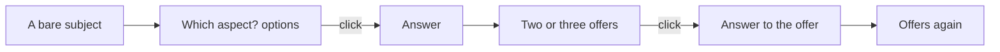
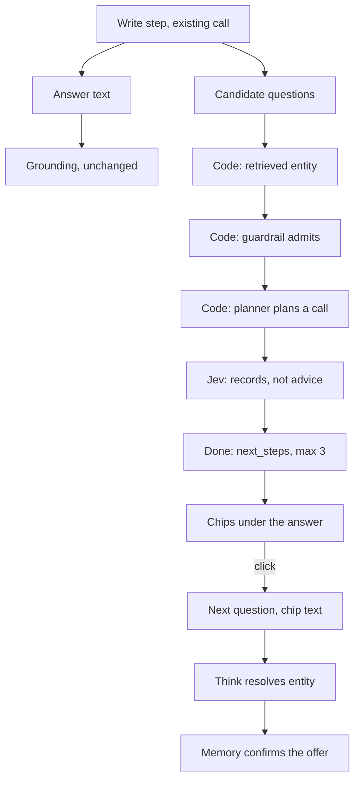

# Conversation next steps: how an answer keeps the discussion going

A design, not a build, written 2026-09-26 at the product owner's request after they set System 3's answer to "GERD" beside a general-purpose AI search answer. That answer did two things the owner wants:

- Before answering, it asked which aspect they wanted, with three clickable options and Skip.
- It ended every answer with a sentence inviting the next question.

The owner's words: "the last sentence is always encouraging you to continue that discussion ... It is beautiful orchestration of continuing the discussion and searching for the next thing or guiding the user in the conversation. Ideally my ai agent system needs to be able to do this."

One correction from the owner arrived while this was written and shapes every section: "GERD was an example of the follow up, do not hard code." Nothing here is written for any one subject. The three flows below are illustrations. The measure in the tickets runs on twelve questions this design was not shaped on.

Sources: the code at `origin/develop` (`e43c769`, 2026-09-26) and eight live questions asked of deployed develop the same evening. Where a brief or a document disagreed with the code, the code won. Each disagreement is named in [Where this design trusts the code over the brief](#where-this-design-trusts-the-code-over-the-brief).

## Table of contents

- [The short version](#the-short-version)
- [What was measured today](#what-was-measured-today)
- [What a person sees today, and what they should see](#what-a-person-sees-today-and-what-they-should-see)
- [The body comes first](#the-body-comes-first)
- [The mechanism options, compared](#the-mechanism-options-compared)
- [The recommendation: the writer proposes, code verifies, the classifier decides](#the-recommendation-the-writer-proposes-code-verifies-the-classifier-decides)
- [Why this is not a hardcoded decision](#why-this-is-not-a-hardcoded-decision)
- [The contract](#the-contract)
- [When to tackle it](#when-to-tackle-it)
- [Tickets for the phase](#tickets-for-the-phase)
- [How it is measured](#how-it-is-measured)
- [Decisions for the owner](#decisions-for-the-owner)
- [Where this design trusts the code over the brief](#where-this-design-trusts-the-code-over-the-brief)

## The short version

What the person gets:

- After an answer, two or three questions they can click. Each is about something this answer actually found. Each is one this product can answer. None asks for advice.
- Before a search, when they typed only a subject, they are asked which aspect they mean. That happens today for one to three words, and with card 48 for any opening question that names a subject without asking anything.

How, in one sentence each:

- The writing model writes the candidate questions inside the call it already makes, from the findings it was given, so no seconds are added for a second call.
- Code verifies each candidate the way the next turn will treat it: the same guardrail code, the same planner, and an exact match on the entity the answer retrieved. A candidate that fails any check is dropped, and an answer with nothing left offers nothing.
- The classifier, Jev, decides whether each surviving candidate asks for something the records could answer, as extra yes-or-no items in the sentence-check batch that already runs on every answer, so again no call is added.
- The offers ride on the done event as a bounded list, and a click sends the offer's question as the next question, exactly as a clarifying option does today. The server remembers what it offered in session memory, so the next turn can confirm the click named the entity it was offered about.

When: after phase 8.7 (the first sentence answers) and phase 8.9 (the writer is given the field the question asked for). A question that opens with "Found 5 pubmed records" and then says something about insulin resistance is not a conversation anyone wants to continue, and an offer under it is decoration. The offer is the third thing to build, not the first.

## What was measured today

Eight questions were asked of deployed develop (`https://search-agent-api-develop-43b3.up.railway.app`, `/health` returned `{"status":"ok","app_env":"develop"}`), with a throwaway account, through the same `/v1/query` and `/v1/query/{run_id}/events` path the web app uses. Numbers are pasted from the probe log.

| Question | Session | Depth | Seconds | Citations | Verdict | `next_step` | Asked back |
| --- | --- | --- | --- | --- | --- | --- | --- |
| GERD | new | account default | 3.0 | 0 | refuse (ask-back) | none | yes, 4 options |
| Which diseases are associated with BRCA1? | new | account default | 15.8 | 23 | ask | none | no |
| What is GERD? | same as GERD | account default | 40.2 | 13 | answer | none | no |
| What is rs334 and what condition is it associated with? | new | account default | 10.7 | 6 | ask | none | no |
| What is GERD? | new | plain_language | 19.3 | 14 | answer | none | no |
| What variants cause it? | same as BRCA1 | account default (stored as plain) | 23.2 | 58 | answer | none | no |
| What medications are used for GERD? | same as GERD | account default | 13.7 | 12 | answer | none | no |
| metformin | new | account default | 2.3 | 0 | refuse (ask-back) | none | yes, 4 options |

What this says:

- The next-step offer that "already exists" fired on 0 of 6 answered runs. `core/graph.py`'s `_build_next_step_offer` declines whenever the prepared findings mix record types, and every answered run mixes them, because a gene question also fetches the gene record, papers and trials, and a disease question fetches MedGen, papers and trials. The 2026-09-13 decision row predicted this: "the offer still declines when the omitted set mixes record types, which the Layer 2 gene-confirmation row causes often." The BRCA1 variant follow-up found 40 of 15,350 variants and still offered nothing.
- The ask-back for a one-to-three-word subject works, is fast (2.3 and 3.0 seconds), and its options are written for the subject: metformin got "What is metformin used for?", "Which genes are associated with metformin response?", "Are there clinical trials involving metformin?", "What does recent research say about metformin?". This is the shape the owner pointed at in the general-purpose answer, already live for the bare-subject case.
- The body is the problem the owner saw. "What is GERD?" opened with "Found 5 pubmed records, 1 medgen record, 1 literature entity record and 5 clinical trial records for GERD", and at Plain language the second sentence was about insulin resistance, because one of the five papers PubMed returned for "GERD" is titled "Insulin Resistance in Gastroesophageal Reflux Disease". "What medications are used for GERD?" answered with one sentence about a paediatric review and a list of records; it did not name a medication.
- Speed: the same question took 40.2 seconds at one depth and 19.3 at the other, minutes apart. Card 50's 20-second line is not held today, and nothing in this design may add a model call to the critical path.
- The clicked option and the follow-up both went through: "What is GERD?" after the ask-back resolved GERD and searched; "What variants cause it?" after BRCA1 bound to BRCA1 and returned BRCA1 variants. The click path and the memory path this design leans on are live.
- None of the three integrations carries the offer or the options today. `adapters/mcp/server.py` reads only `token`, `citation`, `trust_signal` and `done.trust_outcome`; `adapters/cli/render.py`'s `_handle_think` prints only the narrative; `adapters/graphql/fold.py` folds `done` to `trust_outcome`. A clarifying question reaches them as answer text with no options behind it.

## What a person sees today, and what they should see

Three flows, each at both depths. How to read the tables:

- Today: what the probe returned.
- Should: what this design produces.
- The offered questions in the "should" column are hand-written examples of the shape. In the product the model writes them from that answer's own findings, and they will differ.

### Flow one: a bare subject

The question asked: "GERD".



| Turn | Today | Should |
| --- | --- | --- |
| 1, "GERD" | Asked back in 3 seconds: "What would you like to know about GERD?" with four full questions as chips. | Unchanged. This is card 48's shape and it is live for one to three words. Card 48 widens the trigger to any opening question that names a subject without asking anything, decided by the classifier, not by a word count alone. |
| 2, click "What is GERD?" | Researcher: "Found 5 pubmed records, 1 medgen record, 1 literature entity record and 5 clinical trial records for GERD [2]...[13]. Gastroesophageal reflux disease (GERD) is a gastrointestinal motility disorder arising from reflux of stomach contents into the esophagus or oral cavity [1]." Then record lists. No offer. 40 seconds. Plain language: "I found 5 published papers, 1 condition, 1 literature index entry and 5 clinical trials related to GERD [3]...[14]. Children's symptoms are varied and nonspecific [1]. Insulin resistance, a problem with blood sugar regulation, has been linked to erosive esophagitis in GERD patients [2]." No offer. 19 seconds. | Researcher: opens with the MedGen definition (phase 8.7), the records after it, and under the answer, the label "Continue this conversation" with two or three chips written from these findings, for example "Which clinical trials are recruiting for GERD?" and "What do the five papers found report about GERD in children?". Plain language: the same records, in everyday words, and chips in everyday words: "Are there studies on GERD in children?" and "What treatments are being tested for GERD in trials?". Neither depth carries a persona word. |
| 3, click an offer | Not possible; nothing to click. Typing "What medications are used for GERD?" answers with a paediatric review and a record list. | The click sends the chip's text. The turn resolves GERD on its own, plans trials and literature, and the server confirms the resolved entity is the one it offered about. The answer names what the trials and papers say. New offers follow. |
| 3, an advice-shaped chip | Not applicable. | Never shown. A candidate such as "Which medication should someone with GERD take?" is dropped by the same `guardrail.forbidden.screen` the next turn would refuse it with. |

### Flow two: a gene question

The question asked: "Which diseases are associated with BRCA1?"

| Turn | Today | Should |
| --- | --- | --- |
| 1 | Researcher: "Found 4 disease records for BRCA1: Familial cancer of breast [1], ... [4]. BRCA1 is associated with four diseases ... Its protein participates in transcription, DNA repair of double-stranded breaks, and recombination [5]." Verdict ask, 23 citations, no offer, 16 seconds. This is the one golden question the 8.6 product review scored as answered well (G-013). | The same answer with the opener fixed by 8.7, and under it chips written from these findings: "Which BRCA1 variants are classified pathogenic in ClinVar?", "Which clinical trials involve BRCA1?", "What does the BRCA1 gene record say about its function?". At Plain language: "What changes in BRCA1 are known to cause disease?", "Are there clinical trials about BRCA1?". |
| 2, "What variants cause it?" | "it" binds to BRCA1, 40 of 15,350 ClinVar variants, 58 citations, no offer, 23 seconds. | Unchanged binding. The go-deeper offer that exists today (`next_step`, "Would you like me to go through the further sequence variant records found for this question?") stays as it is and stays rare; the new chips sit beside it. One chip may be about the records beyond the 40, written by the model from the truncation the findings disclose, and verified by the same `more_records_exist` signal the incompleteness note reads. |
| 2, click a chip | Not possible. | The chip names BRCA1, so Think resolves BRCA1 through the ordinary exact-identifier and live-confirmation path; the server confirms the offered CURIE, `NCBIGene:672`, is the one resolved. Memory does not have to hold a pronoun for this to work, which is the design already chosen for `next_step_query` on 2026-09-13. |

### Flow three: a variant question

The question asked: "What is rs334 and what condition is it associated with?"

| Turn | Today | Should |
| --- | --- | --- |
| 1 | "Found 5 literature variant records for rs334: c.20A>T [1], rs334348 [3], rs334353 [4], c.-50T>C [5] and rs334773 [6]." The dbSNP record is named by a list of clinical significance values. Four of the five literature records are different variants that share rs334's first digits. Verdict ask, no offer, 11 seconds. | After phase 8.9: the answer says rs334 is in HBB, cited to the dbSNP record, the four near-miss variants are gone, and the opener answers. Then chips written from these findings: "Which conditions does ClinVar link to rs334?", "Which papers discuss rs334 in HBB?", "Which other variants in HBB are classified pathogenic?". At Plain language: "What condition is this change in the HBB gene linked to?", "Are there studies about rs334?". |
| 2, click "Which other variants in HBB are classified pathogenic?" | Not possible. | The chip names HBB, which the answer retrieved as the variant's gene (phase 8.9's companion finding). HBB resolves live, the planner plans the gene's variant template, and the offered CURIE is confirmed. An offer may name only an entity this answer retrieved, so it can never name a gene the records did not mention. |
| Any turn, a chip such as "Is rs334 dangerous for me?" | Not applicable. | Never shown. The prefilter's first-person advice patterns refuse it, and the same code drops it before it is offered. |

What the person notices across all three flows, in their words:

- The answer ends with a way forward.
- Every way forward works when clicked.
- None of them is about something the answer never found.
- None asks the product for advice it will refuse to give.

## The body comes first

A closing offer on a weak body is lipstick. The owner's GERD screenshot shows three defects in the body, and each has an owner already:

| What the person sees | Cause | Owned by |
| --- | --- | --- |
| Every answer opens with "Found N ... records for X" | `answer_layout.answer_summary_sentence` is always emitted first | Card 2, phase 8.7, design at `testing/Developer/reports/2026-09-26_phase_8.7/design.md` |
| A sentence about insulin resistance under GERD | The PubMed search for the subject returns five papers, and the writer summarises whichever it is given; nothing tells it which papers answer the question | Phase 8.9 gives the writer the asked-for field; phase 8.7's classifier-gated lead keeps an off-question sentence from leading. Neither drops the paper. A retrieval-side relevance rule is not designed anywhere yet and this document does not design one either |
| 42 of 102 answered golden runs withdrew the written summary to a bare record list, up from 30 at the floor; answered well 1 of 10 | F-8.6-P01 and P10, undiagnosed, folded into card 50's speed diagnosis | Phase 8.6's follow-up and the answer speed diagnosis |

The offer depends on the body in two concrete ways, not only in taste. First, the candidates are written from the same findings the answer is written from, so a body written from the wrong records offers the wrong questions. Second, the offer is verified against the entities the answer retrieved, so an answer that retrieved rs334348 as if it were rs334 could offer a question about rs334348, and the verification would pass it, because the answer did retrieve it. Phase 8.9's exact-match filter has to land first for the variant flow to be honest.

## The mechanism options, compared

Five candidates, each judged on four things:

- What can go wrong for the person.
- The seconds it adds to an answer.
- How it reaches MCP, the API, GraphQL and the CLI.
- How it is tested.

| Option | Broken promise | Medical advice | Wrong entity | Seconds added | Reaches the integrations | Tested by | Verdict |
| --- | --- | --- | --- | --- | --- | --- | --- |
| A. Code-built from what retrieval returned, today's line widened | Impossible by construction | Impossible | Impossible | 0 | Yes, `DonePayload.next_step` | Unit tests exist | Keep as is. Cannot become a conversation: it can only ever say "more of the same records", and it fired on 0 of 6 live answers. Widening it means enumerating question shapes per record type, which is a hardcoded menu |
| B. A classifier picks from a menu of question shapes the tools can answer | Low, each shape is answerable | Low | Low | About 0.3 s (Jev median 266 to 314 ms) | Yes | Unit plus live | Reject. The menu is a fixed list of what the product may offer, written by an engineer per entity type. That is exactly the decision the owner says code may not make, whatever model picks from it |
| C. The writing model writes the candidates inside its existing call; code verifies each; Jev decides in the existing sentence-check batch | Guarded: the same guardrail and planner code the click will hit run on the candidate first | Guarded by the same code | Guarded by an exact match on a retrieved entity | About 0.5 to 1 s of extra output tokens; no extra call | Yes, a new bounded list on the done event | Unit, a held-out live flow set, the golden run | Recommend |
| D. Clarifying options before the search, card 48 | None: the options are questions, and the click is an ordinary first question | Guarded today by the writer's instruction only; the same code checks as C should run on the options | Not applicable, nothing is resolved yet | 0, the decision and the writer run beside Think | Not today: no integration carries `clarifying_options` | Unit exists; live checks in `UI_fixes_done.md` item 12.3 | Recommend, in the same phase, as the half of the conversation that comes before the search |
| E. A separate guard-tier call after the answer writes the offers | As C | As C | As C | 1 to 3 s (the clarify writer's call took 2.1 and 2.8 s end to end today) | Yes | As C | Reject while card 50 stands. Keep as the fallback design if C's writer proves unable to write candidates and an answer at once |

Option A's honest limit deserves one more paragraph, because it is the reasoning the 2026-09-01 decision rests on: "an offer to go deeper is a claim that there IS something deeper." That reasoning is right and this design keeps it. What moves is where the claim is checked.

- In A the claim is checked by construction, because code only ever offers what it counted.
- In C the claim is checked by verification: the offer is a question, and the same code that will answer the question is run on it first.
- A candidate never reaches the person when the guardrail would refuse it, when the planner would plan nothing for it, or when it names an entity the answer never retrieved.
- What is new is the ground where a model writes the words. What guards it is the code that already decides every next turn.

## The recommendation: the writer proposes, code verifies, the classifier decides



### Step 1: the writer proposes

The synth prompt's dynamic suffix gains one instruction. After the answer, on its own line after a fixed separator token, the writer puts at most three questions a reader might ask next, where each question:

- is about a record in the findings;
- names the record's subject (a gene symbol, a variant id, a condition name) as it appears in the findings;
- is answerable by a search of genes, variants, conditions, trials, the literature or isolate records;
- never asks what a person should do, take, or be diagnosed with.

The instruction names the kinds of search the product runs, which `core/clarify.py`'s `CLARIFY_SYSTEM_INSTRUCTION` already does for the ask-back writer. It names no subject, no topic and no example question from any test set.

Why inside the existing call:

- Card 50. Every answered golden run already spends a median 8.4 seconds in Write (`testing/Developer/reports/2026-09-26_answer_speed/golden_timing.md`, 8.6 re-land). Three short questions are about sixty output tokens, under a second at the writer's measured pace. A second call is one to three seconds.
- The writer has the findings in front of it. A separate call would have to be handed them again.
- The depth directive is already in the call, so Plain language gets plain offers and Researcher gets researcher offers with no second instruction.

Where the instruction goes: the dynamic suffix (the user message `build_synth_messages` assembles), not `SYNTH_SYSTEM_INSTRUCTION`. The stable prefix stays byte-identical, as `prompt-cache-discipline` and phase 8.9's constraints require.

How the block is split off:

- By a fixed separator line, parsed deterministically before grounding runs. The answer's grounding, the sentence check and the findings tail see exactly the text they see today.
- A reply with no block, a malformed block, or a block in the wrong place yields no candidates and an unchanged answer.
- The completeness repair's second call is never read for candidates.

### Step 2: code verifies, three checks in order

Each check is one the next turn will apply anyway. That is the whole argument. The same functions on the same text produce the same result one turn later, so a candidate that passes them:

- cannot be refused at the guardrail;
- cannot plan nothing;
- cannot be about a subject the answer did not retrieve.

1. Entity: the candidate contains, after whitespace normalisation and case folding, the exact mention or preferred name of an entity this turn resolved (`state["resolved_entities"]`, the Think event's `text`) or the exact `entity_name` of a citation this answer emitted. Substring match after normalisation, never a similarity score, per `production-standards`' deterministic-acceptance rule. The matched entity's CURIE is recorded with the offer.
2. Guardrail: `guardrail.prefilter` and `guardrail.forbidden.screen` run on the candidate text exactly as `guardrail_node` runs them on a question. Any refusal drops the candidate. The classifier and Jev relevancy decisions are not run here, because they cost a call; a candidate that names a retrieved biomedical entity is on topic by the guard's own definition, which is the rule `_is_memory_bound_follow_up` already relies on.
3. Planner: a dry plan. `_select_planned_tool_call` and `_build_layer_tool_calls` are run on the candidate with the matched entity's CURIE supplied as the resolved entity, with no network call, and the candidate is kept only when at least one tool call comes out. This reuses the planner rather than restating what it can do, so a future tool or template widens what may be offered with no change here.

A candidate that fails any check is dropped silently. An answer with no surviving candidate offers nothing. Declining is the correct and expected outcome on a refusal, an empty retrieval or a single-fact lookup, as the 2026-09-01 decision says: "a system that always asks something will pad."

### Step 3: the classifier decides

For each surviving candidate, one yes-or-no item is appended to the Jev batch that `synthesis/sentence_check.check_reworded_sentences` already sends for the answer's reworded sentences. The question is fixed: does this question ask what biomedical records hold about its subject, rather than for advice, a verdict or an opinion.

- The batch takes at most 30 items (`jev_client.MAX_BATCH_QUESTIONS`). Sentences take their slots first and candidates take what is left, so a long answer may offer fewer.
- A candidate is shown only when Jev picks yes with a strictly higher probability than no, the same rule the sentence check uses.
- A failed, late or cost-capped Jev call shows nothing. It fails closed, as the sentence check does, and the guard tier is not asked as a second chance.

This is the one decision in the mechanism, and it is a model's. Code before it verifies; code after it carries the result.

Two consequences to state plainly:

- With `CLASSIFIER_PROVIDER=guard`, which is production's setting today, no offers are shown, because no Jev batch runs. Offers reach production when Jev does. The owner is asked about this below.
- When an answer has no reworded sentences and therefore no batch today, a batch is created for the candidates alone. That is the one case where this design adds a call, about 300 ms at Jev's measured median, after the answer text has already streamed, so the person has started reading before it is spent.

### Step 4: the person clicks

The chip's text becomes the next `Query.text`, the path `FollowUp.tsx` already uses for `clarifyingOptions` and for `nextStepQuery`. The turn runs as a first-class question: guardrail, Think, Plan, Act, Write. Nothing is skipped and nothing is reused from the earlier answer, which is the personalization firewall of Section 14.1 (memory guides retrieval, never assertion), unchanged.

Session memory gains the offers the server made, so the next turn can confirm the click.

- When the new question's text is exactly one offered text and Think's resolved CURIE equals the CURIE recorded with that offer, the turn is marked as an accepted offer. `plan_node` then puts the records the earlier answer already showed to the back, exactly as it does for the go-deeper turn today (`reported_record_ids`).
- When the CURIEs differ, the turn is an ordinary question, and nothing from the offer record is used.
- The memory record is a confirmation, never a source.

Why memory and not an in-process dictionary: card 36 records that a picked "How far back" window is lost after a restart or a deploy, because `core/clarify.py`'s `_OFFERED` lives in the process. The offers are stored in `SessionMemorySummary`, which is persisted and owner-scoped, so a deploy between the answer and the click loses nothing.

### The two depths

The offers are written in the same call as the answer, under the same depth directive, so they come out at the depth of the answer.

- Nothing in the instruction says who the reader is.
- The label above the chips is the prototype's "Continue this conversation", and the chips are the questions.
- No chip ever says what kind of person would ask it. There is no "for beginners" and no "for clinicians".

## Why this is not a hardcoded decision

The owner's rule, in `DECISIONS.md` (2026-09-24) and repeated on 2026-09-26: decisions go to a classifier model and code only verifies; a fixed word list or a per-topic menu is not allowed; test questions never enter a prompt.

Checked against each part of the design:

| Part | What is fixed in code | Why that is verification, not a decision |
| --- | --- | --- |
| The writer's instruction | The kinds of search the product runs (genes, variants, conditions, trials, literature, isolates), the bound of three, the separator | These are facts about the product, the same facts `CLARIFY_SYSTEM_INSTRUCTION` states today. No subject, no topic, no example question from any test set. What to ask is the model's |
| Entity check | Exact match on an entity this answer retrieved | It checks a claim the candidate makes against a fact the turn holds. It decides nothing about which entity is interesting |
| Guardrail check | The same `prefilter` and `forbidden.screen` the next turn runs | It runs code the product already runs on every question, on the candidate. It adds no rule |
| Planner check | The same planner the next turn runs | Same |
| Jev's question | One fixed yes-or-no criterion | The decision point is the model's; the criterion is code-authored and fixed, as every `decide()` point's is |
| The chips | At most three, rendered in the prototype's pill style | Bounds and design, not choices |

What was rejected because it would be a hardcoded decision:

- Option B's menu of question shapes.
- Any rule that maps an entity type to the questions it may be asked.
- Any list of "safe" or "unsafe" words for offers beyond the guardrail code that already exists.
- Any per-topic tuning after the held-out set is run. If the held-out set shows a bad offer, the fix is to the criterion or the verification, never a rule about that topic.

## The contract

### The done event

`DonePayload` gains one additive, optional field, within v1 by `system-design-patterns` pattern 10 (a new optional field, nothing removed, nothing renamed):

```python
class NextStep(BaseModel):
    model_config = ConfigDict(extra="forbid")

    question: Annotated[str, Field(max_length=220)]
    """The question a click sends, verbatim. 220 matches
    ThinkPayload.clarifying_options' per-item bound, so a clarifying
    option and an offer are the same shape on the wire."""

    about: Annotated[str, Field(max_length=200)]
    """The retrieved entity the question names, as the answer named it.
    200 matches ResolvedEntity.text."""

    about_curie: Annotated[str, Field(max_length=128)]
    """Its CURIE, the value the next turn confirms against. 128 matches
    ResolvedEntity.curie."""

    rests_on: list[Annotated[str, Field(max_length=64)]] = Field(
        default_factory=list, max_length=5
    )
    """Citation ids of the findings the writer built the question from,
    so a surface can show where an offer came from and the measure can
    check it. 64 matches CitationPayload.citation_id."""


class DonePayload(BaseModel):
    ...
    next_steps: list[NextStep] | None = Field(default=None, max_length=3)
```

`next_step` and `next_step_query` stay exactly as they are. Removing or renaming them is a v2 change, and the web client falls back through them for an older backend already.

The frontend mirror in `frontend/src/lib/events.ts` gains `next_steps?: NextStep[] | null` with the same guard shape `clarifying_options` uses (absent and null treated alike), and `useRunView.ts` exposes it beside `nextStep`.

### What a click sends

`POST /v1/query` with `text` equal to `next_steps[i].question` and the same `session_id`. Nothing else. No offer id, no flag, no CURIE travels from the client, because a client-supplied CURIE would be a claim the server has to verify anyway, and the text is what the person sees and what a person typing by hand would send. The MCP, GraphQL and CLI surfaces send the same thing through their own call.

### How session memory binds it

`SessionMemorySummary` gains one additive field:

```python
MAX_OFFERED_FOLLOW_UPS = 3
MAX_OFFERED_FOLLOW_UP_LENGTH = 220

class OfferedFollowUp(BaseModel):
    question: str  # max 220
    about_curie: str  # max 128

offered_follow_ups: list[OfferedFollowUp] = Field(default_factory=list, max_length=MAX_OFFERED_FOLLOW_UPS)
```

`merge_turn` replaces the list on every turn (only the latest answer's offers are live), and `compact` drops it first when the token budget is tight, before open threads, because it is the cheapest thing to lose: a lost record turns an accepted offer into an ordinary question that still answers. The field is never rendered into `build_session_context`, so it never reaches a prompt; `injected_steps` is unchanged.

The next turn reads it in `think_node` after entity resolution: text equal to an offered question and resolved CURIE equal to its `about_curie` sets `accepted_offer=True` in `GraphState`, which `plan_node` reads the way it reads `is_go_deeper_query` today, to order already-shown records last. The event stream says so in the Think narrative, so a person reading the pipeline sees "this question was one the earlier answer offered".

### Bounds, in one table

| Field | Bound | Matches |
| --- | --- | --- |
| `next_steps` | 3 items | The owner's "2 to 4" for options, kept at the low end so the chips fit one row at 390 pixels |
| `NextStep.question` | 220 characters | `ThinkPayload.clarifying_options` per item |
| `NextStep.about` | 200 | `ResolvedEntity.text` |
| `NextStep.about_curie` | 128 | `ResolvedEntity.curie` |
| `NextStep.rests_on` | 5 items of 64 | `MAX_CITATION_IDS_PER_FINDING`, `CitationPayload.citation_id` |
| Writer block | 3 lines of 220 characters, anything else discarded | The same bounds before parsing, so nothing oversized reaches Pydantic |
| Jev items | Candidates take the slots the sentences leave, under 30 | `MAX_BATCH_QUESTIONS` |
| `offered_follow_ups` | 3 items | Same as `next_steps` |

The event schema changes, so the dial sits at position three: a branch and a pull request, which a numbered phase has anyway.

### The integrations, card 49

Today none of MCP, GraphQL and the CLI carries `next_step`, `next_step_query` or `clarifying_options`. For the offer to do "what the web does":

- MCP: `next_steps` and `clarifying_options` become two optional keys on the tool result. The response key set is pinned by the phase 4.1 premise gate's `_ALLOWED_RESPONSE_KEYS`, a manual control the owner approved an addition to on 2026-08-20. Adding two keys needs the same approval; it is one of the five decisions below.
- GraphQL: two optional fields on the answer type, folded from the `done` and `think` events in `fold.py`.
- CLI: a "Next:" block after the references, one question per line, and the clarifying options under a clarifying question, so a person at a terminal can copy one back. Exit codes are unchanged.

The API surface needs nothing: the event stream carries the field.

## When to tackle it

In the user's terms, ordered by what they feel first:

| Order | Work | Why it comes here | Status |
| --- | --- | --- | --- |
| 1 | Phase 8.6's follow-up, R-05 to R-09 | A question should not fail because the guard model hiccupped, and a graph search should give up at 30 seconds, not 90. Reliability and speed before anything is added | In build on `phase/8.6-followup` |
| 2 | Phase 8.7, the first sentence answers | The first thing a person reads must answer the question. An offer under "Found 5 pubmed records" invites them to continue a conversation that has not started | Design done, next after 8.6 |
| 3 | Phase 8.9, the writer is given the asked-for field; rs334 matched exactly | The records must be about what was asked before the product offers questions about them. The variant flow above is dishonest until the near-miss variants are gone | Planned, ledger written |
| 4 | Card 50, every answer within 20 seconds | The design adds no call on the critical path, but it adds output tokens to the writer, and it must be measured against a baseline that already meets the line, or the added second will be blamed on it | Diagnosis in progress |
| 5 | This phase: offers after the answer, card 48's wider ask-back before the search, the chips, the memory record, and the integrations' projection of both | The conversation, built on a body that answers and a search that finishes in time | Not opened |
| 6 | Card 49, the remaining integration parity | The offer's projection to MCP, GraphQL and the CLI is inside this phase; the rest of card 49 follows | Not opened |

What must land first and why, stated once: 8.7 and 8.9, because an offer is written from the findings and verified against the entities the answer retrieved, and both are wrong today on exactly the flows the owner looked at. Card 50 is a measurement dependency rather than a code dependency: this phase must show its added time against a floor run, and the floor should be the post-8.7 run.

Card 48 does not need to wait for this phase.

- Its writer exists and its decision point exists. Widening the trigger is a change to `think_node`'s gate and to the `think.ask_back` criterion.
- It is included here because the chips, the click path and the memory record are shared, and because the owner's example shows the two halves together.
- If the owner wants card 48 sooner, its ticket below (T-8.10-06) lifts out cleanly as a dial-position-two card.

## Tickets for the phase

Number: the next free numbered phase after 8.9, written here as 8.10; the lead sets it. Branch `phase/8.10-conversation-next-steps`, cut from develop after phase 8.9 has merged and its golden run has held its floor. Dial position three: the event schema changes. Three builders, one judge round, one adversary round, one fix-and-verify, the product reviewer: seven dispatches, one spare.

Every ticket keeps these constraints, copied from phase 8.9's shape because they are the same gate:

- `synthesis/grounding.py` and the exact checks in `synthesis/sentence_check.py` are unchanged; the batch gains items, the rule for approving a sentence does not change.
- `SYNTH_SYSTEM_INSTRUCTION` and the prefix in `harness/cache.py` are byte-identical.
- No golden question, no question from `testing/User-feedback/`, and no topic appears in a prompt or in product code.
- Nothing decides from the question's words: no keyword rule anywhere in this phase.

### Builder one, P: the writer proposes and code verifies, in the write step

Fence: new `synthesis/next_steps.py`; `synthesis/findings.py`, the dynamic-suffix instruction in `build_synth_messages` only; `synthesis/sentence_check.py`, the batch assembly only; `core/graph.py`, the write node's block between grounding and the done event only; `contracts/events.py`, the `NextStep` model and `DonePayload.next_steps` only; the new tests.

T-8.10-01, the writer's block is split off before grounding.

- What the person notices: nothing yet. The answer text is byte-identical to what it would have been without the block.
- Acceptance: a reply carrying the separator and up to three lines is split into the answer and the candidates before `run_grounding_pass`; a reply with no separator, two separators, a block above the answer, or more than three lines yields no candidates and the whole reply is treated as answer text exactly as today; the completeness repair's reply is never read for candidates; a replay of ten saved golden replies (`testing/Developer/reports/2026-09-26_phase_8.6-reland_golden/raw/`) through the parser yields zero candidates and identical answer text.
- Test: `venv/bin/python -m pytest tests/system_03_search_agent/synthesis/test_next_steps_parse.py -q`

T-8.10-02, the three code checks.

- What the person notices: an offer never asks for advice, never names something the answer did not find, and never leads to "I could not find information on this".
- Acceptance: `next_steps.verify_candidates(candidates, resolved_entities, citations)` keeps only candidates that (a) contain an exact resolved mention or citation `entity_name` after normalisation, recording its CURIE; (b) pass `prefilter` and `forbidden.screen` with no refusal; (c) produce at least one planned tool call from a dry run of the planner with that CURIE and no network. Tests hand in a candidate that fails each check alone and show it dropped, a candidate that passes all three and show it kept with the right CURIE, and the whole set empty on a refusal. A test breaks each check and shows the corresponding arm go red.
- Test: `venv/bin/python -m pytest tests/system_03_search_agent/synthesis/test_next_steps_verify.py -q`

T-8.10-03, Jev decides, in the batch that already runs.

- What the person notices: a question that survived the code checks but still reads as asking for a judgement does not appear.
- Acceptance: surviving candidates are appended to the sentence-check batch as yes-or-no items with one fixed criterion; a candidate is shown only when Jev's yes probability is strictly higher than its no; a failed, late, malformed or cost-capped call shows no offers and leaves the sentence verdicts exactly as they are today; with no reworded sentences, a batch of candidates alone is sent, charged through `Harness.track_cost`, and abandoned at the step's remaining budget; in guard mode no batch is sent and no offers are shown. Tests replay recorded Jev bodies for each arm.
- Test: `venv/bin/python -m pytest tests/system_03_search_agent/synthesis/test_next_steps_jev.py tests/system_03_search_agent/synthesis/test_sentence_check.py -q`

T-8.10-04, the done event carries at most three.

- What the person notices: the chips.
- Acceptance: `DonePayload.next_steps` holds the approved candidates in the writer's order, at most three, each with `question`, `about`, `about_curie` and `rests_on` within their bounds; `next_step` and `next_step_query` are set exactly as before; every existing test of `DonePayload` passes unchanged; the schema diff of `contracts/events.py` is the new model and the new optional field and nothing else.
- Test: `venv/bin/python -m pytest tests/system_03_search_agent/contracts tests/system_03_search_agent/core/test_next_step_offer.py -q`

### Builder two, Q: the next turn, memory, and card 48

Fence: `contracts/query.py`, the `OfferedFollowUp` model and `SessionMemorySummary.offered_follow_ups` only; `core/session_memory.py`, `merge_turn` and `compact` only; `core/run.py`, the remember-turn call only; `core/graph.py`, the think node's ask-back gate and its accepted-offer read, and `plan_node`'s one ordering read; `core/state.py`, one field; `harness/decide.py`, the `think.ask_back` criterion text only; the new tests.

T-8.10-05, the server remembers what it offered, and confirms a click.

- What the person notices: clicking a chip after a deploy still works, and the answer to a clicked chip puts records they have not seen first.
- Acceptance: after each turn the offers on its done event are stored as `offered_follow_ups`, replacing the previous turn's; a next question whose text is exactly one offered question and whose Think-resolved CURIE equals its `about_curie` sets `accepted_offer` and orders already-reported records last, the way the go-deeper turn does; a text match with a different CURIE, or a match with no memory, runs as an ordinary question with nothing read from the record; the field is never rendered into the memory block (`build_session_context` output is byte-identical for a summary with and without it); `compact` drops it before open threads.
- Test: `venv/bin/python -m pytest tests/system_03_search_agent/core/test_session_memory.py tests/system_03_search_agent/core/test_plan_memory_binding.py tests/system_03_search_agent/core/test_accepted_offer.py -q`

T-8.10-06, card 48: any opening question that names a subject without asking anything is asked which aspect.

- What the person notices: "cystic fibrosis genetics" or "the BRCA1 gene and breast cancer risk" is asked which aspect they mean, with choices written for that subject, the way "GERD" is today; a real question is never asked back.
- Acceptance: the word-count trigger stays as the cheap first gate for one to three words; above it, on an opening turn only, `decide(point="think.ask_back")` is asked with a criterion that names a subject with no request; the writer runs beside it exactly as today; fail-open is unchanged (any failure searches); the ask-back is never shown on a follow-up. Measured live by the builder on ten held-out opening texts, five subjects and five real questions, pasted into the report: every real question searched.
- Test: `venv/bin/python -m pytest tests/system_03_search_agent/core/test_clarify.py tests/system_03_search_agent/harness/test_decide.py -q`

### Builder three, R: the chips and the integrations

Fence: `frontend/src/lib/events.ts`; `frontend/src/hooks/useRunView.ts`; `frontend/src/components/answer/FollowUp.tsx` and its tests; `frontend/src/App.tsx`, the `FollowUp` props only; `adapters/mcp/server.py`, the result assembly only, plus the premise gate's key allowlist once the owner approves; `adapters/graphql/fold.py` and `types.py`; `adapters/cli/render.py`, `_handle_think` and `_handle_done` only.

T-8.10-07, the chips.

- What the person notices: under an answer, beside "Continue this conversation", up to three chips with the offered questions; clicking one asks it; on a refusal nothing appears; when the backend sends none, the three fixed hints show as today.
- Acceptance: `next_steps` renders as pills using the prototype's `.fu-hints` treatment (`surfaceSunk`, `line`, radius 999, 12.5 px, `inkMuted`), the same treatment `clarifyingOptions` already uses, so both halves of the conversation look alike; the fixed `FOLLOW_UP_HINTS` are hidden when at least one offer is present; the legacy "Yes, go deeper" button still renders when `next_step` is set; at 390 pixels no horizontal overflow; an axe scan shows no new violation. A `/verify` capture at 1280 and 390 is pasted.
- Design gap, named: the follow-up field is listed as not designed in `docs/build/design/README.md`'s coverage table. The nearest designed neighbour is the prototype's `.fu-hints` pill (`prototype/app.html`, lines 282 to 284), and the shipped `clarifyingOptions` chips already copy it. The builder adds this surface to the coverage table.
- Test: in `frontend/`, `npm test -- FollowUp` and `npm run build`.

T-8.10-08, the integrations carry both halves.

- What the person notices: an MCP client, a GraphQL client and a CLI user see the same offers and the same clarifying options the web shows, and can send one back.
- Acceptance: MCP result gains optional `next_steps` and `clarifying_options`, with the allowlist test updated only after the owner's yes; GraphQL gains the two optional fields; the CLI prints "Next:" with one question per line after the references and prints clarifying options under a clarifying question; each surface's existing tests pass unchanged; a recorded stream with no offers renders exactly as today on all three.
- Test: `venv/bin/python -m pytest tests/system_03_search_agent/adapters -q`

### The lead

- The held-out flow set and its script, `follow_up_flows.py`, in this phase's report folder, run before and after the merge (see the next section).
- The golden consistency run after the merge, with the two new columns.
- Decision rows for whatever the owner answers below.
- The `Search_and_conversation_behaviour.md` update: a sixth situation, "accepting an offer", with its code pointers and develop check.

## How it is measured

### The golden consistency run

Unchanged instrument, unchanged floor rule: 50 questions, three passes, answered may not drop below the accepted floor (102 of 150 today). Two columns are added to the summary, computed from the saved `done` payloads:

- Offer rate: the share of answered runs whose `next_steps` is non-empty. There is no target; it is reported so the owner can see whether the product offers on most answers or few.
- Added time: the Write stage median and p90 beside the floor run's, from `analyze_golden_timing.py`. The phase is not accepted if the Write median rises by more than one second against the run it was cut from.

The golden set alone cannot measure a broken promise, because it never clicks. That needs a second instrument.

### The follow-up flow set

Twelve held-out opening questions, none of them GERD, BRCA1 or rs334, none in the golden set, spanning the kinds the lead asked for. Written here so the design cannot be tuned to them after the fact; the lead may swap any for another of the same kind before the run, but not after.

| Kind | Question |
| --- | --- |
| Gene | Which diseases are associated with MLH1? |
| Gene | What is the function of LDLR? |
| Variant | What is rs1801133 and what condition is it associated with? |
| Variant | Which conditions are linked to rs7412? |
| Disease | Which genes are linked to type 2 diabetes? |
| Disease, bare subject | cystic fibrosis |
| Drug, bare subject | statins |
| Drug | What does recent research say about semaglutide? |
| Organism | Which Salmonella enterica isolates carry blaCTX-M genes? |
| Trials | Are there clinical trials for sickle cell disease? |
| Literature | papers on the gut microbiome and depression |
| Literature, no identifier | Does exercise change sleep quality in older adults? |

The script is modelled on `run_consistency.py`: the same sign-in, the same SSE reassembly, the same two-worker limit. What it does:

- Runs each question in a fresh session.
- Clicks every offer it receives, in the same session.
- For a bare subject, clicks every clarifying option first, then every offer under each.
- Two passes.

Each click is one record with:

- whether the click answered (at least one citation and a non-refuse verdict);
- whether it was refused at the guardrail (`guard.passed` false), which must never happen for an offer;
- whether the answer's resolved entities include the offer's `about_curie`;
- seconds, and time to the first word.

The numbers reported, with their acceptance:

| Measure | Definition | Acceptance |
| --- | --- | --- |
| Offers made | Share of answered first turns with at least one chip | Reported, no target |
| Promise kept | Share of clicked offers that answered | At least 90 percent, and every miss named with its trace id |
| Refused offers | Clicked offers refused at the guardrail | 0 |
| Entity kept | Share of clicked offers whose answer resolved `about_curie` | 100 percent |
| Advice offered | Offers the product reviewer reads as asking for a diagnosis, a treatment choice or a classification | 0 |
| Ask-back precision | Of the twelve, the real questions asked back | 0; the two bare subjects asked back in both passes |
| Added time | Median seconds of a first turn against the same twelve run before the merge | Within one second |

Cost: twelve questions, at most three clicks each, plus options, two passes, roughly 120 runs at about two cents each, under $3. The credits endpoint is read first.

### The product reviewer

Rubric line 1 and line 2 are read on the same fixed ten as today. One line is added to this phase's report only, asked of each of the ten:

- Do the offers read as things a researcher would want to ask next about these records?
- Does any read as advice?

The verdict is pass, needs the owner's eye, or fail, each quoting the chip.

## Decisions for the owner

At most five, each with a recommendation.

1. Where the offers are written. Pick one: (a) inside the writing model's existing call, split off by a fixed separator, adding output tokens and no call; (b) a separate guard-tier call after the answer, adding one to three seconds. Recommendation: (a), because of card 50, and because the writer already holds the findings and the depth.

2. Jev is the only judge of an offer, and there are no offers without it. Yes or no. Yes means: in guard mode, which production runs today, no chips appear until `CLASSIFIER_PROVIDER=jev` reaches production; a Jev failure shows nothing rather than asking the guard tier. Recommendation: yes, the same fail-closed rule the sentence check keeps, and the same reason: the weaker judge approved 15 of 45 unfaithful sentences where Jev approved 7 of 113.

3. The MCP response key allowlist gains `next_steps` and `clarifying_options`. Yes or no. This is the manual control approved by the owner on 2026-08-20 for `persona_name`, and card 49 needs the same for these two. Recommendation: yes, both optional, so every existing client is unchanged.

4. Card 48's trigger widens from one to three words to a classifier decision on any opening question. Yes or no. The word count stays as the cheap first gate; above it the `think.ask_back` decision is asked with the criterion "names a subject and asks nothing"; fail-open is unchanged. Recommendation: yes, built as T-8.10-06 in this phase, or lifted out as its own card if wanted sooner.

5. Order. Yes or no: this phase opens after phase 8.9 has merged and held its floor, and not before. Recommendation: yes. The offers are written from the findings and verified against the retrieved entities, and 8.7 and 8.9 are what make both honest on the owner's own three examples.

## Where this design trusts the code over the brief

- "A next-step offer already exists." It exists in code and on the contract, and it fired on 0 of 6 answered live runs today, because every answer mixes record types. The design keeps it unchanged and does not build on it.
- "Card 48 ... not built yet." The one-to-three-word ask-back is built and live (item 12.3, `UI_fixes_done.md`; measured today on "GERD" and "metformin"). What is not built is the wider trigger. The design treats card 48 as that widening.
- "Cards 47 to 51." The board file read at the time of writing ends at card 46. The lead's descriptions of cards 48 to 51 are taken as given and their numbers used as the lead gave them.
- "The general-purpose answer's option chips are card 48's shape." Confirmed in the code: `ThinkPayload.clarifying_options`, 2 to 4 items of 220 characters, rendered as pills in `FollowUp.tsx`. The design reuses that shape and that bound for the offers.
- "Every integration does what the web does." Today no integration carries `next_step`, `next_step_query` or `clarifying_options`; the ask-back reaches MCP as answer text with nothing to click. Stated as measured from the adapters' source, and ticketed.
- `docs/build/Search_and_conversation_behaviour.md` says "The go-deeper offer is a real follow-up question built in code", which is true of the code path and, today, of no live answer.
- The account's stored depth: `audience_depth` omitted resolves to the account's stored preference, and asking one question at `plain_language` changed that preference, so the later "What variants cause it?" ran at Plain language without asking for it. The probe table marks it. Nothing in this design depends on it, but a builder running live checks should send the depth explicitly.

Live runs: eight of the ten allowed were used; the probe script and its log are in the session scratch folder and are not committed. No credential, token or environment value was printed or written into this folder.
