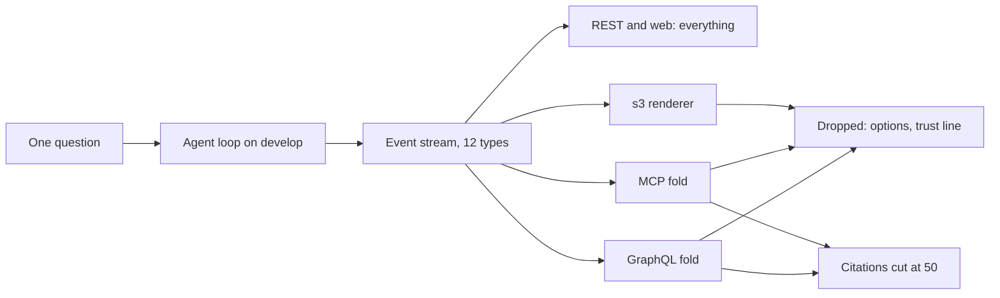

# Integrations audit, 2026-09-26

Every surface on the Integrations page was run against deployed develop (API `https://search-agent-api-develop-43b3.up.railway.app`, code at develop commit `0b75aa7`), first as printed, then the way a real user would use it. The same four questions went through the web's own path (REST plus the event stream), GraphQL, MCP and the `s3` command. The console commands were built into a wheel and installed the way an outsider would get them. This is a diagnosis: no tracked file was changed. 30 live questions were sent (`evidence/question_count.log`).

The auditing agent returned this report as text, because its harness has sub-agents return findings rather than write report files. The lead saved it here unchanged, beside the agent's evidence and smoke script.

## Table of contents

- [The short answer](#the-short-answer)
- [Surface by surface](#surface-by-surface)
- [Parity with the web app](#parity-with-the-web-app)
- [Keeping up with the architecture](#keeping-up-with-the-architecture)
- [Gaps, ranked by what a person hits first](#gaps-ranked-by-what-a-person-hits-first)
- [The page's words](#the-pages-words)
- [The MCP packaging question](#the-mcp-packaging-question)
- [The existing tests](#the-existing-tests)
- [The smoke script](#the-smoke-script)
- [What cost time](#what-cost-time)
- [Evidence index](#evidence-index)

## The short answer

The core works on every surface. A person who already holds a fresh token gets the same cited BRCA1 answer from REST, GraphQL, MCP and `s3`, with 22 or 23 citations each and working NCBI links. What does not work is everything around the core, the part a newcomer meets first.

| Surface | Works as printed | Outsider can get it | Parity with the web | Keeps up with the event contract | Page words |
|---------|------------------|---------------------|---------------------|----------------------------------|------------|
| REST plus event stream | Yes | Yes, curl and a token | It is the web's path | Yes, all 12 event types | Mostly right, some stale |
| GraphQL | Yes | Yes, curl and an account | Partial | Answers yes, drops new fields | Right |
| MCP server | No: connects, then every call is refused | Only with a token the page never mentions, valid 15 minutes | Partial | Answers yes, drops new fields | Missing the token, and "type" for Claude Code |
| `s3` | No: `s3 login` fails as printed | No: no package, clone the backend | Partial | Yes as built today; an older install breaks | `--json` does not exist; no install step |
| `s3-kgx-export` | No: crashes on import when installed | No: needs operator graph credentials | Web has no KGX export | Not event based | Does not say it needs graph access |
| `/docs`, `/openapi.json` | Yes, both 200 | Yes | Not applicable | Not applicable | Right |



## Surface by surface

### REST plus the event stream

| Question | Finding | Evidence |
|----------|---------|----------|
| Works as printed | The page's curl, with `$TOKEN` set to a guest token, returned 202 and a `run_id`. Its stream ran to `done` with 23 citations. First sentence: "Found 4 disease records for BRCA1: Familial cancer of breast [2], ...". | `evidence/runs/rest_00_page_snippet_raw.json`, `rest_01_brca1_page_snippet.json` |
| Outsider install path | None needed: curl plus a token. The page never says how to get a guest token (`POST /auth/guest`), although its Access note says guests may use REST. `/docs` does list the route. | `evidence/unauth_probes.out` |
| Parity | Full, since this is the web app's own path. History, reopen and feedback exist only here. | `evidence/history_feedback.out` |
| Event contract | Every type the loop emitted arrived and parsed: guard, think, plan, tool_start, tool_result, step, token, citation, trust_signal, done. `done` carries `decisions` (8.6's Jev records), `trust_line` and `layer_calls_used`. | `evidence/event_types_and_links.out` |
| Resumable after a dropped connection | Not tested. About 20 minutes after it finished, the run was gone from the server's in-memory registry (404 "no such run"). Testing resumption would have needed a new question. | `evidence/resume_probe.out` |

### GraphQL

| Question | Finding | Evidence |
|----------|---------|----------|
| Works as printed | The page's curl, with an account token, returned 200, no errors, an answer and 23 citations. | `evidence/runs/graphql_00_page_snippet_raw.json` |
| Outsider install path | None needed: curl plus an account (`POST /auth/signup`, then `POST /auth/login`). The token lasts 15 minutes (`auth/tokens.py`, `_ACCESS_TOKEN_TTL_SECONDS = 15 * 60`). | code |
| Parity | Ask, follow-up (same `sessionId`) and all four depths work. There is no history, reopen or feedback operation: the schema has only `run`, `citations`, `ask` and `stopRun`. Citations are cut at 50. | `evidence/runs/graphql_02_what.json` |
| Event contract | The fold ignores `think`, so the four clarifying options are lost, and it ignores the new `done` fields. Nothing is fatal. | `adapters/graphql/fold.py` lines 752 to 794 |

### MCP server

| Question | Finding | Evidence |
|----------|---------|----------|
| Works as printed | The printed config connects. Initialize returns `system3-biomedical-search` 1.0.0 and lists one tool, `ask_biomedical_question`. Every tool call is then refused with "missing, malformed, or invalid bearer token", because the config has no place for a token. Commit `1fd16e2`'s claim holds: `/mcp` now redirects to `https://.../mcp/`, never to plain http. | `evidence/mcp_no_cost.out`, `evidence/unauth_probes.out` |
| Outsider install path | No download is needed for a client that accepts a URL plus headers. But the token lasts 15 minutes, and the server offers no OAuth and no long-lived key. | code |
| Parity | With a token added by hand, the MCP answers matched the web: BRCA1 had 22 citations, the follow-up resolved "it" to BRCA1, Marfan was answered, black holes was refused, and GERD was asked back. Plain language is rejected ("Input should be 'clinical_brief', 'researcher' or 'deep_technical'"). That is by design: `test_audience_depth_values.py` pins the MCP schema to the locked spec's Section 13.2. | `evidence/runs/mcp_03_parity_session.json`, `mcp_02_plain_language_rejected.json` |
| Event contract | The fold (`_fold_run_to_response`) keeps token, citation, trust_signal, guard, error and done. It drops the clarifying options, the trust line and the go-deeper offer, and cuts citations at 50. | code |

### The `s3` command

| Question | Finding | Evidence |
|----------|---------|----------|
| Works as printed | Line 1, `s3 login`, exits 2: "the following arguments are required: email". Line 2, `s3 ask "diseases linked to BRCA1"`, exits 1: "not logged in". With an email and `S3_BASE_URL` set, both work (26 references, `[ask]`). That fix sits on the local tag `parked/phase-8.4-2026-09-25` and was never merged. | `evidence/cli_no_cost.out`, `evidence/runs/s3_00_login.json`, `s3_01_page_line_2.json` |
| `--json` | Does not exist. `s3 ask --json ...` exits 2: "unrecognized arguments: --json". Nothing in `adapters/cli/` implements it. | `evidence/cli_no_cost.out` |
| Outsider install path | None. No package is published. The only route is cloning the repository and running `pip install .`. That wheel declares 19 runtime dependencies (FastAPI, uvicorn, LangGraph, LiteLLM, psycopg2-binary, Redis, SQLAlchemy, Alembic, Strawberry and more). The client itself loads only `httpx` and `pydantic`, plus their own imports, and 10 first-party modules. | `evidence/s3_import_probe.out` |
| Parity | Ask, follow-up (`--session-id`), all four depths and stop all work. There is no history, reopen or feedback command. A normal refusal exits 1 and adds "nothing was actually delivered even though the run did not fail". | `evidence/runs/s3_05_black.json` |
| Event contract | The renderer skips `step` safely and prints the clarifying question, but not its options. An `s3` built before 2026-09-25 rejects today's `done` frame (next section). | `evidence/old_client_compat.out` |

### The `s3-kgx-export` command

| Question | Finding | Evidence |
|----------|---------|----------|
| Works as printed | From any installed copy, even `--help` crashes: `ModuleNotFoundError: No module named 'system_03_search_agent.observability'`. | `evidence/cli_no_cost.out` |
| Cause | `pyproject.toml`'s hand-kept `packages` list lacks `system_03_search_agent.observability`, added 2026-08-29 in build phase 5.0, and `system_03_search_agent.eval`. The wheel also leaves out `data/personas_v1.json` and `orchestrator/few_shot_examples.json`, so an installed server would break too. CI never notices, because its editable install and `PYTHONPATH=src` both read the source tree. | `evidence/wheel_missing_packages.txt` |
| Proof of the fix | On a scratch copy of `pyproject.toml` with the two package names added, `--help` works. The export then stops cleanly: "graph connection environment variables are not fully set: GRAPH_PG_HOST, GRAPH_PG_USER, GRAPH_PG_PASSWORD, GRAPH_PG_DBNAME must all be set, then retry". | `evidence/kgx_fix_probe.out` |
| Outsider install path | None, even once fixed. It reads the graph directly and needs read-only graph credentials that only the operator can grant, and the page does not say so. | `export/cli.py` docstring |

### API documentation links

- `/docs`: 200, HTML.
- `/openapi.json`: 200, 17 paths, including `/auth/guest`, `/v1/history`, `/v1/history/{trace_id}/answer` and `/v1/query/{run_id}/feedback`.
- Neither documents `/mcp/` or the GraphQL schema, which is normal for FastAPI.

## Parity with the web app

"Live" means seen in this audit's runs. "Code" means read from the code, not run live.

| What the web does | REST plus stream | GraphQL | MCP | `s3` |
|-------------------|------------------|---------|-----|------|
| Ask | Yes, live: 23 citations | Yes, live: 23 | Yes, live: 22, with a token added by hand | Yes, live: 23 |
| Follow-up where "it" is the last gene | Yes, live: resolved `NCBIGene:672` | Yes, live, same `sessionId` | Yes, live, but only when the caller passes the same `session_id`; the schema gives agents no hint to | Yes, live, with `--session-id` |
| Plain language or Researcher | Both | Both | Researcher only; Plain language rejected | Both (`--depth`) |
| Default depth | Web sends Plain language | Researcher | Researcher | Account's stored choice, else Researcher |
| Citations with working NCBI links | Yes: 8 of 8 sampled links across the four surfaces answered 200 | Yes, cut at 50 | Yes, cut at 50 | Yes, all printed |
| Long answers keep every citation | Yes: Marfan 93 | No: 34 of 84 dropped, markers such as [77] do not resolve | No: 35 of 85 dropped | Yes: 83 |
| Clarifying question for a bare topic | Question plus four one-click options, live | Question only (code) | Question only, live, labelled trust outcome "refuse" | Question only (code) |
| Refusal that says what to type next | "I can help with a gene, variant, pathogen, or paper question." | Server reason, live, plus "No trust assessment of any scope reached this surface..." | Server reason, live: "(I answer questions about biomedical evidence from NCBI data: genes, variants, diseases, publications, and sequencing records.)" | "Try a gene, variant, pathogen, or paper question", then exit 1 with "nothing was actually delivered" |
| History | Yes | No operation; runs appear in the REST history | No tool; runs appear in the REST history | No command; runs appear in the REST history |
| Reopen a past answer | Only answers whose verdict was "answer". The BRCA1 and follow-up runs (verdict "ask") could not be reopened, and guests never can | Through REST only | Through REST only | Through REST only |
| Feedback | Yes, 204 | No mutation | No tool; rating the MCP run's id through REST worked, 204 | No command |
| Trust line and go-deeper offer | Yes | No | No | No |
| KGX export | The web has none | No | No | `s3-kgx-export`: broken when installed, and operator-only |

The answers agreed where the runs took the same path: BRCA1 gave the same first sentence on all four surfaces. Marfan differed by run, not by surface. The REST run took a variant-heavy path (93 citations), while the GraphQL, MCP and `s3` runs led with the disease record. That is the run-to-run variance already on the board as cards 11 and 12.

## Keeping up with the architecture

| Adapter | Last changed | Contract changes since |
|---------|--------------|------------------------|
| MCP | 2026-09-13 (`20a8688`) | `step`, `done.trust_line`, `done.layer_calls_used`, `think.clarifying_options`, `done.decisions` |
| GraphQL | 2026-09-14 (`537377d`) | The same, except `trust_line` |
| `s3` | 2026-09-22 (`cd26a7a`) | `layer_calls_used`, `clarifying_options`, `decisions` |
| KGX export | 2026-08-19 (`c250fc9`) | Not event based, but `observability` arrived 2026-08-29 and was never packaged |

What that means for a person:

- Deployed today, nothing is dropped fatally. The server-side folds ignore what they do not know, and an `s3` built from develop reads every frame.
- An `s3` installed earlier breaks. Every payload model uses `extra="forbid"`, and the client validates each frame against them (`adapters/cli/client.py` line 883). When a frame of a known type fails, the client turns it into a fatal decode error.
  - This was checked offline against the contract as it stood at each adapter's last change.
  - Today's `done` frame is rejected by the 2026-09-22, 2026-09-14 and 2026-09-13 contracts. Today's `think` frame with options is rejected by all three.
  - So an `s3` installed before 2026-09-25 fails every answer at its last frame.
- The contract's docstrings say an older client "ignores" new optional fields. That holds for the web and the server-side folds, and is false for any installed Python client. It must be fixed before any client is published.

Evidence: `evidence/old_client_compat.out`.

## Gaps, ranked by what a person hits first

1. The MCP config cannot answer a single question.
   - It carries no token, and the page never says one is needed.
   - Claude Code reads a `url` with no `"type": "http"` as a stdio server, which its documentation calls a configuration error.
   - A token pasted in by hand dies after 15 minutes.
   - Evidence: `mcp_no_cost.out`.
2. There is no install path for `s3` short of cloning the backend.
   - The page shows no install step, and no package is published.
   - `pip install .` pulls 19 server dependencies for a client that uses two.
   - `pip install s3` or `uvx s3` installs a stranger's Amazon S3 library, the only candidate name already taken on PyPI.
   - Evidence: `pypi_names.out`, `s3_import_probe.out`.
3. `s3 login` fails as printed. It needs an email, and without `S3_BASE_URL` it signs in to `http://127.0.0.1:8000`. The fix is only on the parked local tag. Evidence: `cli_no_cost.out`.
4. The card promises `--json`, and no such flag exists. Evidence: `cli_no_cost.out`.
5. `s3-kgx-export` crashes on import from any installed copy. Even when fixed, it needs graph credentials only the operator holds, and the page mentions neither. Evidence: `cli_no_cost.out`, `kgx_fix_probe.out`.
6. MCP and GraphQL lose citations on long answers. Marfan dropped 34 and 35 of about 85, while the answer text still points at markers such as [77] that no longer resolve. The page promises "the same citations". Evidence: `runs/mcp_13_what.json`, `runs/graphql_03_what.json`.
7. MCP cannot give Plain language answers, the web's default mode. This is pinned to the locked spec's Section 13.2, so it needs the owner's decision. Evidence: `runs/mcp_02_plain_language_rejected.json`.
8. MCP follow-ups work only if the caller invents a `session_id` and reuses it. The tool schema describes no field, so an agent will not know to. Each call without one starts a fresh conversation. Evidence: the input schema in `mcp_no_cost.out`.
9. A bare topic gets the question back on MCP, GraphQL and `s3`, but not the four one-click options. MCP labels the question trust outcome "refuse", the same label as a real refusal. Evidence: `runs/mcp_15_gerd.json`, `runs/rest_05_gerd.json`.
10. History, reopen and feedback exist only as REST routes. Runs from every surface do land in one history and can be rated through REST, but no MCP tool, GraphQL operation or `s3` command reaches them. Separately, only answers with the verdict "answer" can be reopened at all. Evidence: `history_feedback.out`.
11. Refusals read differently by surface. `s3` exits 1 and says "nothing was actually delivered". GraphQL adds "No trust assessment of any scope reached this surface...". Evidence: `runs/s3_05_black.json`, `runs/graphql_04_tell.json`.
12. Any installed Python client breaks on the next additive field, because every payload model forbids unknown fields. This blocks publishing a client. Evidence: `old_client_compat.out`.
13. The page's API documentation is stale: it says eleven event kinds, not twelve, and misses several fields (listed in the next section).
14. No test runs an installed wheel, a console script, a deployed surface or a printed page command. That is how gaps 3, 4 and 5 lived for weeks.

## The page's words

Every sentence or command on the page that is false, stale or missing:

- False: CLI card, "JSON with --json". There is no `--json`.
- False: `s3 login` as printed. It needs an email, and it defaults to `http://127.0.0.1:8000` unless `S3_BASE_URL` or `--base-url` is set.
- False: Access, "the bearer token every surface here accepts". `s3-kgx-export` takes no bearer token.
- False for long answers: lede, "returning the same citations". MCP and GraphQL cut at 50.
- Stale: "A run emits eleven kinds of event". There are twelve; `step` is emitted on every answered run.
- Stale, in source comments only (not shown on the page):
  - "The MCP server is NOT claimed to work here ... Invalid Host header". That defect was fixed 2026-09-13.
  - "EVERY COMMAND PRINTED HERE WAS RUN". This was never true of the CLI and KGX commands.
- Missing:
  - Any install step for `s3` and `s3-kgx-export`.
  - For the MCP config: the `headers` Authorization entry, `"type": "http"` for Claude Code, and that the token lasts 15 minutes.
  - That KGX export needs operator-granted graph credentials.
  - How a guest gets a token (`POST /auth/guest`).
  - `done.decisions`, `done.trust_line`, `done.layer_calls_used` and `think.clarifying_options` in the event-stream note.
  - That MCP answers only at Researcher depth or deeper.
- Correct and verified:
  - "GraphQL and the MCP server: an account is required".
  - "REST and SSE: a guest may run queries".
  - "One advertised tool, ask_biomedical_question".
  - "No live stream: a run comes back complete or not at all".
  - The event frame example's shape.

## The MCP packaging question

The owner's point: in past work, an MCP had to be published to PyPI before anyone could download and use it. In principle a remote HTTP server needs no download, because a client that takes a URL plus headers connects directly. In practice, today's server works that way for at most 15 minutes, and not at all from Claude Desktop.

| Client | Uses today's printed config? | What it would take |
|--------|------------------------------|--------------------|
| Cursor | Connects; every call refused | Add `headers`; re-paste a token every 15 minutes |
| Claude Code | No: `url` with no `type` is a configuration error | `"type": "http"` plus `headers`, or `claude mcp add --transport http ... --header "Authorization: Bearer ..."`; same 15 minutes |
| VS Code | No: it expects `servers` and `"type": "http"` | Rewrite the config; same limit |
| Claude Desktop | No: its config file takes stdio servers only, and Connectors offer OAuth, not bearer headers | OAuth on our server, or a stdio bridge such as `npx mcp-remote` (third party, run with `npx -y`) |
| Stdio-only agents | No | A stdio package or bridge |

Sources: the client documentation for Claude Code, Cursor and VS Code, and a help article on custom connectors, read 2026-09-26. None of these clients was tested on this machine, because the brief forbids changing client configuration.

| Option | Gives the user | Costs |
|--------|----------------|-------|
| Remote only, fix the page | Cursor, Claude Code and VS Code work for 15 minutes per pasted token | Little; nothing for Claude Desktop; a token in plain text in a config file |
| Remote plus long-lived personal tokens | URL-plus-header clients work for weeks | Issue, list, revoke and hash tokens; an auth change, so a branch and a pull request; nothing for Claude Desktop |
| Remote plus OAuth 2.1 | Claude Desktop, claude.ai connectors and Claude Code sign in with no token copying | The largest server change |
| A small stdio package on PyPI | Every client that can run a command, including Claude Desktop's config file; signs in once and refreshes itself, as `s3` already does | A release pipeline (trusted publishing, pinned dependencies, provenance, versioning); a name to hold; lenient parsing first; users need Python or `uv` |

Recommendation: publish one small, separately named client package with only `httpx`, `pydantic` and the MCP SDK. It would carry `s3` plus a stdio MCP server (for example `s3 mcp`) that shares one sign-in and refreshes its own token. Keep the remote server, and add long-lived tokens or OAuth to it later. Before the first release:

- Make the client ignore unknown fields.
- Split the client out of the 19-dependency distribution.
- Re-check the chosen name.
- Never print `pip install s3` or `uvx s3`.

"Everything the web does" over MCP means more than one tool. The locked spec's Section 13.2 says one advertised tool, so that part is the owner's decision.

PyPI names, checked read-only:

- Free: `agentic-search-ui`, `system3-cli`, `s3-search`, `system3-biomedical-search`, `ncbi-search`, `s3-kgx-export`, `system3`, `system3-mcp`, `ncbi-search-mcp`.
- Taken: `s3`, a third party's Amazon S3 client with 9 releases, latest 3.0.0.

Nothing was published or registered. Evidence: `pypi_names.out`.

## The existing tests

These ran from the develop worktree with CI's placeholder environment and no local Postgres.

| Group | Result | Live or stand-in |
|-------|--------|------------------|
| `adapters/cli` | 215 passed | `httpx.MockTransport`; no console script is run |
| `adapters/graphql` | 238 passed, 3 failed | In-process. The 3 failures in `test_no_cost_channel.py` need Postgres, which CI provides; they fail here instead of skipping, unlike the MCP and REST suites |
| `adapters/mcp` | 32 passed, 2 skipped | In-process; the 2 end-to-end mount tests skip without Postgres |
| `adapters/web_sse` | 92 passed, 1 skipped | In-process; the main streaming suite skips without Postgres |
| `export` | 168 passed | The graph is patched at `_export_subgraph` |
| `test_audience_depth_values.py` | 5 passed | Schema checks; one pins MCP to three depths on purpose |

None of these tests talks to a deployed server, installs the wheel, runs a console script as installed, or checks the page's printed commands. `IntegrationsScreen.test.tsx` pins the page text, not whether the commands work.

## The smoke script

`integrations_smoke.py` checks every surface against a given API origin and prints one PASS or FAIL line per check. It exits 1 on any failure, asks 4 questions in parallel, and ran in 24 to 28 seconds.

```bash
<repo-root>/venv/bin/python integrations_smoke.py \
  --api https://search-agent-api-develop-43b3.up.railway.app \
  --page-source <repo-root>/frontend/src/components/screens/InfoScreens.tsx \
  --cli-source <repo-root>
```

What each line checks:

- health: `/health` answers.
- api-docs: `/docs` and `/openapi.json` answer, and the schema lists `/v1/query`.
- rest-sse: runs the page's body on a guest token and follows the stream to `done`. It checks for v1 event types only, citations, and pinned hosts.
- graphql: the page's own document returns no errors, an answer and citations.
- mcp: checks that there is no plain-http redirect, one tool is listed, a call without a token is refused, and a call with a token is answered with citations.
- cli: `s3 login` and `s3 ask` from a wheel built out of the checkout.
- kgx: `--help` works, and without graph credentials the command gives a clean message, not a traceback.
- page: the printed `s3` lines parse, the card's flags exist, and the MCP config carries a bearer header.

Notes for wiring it into `/verify`:

- It signs up one throwaway `smoke-<random>@example.com` account per run, unless `--accounts-file` is given.
- If the guest daily cap is used up, the REST line falls back to the account token and says so.
- It needs the MCP SDK, so run it with the project venv.
- It writes nothing into the repository.

Final run on develop (`evidence/smoke_run_3_final.out`):

```text
PASS health    ok (develop)
PASS api-docs  /docs and /openapi.json answer, 17 paths
PASS rest-sse  ask, 23 citations, 125 events, 13s
PASS graphql   23 citations, 14s
PASS mcp       1 tool, token required, ask, 22 citations, 18s
PASS cli       login ok, [ask], 23 references, 16s
FAIL kgx       s3-kgx-export --help exit 1: ModuleNotFoundError: No module named 'system_03_search_agent.observability'
FAIL page      MCP config carries no Authorization header, so every tool call is refused; `s3 login` is printed without the email it requires; the card promises `s3 --json`, which `s3 ask` does not accept
6 passed, 2 failed, 24s
```

Both failures are real defects, and both lines go green when those are fixed. The kgx line passed against the scratch copy with the fixed `pyproject.toml` (`kgx_fix_probe.out`). A wrong origin fails at the first line (`smoke_negative.out`).

## What cost time

Nothing took more than five minutes. The small things:

- The MCP SDK 2.0 uses snake-case field names, so the first probe crashed until the names were fixed. No question was spent.
- The `s3` capture kept only the last 4,000 characters of output, which lost the first sentences of the long `s3` answers. They were recovered through reopen where the server allowed it. No question was spent.
- A relative `--cli-source` path made pip look for a package named `int_tree`. Smoke run 2 caught it, so that run spent 3 questions instead of 4. The script now resolves the path.
- The delete-guard hook refused an `rm` of scratch PyPI JSON files. That line of work stopped, and the files remain in the session scratch folder.
- The harness had the auditing agent return this report as text rather than write it, so the lead saved it.

## Evidence index

All files are under `evidence/`. Tokens appear only as `$TOKEN`, emails as `<throwaway-email>`, and paths as `<scratch>` or `<repo-root>`.

| File | Shows |
|------|-------|
| `question_count.log` | Every live question: 19 parity and 11 smoke, with one logged smoke question never sent |
| `unauth_probes.out` | Health, docs, the `/mcp` redirect, initialize without a token |
| `page_snippets_as_copied.txt` | Each snippet as the Copy buttons give it, matched to the deployed bundle |
| `mcp_no_cost.out`, `runs/mcp_01_*`, `runs/mcp_02_*` | The printed config, the tool schema, the refused call, Plain language rejected |
| `cli_no_cost.out`, `runs/cli_no_cost.json` | `s3` and KGX as printed, `--json`, help, the KGX crash |
| `s3_import_probe.out` | What the `s3` client loads |
| `wheel_missing_packages.txt`, `kgx_fix_probe.out` | The missing packages and the proven fix |
| `parity_runs.out`, `parity_summary.json`, `runs/rest_*`, `runs/graphql_*`, `runs/mcp_1*`, `runs/s3_*` | The parity questions |
| `history_feedback.out` | History, reopen and feedback |
| `event_types_and_links.out` | Event types on REST and the citation link check |
| `old_client_compat.out` | Today's frames against older contracts |
| `resume_probe.out` | The resume attempt |
| `pypi_names.out` | The name check |
| `adapter_tests.out` | The test run |
| `smoke_run_1.out`, `smoke_run_2_relative_path_bug.out`, `smoke_run_3_final.out`, `smoke_negative.out` | The smoke runs |
| `scripts/` | Every script as run. After the runs, only lint changes were made: an unused variable removed, `check=False` added, imports sorted |
