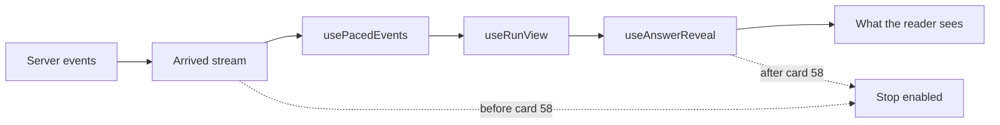

# Card 58 builder report: Stop works until the answer appears

Card 58 of `testing/UI_fix_plan.md` is a card at risk-dial position 2. The product owner raised it while trying develop on 2026-09-27:

> once the agent starts to write the answer, the stop button button just becomes gray ... a user should be able to stop the answer at any point of time until the answer pops out

This report says why Stop went grey and what changed. It also shows how the tests prove the fix.

## Table of contents

- [What the reader sees, before and after](#what-the-reader-sees-before-and-after)
- [Diagnosis](#diagnosis)
- [The fix](#the-fix)
- [The server on a stop mid-write](#the-server-on-a-stop-mid-write)
- [When phase 8.7 lands](#when-phase-87-lands)
- [Known gap, for a follow-up card](#known-gap-for-a-follow-up-card)
- [Tests and proof they can fail](#tests-and-proof-they-can-fail)
- [Check results](#check-results)
- [Files](#files)
- [Fix round](#fix-round)

## What the reader sees, before and after

- Before: Stop goes grey while the screen still shows the helpers handing back, or the writing banner, with no answer to read. On G-013 that lasted 12.9 seconds.
- After: Stop stays available from the moment the question passes the guard until the first sentence of the answer is on screen. Pressing it in that time shows "Search stopped. No answer was produced." and the answer never appears.
- After the first sentence is on screen, Stop is grey, and it is gone once the answer lands. The one exception is a server that is still writing while sentences show, which today never happens on develop. In that case Stop stays available, because it still cuts the rest of the answer short.

## Diagnosis

The early trust signal idea in the card is not what happens. Stop greys at the first `trust_signal`, but that event arrives in the same burst as the answer's tokens and `done`: 5 to 221 ms after the first token, in all 11 saved develop streams. The server does not send it when writing starts.

The real cause is the gap between the stream and the screen:

- `App.tsx` (lines 1021 to 1034 before this change) fed Stop the ARRIVED stream: `realStopEnabled = deriveStopEnabled(events)`, overriding the paced view's own value, on the reasoning that once `done` arrived the run was over on the server.
- The screen renders from `usePacedEvents` (a reading beat per stage, with a lag ceiling that grows with the number of helpers the plan names) and `useAnswerReveal` (the writing banner held at least 1.5 s, then one sentence at a time).
- On develop the whole answer arrives with `done`, often while the screen is still pacing through the helpers. So Stop greyed while the reader had nothing to read.
- `useRunView.ts:1402` computes `stopEnabled` from the paced events, but `App` replaced it, so that line was never what the reader saw.

### Replay of the saved develop streams

`pacing_replay.py` (this folder) replays each saved stream from `testing/Developer/reports/2026-09-26_answer_speed/live_develop/` through the client's pacing and reveal rules, copied by value. Seconds after the question was sent:

| Run | Helpers | First token arrived | First trust signal, Stop greyed | Server done | Writing banner shown | First word shown | Grey with nothing to read |
|---|---|---|---|---|---|---|---|
| G-013 | 13 | 17.25 | 17.27 | 17.28 | 28.64 | 30.14 | 12.87 |
| G-032 | 12 | 27.43 | 27.45 | 27.46 | 26.75 | 28.25 | 0.79 |
| G-025 | 13 | 19.89 | 20.11 | 20.12 | 30.19 | 31.69 | 11.58 |
| G-021 | 13 | 27.49 | 27.52 | 27.55 | 28.30 | 29.80 | 2.28 |
| G-016 | 13 | 22.33 | 22.36 | 22.36 | 28.12 | 29.62 | 7.26 |
| G-038 | 3 | 16.26 | 16.26 | 16.26 | 9.12 | 16.26 | 0.00 |
| G-022 | 8 | 14.46 | 14.51 | 14.51 | 20.07 | 21.57 | 7.06 |
| G-034 | 8 | 13.27 | 13.27 | 13.28 | 21.37 | 22.87 | 9.61 |
| G-012 | 8 | 13.34 | 13.34 | 13.34 | 18.29 | 19.79 | 6.45 |
| G-035 | 2 | 25.86 | 25.87 | 25.87 | 18.73 | 25.86 | 0.00 |
| G-013 | 13 | 26.48 | 26.52 | 26.55 | 38.31 | 39.81 | 13.29 |

Reading it:

- In 9 of 11 runs Stop greyed before the first word was on screen, by 0.8 to 13.3 seconds.
- In the two runs with 0.00 (G-038, G-035) the plan named only 2 or 3 helpers, the pacing caught up during the write, and the first word showed the moment it arrived.
- For most of the grey stretch the server had already finished. G-013 finished at 17.3 s, and the reader saw the first word at 30.1 s.

A speed finding for phase 8.7, not changed here: with 12 or 13 helpers the screen shows the first word 9 to 13 seconds after the server finished, because the lag ceiling (`maxLagFor`, 3.2 s plus 1.9 s per extra helper, 26 s at 13) lets the paced helper handoffs run long after every result is in.

## The fix

The answer "appears" when its first sentence is on screen. It does not appear at a trust signal, and not when the server finishes.

`frontend/src/components/chat/StopButton.tsx`:

- New `deriveStopOffered(events, shown)`. `events` is the arrived stream, and `shown` is `{ landed, claimsShown }` from the revealed view. Stop is offered when all of these hold:
  - the guard has passed;
  - no fatal error has arrived (its failure notice shows at once, because the pacing flushes on errors);
  - the view has not landed;
  - either no sentence is on screen, or the server is still working, meaning no `done` has arrived.
- `deriveStopEnabled(events)` no longer ends at a `trust_signal`. A trust signal is part of the answer, and under 8.7 a claim verdict can arrive while the server is still writing. It now ends at `done` or a fatal error.

`frontend/src/App.tsx`, the former `realStopEnabled` block only:

- The override on the paced view is gone.
- After `useAnswerReveal`, `view.stopEnabled` is set from `deriveStopOffered(events, { landed, claimsShown })`, gated on `runId` as before.
- Every Stop surface reads `view.stopEnabled` unchanged, so no call site moved:
  - the full-screen run;
  - the streaming answer with progress;
  - the inline follow-up.

Docstring-only updates: the `stopEnabled` field in `useRunView.ts` and the `stopEnabled` prop in `RunProgress.tsx`. The button's look is untouched.

`src/system_03_search_agent/core/run.py`, `run_streaming`'s `finally` and the helper it calls:

- A stopped run's capture row now records `max(last cost event, harness.get_query_cost_usd(trace_id))`.
- The harness is bound before the `try`, so the `finally` can read it.

## The server on a stop mid-write

Checked with a real `RunRegistry` driving the real `run_streaming()` and the real graph, offline. The writing (synth) call was made slow, and Stop was issued the moment it started and the Write step had announced itself.

| Requirement | Before | After |
|---|---|---|
| Writing model call cancelled | Yes. `cancel_run` cancels the drain task; LangGraph cancels its in-flight node task; the harness re-raises `CancelledError` | Unchanged |
| No answer arrives afterwards | Yes. The only event after the stop is the `cancelled` fatal error, on the buffer, the replay and the live queue | Unchanged |
| Ends as stopped, recorded that way | Yes. One capture row, `trust_outcome` `refuse`, which the review ritual reads as abstain | Unchanged |
| Cost already spent counted | Partly. The row carried the last `cost` event only, 0.000100 USD in the test, so the cancelled writing call's metered cost was missing and the system daily cost cap could not see it | Fixed. The row carries the harness total, which includes the cancelled call's metered cost |
| No orphaned task | Yes. No task is left running after the stop | Unchanged |

The stop route and `RunRegistry` needed no change.

## When phase 8.7 lands

Phase 8.7 will show the records when the searches end, then stream the answer sentence by sentence. The definition carries over unchanged:

- The answer appears at the first sentence on screen, which under 8.7 is the first streamed sentence the reveal shows.
- Before it, Stop is offered, whether or not the server has finished.
- After it, Stop stays offered only while no `done` has arrived. Under 8.7 that is the whole time the model is still writing, so Stop keeps its item 9.6 meaning: it cuts the rest of the answer short. The e2e arm "stop works while the answer is streaming in" asserts exactly that.
- Once `done` has arrived and a sentence is on screen, Stop is grey. It is gone when the answer lands.
- Records shown at the end of the searches are not answer sentences, so they do not end the Stop window. If 8.7 renders records as `claims`, it must keep them apart from answer sentences, or Stop would grey at the records.

## Known gap, for a follow-up card

When Stop is pressed after the server has finished (the grey stretch in the table), the screen honours it. The server has already recorded the run as answered, though:

- `interactions` holds it as an answer, so it counts as answered in the review ritual.
- The history rail shows the question with its answer after a reload or on the next sign-in, through `GET /v1/history` and the saved-answer route.
- Session memory keeps the turn, so a follow-up in the same session can bind to entities from an answer the reader never saw.
- "No answer was produced" is true of what the reader saw, not of what the server holds.

Fixing it needs `feedback/` and `core/session_memory.py`, outside this card's fence. The lead has agreed to add a follow-up card.

## Tests and proof they can fail

Server, new file `tests/system_03_search_agent/core/test_run_registry_stop_mid_write.py`, each arm with populate-checks that the synth call started and the Write step announced itself before the stop:

- S1: the writing call is cancelled, never completes, and no task is left running.
- S2: nothing of the answer follows the stop on the buffer, the subscriber replay or the live queue; the last event is the `cancelled` error.
- S3: one capture row, recorded as `refuse`, with a cost above what was spent before Write.

Frontend:

- `StopButton.test.tsx`: the trust-signal cases now expect Stop to stay on until `done`. There are 7 new `deriveStopOffered` cases: before the guard, after the guard, server done with nothing shown, the first sentence shown, still writing with sentences shown, landed, and fatal versus non-fatal errors.
- `StopButton.replay.test.tsx`: G-013 replayed on fake time through the same chain `App` renders from. There are three populate-checks: the old rule greyed Stop for at least 10 s with nothing to read, the server finished before the first sentence, and the view landed. It then asserts two things: Stop is on at every 50 ms sample from the guard to the first sentence, and off from the first sentence on.
- `App.stopUntilAnswer.test.tsx`: a whole run delivered in one chunk, as develop delivers it, through the real `App`. It asserts three things:
  - Stop is enabled once `done` has been read and no answer is on screen.
  - Pressing Stop calls the stop route, shows "Search stopped", and no answer appears over the next 10 s.
  - Left alone, Stop is on until the first sentence and off after it.

Proof they fail, run once each and reverted:

| Mutation | Result |
|---|---|
| `RunRegistry.cancel_run` does nothing | S1 red: "the writing model call was not cancelled by Stop". S2 red: "after Stop the run produced ['token', ... 'cost', 'done']". S3 red: "a run stopped while writing was recorded as 'ask'" |
| `run_streaming` passes no metered cost, which was the code before this card | S3 red: "the stopped run recorded 0.000100 USD, no more than the 0.000100 USD spent before Write" |
| `deriveStopOffered` goes back to the arrived stream alone | Replay red: "Stop was off while the reader had no answer to read", 257 samples from 17 300 ms, 12.85 s |
| `App` feeds Stop the arrived stream again | Both App arms red: "Stop was grey with no answer on screen" |

## Check results

Each line is pasted from its command's output:

- Card files: `npx vitest run src/components/chat/` gave `Test Files  4 passed (4)` and `Tests  49 passed (49)`. `npx vitest run src/App.stopUntilAnswer.test.tsx` gave `Test Files  1 passed (1)` and `Tests  2 passed (2)`.
- Full frontend suite: `npm test -- --run` with this machine at load average 160 (other agents running) gave `Test Files  1 failed | 57 passed (58)` and `Tests  6 failed | 463 passed (469)`. A rerun with `--maxWorkers=2` at load average 80 to 90 had `Failed Tests 8`. Every failure was `Error: Test timed out in 15000ms` or a lookup that timed out, all of them in `App.test.tsx` and `personaIdentity.test.tsx`. Neither file touches Stop, and no card 58 test failed in that rerun. Run alone, each App-level file passes:
  - `App.test.tsx`: `Tests  38 passed (38)`
  - `threadContinuation.test.tsx`: `Tests  3 passed (3)`
  - `App.savedAnswer.test.tsx`: `Tests  5 passed (5)`
  - `personaIdentity.test.tsx`: `Tests  5 passed (5)`
  - `App.stopUntilAnswer.test.tsx`: `Tests  2 passed (2)`
- `npm run build` gave `✓ built in 1.61s`.
- `ruff check` gave `All checks passed!`.
- `isort --check-only --diff src tests services tracker alembic .claude .github` exited 0.
- `bash .github/gates/gate04_unit_suite.sh` gave `6227 passed, 143 skipped, 24 deselected, 1 xfailed, 7 warnings in 863.77s (0:14:23)` and exited 0.
- `python3 tracker/check_doc_drift.py --check` gave `ok: 2 facts computed | 0 could not be computed | 0 stale | 0 structural` and exited 0.

## Files

Product:

- `frontend/src/components/chat/StopButton.tsx`
- `frontend/src/App.tsx`
- `frontend/src/hooks/useRunView.ts`, docstring only
- `frontend/src/components/screens/RunProgress.tsx`, docstring only
- `src/system_03_search_agent/core/run.py`

Tests:

- `frontend/src/components/chat/StopButton.test.tsx`
- `frontend/src/components/chat/StopButton.replay.test.tsx`
- `frontend/src/App.stopUntilAnswer.test.tsx`
- `tests/system_03_search_agent/core/test_run_registry_stop_mid_write.py`

Evidence:

- `testing/Developer/reports/2026-09-27_card58_stop/pacing_replay.py`
- `testing/Developer/reports/2026-09-27_card58_stop/pacing_replay_output.md`

## Fix round

One fix-and-verify round, on four findings from the judge and the adversary. Each red below was run on this branch before its fix, or with the named mutation in place, and each file was restored byte for byte after.

### What the reader sees now

- A person who presses Stop before the answer appears sees "Search stopped", whatever the run's shape. They never see the result page, a note from the stopped answer, or a trust line. That holds on the full-screen run and on a follow-up in the same thread.
- Kept on the stopped screen, because each was on screen before any Stop could discard it: a refusal or a clarification, which also says what to type next, and a failure notice.
- Dropped: the cap notice, whatever its source. On develop its only source is the answer's own note, since the server's one non-fatal error names `write` or `cypher_query` as its source. Its copy speaks of "this answer" beside "No answer was produced".

### F-58-J02, blocking: a Stop on a run with no sentences landed the result page

- Cause: Stop flushes the pacing, so the whole held-back answer reaches `useRunView` at once. The reveal's freeze only holds sentences. The per-question cap's partial result (`_partial_result_for_cap`) has none, so the view landed.
- Fix: `withholdAnswer` in `frontend/src/hooks/useAnswerReveal.ts`. A Stop before the first sentence keeps the view unlanded and clears its sentences, sources, verdicts, outcome, cap notice and notes.
- Commit: 0aeca9d6, `fix(web-ui): Stop shows Search stopped even when the answer had no sentences`.
- Red before the fix, full-screen run: `AssertionError: Stop was pressed, and the result page came up anyway: expected 
…(2)
 to be null`.
- Red before the fix, follow-up: `AssertionError: Stop was pressed on the follow-up, but Search stopped is not on screen: expected null not to be null`.
- Red with the fix line removed, hook test: `AssertionError: a stopped run landed on the result page: expected true to be false // Object.is equality`.
- Populate-check arm: left alone, the same cap result lands with `answer-cap` and `trust-line`, so the J02 arm cannot pass on a shape that never lands.

### F-58-A01, should-fix: a notice from the discarded answer showed under "Search stopped"

- Cause: the answer's own cap note becomes `capMessage`, and `RunProgress` renders the notice whatever `stopped` says.
- Fix: the same `withholdAnswer`, in the same commit, 0aeca9d6, since one cause produced both findings.
- Red before the fix: `AssertionError: a notice from the discarded answer showed under Search stopped: expected 

 to be null`.
- The arm's run carries a sentence, so the reveal holds the view unlanded before the fix. That keeps this arm about the notice alone.

### F-58-J03, should-fix: no test covered Stop on a follow-up

- Tests: two arms through the real `App`, turn one landed and the follow-up's whole run in one chunk. One is an ordinary answer, the other the cap result.
- Commit: de961024, `test(web-ui): Stop on a follow-up in the same thread is covered`.
- Red with `stopEnabled={false}` on the inline `RunProgress`, `App.tsx:1695`: both arms, `Error: Stop was grey on a follow-up with no answer on screen: expect(element).toBeEnabled()`, and `Tests  2 failed | 5 passed (7)`.

### F-58-J01, should-fix: no test covered a stopped run being charged once

- Test: S4 in `tests/system_03_search_agent/core/test_run_registry_stop_mid_write.py`. The row must equal the final harness total. The code is unchanged.
- Commit: 855bcf2e, `test(api): a run stopped mid-write is charged once`.
- Red with `_observed_cost_usd(events) + metered_cost_usd` at `run.py:274`: `AssertionError: the stopped run recorded 0.008200 USD, but it spent 0.008100 USD in all, of which 0.000100 USD before Write.`, and `1 failed, 3 passed in 12.10s`.

### Left as filed

- F-58-J04 to F-58-J07, notes.
- F-58-A02 to F-58-A07, notes.
- Card 59's gap: a Stop pressed after the server finished is still recorded as answered.

### Fix-round check results

Each line is pasted from its command's output:

- Card files, `npx vitest run src/components/chat/ src/App.stopUntilAnswer.test.tsx`: `Test Files  5 passed (5)` and `Tests  56 passed (56)`.
- The G-013 replay, `StopButton.replay.test.tsx`: `Tests  1 passed (1)`. `pacing_replay.py` rerun on the saved develop streams printed a table identical to `pacing_replay_output.md`.
- Server, `test_run_registry_stop_mid_write.py`: `4 passed in 8.50s`, S1 to S3 plus S4.
- Frontend files near the change, the hooks, the screens, the tour and the five App-level files: `Test Files  31 passed (31)` and `Tests  250 passed (250)`.
- `ruff check` gave `All checks passed!`, exit 0.
- `isort --check-only --diff src tests services tracker alembic .claude .github` exited 0.
- `npm run build` gave `✓ built in 564ms`, exit 0.
