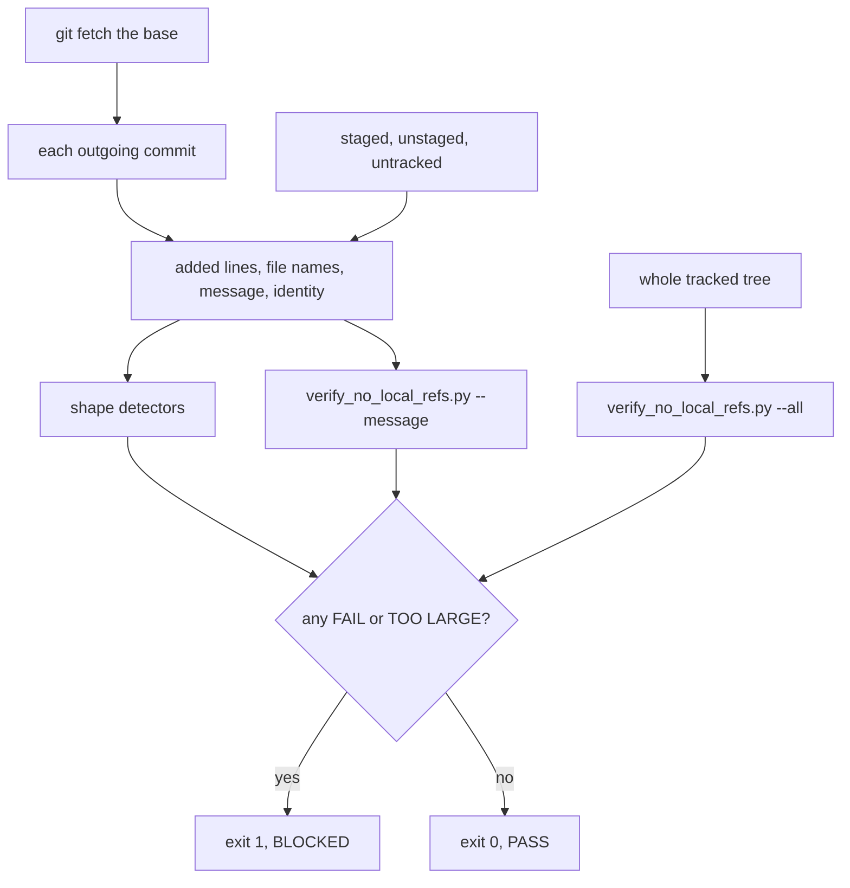

# Fix round: the /ship public-leak scan

Date: 2026-09-30. The single fix round after judge round 1 (`judge.md`, F-LS-J01 to J20) and the adversary round (`adversary.md`, F-LS-A01 to A21). Branch `chore/ship-leak-scan` in both repositories, pull request #145 in System 3 and #11 in data engineering. Nothing was pushed.

The promise, in the owner's words: /ship stops a push that would publish "PII such as name, or secret keys and anything that should not be visible for a public repo".

## Table of contents

- [What changed, in the user's words](#what-changed-in-the-users-words)
- [A scope change that did not land](#a-scope-change-that-did-not-land)
- [Finding by finding](#finding-by-finding)
- [Open, named rather than built](#open-named-rather-than-built)
- [Private references found already on develop](#private-references-found-already-on-develop)
- [False-alarm counts over System 3's develop](#false-alarm-counts-over-system-3s-develop)
- [Proof the tests can fail](#proof-the-tests-can-fail)
- [Gates](#gates)
- [Commits](#commits)

## What changed, in the user's words

- A key pasted in one commit and deleted in the next is now caught, and the scan names the commit that added it and says to take it out of that commit, not to add another.
- A name the owner's private list knows is now checked in every outgoing commit, message, file name and untracked file, and in the whole tracked tree, instead of an empty staged diff.
- Nothing is let through unread: long lines, files over 2 MB (now a failure), NUL-byte and UTF-16 text, text under a binary-looking name, and files hidden by `.gitattributes` are all read. A real screenshot is listed for a person to look at.
- The allow marker can no longer excuse a secret.

## A scope change that did not land

Mid-round the lead relayed a product-owner decision: secrets keep blocking, but every email finding, in content and in author or committer identity, becomes a warning that never changes the exit code. I started it and the permission layer refused a step of it as weakening a security control. Following that refusal, I reverted the partial script edit, did not pursue the change by another route, and left email findings blocking as in the original brief. SKILL.md therefore still says emails block. The change needs the owner to approve it through the permission system, then a small follow-up: a warning category set, `WARN` lines and summary wording in the script, and the email tests moved from exit 1 to exit 0.

## Finding by finding

Test names below are in `tests/ci/test_check_public_leaks.py`. Each was run red against the pre-fix script (see [Proof the tests can fail](#proof-the-tests-can-fail)).

### Judge

| Finding | Status | How, and the test |
|---------|--------|-------------------|
| J01 timeouts | Fixed | Every `subprocess.run` goes through one wrapper with a timeout; a timeout is exit 2 with what to do next. `test_every_subprocess_call_has_a_timeout` (reads the source), `test_a_git_timeout_is_exit_two` |
| J02 added then removed | Fixed | Per-commit scan of `<base>..HEAD`, merges through `--diff-merges=remerge`. `test_value_added_then_removed_in_a_later_commit_is_found`, `test_file_added_then_deleted_is_found`, `test_a_change_made_only_in_a_merge_commit_is_found` |
| J03 20,000 character cut | Fixed | No cut; long lines scanned in overlapping 8,192 character windows. `test_value_deep_in_a_long_line_is_found` (20,001 and 150,000) |
| J04 over 2 MB passes | Fixed | TOO LARGE, exit 1, "shrink or split it". `test_committed_text_file_over_the_limit_fails`, `test_untracked_text_file_over_the_limit_fails` |
| J05 NUL byte | Fixed | Any file git calls binary, or with a NUL in an added line, is read from its blob and judged by content. `test_text_with_a_nul_byte_is_read` |
| J06 `.gitattributes` | Fixed | `--no-textconv`, and a "Binary files differ" file is read from its blob rather than trusted. See the note below. `test_gitattributes_cannot_hide_a_file` |
| J07 file names | Fixed | New file names in each commit and untracked names are scanned; a revealing name is printed masked. `test_file_and_directory_names_are_scanned_and_hidden`, `test_other_revealing_file_names_fire` |
| J08 0x1E crash | Fixed | Commit records read with `git log -z`; any other crash is caught as exit 2 and names only the error type. `test_control_bytes_in_a_message_cannot_crash_the_scan`, `test_an_internal_error_is_exit_two` |
| J09 PGP key | Fixed | Optional `BLOCK` before the closing dashes. `test_category_fires_from_a_commit[pgp-private-key]` |
| J10 private check on an empty diff | Fixed | Runs `--message` over every scanned line and `--all` over the tree. `test_private_check_runs_in_message_and_all_modes`, `test_private_check_sees_every_outgoing_line` |
| J11 stale base | Fixed | `git fetch` of the base first (`--no-fetch` to opt out); a failed fetch is exit 2. `test_stale_base_after_a_force_push_is_fetched_first`, `test_branch_with_no_upstream_is_scanned_against_the_fetched_base`, `test_fetch_that_fails_is_exit_two_and_names_the_way_out` |
| J12 marker exempts secrets, short URL passwords | Fixed | The marker exempts private-value categories only; URL passwords of any length unless a placeholder, the user name repeated, a port, or a host that cannot exist. `test_allow_marker_never_exempts_a_secret`, `short-url-password` kind |
| J13 builder.md address | Fixed | Reworded without the value. Commit `18c3174a` |
| J14 builder.md fixture | Fixed | Commit `18c3174a` |
| J15 work domains named | Fixed | Removed from `builder.md` (commit `18c3174a`) and from `judge.md`'s own quotes |
| J16 surviving mutations | Fixed | Masking test checks every five-character run of every planted value from a commit, a message and an untracked file; `10.x` and `192.168.x` planted; committed size cap and untracked NUL tested; the stand-in check records its modes. `_redact` is gone, since nothing is relayed any more |
| J17 git-sync | Fixed | The scan is numbered step 5 before the push in SKILL.md and in `.claude/agents/git-sync.md`'s Push and Full sync sequences. A pre-push hook is open, below |
| J18 dash-encoded paths | Fixed | `-Users-<name>-`, `pytest-of-<name>` and Desktop, Documents or Downloads under `~` or `$HOME`. `test_other_local_path_shapes_fire` |
| J19 Output section | Fixed | Output item 2 asks for both runs' result, the private-check line, every NOT SCANNED file and any opt-out flag |
| J20 CIDR false alarm | Fixed | Network and broadcast addresses name a range, not a host. `test_known_false_alarm_does_not_fire[cidr-range]`; `judge.md` and `adversary.md` now pass the scan |

Note on J06: the brief named `git diff --text`. I used `--no-textconv` plus a blob read whenever git reports a file as binary, which reaches the same end, reading the published bytes, and also decodes UTF-16 properly; `--text` would have turned a UTF-16 file into byte soup and every screenshot into megabytes of diff.

### Adversary

| Finding | Status | How, and the test |
|---------|--------|-------------------|
| A01 missing secret shapes | Fixed, two parts open | Short, letters-only, digits-only and symbol passwords, PGP, Slack and Discord webhooks, Stripe, GitLab, Hugging Face and npm tokens, Basic auth, `pwd`, `auth`, `credential`, `passphrase`, `=>`, a slash in a URL password. A base64-wrapped token and a key split across two literals are open |
| A02 home path forms | Fixed | Dash-encoded, no trailing slash, home-relative, URL-encoded, lower-case Windows, WSL, a name with a space, JSON-escaped. `test_other_local_path_shapes_fire` |
| A03 added then removed | Fixed | As J02 |
| A04 over 2 MB | Fixed | As J04 |
| A05 binary by name | Fixed | Content decides; text under `.pdf`, `.db` or `.png` is read, a real binary's printable runs are read and it is listed for a person. `test_text_under_a_binary_name_is_read`, `test_real_binary_is_listed_for_a_person_and_its_text_runs_are_read` |
| A06 NUL and UTF-16 | Fixed | `test_text_with_a_nul_byte_is_read`, `test_utf16_file_is_decoded_and_read` |
| A07 long line | Fixed | As J03 |
| A08 file names | Fixed | As J07 |
| A09 notebook escaping | Fixed | Lines are also scanned with `\"`, `\'` and `\/` unescaped. `notebook-key` kind |
| A10 CR-only file | Fixed | Every line ending splits a physical line. `test_allow_marker_covers_one_physical_line_whatever_the_line_endings` |
| A11 marker anywhere on the line | Fixed for secrets | A secret on a marked line always fires. Other private values on the same physical line stay exempt, as the lead decided |
| A12 names and tag messages | Author names not scanned, by decision; tags open | `test_author_display_name_is_not_scanned` pins the decision |
| A13 private check never sees commits | Fixed | As J10, including a commit made past the hook and a line starting with `#` |
| A14 any exec script trusted | Fixed | Only a script whose own or resolved name is exactly `verify_no_local_refs.py`, on an exec line. `test_only_verify_no_local_refs_on_the_exec_line_is_trusted`, `test_a_link_to_the_check_through_a_quoted_path_with_spaces_is_trusted` |
| A15 raw output relayed | Fixed | Only `FAIL` lines of the check's own format are parsed, mapped to the scan's locations; a crash is NOT RUN. `test_private_check_raw_output_is_never_relayed` |
| A16 false alarms | Fixed | See the counts below and `test_known_false_alarm_does_not_fire` |
| A17 `.gitattributes` | Fixed | As J06 |
| A18 staged then cleaned | Fixed | The staged diff is read as well as the working tree. `test_staged_value_cleaned_only_in_the_working_copy_is_found` |
| A19 address and host gaps | Fixed, three parts open | `.md` and `.py` domains, `git@` on a non-forge host, noreply labels, `[at]` and `%40`, IPv6, internal hosts in URLs. Open: an address spelled out in words, a dash-encoded IP, a ticket key with no host |
| A20 working copy size | Fixed | The size that counts is the committed content. `test_committed_content_is_read_even_when_the_working_copy_grew` |
| A21 remove-the-line advice | Fixed | BLOCKED says to take a finding out of the commit that added it, with a soft reset to the printed merge base |

## Open, named rather than built

- Annotated tag messages (A12). /ship does not push tags; SKILL.md says to read a tag's message before pushing it.
- A pre-push git hook, so a push outside /ship and git-sync is gated too (J17). A hook change is the owner's.
- Any change to `.claude/settings.json`; none was made.
- A base64-wrapped secret, a key split across two string literals, an email spelled out in words, a dash-encoded IP, a bare internal ticket key.
- The email-as-warning decision, refused by the permission layer (see above).

## Private references found already on develop

Running the owner's check with `--all` found lines already public, which would have blocked every push. Following the privacy rule's "remove it from the working tree, tell the owner", each is fixed on this branch and named here without its value; the history is the owner's call.

- System 3, six lines (commit `ddfd0612`): a pointer into a private repository in a rule's header, two private folder names in `verify_adaptation.py`'s literal list (now split like the entry beside them), a home-relative settings path in the tmux quickstart, a fake home path in a GraphQL test fixture, and an elided home path in `tracker/phase_1.1.md`.
- Data engineering, five lines: Windows home paths naming a person in the rsync setup guide and the learnings log, now `<user>`.

## False-alarm counts over System 3's develop

Both scanners, `develop` at `d143747f`, no values printed.

Same content for both, develop's whole tree as one commit (the like-for-like comparison):

| Category | Before | After |
|----------|--------|-------|
| secret-assignment | 27 | 0 |
| ipv4-address | 23 | 10 |
| personal-email | 15 | 4 |
| local-path | 2 | 0 |
| Total | 67 | 14 |

The 14 left are ten RFC 1918 or public-organisation addresses in tests and one design assessment, and four addresses in tracker ledgers. The new run also read 3,569 file names and listed 335 binaries, mostly screenshots, for a person to look at.

Every commit since the root, one at a time, 1,822 commits (the new unit, so not like for like): before 195 findings on the net diff; after 1,938, of which 1,547 are local paths and most of the rest are the graph server's address, its SSH login command and its IPv6 address. These are genuine leaks in already public history, mostly in probe scripts and ledgers later removed, which the net diff could not see. They block no push, since only outgoing commits are scanned, and removing them is the owner's call.

## Proof the tests can fail

- Against the pre-fix script: `CHECK_PUBLIC_LEAKS_SCRIPT=<the pre-fix copy>` gives 125 failed and 107 passed of 232. Every test named in the tables above is among the 125; the 107 that pass on both are the first round's behaviour kept (placeholders, the original shapes, exit codes).
- Mutations of the fixed script, each applied to a scratch copy and run against the whole test file:

| Mutation | Result | First failing test |
|----------|--------|--------------------|
| Mask shows the value's tail | red | `test_no_run_of_five_characters_of_any_value_is_printed[aws-access-key]` |
| Per-commit patches not read | red | `test_category_fires_from_a_commit[private-key]` |
| Base not fetched | red | `test_stale_base_after_a_force_push_is_fetched_first` |
| Allow marker exempts secrets | red | `test_allow_marker_never_exempts_a_secret[private-key]` |
| Lines split on newline only | red | `test_allow_marker_covers_one_physical_line_whatever_the_line_endings[cr-only]` |
| Long line cut at one window | red | `test_value_deep_in_a_long_line_is_found[20001]` |
| TOO LARGE passes | red | `test_committed_text_file_over_the_limit_fails` |
| Git's binary verdict trusted | red | `test_text_with_a_nul_byte_is_read[commit]` |
| UTF-16 not decoded | red | `test_utf16_file_is_decoded_and_read[utf-16]` |
| A stray NUL makes a file binary | red (after tightening the test) | `test_text_with_a_nul_byte_is_read[commit]` |
| New file names not scanned | red | `test_file_and_directory_names_are_scanned_and_hidden[commit]` |
| Any exec script trusted | red | `test_hook_naming_a_missing_script_is_not_run` |
| Private check crash read as findings | red | `test_private_check_raw_output_is_never_relayed[1]` |
| Message lines not shielded from `#` | red (after tightening the test) | `test_private_check_sees_every_outgoing_line[hash-line]` |
| Tracked tree not checked | red | `test_private_check_runs_in_message_and_all_modes` |
| Git timeout dropped | red | `test_every_subprocess_call_has_a_timeout` |
| Crash not caught | red | `test_an_internal_error_is_exit_two` |
| 10/8 and 192.168/16 allowed | red | `test_category_fires_from_a_commit[ipv4-ten]` |
| Remove-the-line advice back | red | `test_value_added_then_removed_in_a_later_commit_is_found` |
| Staged diff not read | red | `test_staged_value_cleaned_only_in_the_working_copy_is_found` |
| Merge changes not read | red | `test_a_change_made_only_in_a_merge_commit_is_found` |
| Identity not checked | red | `test_non_noreply_identity_is_a_finding[AUTHOR]` |
| File name printed in full | red | `test_file_and_directory_names_are_scanned_and_hidden[commit]` |
| Placeholder filter always false | red | `test_placeholder_does_not_fire[...EXAMPLE]` |
| URL password length rule back | red | `test_category_fires_from_a_commit[short-url-password]` |
| Dash-encoded path not read | red | `test_other_local_path_shapes_fire[dash-encoded]` |
| PGP block not matched | red | `test_category_fires_from_a_commit[pgp-private-key]` |
| Single-digit section numbers fire | red (after adding a line with no section word) | `test_known_false_alarm_does_not_fire[numbered-clauses]` |

28 of 28 red. Three survived the first pass and were closed by tightening or adding a test, commit `91548338`.

## Gates

System 3 worktree:

| Gate | Result |
|------|--------|
| `tests/ci/test_check_public_leaks.py` | 232 passed |
| `tests/ci` and `tests/tracker` together | 692 passed |
| `ruff check .` | exit 0 |
| `.github/gates/gate02_import_order.sh` | exit 0 |
| `python3 tracker/check_doc_drift.py --check` | exit 0, 0 stale, 0 structural |
| `tests/system_03_search_agent/adapters/graphql/test_security.py` (its fixture changed) | 124 passed |
| The scan on this branch against `origin/develop`, fetched, private-name check run | exit 0 before and after the record commit, 0 findings, every outgoing commit read |

The full unit suite (`gate04`) was not run: outside the scanner, the only Python changes are one string in a test fixture and a split literal, both covered by the runs above.

Data engineering worktree:

| Gate | Result |
|------|--------|
| `tests/scripts/test_check_public_leaks.py` | 232 passed |
| `ruff check` on the script and its tests | exit 0 |
| The scan on its branch against `origin/develop`, fetched, private-name check run | exit 0, 4 commits, 0 findings |
| `cmp` with System 3's script | identical |

## Commits

System 3, branch `chore/ship-leak-scan`, not pushed:

- `374cc1d1` security(ship): the scanner and its tests.
- `ddfd0612` security: the six private references on develop.
- `64de276e` docs(ship): SKILL.md and git-sync.md.
- `18c3174a` docs: the builder report corrections.
- `91548338` test(ship): the two tightened tests.
- This record, with `judge.md` and `adversary.md`: docs: the leak scan's review record.

Data engineering, branch `chore/ship-leak-scan`, not pushed:

- `81852a8` security(ship): the same script and its tests.
- `6de1806` security: the five Windows home paths.
- `89e6846` test(ship): the two tightened tests.
- The proposed ship skill for its untracked `.claude/` is updated in the session scratchpad as `de_ship_SKILL.md.proposed`, since `.claude/` stays untracked there.
