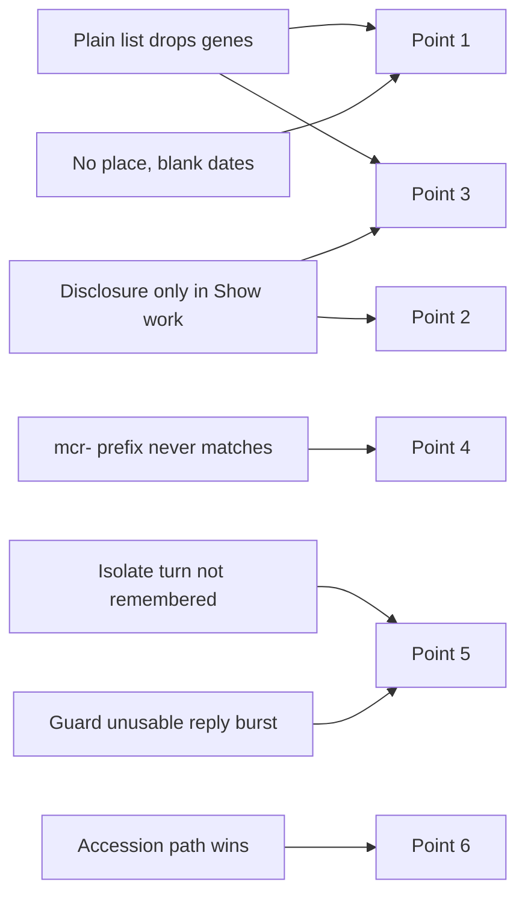

# Card 94 diagnosis: isolate answers without their genes, notes or details

Card 94 asks that an isolate question answer with a table of isolates and their resistance genes. The batch retest of 2026-09-29 found six gaps. This report finds the cause of each, groups them, and lists the fixes. It changes no code. Written 2026-10-05 against develop `9a13e983`, with 7 live questions asked on develop as a guest (budget 20), offline checks of the shipped functions, and the 2026-09-29 evidence in `testing/Developer/reports/2026-09-29_retest/runner_A/`. Paths are relative to `<repo-root>`.

## Table of contents

- [Summary](#summary)
- [What the person sees](#what-the-person-sees)
- [Reproduction](#reproduction)
- [Root cause per point](#root-cause-per-point)
- [Points grouped by shared cause](#points-grouped-by-shared-cause)
- [Fix options per group](#fix-options-per-group)
- [Recommended order](#recommended-order)
- [Confidence](#confidence)
- [What was not covered](#what-was-not-covered)

## Summary

| Point | Cause in one line | Group | Confidence |
|---|---|---|---|
| 1, Plain language shows names only | Plain language lists every record by title alone, by design (item 12.9, rule 2), so the gene column never reaches it | A | High |
| 1, Collected column empty | The column shows only a year, and many isolates carry no collection date; place is never shown in any mode | A | High |
| 2, no blaCTX-M note | The note is written into the Think step's narrative ("Show work"), never into the answer's notes | B | High |
| 3, no gene lists for Klebsiella | Same as point 1 | A | High |
| 3, no prefixes named | Same as point 2 | B | High |
| 4, colistin returns 0 | The colistin family searches the prefix `mcr-`, and the matcher's boundary rule rejects every real mcr gene after it | C | High, proven offline |
| 5, follow-up fails | Today: refused as off topic, 2 of 2, because the isolate turn stores no entity in session memory. On 2026-09-29: a fast guardrail failure of the recoverable class, probably the unusable-reply sibling of card 72, not the double timeout | D | High for today's refusal, medium for the 2026-09-29 failure |
| 6, single isolate lacks details | A BioSample accession wins over the isolate rule, so the question goes down the accession path; nothing anywhere plans the tool's single-isolate lookup | E | High |

The count differences are a newer snapshot, not a defect. E. coli ESBL isolates read 140,476 in the document, 140,867 on 2026-09-29 and 141,055 today; Klebsiella carbapenemase isolates read 88,025, 88,213 and 88,405. Both grow steadily with the date, and the tool resolves the newest complete snapshot on every call (`tools/pathogen_detection.py`, `_pathogen_detection_impl`). The E. coli snapshot folder listed `PDG000000004.6344` today.

Recommended first fix: group C, the colistin prefix. It is the one place the product states a wrong fact ("0 isolates"), it is a one-token data change, and it can be proven offline before any live run.

## What the person sees

- Asking the flagship E. coli ESBL question in the default Plain language mode, they get a list of 20 strain names under "Where this answer comes from", with no genes, no accession, no place and no date. Switching to Researcher shows the gene table, but half the "Collected" cells are blank and there is no place column.
- Nothing on the answer says that "extended-spectrum beta-lactamase" was searched as the blaCTX-M family only, or that blaTEM and blaSHV were left out on purpose. The sentence exists, but only inside "Show work".
- Asking about carbapenemase genes in Klebsiella, they see names without genes and are not told which gene prefixes were searched.
- Asking about colistin resistance in E. coli, they are told "Pathogen Detection lists 0 Escherichia coli isolates with these genes, all shown." That is a confident wrong record: mcr genes are well documented in E. coli, and the same day's Salmonella table listed mcr-9.1 carriers.
- Typing "Show me the ones from 2023" after the E. coli answer, they are told "This looks outside biomedical research" (today) or "This run could not be completed" (2026-09-29).
- Asking about isolate SAMN02147118, they get "a pathogen sample from Salmonella enterica" and an SRA run, with no strain, place, date, resistance genes or Pathogen Detection link.

## Reproduction

Live on develop, 2026-10-05, guest sessions, script `testing/Developer/reports/2026-10-05_card94/ask.py`, raw event streams in `raw/`.

| Run | Mode | Question | Outcome | Time | What came back | Raw file |
|---|---|---|---|---|---|---|
| 1 | Plain language | Query 33, E. coli ESBL | answer | 14.1 s | 20 `list_item` rows, each one cell, the strain name; notes hold the count sentence and the medical note only | `raw/q33_plain_turn1.json` |
| 2 | Plain language | Follow-up "Show me the ones from 2023" | refuse, off topic | 2.0 s | `guardrail.relevancy` chose `off_topic`, confidence 0.22, no tool run | `raw/q33_plain_turn2.json` |
| 3 | Researcher | Query 33 | ask | 47.2 s | Table "Isolates and their AMR genes", columns Isolate, Identifier, AMR genes, Collected; 12 of 20 Collected cells blank; no place column; no blaCTX-M note | `raw/q33_researcher_turn1.json` |
| 4 | Researcher | Follow-up "Show me the ones from 2023" | refuse, off topic | 1.7 s | Same as run 2 | `raw/q33_researcher_turn2.json` |
| 5 | Plain language | Query 36, Klebsiella carbapenemase | ask | 14.7 s | Names only; count 88,405; no prefixes named | `raw/q36_plain_turn1.json` |
| 6 | Plain language | Isolate workflow 5, E. coli colistin | ask | 30.8 s | Tool status `empty`, "lists 0 Escherichia coli isolates", plan searched `mcr-` | `raw/wf5_plain_turn1.json` |
| 7 | Plain language | Isolate workflow 10, SAMN02147118 | ask | 18.4 s | Plan: `biosample_summary`, `sra_summary` through `ncbi_efetch`; no `pathogen_detection` call | `raw/wf10_plain_turn1.json` |

Offline checks against the shipped code, `raw/offline_checks.txt`, and one public BioSample record fetch, `raw/biosample_SAMN00715300_SAMN00778958.xml`.

## Root cause per point

### Point 1: names without genes in Plain language, and an empty Collected column

Names only in Plain language:

- `write_node`'s listing has two shapes. `plain_listing`, `core/graph.py:11420`, puts every record under one "Where this answer comes from" list, one cell per row, the title from `plain_record_label`. `listing`, `core/graph.py:11444`, builds the Researcher tables, including the mapping column from `answer_layout.TABLE_COLUMNS`.
- `TABLE_COLUMNS` maps "Pathogen Detection isolate" to its `amr_genotypes` column, `synthesis/answer_layout.py:303`. Only `listing` reads it.
- This is item 12.9's rule 2 working as written (`synthesis/answer_layout.py:38` to `43`): Plain language gets titles only. For a gene question the titles are the answer. For an isolate question the genes are the answer, so the rule removes the answer.
- Live: run 1 shows 20 `list_item` tokens whose `cells` hold the strain name only, while run 3, the same records in Researcher, carries the gene list in the third cell.

Why the 2026-09-29 Salmonella run "in default mode" showed a table: its opening sentence, "Found 20 pathogen detection isolate records and 1 taxonomy record", is the Researcher wording of `answer_summary_sentence` (`synthesis/answer_layout.py:923`); the Plain wording is "I found 20 pathogen samples". That run came after the Researcher probe in the same browser, and the app keeps the last chosen mode (`frontend/src/App.tsx:1238`). So the shape does not vary run to run: it varies by mode.

Empty Collected cells and no place:

- The last Researcher column comes from `record_status_or_year`, which shows only the year of `collection_date` under "Collected" (`synthesis/answer_layout.py:510`). There is no column for `geo_loc_name` at all, so "where" is never shown in any mode, although `_layer_tool_output_to_structured_fields` keeps it on every row (`core/graph.py:4499` onward).
- The blank cells are records with no collection date. The BioSample record for SAMN00715300 (strain C236-11, a blank row) carries only its strain, no `collection_date` and no `geo_loc_name`. A blank cell therefore is not a lost value, but it reads as one: the person cannot tell "not recorded" from "not shown".
- The test document also asks for the accession beside the strain, which Plain language never shows.

### Point 2: no note that only blaCTX-M was searched

- The sentence exists: `isolate_search.disclosure` (`core/isolate_search.py:377`) writes "searching Escherichia coli isolates in Pathogen Detection for AMR genotypes starting blaCTX-M; blaTEM and blaSHV alleles were not searched: ...", from the family's own `omitted` text.
- `think_node` adds it to `model_resolution.disclosures` (`core/graph.py:3856` to `3866`), and that list is used in one place only: it is appended to the Think narrative, capped at 500 characters (`core/graph.py:4051` to `4058`). The narrative is what "Show work" displays.
- The answer's notes come from a fixed tuple in `write_node` (`core/graph.py:12789` to `12800`). The isolate entry is `_isolate_count_note` (`core/graph.py:8919`), which returns only `isolate_search.count_sentence`. No note carries the disclosure.
- Live: run 1's `think` event carries the full sentence; its `note` tokens carry the count and the medical note only. Run 3 the same.

### Point 3: Klebsiella shows no genes and names no prefixes

Two causes, both shared:

- No gene lists in Plain language: point 1's cause. Run 5 is Plain language and shows names only.
- No prefixes named: point 2's cause. Run 5's `think` event names "blaKPC, blaNDM, blaOXA-48, blaVIM, blaIMP; other blaOXA alleles were not searched", and none of it reaches the notes.

### Point 4: colistin in E. coli returns a suspicious zero

- The colistin family searches one prefix, `"mcr-"` (`core/isolate_search.py:175`).
- The tool's matcher accepts an item only when the character right after the prefix is not a letter or digit (`tools/pathogen_detection.py:496` to `520`). That rule is right for `blaCTX-M` (next character `-`) and is what keeps `blaCTX-M-15` from matching `blaCTX-M-155`. With `mcr-` the next character in every real gene name is a digit (`mcr-1.1`, `mcr-9.1`), so no mcr gene can ever match.
- Proven offline with the shipped functions (`raw/offline_checks.txt`): the colistin family matches none of `mcr-1.1`, `mcr-9.1`; every other family matches its own samples; `mcr` without the dash matches `mcr-1.1` and still rejects `mcrB`.
- The tool then reads the whole file, finds nothing, and reports `status: "empty"` with `scan_complete: true`, so the answer states an exact zero (run 6). The zero is a defect presented as a fact, the worst shape this answer can take.
- Why no test caught it: `tests/system_03_search_agent/core/test_isolate_search.py:188` to `192` pins that the family's prefix IS `("mcr-",)`, and no test runs a family's prefixes through the tool's predicate against a real gene name.
- The Salmonella mcr-9.1 rows on 2026-09-29 came from an ESBL search that happened to carry mcr-9.1 beside blaCTX-M-15, which is why mcr appeared there.

### Point 5: the follow-up "Show me the ones from 2023"

Today, reproducible, isolate-specific:

- After an isolate answer, the `plan` event carries `"resolved_entities": []` (runs 1 and 3). The isolate branch of `plan_node` builds its `PlanPayload` without them (`core/graph.py:6373` to `6385`), although Think resolved the organism (`NCBITaxon:562` in the `think` event).
- `_remember_turn` builds session memory's entities from the `plan` event only (`core/run.py:615` to `617`). So the isolate turn stores no entity.
- On the follow-up, `_is_memory_bound_follow_up` (`core/graph.py:5834`) needs at least one remembered entity before it treats "the ones" as pointing back. With none, `_relevancy_state` (`core/graph.py:5864`) hands the relevancy decision the follow-up alone, and "Show me the ones from 2023" read alone is off topic. Runs 2 and 4: `guardrail.relevancy` chose `off_topic`, confidence 0.22, in under 2 seconds.
- A second gap sits behind the first: nothing remembers the isolate search itself (organism and gene prefixes), and `parse_isolate_question` returns None for the follow-up (no isolate word). So even once the guardrail admits it, no step knows to ask the honest question the test document expects ("a year filter is not built; which organism or gene?").

On 2026-09-29, "This run could not be completed. Try asking again, or rephrase the question.":

- That copy is the frontend's text for a fatal error of class `recoverable` or `unexpected` (`frontend/src/hooks/useRunView.ts:1198`). Card 72's double guard timeout is class `transient`, whose copy is "Try asking again in a moment." (`useRunView.ts:1197`), and it takes about 15.4 seconds.
- The same retest saw two first turns end the same way in 6.3 and 6.8 seconds, with 0 tools (`wf1b_ecoli_esbl_then_2023.txt`, `wf2_salmonella_esbl.txt`). A fast fatal before any tool, with the recoverable copy, matches the guardrail's "no usable verdict" path, where the guard model answered twice and neither reply parsed (`core/graph.py:1949` to `1970`, `error_class: "recoverable"`). Card 72 counted three such cut-off replies on 2026-09-29, in the same burst as its timeouts.
- So the 2026-09-29 failure is probably the unusable-reply sibling of card 72: the same upstream burst, a different path, and not isolate-specific. It could not be confirmed, because reading develop's log was denied in this session (see the last section). Card 72's hedged-request fix would not cover it as written, since it targets slow replies, not unusable ones.

### Point 6: the single-isolate lookup lacks strain, place, date, genes and link

- `think_node` checks a chromosome window, then an accession, then the isolate rule, and the isolate rule runs only when no accession was found (`core/graph.py:3774` to `3784`). SAMN02147118 is a BioSample accession, so the accession path wins and plans a BioSample summary and its linked SRA run (run 7's plan: `biosample_summary, sra_summary`).
- The BioSample summary carries a title, "Pathogen sample from Salmonella enterica", and no AMR genotypes, which are Pathogen Detection's own computed data.
- Nothing in the agent plans `pathogen_detection` in `isolate_lookup` mode. A search of `src/` finds the mode only in the tool and the tool catalogue (`tools/catalogue.py:264`). The test document's "the older, single-isolate mode is not broken" is true of the tool and untrue of the product: the mode is unreachable from a question.
- Even without the accession rule, the isolate rule would ask "Which resistance gene or gene family?" for this question, since it names no gene (`raw/offline_checks.txt`).

## Points grouped by shared cause

| Group | Cause | Points | Where |
|---|---|---|---|
| A | The isolate's genes, place and date are not displayed in Plain language, and place never | 1, 3 | `core/graph.py:11420`, `synthesis/answer_layout.py:303`, `:510` |
| B | The searched-and-omitted prefixes are in the Think narrative only | 2, 3 | `core/graph.py:4051`, `:8919`, `:12789` |
| C | The colistin prefix cannot match under the boundary rule | 4 | `core/isolate_search.py:175`, `tools/pathogen_detection.py:520` |
| D | An isolate turn leaves nothing in session memory, and nothing reads an isolate follow-up; separately, a guardrail failure burst on 2026-09-29 | 5 | `core/graph.py:6373`, `core/run.py:615`, `core/graph.py:5834` |
| E | No route from a question to the single-isolate lookup | 6 | `core/graph.py:3774` to `3784` |

## Fix options per group

No option below names a test question or adds a word list. Where a choice about what a question means is involved, it goes to a classifier decision point and the code only verifies.

### Group A: show the isolate's genes, place and date

| Option | What changes | Risk | Answer path? |
|---|---|---|---|
| A1 | In Plain language, a record type whose `TABLE_COLUMNS` mapping is the answer keeps that mapping: a two-column list or table (isolate, genes) instead of the title alone. Keyed on the type's mapping, never on the question | Low. Display only; the firewall holds, since which records are listed and cited does not change. It is an exception to item 12.9's rule 2, which the owner set | No |
| A2 | Add a place column from `geo_loc_name` for isolates, and write "not recorded" where a record has no date or place instead of a blank cell | Low. Display only | No |
| A3 | Show the BioSample accession beside the strain in Plain language for isolates | Low | No |

A1 is an owner decision: it changes a rule the owner wrote ("Plain language gets one list, titles only"), and the owner's own test document expects the table in the default mode. The two disagree, and only the owner can say which wins.

### Group B: say which genes were searched and which were not

| Option | What changes | Risk | Answer path? |
|---|---|---|---|
| B1 | Beside `_isolate_count_note`, add a note built from `isolate_search.disclosure(question)`: the prefixes searched and each family's `omitted` sentence, in plain words. Code-built from the parsed family, so nothing new is hardcoded | Low. One more note; grounding and citations unchanged | Write's notes only; no golden run needed, but run it as an alarm if bundled with C |

### Group C: make colistin find mcr genes

| Option | What changes | Risk | Answer path? |
|---|---|---|---|
| C1 | Change the colistin family's prefix from `mcr-` to `mcr`. The boundary rule then matches `mcr-1.1` and `mcr-9.1` (next character `-`) and still rejects any `mcrX` name | Low. Verified offline; the schema accepts `mcr` | Yes: the tool's input. The golden run must hold at least 101 of 150 |
| C2 | Add a test that runs every `GENE_FAMILIES` entry's prefixes through `_amr_prefix_predicate` against at least one real AMRFinderPlus gene name of that family, so a family that can match nothing fails in CI | None | No |
| C3 | Optional: when a family search returns an exact zero, add a note naming the prefixes searched (group B does this) so a zero is checkable | Low | Notes only |

### Group D: the follow-up after an isolate answer

| Option | What changes | Risk | Answer path? |
|---|---|---|---|
| D1 | Publish the organism in the isolate branch's `PlanPayload.resolved_entities`, as Think already resolved it. Session memory then holds it, and the relevancy decision reads the follow-up with the previous question, as it does after a gene answer | Low to medium. Also changes what plan events carry for every isolate question | Yes. Golden at least 101 of 150 |
| D2 | Remember the isolate search (organism and prefixes) in session memory, and add a classifier decision point for "does this follow-up refine the previous isolate search?". Code verifies the remembered search exists. For a refinement the product cannot do yet (a year), Write answers with the honest question the test document asks for | Medium. A new decision point and memory field | Yes. Golden at least 101 of 150 |
| D3 | For the 2026-09-29 failure: treat it under card 72, with the unusable-reply path added to that card's scope (one fresh request when a reply is unusable, inside the same budget) | Medium, as card 72 states | Guardrail only |

D1 alone turns the refusal into an admitted follow-up, but without D2 the admitted follow-up has no isolate context and may bind "the ones" to the organism as if it were a gene question. Ship D1 and D2 together.

### Group E: the single-isolate lookup

| Option | What changes | Risk | Answer path? |
|---|---|---|---|
| E1 | When the accession is a BioSample, a classifier decision ("is this asking about the isolate's Pathogen Detection record?") adds one `pathogen_detection` `isolate_lookup` call beside the BioSample summary. The taxon folder comes from the organism the question names, or from the BioSample summary's organism, verified against `ORGANISMS` | Medium. A metadata scan can take up to about 18 seconds on a large taxon, against the 20-second answer target; the lookup stops at the first matching row, so most cases are faster | Yes. Golden at least 101 of 150, and a timing check on five runs |
| E2 | Only show the strain and Pathogen Detection link from the BioSample summary, without genes | Low | No genes, so it does not meet the test document; not recommended |

## Recommended order

Ordered by what the person feels first and by how wrong the current answer is:

1. Group C, colistin (C1 and C2). It states a false zero today. One token and one test, provable offline, then the golden run.
2. Group B, the disclosure note (B1). Small, no answer-path change, and it closes the honesty gap on every family question.
3. Group A, after the owner answers the rule 2 question (A1, then A2 and A3).
4. Group D, the follow-up (D1 with D2). Larger, needs a new decision point. D3 goes to card 72.
5. Group E, the single-isolate lookup (E1), with a timing check.

## Confidence

- Points 2, 3 and 4: high. The code path is direct and each was reproduced live; point 4 is proven offline with the shipped functions.
- Point 1: high for the Plain language cause and the missing place column; high that the blank dates are records without a date, from one BioSample record checked, not all twelve.
- Point 6: high. The precedence order and the absence of any `isolate_lookup` planner are both in the code, and run 7 confirms the plan.
- Point 5: high for today's off-topic refusal (2 of 2, with the decision record). Medium for the cause of the 2026-09-29 fatal, inferred from its copy, its 6-second timing and card 72's count of unusable replies that day.
- Count differences: high that they are newer snapshots; three dates, steadily rising counts.

## What was not covered

- Develop's API log was not read: access to the hosting platform's log was denied in this session. That is why the 2026-09-29 fatal's class and source are inferred rather than read.
- Queries 35, 38 to 40, 43 and 44 and isolate workflow 2 were not re-run; their failures in the retest share causes A and B, and query 44's question parses the same as query 33's.
- Only 7 of the 20 allowed live questions were used. Each point was reproduced once, or twice for the follow-up, not five times.
- Whether real E. coli isolates carry mcr genes in today's snapshot was not counted, since the fix is not built; the fix's golden and live runs will show the real count.
- The Researcher answers' trust outcome "ask", with the note "the written summary of these records could not be verified against them", was seen on runs 3, 5, 6 and 7. It is the structured-fallback path and outside this card.
- No browser screenshots were taken; the evidence is the event stream the screen renders from.
