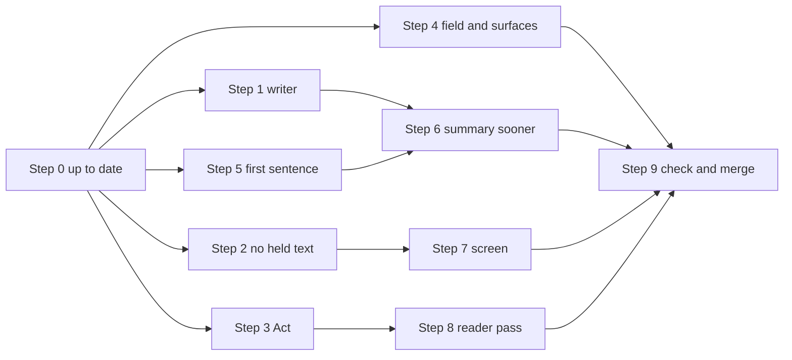

# Phase 8.7 resume plan

Read-only planning report, 2026-10-05. Phase 8.7 was parked on 2026-09-27 with three builders part-way. This plan says what to keep from each builder, what today's `develop` already changed under them, and the order to finish the phase in. Paths are relative to `<repo-root>`.

The phase's goal, in the owner's words on the board: the first sentence answers the question (card 2), the records show at about 8 seconds (card 50), and the strongest writer model writes (card 5). Wave 3 of `testing/Board_plan.md` also carries card 14, the 127-second search.

Sources read:

- `tracker/phase_8.7.md` on `origin/phase/8.7-answers-sooner`, tickets T-8.7-01 to 03 and the parking notes.
- `testing/Developer/reports/2026-09-26_phase_8.7/design.md`, design C for the first sentence.
- `testing/Developer/reports/2026-09-26_answer_speed/report.md`, options B, C, E, H and K.
- `testing/Developer/reports/2026-09-26_writer_bench_3/results.md`.
- `testing/Developer/reports/2026-10-05_board_plan/w4_reliability_and_speed.md` and `w6_architecture.md`.
- The four branches, today's `origin/develop` at 4ee38111, and the open pull requests #164, #166 and #168.

## Table of contents

- [The short version](#the-short-version)
- [Where each builder stopped](#where-each-builder-stopped)
- [What each commit becomes](#what-each-commit-becomes)
- [The goals against today](#the-goals-against-today)
- [Build steps in order](#build-steps-in-order)
- [Which steps run side by side](#which-steps-run-side-by-side)
- [Owner decisions](#owner-decisions)
- [Spend](#spend)
- [What the hand merges must get right](#what-the-hand-merges-must-get-right)
- [What this plan did not check](#what-this-plan-did-not-check)

## The short version

Nothing needs a fresh rebuild. Builder C's six commits and builder B's two lift cleanly onto today's `develop`. Builder A's one large commit needs a hand merge in a single function, `_write_answer`, against today's repair-draft rule (#163) and, once it merges, the fallback and cost-limit change (#168). One small piece of builder A is dropped because #168 already does it.

| Step | What a person notices | Source | Size |
|---|---|---|---|
| 0 | Nothing yet: the branch is brought up to date | Lead | S |
| 1 | Answers written by the strongest writer, never over 25 cents | Builder C, lifted as is | S |
| 2 | Text that has arrived is never held back on screen | Builder B, one part lifted by hand | S |
| 3 | No answer waits more than 6 seconds on a literature search | Builder C, lifted as is | S |
| 4 | Agents, the command line and saved answers keep reading order | Builder B's field, lifted, plus new work | M |
| 5 | The first sentence answers, or says the records do not give it | Builder A, lifted by hand | M |
| 6 | The written summary arrives sooner | Builder A, hand merge | L |
| 7 | Records on screen at about 8 seconds, the summary slots in above them | Builder B, lifted and finished | M |
| 8 | Paper questions up to 10 seconds faster (only if the owner agrees) | New, after builder C's probe | M |
| 9 | The phase is checked as a whole and merged | Lead | M |

## Where each builder stopped

Merge results below come from `git merge-tree --write-tree` against `origin/develop` at 4ee38111, which changes no branch. No unit test was run for this plan.

### Builder A, `feat/8.7-s1`, ticket T-8.7-01

4 commits ahead and 190 behind `develop`. Three are the phase's tracker commits, already on the phase branch. One carries all the work.

| Commit | What it does in plain words | Test state |
|---|---|---|
| 32e5945e | The whole of T-8.7-01 in one commit, saved by the lead when the machine restarted: the lead-sentence decision, the honest-gap clause, the listing grounded before the writer call, the second draft written beside the first, and the measurement scripts for that choice | Unreviewed. Its unit suite never finished. 637 lines of new write-step tests and 160 lines of first-sentence tests were written but never run to the end |

### Builder B, `feat/8.7-s2`, ticket T-8.7-03

8 commits ahead and 180 behind. Six are tracker commits or the 2026-09-27 merge of `develop`, already on the phase branch.

| Commit | What it does in plain words | Test state |
|---|---|---|
| 1e030148 | Adds one bounded field to each answer token, `placement`, either "listing" or "summary", default "summary", in the server contract, the browser's copy of it and the schema document | Committed by the builder with its tests in `test_events.py` and `events.test.ts` |
| cb407508 | The answer screen half: the records render as they arrive, a slot above them takes the summary, text that has arrived is never held back by the helper narrative, and Stop after records keeps them under "Search stopped" | Unreviewed. Seven arms of `App.stopUntilAnswer.test.tsx` fail by design until reshaped. The test file `AnswerScreen.listingFirst.test.tsx` was never written, mutation checks and gates never ran |

### Builder C, `feat/8.7-s3`, ticket T-8.7-02

9 commits ahead and 190 behind. Three are tracker commits.

| Commit | What it does in plain words | Test state |
|---|---|---|
| af495519 | The writer becomes Opus 5.5 at minimal reasoning effort; a per-model effort table lets it run at "minimal" while every other model keeps its tier's setting; it is priced before it is called at its real price; the cost check before each call uses that price | Tests in `test_opus_writer.py`, each shown to fail on the old code. Final gates not run |
| a683d396 | Each PubTator call in Act is cut at 6 seconds instead of 20; a cut call shows the existing "one of the background searches did not finish" note | Tests in `test_pubtator_act_cap.py`, failing on the old code |
| 217a95d0 | Gives that test a wider timing margin so it does not flake on a busy machine | Test only |
| 1d684034 | Looks up disease and MeSH names during Act, beside the reader pass, so Write does not wait for them | Tests in `test_act_name_lookups.py`, failing on the old code |
| 9669db2e | A probe test proving the reader pass's output reaches no answer, with a static check that goes red the day any module reads its fields | Test only |
| da2c04f6 | One real call through the harness proving Opus at minimal effort answers on the first try, for $0.0022 | One live call succeeded; script and result saved under `testing/Developer/reports/2026-09-27_phase_8.7_builder_c/` |

### The phase branch

`origin/phase/8.7-answers-sooner` is 11 commits ahead and 180 behind. Its only difference from `develop` is `tracker/phase_8.7.md`, so merging `develop` into it is clean.

## What each commit becomes

Verdicts: lift as is (a clean cherry-pick), lift with a hand merge (named conflicts), rebuild fresh, or drop.

| Commit | Verdict | Conflicts, or why |
|---|---|---|
| 32e5945e, lead sentence and honest gap | Lift with a hand merge, split into its own commit | Textually clean in `harness/decide.py`, `synthesis/answer_layout.py` and `_answer_tokens`. Split out from the listing work so each can be checked and reverted alone |
| 32e5945e, listing first and second draft | Lift with a hand merge | One conflict against `develop`: the repair block of `_write_answer`, where #163 added the keep-a-repair-with-more-sentences rule (`more_on_the_same_records`). Three more against #168 once it merges, all in `_write_answer`: the writer call's `try` and `QueryCapExceededError` branch, the repair condition (`not cap_hit`), and the choice of fallback note |
| 32e5945e, `_build_writer_cap_note` | Drop | Superseded by #168's `_build_cap_list_note` and its `cap_hit` path, which already list the gathered records when the cost limit stops the writer |
| 32e5945e, `_build_writer_failed_note` | Rebuild fresh, small | Its wording predates the owner's D1 (2026-10-05: the no-summary note is shown). Reword it in #168's style and make sure the frontend shows it |
| 32e5945e, measurement scripts and LEARNINGS row | Lift as is | Reports under `testing/Developer/reports/2026-09-26_phase_8.7/draft_order/`; the LEARNINGS row added by hand, since `LEARNINGS.md` is append-only and edited today |
| 1e030148 | Lift as is | Clean. It turns on builder A's early send, so the screen work must be on the branch when it lands, see step 4 |
| cb407508 | Lift as is, then finish | Clean against `develop` and against #168, although #168 edits `AnswerScreen.tsx` and `useRunView.ts` too. The `usePacedEvents.ts` part is taken out first as step 2 |
| af495519 | Lift as is | Clean |
| a683d396 then 217a95d0 | Lift as is, in that order | Clean as a pair. 217a95d0 alone reports a conflict only because its test file is created by a683d396 |
| 1d684034 | Lift as is | Clean; touches `act_node`, new `_prefetch_answer_names` and `_one_lookup_holds` only |
| 9669db2e | Lift as is | Clean, test only. Its static scan still passes on `develop`: the only other mention of those names is a function name, not an attribute read |
| da2c04f6 | Lift as is | Clean, report and script only |
| The tracker commits on the three builder branches | Drop | Already on the phase branch |

Builders A and C both edit `core/graph.py`, in disjoint functions; their branches merge with each other cleanly. No branch conflicts with #164 or #166.

## The goals against today

### Card 2: the first sentence still needs building

Every answer on `develop` still opens with the code-built count line: `_answer_tokens` emits `summary_sentence` first, then the model's prose (`core/graph.py`, about line 11725). Today's merges changed what follows that line, not what leads:

- #161 keeps reworded sentences that name their record, and #163 keeps a repair draft with more grounded sentences. More model sentences now survive, so design C's lead decision has more to choose from. That makes card 2 more worth building, not less.
- #168 shows the "no written summary" note and lists what a capped question gathered. It covers the case where no model sentence survives, which is exactly where design C keeps the count line leading.
- #164 caps the count line's markers at 20. Builder A's gap clause adds words, not markers, so the two fit.

What a person would see after step 5: "BRCA1 is linked to familial cancer of breast [1] and ..." first, then the count line; or, when the records lack what was asked, "Found 1 disease record for Marfan syndrome [1], which does not give clinical features." Today the gap clause knows one asked-for field, clinical features, from the `think.asks_features` decision. Phase 8.9 supplies the others (organism, title, gene).

Two test queries describe today's opening line as the expected one: query 2 ("Both modes open with one sentence counting what was found") and query 72 ("Plain language opens 'I found 5 clinical trials related to GERD'"). They need the owner's amendment before step 5 can pass them (decision 2).

### Card 50: what remains of the speed work

Today's live probe on `develop` took 13.9 to 37.2 seconds, three of five finished questions over 20 seconds, and one of six failed on the guard model timing out at 15.2 seconds. The parked work answers part of that:

| Lever | Expected effect | Where |
|---|---|---|
| Records sent the moment Act ends (option E) | First useful thing on screen at a median 7.6 s instead of 16.8 s | Steps 4, 6 and 7 |
| The screen no longer holds back arrived text | Up to 13 s sooner on questions with many helpers | Step 2 |
| Second draft beside the first (option B), measured under Opus | Write step median 14.2 s to 11.7 s, over 20 s from 21 of 54 runs to 2 | Step 6 |
| PubTator cut at 6 s (option C) | Only the slow tail; a cut search says so | Step 3 |
| Names looked up during Act (option H) | 0 to 0.7 s on disease questions | Step 3 |
| Reader pass off the answer path (option K) | Up to 10 s on paper questions | Step 8, owner's call |

What 8.7 will not reach, said plainly: the finished written summary will not be under 20 seconds for nine questions in ten. Opus writes each call in 10.7 s median against today's writer at 3.3 s; even with fewer repairs and option B, the write step is about 3 seconds longer than the re-land's 8.4 s median. The records arrive at about 8 seconds, and that is what the person feels first. The finished summary's 20 seconds needs work outside this phase:

- The guard model's slow bursts, cards 72 and 84, the other wave 3 build. They add 10 to 15 s on a bad run and cause today's failures.
- The writer's prompt prefix, card 40 item C8: 27,669 of its 32,914 characters are tool schemas. At Opus's input price this is also most of each call's cost.
- Shorter writer replies (option F), measured after this phase.
- Guardrail and Think side by side (option G), which the locked specification's Section 10.1 forbids without the owner.
- Graph indexes for the two slow traversals (option I), in the data engineering repository.
- The isolate table (option J).

### Card 5: what the writer switch needs

The owner's 2026-09-27 condition, "if the bench's finalist round confirms it", is met: stage 2 ran three runs of each finalist and Opus at minimal withdrew 0 of 54 summaries against 14 of 54 for the runner-up. Builder C's af495519 carries everything else the switch needs:

- The per-model reasoning setting: `_REASONING_EFFORT_BY_MODEL` in `harness/tiers.py`, read by `_reasoning_for` in `harness/harness.py`. Opus refuses `effort: none`, so it runs at "minimal" on any tier; every other model keeps its tier's setting.
- The price before the call: Opus at $4 and $20 per million tokens in the fallback price table, so the writer is priced even if the installed price map lacks it.
- The 25-cent cap: the cost check before each call prices it at the answering model's real price, never below the old static estimate. The old estimate priced an Opus call at $0.025 against a real $0.0855 median, so a 25-cent cap could not have held. The cap itself stays a deployment setting, `PER_QUERY_COST_CAP_USD`, with no code default; the lead sets develop's to 0.25 when the phase merges, which the 2026-09-27 decision covers.
- The model map, `docs/architecture/Model_architecture.md`, in the same commit. `visualizations/System_3_deep_dive.md` needs the matching refresh (card 39's note).

Two things it does not settle:

- Production. Production moves only at a release, and only if it sets no `SYNTH_MODEL` of its own. If production's per-question cap is still 10 cents, af495519 logs an error naming the setting, because one Opus call is estimated above it. That is decision 6.
- The bench ran on 2026-09-26 code. Today's grounding changes (#161, #163) were measured with the current writer only. Step 1's five repeated runs check Opus on today's code before anything is built on it.

### Card 14: the 127-second search

Card 14 is a timeout that stops the wait but not the work (F-8.1-05), seen once on 2026-09-20 and not since; today's slowest probe was 37.2 s. It needs no code in this phase. Step 9 records every question's time across the phase's runs and proposes closing it if none passes 60 seconds (decision 7), as the W4 scout recommended.

## Build steps in order

Each builder works in a worktree the lead creates from the phase branch, since an isolated worktree cannot run the project's Python here. The judge and the adversary are set aside on the owner's word of 2026-10-05, so every step is checked the board plan's way:

- The CI gates' exact commands, and a unit test that fails on the old code.
- For an answer-path step, five or more repeated live runs of its own questions on the phase branch.
- The test queries named, from `testing/Test_queries_and_workflows.md`. The golden run is an alarm only.

### Step 0: bring the phase branch up to date

- Wait for #164, #166 and #168 to merge into `develop`. They change `answer_summary_sentence`, `_answer_tokens` and `_write_answer`, the functions steps 5 and 6 rework.
- Merge `origin/develop` into `phase/8.7-answers-sooner`, which is clean.
- Add a dated history line to `tracker/phase_8.7.md`: resumed, the review roles set aside, the test queries as the gate, this plan as the source.
- Size S. Decision 1 comes first.

### Step 1: the writer becomes Opus at minimal effort (card 5)

- What a person sees: summaries that survive their checks far more often (bench: 0 of 54 withdrawn), never more than 25 cents a question.
- Source: cherry-pick af495519 and da2c04f6.
- Files and functions: `harness/tiers.py` `_DEFAULT_MODELS`, the fallback price table, `_REASONING_EFFORT_BY_MODEL`; `harness/harness.py` `_reasoning_for`, `call_tier`; `harness/cost_control.py` `estimate_call_cost_usd`, `_next_call_price`, `_model_for`, `check_per_query_cap`; `docs/architecture/Model_architecture.md`; then a refresh of `visualizations/System_3_deep_dive.md`.
- Size S.
- Check:
  - `tests/system_03_search_agent/harness/test_opus_writer.py` and the full unit suite.
  - Five repeated runs each of queries 1, 66, 73 and 75 with `PER_QUERY_COST_CAP_USD=0.25`: no summary withdrawn more often than today, no question's `done.total_cost_usd` over 0.25.
  - Test queries 1, 2, 10, 22, 72, 73 and 75. Query 10 also guards the slower writer: "well under a minute".

### Step 2: the screen stops holding back text (card 50)

- What a person sees: the answer appears when it arrives, not up to 13 seconds later behind the helper narrative.
- Source: by hand from cb407508, only `frontend/src/hooks/usePacedEvents.ts` (`isFlushEvent` treats a token as a flush, `dwellAfter`'s comment) and its arms in `usePacedEvents.test.ts`. It does not need the `placement` field.
- Size S. The lead may land it on `develop` ahead of the phase, as a UI fix, since it only removes a delay.
- Check: test queries 1, 18 (the wait stays readable while nothing has arrived), 56 and 98 (Stop greys once the first sentence is on screen, which now happens sooner).

### Step 3: Act waits less (card 50)

- What a person sees: no answer waits more than 6 seconds on a literature search, and one that is cut off says so.
- Source: cherry-pick a683d396, 217a95d0, 1d684034 and 9669db2e.
- Files and functions: `core/graph.py` `_LAYER_TOOL_ACT_TIMEOUT_SECONDS`, `act_node`, new `_prefetch_answer_names` and `_one_lookup_holds`; tests `test_pubtator_act_cap.py`, `test_act_name_lookups.py`, `test_reader_pass_reach_probe.py`.
- Size S.
- Check:
  - Five repeated runs each of queries 16 and 75, the literature questions most exposed to a cut search: must-cite records still present when PubTator answers in time.
  - Test queries 1, 12, 15, 16, 75, 79 and 84.

### Step 4: the token placement field, and every surface reads in reading order (card 50)

- What a person sees: nothing on the web yet. An agent, the command line, a saved answer and the golden harness keep the summary above the records once step 6 sends the records first.
- Source: cherry-pick 1e030148, plus new work for builder B's open item.
- Files and functions:
  - `contracts/events.py` `TokenPayload.placement`, plus one shared helper that orders token text by placement (summary, then listing).
  - `adapters/mcp/server.py`, the answer collector near `answer_parts`.
  - `adapters/graphql/fold.py`, the token fold and `answer_text`.
  - `adapters/cli/render.py` `_answer_parts` and `adapters/cli/main.py`'s token loop.
  - `feedback/capture.py`, the stored answer text.
  - `eval/trace_source.py`, and the scripts under `testing/Developer/scripts/` that join tokens.
- Size M.
- Important: builder A's code sends the records early only when `TokenPayload` has `placement` (`_contract_carries_placement`). Whichever of steps 4 and 6 lands second turns the early send on, so step 7's screen must be on the branch by then.
- Check:
  - A unit test per surface feeding listing tokens before summary tokens and expecting the summary first.
  - Test queries 67, 91, 93, 94, 95 and 100.

### Step 5: the first sentence answers the question (card 2)

- What a person sees: the opening line answers what was asked, from a cited sentence the checks already accepted; or it counts the records and says they do not give what was asked; or, if anything fails, today's count line, unchanged.
- Source: by hand from 32e5945e, as its own commit.
- Files and functions:
  - `harness/decide.py`: `LEAD_SENTENCE_POINT`, the criteria, `lead_sentence_options`, `lead_sentence_criteria`, `lead_sentence_state`, `lead_sentence_index`.
  - `synthesis/answer_layout.py`: `AskedField`, `records_lack_field`, `_gap_clause`, and the `finish` wrapper in `answer_summary_sentence`.
  - `core/graph.py`: `_lead_candidates`, `_lead_sentence_choice`, `_asked_field`, the two budget constants; the `lead_index` argument and the summary block of `_answer_tokens`; the call before `_answer_tokens` in `_write_answer`.
  - Tests: `tests/system_03_search_agent/synthesis/test_first_sentence_gap.py` and the lead-sentence arms of `test_write_answers_sooner.py`.
- Size M.
- Check:
  - Five repeated runs at both depths of queries 1, 23, 64, 66 and 72, run after step 1 so the candidates are Opus's sentences. Count, per run, whether the count line or a model sentence leads, as the design's acceptance test asks.
  - Test queries 1, 2 and 72 (as amended), 23, 25, 64, 65, 66, 73, 74, 77, 81 and 87. Query 77 matters because emphasis moves to the lead sentence.

### Step 6: the summary arrives sooner, and the records are grounded first (card 50)

- What a person sees: the written summary sooner on questions where the first draft leaves records out; records numbered in the order the list shows them.
- Source: hand merge of the rest of 32e5945e, after steps 1 and 5.
- Files and functions:
  - `core/graph.py`: `_AnswerParts` and the three-part `_answer_tokens`; `_PLACEMENT_LISTING`, `_PLACEMENT_SUMMARY`, `_contract_carries_placement`, `_with_placement`; `_listing_uncitable`, `_two_drafts_fit_cap`, `_SECOND_DRAFTS`, `_start_second_draft`, `_drop_second_draft`, `_second_draft_running`, `_second_draft_reply`, `_renumbered`; `write_node`'s `finally`; and `_write_answer`'s early listing, writer call, repair block, structured fallback, listing merge and emit loop.
  - `synthesis/findings.py`: `_directive_block_lines`, `build_listing_gap_directive`.
  - Tests: the rest of `test_write_answers_sooner.py`, and the `test_write_completeness.py` changes merged with #168's.
- Size L, the phase's largest risk. See [What the hand merges must get right](#what-the-hand-merges-must-get-right).
- Check:
  - A timing probe built from `testing/Developer/reports/2026-10-05_board_plan/scripts_w4/probe.py`, recording per question: first listing token, first summary token, `done`, and metered cost.
  - Five repeated runs each of queries 1, 17, 22 and 75.
  - Test queries 12, 17, 46, 65, 71, 74, 75 and 82.

### Step 7: the screen shows the records as they arrive (card 50)

- What a person sees: records with their citations at about 8 seconds; the summary appears above them without the list jumping; Stop after records keeps them under "Search stopped" (the owner's decision of 2026-09-27).
- Source: cherry-pick cb407508 without the part already taken in step 2, then finish builder B's list.
- Files and functions: `frontend/src/App.tsx`; `components/screens/AnswerScreen.tsx` and `RunProgress.tsx`; `hooks/useRunView.ts` (two regions by placement); `hooks/useAnswerReveal.ts` (`whatStopLeavesOnScreen`, no reveal timer); `components/chat/StopButton.replay.test.tsx`.
- Still to do:
  - Write `AnswerScreen.listingFirst.test.tsx`.
  - Reshape the seven failing arms of `App.stopUntilAnswer.test.tsx`.
  - Run the mutation checks and the frontend gates.
  - Confirm #168's shown note still shows in the two-region layout.
- Size M. Runs beside steps 5 and 6; lands with or before step 4's field.
- Check:
  - `/verify` at 1280 and 390 pixels beside `docs/build/design/design-system/screens/streaming.html` and `prototype/app.html`, plus the lead's own look in the browser.
  - Test queries 1, 6, 11, 17, 18, 56, 59, 77 and 98.

### Step 8: the reader pass leaves the answer path (card 50, only on the owner's yes)

- What a person sees: paper questions up to 10 seconds faster, with the same answer.
- Source: new work. Builder C's probe (9669db2e) found nothing the reader returns reaches any answer.
- Files and functions: `core/graph.py` `act_node`, where it awaits `coordinator_worker_execute`; `harness/coordinator_worker.py`. The probe's static check stays, so the skip fails its test the day anything starts reading the reader's fields.
- Size M. After step 3, since both touch `act_node`.
- Check:
  - Five repeated runs each of queries 16 and 75, with identical records and answers before and after.
  - Test queries 16, 69, 73, 75 and 88. Query 88 holds the hidden-instructions refusal.

### Step 9: check the phase as a whole and merge

- Run every test query named above, plus every query that passed the 2026-09-29 batch retest and touches the write step, Act or the answer screen, on the phase branch in the browser and through the API. No query that passed before may fail. If one fails, revert the steps one at a time to find the cause.
- From the step 6 timing probe across all runs: median and p90 for records on screen, first summary word and `done`, plus every question over 60 seconds for card 14.
- One golden run as an alarm, with two added columns from the design: the first word's time, and whether the count line or a model sentence leads.
- Then the pull request into `develop`, `PER_QUERY_COST_CAP_USD=0.25` on develop's API service, the tracker, the `DECISIONS.md` rows, and the card rows on the board.
- After the merge, delete `feat/8.7-s1`, `feat/8.7-s2` and `feat/8.7-s3` on the remote. They will not count as merged, since their commits were cherry-picked.
- Size M.

## Which steps run side by side

| Lane | Steps | Function fence | Runs beside |
|---|---|---|---|
| Harness | 1 | `harness/tiers.py`, `harness/harness.py` `_reasoning_for` and `call_tier`, `harness/cost_control.py` | Everything |
| Write | 5, then 6 | `_answer_tokens`, `_write_answer`, `write_node` and the write helpers in `core/graph.py`; `synthesis/answer_layout.py`, `synthesis/findings.py`, `harness/decide.py` | Lanes Act, Surfaces, Screen. Step 6's code may start beside step 1, but its cap fix and its live checks need step 1 on the branch |
| Act | 3, then 8 | `act_node`, `_LAYER_TOOL_ACT_TIMEOUT_SECONDS`, the new prefetch helpers, `harness/coordinator_worker.py` | Lanes Write, Surfaces, Screen |
| Surfaces | 4 | `contracts/events.py`, `adapters/`, `feedback/capture.py`, `eval/trace_source.py` | Everything except the moment the field lands, see step 4 |
| Screen | 2, then 7 | `frontend/src` hooks, `App.tsx`, the answer screen | Lanes Harness, Write, Act |

Steps 5 and 6 cannot run side by side: both rewrite `_answer_tokens` and `_write_answer`. Steps 2 and 7 share `usePacedEvents.ts`. Steps 3 and 8 share `act_node`.

## Owner decisions

Each is its own question with the recommendation first, asked at once with a notification under the decision cadence rule.

1. May phase 8.7 resume as soon as #164, #166 and #168 merge? Recommendation: yes. This is the board's D7. The three open pull requests rework the same write-step functions, so starting earlier means merging twice.
2. May test queries 2 and 72 change from "opens with a count of what was found" to "opens with a sentence that answers the question, or says the records do not give it, with the count right after", and may new entries cover cards 2, 50 and 5? Recommendation: yes. Without it, step 5 fails the owner's own standard by doing what card 2 asks.
3. Is phase 8.7's speed bar the records on screen within about 8 seconds, with the finished summary's 20 seconds for nine questions in ten left to the guard-model fix (cards 72 and 84) and the writer prefix trim (card 40 C8)? Recommendation: yes. The strongest writer adds about 3 seconds to the finished summary even after option B, so 8.7 alone will not finish nine in ten within 20 seconds. This sharpens the board's D8.
4. May phase 8.7 spend up to $60 of model credit on develop, including one golden alarm run of about $20 on a day of its own under develop's $25 daily cap? Recommendation: yes; see [Spend](#spend).
5. May the reader pass come off the answer path (step 8), now that the probe shows nothing it returns reaches any answer? Recommendation: yes, as the phase's last step, kept only if its five repeated runs give identical answers and query 88 still refuses. The reader is the quarantine for untrusted text, so this is the owner's call rather than the lead's.
6. When phase 8.7 is released, does production take the Opus writer with a 25-cent per-question cap, or keep today's writer for now? Recommendation: take it at the first release after step 9 passes, and raise production's per-question cap in the same release. Opus costs about six times today's writer per question (mean $0.126 against $0.021), so production's daily cap goes with it.
7. May card 14 close if no question across the phase's runs takes over 60 seconds? Recommendation: yes, as the W4 scout proposed. It was seen once, on 2026-09-20.

Inside the lead's remit, stated in the user's words:

- Records are numbered in the order the list shows them, since the list reaches the screen first. A summary sentence may then cite [7] before [2].
- The second draft starts beside the first only when the listing cannot cite a record the writer was shown. Measured over the bench's 54 Opus runs, it cuts the write step's median from 14.2 to 11.7 seconds for about half a cent more per question.

## Spend

Opus costs about $0.126 a question at the bench's mean, about $0.13 with the second draft.

| Use | Questions | About |
|---|---|---|
| Step 1 repeated runs | 20 | $3 |
| Step 3 repeated runs | 10 | $1.50 |
| Step 5 repeated runs, both depths | 50 | $7 |
| Step 6 repeated runs and timing | 20 | $3 |
| Step 8 repeated runs | 10 | $1.50 |
| Test query runs, browser and API, steps 1 to 9 | about 120 | $16 |
| One golden alarm run | 150 | $20 |
| Margin for reruns | | $8 |
| Total | | about $60 |

## What the hand merges must get right

- The repair-keep rule. #163 keeps a repair that reports every record the first draft did and grounds more sentences (`more_on_the_same_records`). Builder A moved the repair block and kept only the strict-superset rule. Its `_second_draft_reply` path must use #163's full rule, or step 6 undoes card 88.
- The cost limit. #168 skips the writer on `cap_hit` and lists what was gathered with `_build_cap_list_note`. Builder A's `writer_failure == "cap"` path does the same for a cap hit at the writer call. Keep one path and one note, #168's, and remove `_build_writer_cap_note`.
- The second draft's cap check. `_two_drafts_fit_cap` calls `cost_control.estimate_call_cost_usd("synth")` with no price, so after step 1 it still uses the old $0.025 static estimate for an Opus call that costs about $0.0855. Pass the answering model's price, as af495519's own cap check does. That needs a public way to get it from `cost_control`, since `_next_call_price` is private.
- A dropped draft's metered cost. `call_tier` meters a cancelled call at the synth tier's full 4,000-token output ceiling (F-2.1-B02), about $0.08 at Opus's output price. Builder A's measurement used billed cost. Step 6's probe must read the harness's metered `done.total_cost_usd` and show no question refused by the 25-cent cap that would have answered before.
- One row per record. #166 dedupes rows inside `_answer_tokens`' listing helpers. Builder A's early listing calls `_answer_tokens` separately, so the early listing and the final answer must dedupe the same way, or the reader sees two rows that later become one.
- The early listing's numbering. After the early send, a citation whose number changes is only logged as a warning in builder A's emit loop. Make that impossible by construction and covered by a test, since a changed number on screen is a citation pointing at the wrong record.
- Nothing shown is taken back. Once the records are on screen, a failed or capped writer leaves them as the answer with a shown note; check that #168's note texts are what `useRunView.ts` and `AnswerScreen.tsx` now show, not hide.

## What this plan did not check

- No unit test was run on any branch or merged tree; the test states above come from the tracker and the commit messages.
- Semantic conflicts were reasoned from the diffs; only textual conflicts were proven with `git merge-tree`.
- #164, #166 and #168 were read as they stood at 20:47 UTC; later commits on them may move the conflicts.
- Develop's and production's `SYNTH_MODEL`, `PER_QUERY_COST_CAP_USD`, `SYSTEM_DAILY_CAP_USD` and `CLASSIFIER_PROVIDER` were not read from Railway. The lead sentence decision runs only when Jev is the classifier, so a deployment without it keeps today's count line leading.
- The shared model account's balance today was not read.
- Which queries passed the 2026-09-29 batch retest was not listed here; step 9 needs that list from the retest record.
