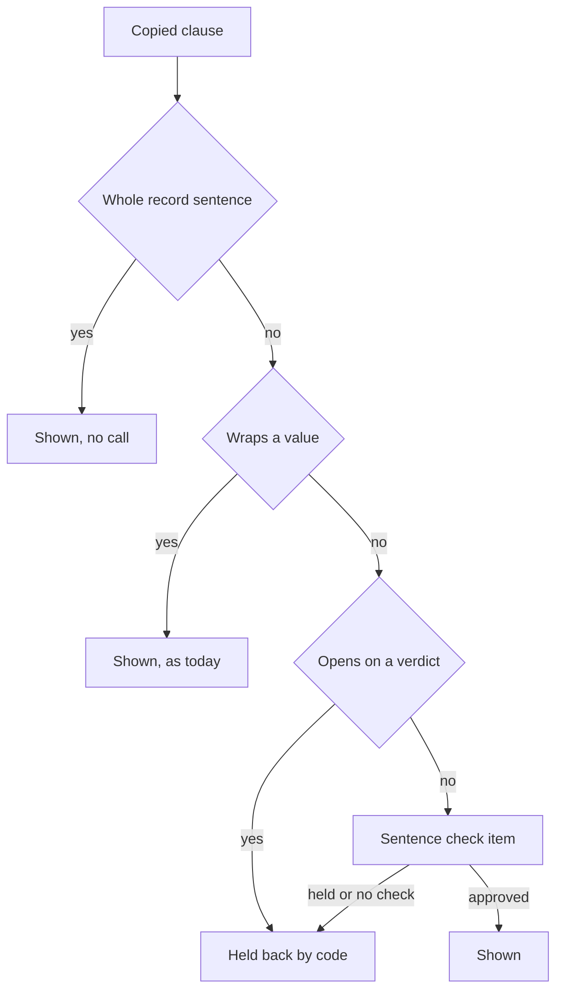

# Card 101 build round 3: copied cuts go to the sentence check

Builder, 2026-10-06, branch `fix/card101-copied-cuts` from develop d8179c4e. The brief: the only sentence shown without the sentence check is a whole sentence of its record, word for word; a cut, two clauses joined, or a record value wrapped in other words goes to the check (the owner's rule of 2026-10-06, `DECISIONS.md`). The holes are round 2's adversary findings A2-101-01 to 03 (`adversary_r2.md`).

Two of the three shapes are built. The third, a wrapped value, is not: built as written it also holds back correct gene answers, and that trade is the owner's to decide. It is the first section below.

## Table of contents

- [Verdict](#verdict)
- [The owner decision this round needs](#the-owner-decision-this-round-needs)
- [The change in the user's words](#the-change-in-the-users-words)
- [What changed](#what-changed)
- [The test for a whole record sentence](#the-test-for-a-whole-record-sentence)
- [Choices for the lead to log](#choices-for-the-lead-to-log)
- [Tests and mutations](#tests-and-mutations)
- [Offline rescan of the recorded answers](#offline-rescan-of-the-recorded-answers)
- [Live check on the attacks and recorded cuts](#live-check-on-the-attacks-and-recorded-cuts)
- [Live answers](#live-answers)
- [Gates](#gates)
- [Spend](#spend)
- [Not covered](#not-covered)

## Verdict

| Check | Result |
|---|---|
| Aspirin cut ("There is no evidence that" dropped) | Check candidate; held back by the live check 3 of 3 |
| Antibiotics tail cut ("only when ..." dropped) | Check candidate; held back 3 of 3 |
| Joined clauses "Drug X reduces mortality [1] in men [1]" | Two candidates, the second read as the joined claim; both held back 3 of 3 |
| Ribavirin wrapped title | Not changed: still shown with no check. Owner decision below |
| A whole record sentence copied word for word | Still shown with no model call |
| The check cannot run | No cut is shown; whole record sentences still are |
| Recorded faithful cuts through the live check | 5 of 5 approved, 3 of 3 runs (one of the five is the diagnosis's borderline "218 distinct genes" cut) |
| Offline, 66 recorded answers | 6 shown sentences in 5 answers move to the check; 7 check items and 2 check calls added; no answer has every sentence moved |
| Live, 6 plain-language answers | 22 sentences shown, 0 answers without prose, 0 sentences shown as an unchecked cut |
| Gates 02, 03, 04 | Pass |
| Spend, limit $0.30 | $0.124 |

## The owner decision this round needs

A short record value wrapped in other words and a correct gene answer are the same shape to code:

| Sentence | Its record | The question |
|---|---|---|
| "Ribavirin can cure bronchiolitis in babies [3]" | name: Ribavirin | "Which drugs can cure bronchiolitis in babies?" |
| "BRCA1 is associated with familial cancer of breast [2]" | name: Familial cancer of breast | "What diseases is BRCA1 associated with?" |

Both wrap the record's name in the question's words. The difference is outside the record's text: the gene answer's link is the graph edge the tool walked to find the disease, which the finding does not carry.

Built as the brief states it, every such sentence goes to the check. Measured:

- Live, the check held back the gene sentence 3 of 3 times, as it held back the ribavirin one. It reads only "Familial cancer of breast" and is right that the words say nothing about BRCA1.
- On this branch with only the wrap exemption removed, 40 existing tests fail: 30 in synthesis and 10 in `core/` (outside this fence), gene, disease and findings-tail answers of this shape ("BRCA1 has 15,310 ClinVar variants", "The clinical significance of ClinVar:17662 is Pathogenic").
- So a gene question's prose would be held back and the answer would fall to the code-built list. That is a visible loss on the product's first questions, against the standing rule that no surface gets worse.
- The recorded answers (literature questions only) show 8 such sentences in 4 of 66 answers, all name or identifier lines ("Publication pmid ... is included", "a trial named ..."). No recorded gene answer was available to measure.

Options, from the reader's chair:

| Option | What the person sees | Cost |
|---|---|---|
| A. Leave wraps as today (what this branch does) | Gene answers unchanged. "Ribavirin can cure bronchiolitis in babies" can still show, cited to a record that only names the drug | The hole A2-101-03 stays open |
| B. Send every wrap to the check (the brief as written) | No wrapped claim is shown unchecked. Gene answers lose their prose and show the record list instead | Large: measured above. Needs `core/` test changes |
| C. Send wraps to the check, and give the check the link that found the record (for a graph row, "linked to BRCA1 in the graph") | Ribavirin held back; a gene sentence approved when the graph link says it | Medium to large: the finding must carry its link (`findings.py`, `core/graph.py`), a new card |
| D. Send a wrap to the check only when its record did not come from the planned graph query | Ribavirin from a literature or live record held back; graph answers unchanged | Small, but a rule about where a record came from, not what it says; a graph row wrapped as "BRCA1 causes ..." still shows unchecked |

Recommendation: C as its own card, with A in the meantime. It is the only option that judges both sentences by what the records say, and A keeps gene answers whole until it lands.

## The change in the user's words

- A sentence copied from a paper shows at once only when it is one of the paper's sentences in full, word for word.
- A sentence that copies only part of a paper's sentence, for example leaving off "There is no evidence that" or "only when an infection is confirmed", is now read by the sentence check against the whole sentence it came from before it is shown. So is a sentence built by joining two copied pieces: the check reads the joined sentence.
- When the check cannot run, those partial copies are not shown.
- Not changed yet: a sentence that puts a short record value, such as a drug's name or a paper's title, inside other words still shows without the check. See the decision above.

## What changed

| Commit | Change |
|---|---|
| `5c1a9f8b` fix(grounding): Send a copied cut to the sentence check | `synthesis/grounding.py`: `is_whole_record_sentence`, `_copied_clause_candidate` and the routing in `run_grounding_pass`; three existing tests updated; new `test_copied_cuts.py` |
| This report's commit | `build_r3.md` and `raw/copied_cuts/` (scripts and count-only outputs) |

How the pass treats a clause that the strict copy test accepts:

An approved cut is committed exactly as a copy was before (no evidence quote), so every sentence rule after it still applies: the fragment rule, brackets, the bare pronoun and the restatement drop.

## The test for a whole record sentence

No word list: where the words sit in the record decides.

| Part | Rule |
|---|---|
| What may differ | Only the case of the first letter, trailing punctuation, whitespace, and an opening or closing quote mark or bracket around the sentence. Every other character must match: no lowercasing, no number separator removal |
| Where it may start | The start of the record's value, or after a full stop, semicolon, question mark, exclamation mark or colon and a space |
| Where it may end | The end of the value, or at a full stop, semicolon, question mark or exclamation mark. A colon is not an end: what follows it is the content |
| The code-built row | A clause equal to the finding exactly as code renders it to the writer (type, identifier, field name and value) is also whole. This is the row the structured fallback and the findings tail print, so they keep grounding with no check |

What it moves, on the recorded answers: see [Offline rescan](#offline-rescan-of-the-recorded-answers). The semicolon and the code-built row are the two places where this test is wider than "one sentence": both are listed below with their cost.

## Choices for the lead to log

| Choice | Taken | Alternatives considered | Why |
|---|---|---|---|
| Wrapped values | Not moved; pinned by a test so changing it is a visible choice | Move them as the brief says | The gene-answer cost above; the owner's call |
| What the check reads for a cut | The writer's sentence up to and including the cut, against the record text behind every clause up to there | The cut alone (as reworded clauses are read) | A cut read alone cannot show a joined claim: "in men" alone says nothing. A strip at a sentence's end leaves a prefix and a strip in its middle drops the sentence, so whatever is shown ending at a cut is exactly what was read |
| Negation check for a cut | Not applied by code; the check reads the whole record sentence | Code holds back a cut whose record sentence denies and it does not | Code would also hold back faithful cuts that drop a separate denied clause ("Treatment is symptomatic" from "..., and antibiotics are not recommended"), with no model reading them. The live check held the aspirin reversal 3 of 3 |
| Semicolon as a sentence end | Yes | Not a sentence end | Without it the code-built listing loses rows split at a semicolon (OMIM titles such as "GLUCOKINASE; GCK", 4 tests in `core/`). It matches the pass's own sentence splitter. Cost: a copy of the clause before "; however, ..." still shows unchecked; 3 of 133 recorded record sentences carry a semicolon, 1 with a limit after it |
| Colon | A start, not an end | Both or neither | A colon starts a structured abstract's sentence ("Results: ..."); a clause that stops at a colon drops the content it introduces |
| A whole sentence copied with a quote attached | Shown with no call, as before | Read by the check | It is the record's own words; the quote adds nothing to judge |
| Lowercase fragments | Collected for the check, then dropped by the fragment rule even if approved | Hold back in code before asking | Same outcome on screen; kept simple. Costs a check item for a sentence that cannot show (not seen in the recorded answers) |

## Tests and mutations

New file `tests/system_03_search_agent/synthesis/test_copied_cuts.py`, 16 cases, offline, no model. Updated: two arms of `test_quote_anchored_synthesis.py` (their sentences are cuts; they now ground through both passes with an approving check) and one of `test_sentence_check.py` (its "no call" sentence is now a whole record sentence).

| Arm | Property |
|---|---|
| `test_a_copied_cut_becomes_a_check_candidate` (aspirin, antibiotics) | The cut is collected with its whole record sentence as the quote and not shown on the first pass |
| `test_two_copied_clauses_are_read_joined` | Two candidates; the second reads "Drug X reduces mortality in men" |
| `test_an_approved_cut_shows_and_the_fragment_rule_still_applies` | Approved cut shown as a copy; an approved lowercase back half still dropped |
| `test_a_whole_record_sentence_is_not_a_candidate` (3 cases) | As written, first letter and full stop changed, with a quote |
| `test_the_code_built_listing_still_grounds_whole` | Fallback rows: a labelled title, each sentence of an abstract, an OMIM semicolon title, a colon label |
| `test_a_whole_record_sentence_shows_without_a_call` | No model call |
| `test_a_check_that_cannot_approve_shows_none_of_the_cuts` (5 cases) | Approves none, unreadable, call failed, cost cap, too little time: only the whole sentence shows |
| `test_the_check_approving_the_cuts_shows_them` | One call for all cuts, all shown |
| `test_a_wrapped_record_value_keeps_todays_path_for_now` | Ribavirin and the gene sentence still shown with no candidate |

Each mutation applied by `raw/copied_cuts/mutate.py`, the file run, the source restored and checked byte for byte (`raw/copied_cuts/mutations.txt`):

| Mutation | Arms red |
|---|---|
| M1, code approves every copy again | 10 of 16: both cut arms, the joined arm, the fragment arm, all 5 fail-closed cases, the approval arm |
| M2, no copy is ever whole | 10 of 16: the 3 whole-sentence cases, the no-call arm, the listing arm, all 5 fail-closed cases |
| M3, the check reads the clause alone | 1: the joined arm |
| M4, a collected cut is also kept on the first pass | 8: both cut arms, the joined arm, all 5 fail-closed cases |
| M5, a semicolon is not a sentence start | 1: the listing arm |
| M6, wraps go to the check too | 1: the wrap arm |

Whole synthesis folder after the change: 618 passed, 10 skipped, 1 xfailed.

## Offline rescan of the recorded answers

The diagnosis's traces plus round 2's live answers, 66 answers, rescanned with the shipped `is_whole_record_sentence` (`raw/copied_cuts/scan_copied_cuts.py`, counts in `scan_copied_cuts.txt`). "Moved" means shown by code alone before and needing the check now.

| Source | Answers | Shown | Moved, cuts | Answers affected | Check items added | New check calls | Wraps pending the decision |
|---|---|---|---|---|---|---|---|
| 2026-10-05, card 89 branch | 15 | 62 | 0 | 0 | 0 | 0 | 0 |
| 2026-10-05, develop control | 14 | 43 | 3 | 2 | 3 | 0 | 3 |
| 2026-10-06, card 101 build | 8 | 42 | 0 | 0 | 0 | 0 | 4 |
| 2026-10-06, card 101 fix round | 14 | 36 | 2 | 2 | 2 | 2 | 0 |
| 2026-10-06, round 2 live | 15 | 55 | 1 | 1 | 2 | 0 | 1 |
| Total | 66 | 238 | 6 | 5 | 7 | 2 | 8 |

- The 6 moved sentences are 5 distinct cuts, the same ones the diagnosis judged: 4 faithful and the borderline "Deleterious variants were identified in 218 distinct genes" (drops "Out of 176 solved families").
- Items added counts every first pass, shown or not. The 2 new calls are two fix round bronchiolitis answers whose first draft had no other candidate; a call there costs about 0.3 s.
- No answer has every shown sentence moved, so none would lose all its prose if the check held every cut back. With wraps moved too, still none.

## Live check on the attacks and recorded cuts

Each item built by the real first pass, then judged by the shipped `check_reworded_sentences` in the classifier mode develop runs (item call plus card 99's pair calls), 3 runs, 2 calls each (`raw/copied_cuts/live_check.py`, `live_check.jsonl`).

| Item | Run 1 | Run 2 | Run 3 |
|---|---|---|---|
| Aspirin head cut | Held | Held | Held |
| Antibiotics tail cut | Held | Held | Held |
| Joined clauses, first clause | Held | Held | Held |
| Joined clauses, joined claim | Held | Held | Held |
| Ribavirin wrap (built only for this probe) | Held | Held | Held |
| 4 faithful recorded cuts | 4 approved | 4 approved | 4 approved |
| Borderline "218 distinct genes" cut | Approved | Approved | Approved |
| Gene sentence wrap, correct (decision probe) | Held | Held | Held |

The attacks were held back 15 of 15 times and the faithful cuts kept 12 of 12. The borderline cut was approved, as in the diagnosis.

## Live answers

Method as `build_r2.md`: `core.run.run` locally with the real models, tools and graph, `CLASSIFIER_PROVIDER=jev`, plain language, round 2's trace script, questions interleaved. The user database was a fresh throwaway Postgres in the session scratchpad (its own port, migrated to alembic head `0010_interactions_saved_answer`, stopped afterwards), not the shared one another builder used. Raw answers stay outside the repository; counts in `raw/copied_cuts/live_table.txt`.

| Answer | Seconds | Shown | Check-approved | Whole copies | Copied cuts asked | Load average at start |
|---|---|---|---|---|---|---|
| GERD 1 | 17.9 | 4 | 4 | 0 | 0 | 19 |
| Bronchiolitis 1 | 26.1 | 3 | 0 | 3 | 0 | 16 |
| GERD 2 | 21.3 | 4 | 4 | 0 | 0 | 13 |
| Bronchiolitis 2 | 16.0 | 4 | 0 | 4 | 0 | 10 |
| GERD 3 | 15.8 | 4 | 4 | 0 | 0 | 8 |
| Bronchiolitis 3 | 16.6 | 3 | 2 | 1 | 0 | 8 |

- No answer lost all its prose. No sentence on screen was a code-approved cut or wrap.
- The writer copied no partial sentence in these 6 answers, so this change did not alter what they showed; the bronchiolitis writer copied whole sentences.
- Against round 2's recorded numbers: GERD 4.0 sentences a run (round 2: 3.4), mean 18.3 s (18.8 s); bronchiolitis 3.3 (3.2), mean 19.6 s (14.5 s). Bronchiolitis 1 ran at load 16 and took 26.1 s; the other two took 16.0 and 16.6 s. No answer gained a check call from this change, so the time gap is load, not the check.

## Gates

Run from the worktree with the main checkout's virtual environment first on PATH, after the code commit.

| Gate | Result |
|---|---|
| `gate02_import_order.sh` | Pass, exit 0 |
| `gate03_lint.sh` (ruff, whole repository) | Pass: all checks passed |
| `gate04_unit_suite.sh` (whole suite) | Pass: 7,040 passed, 143 skipped, 24 deselected, 1 xfailed, 0 failed, in 369 s. Load average 5.7 at the start |

Gates 02 and 03 were rerun after the report's scripts were added.

## Spend

| Item | Calls | Cost |
|---|---|---|
| Live check, 3 runs | 6 classifier calls | $0.0012 |
| 6 live answers, each answer's own reported total | 6 answers | $0.1223 |
| Offline rescan, tests, mutations | 0 | $0 |
| Total, limit $0.30 | | $0.124 |

## Not covered

- Wrapped values: the owner decision above. Until then "Ribavirin can cure bronchiolitis in babies" still shows unchecked (A2-101-03).
- A cut joined to a wrapped value ("... [1] in babies [2]" where record 2's value is the wrapped word) is read by the check only through the cut's own item; the wrap clause itself is not asked about.
- The semicolon: a copy of the clause before "; however, ..." still shows unchecked (measured above as rare).
- A cut held back can take a neighbouring sentence with it (the pronoun and middle-strip rules), as round 2's A2-101-04 described; not seen in these runs.
- Guard-tier mode of the check (production's code default): unit-tested only; the live check and answers used the classifier mode develop runs, as in round 2 (A2-101-05).
- Researcher depth, gene questions and the deployed app: not run live.
