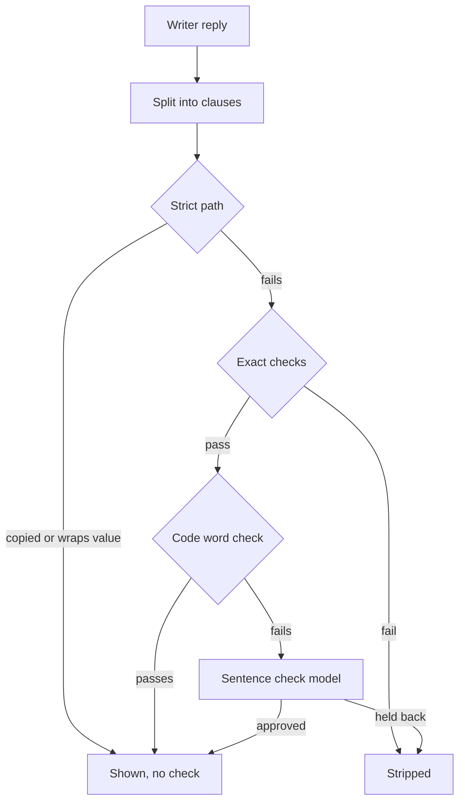

# Card 101 diagnosis: reworded sentences that skip the sentence check

Diagnosis only, 2026-10-06, on develop at 3d6947ff. Nothing in the repository was changed.

- The defect, in the user's words: a sentence the app writes in its own words can reach the screen without being checked against its paper.
- In card 101's fix round, run hb4 showed "For babies with severe bronchiolitis, use of a high-flow nasal cannula is becoming common [1]" where the paper says "children".
- The sentence was never among the sentence check's candidates.

## Table of contents

- [Short answer](#short-answer)
- [How the write step decides what reaches the screen](#how-the-write-step-decides-what-reaches-the-screen)
- [Every path to the screen](#every-path-to-the-screen)
- [The path the bronchiolitis sentence took](#the-path-the-bronchiolitis-sentence-took)
- [What the skip paths let through, proven offline](#what-the-skip-paths-let-through-proven-offline)
- [How often it happens](#how-often-it-happens)
- [What the check would say about today's code-approved sentences](#what-the-check-would-say-about-todays-code-approved-sentences)
- [Fix options](#fix-options)
- [Corrections to the fix round report](#corrections-to-the-fix-round-report)
- [Method, files and spend](#method-files-and-spend)

## Short answer

| Question | Answer |
|---|---|
| Which path | The code word check for reworded sentences, `synthesis_is_supported_by` (`synthesis/grounding.py:844-879`). It approved the sentence on its own, so `run_grounding_pass` never made it a candidate (`grounding.py:1367-1386`) |
| Why it passed | Every word of the sentence is in the writer's quote except "babies", and "babies" is in the person's question. The open part of the question licenses words (`grounding.py:877`), so code saw nothing new |
| Reproduced | Yes, offline from the recorded trace, no model call: the first grounding pass keeps the sentence as code-approved and sends exactly the two other sentences the trace shows to the check |
| How often unchecked rewording reaches the screen | 20 of 183 shown sentences (11%) in 52 locally traced answers; 7 of 43 (16%, inferred) in card 99's 13 deployed proof answers |
| How often it changed the record's meaning | 1 clear case (this one, a population swap) and 2 borderline cases among those 27 sentences plus 5 copied cuts. No hedge-dropping widening was found in the recorded answers, but offline probes show code would approve one |
| Recommended fix | Send every reworded sentence that passes code's exact checks to the sentence check, so code can hold a sentence back but never approve one on its own |

In the person's words: a sentence the app writes in its own words reaches you unchecked whenever every word it uses is in one of these:

- the paper's quoted words
- the paper's title
- your own question
- a short list of reporting words such as "usually", "most", "many", "people" and "may"

"Babies" came from your question.

## How the write step decides what reaches the screen

The write step grounds the writer's reply twice (`core/graph.py:9679-9760`, `_ground_with_sentence_check`).

- The first pass collects candidates.
- When there are any and at least 4 s of budget remain, one sentence check call judges them all, then a second pass accepts exactly the approved ones.
- The candidate list is filled at one place only, `grounding.py:1377-1397`, and only for a clause that failed the strict path, failed the code word check, and passed the exact checks.
- A clause that passes the strict path or the code word check never becomes a candidate, so card 99's pair check (the dropped-limit veto, `synthesis/sentence_check.py:46-55`) never sees it.

## Every path to the screen

| Path | What decides it is safe | Goes through `check_reworded_sentences` | Can "babies" for "children" fool it |
|---|---|---|---|
| P1. Copied record words (strict, claim inside the record) | `ground_claim`, normalized containment (`grounding.py:127-140`), numbers (`150-244`), and every content word from the record or the open question (`455-521`), at `1331-1344` | No | No: a swapped word breaks containment. But a copied cut can drop a limiting clause at either end (the capital-letter exemption, `1665`, lets a cut that starts mid-sentence through) |
| P2. Sentence that wraps a short record value (strict, record inside the claim) | The same three checks; the `b in a` direction of `ground_claim` (`140`) plus words licensed by the open question (`1321-1325`) | No | Yes, by the same licence: "Acute bronchiolitis is usually treated in babies" cited to a paper titled "Acute bronchiolitis." passes on code (probe below) |
| P3. Reworded sentence approved by code | Exact checks (`736-761`), then every stemmed content word in the quote, the cited record's title, its field name, the open question or `_SYNTHESIS_VOCABULARY` (`588-606`), at `844-879`; one-way subset test | No | Yes. This is the bronchiolitis path |
| P4. Reworded sentence approved by the model | The sentence check, item question and card 99's pair check (`sentence_check.py:706-769`), via `core/graph.py:9738-9760` | Yes | The check held it back in 3 of 3 runs |
| P5. Completeness repair reply | The same `_ground_with_sentence_check` (`core/graph.py:13136-13144`), so the same P1 to P4 split | P4 only | As P1 to P3 |
| P6. Structured fallback and the records list or tail | Code-built "field: value [n]" lines (`synthesis/findings.py:1057`) through the strict path (`core/graph.py:13213-13226`, `13318-13348`), shown as list items or table rows (`12247-12443`) | No | No: the text is the record's stored value |
| P7. Opening "I found N ..." sentence | Code-built from cited records, their count and the resolved entity mention (`synthesis/answer_layout.py:942`, `core/graph.py:11936-11951`, `13746-13754`); not grounded | No | No: it names records and counts, never a finding |
| P8. Headings | Model text, Researcher only, at most 8 words, no marker, every content word in a fixed topic list, any finding or the open question (`answer_layout.py:204-233`, `core/graph.py:12474-12482`) | No | In principle a question word can label a topic; a heading carries no citation and is not a claim |
| P9. Table cells and list labels | Record values and identifiers from the tool rows, chosen by code (`core/graph.py:12165-12174`, `12400-12431`) | No | No |
| P10. Notes, refusals, the medical-advice line | Fixed code strings (`core/graph.py:13653-13664`, `13689-13723`, `11912`) | No | No |
| P11. The ask-back question | Written by the guard tier as a question to the person (`core/graph.py:3688-3745`, shown at `12575`) | No | It asserts nothing about a record |

`drop_record_restatements` (`answer_layout.py:841-919`) and the sentence rules after grounding (`grounding.py:1467-1531`) only remove sentences, never add or reword one.

## The path the bronchiolitis sentence took

Recorded in run hb4 (branch arm; the branch differs from develop only in the writer prompt, so the grounding code is develop's).

| Step | What the trace shows |
|---|---|
| Writer's sentence | "For babies with severe bronchiolitis, use of a high-flow nasal cannula is becoming common [22#2]" |
| Its record sentence | "Use of a high-flow nasal cannula is becoming common for children with severe bronchiolitis." |
| First grounding pass | Kept 3 sentences; collected 2 candidates, neither of them this sentence |
| Sentence check | Judged the 2 candidates and approved neither |
| Completeness repair | Its reply grounded nothing and was not kept |
| Screen | The opening line, two copied record sentences and this sentence |

Offline replay on develop's code, from the recorded record text and narrative (the writer's quote for this sentence was not logged, so the record sentence was used; the candidates the replay produces match the trace exactly):

| Check | Result |
|---|---|
| Strict path (`ground_claim`) | Fails: not contiguous record text |
| Exact checks (quote in record, numbers, negation) | Pass |
| Code word check, question licensed (as shipped) | Pass: approved by code |
| Code word check, question not licensed | Fails: "babies" is the one word outside the quote |
| Full first pass | Strict, strict, code-approved; candidates are the "young children" and "Certain babies" sentences, as recorded |

So the sentence took P3, and the one thing that let it through is the question licence at `grounding.py:877`. The licence was written for the strict path (R-01, `grounding.py:1002-1115`) so a correct answer may restate the subject the person asked about. In the reworded path it lets the question's population replace the paper's.

## What the skip paths let through, proven offline

Synthetic record text and the bronchiolitis question, through the real `run_grounding_pass`, no model call (`diag101/probe_paths.py`).

| Probe | Path | Result |
|---|---|---|
| "For babies with severe bronchiolitis, ..." with the "children" quote | P3, question word | Shown, never checked |
| "Bronchiolitis is a self-limited disease in infants and children" from "... in healthy infants and children" | P3, dropped word | Shown, never checked |
| "Treatment is symptomatic" from "Treatment is usually symptomatic" (after a lead sentence citing the same record) | P3, dropped word | Shown, never checked |
| "In most people the drug often causes liver injury" from "In some patients the drug rarely causes liver injury" | P3, reporting-vocabulary swap | Shown, never checked |
| "Use of a high-flow nasal cannula is becoming common" | P1, copied cut dropping the tail limit | Shown, never checked |
| "The drug rarely causes liver injury" from "In some patients the drug ..." | P1, copied cut dropping the head limit | Shown, never checked |
| "Acute bronchiolitis is usually treated in babies" cited to the title | P2, question words around a title | Shown, never checked |
| Control: "In healthy babies and young children, ..." | Goes to the check, as designed | Candidate |

The P3 subset test is one way: it asks whether the sentence added a word, never whether it dropped one. Card 99's pair check exists to catch dropped limits, and it only runs on candidates.

## How often it happens

### Locally traced answers, exact

Every shown claim sentence (the opening "I found N" line excluded) in the traces that record candidates: 2026-10-05 wave 3 (card 89 branch and develop control, 30 answers), card 101's build (8) and card 101's fix round (14 answered). Script: `diag101/scan_unchecked.py`.

| Source | Answers | Shown | Checked by the model | Copied, whole record sentence | Copied cut | Name or identifier lines | Reworded, approved by code alone |
|---|---|---|---|---|---|---|---|
| 2026-10-05, card 89 branch | 15 | 62 | 51 | 2 | 0 | 0 | 9 |
| 2026-10-05, develop control | 15 | 43 | 24 | 5 | 3 | 3 | 8 |
| 2026-10-06, card 101 build | 8 | 42 | 34 | 2 | 0 | 4 | 2 |
| 2026-10-06, card 101 fix round | 14 | 36 | 19 | 13 | 2 | 1 | 1 |
| Total | 52 | 183 | 128 (70%) | 22 | 5 | 8 | 20 (11%) |

12 of 52 answers carried at least one reworded sentence approved by code alone. The 20 are 14 distinct sentences, each judged by hand against its record sentence:

| Sentence (shortened) | Times shown | What it left out or changed | Judgement |
|---|---|---|---|
| "GERD may cause erosive esophagitis, ..., a precursor to esophageal adenocarcinoma" (two wordings) | 7 | Drops the separate clause "affects quality of life and"; keeps "may" | Faithful |
| "These include defects in esophageal mucosal defense, ..." | 3 | Antecedent "Several factors contribute to GERD pathogenesis" was itself checked | Faithful |
| "The typical symptoms are heartburn and regurgitation ..." | 1 | Drops "of GERD" | Faithful |
| "GERD is a gastrointestinal motility disorder resulting from reflux ..." | 1 | Drops "resulting in symptoms or complications" | Faithful |
| "GERD is most effectively treated with proton-pump inhibitors" | 2 | Drops "is a clinical diagnosis and" | Faithful |
| "Clinical manifestations of GERD in young children are varied ..." (two wordings) | 2 | Keeps "young" | Faithful |
| "Different gene mutations cause different levels of enzyme deficiency, and acute hemolysis is caused by ..." | 1 | Joins two record sentences | Faithful |
| "Hemoglobinopathies are the most common single-gene disorders ..., and African, Asian, and Mediterranean populations are among the most affected" (two wordings) | 2 | Drops "and their descendants" (narrower, not wider) | Faithful |
| "There are 951 known variants involving the β-globin gene" | 1 | Drops the 1,424 total | Faithful |
| "There are 1,424 variants of human hemoglobin described, with 951 ..." | 1 | Adds a comma | Faithful |
| "For babies with severe bronchiolitis, use of a high-flow nasal cannula is becoming common" | 1 | "children" became the question's "babies" | Changed population |

The 5 copied cuts: 4 drop a separate clause or a parenthetical count and are faithful. One is borderline: "Deleterious variants were identified in 218 distinct genes" drops "Out of 176 solved families", the study cohort the count belongs to. The 8 name lines ("Publication pmid ... is included", trial names, "Is identified by PMID ...") state only that a record exists; one is an ungrammatical fragment.

### Card 99's deployed proof, by inference

13 answers from the deployed develop API (card 99 live proof), 43 shown sentences. These runs logged no quotes and no candidates, so each sentence was classified against its cited record's text from the local traces (`diag101/scan_deployed.py`): 36 carry a word code could not license, so they went through the check; 7 (16%) carry only words code could license, so code alone could have approved them.

| Sentence (shortened) | Judgement |
|---|---|
| "GERD may cause erosive esophagitis, ..." | Faithful |
| "Long-term use of proton-pump inhibitors is associated with bone fractures, ..." | Faithful |
| "GERD is a clinical diagnosis most effectively treated with proton-pump inhibitors [1], and clinical approaches include proton pump inhibitor trials as well as specific indications warranting referral" | Borderline: the second clause drops what the review's approaches are for, symptoms "potentially attributable" to GERD in primary care. This is the hedged primary-care sentence card 99 targets, reaching the screen by the path card 99 cannot see |
| "Management should target underlying aetiopathogenesis and limit complications" | Faithful |
| "Hemoglobin disorders are the most common single-gene disorders in humans, and ... are among the most affected" | Faithful |
| "Hemoglobin variants also affect Mediterranean populations, as ..." | Faithful |
| "A study of Hispanic patients in Texas found a β-globin chain variant in 67% ..." | Faithful (record partly outside the logged text; its number had to be in the quote) |

### What this means

- About one shown sentence in nine is reworded and was never read by the checker.
- Most of these are faithful, because the writer usually shortens a record sentence without changing it.
- 1 of 27 changed what the record says (hb4). 2 more are borderline. 1 of the 52 traced answers showed a clear change.
- No recorded hedge drop or frequency swap took this path, but the offline probes show code would approve one the moment the writer phrases it with quote words only. The danger grows with questions that name a population ("in babies", "in women", "in older adults"), because the question licenses that word.

## What the check would say about today's code-approved sentences

To size the recommended fix, the 13 distinct recorded sentences code approved (12 faithful, the "babies" one) and 5 crafted probes went through the shipped `check_reworded_sentences` in its classifier mode (item question plus card 99's pair check), each with its whole record sentence as the quote, which is what the check reads after card 89's widening. Three repetitions, `diag101/check_code_approved.py`.

| Group | Run 1 | Run 2 | Run 3 |
|---|---|---|---|
| 12 faithful recorded sentences approved | 10 | 12 | 10 |
| "For babies with severe bronchiolitis ..." | Held back | Held back | Held back |
| Probes: dropped "usually", dropped "healthy", "most people ... often", dropped tail limit | 4 held back | 4 held back | 4 held back |
| Probe: copied cut dropping "Out of 176 solved families" | Approved | Approved | Approved |

The faithful sentences held back at least once were "The typical symptoms are heartburn ..." (1 of 3), "In young children, clinical manifestations ..." (2 of 3) and the hemoglobinopathies sentence (1 of 3). The borderline primary-care clause was approved 3 of 3.

## Fix options

None was built. Each is stated from the reader's chair.

| Option | What the person would see | Size | Risk |
|---|---|---|---|
| A. Every reworded sentence that passes code's exact checks goes to the sentence check. Code can still hold a sentence back (exact checks first), never approve one alone | Every sentence in the app's own words has been read against its paper, including the dropped-limit check. "Babies" for "children" is held back; the faithful shortenings mostly still show | Small: the code-approved branch in `run_grounding_pass` (`grounding.py:1367-1386`) collects a candidate instead of accepting; tests that assert code acceptance change. No prompt change, no cache miss | Measured: 32 of 36 judgements kept the faithful sentences, so about 1 in 9 of these (about 1 in 80 shown sentences) would be lost. An answer whose write budget is under 4 s now drops these sentences instead of showing them unchecked. An answer that had no candidates gains one classifier call (about 0.3 s, well under a cent). More candidates per answer press on the pair-call cap card 99's adversary flagged for Researcher answers |
| B. Remove the question licence from the code word check only (`grounding.py:877`) | The "babies" shape goes to the check. Dropped "usually" or "healthy", and "most people ... often", still reach the screen unchecked | One line, plus a test | Low. Leaves the dropped-word and vocabulary-swap holes open |
| C. Make the code word check two way: code approves only a sentence that keeps every content word of its quote | Dropped words go to the check; faithful shortenings that drop a separate clause go to the check too | Medium; needs word-form matching | High: the owner had word-form matching reverted today after the judge and adversary findings; reopens that ground |
| D. Also send copied cuts that start or end inside a record sentence to the check | The "Out of 176 solved families" shape is judged | Medium | Low value now: the check approved that cut 3 of 3 |
| E. Stop the strict path licensing question words around a short record value (P2) | "Acute bronchiolitis is usually treated in babies" cited to a title is stripped | Medium | High: gene questions rely on restating the asked subject ("BRCA1 is associated with ..."), the R-01 and R-04 design. Seen 0 times in the recorded answers |

Recommendation: option A.

- It closes the bronchiolitis path and both of its siblings in one place, it reuses the check and the pair veto already shipped, and it only ever tightens what code accepts. Its cost is small and measured.
- Prove it the house way: five or more live runs each of the GERD, Mediterranean and bronchiolitis questions at plain language, counting sentences shown, sentences held back, "children" for "young children" and seconds per answer against develop.
- Option E is a real hole with no recorded case; it deserves its own card with a measurement first.
- Whether to accept losing about one faithful sentence in nine of this kind is the owner's call.

## Corrections to the fix round report

- hb4's third sentence is listed in `raw/fix/held_out_answers.txt` as "copied". It is reworded and was approved by code alone (P3).
- hb3's first sentence is listed as "reworded". It is a whole copied record sentence. The labelling script matched shown sentences to candidates by their first 60 characters, and a held-back candidate opened with the same 60 characters.
- hb1's fourth and hb2's second sentences are copied cuts, not whole record sentences. Both are faithful.

## Method, files and spend

| Item | Detail |
|---|---|
| Code read | `synthesis/grounding.py`, `synthesis/sentence_check.py`, `synthesis/answer_layout.py`, `synthesis/findings.py`, `core/graph.py` (`write_node`, `_write_answer`, `_ground_with_sentence_check`, `_answer_tokens`) on develop 3d6947ff |
| Replay of hb4 | `diag101/repro_hb4.py`, offline, no model call |
| Path probes | `diag101/probe_paths.py`, offline |
| Scan of traced answers | `diag101/scan_unchecked.py`, `scan_unchecked.txt`; judging aid `judge_aid.py`, `judge_aid.txt` |
| Scan of deployed answers | `diag101/scan_deployed.py`, `scan_deployed.txt` |
| Check on code-approved sentences | `diag101/check_code_approved.py`, `check_code_approved_1.jsonl` to `_3.jsonl` |
| Live answers run | None: the recorded trace was enough to reproduce, so no throwaway database was started |
| Spend | $0.0054: three repetitions of three sentence check calls each, $0.00179 a repetition. Limit $0.15 |
| Not covered | Researcher-depth answers beyond the wave 3 traces; the writer's own quote for each code-approved sentence was not logged, so the check measurement used whole record sentences, which is what the check reads after card 89's widening |

The `diag101` scripts and outputs sit in the session scratchpad beside this file, outside the repository, because they carry record text.
