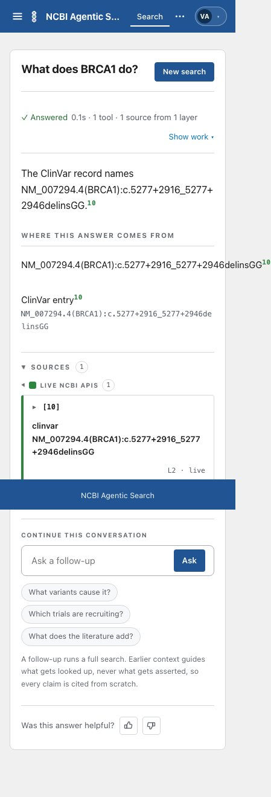
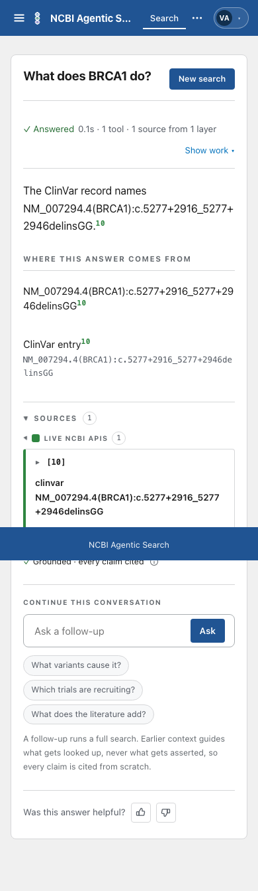
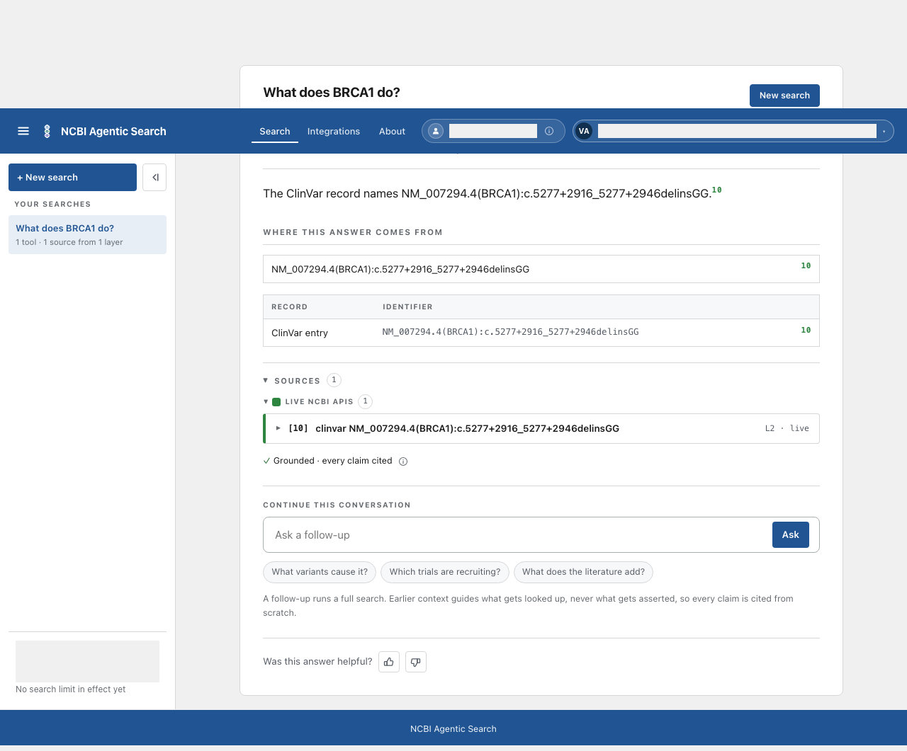
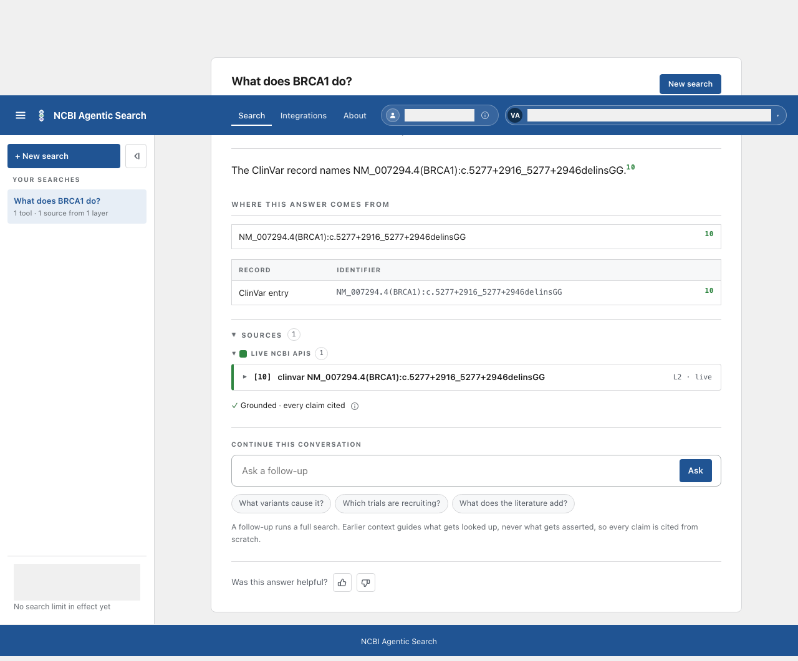

# Card 43: Long variant names on a phone

A long ClinVar variant name now wraps inside the answer at 390 pixels. The page no longer scrolls sideways, and citation 10 stays on screen. The 1280-pixel record remains one line.

## Table of contents

- [What changed](#what-changed)
- [Test evidence](#test-evidence)
- [Screenshots](#screenshots)
- [Checks](#checks)
- [Not covered](#not-covered)

## What changed

| File | Change |
|---|---|
| `frontend/src/components/screens/AnswerScreen.tsx` | Let phone prose, record names, identifier cells and Sources names wrap at the available width. Desktop layout is unchanged. |
| `frontend/e2e/long-variant-name.spec.ts` | Render the exact variant in a sentence, a phone record row, an identifier cell and the opened Sources list. Check both widths, marker position, row height, sideways scroll and accessibility. |
| This report folder | Keep screenshots of the baseline and fixed answer at 390 and 1280 pixels. |

Decision: use `overflow-wrap: anywhere` on phone text rather than `word-break: break-all`. Ordinary words stay intact; an identifier breaks only when it cannot fit.

Design gap: the prototype keeps identifiers on one line and scrolls its phone table inside the table box. The app renders phone records as stacked rows instead. The stacked record now wraps, using the prototype's own `overflow-wrap: anywhere` precedent. No design file or token changed.

## Test evidence

| Test | Without the fix | With the fix |
|---|---|---|
| 390-pixel long-name answer | The first run failed: the record name occupied one line instead of wrapping. Removing only the row text's `overflowWrap: "anywhere"` reproduced the same failure, `Expected: > 1, Received: 1`. | The record and identifier wrap, the sentence and Sources name remain in the answer, the page fits the viewport, citation 10 stays within 390 pixels, and the WCAG scan has zero violations. |
| 1280-pixel long-name answer | Passed on the baseline, including the one-line record assertion. Passed again with only the phone row wrap removed. | The table remains visible, the record remains one line, the page fits, and the WCAG scan has zero violations. |

The baseline screenshots use the same scripted event stream with the phone row wrap removed, matching the relevant `origin/develop` rule. All account labels in screenshots are masked.

## Screenshots

| Width | Baseline | Fixed |
|---|---|---|
| 390 |  |  |
| 1280 |  |  |

## Checks

| Command | Result |
|---|---|
| `cd frontend && npm run build && npm test && python3 ../.github/scripts/assert_license_notices.py dist` | Passed: build, 58 test files and 489 tests, license notices. The build reported its existing large-chunk warning. |
| `cd frontend && CI=1 npx playwright test e2e/long-variant-name.spec.ts e2e/accessibility.spec.ts --workers=1` with the main checkout's Python environment on PATH | Passed: 12 tests. Both long-name widths also ran a WCAG 2.1 AA axe scan. |
| `python3 tracker/check_doc_drift.py --check` | Passed: 2 facts computed, 0 stale, 0 structural. |
| `python3 .claude/skills/ship/scripts/check_public_leaks.py --base origin/develop` | Passed: 0 findings. The four screenshots were reviewed by eye because binary files are not fully scanned. |

## Not covered

- A live model answer or the deployed develop app. The browser test used scripted events and the fake-model backend, with no live model spend.
- The product owner's retest after merge.
