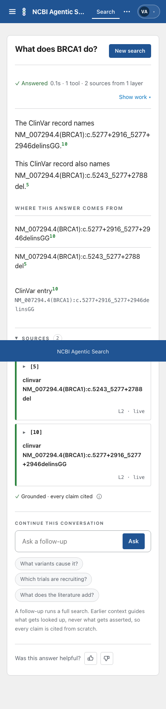
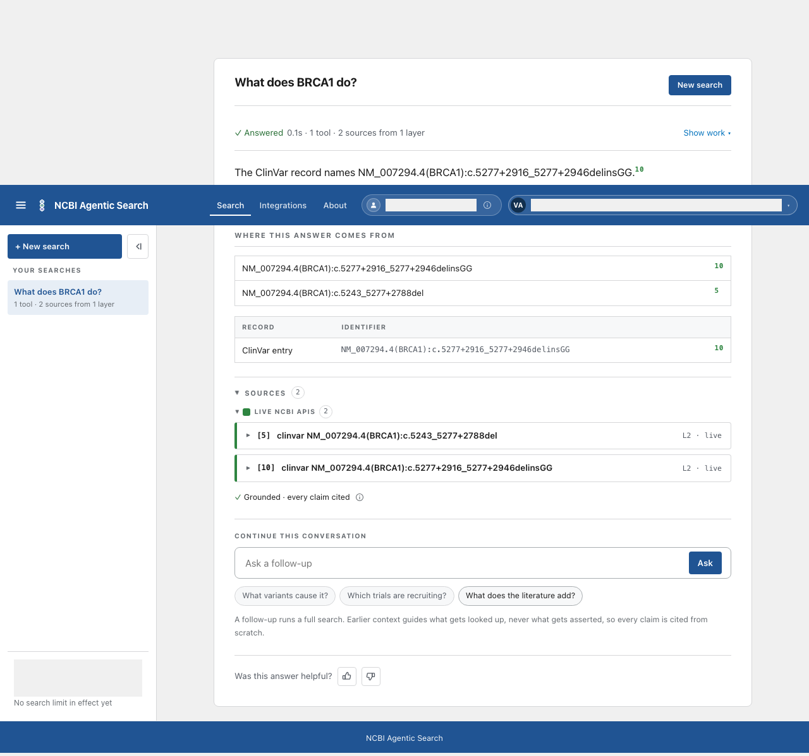

# Card 43b: Keep the citation number with the name

At 390 pixels, citation 5 now stays beside the last characters of the variant name instead of appearing alone on the next line. The longer name still wraps inside the record row, and the desktop table stays on one line.

## Table of contents

- [What changed](#what-changed)
- [Red and green evidence](#red-and-green-evidence)
- [Screenshots](#screenshots)
- [Checks](#checks)
- [Not covered](#not-covered)

## What changed

| File | Change |
|---|---|
| `frontend/src/components/screens/AnswerScreen.tsx` | Keep only the final three characters of a phone record name and its marker in one no-wrap span. The preceding name still uses `overflow-wrap: anywhere`. |
| `frontend/e2e/long-variant-name.spec.ts` | Add the shorter variant with citation 5 and assert the marker's top is above the bottom of the name's final characters at 390 pixels. Keep the existing long-name, width and accessibility assertions. Check the same case in prose. |
| `frontend/e2e/long-variant-name.spec.ts` and `frontend/e2e/tour-button-contrast.spec.ts` | Capture screenshots only with `FACTORY_SHOTS=1`, so normal CI runs do not rewrite committed images. |

Decision: keep a short tail with the marker, not the entire identifier. The full identifier must remain able to wrap without making the phone page wider.

## Red and green evidence

| Check | Before | After |
|---|---|---|
| Phone record row, citation 5 | Failed on develop: the name's last characters ended at 209.06 pixels and the marker started at 212.81 pixels, on the next line. | Passed with the final three characters and marker kept together. Removing that wrapper alone makes the same assertion fail. |
| Phone prose, citation 5 | The same geometry assertion passed without a prose change. | Still passed. Prose stays untouched. |
| Long variant and desktop table | The card 43 assertions were retained. | Passed at 390 and 1280 pixels, with zero axe violations. |
| Screenshot gating | The old specs wrote to committed image paths on every run. | A normal 14-test browser run left all committed screenshots unchanged. A separate `FACTORY_SHOTS=1` run wrote only the two images in this report folder. |

## Screenshots

| Phone, 390 pixels | Desktop, 1280 pixels |
|---|---|
|  |  |

Generated account labels were masked in both screenshots.

## Checks

| Command | Result |
|---|---|
| `cd frontend && npm run build && npm test && python3 ../.github/scripts/assert_license_notices.py dist` | Passed: build, 58 test files and 489 tests, license notices. The build reported its existing large-chunk warning. |
| `cd frontend && CI=1 npx playwright test e2e/long-variant-name.spec.ts e2e/tour-button-contrast.spec.ts e2e/accessibility.spec.ts --workers=1` with the main checkout's Python environment on PATH | Passed: 14 browser tests, including the long-name and tour accessibility scans. No tracked image changed. |
| `python3 tracker/check_doc_drift.py --check` | Passed: 2 facts computed, 0 stale and 0 structural findings. |
| `python3 .claude/skills/ship/scripts/check_public_leaks.py --base origin/develop` | Passed: 0 findings. Both screenshots were reviewed by eye. |

## Not covered

- A live model answer or the deployed develop app. The browser test used scripted events and the fake-model backend.
- A record row carrying many distinct citation numbers in one superscript.
- The product owner's post-merge retest.
