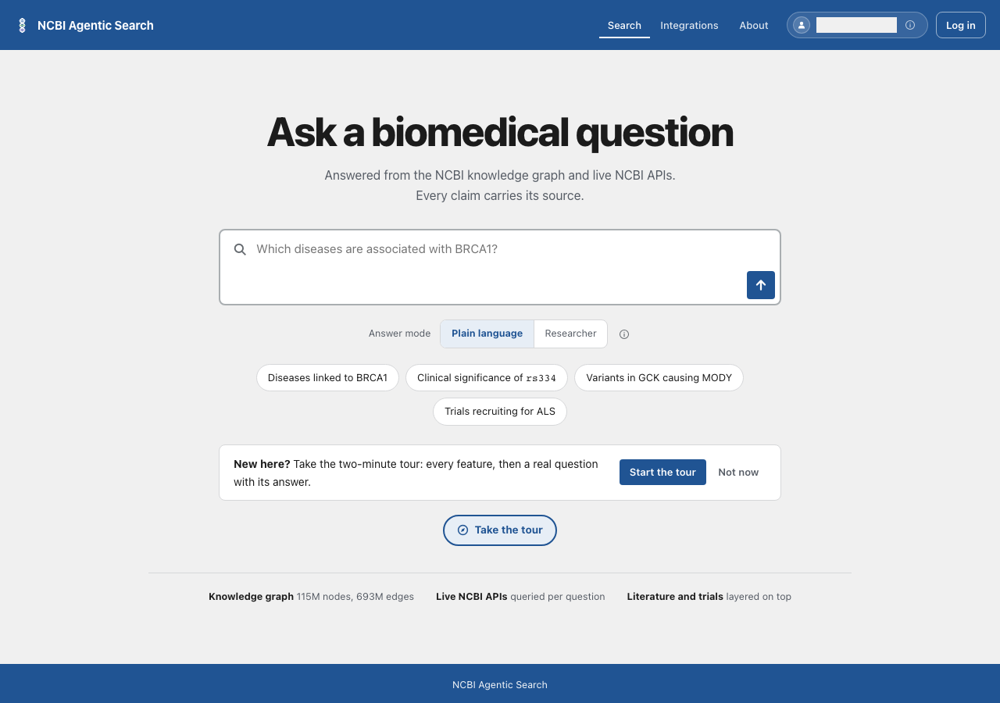

# Card 44: Two controls below the contrast minimum

The tour button now uses the existing blue token for both its text and border. Its hovered text passes the small-text contrast check at 390 and 1280 pixels. Card 43 has merged, and its long-name answer's layer 2 marker passes the 390-pixel accessibility scan without a marker colour change.

## Table of contents

- [Tour button](#tour-button)
- [Citation marker](#citation-marker)
- [Screenshots](#screenshots)
- [Checks](#checks)
- [Not covered](#not-covered)

## Tour button

| File | Change |
|---|---|
| `frontend/src/components/screens/HomeScreen.tsx` | Use `designTokens.blue` for text and border. Keep the white resting surface, existing wash on hover and existing navy focus ring. |
| `frontend/e2e/tour-button-contrast.spec.ts` | Hover the button at 390 and 1280 pixels with reduced motion, then run a scoped WCAG 2.1 AA axe scan. |

The baseline test failed at both widths: 4.39:1 for `link` text on `layer1Wash`, below the 4.5:1 minimum. Changing only the text token back from `blue` to `link`, while retaining the blue border, made both tests fail again. Restoring `blue` made them pass. The existing token measures 6.53:1 against the hover wash.

## Citation marker

After card 43 merged, `CI=1 npx playwright test e2e/long-variant-name.spec.ts --grep '390px' --workers=1` passed. The merged spec opens Sources, checks citation 10 stays inside the 390-pixel window and scans the complete long-name answer with WCAG 2.1 AA axe rules. It found zero violations, so the layer 2 marker is not flagged on the grey canvas in this case. No marker colour or surface change is needed.

## Screenshots

| Phone, 390 pixels | Desktop, 1280 pixels |
|---|---|
|  |  |

The screenshots mask the app's generated persona label.

## Checks

| Command | Result |
|---|---|
| `cd frontend && npm run build && npm test && python3 ../.github/scripts/assert_license_notices.py dist` | Passed: build, 58 test files and 489 tests, license notices. The build reported its existing large-chunk warning. |
| `cd frontend && CI=1 npx playwright test e2e/tour-button-contrast.spec.ts e2e/long-variant-name.spec.ts e2e/accessibility.spec.ts --workers=1` with the main checkout's Python environment on PATH | Passed: 14 browser tests, including the scoped tour scan at both widths and the merged long-name answer scan. |
| `cd frontend && CI=1 npx playwright test e2e/long-variant-name.spec.ts --grep '390px' --workers=1` with the same PATH | Passed: 1 browser test, including the long-name answer axe scan. |
| `python3 tracker/check_doc_drift.py --check` | Passed: 2 facts computed, 0 stale and 0 structural findings. |
| `python3 .claude/skills/ship/scripts/check_public_leaks.py --base origin/develop` | Passed: 0 findings. Both card 44 screenshots were reviewed by eye. |

## Not covered

- A live model answer or the deployed develop app. The browser tests used a fake-model backend, with no live model spend.
- The product owner's post-merge retest.
