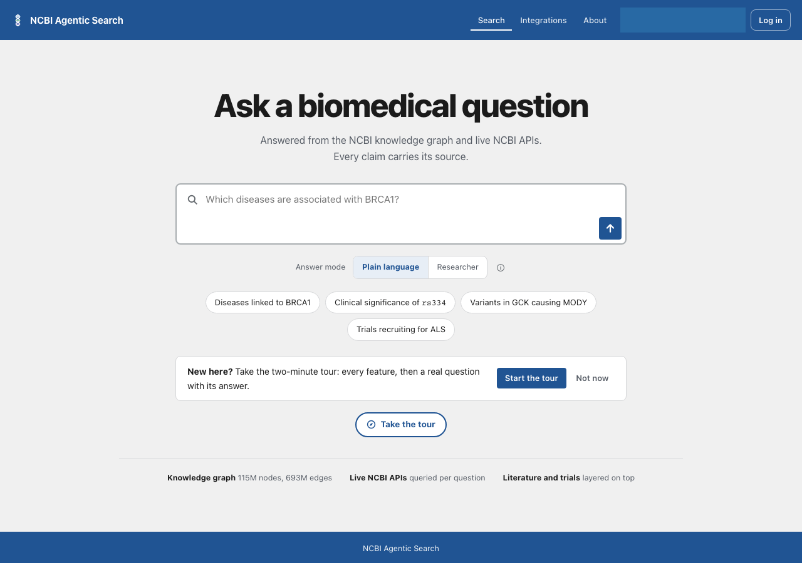
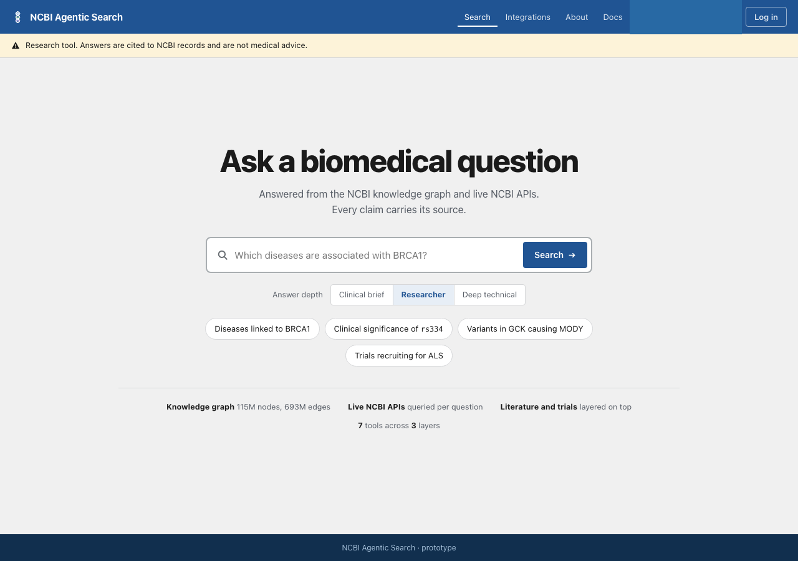
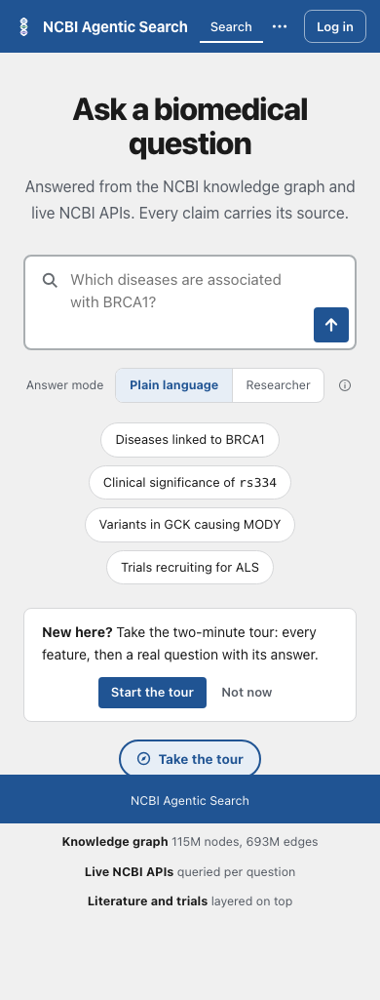
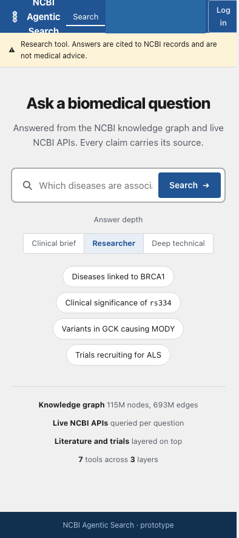

# Card 47: The prototype's light home page

The design prototype now shows the shipped light home page at desktop and phone widths. Its hero uses the canvas and ink tokens, the search bar has a visible border, and the white example chips stay centred on a phone.

## Table of contents

- [What changed](#what-changed)
- [Screenshots](#screenshots)
- [Checks](#checks)
- [Differences left in place](#differences-left-in-place)
- [Not covered](#not-covered)

## What changed

| File | Change |
|---|---|
| `docs/build/design/design-system/prototype/app.html` | Use the existing light canvas and ink tokens for the hero, subtitle, depth label and stats. Use `2px solid var(--line-strong)` on the white search bar. Make the chips white with ink text and a token border, keep them centred and wrapping at 390 pixels instead of stacking full width. |
| `docs/build/design/design-system/screens/home.html` | Use the canvas behind the home layout, white chips with ink text and the muted ink token on the stats line. Its search bar already had the right border. |

No new colour or product wording was added. The two design files are the only existing files changed.

## Screenshots

| Width | Shipped app | Updated prototype |
|---|---|---|
| 1280 |  |  |
| 390 |  |  |

The capture's generated persona labels were redacted from the screenshots before they were copied into this report. The unredacted temporary capture was removed.

## Checks

| Command | Result |
|---|---|
| `cd frontend && npm ci` | Passed from the committed lockfile, 0 vulnerabilities. |
| `cd frontend && node ../.claude/skills/verify/scripts/capture.mjs --spec ../.claude/skills/verify/specs/home_and_answer.json --target local --topic factory_card47` | The home screen passed reachability, no sideways scroll, zero console errors and zero serious or critical axe findings at both widths. The whole capture exited 1 because the unrelated answer screen logged duplicate-key warnings, 254 at 1280 and 264 at 390. No answer code was changed. |
| `python3 tracker/check_doc_drift.py --check` | Passed: 2 facts computed, 0 stale and 0 structural findings after the lead fixed the card 99 judge report on develop. The first attempt had failed on its missing `Verdict` table-of-contents entry. |
| `python3 .claude/skills/ship/scripts/check_public_leaks.py --base origin/develop` | Passed: 0 findings. The four screenshots were reviewed by eye. |

## Differences left in place

- The prototype offers three answer modes; the app offers two.
- The prototype has a one-line search bar with a Search button; the app has a two-line field with an arrow button, the product owner's existing decision.
- The prototype has no tour invitation. The app has an invitation and a Take the tour button.
- The prototype retains its warning strip, extra fourth stats item and older app-bar details. They are outside this card's approved home styling changes.
- The prototype's phone capture still reports 4 pixels of horizontal overflow from its unchanged chrome. The app's phone capture reports none.

## Not covered

- A live model answer or a product-code change. The capture ran the local app against the fake-model backend.
- Reworking the answer screen's duplicate-key warnings or the prototype's unchanged chrome.
- The product owner's visual retest after merge.
