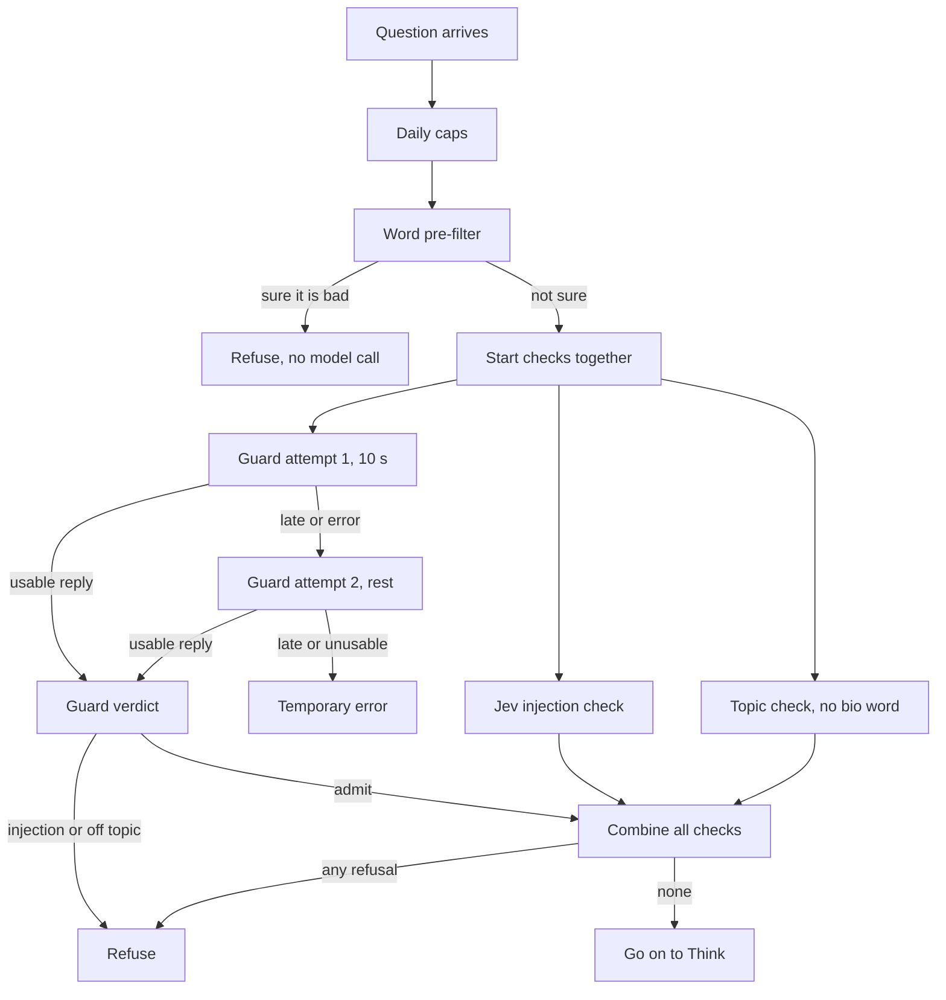
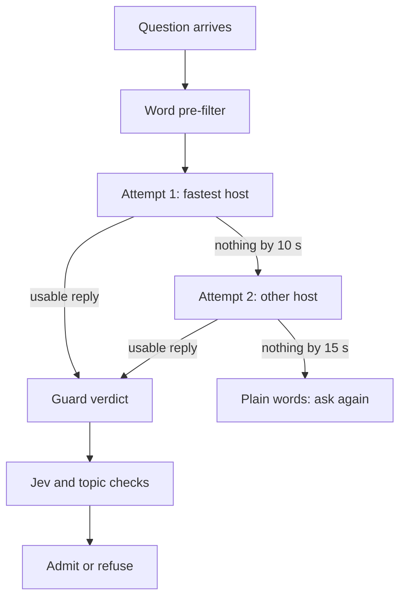

# Guardrail design: cards 72 and 84

Every question passes the guardrail before anything is searched. The guardrail asks the guard model whether the question is an injection attempt or off topic, and asks a fast classifier, Jev, as a second judge. This document is the one design for the guardrail's open problems, written for the product owner to approve or reject in one read.

It replaces two parked branches, `fix/card72-r10-guardrail` and `fix/card84-r10-sound-parts`. Everything worth keeping from them is described here, and the appendix accounts for every one of their 27 commits, so the lead can delete both branches once the owner has read this.

Written 2026-10-08 from develop at `17b2a721`, both branches' full diffs, card 72's diagnosis, both branches' builder, judge, adversary and verifier reports, the `DECISIONS.md` rows of 2026-09-26 to 2026-10-06 and `docs/architecture/Model_architecture.md`. No code was changed and nothing was run against a live service.

## Table of contents

- [In one minute](#in-one-minute)
- [1. The problem, as a person meets it](#1-the-problem-as-a-person-meets-it)
- [2. How the guardrail works on develop today](#2-how-the-guardrail-works-on-develop-today)
- [3. What the parked branches tried](#3-what-the-parked-branches-tried)
- [4. The proposed design](#4-the-proposed-design)
- [5. What the owner decides](#5-what-the-owner-decides)
- [Appendix: every commit on both branches](#appendix-every-commit-on-both-branches)

## In one minute

- The problem: in a slow spell at the guard model's upstream host, about 3 searches in 100 wait 15 seconds and then fail with "This run could not be completed. Try asking again in a moment." On a normal day it is close to none.
- The cause: both of the guardrail's attempts go to whichever upstream host the model router picks, so when that host stalls, the retry often stalls too. Jev, on a different endpoint, stays fast throughout.
- What failed before: two rebuilds on 2026-09-29. Each let a question through that develop refuses, because it let a second, faster reply decide, or because it gave up early under a rate limit and the topic check admits when it gets no answer.
- The proposal, in four steps:
  - Plain words on the failure screen.
  - The second attempt goes to a different upstream host, chosen from a week of the logs develop already writes.
  - The reviewed sound parts are rebuilt as one small change.
  - Everything else stays as develop has it.
- What it never does: admit a question without the guard model's verdict, race two replies, or let Jev admit on its own.
- Cost: no seconds added on a normal day, under three hundredths of a cent per question, and a slow-spell search passes at about 11 to 13 seconds instead of failing at 15.

## 1. The problem, as a person meets it

### A search that fails after 15 seconds

What a person sees: they type a question, the screen waits about 15 seconds, then shows "This run could not be completed. Try asking again in a moment." Nothing was searched. Asking again usually works.

| When | Source | What was measured |
|---|---|---|
| 2026-09-29, one 9 minute spell | Card 63's golden run, 150 searches | 4 of 150 searches failed this way (2.7%), each at 15.4 to 15.6 s. 11 of 150 first attempts ran past 10 s (7.3%); the other 7 recovered on the second attempt, finishing at 10.6 to 13.0 s |
| 2026-09-29, the same spell | The deployment's log | 3 more guard replies came back cut off, at 2, 9 and 60 characters, which the guardrail cannot read |
| 2026-09-26 evening | Two golden runs, 300 searches | 0 failures; worst guard call 9.0 s |
| 2026-09-25 and 2026-09-26 afternoon | Golden runs 8.2 and 8.6 | 1 failure in 150 each, under the older single 15 s attempt |
| 2026-10-05 | Six live questions on develop | 1 of 6 failed this way ("Which diseases are associated with CFTR?", 15.2 s) |
| 2026-10-05 | The per-call log lines develop now writes (#159) | Jev decided in 0.12 to 0.29 s; the guard model's topic check took 1.3 to 7.3 s across five upstream hosts |

How long a guard call takes when it works:

- The median is about 1.5 s, and it did not move on the bad day.
- On a normal evening, 95 in 100 calls finish within 3.3 to 4.6 s.
- In the 2026-09-29 spell, 95 in 100 finished within 10.6 s, past the first attempt's 10 s.
- Jev, called through the same account at the same moments, answered in 0.12 to 0.37 s every time.

### Wrong words on the failure screen

- A double timeout reads "Try asking again in a moment". The words do not say the problem was ours, and they read the same as every other failure.
- Two unreadable guard replies read "Try asking again, or rephrase the question". Rephrasing cannot help, because nothing was wrong with the question. Two first turns failed this way at 6.3 and 6.8 s on 2026-09-29 (cards 91 and 94, probably this cause, not confirmed).

### Questions let through that should not be

On develop today:

- Develop never admits a question without the guard model's verdict. When the guard model gives none, the search fails, whatever Jev said. This is the safe direction and the design keeps it.
- An off-topic question gets through only when the guard model misses it and the topic check then gets no answer at all (Jev fails and the guard model's fallback fails). The topic check admits in that case on purpose, since the guard model has already judged the question (build phase 8.2). No count of how often this happens exists.
- With Jev on, a server pause of about 0.76 s or more, landing while Jev is near its 3 s limit, can turn a question Jev judged on topic into an off-topic refusal (F-8.6-FA03). The review had to force both conditions at once to see it.

On the parked branches only, never on develop:

- Card 72's branch let an off-topic question through in a slow spell, because a second, faster reply decided before the refusal arrived (F-72-V08).
- Card 84's branch let an off-topic question through when the topic check met a rate limit and gave up (F-84-A07), and let a forged chat transcript through after a rate limit (F-84-A05).

### Why it happens

- The guard call goes through a model router that picks an upstream host for each request. Nothing in the request names a host.
- One host was slow in bursts. During the 2026-09-29 spell about 1 call in 13 took more than 10 s, while our own process was healthy: Jev, on the same server at the same moment, answered fast.
- The guardrail gives attempt 1 ten of its 15 seconds, cancels it, and gives attempt 2 the last five. Attempt 2 goes to whichever host the router picks next. In 4 of the 11 slow cases it was slow too.
- So the lever is not more time or more requests to the same place. It is a second request that lands somewhere else.

## 2. How the guardrail works on develop today

The rules behind the diagram, all in `src/system_03_search_agent/core/graph.py` (`guardrail_node`, `_guardrail_after_prefilter`) and `harness/decide.py` (`decide`):

- Budget: 15 s for the whole step, from the moment it starts, the owner's value (`_TIER_STEP_BUDGET_S["guard"]` in `harness/harness.py`).
- Attempt 1: two thirds of the budget, about 10 s (`_CLASSIFIER_FIRST_ATTEMPT_SHARE`, R-01). Each attempt is one `call_tier` call, which itself resends once at once after a passing error, and once without the reasoning setting if a model refuses it.
- Attempt 2: the rest, about 5 s. It starts at once after a timeout, 2 s after an error (`_CLASSIFIER_RETRY_BACKOFF_S`, R-05), or after the provider's stated wait when it fits; when the wait does not fit, the search ends at once.
- No verdict means no answer: two timeouts end in the transient error, two unreadable replies in the recoverable error. Jev's answer never replaces the guard verdict.
- Jev's injection check (with `CLASSIFIER_PROVIDER=jev`, develop's setting) can add a refusal and never remove one, because Jev admitted forged chat transcripts the guard model refused (`DECISIONS.md`, 2026-09-25 and 2026-09-26).
- The topic check runs only when the question has no word from the biomedical list. Jev answers it first, the guard model only if Jev fails. No answer at all admits, when the guard verdict admitted.
- Two set-asides: a guard "off topic" is set aside for a follow-up about a remembered subject, or when Jev's own topic pick says on topic.
- Logging: since #159 (2026-10-05) each guard and Jev call writes one line with its time, outcome and upstream host (`harness/call_log.py`), at WARNING on purpose so the data reaches the deployment's log.
- Rate limits: a rate-limited guard model can be sent four requests per guard call (two per attempt). No rate limit has been seen in any golden run or in the logs read so far.
- Jev's charges: a reply stating a usable cost is charged that cost, so a stated $0 is charged $0; a reply stating no cost is charged the $0.01 ceiling. The owner's rule of 2026-09-29 (a $0.0001 floor, never $0) was built on both branches and never reached develop.

## 3. What the parked branches tried

### R-10, the ticket both branches carried

R-10 (`tracker/phase_8.6.md`, 2026-09-26) collected eight review flags into four promises:

1. Jev says when it failed, and the guardrail acts on that, never on the clock (FA03).
2. A guard model that answers inside 15 s on its second attempt admits the question, whatever the first cost (FJ11).
3. Every Jev reply that reached the provider is charged (FJ01, FA01, FJ03), amended by the owner on 2026-09-29 to a $0.0001 floor.
4. A rate-limited guard model gets at most two requests, and its stated wait is honoured and told to the person (FJ04, FA02, FA05).

Where each ends in this design: promise 1 is kept (step 3b). Promise 2 stays open, as the lead decided on 2026-09-29: closing it loses a quick error followed by a hang, which develop answers. Promise 3 is kept with the owner's floor (step 3a). Promise 4 is dropped until a rate limit is actually seen (step 4), because both attempts at it admitted questions develop refuses.

### Card 72's branch: a hedged second request

`fix/card72-r10-guardrail`, 14 commits, parked at `1961518c` on 2026-09-29.

What it tried:

- R-10's four promises, plus card 72's fix: if the guard call has not answered by 4 s, send a second request without cancelling the first, and let the first usable reply decide.
- After the judge and adversary, the fix round moved the hedge to 10 s, made the stricter reply win when both were in hand, sent the topic check through the same hedged path, and timed every second request after an error to match develop's last request.

What worked, verified by the fresh verifier:

- The stricter-reply rule held in 112 orderings when both replies were in hand.
- Jev's charges followed the owner's floor at every site, and a reply-shape drift cost $0.00024 a question instead of $0.02.
- The pause fix held for pauses up to 2 s anywhere in Jev's wait.
- A guard model that cannot turn reasoning off still screened.
- The web app said "about 20 seconds" for a stated wait.
- The new log line carried no key and no question.

Why it stopped: the verifier's verdict was do not merge. F-72-V08 let an off-topic question through, and F-72-V06 made a person wait 4 to 5 s longer after one failed request; both sat inside the fix round's own change. The owner parked it (`DECISIONS.md`, 2026-09-29).

| Finding | What went wrong, in plain words | Where it ended |
|---|---|---|
| F-72-J01 | When both replies landed together, the lower-numbered one decided, so an injection verdict already in hand could be ignored | Fixed: the stricter reply wins; see V01 |
| F-72-J02 | A usable Jev reply stating $0 was charged $0, invisible to the cost cap | Fixed by the owner's $0.0001 floor |
| F-72-J03 | A 0.6 s server pause one step later than the test placed it still turned Jev's on-topic answer into a refusal | Fixed up to a 2 s pause |
| F-72-J04 | The wait message could read "about 1 seconds, not straight away" | Fixed, a small wording residual |
| F-72-J05 | A rate-limited guard model still got four requests for a question with no biomedical word | Fixed per call; four per question remained |
| F-72-J06 | No test caught an unreadable fast reply ending the wait for a good slow one | Test added |
| F-72-J07 | No test caught the guardrail ignoring Jev's failure signal mid-wait, which makes a refusal 5 s slower | Test added |
| F-72-J08 | Holding a call to one request also dropped the resend a model that cannot turn reasoning off needs, so every search would fail at once with such a guard model | Fixed |
| F-72-J09 | An unreadable Jev reply could push a question past its cost cap by about a cent | Fixed except the sentence check, up to 0.7 cents |
| F-72-J10 | Taking the faster of two replies may lean the front door toward admitting, if admissions come back quicker | Open, not measurable with stubs |
| F-72-J11 | A code comment named the wrong Jev charge | Fixed |
| F-72-A01 | The web app ignored the new "wait N seconds" words and still said "in a moment" | Fixed for a stated wait; see V05 |
| F-72-A02 | A question with no biomedical word still waited the full 15 s in a slow spell | Fixed, and that fix caused V08 |
| F-72-A03 | A change in Jev's reply shape would charge about 7 cents a question, pausing every search at the $25 daily cap after a few hundred questions | Fixed by the owner's floor |
| F-72-A04 | The 4 s hedge lost searches in a 4 to 10 s stall that develop answered at 10.6 s, because both requests went out inside the stall | Fixed by moving the hedge to 10 s |
| F-72-A05 | A hedge sent with under a second left was charged as a full request | Fixed |
| F-72-V01 | "A refusal in hand always wins" held only if the refusal finished within four event-loop passes of the admission | Open |
| F-72-V02 | Two Jev calls checked at the same moment could each pass the cost cap by about a cent | Open |
| F-72-V03 | A Jev error reply (500, 429, 402) was charged $0, against the owner's "never $0" | Open; card 84 fixed it |
| F-72-V04 | The debugging guide stated the wrong Jev charge rule | Open |
| F-72-V05 | The web app still said "in a moment" when no wait was named, and a long wait read as "about 86400 seconds" | Open |
| F-72-V06 | After one guard request failed slowly, a person waited 4 to 5 s longer than on develop | Inside the fix; one reason to stop |
| F-72-V07 | The same 2 to 5 s delay at every Think and Plan decision after one failed request | Open |
| F-72-V08 | In a slow spell the topic check's hedge admitted an off-topic question develop refused, because the faster "on topic" decided before the slower "off topic" arrived | Inside the fix; the main reason to stop |

### Card 84's branch: R-10's sound parts on their own

`fix/card84-r10-sound-parts`, 13 commits, parked at `5a0adc02` on 2026-09-29.

What it tried:

- R-10 without any hedge: one request at a time, never two replies racing.
- It reused card 72's charge rule, pause fix and web app words.
- At first it capped every guard call at two requests. The lead corrected that the same day: develop's retries stay exactly for every failure except a rate limit, and only a rate-limited call is held to two requests.
- It added the reserve-before-you-call cost check for Jev, and charged Jev error replies the floor.

What worked, verified by its own adversary on an independent grid:

- With a normal guard model, 0 of 5,832 failure shapes without a rate limit differed from develop, in verdict, time or requests.
- The topic check was identical to develop in every case without a rate limit.
- The yardstick, a copy of develop's guard policy, matched develop's real code in 10,306 of 10,306 cases and 280 of 280 topic-check cases.
- The pause fix held up to about 2 s.
- The log line carried no key and no question of ours.

Why it stopped: the adversary found two admissions develop refuses, both after a rate limit (F-84-A05, F-84-A07). It was the third guardrail attempt of the day to do so, and the owner stopped it before a fix round, ruling that guardrail work returns only as a design agreed first (`DECISIONS.md`, 2026-09-29).

| Finding | What went wrong, in plain words | Where it ended |
|---|---|---|
| F-84-J01 | With a guard model that cannot turn reasoning off, every resend paid one extra refused request and answered later than develop | Open |
| F-84-J02 | A second rate limit naming no wait told the person the service "was busy a moment ago, try the query again", while it was still refusing | Open, same as A01 |
| F-84-J03 | "At most two requests after a rate limit" meant "none after the second"; a call rate-limited on its fourth request had already sent four | Open, a reading for the owner |
| F-84-J04 | An unreadable Jev reply stating a sensible cost was charged the floor, not what it stated, against the owner's words | Open |
| F-84-J05 | Reserving Jev's full one-cent ceiling before each call meant that from $0.09 of a $0.10 question, Jev was never asked | Open, see A03 |
| F-84-J06 | A guard call charged while a Jev call was in flight could still pass the cost cap | Open |
| F-84-J07 | The log line wrote up to 64 characters of whatever the upstream host put in its name field, a key-shaped string included | Open; develop's #159 line does the same today |
| F-84-A01 | Same as J02, found separately | Open |
| F-84-A02 | A long stated wait read as "about 86400 seconds", and a year-long wait was cut to a day without saying so | Open |
| F-84-A03 | Near the cost cap the sentence check approved nothing, so answers lost checked sentences develop kept | Inside the fix |
| F-84-A04 | With a guard model that cannot turn reasoning off, 15 of 5,832 cases changed outcome against develop | Open |
| F-84-A05 | After a rate limit, a 12 s admission that develop throws away decided, so a forged chat transcript develop refused was admitted | Inside the fix; one reason to stop |
| F-84-A06 | A Jev reply stating more than a cent was charged $0.0001, so the more a reply said it cost, the less was counted | Inside the fix |
| F-84-A07 | A rate limit whose wait did not fit ended the topic check with no pick, which admits, so "what is the best pizza in Chicago" was answered | Inside the fix; the other reason to stop |
| F-84-A08 | Every healthy guard call wrote a WARNING line | Open; develop's #159 line does this today, on purpose, for data |
| F-84-A09 | The web app could not tell "the wait has passed" from "no wait was named", and told every passing failure to wait | Inside the fix |

### What the two attempts teach

- Letting a second reply decide is what admits. Whenever a faster reply can decide while a slower one is still coming, some question develop refuses gets through (V08), or the front door leans one way (J10). The design lets one reply decide, as develop does.
- Giving up early is also admitting, on the topic check, because no answer there admits. A07 came from a rate-limit rule, not from a race. The design leaves the topic check exactly as develop has it.
- Building for a failure never seen bought two unsafe paths. Both rate-limit admissions (A05, A07) came from R-10's promise 4, and no rate limit has been seen.
- Splitting one model call into separate requests loses what the harness does inside one call: the resend without the reasoning setting (J08, F-84-J01, A04). The design keeps each attempt as one `call_tier` call.
- The right proof is a sweep against develop's own code: card 84's yardstick checked thousands of failure shapes case for case, and it is what found and bounded every timing trade. The design keeps it as the gate.
- Speed and "never lose what develop answers" pull against each other inside one host: no timing of two requests to the same stalled host wins every stall (A04, V06). Only a second host changes that.

## 4. The proposed design

### Rules every step keeps

- No question is admitted without the guard model's own verdict.
- One reply decides each attempt, as on develop. No two replies race.
- Jev can add a refusal and never remove one.
- The topic check, its fail-open rule and the 15 s budget stay as they are.
- Nothing develop answers today is lost, proved by the sweep against develop's code before anything ships.

### The steps at a glance

| Step | What changes | What a person sees | Seconds | Money per question | Risk | Recommend |
|---|---|---|---|---|---|---|
| 1 | Plain words when the guardrail fails | "We could not finish checking your question, so nothing was searched. This was a problem on our side, not with your question. Try asking again." | None | None | Low: web app copy, no contract change | Yes |
| 2 | Attempt 2 goes to a different upstream host; attempt 1 to the fastest, both picked from a week of logs | In a slow spell on one host, the search passes at about 11 to 13 s instead of failing at 15 | None on a normal day; may be faster if the fastest host is slower than the router's pick today | Under three hundredths of a cent either way; hosts may differ in price | Low: same model, same prompt, one reply decides | Yes |
| 3 | Rebuild the reviewed sound parts: Jev charges, the pause fix, log clean-up, test tools | Nothing in a normal answer; no refused on-topic question after a pause; honest cost counts | None | At most $0.0001 per Jev reply that states $0 or is unreadable | Low: each part passed review on both branches | Yes |
| 4 | Keep develop's topic check and rate-limit handling unchanged | What they see today | None | None | None new | Yes |

### Step 1: plain words when the guardrail fails

- What changes: the web app shows its own fixed words for any failure whose source is the guardrail, both the double timeout and two unreadable replies. It already receives `source` and `retry_after_s` on every error, so no event or contract changes. It still never shows backend text (F-4.8-A-15).
- Words: "We could not finish checking your question, so nothing was searched. This was a problem on our side, not with your question. Try asking again."
- For a rate limit that named a wait: "Try asking again in about 20 seconds", in minutes past two minutes, and the plain words when the wait has passed or none was named. This keeps card 72's web app work (`7c028486`) and card 84's (`d5f091e9`), with V05, F-84-A01, A02 and A09 fixed: only guardrail failures change, never every passing failure.
- What a person sees: the same 15 s wait in a slow spell, but words that say what happened and what to do.
- Cost: nothing in seconds or money. Risk: low.
- Files: `frontend/src/hooks/useRunView.ts` (`FATAL_COPY` and the branch on `source`), and its test, as in `useRunView.retryAfter.test.ts` on both branches.

### Step 2: the second attempt goes to a different upstream host

- What changes: the router accepts a preferred order of upstream hosts per request. Attempt 1 asks for the fastest host and attempt 2 for a different one, each with the router's own fallback on errors. Same model, prompt, budget and 10 s cut, and still two attempts with one reply deciding each.
- How the hosts are picked: from a week of the #159 log lines, by each host's median time, its 95th percentile and its count of calls over 10 s. Today's sample has five hosts at 1.3 to 7.3 s, too little to rank.
- What a person sees: in a slow spell on one host, attempt 2 lands on a healthy host. The 7 recoveries on 2026-09-29 finished 0.6 to 3.0 s after the cut, so a search that fails at 15 s today should pass at about 11 to 13 s. On a normal day nothing changes, or attempt 1 gets a little faster.
- Seconds: none added. Money: the same number of requests; at the guard model's price a call costs about $0.0001 to $0.0003, so a host at twice the price adds under three hundredths of a cent a question.
- Risk: low on safety, since the verdict path is untouched. Two unknowns, each checked before building:
  - Whether the router honours a host order per request, as the diagnosis's option D assumed. If not, attempt 2 cannot be steered, and the fallback is pinning one fast host for both attempts, which helps less.
  - Whether a stall is per host. The logs show the host only for calls that answered; a call cut at 10 s names none. The week of logs must show the slow calls cluster on one host.
- It is the owner's decision because it chooses providers and can change price (diagnosis, option D).
- Proof before merge:
  - The sweep against develop's code, extended with a host per request: no case develop answers is lost or later.
  - The test queries document, run by the team.
  - Five repeated live runs of a guard-heavy question.
  - A golden run, as an alarm only.
- Files: `harness/harness.py` (`call_tier`, a host-order argument), `core/graph.py` (`_guardrail_after_prefilter`, the order per attempt) and a ranking script over the log lines.

### Step 3: rebuild the reviewed sound parts

Develop's guardrail has had 39 commits in these files since the branches were cut, card 72's log lines among them, so none of these commits applies cleanly. Each part is rebuilt from this description in one change, with its tests.

#### 3a. Jev's charges, the owner's rule of 2026-09-29

- Rule: a Jev reply that came back is charged the cost it states, when that is above $0 and at most $0.01. A stated $0, no stated cost or an unreadable amount is charged the $0.0001 floor. A stated cost above $0.01 is charged the $0.01 ceiling, not the floor (fixes F-84-A06). An error reply (500, 429, 402) is charged the floor. A timeout, where no reply came, is charged nothing.
- Usable or unreadable makes no difference to the charge, as the owner's words say (fixes F-84-J04).
- Why now: develop today charges the $0.01 ceiling for a Jev reply that states no cost. If Jev's reply format dropped its cost field, each question would carry about 7 cents of charges, and develop's $25 daily cap would stop every search after about 350 questions (F-72-A03).
- Not kept: the reserve-the-ceiling cost check (`1e1aab4a`), because near the cap it drops checked sentences from answers (F-84-A03). The cost cap check before a Jev call stays as develop has it, so a Jev charge can pass a question's cap by under one cent (F-72-J09, V02, F-84-J06). Question 6 asks the owner to accept that.
- Files: `harness/jev_client.py` (`jev_charge_usd`, `JEV_FLOOR_COST_USD`, `_unusable_reply`), the three charge sites (`core/graph.py` `_jev_injection_pick`, `harness/decide.py`, `synthesis/sentence_check.py`), and the debugging guide's `jev_client` row. From `ea7be3f0`, `ec1984b3` and `c863f226`.
- Cost: at most $0.0001 per Jev reply that states $0 or is unreadable.

#### 3b. Jev says when it failed, and a server pause no longer refuses (R-10 promise 1, FA03)

- What changes: `decide()` tells the guardrail the moment Jev fails (`jev_failed`), and the guardrail waits on that signal, not on a clock. Jev's own clocks count only time the server was free to run, up to 2 s of pause (`wait_counting_free_time`, `JEV_STALL_ALLOWANCE_S`).
- What a person sees: an on-topic question Jev admits is no longer refused because the server paused, and an off-topic refusal after Jev fails arrives when Jev fails, not up to 5 s later (F-72-J07).
- Residual, named: a pause over 2 s still ends Jev's clock and refuses, as both reviews confirmed.
- Files: `harness/decide.py`, `harness/jev_client.py`, `core/graph.py` (`_await_jev_own_pick`), with the six stall arms and the mid-wait test in `tests/system_03_search_agent/guardrail/test_followup_guardrail.py`. From `c2ee7f3d` (the fullest version), `dc1ab2bd`, `ea7be3f0` and `a186b558`.
- Cost: nothing in seconds or money.

#### 3c. The log line keeps only what a host name needs

- What changes: `provider_of` in `harness/call_log.py` keeps only letters, digits, dots, hyphens and spaces from the upstream's name field (fixes F-84-J07 on develop). Once step 2's ranking is done, the line drops from WARNING to INFO, as its own docstring plans (F-84-A08).
- Cost: nothing. A person sees nothing.

#### 3d. The test tools that made the reviews possible

- A virtual clock, so a 15 s timing test runs in milliseconds: `tests/system_03_search_agent/virtual_clock.py`, from `c263c159` and `c2ee7f3d`.
- The sweep against develop: a line-for-line copy of develop's guard policy, checked case for case against develop's real code, then every new policy run over the same thousands of failure shapes. It reports any case develop answers that the new policy loses, answers later or answers differently, any two requests in flight, and any search past 15 s. From `test_guard_request_dominance.py` in `c263c159`, `f5b06193` and `3e33c995`. It is step 2's gate.

### Step 4: keep develop's topic check and rate-limit handling

- What stays: the topic check's single guard request, its fail-open rule, and develop's rate-limit handling: the stated wait honoured when it fits, the search ended when it does not.
- Why: every admission the reviews found on the branches (V08, A05, A07) came from changing one of these two. No rate limit has been seen in any golden run or log read so far.
- What a person sees: what they see today. A rate-limited guard model can still be sent four requests per guard call (FJ04), named and accepted until a rate limit is seen.
- Cost: nothing.

### Options weighed and not recommended

| Option | What a person would see | Seconds | Money per question | Risk | Verdict |
|---|---|---|---|---|---|
| Early hedge: a second request at 4 s, first usable reply wins (card 72) | In a slow spell, past the guardrail in 4 to 7 s | Faster in short stalls; searches lost in 4 to 10 s stalls (A04) | About $0.0003 extra on 3 to 15 in 100 questions | An off-topic question develop refuses gets through (V08), and admissions may be favoured (J10) | No |
| Hedge where any refusal wins, so every reply is awaited | No faster for questions that pass, since the slow reply is still awaited; only refusals come sooner | No gain | About $0.0003 extra on the hedged questions | Two replies in flight bring back the tick-order faults (J01, V01) | No: costs without a gain |
| Keep listening to attempt 1 after the 10 s cut, any refusal winning | Rescues a search when attempt 1 would answer between 10 and 15 s | None added | About the same | Two replies in flight again; the benefit is unmeasured, since a cut call is never seen to finish | Not now |
| Cut attempt 1 earlier, at about 6 s, once step 2 is live | Slow-spell searches pass at about 7 to 9 s | Faster in a spell; up to 0.5 s slower for a call that would have answered at 6 to 10 s | About $0.0003 on the 1 to 5 in 100 normal questions over 6 s | Low once attempt 2 goes elsewhere | Later, on step 2's data |
| Jev decides alone when the guard model times out | No failed searches in a slow spell | Fastest: Jev answers in under 0.4 s | None | A disguised injection Jev misses goes through: Jev admitted forged chat transcripts the guard model refused; the 2026-09-25 and 2026-09-26 decisions forbid it | No |
| Raise the budget to 20 s | Fewer failures, but up to 20 s of spinner before anything happens | Up to 5 s more | None | Uses the whole 20 s answer target on the guardrail | No |
| Change the guard model | Possibly faster everywhere | Unknown | New price | A new injection bench and re-measurement; the largest change for a tail problem | Not now |
| Cap a rate-limited guard at two requests (R-10 promise 4) | A wait named in seconds instead of four quick retries | Can lose searches develop answers (630 of the 1,068 rate-limited cases develop answered in card 84's sweep) | Saves requests under a rate limit | Two admissions develop refuses (A05, A07) | No, until a rate limit is seen |

### Order of work

1. Step 1 and step 3, now, one change each, under the usual review for guardrail code. Neither needs data.
2. Step 2's two checks: the router's per-request host order, and a week of log lines grouped by host.
3. Step 2, built and proved by the sweep, the test queries document and five live runs.
4. Then, on step 2's data, the earlier cut.

## 5. What the owner decides

Each question is yes or no, the recommendation first.

1. Recommend yes. Show plain words when the guardrail fails: "We could not finish checking your question, so nothing was searched. This was a problem on our side, not with your question. Try asking again." Yes costs nothing; no keeps "Try asking again in a moment" and "rephrase the question".
2. Recommend yes. Send attempt 1 to the fastest upstream host and attempt 2 to a different one, picked by the lead from a week of logs. Yes may change the guard call's price by under three hundredths of a cent a question; no keeps about 3 failed searches in 100 during a slow spell.
3. Recommend yes. Keep the rule that Jev never admits a question on its own, even when the guard model times out. Yes keeps today's failures in a slow spell; no ends them but lets through disguised injections Jev misses.
4. Recommend yes. Drop the early hedge and the two-request rate-limit cap for good, and leave the topic check and rate-limit handling as develop has them. Yes keeps today's behaviour; no means a fourth attempt at a race or cap that admitted questions three times.
5. Recommend yes. Rebuild the reviewed sound parts as one small change: the owner's Jev charge rule, the pause fix, the log clean-up and the test tools. Yes costs at most $0.0001 per odd Jev reply; no leaves develop exposed to a Jev format change pausing all searches.
6. Recommend yes. Accept that a Jev charge can take a question past its cost cap by under one cent, so answers near the cap keep their checked sentences. Yes keeps today's check; no drops checked sentences from answers near the cap (F-84-A03).
7. Recommend yes. Copy the eight review reports from the branches into this design's folder on develop, then delete both branches. Yes keeps the full evidence for every finding named here at no cost; no leaves only the one-line summaries in section 3.

## Appendix: every commit on both branches

Develop's guard files have moved 39 commits since both branches were cut, so nothing here is cherry-picked; what is kept is rebuilt from the step named. Review reports are kept as summarised in section 3, and in full if question 7 is a yes.

### `fix/card72-r10-guardrail`, 14 commits, oldest first

| Commit | Subject | Kept in this design as, or not needed because |
|---|---|---|
| `29b53b0c` | fix(harness): every Jev reply that cannot be used is charged one cent, and the log says so | Not needed: its one-cent charge was replaced by the owner's $0.0001 floor; the charge rule it began is kept as step 3a |
| `dc1ab2bd` | fix(guardrail): a question Jev judges on topic is no longer refused because the server paused | Kept as step 3b, the Jev failure signal (`harness/decide.py` `decide(..., jev_failed=)`, `core/graph.py` `_await_jev_own_pick`) |
| `4449b74a` | fix(harness): a model call can be limited to one request, and names the host that answered | Not needed: develop already logs the host (#159, `harness/call_log.py`), and the design keeps each attempt as one `call_tier` call, so a one-request limit has no use; the lesson is in "What the two attempts teach" |
| `26a47145` | fix(guardrail): a slow screening call gets a second request at 4 s instead of failing the search | Not needed: the early hedge is rejected (options table, F-72-A04, V08) |
| `78b12c84` | docs: the debugging guide says an unusable Jev reply is charged one cent | Not needed: the line is rewritten with step 3a |
| `9e08d1d0` | docs: R-10 and card 72's builder report | Kept as section 3's summary; the file in full if question 7 is a yes |
| `ac3a471f` | fix(harness): a guard model that cannot turn reasoning off still screens every question | Not needed: it repaired the one-request limit the design does not use; the lesson (keep the reasoning resend inside one call) is in "What the two attempts teach" |
| `ea7be3f0` | fix(harness): a Jev reply is never charged $0 or a whole cent, and a server stall no longer times Jev out | Kept as step 3a (`harness/jev_client.py` `jev_charge_usd`, `JEV_FLOOR_COST_USD`) and step 3b (`wait_counting_free_time`); its ceiling-priced cost check (`check_jev_per_query_cap`) is not kept, per question 6 |
| `c263c159` | fix(guardrail): no search develop answered is lost to the hedge, and a refusal in hand always wins | Kept as step 3d, the virtual clock (`tests/system_03_search_agent/virtual_clock.py`) and the sweep (`test_guard_request_dominance.py`); its hedge, stricter-reply ranks and second-request timing are not needed, since the hedge is rejected (V06, V07, V08) |
| `7c028486` | fix(web-ui): a rate-limited search says how many seconds to wait, not "in a moment" | Kept as step 1 (`frontend/src/hooks/useRunView.ts` reading `retry_after_s`), with V05 fixed |
| `a186b558` | test(guardrail): a stall just before Jev's reply arrives is pinned, and two break-it claims are corrected | Kept as step 3b's test arm for a pause just before Jev's reply |
| `7dc34235` | docs: R-10 and card 72's review record | Kept as section 3's findings table (judge, adversary, fix round); the files in full if question 7 is a yes |
| `75d4f60b` | docs: the debugging guide says how a Jev reply is charged after R-10 | Not needed: the line was wrong (F-72-V04); rewritten with step 3a |
| `1961518c` | docs: R-10 and card 72's fresh verifier, parked at the owner's choice | Kept as section 3's V findings; the file in full if question 7 is a yes |

### `fix/card84-r10-sound-parts`, 13 commits, oldest first

| Commit | Subject | Kept in this design as, or not needed because |
|---|---|---|
| `ec1984b3` | fix(harness): a Jev reply is never charged $0 or a whole cent, and a server stall no longer times Jev out | Kept as steps 3a and 3b (card 72's `29b53b0c` and `ea7be3f0` as one), with F-84-A06 and J04 fixed |
| `c2ee7f3d` | fix(guardrail): a question Jev judges on topic is no longer refused because the server paused | Kept as step 3b, the fullest version with six stall arms and the mid-wait test, and step 3d's virtual clock |
| `c1091c84` | fix(harness): a guard model call can be held to one request, still resends without the reasoning setting, and names the host that answered | Not needed: the same reasons as card 72's `4449b74a` and `ac3a471f`; F-84-J01 and A04 show the cost of separate requests |
| `f5b06193` | fix(guardrail): the screening step sends at most two requests, one after the other, and never loses or slows a search develop answered within two | Kept as step 3d, the sweep and its check against develop's real code; the two-request policy is not needed (step 4, F-84-A07) |
| `c863f226` | fix(harness): a Jev reply with an error status is charged the small floor, never $0 | Kept as step 3a, an error reply charged the floor (F-72-V03) |
| `1e1aab4a` | fix(harness): Jev never takes a question past its cost cap, even two calls at once or the sentence check | Not needed: reserving the ceiling drops checked sentences near the cap (F-84-A03, J05); question 6 accepts an overshoot under one cent instead |
| `d5f091e9` | fix(web-ui): a rate-limited search says how many seconds to wait, and to wait a little when no wait is known | Kept as step 1, limited to guardrail failures (F-84-A09) and with minutes for long waits (F-84-A02) |
| `48d5c24c` | docs: the debugging guide says how a Jev reply is charged and how a screening call sends its requests | Not needed: rewritten with step 3a; the screening rows describe a policy not kept |
| `ed0f5299` | docs: card 84's builder report | Kept as section 3's summary; the file in full if question 7 is a yes |
| `3e33c995` | fix(guardrail): screening keeps develop's retries for every failure but a rate limit, so no search develop answers is lost or slowed | Not needed: step 4 keeps develop's handling whole; the rate-limit overlay in this commit caused F-84-A05; its sweep changes are kept with step 3d |
| `f1b5828e` | docs: the debugging guide says screening keeps develop's retries and caps only a rate-limited call | Not needed: describes the overlay step 4 does not keep |
| `b5a37cdd` | docs: card 84's builder report, acceptance line 1 corrected | Kept as section 3's summary, the corrected rule included; the file in full if question 7 is a yes |
| `5a0adc02` | docs: card 84's review, stopped and parked at the owner's choice | Kept as section 3's findings table (judge, adversary); the files in full if question 7 is a yes |
