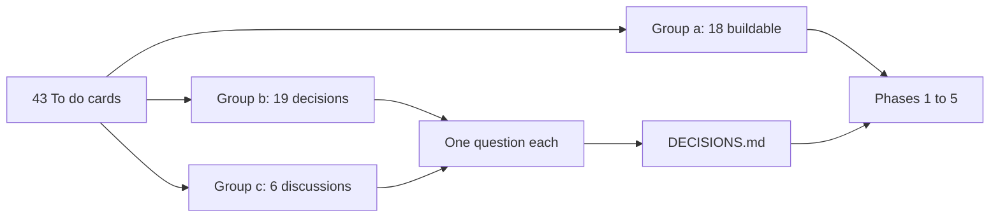

# Overnight build plan, 2026-09-25

The plan for one night. Every card in the To do column of `testing/UI_fix_plan.md` is sorted into three groups, defined under "How the 43 cards sort". The buildable cards are then grouped into bossman phases, in the order a person using the product would notice them.

- Written by: the tech lead, on the night of 2026-09-24 into 2026-09-25, before any of it is built.
- The product owner's answers: recorded in `DECISIONS.md` under 2026-09-25. This file is updated with them before the run starts.
- The night's record: appended to "Night log" at the end of this file as the run goes.

## Table of contents

- [The short version](#the-short-version)
- [How the 43 cards sort](#how-the-43-cards-sort)
- [Group a: ready to build](#group-a-ready-to-build)
- [Group b: needs a decision from the product owner](#group-b-needs-a-decision-from-the-product-owner)
- [Group c: needs a discussion first](#group-c-needs-a-discussion-first)
- [The phases, in order](#the-phases-in-order)
- [How the night runs](#how-the-night-runs)
- [What needs a yes before the run starts](#what-needs-a-yes-before-the-run-starts)
- [What will not happen tonight](#what-will-not-happen-tonight)
- [How to bin the overnight build](#how-to-bin-the-overnight-build)
- [The product owner's answers](#the-product-owners-answers)
- [Night log](#night-log)

## The short version

- 43 cards: 18 in group a, 19 in group b, 6 in group c.
- The order: first, the failures a person hits on a good question. Then one place where every choice in the loop is made, with Jev watching beside it. Then a loop that checks its own results. Then answers worth reading instead of a general chatbot. Last, housekeeping nobody sees.
- Realistic for one night: phase 1 built and live, phase 2 built and reviewed, phase 3 started. Each phase has its own 8-hour and 8-dispatch budget, and a night is shorter than two of them.
- Nothing tonight swaps a model, writes into the graph, edits a locked document, or adds a tool beyond the seven in the technical specification's Section 6.

## How the 43 cards sort

- Group a: the fix is known, or findable by measurement, sits inside the locked scope, and needs nothing from the product owner.
- Group b: the card itself says "Your decision", or its fix forks on a product choice: wording, placement, a limit, a source, a dependency.
- Group c: the card changes how answers are structured, or crosses a scope or locked-specification boundary.

Research behind the sort: three read-only researchers traced every card to its record and its code on 2026-09-25. Two findings changed a card's group:

- Card 30's `s3` is this product's own command-line tool (`pyproject.toml`, `[project.scripts]`), not Amazon's. Running the two examples needs our own package installed, not a new dependency, so it is buildable.
- Cards 1, 14, 23 and 28 each fork on a product choice the record never settled, so they moved to group b.

## Group a: ready to build

Answer path means the card can change what an answer says, which records it cites, or whether a question is answered or refused. Every answer-path phase waits on the golden consistency run.

| Card | Item | What a person will notice | Answer path | Size | Phase |
|---|---|---|---|---|---|
| 2 | 12.17 | A good question no longer comes back as a refusal because the think step's reply was malformed | Yes | M | 1 |
| 21 | MODY genes | `What genes are associated with MODY?` passes its citation check instead of failing 5 runs in 6 | Yes | M | 1 |
| 20 | Trust verdict | The trust line under an answer stays the same when the evidence is the same | Yes | L | 1 |
| 19 | Same papers | The same question returns the same papers each time | Yes | L | 1 |
| 22 | 127-second run | No search takes two minutes when the median is fourteen seconds | No | M | 1 |
| 38 | Live NCBI unit test | An NCBI outage no longer turns the build red with nothing wrong in the code | No | S | 1 |
| 3 | 12.16 part 3 | Which questions are read as asking for papers is decided by a classifier model, not a word list | Yes | M | 2 |
| 4 | 12.15 | `recent papers on statins` asks which years you mean | Yes | M | 2 |
| 24 | G-005, G-022, G-036 | A disease the graph holds nothing on is answered from the live records, never as "I could not find evidence" | Yes | M | 3 |
| 7 | Drafted search | The answer says when the system wrote its own graph search rather than using a checked one | Yes | S | 3 |
| 25 | 12.16 part 4 | A reworded sentence never points at the wrong paper through a generic shared word such as "patients" | Yes | S | 4 |
| 26 | Multi-sentence record | A record with several sentences shows as one entry, not several list rows | No | S | 4 |
| 27 | 11.28 | The progress display never shows a writing step that is not happening | No | S | 4 |
| 29 | Disease names | A hand-over request, with its measurements, for the data repository that owns the graph | No | S | 5 |
| 30 | 11.30 | The two command line examples on the Integrations page are run exactly as printed, against develop | No | S | 5 |
| 40 | Stale line number | `/phase-checkpoint` names the right CLAUDE.md line | No | S | 5 |
| 41 | Deleted file | The cause of the tracked file that vanished mid-session is found, or narrowed to a named suspect | No | S | 5 |
| 39 | Merge the two modes | Bossman mode runs as one cadence with a risk dial; due only after a build phase closes | No | L | 5 |

Sizes: S is under an hour, M a few hours, L more than that. Cards 19, 20 and 22 have no diagnosed cause yet, so their phase work starts with the diagnosis and stops at a written diagnosis if no fix is clear inside the budget.

## Group b: needs a decision from the product owner

Each is asked one at a time, answerable yes, no or pick one. The answer is recorded in `DECISIONS.md`, and where it unlocks a build, the card joins the phase named.

| Card | The decision | Recommendation | Phase if yes |
|---|---|---|---|
| 1 | 12.14: a phenotype question gets variant records. Say honestly that the graph holds no phenotypes, or fetch the clinical features MedGen lists through the existing `ncbi_efetch` tool | Fetch from MedGen, and say plainly when MedGen lists none. If the field is outside the locked Section 6.2 table, it is recorded for reconciliation the way the gene summary was | 1 |
| 23 | L-01: the questions still on the drafted-search path. Add checked searches for them, or never draft and ask the reader instead | Add checked searches for the named questions, keep drafting for new shapes, and tell the reader when it happens (card 7) | 3 |
| 28 | The isolate search filters only by resistance gene. Which filters to add | Location and collection year, the two a researcher asks for most | 4 |
| 14 | 11.11: answers modelled on the reference prototype. The record never says which prototype answers to match | You name three prototype answers in the morning; until then the card waits | 4 |
| 42 | 11.31: have the code place NCBI's own plain text, such as the gene summary, verbatim and cited in the answer | Build it: it adds depth with no model touching the words, so nothing can be invented or stripped | 4 |
| 6 | Is the 20-source citation cap right. 24 of 30 live answers hit it and said the answer was incomplete | Keep 20, since it is also the hallucination and cost control, and fix how the cut is told (card 31) | 4 |
| 43 | Is the 50,000-byte findings ceiling right. It fires at 22 PubMed rows | Keep it: it binds after the 20-source cap, so it never cuts what a reader would see | none |
| 31 | D-2: one answer shows 78, 124 and 59 and never says which is which | Label each number with what it counts on one line, for example "78 cited of 124 found, 10 per page", and drop "not shown above" | 4 |
| 32 | The provenance note under the variant-to-disease table, proposed on 2026-09-14 as D4 and never shipped: "Variant-to-disease links are ClinVar assertions, each cited to its variation record. Disease names are MedGen titles read live from NCBI." | Ship it: code-built, and it states only what the code knows | 4 |
| 33 | The Plain language and Researcher toggle: the answer-layout mockups draw it in the answer's status strip; today it is chosen before asking | Also put it in the strip, where switching re-runs the question in the other mode | 4 |
| 16 | 9.9, the trust-line wording. Most answers read "Based on N sources, not yet confirmed", which means fewer than two independent databases agree | Say what is true without a warning tone: "Based on N sources from one database" when that is the case | 4 |
| 15 | 9.11, keep the small grey medical-advice line under Plain language answers | Keep it: Plain language readers are the likeliest to be patients, and one grey line costs nothing | none |
| 5 | Four golden rows: G-008 ("334") and G-045 (the ACMG call) already accept a refusal; G-038 ("tree of life") expects an answer and is refused; G-035 expects a Taxonomy link form | Close G-008 and G-045 as fine; make the product answer G-038 from NCBI Taxonomy (phase 2's relevancy decision); accept the product's Taxonomy link form for G-035 | 2 |
| 17 | 10.4: does the product reviewer's five-line rubric, now run every phase, stand in for a separate answer-quality pass | Yes, until the golden answered count clears a bar you set; then a domain expert reads | none |
| 36 | NCBI's gene summary, added beyond the locked Section 6.2 table | Keep it and carry it into the next reconciliation | none |
| 37 | Seven test files the deletion inventory set aside | Keep the graph query service file and the two golden dataset files; delete the four streaming files together | 5 |
| 18 | A lock file for the Python build | Yes: `pip-compile` from `pip-tools` as a development tool, pinning every version the build installs | 5 |
| 34 | Four type values where the design card and `theme.ts` disagree | The shipped responsive values win, and the design card is updated to match, so `theme.ts` is untouched | 5 |
| 35 | Install the public USWDS package, the base of the NCBI design system | Yes, in phase 5 after the supply-chain checks, since nothing on screen changes | 5 |

## Group c: needs a discussion first

Six cards, each with its options and one recommendation. The product owner's direction of 2026-09-23 sits verbatim under To do in `testing/UI_fix_plan.md`; nothing here rewords it.

### Card 8: Jev as the classifier wherever a choice is made

Today every choice in the loop is a separate guard-tier or plan-tier chat call with its own prompt, taken as certain:

- The guardrail's relevancy and safety check.
- The one-to-three-word ask-back, 12.3 (`core/graph.py`, `_clarify_or_proceed`).
- The think classification, where card 2's malformed replies come from.
- The literature routing, still a word list, `_LITERATURE_WORDS` in `core/breadth_plan.py` (card 3).
- The model check on reworded sentences, 12.10.

The options:

- Option A, recommended: one classifier seam. Every choice goes through one function that takes the question, a closed set of options and the decision's name. The guard tier decides tonight. Jev runs beside it on the same inputs in shadow: its choice and confidence are recorded per query and never acted on. Each decision point moves to Jev on its own agreement numbers, one at a time, by configuration.
- Option B: Jev acts now at the low-stakes points (ask-back, literature routing, the recent-years ask), falling back to the guard tier on any error, and shadows only at the guardrail.
- Option C: Jev acts everywhere now.
- Option D: build the seam only, no Jev yet.

Why A:

- Jev answers on an alpha endpoint, `POST /api/alpha/decisions`, and the guardrail sits on every query.
- Output tokens are free, so shadowing costs almost nothing.
- Every golden run from tonight on produces this product's own agreement numbers.
- Acting on it unattended would stake every query on a model nobody has measured here.

### Card 9: NCBI and enrichment calls as MCP-style functions

- Option A, recommended: an in-process function catalogue. Each existing tool action gets a name, a one-line description, a typed input schema and its measured limits, in one registry shaped like an MCP tool listing. The resource-choice decision picks from that closed list, which is what makes it a decision Jev can take. No new server, no new execution surface, and the seven tools and their schemas are unchanged.
- Option B: also wrap the calls in internal MCP servers, one process per API family. It adds a hop to every call and an execution surface running with the app's credentials, and it re-cuts the locked Section 6 tool list, so it is a contract-version event needing a sign-off.
- Option C: not now.

Why A:

- Measured on 2026-09-22 (11.32's detail): the wait is the writing step, not the transport. The envelope buys no speed.
- The typed, measured surface is the part that buys reliability, and it needs no protocol.

### Card 10: models chosen per task by tier

All three tiers already run open-source models through OpenRouter. Develop's own settings, read on 2026-09-25: DeepSeek V4 Flash for the guard tier, DeepSeek V4 Flash for the plan tier and GLM 5.2 for the synth tier. The code's defaults in `harness/tiers.py` name Kimi K2.6 for the plan tier, and develop overrides that.

- Option A, recommended: keep today's three open-source tiers and add a task-to-tier table, so every decision and step declares its tier in one place. Run Section 25's build phase 7.0 model bench per tier against the golden set before any swap. The frontier escalation tier waits for its trigger.
- Option B: add a frontier escalation now: when an answer fails grounding or the model check, retry once on a frontier model. The PRD lists escalation as a v2 lever, so this needs its trigger confirmed.
- Option C: run the model bench tonight. It competes with the golden runs for the night's accounts and spend.

Why A: the standing rule is to iterate the harness first and swap the model second, and the open-source half of the direction already holds.

### Card 11: the agentic loop

Today the loop runs once: Guardrail, Think, Plan, Act, Write. It never checks what Act returned against what was asked, and never adjusts. Three open cards are that failure:

- Card 1: a phenotype question answered with variant records.
- Card 24: an empty graph reported as "no evidence".
- Card 2: a think failure shown as a refusal.

The options:

- Option A, recommended: a check-and-adjust step after Act. A classifier decision asks whether the results answer what was asked: the right kind of record, not empty, no failed search. If not, Plan runs once more with the reason, then Write. One re-plan at most, inside the per-query call ceiling and cost cap, and every event it adds is additive to the `v1` contract.
- Option B: also let the check split a hard question into sub-questions. Sub-query decomposition is on the PRD's out-of-scope list with a named trigger, a deep-research failure rate above 20 percent, so it needs that trigger confirmed.
- Option C: not now.

Why A: it is the owner's steps 4 and 5, "checks intermediate results" and "adjusts when something fails". It removes a whole class of confident wrong answer rather than one question at a time.

### Card 12: hard and soft edges over a fuller graph (11.29)

From `testing/Developer/reports/2026-09-23_overnight/soft_edges_scoping.md`:

- Five of fifty golden questions need two hops, and all five walk one path that is already built.
- Twelve need data the graph does not hold.
- The motivating count for vector embeddings and a RAG pipeline is zero.

The options:

- Option A, recommended, in this order:
  - Stop an empty graph reading as "nothing is known", built as card 24 inside phase 3's check step.
  - Probe the four zero-row hops before costing a fix.
  - Add the soft edges whose far end carries real names, each one single-edge template shown as a cited path: literature co-mention, shared biological process, citation lineage over `cited_in`, and variant-level condition overlap.
  - Hand the data findings to the data repository (card 29).
- Option B: also vector embeddings, a RAG pipeline or a hybrid vector graph. Each sits on the v1 out-of-scope or fast-follow lists and has a motivating count of zero here.
- Option C: discussion only, build later.

Why A:

- It is the scoping document's own order.
- Each soft edge is free against the twenty-call ceiling.
- None needs new technology.

### Card 13: a bounded trial of the probability model (11.38)

- Option A, recommended: the trial is card 8's shadow run. Jev decides beside the guard tier at every decision point on the seam, and the morning report carries one agreement table per decision point, with Jev's confidence where the two disagree.
- Option B: shadow at the guardrail only, the vendor's closest fit.
- Option C: not now.

Why A:

- One build covers every decision point for the price of one.
- It produces the product's own numbers instead of the vendor's benchmark.
- Acting on a confidence number is a separate, later decision.
- The cite-or-refuse gate stays deterministic whatever the trial shows.

## The phases, in order

Ordered by what a person typing a question notices first: a refusal or a wrong answer, then an answer of the wrong kind, then an answer that is right but thin, then everything nobody sees.

The phases are numbered 8.1 to 8.5, after Section 25's last phase, 7.1. They are the product owner's To do column, not Section 25 phases.

Final after the product owner's answers of 2026-09-25. Every phase runs on its own branch with one pull request.

| Phase | Branch | Cards | What a person will notice | Why now |
|---|---|---|---|---|
| 8.1 Good questions stop failing | `phase/8.1-good-questions-answer` | 2, 1, 6 with 43, 21, 20, 19, 22, 38 | A good question answers, cites, and answers the same way twice; a phenotype question names phenotypes; answers can cite up to 30 sources | A refusal or a changing answer loses the reader before anything else matters |
| 8.2 One place where every choice is made | `phase/8.2-classifier-seam` | 8, 13, 9, 10 (the table and the writer bench), 3, 4, 5 (G-038 and G-035) | "Recent papers" asks which years; paper requests and relevancy are Jev's choices; a morning table compares Jev with DeepSeek; a bench table compares writing models | Every later phase adds a decision, so the seam comes first |
| 8.3 The loop checks its own work | `phase/8.3-check-and-adjust` | 11, 24, 12 (option one), 7, 23 | An empty graph never reads as "no evidence"; a wrong kind of result triggers one re-plan; a drafted search is disclosed or replaced by a checked one | A confident answer of the wrong kind is the worst thing the product can say |
| 8.4 Answers worth reading | `phase/8.4-answers-worth-reading` | 44, 12 (soft edges), 25, 26, 27, 28, 31, 32, 33, 16 | One quoted sentence under each paper, cited paths that connect the dots, labelled numbers, a calm trust line, the depth toggle on the answer | The owner's bar: worth reading instead of a general chatbot |
| 8.5 Housekeeping nobody sees | `phase/8.5-housekeeping` | 29, 30, 40, 41, 39, 37, 18, 34, 35 | Nothing on screen | None of it changes what a person sees |

Decided with no build: card 14 (11.11) closed, card 42 left as approved, card 15 kept as live, card 36 kept for reconciliation, card 17 waiting on its bar of 120 answered of 150.

The night's budget allows two golden runs, so phases 8.1 and 8.2 can merge tonight. A later phase that gets built stays as an open pull request for the morning.

### How each phase splits by file

`core/graph.py` is touched by ten of the twelve answer-path cards, so builders are split by file, not by card. No two builders share a file, and a builder whose fix needs a file outside its fence stops and reports.

Phase 8.1:

- Builder A, Sonnet: `core/graph.py` and `harness/coordinator_worker.py`. Card 2, then cards 6 and 43 as one ticket, then card 22's diagnosis.
- Builder B, Sonnet: `synthesis/grounding.py` and `synthesis/trust.py`. Card 21, then card 20.
- Builder C, Sonnet: `core/breadth_plan.py`, `tools/ncbi_eutils_actions.py`, `tools/ncbi_efetch.py`, `tools/ncbi_efetch_schemas.py` and `tests/system_03_search_agent/core/test_answer_readability_premise.py`. Card 1 (MedGen's summary carries 70 clinical features for Marfan syndrome in its `conceptmeta` block, measured live on 2026-09-25), then card 19, then card 38.

Phase 8.2, with the seam's interface written by the lead before any builder starts, so the three code against one contract:

- Builder A, Sonnet: the seam, the Jev shadow client and the task-to-tier table, in new files under `harness/`, and the additive `decisions` field on the done event.
- Builder B, Sonnet: `core/clarify.py` and `_clarify_or_proceed` in `core/graph.py`. Moves 12.3 onto the seam and adds card 4's recent-years ask.
- Builder C, Sonnet: `core/breadth_plan.py`, `guardrail/`, and the function catalogue under `tools/`. Card 3, the relevancy decision, and card 9.

Phases 8.3 to 8.5 are split the same way when they open.

## How the night runs

- Roles and tiers: the lead splits, integrates and decides on the depth tier. Judges, adversaries and the product reviewer run on the depth tier. Builders run on Sonnet. Mechanical edits (board rows, counts, test-query entries) run on Haiku. Workers never start agents.
- Budget per phase: 8 hours and 8 dispatches, reviewers included. One judge round and one adversary round on every branch phase, then one fix-and-verify. No third round.
- The golden run: once per phase, after its last card is live on develop. Three passes of all fifty golden questions on two fresh accounts, against the floor of 86 answered of 150.
- A drop below the floor: the phase is reverted before anything else lands, and the run moves to the next phase that does not depend on it. Only the product owner may accept a drop.
- When a card is live: its entry is written in `testing/Test_queries_and_workflows.md` (the feature, queries to try, what you should see), then its card moves from To do to Retest with those query numbers.
- When something needs the product owner mid-run: it is written to "Night log" below and to `HANDOFF.md`, the card stays in To do with the reason, and the run moves to the next card.
- At the end: `/phase-checkpoint`, then `/ship`, then one morning report: what went to Retest with query numbers, what is still To do and why, and every question waiting.

## What needs a yes before the run starts

The rules require an explicit, itemized grant for each of these. They are asked with the group b and c questions.

- Unattended overnight execution, deferred since 2026-07-26 until known to be needed.
- Merging my own phase pull request when CI passes, the judge and adversary leave no blocking finding, and the golden run holds the floor. Otherwise the pull request stays open for the morning.
- Starting the next phase without your retest verdict on the one before.
- Phase 8.1's mode: straight to develop as the fix loop runs, or its own branch and pull request.
- One golden run per phase rather than per card, and reverting a phase on any drop.
- Creating fresh test accounts on develop for each golden run, as the 2026-09-22 run did.
- Jev: a new outside model service. The questions people type would go to TypeSafe through OpenRouter's alpha endpoint, whose documentation states no data-retention terms.
- The cost caps: unchanged, with a spending ceiling for the night.
- Builders running as background agents in their own worktrees, since this session is not inside tmux and no live panes will show.

## What will not happen tonight

- No model swap on any tier.
- No write into the graph: that is the data repository's job, so card 29 is a hand-over document.
- No edit to `requirements/PRD.md` or `requirements/Technical_specification.md`.
- No new tool beyond the seven, and no MCP server around them.
- No vector embeddings, RAG pipeline, sub-query decomposition or frontier escalation, unless a named trigger is confirmed.
- No production release: `v0.2.0` stays on production.
- No database migration. A card that needs one stops and waits for the product owner, so restoring the code is always a complete undo.

## How to bin the overnight build

The product owner's instruction, 2026-09-25: "do not completely destroy what we have on develop today. Build a mechanism that if I do not like what you built overnight, we can bin it."

- The rollback point: the git tag `pre-overnight-2026-09-25`, commit `14be13a`, pushed to GitHub before any overnight code landed. Develop's product code there is identical to `f3aaf6f`, where the session started.
- Bin everything: `python3 testing/Developer/scripts/bin_overnight.py --all --yes`. Every product path (`src/`, `frontend/`, `tests/`, `services/`, `eval/`, `alembic/`, the dependency files, `railway.json`, `.github/`) goes back exactly to the tag as one new commit on develop. No force-push, no lost history. Documents and decisions stay.
- Bin one phase: `python3 testing/Developer/scripts/bin_overnight.py --phase 8.2 --yes` reverts that phase's merge only.
- See first, change nothing: run either without `--yes`, or run `--list` to see the overnight merges and every Railway setting changed.
- Railway settings: every develop variable changed overnight is logged in `testing/Overnight_settings_log.json` with its value before; binning puts each back, or deletes it if it did not exist before.
- The instant fallback: the develop deployments serving the rollback point were API `008542c2-d69c-4bb5-9398-ef1ad0efe8ec` and web `88ccc316-dea5-4589-9053-aaded1d20ee2`. Either can be redeployed from Railway in one click.
- Proven on 2026-09-25 in two throwaway clones: one simulated phase binned alone, and two simulated phases binned together, each leaving every product path identical to the tag, including a modified file, an added file and a deleted one.

## The product owner's answers

One line per answer, in the order asked. Each has its row in `DECISIONS.md` under 2026-09-25.

- Card 8: Jev decides the loop's small choices on develop (relevancy, the ask-back, literature routing, the recent-years ask, which resource to pull). DeepSeek, the guard tier, decides the same inputs beside it and is only recorded, for a morning comparison table. Any Jev error or timeout falls back to DeepSeek's pick. The safety checks stay as they are. This replaces the plan's option A for card 8.
- Card 13 and the outside-service question: yes, develop only. Develop's questions may go to Jev through OpenRouter; production is untouched. The trial of the probability model is card 8's arrangement, not a shadow run.
- Standing preference, given unprompted: open to new models, open source preferred, closed frontier models also acceptable. Folded into card 10.
- Card 9: an in-process catalogue. Jev picks from it, code fills the inputs, the tools fetch, the writing model writes. No MCP servers.
- Card 10: bench the writing tier tonight (GLM 5.2, two other open-source models, one closed frontier model, 15 golden questions, run locally); you pick in the morning. Cost cap raised for the local bench only. Plus a task-to-tier table.
- Card 11: check once, re-plan once, after the searches. No sub-question splitting.
- Card 12: cited soft edges, no vectors or RAG. Order as the scoping document gives it.
- New card 44, item 13.1, raised tonight: passages that answer the question, from NCBI's LitSense. Probe first, build in phase 8.4 if the probe holds. No RAG pipeline of our own.
- Tonight only: unattended run, merging my own phase PRs under the stated conditions, the next phase without your retest, builders without tmux panes. All four granted; they expire at the morning report.
- Phase 8.1: its own branch and pull request, with judge and adversary rounds, like every other phase.
- Golden run: once per phase; revert a phase on any drop below 86 of 150; two fresh test accounts on develop per run.
- Night spend: up to $12 of the $20 OpenRouter balance; $8 kept for your retest. Two golden runs at most, a 10-question writer bench. Develop's caps unchanged.
- Card 1: fetch the clinical features from MedGen through the existing tool; say plainly when MedGen lists none. Joins phase 8.1.
- Card 23: checked searches for the named questions, drafting kept for new shapes and disclosed (card 7). Phase 8.3.
- Card 42: leave as approved. No code-placed NCBI text. The card leaves the board as decided.
- Card 14 (11.11): closed. 12.9 and 12.10 answered enough of it; depth moves to the writer bench.
- Card 6: the citation cap rises from 20 to 30. Phase 8.1.
- Card 43: the byte ceiling rises to 70,000 so paper questions can reach 30 sources. One ticket with card 6, phase 8.1.
- Card 31: label every number with what it counts; drop "not shown above". Phase 8.4.
- Card 32: ship the 2026-09-14 provenance note as proposed. Phase 8.4.
- Card 33: the toggle stays before asking and is also added to the answer strip; switching re-runs the question. Phase 8.4.
- Rollback: the tag `pre-overnight-2026-09-25` and `bin_overnight.py`, proven in two throwaway clones. No database migration tonight.
- Card 42 against 44, resolved: answer text stays clean; one quoted LitSense sentence per paper in the sources list, in the source card's design. Every UI change is judged from the reader's chair and screenshot at both widths.
- Card 16: the trust line says what is true, calmly: "Based on N sources from one database"; "Confirmed by N independent sources" unchanged. Phase 8.4.
- Card 15: keep the grey line on Plain language answers. No build; the card leaves the board.
- Card 5: G-008 and G-045 fine; G-038 answered from NCBI Taxonomy (phase 8.2); G-035 accepts the product's Taxonomy link once both are shown to name one record.
- Card 17 (10.4): the rubric stands in until the golden run answers 120 of 150; then a domain expert reads a sample. The card stays with that trigger.
- Card 36: keep the gene summary; reconcile it into Section 6.2 later with card 1's MedGen field.
- Card 37: keep the graph-service and golden-dataset test files; delete the four streaming-timing files together. Phase 8.5.
- Card 18: a lock file with pip-compile, after the supply-chain checks. Phase 8.5.
- Card 34: the shipped responsive values win; the design card is updated. Nothing on screen changes. Phase 8.5.
- Card 35: install USWDS after the npm checks; theme.ts reads the same values; screenshots prove nothing moved. Phase 8.5.
- Card 28: isolate questions narrow by location and collection year. Phase 8.4.
- All questions answered on 2026-09-25. The run starts with phase 8.1.

## Night log

Appended during the run, newest last.

- 2026-09-25: plan written and committed; questions to the product owner begin.
- 2026-09-25: moved from `docs/build/` to `testing/` on the product owner's instruction.
