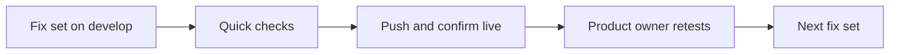

# UI fix plan

The ordered work list for fixing the product after the first testing round on 2026-09-12. Each set says what you will see, what was noted, and what to expect, so you can check progress without reading the code.

## How to read this

- ✅ built and passing checks
- 🚀 live on develop
- 👍 you retested and approved
- An empty mark means not yet.

## Table of contents

- [How to read this](#how-to-read-this)
- [Progress at a glance](#progress-at-a-glance)
- [Set 1: let people in](#set-1-let-people-in)
- [Set 2: a steady frame](#set-2-a-steady-frame)
- [Set 3: refusals and Stop](#set-3-refusals-and-stop)
- [Set 4: stay signed in, history on phones](#set-4-stay-signed-in-history-on-phones)
- [Set 5: Integrations and the disclaimer](#set-5-integrations-and-the-disclaimer)
- [Set 6: let automated checks see a real answer](#set-6-let-automated-checks-see-a-real-answer)
- [Set 7: a conversation that remembers](#set-7-a-conversation-that-remembers)
- [Set 8: search every layer, with the scientists](#set-8-search-every-layer-with-the-scientists)
- [Set 9: answers worth reading](#set-9-answers-worth-reading)
- [Set 10: reliable flagship answers, and saved history](#set-10-reliable-flagship-answers-and-saved-history)
- [Set 11: live feedback of 2026-09-13 and 2026-09-14](#set-11-live-feedback-of-2026-09-13-and-2026-09-14)
- [Where we stopped](#where-we-stopped)
- [Developer detail](#developer-detail)

## Progress at a glance

| Set | What you will see | Built | Live | Approved | You retest |
|---|---|---|---|---|---|
| 1. Let people in | No guest limit and no walls. One Log in button. Log out goes to the home page | ✅ | 🚀 | 👍 | Tests 1, 3, 6 |
| 2. A steady frame | The white box stays one width. Header and footer stay put, in the lighter NCBI blue, with smooth changes between screens. Retest follow-ups: a light home page, centred screens, no pause after Search, fewer failed searches | ✅ | 🚀 | 👍 | Tests 1, 2, 3, 9, 11 |
| 3. Refusals and Stop | Refusals show a calm grey label and a clickable NCBI link. Stop shows "Search stopped" | ✅ | 🚀 | 👍 | Tests 8, 9, 13, 19 |
| 4. Stay signed in, history on phones | A reload keeps you signed in. History opens in a sliding panel on a phone | ✅ | 🚀 | 👍 | Tests 3, 6, 11 (phone width) |
| 5. Integrations and the disclaimer | An Integrations page in the reference layout. A bigger disclaimer. GraphQL and MCP both work | ✅ | 🚀 | 👍 | Tests 11, 15 |
| 6. Let automated checks see a real answer | Nothing on screen. It lets later fixes be checked automatically | ✅ | 🚀 | | Nothing |
| 7. A conversation that remembers | Follow-ups answer about the same gene. "Yes, go deeper" continues the search on the same screen. Retest follow-ups: a folded turn keeps its whole answer with room between turns, and an unclear follow-up asks for the missing detail | ✅ | 🚀 | 👍 | Tests 2, 13 |
| 8. Search every layer, with the scientists | Every question searches all three layers. A lead scientist hands off to three named scientists | ✅ | 🚀 | | Tests 1, 7, 12, 14 |
| 9. Answers worth reading | Two modes, Plain language and Researcher, with an info button. Answers stream in and never open broken. Researcher answers follow your reference screenshot | ✅ | 🚀 | | Tests 1, 7, 12 |
| 10. Reliable flagship answers, and saved history (10.1 first; 10.2 to 10.4 after the release, product-owner order of 2026-09-13) | BRCA1 and GCK answer every time. A history item shows its saved answer at once | | | | Tests 1, 6, 13 |
| 11. Live feedback, 2026-09-13 and 14 | Quieter citations, faster answers, readable answer layout, visible writing and streaming, deeper answers from every source. Item by item below. NEW on 2026-09-20: the bold is quieter (11.27) and every question now searches the resources that fit it rather than a fixed plan (11.17 and 11.21) | Partly | Mostly | | Tests 1, 7, 12 |

## Set 1: let people in

Batch: screens and pages.

What you will see: no guest limit and no walls. One Log in button, where a new email creates the account. Log out goes to the home page. Pushed as commit `7766ebf` and live on develop on 2026-09-12, approved by the product owner the same day.

### 1.1 Remove the five-search guest limit (R1)

Built: ✅ · Live: 🚀 · Approved: 👍

- Feature being tested: a guest can search without hitting a five-search counter.
- What you noted: "One thing we need to change for now is to get away with the five search concept, keep the login, and allow people to search, because this is just a prototype."
- What's expected: test 1 now covers searching as a guest, with no count and no sign-in card however many searches you run.

### 1.2 Remove the free-search and moved-into-an-account walls (R2)

Built: ✅ · Live: 🚀 · Approved: 👍

- Feature being tested: a guest reaches the search box with no wall in the way.
- What you noted: "It tells me to sign in to keep searching, because this browser's guest session was moved into an account. This is a really bad experience, and it needs to be consistent."
- What's expected: no "You have used your free searches" wall and no "moved into an account" wall, so test 1 can even start.

### 1.3 Remove the ten-attempt guest limit (R3)

Built: ✅ · Live: 🚀 · Approved: 👍

- Feature being tested: a guest is not stopped after a fixed number of attempts.
- What you noted: "For too many guest attempts, number twenty, I said just remove it."
- What's expected: test 20 is removed, and test 8, the off-topic refusal, still covers a normal refusal.

### 1.4 Keep the cost caps, raise the anonymous daily cap to 1,000 (R4)

Built: ✅ code kept, cap set to 1,000 on develop on 2026-09-12, confirmed by the product owner · Live: 🚀 · Approved: 👍

- Feature being tested: the caps that bound real cost, not guest behaviour, stay in place.
- What you noted: from decision X4, after the assistant's first description was corrected: the system-wide daily cap does not fire today, so the anonymous daily cap is the only real bound on total anonymous spend. Kept and raised from 200 to 1,000 searches a day; the per-search cost cap and the per-connection share also stay.
- What's expected: nobody hits a guest wall in normal use, and test 18 still shows no unlimited claim for a signed-in account.

### 1.5 One Log in button (R5)

Built: ✅ · Live: 🚀 · Approved: 👍

- Feature being tested: a single button handles both a new email and an existing one.
- What you noted: "For simplicity, remove the Sign up button and keep only Log in, so people type in any email address and password they want and go straight in, without the 'we don't recognise your email' process."
- What's expected: test 3, one "Log in" button, a new email creates the account, a wrong password on an existing email says so.

### 1.6 Log out returns to the home page (R6)

Built: ✅ · Live: 🚀 · Approved: 👍

- Feature being tested: signing out from anywhere lands on the search home page.
- What you noted: "Then they can easily log out and go back to the home page."
- What's expected: test 3, Log out from any screen, including Integrations, lands on the home page with the previous conversation gone.

### 1.7 The daily cap message reaches the screen (D1)

Built: ✅ already worked, and now also shown on the home page · Live: 🚀 · Approved: 👍

- Feature being tested: when the shared anonymous daily cap is hit, its purpose-written message actually appears.
- What you noted: from the developer specification, item D1 (W-GUEST-11 in `Developer_workflows.md`). Once the five-search limit is gone, the daily cap is the only limit a guest can hit, so its message has to be right.
- What's expected: a guest who hits the daily cap sees the written message, not a blank or generic error.

### 1.8 Update the test checklist for the new sign-in flow (R37)

Built: ✅ · Live: 🚀 · Approved: 👍

- Feature being tested: `Product/Product_workflows.md` matches what set 1 actually built.
- What you noted: from the requirement list, section 11 of the report.
- What's expected: tests 3 and 5 rewritten for one Log in button, and tests 4, 16 and 20 marked removed.

## Set 2: a steady frame

Batch: screens and pages.

What you will see: the white box stays one width from progress to answer. The header and footer stay put, both in the lighter NCBI blue, with smooth changes between screens. New search is a filled blue button. The sign-in box is centred. Pushed as commits `ff80814` and `3e1ee64`, live on develop on 2026-09-12 and checked by screenshot at 1280px and 390px.

### 2.1 Centre the sign-in box (R7)

Built: ✅ · Live: 🚀 · Approved: 👍

- Feature being tested: the log-in form sits in the middle of the screen, not tucked under the header.
- What you noted: "The sign-in box is way too close to the header; I would like it much more centred."
- What's expected: the box sits centred vertically between the header and footer, checked in test 3 and test 11.

### 2.2 One box width from progress to answer (R8)

Built: ✅ · Live: 🚀 · Approved: 👍

- Feature being tested: the white content box does not change size as a search moves from progress to answer.
- What you noted: "The white box should stay the size it is when the answer is actually shown."
- What's expected: the box stays one width throughout a search, checked in tests 1, 6 and 9.

### 2.3 Fix the header and footer in place (R9)

Built: ✅ · Live: 🚀 · Approved: 👍

- Feature being tested: the header and footer stay still while the content in between changes.
- What you noted: "The transitions are very weird. The footer moves all over the place. The header and footer should stay consistent, including going from the home page to the search page."
- What's expected: a stable content area so the footer no longer jumps, checked in test 11.

### 2.4 Smooth transitions between screens (R10)

Built: ✅ · Live: 🚀 · Approved: 👍

- Feature being tested: moving between home, progress and answer feels like one continuous app.
- What you noted: "It needs to be a much smoother experience. Right now it looks very static and clunky."
- What's expected: a smooth transition rather than a hard screen swap, checked in test 11.

### 2.5 Header and footer in the same blue (R11)

Built: ✅ · Live: 🚀 · Approved: 👍

- Feature being tested: the header and footer use one colour, not two.
- What you noted: "The header and footer should be the same colour." Decided in section 10, question 1: the lighter NCBI blue, for both.
- What's expected: both header and footer in the lighter NCBI blue, checked in tests 2, 3, 9 and 11.

### 2.6 New search as a distinct blue button (R12)

Built: ✅ · Live: 🚀 · Approved: 👍

- Feature being tested: New search and Stop no longer look like the same button.
- What you noted: "The New search and Stop buttons are the same colour. New search should be a different colour, a blue background with white text, so it looks distinct."
- What's expected: New search is a filled blue button with white text, checked in test 9.

### 2.7 Add the three missing logo colours to the theme (X9)

Built: ✅ · Live: 🚀 · Approved: 👍

- Feature being tested: the new blue header has every colour it needs, approved for the theme file.
- What you noted: decision X9, the product owner's approval to change `frontend/src/theme.ts`.
- What's expected: when the header turns the lighter NCBI blue, three approved logo colours are added and checked for contrast, so the design token check reports zero problems.

### 2.8 A light home page (retest feedback)

Built: ✅ · Live: 🚀 · Approved: 👍

- Feature being tested: the home page uses the same light background as every other screen.
- What you noted: "The home page contrast is horrible. Lets have concistency. same color of header and footer everywhere and same white background, adjuat the home screen colors"
- What's expected: the home page sits on the light grey background between the blue header and footer, with dark text, a bordered white search bar and white chips. Recorded in DECISIONS.md, since the design system had a navy home page.

### 2.9 Screens centred between header and footer (retest feedback)

Built: ✅ · Live: 🚀 · Approved: 👍

- Feature being tested: every screen sits in the middle of the page, like the log-in screen.
- What you noted: "on the home screen and actually all the screens, please have everything centered, everything is very close to header. Just like how the login page was fixed"
- What's expected: the home, progress, answer, Integrations, About and Docs screens are centred vertically. An answer taller than the screen starts at the top, so nothing is cut off.

### 2.10 No idle wait after pressing Search (retest feedback)

Built: ✅ · Live: 🚀 · Approved: 👍

- Feature being tested: the progress screen shows activity the moment a question is sent.
- What you noted: "ok the box size stays the same but weird 2-3 seconds of staring at the screen and nothing happens"
- What's expected: the first step, Guard, pulses and the seconds counter starts as soon as you press Search.

### 2.11 Searches that fail at the Think step (retest feedback)

Built: ✅ · Live: 🚀 · Approved: 👍

- Feature being tested: a search no longer ends with "This run could not be completed" because one AI model reply could not be read.
- What you noted: "Sure fix it and then we close for the day", approving the fix for about 1 search in 7 failing at the Think step.
- What's expected: searches finish normally. When the model reply cannot be read, the app asks once more, and the unreadable reply is saved to the server log so the cause can be found. Nothing changes on screen.

Pushed as commit `cbb04cc`, live on develop on 2026-09-12 and checked by screenshot at 1280px and 390px.

### 2.12 A bigger search box on the home page (retest feedback)

Built: ✅ · Live: 🚀 · Approved: 👍 (size, then the icon-only up-arrow button at the bottom right, live at commit `79607bd`, approved 2026-09-13)

- Feature being tested: the home page search box is big enough to write a full question.
- What you noted: "on the home page, can we increase the size of the search box? It should be at least big as a tweet box 240 characters? or the appropriate size"
- What's expected: a multi-line box that shows about 240 characters without scrolling and grows as you type. Enter searches, and Shift+Enter starts a new line. Also on phones: the Search button takes its own row so the box keeps its full width (commit `254763b`, after 240 characters scrolled at 390px).
- Follow-up you noted: "The search box increase looks good but the 2 things -> search button placement and the text placement and icon need to be adjusted (magnifying glass Which diseases are associated with BRCA1?)"
- Follow-up expected: the magnifying glass sits level with the first line of text, and the Search button sits in the bottom right corner with even spacing from the box edges. Done in commit `d72256b`, measured live: icon level with the first line, button 8px from the right and bottom edges.
- Second follow-up you chose: option B, flexible: "Lets go with B but a flexible one if the search box increases the search box goes to bottom right"
- Second follow-up expected: with an empty box or a one-line question, the Search button sits top right, level with the magnifying glass and the text. Once the question wraps to a second line, the button moves to the bottom right. On phones the button stays a full-width row under the text. Built at commit `e52dd7b`.
- Third follow-up you noted, on retesting the flexible button: "actually it looked better at the bottom only. Also instead of the Search button with text, why not replace it with an icon, and have it at the bottom right. It can be the up arrow, how we have for Claude Code right now."
- Third follow-up expected: the word Search is gone. A square blue button with a white up arrow sits in the bottom right corner of the box, 8px from the right and bottom edges, at every width. On phones it sits in the same corner rather than taking its own row, so the text box keeps its full height. Screen readers still announce it as "Search the knowledge graph".

### 2.13 NCBI design system: the changes possible today (retest feedback)

Built: ✅ · Live: 🚀 · Approved: 👍

- Feature being tested: the app follows the NCBI design system as far as it can without NCBI's internal packages.
- What you noted: "is there a design system that we can use? at least minimum the color scheme?", then "Can we implement the NCBI design system changes that are possible?"
- What's expected: nothing changes on screen, because our colours are already the USWDS values NCBI is built on. Done on 2026-09-12: the colour card now lists every colour the code uses, including the three logo colours, and says the footer is blue and the home page is light. Four text size and spacing values differ between the design card and the code (h1 size and letter-spacing, h2 size, body line height); both sides are working values, so they wait for your decision. The design system cards are corrected to match the theme code (Stage 0 in `docs/build/design/NCBI_design_system_migration_assessment.md`). Installing the public USWDS package (Stage 1) adds a dependency, so it waits for your yes.

### 2.14 A favicon (retest feedback)

Built: ✅ · Live: 🚀 · Approved: 👍

- Feature being tested: the browser tab shows the app's own icon and name.
- What you noted: "have a background agent add a favicon please"
- What's expected: the helix logo on the header blue in the browser tab, with the tab title "NCBI Agentic Search". Every colour in the icon already exists in the theme.

## Set 3: refusals and Stop

Batch: screens and pages.

What you will see: refusals show a calm grey label naming the reason, and the NCBI search address is a link. Pressing Stop shows "Search stopped" with Run again and New search.

Pushed as commit `4026282`, live on develop on 2026-09-13 and checked on the live app at 1280px and 390px: an off-topic question shows the grey label with no pill, a made-up gene shows "No answer found in NCBI records" with a working NCBI link, and Stop shows the block with both buttons, Run again restarting the run.

### 3.1 Remove the red refusal pills (R13)

Built: ✅ · Live: 🚀 · Approved: 👍

- Feature being tested: a refusal no longer looks like a system error.
- What you noted: from decision U6: a refusal should not carry a red "Not verified" or "Not fully grounded" pill.
- What's expected: a neutral grey label instead of a red pill, checked in test 13.

### 3.2 Make the NCBI search address a clickable link (R14)

Built: ✅ · Live: 🚀 · Approved: 👍

- Feature being tested: the suggestion inside a refusal can actually be followed.
- What you noted: "The messaging is there, telling me to try something, but it should be a clickable link."
- What's expected: the NCBI search address in a refusal opens as a link, checked in test 13.

### 3.3 A grey label matched to the refusal reason (R44)

Built: ✅ · Live: 🚀 · Approved: 👍

- Feature being tested: different refusal reasons read differently from each other.
- What you noted: decision U6, a neutral grey label matched to the reason, such as "No answer found in NCBI records" or "Outside biomedical research".
- What's expected: a "no data" refusal and an off-topic refusal read differently, checked in tests 13 and 19.

### 3.4 "Search stopped" with Run again and New search (R45)

Built: ✅ · Live: 🚀 · Approved: 👍

- Feature being tested: pressing Stop gives a clear end state instead of a frozen screen.
- What you noted: decision U7, replacing the frozen progress screen with a "Search stopped" message and two buttons.
- What's expected: after Stop, "Search stopped" appears with "Run again" and "New search", checked in test 9.

## Set 4: stay signed in, history on phones

Batch: screens and pages.

What you will see: a reload keeps you signed in. On a phone, the history button opens your searches in a panel that slides in.

Pushed as commits `26274db` and `82bf080`, live on develop on 2026-09-13 and checked on the live app: at 1280px a reload keeps the account signed in with the rail restored and the search limit shown, and Log out clears it; at 390px, signed in, the page no longer scrolls sideways, the account pill shows initials only, the searches panel starts closed, opens from the top-right button and closes from its own button.

### 4.1 Stay signed in on reload, and history on phones (R46)

Built: ✅ · Live: 🚀 · Approved: 👍

- Feature being tested: reloading the page does not sign you out, and the history panel works at phone width.
- What you noted: from decisions U8 and U9. U8, on reloading the page signing you out: keep people signed in across a reload, with history and the conversation where they left them. U9, on the phone history button doing nothing: make history reachable on a phone as a panel that slides in and closes.
- What's expected: a reload keeps you signed in, checked in tests 3, 6 and 11 at phone width, and the history button opens a sliding panel on a phone.

## Set 5: Integrations and the disclaimer

Batch: screens and pages.

What you will see: an Integrations page in the reference layout with four equal cards, summary chips and API documentation below. The Docs tab is gone. A larger disclaimer with fuller wording. The GraphQL example works as printed, and MCP accepts connections.

Pushed as commit `20a8688`, live on develop on 2026-09-13 and checked on the live app at 1280px and 390px: the disclaimer shows the new title, wording and full-width button and stays greyed out until ticked; the top bar reads Search, Integrations, About; `/docs` lands on Integrations; four chips and four cards render with no sideways scroll; the MCP endpoint answers an initialize request with 200 where it answered 421 before the deploy, with `MCP_ALLOWED_HOSTS` set on the develop API service; the GraphQL example was run as printed against develop and returned a BRCA1 answer with five citations.

### 5.1 Rebuild the Integrations page from the reference layout (R15)

Built: ✅ · Live: 🚀 · Approved: 👍

- Feature being tested: every Integrations card looks and behaves the same way.
- What you noted: "On the Integrations tab, the REST and SSE formatting and how those things are structured is not uniform. Something's up, something's down. I want it to be very consistent."
- What's expected: equal-height cards with a round icon, title, description and buttons pinned to the bottom, plus a summary line and an access notice, checked in test 11.

### 5.2 Correct the GraphQL example (R16)

Built: ✅ · Live: 🚀 · Approved: 👍

- Feature being tested: the GraphQL example on the page actually works if you copy it.
- What you noted: checked live on develop, the example fails three ways: it is written as a query instead of a mutation, it uses `question` where the field is `text`, and it leaves out a required session id.
- What's expected: the corrected example returns a real BRCA1 answer with citations, checked in test 11.

### 5.3 Fix the MCP server rejecting every request (R17)

Built: ✅ · Live: 🚀 · Approved: 👍

- Feature being tested: an AI tool can actually connect to the MCP server.
- What you noted: checked live on develop, every MCP request is rejected with "Invalid Host header", signed in or not.
- What's expected: MCP accepts connections, checked in test 11.

### 5.4 Fold Docs into Integrations (R18)

Built: ✅ · Live: 🚀 · Approved: 👍

- Feature being tested: the navigation bar no longer has an unexplained Docs tab.
- What you noted: "And on the navigation bar I see Docs, and I have no idea what its purpose is. Is it for the integrations, or for streaming?"
- What's expected: Docs becomes an "API documentation" section inside Integrations, corrected to match the real event stream, with the Docs tab removed, checked in test 11.

### 5.5 Rebuild the disclaimer at the reference size (R19)

Built: ✅ · Live: 🚀 · Approved: 👍

- Feature being tested: the disclaimer reads as seriously as it should before someone continues.
- What you noted: your test notes, summarised rather than quoted: make the disclaimer as big as the one on the reference site.
- What's expected: about 900px wide, a large titled heading, fuller body text, a titled notice box, and a full-width continue button, checked in test 15.

### 5.6 Four Integrations cards with real summary chips (R41)

Built: ✅ · Live: 🚀 · Approved: 👍

- Feature being tested: the Integrations page shows exactly the surfaces that work, with true numbers above them.
- What you noted: decision U3, four cards: REST and SSE, GraphQL, MCP server, and one "Command line tools" card covering the command line and KGX export, with summary chips for 115M nodes, 693M edges, 3 data layers and 7 tools.
- What's expected: four cards and correct chips, with API documentation below them, checked in test 11.

### 5.7 Disclaimer wording from the reference structure (R42)

Built: ✅ · Live: 🚀 · Approved: 👍

- Feature being tested: the disclaimer reads like a real medical disclaimer, in this product's own voice.
- What you noted: decision U4, "Important Medical Disclaimer" as the title, a bold opening sentence, the paragraph about seeking a physician's advice, a "Prototype" notice box in place of the reference's own wording, and a full-width continue button.
- What's expected: the new wording appears while keeping this product's own colours and typeface, checked in test 15.

## Set 6: let automated checks see a real answer

Batch: answers.

What you will see: nothing on screen. It lets the answer fixes be checked automatically, not only by hand.

Built 2026-09-13: an opt-in real-model mode for the end-to-end harness (`S3_E2E_REAL_MODEL=1`, run with `npm run test:real-answer` in `frontend/`) and one gated browser check that asks the BRCA1 question against the real model and the real graph and asserts on the answer body: no refusal, at least one cited claim, diseases named in words with no raw MedGen code, sources on an NCBI host. Its first real run passed in 14 seconds. Nothing to retest.

### 6.1 Let the automated test harness see a real knowledge-graph answer (D3)

Built: ✅ · Live: 🚀 · Approved:

- Feature being tested: an automated end-to-end run can check a real answer body, not only that the screen rendered.
- What you noted: from the developer specification, item D3. The automated test harness fakes the AI model but not the knowledge graph, so no automated test can see a real answer today, and batch 2 changes answers.
- What's expected: an end-to-end run that asserts on a real answer body. Nothing changes on screen, and there is nothing for the product owner to retest.

## Set 7: a conversation that remembers

Batch: answers.

What you will see: "What variants cause it?" answers about BRCA1. "Yes, go deeper" continues the same search. A follow-up stays on the same screen, with the earlier answer shrinking above. Pushed and live on develop on 2026-09-13, approved by the product owner the same night after two retests. By product-owner decision at approval, set 10's reliability item (the same question returns the same sources every time) opens next, ahead of sets 8 and 9.

What was actually wrong, measured by running the same follow-up twelve times locally before any change: the memory worked every time ("it" resolved to BRCA1), and the refusal came from two later steps. The guardrail judged the bare words "What variants cause it?" off topic about one run in three, because it never saw that the session remembered a gene. When it passed, the grounding gate dropped every claim whenever the answer model shortened a stored variant name, so a correct, fully retrieved answer was refused on phrasing and the error blamed a size cut that never happened. "Yes, go deeper" sent its own yes/no wording as the next search. Fixed on the backend by setting aside the guardrail's off-topic verdict in code when a question refers back to an entity the session remembers (a first cut put the memory into the guard's prompt instead, and live on develop that made the guard model answer the question in prose rather than classify it, so every follow-up failed; measured, reverted the same evening; the guard's model call also stopped carrying the agent's cached prefix ahead of the classifier's instruction, which had made the guard model answer the question in prose one call in ten locally and more often on develop), by answering from the retrieved records themselves in code when the model's wording will not ground, by an honest error for the grounding case, and by a real go-deeper question that lists the records the earlier answer did not show. Five of five consecutive follow-up runs answered afterwards with the real stored memory shape, and the go-deeper run showed ten records none of the earlier answers had.

### 7.1 Follow-ups keep the earlier context (R20)

Built: ✅ · Live: 🚀 · Approved: 👍

- Feature being tested: "it" in a follow-up question resolves to the gene from the previous answer.
- What you noted: "With a different question, I don't see any answers being produced. With diseases linked to BRCA1, I tried the follow-up 'What variants cause it?' and it refuses to answer, which means it is not retaining the previous context."
- What's expected: a second answer about BRCA1 without retyping BRCA1, checked in test 2.

### 7.2 "Yes, go deeper" continues the same search (R21)

Built: ✅ · Live: 🚀 · Approved: 👍

- Feature being tested: the go-deeper button uses what the previous answer already found.
- What you noted: "When it asks me 'do you want me to go deeper?', I clicked on it and it completely refused. What was the purpose? Have you not set up the context that gets fed into it?"
- What's expected: clicking "go deeper" continues the same search rather than starting a new, unrelated one, checked in test 2.

### 7.3 A follow-up stays on the same screen (R22)

Built: ✅ · Live: 🚀 · Approved: 👍

- Feature being tested: asking a follow-up feels like a conversation, not a new page.
- What you noted: "Secondly, it goes to a new page, which it should not. The first answer should minimise and the chat should continue on the same screen. That is one of the most important things."
- What's expected: the earlier answer shrinks above and the new answer grows below, on one screen, checked in test 2.

### 7.4 A folded turn keeps the whole earlier answer, with room between turns (R22 retest)

Built: ✅ · Live: 🚀 · Approved: 👍

- Feature being tested: opening a folded earlier turn shows everything that answer had: its status line, notes, every claim with its chips, the full source cards, the trust pills and Show work.
- What you noted (retest of 2026-09-13): "The formatting and spacing between the answers is way off. Improve the spacing. Also in the folded answer the sources and everything else run previously must still be visible. Basically, the previous answer with all sources must be retained, think of threads that enter the drop down like structure."
- What's expected: a folded row opens to the complete earlier answer, unchanged from when it was live, and there is clear space between the folded rows and the new question's heading, checked in test 2.

### 7.5 A follow-up that refers to nothing asks for the missing detail (R20 retest)

Built: ✅ · Live: 🚀 · Approved: 👍

- Feature being tested: "What variants cause it?" with nothing earlier to point at asks which gene or condition you mean, instead of refusing.
- What you noted (retest of 2026-09-13): "Also the follow up must retain context or ask clarification if the question is not clear. Because if this is a discussion, it must flow."
- What's expected: with an earlier answer, the follow-up uses it; without one, the screen says one more detail is needed and names it, with the follow-up field ready, checked in test 2.

## Set 8: search every layer, with the scientists

Batch: answers.

What you will see: every question searches the knowledge graph, live NCBI records, and literature and trials at the same time. The progress screen shows a lead scientist handing off to three random scientists, with steps like "Franklin is searching…".

Built 2026-09-13, overnight. A question that names a gene now plans four searches: the knowledge graph, the live NCBI gene record, the PubTator3 literature record, and ClinicalTrials.gov (recruiting trials only when the question says "recruit"); a variant written as an rs number adds dbSNP and LitVar2. The live searches run at the same time, each under its own time limit, and one that fails is disclosed rather than blanking the answer. Every search input comes from the question and the confirmed gene, and results are sorted and capped the same way every time, so a question still returns one set of sources. Trial and literature sources are cited under their own names (clinicaltrials.gov with the NCT number, PubTator3), not the tool's. Also fixed inside this set: "Variants in GCK causing MODY" no longer refuses when the model tags MODY as a gene or finds no gene at all. Measured locally on 16 runs over BRCA1, GCK, CFTR and EGFR: every run resolved its gene and cited at least two layers, GCK answered five of five, the trials question cited recruiting trials, 19 to 55 seconds, one source set per question; "BRCA9" still refuses by name. Full record: `testing/Developer/reports/2026-09-13_set_8/report.md`.

### 8.1 Search all three layers at the same time (R29)

Built: ✅ · Live: 🚀 · Approved:

- Feature being tested: every question reaches the knowledge graph, live NCBI records, and literature and trials together.
- What you noted: "Ideally all 3. Can we not have the 3 different searches being spawned? Will it be a lot of work?"
- What's expected: an answer with sources from more than one layer, checked in test 12.

### 8.2 A lead scientist hands off to three named scientists (R30)

Built: ✅ · Live: 🚀 · Approved:

- Feature being tested: the progress screen shows the three-layer search as a handoff between scientists.
- What you noted: "What we can show is some fun work: one scientist picks up the question and asks 3 different scientists every time to help find the answer, and then the original scientist synthesizes the answer."
- What's expected: a lead scientist, three named helper scientists on screen, and one coordinator writing the answer underneath, checked in tests 1 and 14.

### 8.3 Progress steps named for the scientist (R31)

Built: ✅ · Live: 🚀 · Approved:

- Feature being tested: the progress screen reads like a person working, not a generic spinner.
- What you noted: from first-impressions points 1 and 2.
- What's expected: steps such as "Franklin is searching…", and some character in the writing that never changes the facts, checked in tests 1 and 14.

### 8.4 Scientists stay random on every visit (R43)

Built: ✅ · Live: 🚀 · Approved:

- Feature being tested: the scientist shown, and the three helpers, can differ between visits without changing the answer.
- What you noted: decision U5, random every visit, as develop does today, with the three helpers also picked at random.
- What's expected: two separate visits can show different scientists but the same answer content, checked in test 14.

## Set 9: answers worth reading

Batch: answers.

What you will see: two modes, Plain language and Researcher, with an info button. Plain language answers run about 250 words in three paragraphs. Researcher answers run a full page with short topic headings. Answers stream in sentence by sentence and never open broken. One plain trust line replaces the pills, and the depth cannot change mid-search.

Built 2026-09-13, overnight. Researcher answers follow your reference screenshot, which you chose over decision U2: an opening paragraph with key names in bold, short topic headings, then the records found as a bulleted list built in code, one citation per row. The screenshot's variant-to-disease table cannot be built, because the graph has no link from a variant to a disease; variants show as a list. Plain language answers have three paragraphs, no headings, and end with "This is a research summary, not medical advice." Answers stream in under the progress steps and Stop works mid-answer. The broken first sentence, notes that looked like claims, and inverted disease names are fixed by rules in code, never by rewording. One trust line replaces the pills. The tour and About page describe the two modes. GraphQL and the command line accept Plain language too; the MCP tool keeps its three depths, because the locked specification pins that list. Measured locally: every sentence and list row carried a citation, and the sources were identical across modes and runs. Two things for your decision rather than a fix: answers came out at 108 to 117 words in Plain language and 162 to 228 in Researcher, well short of the targets, because the citation check drops any sentence whose words no record carries; and the trust line reads "Based on 4 sources, not yet confirmed" on most answers. Full record: `testing/Developer/reports/2026-09-13_set_9/report.md`.

Live on develop 2026-09-14 as commit `537377d`, checked at 1280 and 390 wide (`testing/Developer/reports/2026-09-14_live_check/findings.md`). The live check found two answer-quality defects on the flagship questions, now being fixed: the BRCA1 disease answer's prose talked about trials while the diseases sat only in the record lines below, and the GCK Researcher answer restated records one by one instead of opening with a summary.

Fixed 2026-09-14, overnight, measured on 55 local runs with the real models (`testing/Developer/reports/2026-09-14_answer_quality/report.md`). Every answer now opens on one cited sentence built in code from the records, for example "Found 4 disease records for BRCA1: Familial cancer of breast [1], Familial breast-ovarian cancer susceptibility 1 [2], Pancreatic cancer susceptibility 4 [3] and Fanconi anemia complementation group S [4].", and the model's own prose follows, diseases before trials. Researcher answers no longer restate a record in prose that the list already shows, and no sentence reads "has a source URL of". The modes now ask for what the citation check actually keeps: about 120 words in Plain language and about 200 in Researcher. Sources did not change. Live on develop as commit `674b7b9` and measured there: the five flagship questions answered 25 of 25, one set of sources each, 13 to 71 seconds (22 of 25 before this fix). Still open, for your decision: before the fix, 3 of 25 runs ended with "A step in this query hit a temporary error" in the writing step, and none did after it, but the measured cause is unchanged: the answer-writing model's reasoning setting (`low`) sometimes spends its whole output allowance thinking and runs out the 45-second step limit; at `none`, 6 of 6 test calls finished in 5 to 7 seconds.

Follow-ups on 2026-09-14, from your review of the live answers ("the inline citations overwhelm the answer", "can we make the process quicker", "show people the answer is loading, like [scientist] is writing the answer"):
- Decided: the answer-writing model's reasoning setting is now `none`. Over 35 local runs: no writing-step errors, answers unchanged in quality (`testing/Developer/reports/2026-09-14_synth_effort_none/report.md`).
- Quicker: the second writing pass now runs only when it can change the answer, and the Plan step no longer makes a model call whose reply was thrown away. Over the same 35 runs, the typical search fell from 21.2 to 16.6 seconds and the slowest from 60.8 to 46.5, with zero errors and the same sources (`testing/Developer/reports/2026-09-14_speed_fix/report.md`).
- Quieter citations: sentences end in small raised numbers in the layer colour instead of boxes; many sources collapse to one marker such as "1–13"; hovering, tapping or tabbing to a number opens a small card with each source and a record link. No raw "[1][2]" shows while the answer is being written (`testing/Developer/reports/2026-09-14_citations_and_writing/report.md`).
- Writing state: during the writing step the scientist's line reads "{name} is writing the answer…" with moving dots, and "writing…" follows the sentences as they appear.

### 9.1 Two answer modes, Plain language and Researcher (R23)

Built: ✅ · Live: 🚀 · Approved:

- Feature being tested: the three old depths become two modes that match how people actually read.
- What you noted: "The researcher and deep technical modes can be combined into one."
- What's expected: two buttons, "Plain language" and "Researcher", checked in test 7, with the internal names `clinical_brief` and `deep_technical` still accepted by GraphQL, the command line and MCP.

### 9.2 An info button explaining the two modes (R24)

Built: ✅ · Live: 🚀 · Approved:

- Feature being tested: a reader can find out what each mode means before choosing it.
- What you noted: from first-impressions point 4.
- What's expected: a small info icon that explains "Plain language" and "Researcher", checked in test 7.

### 9.3 Plain language: about 250 words in three paragraphs (R25)

Built: ✅ · Live: 🚀 · Approved:

- Feature being tested: a plain-language answer is short enough to actually read.
- What you noted: decided as question A3, three short paragraphs, about 250 words: the answer, what it means, and background from first principles for a reader starting from zero.
- What's expected: a Plain language answer of about 250 words in three short paragraphs, checked in test 7.

### 9.4 Researcher: a full page organised by topic (R26)

Built: ✅ · Live: 🚀 · Approved:

- Feature being tested: a Researcher answer gives a full, structured review rather than one sentence.
- What you noted: decided as question A4, a full page, about 700 words or more, organised by topic, for someone doing a deep review.
- What's expected: a full-page Researcher answer, checked in test 7.

### 9.5 Short paragraphs of prose with citations inline (R27)

Built: ✅ · Live: 🚀 · Approved:

- Feature being tested: an answer reads as flowing prose rather than a sparse list.
- What you noted: decided as question A2, short paragraphs of flowing prose, with citations inline.
- What's expected: readable paragraphs with numbered citations inline, checked in tests 1 and 12.

### 9.6 The answer streams in sentence by sentence (R28)

Built: ✅ · Live: 🚀 · Approved:

- Feature being tested: the answer builds up on screen instead of appearing all at once.
- What you noted: "I also thought we were going to stream the answer, and I don't see streaming. It just shows the answer, and it is very sparse."
- What's expected: each sentence appears as it is ready, one of the three workflows `Product_workflows.md` notes cannot be triggered by hand and is checked on the developer side.

### 9.7 Fix answers that open broken or garbled (R32)

Built: ✅ · Live: 🚀 · Approved:

- Feature being tested: an answer's first sentence always reads as a complete sentence.
- What you noted: from the browser walkthrough, "An answer's first sentence can come out garbled, for example 'BRCA1 (gene symbol BRCA1 [1]. These are…'."
- What's expected: no answer opens with "These include…" and no subject, or a broken first sentence, checked in test 1.

### 9.8 Fix the uncited note and awkward disease names (R33)

Built: ✅ · Live: 🚀 · Approved:

- Feature being tested: an added note about further records does not look like an uncited claim, and disease names read naturally.
- What you noted: from the browser walkthrough, a "one further gene record" note shows as a grey sentence with no source.
- What's expected: notes about extra records are clearly not claims, and disease names read naturally rather than "susceptibility to, 1", checked in test 1.

### 9.9 Trust signals become one plain line (R36)

Built: ✅ · Live: 🚀 · Approved:

- Feature being tested: the trust signal on a real answer says something useful in one line, instead of contradicting pills.
- What you noted: decision U1, one plain line on real answers only, such as "Confirmed by 2 independent sources" or "Based on 1 source, not yet confirmed", with an info icon that explains it.
- What's expected: one plain trust line, with no pill contradicting another, checked in test 12.

### 9.10 Researcher headings, Plain language without them (R40)

Built: ✅ · Live: 🚀 · Approved:

- Feature being tested: a Researcher answer is easy to scan without becoming a bulleted list.
- What you noted: decision U2, a few short plain topic headings, each followed by short paragraphs of prose with citations inline. Plain language answers stay without headings.
- What's expected: Researcher answers show short topic headings, Plain language answers do not, checked in test 7.

### 9.11 A small medical-advice line on Plain language answers (R47)

Built: ✅ · Live: 🚀 · Approved:

- Feature being tested: a Plain language answer carries a light reminder that it is not medical advice.
- What you noted: decision X5, one small grey line under Plain language answers only, "Research information, not medical advice." Researcher answers do not show it.
- What's expected: the grey line under Plain language answers only, checked in test 7.

### 9.12 The depth cannot change mid-search (D2)

Built: ✅ · Live: 🚀 · Approved:

- Feature being tested: choosing a different mode while a search is running does not corrupt the answer.
- What you noted: from the developer specification, item D2 (W-CTRL-05), relevant once there are two modes with very different answers.
- What's expected: the mode selector is locked once a search starts, checked alongside test 7.

## Set 10: reliable flagship answers, and saved history

Batch: answers.

What you will see: BRCA1 and GCK answer every time. Clicking a history item shows the saved answer at once, with Run again.

### 10.1 Stop the flagship questions from refusing (R34)

Built: ✅ · Live: 🚀 · Approved:

- Feature being tested: the two questions the product is judged on answer reliably every time.
- What you noted: from the developer walkthrough, not your words: "Which diseases are associated with BRCA1?" answered 5 times and was refused 3 times, at different depths, minutes apart.
- What's expected: BRCA1 and GCK answer every time, checked in tests 1 and 13.
- Built 2026-09-13, first cut: for the known question shapes (a gene's diseases, variants, orthologs, processes, activities, components, organism and papers; a disease's genes and phenotypes; a paper's MeSH terms; the record itself; counts; several genes at once) the graph query is a code template with a stable ordering, chosen deterministically from the bound entities and the question's words, never a model draft, and it makes no model call. Measured locally: the BRCA1 disease question ran the identical query and returned the identical four MedGen records five times out of five; the variant follow-up returned the identical first twenty ClinVar records five of five. Before, on develop, the same questions returned two to four different source sets in five runs. Second cut, the same night: the answer cites every retrieved record on every run (a cited line is appended for each record the prose left out), and the multi-hop variant question now hits its template. Measured locally five runs each: one source set per question. Live on develop; the product owner's retest is the BRCA1 question three times in a row with the same sources.

### 10.2 History shows the saved answer instantly (R35)

Built: · Live: · Approved:

- Feature being tested: clicking a past search does not cost a fresh search just to see it again.
- What you noted: decided as question A6, show the saved answer instantly, with a "Run again" button for a fresh one.
- What's expected: clicking a history item shows its saved answer at once, with a Run again option, checked in test 6.

### 10.3 The consistency run, three tries per golden question (R38)

Built: · Live: · Approved:

- Feature being tested: every one of the 50 golden questions is measured for how often it actually answers.
- What you noted: "Consistency run, done by the assistant on the developer side. Ask each of the 50 golden questions 3 times on develop, signed in, and record for each run: answered or refused, how long it took, and how many sources and layers it used."
- What's expected: a per-question result such as "BRCA1 diseases: answered 2 of 3", repeated after sets 7, 8 and 9. This is a developer check, not a hand test.

### 10.4 Judge answer quality once answering is reliable (R39)

Built: · Live: · Approved:

- Feature being tested: answer quality is judged only once the product answers consistently.
- What you noted: "Only once questions answer reliably, judge answer quality: the grader, or a domain expert reading the answers."
- What's expected: a quality pass with the grader or a domain expert, once R38's consistency run shows reliable answering. This is a developer check, not a hand test.

## Set 11: live feedback of 2026-09-13 and 2026-09-14

Batch: answers. Your feedback given in conversation while testing, one row each, so we can both track it. Status words: Live (on develop and checked), In progress (an agent is building it now), Queued (waits for another piece of work to land), Not started, Answered (a question, no build), Done (housekeeping).

| # | Your feedback | Status | Where it stands |
|---|---|---|---|
| 11.1 | Researcher answers should follow your reference screenshot | Live | Built in set 9, commit `537377d`. Being replaced by the approved layout in 11.12 |
| 11.2 | Delete the reference screenshot and the sets 8 and 9 session prompt when done | Done | Both moved to the Trash on 2026-09-14; the prompt stays in git history |
| 11.3 | Stop after sets 8 and 9, do not touch set 10 | Done | Set 10 untouched |
| 11.4 | Does the research layer make people wait 45 seconds? | Answered | No: the searches take about a second; the wait was the writing step. See 11.8 |
| 11.5 | Citations are too big and overwhelm the answer | Live | Small raised numbers with a hover or tap card, commit `2b6d274` |
| 11.6 | The answers lack the level of detail of your reference prototype | Live | Commit `0e71188`, on develop at `e5947e0`. Variant-to-disease and gene-to-disease tables over the graph's ClinVar links, in every mode. Set 9's "no such link" claim was wrong: HNF1A has 2,075 links. Checked live in the browser: the HNF1A answer shows "Variant-to-disease mapping". The reference shows 13 rows; ours stop at 5 because an answer cites at most 20 sources, which is your call to change |
| 11.7 | Switch the answer-writing model's reasoning setting to none | Live | Commit `2b6d274`; 35 local runs, no writing errors |
| 11.8 | Make the process quicker | Live | Median answer on develop 26.5 to 19.7 seconds, slowest 71 to 53, commit `2b6d274` |
| 11.9 | Show "[scientist] is writing the answer…" while it loads | Live | Commit `28aa805`. Checked live: "Luria is writing the answer… Pasteur, Delbruck and Nirenberg found 11 records" shows before the first sentence, in both modes |
| 11.10 | Use parallel sub-agents, each on a model matched to the task | Done | Applied to every dispatch since |
| 11.11 | Use your reference prototype for answer depth, formatting and structure; it writes with a different model family | In progress | The detail agent is modelling answers on it. The answer-writing model is unchanged: switching models is a separate decision |
| 11.12 | The answer reads as one block; break it into readable paragraphs, headings and tables | Live | Commits `0e71188` and `28aa805`. Checked live at 1280: BRCA1 shows 4 headings and 4 tables in both modes. At 390 the tables become stacked rows and the page does not scroll sideways |
| 11.13 | The same readable format in both Plain language and Researcher | Live, then REVERSED by 11.31 | Checked live: the same heading and table structure in both modes. SUPERSEDED 2026-09-20 by item 11.31, and the row is kept rather than edited because it is a historical record of what was asked for and delivered. The product owner tested the shipped result and reversed it: "why does the plain language and research both look same. Plain language is for the common man. Research is for researchers". What this row asked for is now the defect 11.31 fixes. Anyone reading this row alone would restore the sameness it describes, so read 11.31 before acting on it |
| 11.14 | Copying the answer picks up "Source 1, layer 2" text | Live | Checked live: a real selection of 1,703 characters holds no "Source N, layer" or "Sources X to" text |
| 11.15 | The answer does not stream | Live in part | The screen reveals sentences one by one after the writing banner. The backend still sends the whole answer at once until 11.16 lands |
| 11.16 | Approved: signal the write step as it starts, reveal sentences at reading pace, then send each checked sentence as soon as it is ready | Live | CORRECTED 2026-09-20: this row said "In progress ... under independent review now; lands after review and when you say". It had already landed, as commit `b8980dc` and merge `345046b`, verified with `git merge-base --is-ancestor b8980dc develop`. Both halves are on develop: the screen parts, and the backend that sends a "writing has started" signal (the additive `step` event, which takes the payload taxonomy to twelve members) and each checked sentence live. Sentences still arrive close together, because checking needs the whole draft. ONE THING IS GENUINELY MISSING rather than tidied away: no independent review report was ever written for it, so the "667 core tests, 0 failed" figure this row used to quote has no report behind it |
| 11.17 | Why only gene records, and not PubMed, PMC or NCBI Datasets? Abstracts would help write the answers | Live | Answered and built. The narrow search was our fixed plan in code, not the models. The broader plan was built on `worktree-breadth-wiring` and held with 11.21. MERGED AND LIVE 2026-09-20 as `2bb1925`, once the one unexplained test failure that held it turned out to belong to the branch's missing CI fix rather than to its code. Abstracts as written evidence remain out of scope, item 11.22 |
| 11.18 | Search everything in all three layers, sources exact; is the harness or the open-source model to blame? | Answered | The harness: a fixed plan of one graph query and four live calls per gene, one fact per record. The models do not choose what is searched. Fix is 11.21 |
| 11.19 | "Variants in GCK causing MODY" should answer every time | Live | Cause found: the model sometimes read MODY as an organism, which broke the gene lookup. Now NCBI Taxonomy must confirm an organism first. 20 of 20 Think runs and 5 of 5 live runs resolved GCK |
| 11.20 | "What genes are associated with MODY?" should answer | Live | A live-confirmed MedGen disease lookup. 6 MODY genes, the same six your reference shows. On develop: 5 of 5 repeated runs, one source set, plus the browser check |
| 11.21 | Search the right resource for each question, not only PubMed: PMC, ClinVar, NCBI Datasets, Gene and more; the same question must always show the same number and set of sources | Live, with two decisions still to build | The tool layer is on develop. The wiring that actually uses it is built and measured on `worktree-breadth-wiring` and is NOT merged: one test fails there that we cannot yet explain. Measured on that branch: retrieval returns the same findings on every run, the worst question spends 17 of its 20 allowed outside calls, latency is unchanged. Two caveats that are yours to settle, not engineering's: OMIM is never searched because its web address fails our citation rule, and the CITED set can still vary because the model picks which findings to cite. Separately, finding L-01 shows this requirement failing on the LIVE site today. MERGED AND LIVE 2026-09-20 as `2bb1925`, verified by a full suite of 5025 passed and 0 failed plus gates 2 and 3 green. BOTH CAVEATS ARE NOW DECIDED RATHER THAN OPEN, and both are decided the other way: the citation host rule will be widened so OMIM can be cited, and every retrieved finding will be cited so the source set is identical run to run. Neither is built yet; both are in `DECISIONS.md` dated 2026-09-20 and in the cutoff's plan table as waves 2a and 2b. The merge also fixes L-01 shape 2, the `collect(DISTINCT)` ordering, but NOT shape 1 |
| 11.22 | PubMed and PMC should provide context for the answers | Queued, approved | Part of 11.21: verified abstract sentences become citeable context, with the citation check unchanged |
| 11.23 | Check whether the NCBI API key allows 100 requests per second | Answered | Measured from NCBI's own header: your key allows 10 per second (3 without a key). 100 needs a separate arrangement with NCBI. The limiter moves from 3 to 10 as part of 11.21 |
| 11.24 | How do I test what is built so far? | Answered | A test walk-through is given once the current work is on develop |
| 11.25 | What from Set 11 is on develop? | Answered | On develop at `e5947e0`: 11.5 to 11.9, 11.12 to 11.14, 11.19, 11.20, 11.26, and 11.15 in part. Live run record: 48 of 53 answered, and the 5 failures did not reproduce in 12 more runs. See `testing/Developer/reports/2026-09-14_live_check/after_e5947e0/findings.md` |
| 11.26 | The answers do not look like the approved mockup | Live | Commit `28aa805`. Checked live at 1280 and 390 against the mockup's structure |
| 11.27 | Too much bold: only the title or main point should be bold | Live | LANDED ALONE 2026-09-20 as `aedf53d`, both develop services SUCCESS. Split out of `107bdcb`, which had carried it together with 11.28 and was reverted as `11e3348` when CI failed on 11.28. The split was verified at file level rather than assumed: the three bold files carry no pacing content and 11.28's files carry no bold content. `frontend/e2e/bold-and-stagger.spec.ts` covers both fixes and travels with 11.28 instead of being split twice. Verified before push, each check on its own exit code: frontend suite 465 passed across 49 files on an idle machine, `npm run build` exit 0. PREVIOUS NOTE, kept: built and verified: only the lead claim's main point is bold, table cells and list items plain. It was merged to develop overnight and then REVERTED, not because of this fix but because 11.28 shares the merge and failed CI. Branch `worktree-agent-a8393711bb57d579b` holds it. Splitting it out from 11.28 and landing it alone is the quickest win available |
| 11.28 | The move from searching to the streamed answer is too quick; stagger it so people can watch the lead start, hand off to the helpers, and then write | Live | Built and passing 474 of 474 locally, then merged and REVERTED the same night: CI failed on build phase 4.9's premise test with the reasoning log showing Guard and Think but never Plan, ten seconds into a design whose own guarantee is 3.5 seconds. Either a real stall when a stream closes with no `done`, which a dropped connection would hit, or event-loop starvation under load. RESOLVED AND LIVE 2026-09-20 as `50ed55b`, and IT WAS NEITHER. Run alone on an idle machine the premise test failed 3 of 3, which rules out starvation; instrumentation showed every event releasing well inside its bound (guard 5ms, think 627ms, plan 1325ms against a 3500ms ceiling) and the view hook holding the plan narrative at 1.3s, while the DOM never showed it. The real cause was the TEST FIXTURE describing a stream the backend cannot emit: `plan` with `tool_calls: []` followed by four `tool_result` frames, when every empty-`tool_calls` path in `core/graph.py` is a refusal that returns immediately. That empty array flipped `activeStep` to Write, which unmounted the reasoning log the test was holding a reference to. Before pacing the false Write lasted under a millisecond; pacing stretched it to about 700ms. So pacing introduced no defect, it made a pre-existing fixture inconsistency observable, and last week's revert was right for a better reason than anyone had. ONLY THE FIXTURE CHANGED, never the assertion or its timeout, and the arm was proven to still fail with the fixture reverted. ONE RESIDUAL RISK SHIPS OPEN: pacing changed the unmount path's blast radius from under a millisecond to about 700ms, and nobody has checked whether any other path produces a transient false Write. Full account: `testing/Developer/reports/2026-09-20_pacing_defect/findings.md` |
| 11.29 | Think big about connecting the dots: if everything were in the knowledge graph, from PubMed literature to sequence, clinical and PubChem data, how do we find hard edges (direct relationships) and soft edges (indirect, through multi-hop)? Do we need RAG pipelines, vector embeddings, a hybrid knowledge-graph model? | Discussion, not started | Raised 2026-09-20. A DISCUSSION ITEM, deliberately not a build item, and it needs its own session rather than a slot in the fix loop. Three things are worth settling before it opens. FIRST, most of the premise is not this repository's to decide: "everything is in the graph" is Systems 1 and 2, which live in a separate repository, and `.claude/rules/file-protection.md` forbids this repository writing into the graph at all, by direction of data flow. System 3 can only read. SECOND, vector embeddings, RAG pipelines and knowledge-graph federation sit on the v1 out-of-scope and fast-follow lists in `.claude/rules/v1-scope-boundary.md`; external non-NCBI federation has NO named trigger at all, so it stops and asks by rule. Discussing is free, building is not. THIRD, the multi-hop half is already real and measured rather than hypothetical: the live graph rejects edge alternation, `[:a|b|c]` fails with SyntaxError, so the broad search traverses `participates_in` alone and GO molecular activities and cellular components are not reached (`2026-09-19_breadth_wiring/build.md`). That is a soft-edge limitation sitting in the product today, and it costs one graph call per edge to widen . THE PRODUCT OWNER'S OWN FRAMING, given 2026-09-20 when asked whether the product fails because the data is absent or because we cannot find the path between things that are present: BOTH, and the headline verdict is blunter than either: "the answers all look surface level and most chatbots like ChatGPT, Claude, Gemini can answer better". That is a judgement on the ANSWER PATH, not on presentation, and it is the bar 11.29 has to clear: not "does it cite" but "is it worth reading instead of a general chatbot". Every presentation-side fix in Set 11 leaves that bar untouched |
| 11.30 | Make sure every integration on the Integrations page actually works, end to end | VERIFIED, one snippet broken | Raised 2026-09-20 by the product owner, who called it important. SCOPED RATHER THAN GUESSED: the surfaces were probed live the same day and every one of them responds, so this is a verification job rather than a repair job until proven otherwise. `/health` 200, `/openapi.json` 200, `/docs` 200, `/graphql` 401, `/mcp` 307, `/v1/history` 401. The 401s and the 307 are almost certainly correct rather than broken: the two 401s are protected routes refusing an unauthenticated caller, and the 307 is the documented redirect the MCP sub-app produces because it mounts at `/mcp` with its route at `/`, which `test_r17_transport_security.py` already relies on. WHAT IS NOT YET PROVEN, and is the actual work: that each SNIPPET printed on the Integrations page runs as written, with a real token, and returns what the page says it will. Responding is not the same as working, and set 5 has history here: item 5.2 corrected a wrong GraphQL example and 5.3 fixed the MCP server rejecting every request, so both are exactly the kind of defect a status code cannot see. The test should execute the page's own copy buttons' contents rather than an equivalent the developer writes, since a snippet that is correct in spirit and wrong as printed is the failure mode. VERIFIED 2026-09-20, full evidence in `testing/Developer/reports/2026-09-20_integrations/findings.md`: every printed snippet was read out of `InfoScreens.tsx` and executed as printed against develop. THREE WORK: REST with SSE (202, real answer, five citations), GraphQL (200, cited multi-source answer) and the event-stream sample frame (shape matches a live first frame). TWO ARE BLOCKED rather than broken, the two CLI snippets, because no `s3` client is installed in this environment. ONE IS BROKEN, and it is exactly the defect class a status code cannot see: the MCP config prints `$API/mcp` with NO TRAILING SLASH, and a POST there returns 307 with `location: http://...`, a SCHEME DOWNGRADE from https to plaintext. Followed literally the http hop 301s back to https, a 301 drops the POST method and body, and the real MCP SDK client hangs in `initialize()` with or without a token, so auth was never the variable. `$API/mcp/` with the slash answers 200 immediately. So the MCP server is fine and the one-line config the page tells people to paste is what is broken. TWO SEPARATE THINGS TO FIX, and the first does not fix the second: add the trailing slash to the printed config, and stop the redirect emitting `http://` at all, since a public endpoint sending an HTTPS POST to plaintext is worth its own look. FIX A IS LIVE: the printed config now carries the trailing slash, so a pasted config never triggers the redirect at all. FIX B IS OPEN AND NEEDS A DEPLOYMENT DECISION FROM THE PRODUCT OWNER, not a code change. The downgrade's mechanism is now established rather than guessed, and reproduced in `tests/system_03_search_agent/adapters/web_sse/test_mcp_mount_redirect_scheme.py` against uvicorn's own `ProxyHeadersMiddleware`: Starlette builds the redirect's `Location` from `scope["scheme"]`, which uvicorn sets from the RAW connection unless it has been told to trust the forwarding proxy's address (`--forwarded-allow-ips`, default `127.0.0.1`). Railway terminates TLS at its edge and forwards in plain HTTP from an address that is not loopback, and `railway.json`'s `startCommand` passes no override, so `X-Forwarded-Proto: https` is never trusted. Flipping that one input, and nothing about the request, flips the `Location` to `https://`. THE FIX WAS DELIBERATELY NOT APPLIED: reading the header in `app.py` would trust it from every caller, proxied or not, which is the exact shape `auth/router.py::source_hash_for_request`'s own docstring rules out for this header family, and setting `FORWARDED_ALLOW_IPS` requires knowing which addresses Railway actually forwards from, which is a guess this session refused to make. It also widens what `ProxyHeadersMiddleware` rewrites beyond the scheme, including the client address that per-caller rate limiting reads, so it is not a one-line change with a one-line blast radius |
| 11.31 | The two answer modes look the same, and they should not: "Plain language is for the common man. Research is for researchers". Plain language should carry MORE text, explain the concept or question in simple terms, give an easy-to-understand example and link the sources. Researcher means tables, specifics and depth | DECIDED, not started. REVERSES 11.13 | Raised 2026-09-20. THIS IS A REQUIREMENT REVERSAL AND IS RECORDED AS ONE rather than quietly contradicting the earlier row: item 11.13 asked for "the same readable format in both Plain language and Researcher", is marked Live, and was verified as "the same heading and table structure in both modes". That is now the defect. WHY THEY LOOK THE SAME, established in code rather than guessed: the PROSE directives already differ a lot (`synthesis/findings.py`'s `_DEPTH_DIRECTIVES`: plain language is about 120 words in three short paragraphs with everyday words and NO headings, lists or tables, while researcher is about 200 words in `## Topic` sections). What does NOT differ is the code-built half, the tables and record listings under the prose, which is identical in both modes and is most of the page. So the difference that exists is swamped by the part that does not. THE TENSION THAT NEEDS A PRODUCT DECISION BEFORE THIS CAN BE BUILT: the same directive says "Every sentence must restate a finding and end with that finding's marker, because a sentence without one is deleted". That is cite-or-refuse, the trust moat. An explanatory example is BY DEFINITION not a restatement of a retrieved finding, so the grounding pass deletes it. DECIDED 2026-09-20, and the product owner rejected the binary the lead offered: "Why not both?", adding "You write the answer, do not limit to 120 words or whatever, it must be easy to understand. In plain language, the language is simple but should be grounded in facts, meaning sources." So simplicity and grounding are NOT a trade-off here. A plain-language answer gets LONGER than today, uses everyday words, explains the concept, and still ties every claim to a source. Researcher keeps the depth and the tables. CITE-OR-REFUSE IS NOT RELAXED by this decision. Two things remain open and must not be decided by whoever builds it: whether a labelled explanatory sentence is ever permitted where NO retrieved source supports the explanation, and what replaces the removed word cap as an upper bound, since the Synth budget already killed 3 of 25 researcher runs at 45 seconds when the ask was 700 words (F9-04). Full decision and reasoning: DECISIONS.md, 2026-09-20. THE DESIGN, written 2026-09-20 while the file was held by another task, and constrained by history rather than invented: `_DEPTH_DIRECTIVES` in `synthesis/findings.py` carries THREE failed versions of a depth directive in its own comments, and all three failed the same way, by trying to buy a property with an instruction about FORM. Version 1 forbade identifiers, so every claim failed the grounding pass's substring match and the depth REFUSED outright. Version 2 said "keep background to a minimum", and the depth reported three of four pinned diseases while looking confident and fully cited, which is worse because nothing in the output announced the loss. Version 3 tried to force completeness by wording and got a bare identifier list with no sentence answering the question, so the depth refused again with an EMPTY narrative. SO 11.31 MAY CHANGE REGISTER, ORDERING AND HOW MUCH IS EXPLAINED, AND MAY NOT CHANGE WHICH TOKENS MAY APPEAR OR WHICH FINDINGS ARE COVERED. Concretely that rules out the obvious shortcut of making plain language plainer by telling the model to drop identifiers, which is exactly version 1. WHERE THE SAMENESS ACTUALLY LIVES, measured rather than assumed: the prose directives already differ a lot, but the code-built half beneath the prose, the record tables, is built by `buildAnswerBlocks(claims)` in `AnswerScreen.tsx` from the same claim stream and NEVER consults depth, on the frontend or the backend. REMOVING THOSE RECORDS FROM PLAIN LANGUAGE IS REJECTED as a way to diverge, because they are the evidence trail and the product owner asked for plain language to stay "grounded in facts, meaning sources". The divergence therefore comes from the prose growing until it is no longer swamped, not from the evidence shrinking |

## Where we stopped

The 2026-09-20 day summary, what shipped and what to retest, is
`testing/Shipped_2026-09-20.md`. This section stays the authoritative plan.

The cutoff. It is updated at the end of every working session, so the next session starts here rather than reconstructing it. Last updated 2026-09-20, afternoon session. Read this, then the Set 11 table above.

This section is also the shared plan. What we agreed, what is done, and what is next all live here rather than in a session that disappears, so you and I read the same record.

### The short version

| # | Item | Outcome |
|---|---|---|
| 1 | Settle the broad-search branch (the overnight cutoff's item 1) | DONE. The unexplained failure is explained, and it was never this branch's code |
| 2 | UI fix 11.27, the bold fix, landed alone | LIVE on develop at `aedf53d`, both services SUCCESS |
| 3 | UI fixes 11.17 and 11.21, the broad search | MERGED and pushed at `2bb1925`. Deploying |
| 4 | Two product-owner decisions taken | Recorded in `DECISIONS.md`, not yet built |
| 5 | One stale row corrected, one discussion item opened | Row 11.16 was wrong; 11.29 is new |

### If you are testing right now, read this first

| | |
|---|---|
| Where | `https://search-agent-web-develop-2aeb.up.railway.app` |
| What is new | Two things you can see, for the first time since 2026-09-14 |
| 11.27 | Only the lead claim's main point is bold. Table cells and list items read plain |
| 11.17 and 11.21 | Every question now searches the resources that fit it, rather than a fixed plan of one graph query plus four live calls |
| Worth testing | Tests 1, 7 and 12 in `testing/Product/Product_workflows.md`: basic search, answer mode, trust signals and sources |
| The one measurement worth doing by hand | Ask the SAME question several times and watch whether the source count changes. That is finding L-01, and half of it should now be fixed |

### What was actually wrong, and why it took a week

The overnight session could not explain why one test, the MCP production-mount test, failed only in the broad-search branch's full suite run. That unexplained failure is the single reason the biggest feature in the queue sat unmerged.

The cause was not in that branch at all. Develop's CI repair `a90ef25` fixed THREE test-isolation defects. The overnight worker ported TWO of them into the worktree by copying files across, watched the failure persist, and recorded the cause as unknown. The third fix lives in a file it never copied, `tests/e2e_support/test_real_model_mode.py`, and that fix's own docstring names this exact failure, this exact file and the collection order: it collects before the production-mount test, its `with TestClient(...)` entered the real app's lifespan, and the MCP session manager may be entered once per process.

Every observed property follows from that with nothing left over: fails only in a full run, passes alone, passes inside its own directory, clean on develop.

A merge cannot omit a file. Copying files out of one can. That is the transferable part.

Two failures remained after the merge, and both had ONE cause that also had nothing to do with the branch: a gitignored macOS duplicate, `src/system_03_search_agent/tools/cypher_query 2.py`, byte-identical to the pre-branch file. `git status` can never show it, because `.gitignore` hides it; the coverage test sees it because it walks the filesystem rather than git. Moved to the Trash, recoverable there and from git.

That also means the branch's earlier `2 failed, 5023 passed` was never reproducible in CI, since CI checks out from git and the artifact was not in git.

One more thing worth knowing: the 726 lines of broad-search work were UNCOMMITTED working-tree changes, not commits, although the overnight cutoff described the branch as holding them. One stray command would have lost them. They are committed now.

Full account: `testing/Developer/reports/2026-09-20_breadth_merge/mcp_failure_explained.md`.

### The plan we agreed, and where each piece stands

Updated at the close of 2026-09-20, after the product owner tested every shipped
feature live and reported back on each.

Shipped today, tested live by the product owner, and APPROVED by them:

| Item | Commit | Their verdict |
|---|---|---|
| Bold in both answer modes | `b1c7334` | Good |
| The broad search, 11.17 and 11.21 | `2bb1925` | Working |
| Pagination, ten rows a page | `7f62099` | "Pagination works" |
| Relevance-sorted literature | `70a6c4e` | Confirmed on topic |
| Every retrieved row shown | `9cc5d63` | Working, and it surfaced four new defects below |
| Coherent notes | `e581a05` | Partly. See D-2 and D-4 below, the notes are still confusing |
| Scientist names readable | `1d6293b` | "scientist names are readable now" |
| Sources grouped by layer, deduplicated | `9d20438` | "Sources yes", with one follow-up: make the layers collapse |

Being built right now, one agent each, no two sharing a file:

| Item | Owns | Why |
|---|---|---|
| GO process labels, and the false unaddressed-entity note | `synthesis/answer_layout.py`, `core/graph.py`, `tools/cypher_templates.py` | Defects D-1 and D-4, found by the product owner in a live TP53 answer |
| Collapsible layer groups | `frontend/.../AnswerScreen.tsx` | Their follow-up: show the three layers first, expand on demand. A live answer now carries 78 sources, so the expanded list is a wall |

FOUR DEFECTS FOUND BY THE PRODUCT OWNER IN ONE LIVE ANSWER, all recorded with
evidence in `testing/Developer/reports/2026-09-20_tp53_findings/findings.md`.
Every one is a REPORTING defect rather than a retrieval defect: the agent found
the records, cited them and rendered them, and what it says ABOUT what it found
is wrong or unreadable.

| Id | Defect | State |
|---|---|---|
| D-1 | Ten distinct GO biological processes all rendered as the word "TP53", because the row is cited to the gene and the process's own name never reaches the label | BEING FIXED. The worst of the four, since a reader reads it as incompetence rather than as a caveat |
| D-2 | Three unexplained totals in one answer: 124 available, 78 sources, 59 table rows, ten a page. Each is true of something different and the answer never says which | NEEDS A PRODUCT DECISION, not a patch |
| D-3 | The truncation note still says rows are "not shown above" while sitting directly above a pager, which a reader reads as "the pager is hiding them" | NEEDS A PRODUCT DECISION: is 100 the right display bound for a 124-row result, and does this wording still belong next to pagination |
| D-4 | The answer says it did not address rs28934578, in an answer whose own lead sentence reads "for rs28934578 and TP53" | BEING FIXED. The worst of the four for TRUST: a false note teaches a reader to distrust the true ones |

Approved and not yet started, in the product owner's own stated order:

| Item | Why it is next |
|---|---|
| 11.22, abstracts as evidence | Approved to proceed 2026-09-20. The literature is now RELEVANT but is still a list of TITLES rather than findings, which is the difference between a bibliography and evidence. The largest remaining lever on their "surface level" verdict |
| The fallback note's jargon | "the written summary of these records could not be verified against them" describes this system's own grounding check. A coordinated TWO-FILE change, since `frontend/src/hooks/useRunView.ts` matches that exact prefix to classify a system note, so changing one side alone makes the frontend render it as answer text |
| 11.30, the Integrations page | Every surface responds, probed live. What is unproven is that each SNIPPET runs AS PRINTED, which no status code can show |
| Cite every retrieved finding | Decided 2026-09-20, still unbuilt |
| Widen the citation host rule so OMIM can be cited | Decided 2026-09-20, still unbuilt. `omim.org` as an EXACT additional host, never a loosened pattern |
| PMC as a literature source | The schema already admits `pmc`, so this is smaller than first stated. It was sequenced behind relevance deliberately, since adding a source while relevance was broken would have bought more irrelevant papers |

Open, with nobody on them:

| Item | What is known |
|---|---|
| The MODY-genes grounding failure | "What genes are associated with MODY?" discards its synthesis on 5 of 6 runs, against 7 of 30 overall. A broad multi-entity list question defeats grounding in some way nobody has found |
| A 127.1 second run | Measured against a median of 13.6 and a stated budget of 53. Nothing owns it |
| 10.2, history shows the saved answer | BLOCKED on a product-owner decision. No answer is stored anywhere today, so it needs a schema migration and a data-retention decision |
| 10.3, the consistency run | 50 golden questions three times each. This is what would show whether the broad search actually fixed the wobble |
| L-01 shape 1 | A whole graph result vanishing on some runs, hidden by graceful degradation. The instrument is written and has never run |
| 11.29, hard and soft edges, RAG and vectors | Its own session. Its bar: not "does it cite" but "is it worth reading instead of a general chatbot" |

The rule this plan follows, because it is the lesson of the overnight revert: ONE FEATURE PER PUSH. 11.27 and 11.28 shared a merge, CI failed on one, and the innocent one was reverted with it and sat unavailable for a week. Each item above lands alone, is confirmed live alone, and can be rolled back alone.

The rule the parallel work follows: no two agents own one file. File fencing held all day across eight agents with zero collisions. The one shared resource that cannot be fenced is this machine's CPU, and checking load before a run is a race rather than a queue: two agents both saw a quiet machine, started together, and drove the load average to 20. Any suite result measured there is not trustworthy and was re-run.

THE VERIFICATION LESSON OF THE DAY, which cost a published correction. An arm that fails when a change is REVERTED has not been shown to test anything: it usually fails with a missing function, parameter or test id, before it ever evaluates its assertion. The honest check mutates ONE property and leaves every symbol intact. Applied across the day it found that one of three notes arms was load-bearing rather than three, and that six of eight source-grouping arms discriminate while two are deliberate invariants. The lead made this error too, in `9d20438`'s own message, and corrected it in `3a3c455` rather than leaving it.

### Decisions taken today

Both are product-owner calls, both recorded in `DECISIONS.md` dated 2026-09-20, and NEITHER is built yet.

- Widen the citation host rule so OMIM can be cited. This REVERSES a row taken earlier the same day. That row stays as the historical record it is; the reversal is its own row. Two boundaries are held rather than crossed quietly: editing the locked `requirements/Technical_specification.md` needs explicit product-owner sign-off, which the row now carries, and `omim.org` goes in as an EXACT additional host rather than a loosened pattern, because the host pin is a control against spoofed citation URLs.
- Cite every retrieved finding, so a question's source set is identical run to run. This is what 11.21 actually asked for. Retrieval is deterministic after 1b; this closes the remaining gap, where the model chooses which findings to ground a claim on. Known cost, to be reported rather than hidden: answers may grow a tail of cited-but-unused records.

### The verdict that matters most, and what it means

Asked whether the product fails because the data is absent or because we cannot find the path between things that are present, the product owner answered BOTH, and added the blunter judgement: the answers look surface level, and general chatbots answer better.

That is a judgement on the ANSWER PATH, not on presentation. It is recorded as the bar item 11.29 has to clear: not "does it cite" but "is it worth reading instead of a general chatbot".

It also reframes this plan honestly. Wave 1b is the FIRST item in the queue that could plausibly move that bar, because it changes what gets retrieved. Everything else in Set 11 is presentation, and presentation cannot fix a thin answer. If answers still read thin once 1b is live, that is strong evidence that 11.29 is the real work rather than a nice-to-have.

### Pushback recorded: 10.2 is not the small job it looks like

Row 10.2 reads like a frontend change. It is not, and this was established by reading the code rather than assumed.

- `interactions` (`data/models.py:168`) stores `query_text`, `trust_signal`, `citations`, cost and latency. No claims, no sources, no meta.
- `GET /v1/history` (`app.py:919`) returns the question, a timestamp, a trust signal and a citation COUNT. `feedback/history.py:88` says so outright, citing decision D-4.13-01: "No answer narrative: `interactions` stores none".
- Nothing persists an answer client-side either. The `thread` state holds completed answers in React memory only, and dies with the tab.
- Clicking a history item today re-asks the question, costing a fresh search. `App.tsx:1840` documents that as the only truthful option available.

So 10.2 needs new persistence, either new columns plus a write path on `interactions` or a new table. That is a schema migration with a rollback plan, not an afternoon of UI work, and it needs a decision from you about whether to store rendered answers at all, which is a data-retention question as much as a technical one.

### Next, in order

1. Confirm 1b live: the Railway deployment for `2bb1925` reports SUCCESS, the served app carries the change, and a live browser check at 1280px and 390px. Then ask one question several times and watch the source count hold.
2. Build 2a, cite every retrieved finding.
3. Build 2b, widen the citation host rule and dispatch OMIM.
4. Settle 11.28. Instrument `usePacedEvents` to log scheduled-at and released-at per event, then run `phase49Premise.test.tsx` alone on an idle machine. Releases within 3.5s means the CI failure was event-loop starvation and it can land; if it does not release there is a mechanism nobody has found, and that is a stop-and-report rather than a patch.
5. Run 10.3, the consistency run: each of the 50 golden questions three times, recording answered-or-refused, latency, sources and layers. This is what tells us whether 1b actually fixed the wobble rather than our believing it did.
6. Establish L-01 shape 1, a whole graph result vanishing on some runs and hidden by graceful degradation. The instrument is written at `testing/Developer/reports/2026-09-20_L01/capture_tool_results.py` and has never run.

### What 11.28's diagnosis already found

Reading `usePacedEvents.ts` mostly answers its open question. Each event's release target is `min(max(arrival, earliest), arrival + maxLagMs)`, computed from that event's OWN arrival, and the `setTimeout` loop drains the queue on wall-clock alone, needing no `done` event and no new arrivals. So the "real stall when a stream closes with no `done`" hypothesis does not hold while the component is mounted: nothing can hold an event past arrival plus 3.5 seconds except the event loop not running.

That points hard at event-loop starvation, consistent with the same suite failing 87 tests at load average 48 to 60 and passing only serially. It is still worth one confirming run rather than asserting it, which is step 4 above.

### Known loose ends

- Two worktrees are deliberately kept. `agent-a8393711bb57d579b` holds 11.28 and is still needed. `breadth-wiring` is now merged into develop and can be cleared once 1b is confirmed live.
- Row 11.16 said it was in progress and under review. It had already landed, as `b8980dc` and merge `345046b`, verified rather than assumed. What is genuinely missing: no review report was ever written, so the "667 core tests, 0 failed" figure that row quoted has nothing behind it.
- Set 10 is otherwise untouched. Its baseline folder `testing/Developer/reports/2026-09-12_consistency_baseline/` is still uncommitted.
- Review findings N-04 and N-06 remain open and minor, with owners, in the 11.21 review file.
- The nine test files that hardcode a credential-less `USER_DB_URL` are harmless behind the conftest guard, but switching them to the ambient form is a worthwhile tidy-up.
- Still waiting on you, unchanged: the three `theme.ts` logo tokens, the six undesigned surfaces, whether answers carry a medical-advice notice, the 720px nav, the 20-source citation cap, the provenance note, the mode toggle's placement, and the trust-line wording.

### How to start the next session

1. Read this section, then the Set 11 table above.
2. Run `git status` and `git worktree list`.
3. Pick up "Next, in order" at item 1.

## Developer detail

Everything below is for whoever does the fixing, moved from earlier versions of this plan rather than dropped. This plan is built from everything in `testing/Developer/` and `testing/Product/`, and it is worked through the UI fix loop: fix on `develop`, run quick checks, push, confirm live, and the product owner retests.

Work one fix set at a time, in order. A set is 1 to 6 related changes that ship together. Each set below says the likely files, the checks run before pushing, and which tests in `Product/Product_workflows.md` to redo. File lists are where the change most likely lives, from the reading of the code on 2026-09-12. Treat them as a starting point, not a promise. When a set ships, its status changes above, and so do the matching requirements in section 11 of `Product/reports/2026-09-12_consistency_and_test_1.md`.

### Where the list comes from

| Source | What it contributed |
|---|---|
| `Product/reports/2026-09-12_consistency_and_test_1.md` | Requirements R1 to R46, every decision, and the fix order |
| `Product/feedback/inbox/2026-09-12_first_impressions.md` | Loading feel, scientist character, answer formatting, the mode info button, all three layers. Already folded into R24, R27, R29 and R31 |
| `Developer/reports/2026-09-12_walkthrough/` | Refusal rates, the broken first sentence, the uncited note, frozen Stop. Already folded into R32 to R34 and R45 |
| `Developer/reports/2026-09-12_reference_comparison/` | The Integrations layout and disclaimer size. Already in R15, R19, R41 and R42 |
| `Developer/Developer_workflows.md` | Four open items the requirement list did not have, added as D1 to D4 below, plus stale items dropped further down |

### D1 to D4, developer-only items found outside the requirement list

| ID | Item | Why it matters now | Assigned to |
|---|---|---|---|
| D1 | When the shared daily cap on anonymous searches is hit, the purpose-written message never reaches the screen (W-GUEST-11) | Once the five-search limit is gone, that cap is the only limit a guest can hit, so its message has to be right. Verify first: it may have changed since the specification was written | Set 1 |
| D2 | The answer depth can be changed while a search is running (W-CTRL-05) | Relevant once there are two modes with very different answers | Set 9 |
| D3 | The automated test harness fakes the AI model but not the knowledge graph, so no automated test can see a real answer | Batch 2 changes answers, and without this only hand testing can check them | Set 6 |
| D4 | The frontend test suite gives different results depending on machine load, and journey 7 selects navigation items the wrong way inside a `.catch()`, so it has probably never navigated | Quick checks before each push need to be trustworthy | Developer follow-through, best done during set 2 |

### Decisions that block a fix set

From section 12 of the report. Everything else is decided.

| Decision | Blocks | Recommendation |
|---|---|---|
| X3: accept that one Log in button reveals whether an email is registered | Set 1 | DECIDED: accepted for the prototype |
| X4: what happens to the spending caps when the guest limit goes | Set 1 | DECIDED: keep the per-search cap, and raise the anonymous daily cap from 200 to 1,000. It is the only working limit on total anonymous spend, since the system-wide daily cap does not fire today |
| X5: whether answers carry a medical-advice notice | Set 9 | DECIDED: a small grey line under Plain language answers only, R47 |
| X6: whether hiding the navigation below 720px is right | Set 2 | DECIDED: keep the "More pages" menu, which already works |
| X7: approve the consistency run of about 150 real searches | Set 10 | DECIDED: a baseline run now, before any answer fix, then again after sets 7, 8 and 9 |
| X8: raise the per-search cost cap, only if full-page answers are cut short | Set 9, only if it happens | Decide when measured |

### Set 1 developer notes

| | |
|---|---|
| Requirements | R1, R2, R3, R4, R5, R6, D1, and R37 for tests 3, 4, 5, 16 and 20 |
| Likely files | `src/system_03_search_agent/adapters/web_sse/app.py`, `src/system_03_search_agent/data/guest_sessions.py`, `src/system_03_search_agent/auth/router.py`, `frontend/src/components/auth/AuthGate.tsx`, `frontend/src/components/guest/GuestAllowance.tsx`, `frontend/src/App.tsx` |
| Checks before push | Auth and guest API tests, `AuthGate` unit tests, the auth end-to-end spec, lint |
| You retest | Tests 1, 3 and 6 |
| Blocked by | Nothing. X3 and X4 are decided. Raising `ANON_DAILY_RUN_CAP` to 1,000 on develop is an environment change, confirmed with the product owner when applied |

Implementation notes, from scouting the code on 2026-09-12, before any edit:

- Guest limit, server side: `adapters/web_sse/app.py`. `GET /v1/allowance` computes a blocked reason around lines 689 to 747, and `POST /v1/query` enforces it around lines 1103 to 1191: `spend_one_anonymous_run` from `data/guest_sessions.py` returns the 429 `anon_daily_cap_reached`, the 403 `guest_allowance_exhausted`, and the 403 `guest_attempt_limit_reached`. Plan: stop enforcing the five-answer allowance and the ten-attempt ceiling, while keeping the anonymous daily cap and the per-connection share, which live in the same spend call.
- Guest limit, web app: `frontend/src/App.tsx`. The walls are set around lines 882 to 900. The "moved into an account" wall comes from `guestMigrated` around line 703, which blocks a signed-out browser that once signed up. Plan: mint a fresh guest token instead of walling. `GuestAllowance` and `SignInWall` render at lines 1110 and 1152.
- One Log in button: no server change needed. `POST /auth/signup` returns 201 for a new email and 409 for an existing one, and `POST /auth/login` returns tokens or 401. So Log in tries signup first: 201 means log in, 409 means log in with the password, and 401 then means a wrong password for a registered email, which decision X3 accepts showing. `AuthGate.tsx` holds a long comment explaining the old two-button choice, which gets replaced rather than left contradicting the code.
- Log out: the handler is at `App.tsx` line 1202 and should also route to the home page.
- D1: the 429 `anon_daily_cap_reached` path in `App.tsx` needs checking, to confirm it reaches its written message.
- Tests that will change, because the requirement changed rather than to make them pass: `tests/system_03_search_agent/data/test_guest_sessions.py`, `adapters/web_sse/test_phase_4_10_premise.py`, `adapters/web_sse/test_streaming_endpoints.py`, `auth/test_router.py`, `frontend/src/App.test.tsx`, `frontend/src/phase410Premise.test.tsx`, `frontend/src/components/auth/AuthGate.test.tsx`, `frontend/e2e/guest-allowance-wall.spec.ts` and `frontend/e2e/auth-signin-and-errors.spec.ts`. Each change gets named in the commit message.

### Set 2 developer notes

| | |
|---|---|
| Requirements | R7, R8, R9, R10, R11, R12, and decision X9: three approved logo colours for the blue header |
| Likely files | `frontend/src/components/shell/AppShell.tsx`, `frontend/src/components/screens/RunScreen.tsx`, `frontend/src/components/screens/AnswerScreen.tsx`, `frontend/src/components/auth/AuthGate.tsx`, `frontend/src/App.tsx`, `frontend/src/theme.ts` |
| Checks before push | Frontend unit tests for those screens, the accessibility and routing end-to-end specs, `tracker/check_design_tokens.py` reporting zero problems, a browser screenshot at 1280px and 390px |
| You retest | Tests 1, 2, 3, 9 and 11 |
| Blocked by | Nothing. X6 is decided: the phone navigation keeps "More pages" |

### Set 3 developer notes

| | |
|---|---|
| Requirements | R13, R14, R44, R45 |
| Likely files | `frontend/src/components/screens/AnswerScreen.tsx`, the refusal notice component, `frontend/src/components/screens/RunScreen.tsx`, `frontend/src/components/chat/StopButton.tsx` |
| Checks before push | Refusal and Stop unit tests, the cite-or-refuse and query-stream-and-stop end-to-end specs |
| You retest | Tests 8, 9, 13 and 19 |
| Blocked by | Nothing |

### Set 4 developer notes

| | |
|---|---|
| Requirements | R46 |
| Likely files | `frontend/src/App.tsx`, `frontend/src/lib/guestSession.ts`, `frontend/src/components/answer/FollowUp.tsx`, `src/system_03_search_agent/auth/router.py` if the refresh token needs a new home |
| Checks before push | Auth unit tests, the rail-collapse end-to-end spec, a browser check at 390px |
| You retest | Tests 3, 6 and 11 at phone width |
| Blocked by | Nothing. How the session survives a reload is an implementation choice, and it is stated in the push note |

### Set 5 developer notes

| | |
|---|---|
| Requirements | R15, R16, R17, R18, R19, R41, R42 |
| Likely files | `frontend/src/components/screens/InfoScreens.tsx`, `frontend/src/components/shell/AppShell.tsx`, `frontend/src/lib/routing.ts`, `frontend/src/components/shell/DisclaimerModal.tsx`, `src/system_03_search_agent/adapters/mcp/`, `src/system_03_search_agent/adapters/web_sse/app.py` |
| Checks before push | Unit tests for those screens, the routing spec, a live GraphQL call and a live MCP initialize call on develop |
| You retest | Tests 11 and 15 |
| Blocked by | X5, which only decides whether answers also need a notice |

### Set 6 developer notes

| | |
|---|---|
| Requirements | D3 |
| Likely files | `tests/e2e_support/mock_llm_backend.py`, `frontend/playwright.config.ts` |
| Checks before push | An end-to-end run that asserts on a real answer body, not only that the screen rendered |
| You retest | Nothing |
| Blocked by | Nothing |

### Set 7 developer notes

| | |
|---|---|
| Requirements | R20, R21, R22 |
| Likely files | `src/system_03_search_agent/core/graph.py` (guardrail, think and plan steps), `src/system_03_search_agent/core/run.py`, `frontend/src/components/answer/FollowUp.tsx`, `frontend/src/App.tsx` |
| Checks before push | The second-turn and follow-up tests, a live follow-up on develop |
| You retest | Tests 2 and 13 |
| Blocked by | Nothing. First step: trace exactly where the earlier turn is lost |

### Set 8 developer notes

| | |
|---|---|
| Requirements | R29, R30, R31, R43 |
| Likely files | `src/system_03_search_agent/core/graph.py` (plan and act steps), `src/system_03_search_agent/contracts/events.py` for additive event fields, `frontend/src/components/screens/RunScreen.tsx`, the persona module |
| Checks before push | The tool premise gates, the call budget tests, a live search on develop showing more than one layer in its sources |
| You retest | Tests 1, 7 and 12 |
| Blocked by | Nothing |

### Set 9 developer notes

| | |
|---|---|
| Requirements | R23, R24, R25, R26, R27, R28, R32, R33, R36, R40, R47, D2 |
| Likely files | `src/system_03_search_agent/synthesis/findings.py`, `src/system_03_search_agent/synthesis/trust.py`, `src/system_03_search_agent/synthesis/disease_names.py`, `src/system_03_search_agent/core/graph.py` (write step), `frontend/src/components/controls/DepthControl.tsx`, `frontend/src/components/screens/AnswerScreen.tsx` |
| Checks before push | Synthesis and grounding tests, the cite-or-refuse tests, a live answer at each mode on develop |
| You retest | Tests 1, 7 and 12 |
| Blocked by | X8, only if full pages start getting cut short |

### Set 10 developer notes

| | |
|---|---|
| Requirements | R34, R35, R38, and R39 once the run is steady |
| Likely files | The refusal path in `src/system_03_search_agent/core/graph.py`, the history endpoint in `src/system_03_search_agent/adapters/web_sse/app.py`, `frontend/src/components/answer/FollowUp.tsx` |
| Checks before push | The consistency run: each of the 50 golden questions 3 times. A baseline runs before any answer fix, then again after sets 7, 8 and 9 |
| You retest | Tests 1, 6 and 13 |
| Blocked by | Nothing. X7 is decided |

### Developer follow-through

Done alongside the sets above, not as sets of their own:

- D4: fix the load-dependent frontend tests and journey 7's navigation before relying on them in quick checks. Best done during set 2.
- R37: update `Product/Product_workflows.md` in the same push as each set that changes a test.
- Any file added, renamed or repurposed under `src/` updates `docs/build/Debugging_guide.md` in the same commit, which CI enforces.
- Each set updates section 11 of the report and the progress table above.

### Dropped from the developer specification

Stale or no longer relevant, so not carried into this plan:

| Item in `Developer/Developer_workflows.md` | Why dropped |
|---|---|
| W-identity-9, a conversation surviving sign-out | Fixed in PR #93, confirmed in the walkthrough |
| W-thread-8, a no-data refusal rendering as prose | Fixed in PR #93, and test 19 worked extremely well |
| Defects 1 to 3: sign-in design, app bar collision, missing disclosures | Fixed in PR #93 |
| W-GUEST-4, W-GUEST-5, W-GUEST-7, W-GUEST-8, W-GUEST-10, and defect 8 | All about the guest limit, which set 1 removes |
| Defect 11, undesigned surfaces | Decided on 2026-09-05: designed one at a time as each is built |
| Clarifying questions for ambiguous queries | Not built, and not asked for in this round |

### Consistency baseline

Before any answer fix. Paused by the product owner on 2026-09-12 so screen fixes come first; rerun before set 6. Partly valid, rerun needed. Finished 2026-09-12, but only 85 of 150 runs really ran: 65 were refused before starting, most or all by the signed-in daily limit of 100, because all runs used one account. Of the 85: 13 answered (15%), 54 refused for no evidence (64%), 12 crashed mid-run (14%), 6 refused as off-topic. 15 of 32 questions gave different outcomes across runs, and only 2 answered every time. No Layer 3 call was seen. Next: rerun the 65 across fresh test accounts, recording each error's message.
