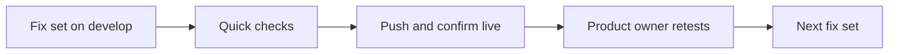

# UI fix plan

The ordered work list for fixing the product after the first testing round on 2026-09-12. It is built from everything in `testing/Developer/` and `testing/Product/`, and it is worked through the UI fix loop: fix on `develop`, run quick checks, push, confirm live, and the product owner retests.

Written for the product owner and for whoever does the fixing. Nothing in it is built yet.

## Table of contents

- [How to use this plan](#how-to-use-this-plan)
- [Where the list comes from](#where-the-list-comes-from)
- [Decisions that block a fix set](#decisions-that-block-a-fix-set)
- [Batch 1: screens and pages](#batch-1-screens-and-pages)
- [Batch 2: answers](#batch-2-answers)
- [Developer follow-through](#developer-follow-through)
- [Dropped from the developer specification](#dropped-from-the-developer-specification)
- [Status](#status)

## How to use this plan

- Work one fix set at a time, in order. A set is 1 to 6 related changes that ship together.
- Each set says what you will see, which requirements it closes, the likely files, the checks run before pushing, and which tests in `Product/Product_workflows.md` to redo.
- When a set ships, its status in the table at the end changes, and so do the matching requirements in section 11 of `Product/reports/2026-09-12_consistency_and_test_1.md`.
- File lists are where the change most likely lives, from today's reading of the code. Treat them as a starting point, not a promise.

## Where the list comes from

| Source | What it contributed |
|---|---|
| `Product/reports/2026-09-12_consistency_and_test_1.md` | Requirements R1 to R46, every decision, and the fix order |
| `Product/feedback/inbox/2026-09-12_first_impressions.md` | Loading feel, scientist character, answer formatting, the mode info button, all three layers. Already folded into R24, R27, R29 and R31 |
| `Developer/reports/2026-09-12_walkthrough/` | Refusal rates, the broken first sentence, the uncited note, frozen Stop. Already folded into R32 to R34 and R45 |
| `Developer/reports/2026-09-12_reference_comparison/` | The Integrations layout and disclaimer size. Already in R15, R19, R41 and R42 |
| `Developer/Developer_workflows.md` | Four open items the requirement list did not have, added below as D1 to D4, plus stale items dropped at the end |

The four additions from the developer specification:

| ID | Item | Why it matters now |
|---|---|---|
| D1 | When the shared daily cap on anonymous searches is hit, the purpose-written message never reaches the screen (W-GUEST-11) | Once the five-search limit is gone, that cap is the only limit a guest can hit, so its message has to be right. Verify first: it may have changed since the specification was written |
| D2 | The answer depth can be changed while a search is running (W-CTRL-05) | Relevant once there are two modes with very different answers |
| D3 | The automated test harness fakes the AI model but not the knowledge graph, so no automated test can see a real answer | Batch 2 changes answers, and without this only hand testing can check them |
| D4 | The frontend test suite gives different results depending on machine load, and journey 7 selects navigation items the wrong way inside a `.catch()`, so it has probably never navigated | Quick checks before each push need to be trustworthy |

## Decisions that block a fix set

From section 12 of the report. Everything else is decided.

| Decision | Blocks | Recommendation |
|---|---|---|
| X3: accept that one Log in button reveals whether an email is registered | Set 1 | DECIDED: accepted for the prototype |
| X4: what happens to the spending caps when the guest limit goes | Set 1 | DECIDED: keep the per-search cap, and raise the anonymous daily cap from 200 to 1,000. It is the only working limit on total anonymous spend, since the system-wide daily cap does not fire today |
| X5: whether answers carry a medical-advice notice | Set 9 | DECIDED: a small grey line under Plain language answers only, R47 |
| X6: whether hiding the navigation below 720px is right | Set 2 | DECIDED: keep the "More pages" menu, which already works |
| X7: approve the consistency run of about 150 real searches | Set 10 | DECIDED: a baseline run now, before any answer fix, then again after sets 7, 8 and 9 |
| X8: raise the per-search cost cap, only if full-page answers are cut short | Set 9, only if it happens | Decide when measured |

## Batch 1: screens and pages

### Set 1: let people in

What you will see: no guest limit and no walls. One Log in button, where a new email creates the account. Log out goes to the home page.

Progress, 2026-09-12. Marks: ✅ built and passing checks on this machine, 🚀 live on develop, 👍 you retested and approved. Nothing is live until the push after the consistency baseline.

| Requirement | What | Built | Live | Approved |
|---|---|---|---|---|
| R1 | No five-search guest limit | ✅ | | |
| R2 | No "used your free searches" or "moved into an account" walls, no dots | ✅ | | |
| R3 | No ten-attempt guest limit | ✅ | | |
| R4 | Per-search cap, anonymous daily cap and per-connection share kept | ✅ code kept. Raising the daily cap to 1,000 on develop waits for your yes at push | | |
| R5 | One Log in button: a new email creates the account, a wrong password says so | ✅ | | |
| R6 | Log out lands on the search home page, from any screen | ✅ | | |
| D1 | The daily cap message reaches the screen | ✅ already worked, now also shown on the home page | | |
| R37 | `Product_workflows.md` tests 3 and 5 rewritten, tests 4, 16 and 20 marked removed | ✅ | | |

| | |
|---|---|
| Requirements | R1, R2, R3, R4, R5, R6, D1, and R37 for tests 3, 4, 5, 16 and 20 |
| Likely files | `src/system_03_search_agent/adapters/web_sse/app.py`, `src/system_03_search_agent/data/guest_sessions.py`, `src/system_03_search_agent/auth/router.py`, `frontend/src/components/auth/AuthGate.tsx`, `frontend/src/components/guest/GuestAllowance.tsx`, `frontend/src/App.tsx` |
| Checks before push | Auth and guest API tests, `AuthGate` unit tests, the auth end-to-end spec, lint |
| You retest | Tests 1, 3 and 6 |
| Blocked by | Nothing. X3 and X4 are decided. Raising `ANON_DAILY_RUN_CAP` to 1,000 on develop is an environment change, confirmed with the product owner when applied |

Implementation notes, from scouting the code on 2026-09-12, before any edit:

- Guest limit, server side: `adapters/web_sse/app.py`. `GET /v1/allowance` computes a blocked reason around lines 689 to 747, and `POST /v1/query` enforces it around lines 1103 to 1191: `spend_one_anonymous_run` from `data/guest_sessions.py` returns the 429 `anon_daily_cap_reached`, the 403 `guest_allowance_exhausted`, and the 403 `guest_attempt_limit_reached`. Plan: stop enforcing the five-answer allowance and the ten-attempt ceiling, while keeping the anonymous daily cap and the per-connection share, which live in the same spend call.
- Guest limit, web app: `frontend/src/App.tsx`. The walls are set around lines 882 to 900. The "moved into an account" wall comes from `guestMigrated` around line 703, which blocks a signed-out browser that once signed up. Plan: mint a fresh guest token instead of walling. `GuestAllowance` and `SignInWall` render at lines 1110 and 1152.
- One Log in button: no server change needed. `POST /auth/signup` returns 201 for a new email and 409 for an existing one, and `POST /auth/login` returns tokens or 401. So Log in tries signup first: 201 means log in, 409 means log in with the password, and 401 then means a wrong password for a registered email, which decision X3 accepts showing. `AuthGate.tsx` holds a long comment explaining the old two-button choice, which gets replaced rather than left contradicting the code.
- Log out: the handler is at `App.tsx` line 1202 and should also route to the home page.
- D1: the 429 `anon_daily_cap_reached` path in `App.tsx` needs checking, to confirm it reaches its written message.
- Tests that will change, because the requirement changed rather than to make them pass: `tests/system_03_search_agent/data/test_guest_sessions.py`, `adapters/web_sse/test_phase_4_10_premise.py`, `adapters/web_sse/test_streaming_endpoints.py`, `auth/test_router.py`, `frontend/src/App.test.tsx`, `frontend/src/phase410Premise.test.tsx`, `frontend/src/components/auth/AuthGate.test.tsx`, `frontend/e2e/guest-allowance-wall.spec.ts` and `frontend/e2e/auth-signin-and-errors.spec.ts`. Each change gets named in the commit message.

### Set 2: a steady frame

What you will see: the white box stays one width from progress to answer. The header and footer stay put, both in the lighter NCBI blue, with smooth changes between screens. New search is a filled blue button. The sign-in box is centred.

| | |
|---|---|
| Requirements | R7, R8, R9, R10, R11, R12, and decision X9: three approved logo colours for the blue header |
| Likely files | `frontend/src/components/shell/AppShell.tsx`, `frontend/src/components/screens/RunScreen.tsx`, `frontend/src/components/screens/AnswerScreen.tsx`, `frontend/src/components/auth/AuthGate.tsx`, `frontend/src/App.tsx`, `frontend/src/theme.ts` |
| Checks before push | Frontend unit tests for those screens, the accessibility and routing end-to-end specs, `tracker/check_design_tokens.py` reporting zero problems, a browser screenshot at 1280px and 390px |
| You retest | Tests 1, 2, 3, 9 and 11 |
| Blocked by | Nothing. X6 is decided: the phone navigation keeps "More pages" |

### Set 3: refusals and Stop

What you will see: refusals show a calm grey label naming the reason, and the NCBI search address is a link. Pressing Stop shows "Search stopped" with Run again and New search.

| | |
|---|---|
| Requirements | R13, R14, R44, R45 |
| Likely files | `frontend/src/components/screens/AnswerScreen.tsx`, the refusal notice component, `frontend/src/components/screens/RunScreen.tsx`, `frontend/src/components/chat/StopButton.tsx` |
| Checks before push | Refusal and Stop unit tests, the cite-or-refuse and query-stream-and-stop end-to-end specs |
| You retest | Tests 8, 9, 13 and 19 |
| Blocked by | Nothing |

### Set 4: stay signed in, history on phones

What you will see: a reload keeps you signed in. On a phone, the history button opens your searches in a panel that slides in.

| | |
|---|---|
| Requirements | R46 |
| Likely files | `frontend/src/App.tsx`, `frontend/src/lib/guestSession.ts`, `frontend/src/components/answer/FollowUp.tsx`, `src/system_03_search_agent/auth/router.py` if the refresh token needs a new home |
| Checks before push | Auth unit tests, the rail-collapse end-to-end spec, a browser check at 390px |
| You retest | Tests 3, 6 and 11 at phone width |
| Blocked by | Nothing. How the session survives a reload is an implementation choice, and it is stated in the push note |

### Set 5: Integrations and the disclaimer

What you will see: an Integrations page in the reference layout with four equal cards, summary chips and API documentation below. The Docs tab is gone. A larger disclaimer with fuller wording. The GraphQL example works as printed, and MCP accepts connections.

| | |
|---|---|
| Requirements | R15, R16, R17, R18, R19, R41, R42 |
| Likely files | `frontend/src/components/screens/InfoScreens.tsx`, `frontend/src/components/shell/AppShell.tsx`, `frontend/src/lib/routing.ts`, `frontend/src/components/shell/DisclaimerModal.tsx`, `src/system_03_search_agent/adapters/mcp/`, `src/system_03_search_agent/adapters/web_sse/app.py` |
| Checks before push | Unit tests for those screens, the routing spec, a live GraphQL call and a live MCP initialize call on develop |
| You retest | Tests 11 and 15 |
| Blocked by | X5, which only decides whether answers also need a notice |

## Batch 2: answers

### Set 6: let automated checks see a real answer

What you will see: nothing on screen. It lets the answer fixes be checked automatically, not only by hand.

| | |
|---|---|
| Requirements | D3 |
| Likely files | `tests/e2e_support/mock_llm_backend.py`, `frontend/playwright.config.ts` |
| Checks before push | An end-to-end run that asserts on a real answer body, not only that the screen rendered |
| You retest | Nothing |
| Blocked by | Nothing |

### Set 7: a conversation that remembers

What you will see: "What variants cause it?" answers about BRCA1. "Yes, go deeper" continues the same search. A follow-up stays on the same screen, with the earlier answer shrinking above.

| | |
|---|---|
| Requirements | R20, R21, R22 |
| Likely files | `src/system_03_search_agent/core/graph.py` (guardrail, think and plan steps), `src/system_03_search_agent/core/run.py`, `frontend/src/components/answer/FollowUp.tsx`, `frontend/src/App.tsx` |
| Checks before push | The second-turn and follow-up tests, a live follow-up on develop |
| You retest | Tests 2 and 13 |
| Blocked by | Nothing. First step: trace exactly where the earlier turn is lost |

### Set 8: search every layer, with the scientists

What you will see: every question searches the knowledge graph, live NCBI records, and literature and trials at the same time. The progress screen shows a lead scientist handing off to three random scientists, with steps like "Franklin is searching…".

| | |
|---|---|
| Requirements | R29, R30, R31, R43 |
| Likely files | `src/system_03_search_agent/core/graph.py` (plan and act steps), `src/system_03_search_agent/contracts/events.py` for additive event fields, `frontend/src/components/screens/RunScreen.tsx`, the persona module |
| Checks before push | The tool premise gates, the call budget tests, a live search on develop showing more than one layer in its sources |
| You retest | Tests 1, 7 and 12 |
| Blocked by | Nothing |

### Set 9: answers worth reading

What you will see: two modes, Plain language and Researcher, with an info button. Plain language answers run about 250 words in three paragraphs. Researcher answers run a full page with short topic headings. Answers stream in sentence by sentence and never open broken. One plain trust line replaces the pills, and the depth cannot change mid-search.

| | |
|---|---|
| Requirements | R23, R24, R25, R26, R27, R28, R32, R33, R36, R40, R47, D2 |
| Likely files | `src/system_03_search_agent/synthesis/findings.py`, `src/system_03_search_agent/synthesis/trust.py`, `src/system_03_search_agent/synthesis/disease_names.py`, `src/system_03_search_agent/core/graph.py` (write step), `frontend/src/components/controls/DepthControl.tsx`, `frontend/src/components/screens/AnswerScreen.tsx` |
| Checks before push | Synthesis and grounding tests, the cite-or-refuse tests, a live answer at each mode on develop |
| You retest | Tests 1, 7 and 12 |
| Blocked by | X8, only if full pages start getting cut short |

### Set 10: reliable flagship answers, and saved history

What you will see: BRCA1 and GCK answer every time. Clicking a history item shows the saved answer at once, with Run again.

| | |
|---|---|
| Requirements | R34, R35, R38, and R39 once the run is steady |
| Likely files | The refusal path in `src/system_03_search_agent/core/graph.py`, the history endpoint in `src/system_03_search_agent/adapters/web_sse/app.py`, `frontend/src/components/answer/FollowUp.tsx` |
| Checks before push | The consistency run: each of the 50 golden questions 3 times. A baseline runs before any answer fix, then again after sets 7, 8 and 9 |
| You retest | Tests 1, 6 and 13 |
| Blocked by | Nothing. X7 is decided |

## Developer follow-through

Done alongside the sets above, not as sets of their own:

- D4: fix the load-dependent frontend tests and journey 7's navigation before relying on them in quick checks. Best done during set 2.
- R37: update `Product/Product_workflows.md` in the same push as each set that changes a test.
- Any file added, renamed or repurposed under `src/` updates `docs/build/Debugging_guide.md` in the same commit, which CI enforces.
- Each set updates section 11 of the report and the status table below.

## Dropped from the developer specification

Stale or no longer relevant, so not carried into this plan:

| Item in `Developer/Developer_workflows.md` | Why dropped |
|---|---|
| W-identity-9, a conversation surviving sign-out | Fixed in PR #93, confirmed in the walkthrough |
| W-thread-8, a no-data refusal rendering as prose | Fixed in PR #93, and test 19 worked extremely well |
| Defects 1 to 3: sign-in design, app bar collision, missing disclosures | Fixed in PR #93 |
| W-GUEST-4, W-GUEST-5, W-GUEST-7, W-GUEST-8, W-GUEST-10, and defect 8 | All about the guest limit, which set 1 removes |
| Defect 11, undesigned surfaces | Decided on 2026-09-05: designed one at a time as each is built |
| Clarifying questions for ambiguous queries | Not built, and not asked for in this round |

## Status

| Set | Batch | Status |
|---|---|---|
| 1. Let people in | Screens | ✅ Built on 2026-09-12, 8 of 8 items. Not pushed yet: the push waits until the consistency baseline finishes, so a restart does not skew it |
| 2. A steady frame | Screens | Not started |
| 3. Refusals and Stop | Screens | Not started |
| 4. Stay signed in, history on phones | Screens | Not started |
| 5. Integrations and the disclaimer | Screens | Not started |
| 6. Automated checks see a real answer | Answers | Not started |
| 7. A conversation that remembers | Answers | Not started |
| 8. Search every layer, with the scientists | Answers | Not started |
| 9. Answers worth reading | Answers | Not started |
| 10. Reliable flagship answers, and saved history | Answers | Not started |
| Consistency baseline | Before any answer fix | Paused by the product owner on 2026-09-12 so screen fixes come first; rerun before set 6. Partly valid, rerun needed. Finished 2026-09-12, but only 85 of 150 runs really ran: 65 were refused before starting, most or all by the signed-in daily limit of 100, because all runs used one account. Of the 85: 13 answered (15%), 54 refused for no evidence (64%), 12 crashed mid-run (14%), 6 refused as off-topic. 15 of 32 questions gave different outcomes across runs, and only 2 answered every time. No Layer 3 call was seen. Next: rerun the 65 across fresh test accounts, recording each error's message |
