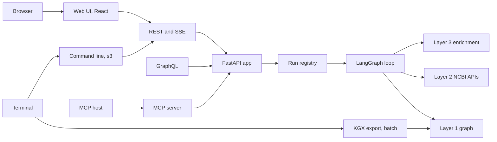
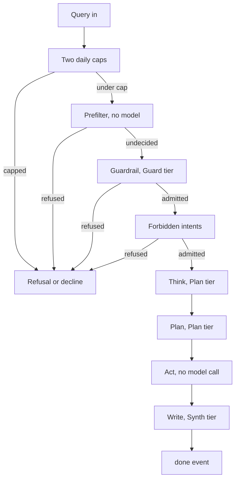
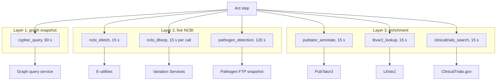
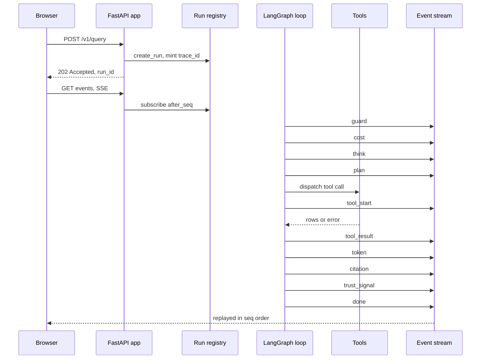
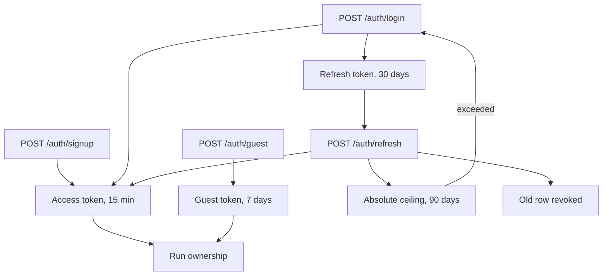
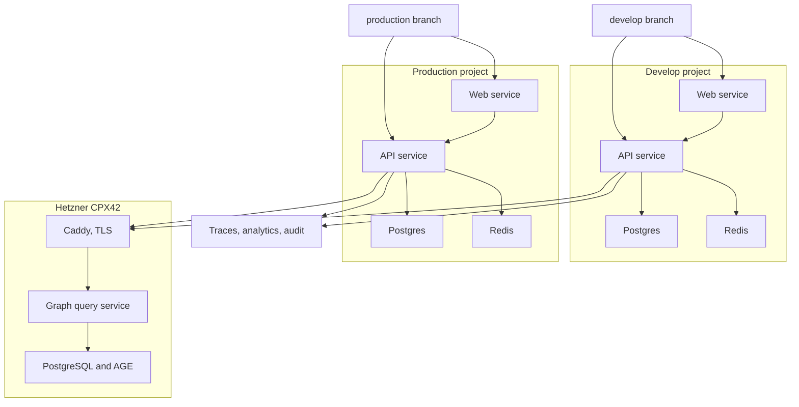

# Architecture diagram: System 3 search agent

System architecture for System 3, the agentic search layer over the NCBI knowledge graph. Five delivery surfaces sit in front of one FastAPI application and one five-node LangGraph loop, and that loop reaches three data layers through seven typed tools. Systems 1 and 2, the data pipelines and the graph build, live in a separate repository; this one reads their output and never writes to it.

## Table of contents

- [The big picture](#the-big-picture)
- [The five-step agent loop](#the-five-step-agent-loop)
- [The three data layers and the seven tools](#the-three-data-layers-and-the-seven-tools)
- [The request lifecycle](#the-request-lifecycle)
- [Auth and identity](#auth-and-identity)
- [Deployment and observability](#deployment-and-observability)

## The big picture

One FastAPI application serves every surface. The web UI, the REST and SSE endpoints, the GraphQL surface and the MCP server all enter through the same application object, so a question asked from a browser and a question asked from an MCP host run the identical loop and get the identical event stream. The command line client is a client of the REST and SSE endpoints rather than a second server. KGX export is the one surface that does not touch the loop at all: it is a batch job that reads a query-scoped subgraph straight out of Layer 1.

The surfaces and their entry points:

- Web UI: a React single-page app with a home screen, a run screen, an answer screen, an about screen and an integrations screen.
- REST and SSE: `POST /v1/query` creates a run, `GET /v1/query/{run_id}/events` streams it, plus stop, feedback, citations, history, persona, allowance and health.
- GraphQL: one `ask` mutation, one `stopRun` mutation, and `run` and `citations` queries, mounted at `/graphql`.
- MCP server: one tool, `ask_biomedical_question`, mounted at `/mcp` on the same application.
- Command line: the `s3` console script with `ask`, `stop` and `login` subcommands, talking to the REST and SSE endpoints.
- KGX export: the `s3-kgx-export` console script, taking one or more seed CURIEs and writing `nodes.tsv`, `edges.tsv` and `manifest.json`.

Where this lives: `src/system_03_search_agent/adapters/web_sse/app.py`, `adapters/graphql/`, `adapters/mcp/server.py`, `adapters/cli/`, `src/system_03_search_agent/export/`, `frontend/src/App.tsx`, `pyproject.toml`.

## The five-step agent loop

Every query runs the same five nodes in a fixed sequence. Four of them make exactly one model call each, on the tier that matches the work. Act makes no model call at all; it dispatches tool calls.

The deterministic controls are what make the loop safe, not the prompts. A non-model prefilter runs ahead of the Guard call. A cost cap is checked immediately before every model call. A call budget bounds how many Layer 2 and Layer 3 calls one query may make. Write refuses rather than answering when nothing citable came back.

Which tier runs which step, and what bounds it:

- Guardrail: Guard tier, one call, per-step budget 15 seconds. The prefilter and the forbidden-intent screen around it are pure code and cost nothing.
- Think: Plan tier, one call, per-step budget 45 seconds. Classifies the query into one of five shapes and resolves entities, live-confirming every model-extracted span before it contributes a CURIE.
- Plan: Plan tier, one call, per-step budget 45 seconds. Chooses the tool calls.
- Act: no model call. Its budget comes from the query class rather than a tier, from 15 seconds for a lookup up to 120 seconds for an exploratory query, and it is raised to a tool's own floor when the tool declares a longer one.
- Write: Synth tier, one call, per-step budget 45 seconds. Emits tokens, citations, trust signals and the terminal `done` event.

The deterministic controls, in the order a query meets them:

- Per-user daily query cap and system-wide daily cost cap: checked once, in Guardrail, before any model call fires.
- Prefilter: a non-model screen for injection, medical advice and off-topic input. It can refuse, never admit.
- Per-query cost cap: checked immediately before each model call, never after. A cap hit routes straight to Write, which ships a partial result rather than a blank failure.
- Call budget: at most 20 Layer 2 and Layer 3 calls per query, counted at the transport rather than at Act, plus a queue wait ceiling derived from the calling query's own latency budget.
- Cite or refuse: a claim with no retrieved row behind it does not ship. Write classifies what Act actually found and chooses `answer`, `flag`, `ask` or `refuse`.

Where this lives: `src/system_03_search_agent/core/graph.py`, `harness/harness.py`, `harness/tiers.py`, `harness/cost_control.py`, `harness/call_budget.py`, `src/system_03_search_agent/guardrail/`.

## The three data layers and the seven tools

Each tool reaches exactly one layer, and one access path within that layer. Layer 1 is the pre-ingested graph, a periodic snapshot read over an authenticated HTTPS query service. Layer 2 is live NCBI data at query time. Layer 3 is the enrichment APIs. The model never chooses a timeout: each tool carries a declared per-call budget in code, and the transport enforces the rate-limit pool for its API family.

| Tool | Layer | Per-call budget in code | Rate-limit pool |
| --- | --- | --- | --- |
| cypher_query | Layer 1 | 90 seconds | Not an NCBI API. Row limit 500, plus a per-caller limit at the service |
| ncbi_efetch | Layer 2 | 15 seconds, one backoff retry | E-utilities, 3 requests per second by default |
| ncbi_dbsnp | Layer 2 | 15 seconds per call, two sequential calls | Variation Services, 1 request per second |
| pathogen_detection | Layer 2 | 120 seconds total, 60 seconds per transfer | Bulk FTP snapshot, bounded by transfer time |
| pubtator_annotate | Layer 3 | 15 seconds | Provisional 5 requests per second |
| litvar2_lookup | Layer 3 | 15 seconds | Provisional 5 requests per second |
| clinicaltrials_search | Layer 3 | 15 seconds | Provisional 5 requests per second |

Two classification calls in that table are deliberate rather than mechanical. `cypher_query`'s 90 seconds is measured, not inherited: the plan-tier generation call that writes the Cypher was measured at a mean of 25 seconds and a worst case near 40 seconds before the graph is touched at all, so a 30 second budget could not complete. `pathogen_detection` is Layer 2 rather than Layer 3 because it is an NCBI-native bulk source, not one of the four enrichment APIs.

Where this lives, all under `src/system_03_search_agent/tools/` except the last:

- `graph_schema_constants.py`: the graph budget and the row limit.
- `ncbi_transport.py`: the shared HTTP budget and every rate-limit pool.
- `pathogen_ftp_transport.py`: the bulk transfer budget.
- `.claude/rules/tool-call-budgets.md`: the policy behind all of them.

## The request lifecycle

A query is created and streamed in two separate HTTP calls. `POST /v1/query` validates the caller, registers a run and returns `202 Accepted` with a run id; the loop then runs in the background writing events into the run registry. `GET /v1/query/{run_id}/events` subscribes to that run and replays from a sequence number, so a reconnecting browser never loses the events it already missed. Every event carries the same `trace_id`, which is the single join key across the event stream, the interactions table, the traces and the audit log.

The event types, in the order a complete run emits them:

- `guard`: the Guardrail verdict, with a category and an optional reason.
- `think`: the narrative, the query class, and the resolved entities.
- `plan`: the narrative and the chosen tool calls.
- `tool_start` and `tool_result`: one pair per tool call, sharing a `call_id`.
- `token`: the answer text as it streams, with marker ids for inline citation chips.
- `citation`: one per claim that earned one, carrying the full provenance record.
- `trust_signal`: the per-claim verdict, and the answer-level verdict.
- `cost`: emitted after each successful model call, carrying the running spend against the cap.
- `error`: emitted at any point, scoped to a tool, a step or the whole run.
- `done`: the terminal event, with total cost, tool-call count, elapsed time, the trust outcome and an optional next step.

Where this lives: `src/system_03_search_agent/contracts/events.py`, `core/run_registry.py`, `core/run.py`, `adapters/web_sse/app.py`, `frontend/src/lib/events.ts`.

## Auth and identity

Three identities can ask a question. An account holder presents a bearer token. A guest presents a signed guest token. An anonymous caller presents nothing at all and runs against a server-side allowance.

An account gets a short-lived bearer token for API calls plus a long-lived refresh token that rotates on every use. A guest token is bound to a server-side row tracking the allowance it has spent, so a guest can try the product without creating an account, and the server rather than the client decides when the allowance is gone.

What each piece does:

- Access token: a signed token with a 15 minute lifetime, carrying the user id. It is what every authenticated API call presents.
- Refresh token: stored only as a hash, with a 30 day idle expiry. Presenting it mints a new pair and revokes the row presented, so a stolen token buys one rotation and then breaks the chain for everyone.
- Absolute ceiling: 90 days from the login that started the chain, carried forward unchanged through every rotation, so a continuously rotating holder still expires.
- Guest token: a signed token with a 7 day lifetime, bound to a `guest_sessions` row that counts runs used and can be revoked or migrated into a real account.
- Run ownership: every run records an owner identity, and reading or stopping a run checks it, so one caller never reads another caller's stream.

Where this lives: `src/system_03_search_agent/auth/tokens.py`, `auth/guest.py`, `auth/router.py`, `auth/dependencies.py`, `src/system_03_search_agent/data/models.py`, `core/run_registry.py`.

## Deployment and observability

There are two deployments, and they are two separate hosting projects rather than two environments inside one, because a service's git source is set per service and two environments in one project cannot watch two branches. Each project carries its own web service, its own API service, its own Postgres, its own Redis and its own signing secret. That isolation is the point: a develop credential never reaches production, and test traffic never spends production's daily caps. Both deployments read the same Layer 1 graph, which is safe because Layer 1 access is read-only at the connection level.

The graph hop, which is the part most often misread as a direct database connection:

- Transport: an authenticated HTTPS endpoint, not a hand-opened SSH tunnel. The swap lives inside the connection module and dispatches on a single environment value, so the tool's schema and its call sites never changed.
- Fronting: Caddy terminates TLS with an automatically issued certificate. The query service itself binds loopback, so the proxy is the only way in.
- Credential: the existing read-only graph role. Nothing in this repository holds a credential that can write.
- Re-validation: the service re-runs this repository's own Cypher validator, copied to the box and asserted byte-identical by a drift check, so the two validators cannot diverge.

The three observability records, each with one job so that no single outage blinds the picture:

- Per-run tracing: one trace per run, joined to everything else on `trace_id`, with account identifiers proven absent by reading traces back out of the service.
- Behavioural analytics: aggregates only, on a project-scoped token. A privileged key is refused by prefix so it cannot be used for capture.
- Tool-call audit log: append-only JSONL, one line per Layer 1, Layer 2 and Layer 3 access, recording the authorization by identifier and never by value. The hook sits at the three transport chokepoints rather than at Act, because several production call sites reach a data layer without passing through Act.

Before any expensive agent run, `tracker/preflight.py` probes one endpoint per transport. It covers the product's own model provider, the build harness's separate provider, then the graph. It proves a transport answers, never that it answers correctly.

Where this lives: `docs/build/Release_flow.md`, `services/graph_query_service/`, `src/system_03_search_agent/tools/graph_http_transport.py`, `src/system_03_search_agent/observability/`, `tracker/preflight.py`.

References:

- [Schema_visualization.md](Schema_visualization.md): the graph slice, the event contract, the provenance type, and the user-data schema
- [docs/architecture/Three_layer_data_architecture.md](../docs/architecture/Three_layer_data_architecture.md): the layer model in full
- [docs/data-engineering/Knowledge_graph_on_server_reference.md](../docs/data-engineering/Knowledge_graph_on_server_reference.md): the live graph reference
- [docs/build/Debugging_guide.md](../docs/build/Debugging_guide.md): which file to open when something is wrong
- [docs/build/Release_flow.md](../docs/build/Release_flow.md): how a change reaches production

Last updated: 2026-09-13
