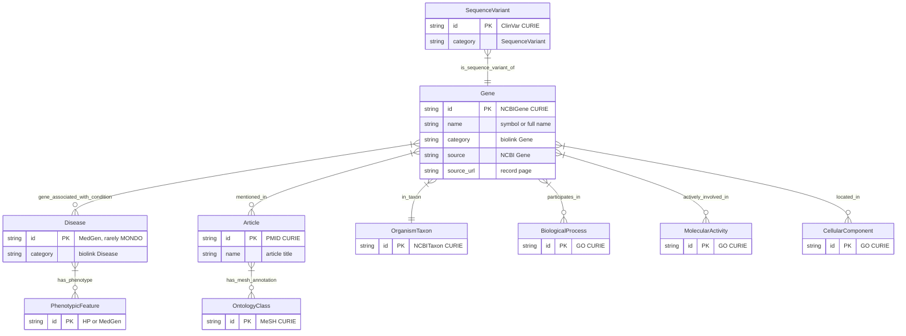
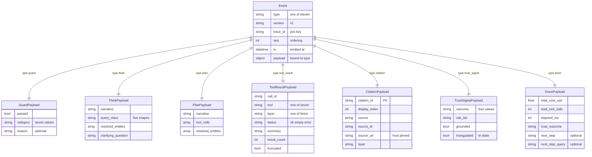
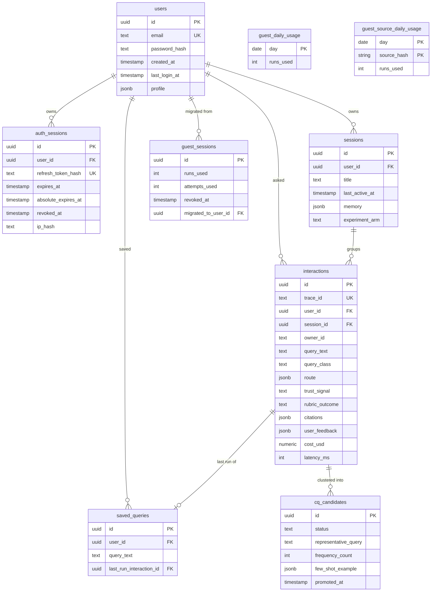

# Schema visualization: System 3 search agent

The schemas System 3 either owns or reads. It owns four of them: the event contract, the citation and provenance type, the user-data schema in PostgreSQL, then the input and output schema of each of the seven tools. It reads, and never writes, the Layer 1 knowledge graph that Systems 1 and 2 build. Every field below was read out of this repository's own code rather than from a specification, and where the code and the locked specification disagree the divergence is stated rather than smoothed over.

## Table of contents

- [The Layer 1 graph slice the agent queries](#the-layer-1-graph-slice-the-agent-queries)
- [Provenance on every node and edge](#provenance-on-every-node-and-edge)
- [The event contract](#the-event-contract)
- [The citation and provenance type](#the-citation-and-provenance-type)
- [The user-data schema in PostgreSQL](#the-user-data-schema-in-postgresql)
- [Tool input and output schemas at a glance](#tool-input-and-output-schemas-at-a-glance)

## The Layer 1 graph slice the agent queries

The graph is one Apache AGE graph called `ncbi_kg`. It holds 115,406,761 nodes and 693,295,991 edges across 11 vertex labels and 14 edge labels.

The label set is hardcoded in this repository rather than queried at runtime, and that is deliberate. It sits inside the stable prompt prefix. A per-request read of a live source would break that prefix's byte-stability and re-bill every cached prompt.

The eleventh label, `NamedThing`, is not in that diagram because it is not a concept: it is the dangling-endpoint stub the five-database merge injects when an edge points at a node no pipeline produced. It is included in the hardcoded label list anyway, because a generator that cannot name a label cannot query it, and a result landing on one is a signal that the upstream pipeline had a gap.

| Vertex label | Rows | Source | Typical CURIE prefix | Sample CURIE |
| --- | --- | --- | --- | --- |
| Gene | 67,536,325 | NCBI Gene plus orthologs | NCBIGene: | NCBIGene:672 |
| Article | 40,387,670 | PubMed | PMID: | PMID:34567890 |
| SequenceVariant | 4,467,468 | ClinVar | ClinVar: | ClinVar:17660 |
| OrganismTaxon | 2,736,611 | NCBI Taxonomy | NCBITaxon: | NCBITaxon:9606 |
| Disease | 200,845 | MedGen | MedGen:, rarely MONDO: | MedGen:C0031485 |
| BiologicalProcess | small | GO via Gene | GO: | GO:0006096 |
| MolecularActivity | small | GO via Gene | GO: | GO:0004340 |
| CellularComponent | small | GO via Gene | GO: | GO:0005739 |
| OntologyClass | small | MeSH via PubMed | MeSH: | MeSH:D012345 |
| PhenotypicFeature | small | MedGen | HP:, MedGen: | HP:0001250 |
| NamedThing | roughly 81,000 | merge stubs | mixed | any |

| Edge label | Rows | Endpoints |
| --- | --- | --- |
| has_mesh_annotation | 349,158,184 | Article to OntologyClass |
| mentioned_in | 124,014,037 | Gene to Article |
| in_taxon | 67,536,348 | Gene to OrganismTaxon |
| actively_involved_in | 44,831,987 | Gene to MolecularActivity |
| participates_in | 40,767,983 | Gene to BiologicalProcess |
| located_in | 31,890,737 | Gene to CellularComponent |
| orthologous_to | 17,418,089 | Gene to Gene |
| has_phenotype | 6,076,735 | Disease to PhenotypicFeature |
| is_sequence_variant_of | 4,407,252 | SequenceVariant to Gene |
| cited_in | 3,924,906 | Article to Article |
| subclass_of | 2,832,513 | OntologyClass to OntologyClass |
| close_match | 410,000 | mixed |
| gene_associated_with_condition | 7,648 | Gene to Disease |
| exact_match | 970 | mixed |

Two facts about this slice change how queries get written, and both are recorded in this repository rather than inferred:

- Eleven labels, not ten. The locked technical specification says ten concept labels. The reference document and the live graph both carry eleven, the extra one being `NamedThing`, and the code follows the graph. This is a reconciliation item, not a bug, and the figure is not to be reverted to ten to match the specification.
- Most diseases carry a `MedGen:` prefix rather than `MONDO:`. A query written against MONDO returns nothing for almost every disease, which looks identical to the disease not being in the graph.

Where this lives:

- `src/system_03_search_agent/tools/graph_schema_constants.py`: the label, endpoint and prefix constants.
- `src/system_03_search_agent/tools/schema_slice.py`: the per-query slice handed to the generator.
- `docs/data-engineering/Knowledge_graph_on_server_reference.md`: the counts.

## Provenance on every node and edge

Provenance is not a convenience field here, it is the whole trust argument: an answer is only shippable if every claim in it links back to the record it came from. Nodes and edges do not carry the same properties, and that asymmetry was found by probing the live graph rather than by reading a schema.

| Property | On a node | On an edge | What it is |
| --- | --- | --- | --- |
| `id` | Yes | No | The CURIE Systems 1 and 2 stamped at ingest. Never the graph's internal integer id |
| `category` | Yes | Not applicable | The BioLink category |
| `name` | Usually | No | The plain-language label, when the upstream pipeline produced one |
| `source` | Yes | Yes | The source database |
| `source_url` | Yes | Yes | The record page the citation resolves to |
| `agent_type` | No | Yes | How the assertion was made |
| `knowledge_level` | No | Yes | How strong the assertion is |

A real AGE edge carries no `id` property at all. That matters because an edge with no CURIE of its own cannot cite itself, and passing its stored `source_url` through unchecked once shipped a citation that pointed at a genuine but different record.

The current behaviour is strict. The resolver first tries to reverse-derive a verified CURIE from the edge's own stored URL. Failing that it falls back to an endpoint vertex's CURIE, marking the row as citing an endpoint's record rather than the edge's own identity. When neither verifies, `source_url` is absent and the cite-or-refuse gate drops the row instead of emitting an uncited or misattributed one.

Where this lives: `src/system_03_search_agent/tools/cypher_provenance.py`, `tools/cypher_schemas.py`, `tools/agtype.py`.

## The event contract

One envelope carries every event on every surface. The envelope is versioned at `v1`, and `payload` is validated against the model that matches the declared `type` at construction time, so a mismatched or arbitrary payload never gets built rather than being caught downstream. Within `v1`, changes are additive only: a new optional field or a new enum value is allowed, while removing a field or changing one's meaning needs a `v2`.

| Event type | Payload fields and bounds |
| --- | --- |
| `guard` | `passed` bool. `category` one of `ok`, `off_topic`, `medical_advice`, `injection`, `rate_limited`, `cost_capped`, `write_seeking`. `reason` optional, 256 chars |
| `think` | `narrative` 500 chars. `query_class` one of `lookup`, `single_hop`, `multi_hop`, `aggregate`, `exploratory`. `resolved_entities` at most 20. `clarifying_question` optional, 500 chars |
| `plan` | `narrative` 500 chars. `tool_calls` at most 20. `resolved_entities` at most 20 |
| `tool_start` | `call_id` 64 chars. `tool`, `layer`. `status` one of `running`, `ok`, `empty`, `error` |
| `tool_result` | The `tool_start` fields with `status` re-narrowed to `ok`, `empty`, `error`, plus `summary` 1000 chars, `result_count` at least 0, `truncated` bool |
| `token` | `text` 1000 chars. `marker_ids` at most 20 |
| `citation` | The full provenance record. See the next section |
| `trust_signal` | `outcome`, `risk_tier` 16 chars, `grounded` bool, `triangulated` tri-state, `citation_id` optional, `scope` `claim` or `answer`, `message` optional, `fallback_link` host-pinned |
| `cost` | `query_cost_usd`, `query_cap_usd`, `cap_fraction`, all at least 0. `model_tier` one of `guard`, `plan`, `synth` |
| `error` | `fatal` bool. `scope` `tool`, `step` or `run`. `source` 64 chars. `error_class` one of `transient`, `recoverable`, `unexpected`, `cancelled`. `message` 256 chars. `retry_after_s` at least 0 |
| `done` | `total_cost_usd`, `total_tool_calls`, `elapsed_ms`, all at least 0. `trust_outcome`. `next_step` optional, 200 chars. `next_step_query` optional, 2000 chars, the question a surface sends when the reader accepts `next_step` |

Three details in that table carry more weight than their size suggests:

- `status: "running"` exists on `tool_start` and is refused on `tool_result`. A start event is written the instant before dispatch, so its outcome does not exist yet; emitting `ok` there would assert success before the fact. Re-narrowing on the result keeps "finished and still running" unrepresentable.
- `triangulated` is a tri-state on purpose. Absent means triangulation was never evaluated, which is a different statement from evaluated and did not concord.
- `next_step` is built in code from findings retrieval actually returned and the answer did not report, never generated by a model. An invented follow-up is a claim that something deeper exists, which would route around cite-or-refuse through a surface nothing checks.
- `next_step_query` is set together with `next_step` or not at all, and is also built in code (`core/next_step.py`): the offer is a yes/no question for the reader, and this is the real question the surface sends when the reader accepts it, naming the omitted records' type and the turn's entity, for example "Which other sequence variant records are linked to BRCA1?". The next turn recognises that shape and puts the records not yet shown first.

Where this lives: `src/system_03_search_agent/contracts/events.py`, mirrored for the browser in `frontend/src/lib/events.ts`.

## The citation and provenance type

A citation is its own event, not a field on something else, and a trust verdict is a third event bound to the citation by shared `citation_id`. That separation is what lets a surface render a per-chip verdict without re-emitting the citation to carry it.

| Field | Bound | What it carries |
| --- | --- | --- |
| `citation_id` | 64 chars | The join key a trust signal binds to |
| `display_index` | at least 1 | The number the reader sees in the answer |
| `source` | 128 chars | The source database or API |
| `source_id` | 128 chars | The record identifier within that source |
| `source_url` | 500 chars, host-pinned | The human-facing record page |
| `layer` | enum | `layer_1_graph`, `layer_2_api` or `layer_3_enrichment` |
| `field` | 128 chars | Which field of the record the claim rests on |
| `claim_text` | 1000 chars | The sentence this citation grounds |
| `evidence_kind` | 64 chars | What kind of evidence it is |
| `assertion_confidence` | 64 chars | How strongly the source asserts it |
| `population_ancestry_context` | optional, 256 chars | The population the finding applies to, when the source states one |
| `license` | 128 chars | The source's licence |
| `snapshot_date` | optional, 32 chars | A real date parsed from the row's own graph snapshot version. Absent for a live call |
| `entity_name` | optional, 256 chars | The record's own plain-language name, when it is present and not a corrupted vocabulary token |

The `source_url` pattern is host-pinned rather than merely requiring HTTPS, and it is anchored at both ends. A pattern anchored only at the start accepts a URL that begins on an allowed host and continues anywhere, which is the exact shape a spoofed citation takes. Two host families are accepted: the NCBI record hosts, and the clinical trials study host, because that tool genuinely cites a different site. The fetch hosts are not accepted: a citation resolves to the record page a person can open, never to the API endpoint the data came from.

The trust fields that ride alongside a citation:

- `outcome`: one of `answer`, `flag`, `ask`, `refuse`. The same vocabulary the terminal `done` event uses.
- `risk_tier`: how much verification this claim's subject matter demands.
- `grounded`: whether the claim was actually tied to a retrieved row.
- `triangulated`: whether independent sources concorded, or absent when that was never evaluated.
- `scope`: `claim` for a per-chip verdict, `answer` for the whole response.
- `message` and `fallback_link`: the refusal payload. The link is host-pinned by the same pattern, because a refusal that links off-site is worse than a refusal with no link.

Where this lives: `src/system_03_search_agent/contracts/events.py` for the payload and the URL pattern, `src/system_03_search_agent/synthesis/` for how a claim earns one.

## The user-data schema in PostgreSQL

Nine tables, built by nine migrations. This is the only database System 3 writes to; Layer 1 is read-only at the connection level. The guest tables exist because an anonymous visitor needs a bounded allowance that the server, not the client, keeps score of.

What each table is for:

- `users`: accounts. `email` carries both a byte-exact unique constraint and a functional unique index on its lowercased form, so two accounts differing only by case cannot exist. `profile` holds preferences such as answer depth.
- `auth_sessions`: one row per refresh-token chain. The token is stored only as a hash. `expires_at` renews on every rotation; `absolute_expires_at` does not, which is what stops a continuously rotating holder from never expiring.
- `sessions`: a conversation thread, with a `memory` column holding the bounded in-conversation session memory. Cross-session persistent memory is deliberately out of scope.
- `interactions`: one row per query, keyed by `trace_id`, which is the same value that joins the event stream, the traces and the audit log. `owner_id` exists because a guest has no `user_id` to key on, and treating a null `user_id` as an identity once let every guest share one ownership.
- `saved_queries`: a user's kept questions, pointing at the last run of each.
- `guest_sessions`: one row per guest identity, with two counters that are not redundant. `runs_used` counts answers and is refunded on a guardrail refusal, so a clumsy question is not punished. `attempts_used` counts every run started and is never refunded, so the refund cannot leave the identity unbounded.
- `guest_daily_usage` and `guest_source_daily_usage`: the system-wide anonymous allowance for a day, and the per-source share of it, so one caller with rotating sources cannot drain the day for everyone else.
- `cq_candidates`: captured questions clustered for the weekly human review, and the promotion path into the few-shot pool.

Where this lives: `src/system_03_search_agent/data/models.py`, `data/guest_sessions.py`, `data/session.py`, and the nine revisions under `alembic/versions/`.

## Tool input and output schemas at a glance

Each of the seven tools declares a typed input and a typed output. Every string field carries a maximum length and every array a maximum item count, and validation runs at each hop rather than only at the boundary. Those bounds are not cosmetic: they cap the blast radius when a single upstream record or API response goes hostile. Four tools use a discriminated union on a mode or action field, so one tool can cover several access paths on the same API without becoming several tools.

| Tool | Input shape and bounds | Output shape and bounds |
| --- | --- | --- |
| `cypher_query` | `query_intent` 1000 chars. `target_entities` at most 10, each 100 chars. `row_limit` 1 to 500, default 100 | `status` `ok`, `empty` or `error`. `rows` at most 500. `cypher_executed` optional, 2000 chars. `error` optional, 500 chars |
| `ncbi_efetch` | Four actions: `search` with `term` 500 chars, at most 5 field tags, `retmax` 1 to 500; `fetch` and `summary` with at most 50 ids; `link` between databases | Records with their identifiers and the fields the action asked for, each bounded, plus a status and an optional bounded error |
| `ncbi_dbsnp` | `query` 200 chars, as an rsid, an HGVS expression or an SPDI. `query_type` selects which. `include_clinical` toggles the second call | `status`, `rsid` 20 chars, `spdi_canonical` 150 chars, `alleles` at most 10, `chrpos` optional, plus clinical fields when asked for |
| `pubtator_annotate` | Two modes: `entity_lookup` with a query and a `limit`, or `annotate_publications` with a bounded PMID list | `status`, `mode`, bounded `entities` and `publications` lists, optional bounded `error` |
| `litvar2_lookup` | Two modes: `variant_search` with a `query` 100 chars, or `publications_lookup` with a `litvar_id` 60 chars | `status`, `mode`, `variant_matches` at most 10, `total_variant_matches` at least 0, plus publication ids |
| `pathogen_detection` | Two modes: `isolate_lookup` with a taxon and a biosample accession, or `cluster_snp_neighbors` with a cluster id and `max_snp_distance` 1 to 50, default 5 | `status` including `timeout`, `mode`, the pinned `pdg_snapshot`, and bounded isolate and cluster lists |
| `clinicaltrials_search` | `query_cond` 200 chars, optional `query_term` and `query_intr` 200 chars each, optional `overall_status` from a fixed set | `status`, `studies` at most 50, `study_count` and `total_count` at least 0, `next_page_token` optional, optional `error` |

Three rules hold across all seven, and each one is load-bearing rather than stylistic:

- One tool reaches one layer and one access path. Bulk snapshot retrieval and a non-NCBI host are genuinely different access paths, so they are separate tools rather than extra actions on an existing one.
- A truncated result is never silent. Every output carries the flag or the count that says so, and the synthesis step reads it, because a result cut to nothing while still reporting success is indistinguishable from finding nothing.
- An error says what to do next. The next step of the loop reads the message and decides whether to retry, wait or proceed with partial results, so a rate-limited or timed-out call names the saturated family and a retry estimate rather than reporting a bare failure.

Where this lives: one `*_schemas.py` module per tool under `src/system_03_search_agent/tools/`, plus `harness/call_budget.py` for the per-query call ceiling those schemas are enforced under.

References:

- [Architecture_diagram.md](Architecture_diagram.md): the surfaces, the loop, the layers, the lifecycle and the deployment
- [docs/architecture/Biolink_repos_explained.md](../docs/architecture/Biolink_repos_explained.md): BioLink categories, predicates and CURIEs
- [docs/data-engineering/Knowledge_graph_on_server_reference.md](../docs/data-engineering/Knowledge_graph_on_server_reference.md): the live graph, its counts and its Cypher rules
- [docs/ncbi/Tool_implementation_mechanics.md](../docs/ncbi/Tool_implementation_mechanics.md): the per-tool API traps behind these schemas
- [docs/build/Debugging_guide.md](../docs/build/Debugging_guide.md): one row per file under `src/`

Last updated: 2026-09-13
