# System 3 deep dive: architecture, models and harnesses

System 3 as it runs on develop, drawn for the product owner and for anyone they show it to. Every diagram and sentence below is true of the code at the commit named on the next line, and each section names the file that proves it, so a reader who does not read code can still have any claim checked.

As of 2026-09-26: develop at commit `d042860`. Its product code under `src/` is byte for byte the code at `654f2d2`, which phase 8.6's rollback restored, and at `566e1ab`, where phase 8.2's golden run was deployed. That run's saved answers are therefore real traces of the code described here.

What it covers, in order:

- The architecture: the five-step loop, the three data layers, and where an answer's trust comes from.
- The models: which model answers each call, why, and what checks its output, Jev included.
- The product harness: the caps, budgets, retries, prompt-cache prefix and event stream around every call.
- The build harness: the team, ledgers, rules, skills and hooks that change the product, and the gates a change passes.

## Table of contents

- [How to read this document](#how-to-read-this-document)
- [The loop on develop](#the-loop-on-develop)
- [The three data layers](#the-three-data-layers)
- [Where an answer's trust comes from](#where-an-answers-trust-comes-from)
- [The models and what each one does](#the-models-and-what-each-one-does)
- [Jev on develop](#jev-on-develop)
- [In progress: the phase 8.6 re-land](#in-progress-the-phase-86-re-land)
- [The product harness around every call](#the-product-harness-around-every-call)
- [The event stream the web app reads](#the-event-stream-the-web-app-reads)
- [One real question from submit to done](#one-real-question-from-submit-to-done)
- [The build harness and its team](#the-build-harness-and-its-team)
- [Ledgers, rules, skills and hooks](#ledgers-rules-skills-and-hooks)
- [The golden run and the merge gates](#the-golden-run-and-the-merge-gates)
- [In progress: the verify loop of card 42](#in-progress-the-verify-loop-of-card-42)
- [What this document could not check in code](#what-this-document-could-not-check-in-code)

## How to read this document

- File pointers are relative to the repository root. A bare module name such as `core/graph.py` sits under `src/system_03_search_agent/`.
- "Tier" means two different things here, as it does in the repository:
  - The product's guard, plan and synth tiers choose which model answers a person's question at run time.
  - The build harness's depth, balance and speed tiers choose which model an agent that writes System 3 runs on.
- A value set by the deployment's environment, not by the code, is named by its setting. Where this document states develop's value for such a setting, it says where the value came from, and it lists the setting under the last section.
- Two sections are marked "In progress". They describe work that is not on develop.
- Three documents describe phase 8.6's code, which is off develop (`tracker/phase_8.6.md`, History, 2026-09-26):
  - `docs/architecture/Model_architecture.md`
  - the bounded-exception bullet in `.claude/rules/production-standards.md`
  - the cost event in `visualizations/Schema_visualization.md`
- Where one of those disagrees with this document about develop, this document follows the code.

## The loop on develop

Every question runs the same five steps in a fixed order, and each step has one job. The graph is compiled once at import, in `core/graph.py` (`_build_graph`). Every per-question value travels in the state passed to it.

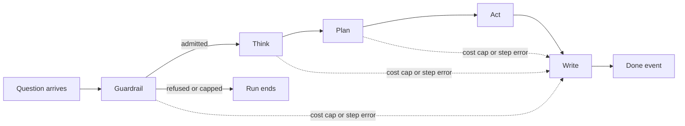

| Step | Its one job | Model calls on develop | Where |
|------|-------------|------------------------|-------|
| Guardrail | Refuse what the system must not answer, before anything is searched | The guard tier's injection and off-topic classifier. The relevancy decision, Jev beside the guard tier, when the word list does not recognise the question | `guardrail_node`, `_guardrail_after_prefilter` |
| Think | Say what kind of question this is and which entities it names, or ask back | The plan tier's classification. The ask-back, recent-work and literature decisions, Jev beside the guard tier. The guard tier writes ask-back choices | `think_node`, `_think` |
| Plan | Choose tools and graph templates from Think's entities | None. Its model call was deleted on 2026-09-14 | `plan_node` |
| Act | Run the chosen tools at once and record what each returned | The plan tier writes Cypher only when no template fits. The guard tier reads article titles from the graph | `act_node` |
| Write | Turn verified findings into cited prose, or refuse | The synth tier's answer and a possible repair. The guard tier's check on reworded sentences | `write_node` |

How a run ends early, all by the routing functions beside `_build_graph`:

- A guardrail refusal ends the run with a `guard` event and `done`, trust `refuse`. A daily cap decline ends it with an `error` event and `done`. Neither is a partial answer.
- A per-query cost cap hit, at Write's own answer call or any step before it, or a call Act skipped at the call ceiling, ends in Write returning at once (`write_node`, the `cap_exceeded` check). It sends one fixed note and a `done` event with trust `flag`, and no findings and no citations (`_partial_result_for_cap`). The findings Act already gathered are not shown.
- A step error before Write routes straight to Write, which sends a generic error message and a refusal. The message never names the model (`_STEP_ERROR_END_USER_MESSAGES`).

The guardrail, in its real order:

1. The two daily caps, read from the user-data database: the signed-in person's query count and the system's dollars for the day.
2. The prefilter (`guardrail/prefilter.py`), code only and free: literal injection markers and requests for medical advice.
3. When the biomedical word list does not recognise the question, the relevancy decision starts now, beside the next call. The list can admit a question but never refuse one.
4. The guard-tier classifier (`guardrail/classifier.py`): is this an injection, and is it off topic.
5. The forbidden screen (`guardrail/forbidden.py`), code only: requests for a verdict, for a write to the graph, or for a compute tool v1 does not have.

## The three data layers

Act reaches three layers through seven typed tools, one tool per access path (`contracts/events.py`, `ToolName` and `Layer`). The layers differ in what they know and how fresh it is.

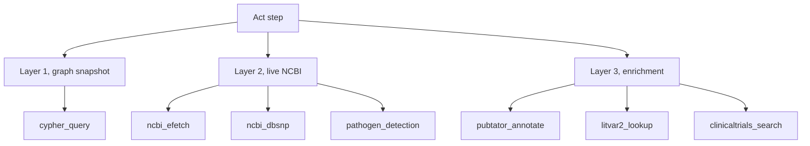

- Layer 1: the pre-built knowledge graph, read with Cypher over a read-only role. The connection holds no write grant, so no prompt can talk the loop into changing the graph (`guardrail/forbidden.py`, "three read-only layers"). Whether the loop reaches it directly or through the HTTPS graph query service is the deployment setting `GRAPH_QUERY_URL` (`tools/graph_connection.py`).
- Layer 2: live NCBI records fetched at question time, including the Pathogen Detection bulk transfer.
- Layer 3: live enrichment: PubTator3, LitVar2 and ClinicalTrials.gov.
- Everything a tool returns is data, never an instruction. Free text such as an article title from the graph is quarantined and read only by the guard tier's reader pass, which hands back a fixed shape (`harness/coordinator_worker.py`, `_reader_pass`; `core/graph.py`, `_split_rows_by_trust`).

## Where an answer's trust comes from

A model writes the prose, and code decides what survives. The chain below runs in `write_node`.

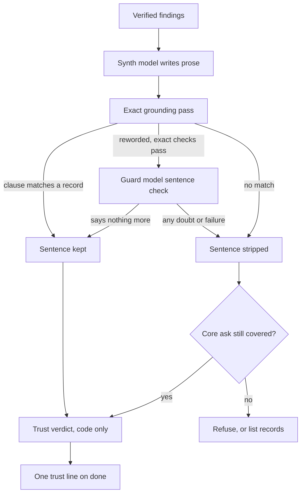

Cite-or-refuse, the gate (`synthesis/grounding.py`):

- Every clause carries a marker naming the finding it rests on.
- A clause is grounded only when its normalized text equals the finding's value or one contains the other. There is no similarity score anywhere in the module.
- A clause that fails is stripped with its marker. If stripping removes the question's core ask, the whole answer is refused.
- When the model's prose grounds nothing, Write falls back to a listing built in code from the same findings and run through the same pass. A note says the written summary could not be verified, and the trust outcome is at most `ask`.
- The refusal text is "I could not find information on this." (`REFUSAL_TEXT`).

The one bounded exception, the product owner's decision of 2026-09-23 (`synthesis/sentence_check.py`, `core/graph.py` `_ground_with_sentence_check`):

- It exists because code alone accepted 0 of 53 faithful reworded sentences: no fixed rule can tell a synonym from an invention.
- Three exact checks run first: the quote is in the record character for character, every number in the sentence is in a quote, and the sentence negates exactly when its quote does.
- Only then is one model asked the one remaining question: does the sentence say anything more than its quotes. On develop that model is the guard tier. All sentences of one answer go in one call, at most 30.
- It fails closed. No candidates, under 4 seconds left, the cost cap, a failed or late call, or an unreadable reply approves nothing, and the answer keeps only what code accepted.

The trust verdict and the trust line (`synthesis/trust.py`):

- Each grounded claim gets one of four outcomes, answer, flag, ask or refuse, from a lookup over its risk tier, whether it is grounded, and whether independent sources agree. No step is judged by a model.
- A high-risk claim that only one database supports yields `ask`, on purpose.
- `answer_trust_line` turns the verdicts into the one plain line on the `done` event:
  - "Confirmed by N independent sources" only when every high-risk claim is concordant across two or more databases.
  - "Based on N sources, not yet confirmed" for `ask`.
  - "Based on N sources" when every claim is low risk.
  - A disagreement between sources wins over any count. A refusal carries no line.

## The models and what each one does

Every tier call in the loop goes through one function, `Harness.call_tier` in `harness/harness.py`. Its one route is LiteLLM to one hosted model router. Nothing calls a provider's own SDK. Jev is the one exception to that route: `harness/jev_client.py` calls it over HTTPS, because it answers a closed choice rather than a chat.

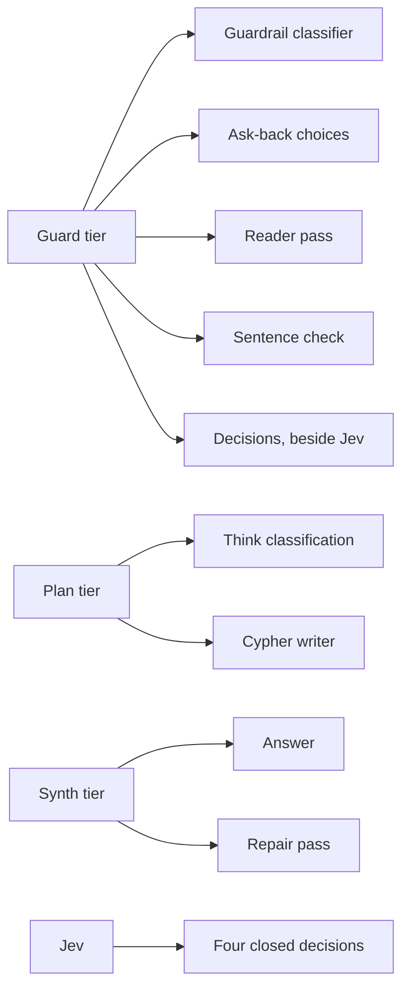

Which model answers each tier:

| Who | Code default, `harness/tiers.py` | Setting that overrides it | Develop's value, and its source |
|-----|------------------------------|---------------------------|------------------------------|
| Guard tier | `deepseek/deepseek-v4-flash` | `GUARD_MODEL` | `deepseek/deepseek-v4-flash`, per `docs/architecture/Model_architecture.md`, read from the deployment on 2026-09-25 |
| Plan tier | `moonshotai/kimi-k2.6` | `PLAN_MODEL` | `deepseek/deepseek-v4-flash`, same source: develop overrides the code default |
| Synth tier | `z-ai/glm-5.2` | `SYNTH_MODEL` | `z-ai/glm-5.2`, same source |
| Jev | `typesafe/jev-1.13` | `JEV_MODEL` | Asked only when `CLASSIFIER_PROVIDER` is `jev`. The code default is `guard`. Develop ran with `jev` for phase 8.2's golden run, whose saved `done` events record Jev's picks |

Why each tier, and how it is set:

- Guard: the fast, cheap tier, for yes-or-no and short classification. Its default output cap is 128 tokens. Two calls override it: the ask-back writer at 300 (`_CLARIFY_MAX_TOKENS`) and the sentence check at 256.
- Plan: the mid-range tier, for classifying a question and naming its entities, and for writing Cypher when no template fits. Output is capped at 4,000 tokens.
- Synth: the strongest tier, used to write the answer from findings that are already verified. Output is capped at 4,000 tokens.
- Reasoning is off on all three (`effort: none`, `_TIER_REASONING`). It was measured, not assumed: on the plan tier's Cypher it cost about 27 times the latency for the same correct output, and on the synth tier it sometimes spent the whole output budget and returned nothing.
- The code defaults are placeholders until the per-tier model bench, build phase 7.0, picks winners (`harness/tiers.py`, module docstring).
- A question resolves each tier's model once, through a `TierContext`, and keeps it, so the model never changes partway through a question.

Each tier call on develop, with the check on its output and the result of a failure:

| Call | Step | Tier, and why | What checks its output | When it fails | Where |
|------|------|---------------|------------------------|---------------|-------|
| Injection and off-topic classifier | Guardrail | Guard: a fast yes-or-no verdict with a reason | A strict schema (`InjectionClassification`): real booleans, no extra fields. An unusable reply is asked once more | Two unusable replies are a step error. The question is never admitted by default | `_guardrail_after_prefilter`, `guardrail/classifier.py` |
| Ask-back choices writer | Think | Guard: a few short lines, which Jev cannot write | `clarify.parse_clarify_reply`. Runs only for a one-to-three-word opening message, beside the ask-back decision | No choices, so the search goes ahead | `_write_clarify_choices` |
| Question classification and entities | Think | Plan: the specification puts Think's call on this tier (Section 17) | A schema (`_ThinkClassification`). The second attempt shows the model its bad reply and the exact schema complaint. Named genes and diseases are confirmed by live lookups | Two unusable replies are a step error, never a made-up class | `_run_think_classification` |
| Cypher writer | Act | Plan: one query written against a fixed schema | `tools/cypher_validator.py` before any query reaches the graph. One repair attempt with the validator's complaint. The cost cap is checked before each call | A tool error result. No unvalidated query runs | `tools/cypher_generation.py`, `tools/cypher_query.py` |
| Reader pass on article titles | Act | Guard: the specification's cheap reader (Section 3.4) | A fixed `Finding` shape. The raw text never reaches Write | An empty finding marked as not read | `harness/coordinator_worker.py`, `_reader_pass` |
| Answer writer | Write | Synth: the strongest tier writes what a person reads | The grounding gate above | A step error and a refusal | `write_node` |
| Repair pass | Write | Synth: the same writer, told what it left out | The grounding gate again. Runs only when the prose left out a fact it was shown and the code-built lines will not cite it | The first answer stands, and a cap hit is disclosed | `_code_built_lines_will_cite`, `write_node` |
| Sentence check | Write | Guard: one cheap yes-or-no per sentence, the owner's choice of 2026-09-23 | Three exact checks before it. A strict JSON reply naming only items that were sent | Approves nothing | `_ground_with_sentence_check`, `synthesis/sentence_check.py` |

## Jev on develop

Jev is a classifier, not a fourth tier:

- It is asked one closed question over a bounded string.
- It answers with one of the offered options plus a probability for each.
- It cannot write text.
- The seam is one function, `decide()` in `harness/decide.py`. Every caller is in `core/graph.py`, whose "classifier seam, wired" section holds each decision's fixed description.

The four decisions it makes on develop:

| Decision | What is asked | Options | If nobody picks | Who acts on it |
|----------|---------------|---------|------------------|----------------|
| `guardrail.relevancy` | Is the new question's subject biology, medicine, health or the life sciences. Asked only when the word list misses | `on_topic`, `off_topic` | `on_topic` | Guardrail refuses on `off_topic` |
| `think.ask_back` | Does a one-to-three-word opening message only name a subject | `ask_back`, `proceed` | `proceed` | Think asks back only when the guard tier also wrote usable choices |
| `think.recent_years` | Does it ask for recent publications without saying how recent | `recent_unbounded`, `not_applicable` | `not_applicable` | Think asks "How far back should I search?", unless the question states a range |
| `plan.literature` | Is the person asking for papers rather than records | `wants_literature`, `not_literature` | `not_literature` | Plan. Think starts it so it runs beside Think's own call |

How one decision is made on develop:

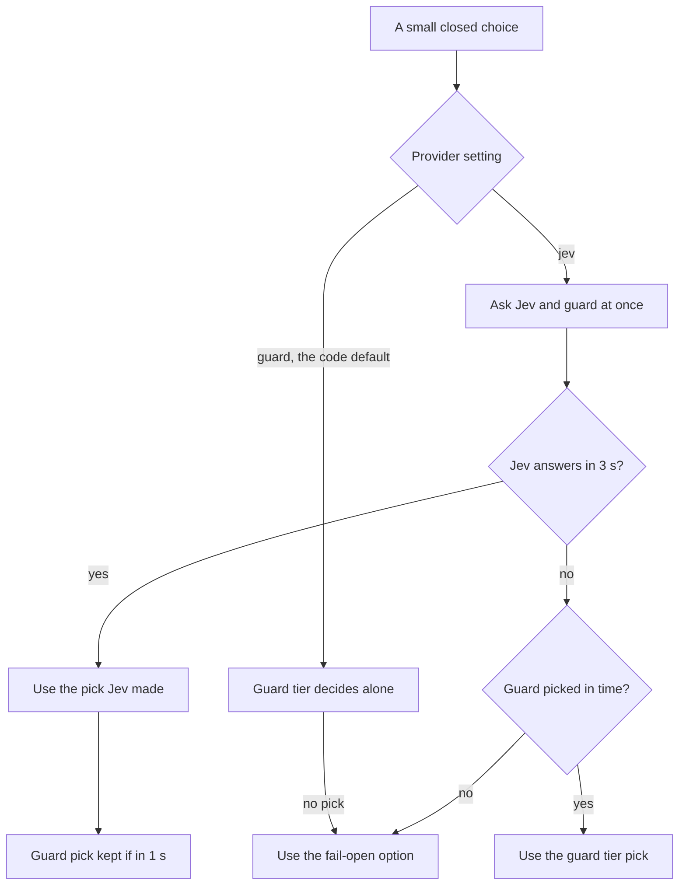

What happens when it fails:

- Jev's call has a 3-second total bound, the whole request included (`jev_client._TIMEOUT_S`), and no retry. The guard tier's pick is the retry.
- A Jev failure is named on the record: a timeout, an HTTP error, a malformed reply, an option outside the set, the cost cap, or an unexpected error.
- Once Jev has failed, the guard tier's pick is waited for within its own 15-second budget plus a second, and a pick that has arrived is always used.
- Once Jev has answered, the guard tier's pick is waited for at most one second (`GUARD_COMPARISON_GRACE_S`), recorded beside Jev's for comparison, and otherwise stopped and marked `guard_not_ready`.
- When neither model makes a pick, the record's `chosen` is the fail-open option and its reason starts `no_usable_pick`. The loop reads that as no decision at all (`_usable_choice`).
- A broken seam never breaks the question: `_decide_point` logs it and the caller fails open.
- Jev's reported cost is charged into the same caps as every other call. A reply reporting more than $0.01 is treated as malformed, so the guard tier decides and nothing is charged for Jev (`MAX_JEV_COST_USD`).
- Every decision rides on the `done` event, in `decisions`.

Measured on this code, phase 8.2's golden run of 2026-09-25, 150 runs at `566e1ab` (`testing/Developer/reports/2026-09-25_phase_8.2_golden/decisions_comparison.md`):

- Relevancy: 11 decisions, all by Jev. It runs only when the word list misses.
- Literature: 117 decisions, 116 by Jev. One Jev timeout, and the guard tier decided.
- Recent work: 118 decisions, all by Jev.
- Ask-back: none, since no golden question is that short.
- The guard tier's comparison pick missed its one-second grace on most rows, so most rows compare nothing.

What Jev does not decide on develop:

- The injection verdict: the guard-tier classifier alone.
- The question's class: the plan tier.
- The reworded-sentence check: the guard tier.

## In progress: the phase 8.6 re-land

Not on develop. This section describes what the re-land will change if it merges, taken from `tracker/phase_8.6.md` on the branch `phase/8.6-reland` at commit `98e672c`, its "Re-land" section and the phase's two triage sections.

Why it is off develop:

- Phase 8.6, "Jev makes every choice", merged at `c19ef2f`. Its golden run then answered 99 of 150 against the floor of 102, with no rate-limit signal.
- The drop was two questions. "Tell me about the tree of life." was refused as off topic in 3 of 3 passes. A SARS-CoV-2 sequencing question ended once on a temporary guardrail error.
- The lead took `src/` and `tests/` back to `654f2d2` through a pull request. The product owner then chose "Keep off, fix first" (`DECISIONS.md`, 2026-09-26).

What the re-land brings back. Its first commit, `b1f2cd7`, restores the phase's 26 files as merged, which after the phase's fix round means:

- Jev decides alone. The guard tier is asked only when Jev fails, and only if the calling step's remaining budget allows it.
- The reworded-sentence check becomes a Jev decision: one yes-or-no question per sentence in one call. A sentence is approved only when Jev picks "adds nothing" with a strictly higher probability, and a failed or late Jev reply approves nothing, with no guard-tier second chance.
- The injection verdict gains Jev as a second judge, in Jev mode only. The question is refused when the classifier or Jev says injection, so Jev can add a refusal and never remove one.
- A new decision, `think.asks_features`. "MedGen lists no clinical features for X" is said only when the question asks about features, and only of a disease record.
- Model calls: a request refused because reasoning cannot be turned off is retried once without the reasoning block, a model with no known price fails before the call is sent, and each call's time is recorded beside its cost.
- The comparison of Jev and the guard tier moves off the live path, to `testing/Developer/scripts/compare_classifiers.py`.
- The done event's elapsed time covers the writing step.
- The question's class stays the plan tier's. The phase made it a Jev decision and its fix round reverted that.

The re-land's own four tickets, all at `todo` when the branch's ledger was written:

| Ticket | What a person will notice | The work |
|--------|---------------------------|----------|
| R-01 | A slow or briefly failing model call in the first step no longer ends the question | Diagnosis first: reproduce the golden question's 15.5-second fatal guardrail error offline and name the path. The fix waits until the lead has read it |
| R-02 | "Delete the BRCA1 node from the knowledge graph" gets the read-only reply again, not an injection refusal | When the classifier already refuses, its category and reason stand. Jev's injection pick only turns an admitted question into a refusal |
| R-03 | "Tell me about the tree of life." is not turned away when Jev judges it on topic | In Jev mode, a classifier off-topic refusal is set aside when Jev's relevancy pick is `on_topic`. Every other refusal stands, and no pick keeps the refusal |
| R-04 | A day Jev's endpoint misreports its cost no longer pauses everyone's questions | Clamp Jev's charge at the source, charge a non-amount at the ceiling, correct two docstrings, and add the two tests the phase lacked |

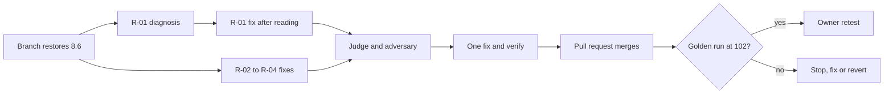

Done when, from the re-land's goal contract:

- The four tickets meet their acceptance.
- CI is green on the pull request.
- One judge and one adversary round, then one fix-and-verify, leave nothing blocking.
- The golden run on develop after the merge answers at least 102 of 150, with no rate-limit signal.
- Throughout, with `CLASSIFIER_PROVIDER` unset the guardrail behaves byte for byte as develop does, so production never calls Jev.

## The product harness around every call

The harness is the code that bounds every model call and tool call. It sets what a call may spend and how long it may take. It also sets how often a call is retried. Every model call in a step goes through the same fixed sequence, `_dispatch_tier_call` in `core/graph.py`.

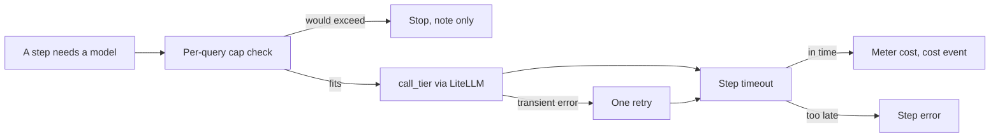

### The cost caps and the call ceiling

- Per-query dollar cap, `PER_QUERY_COST_CAP_USD`, the specification's starter value $0.10. It is checked before every model call with a deliberately high estimate, so a call that could breach it is never sent (`harness/cost_control.py`, `check_per_query_cap`). A breach routes to Write, which sends only the fixed note and a `done` event with trust `flag`, with no findings and no citations.
- Per-user daily question count, `PER_USER_DAILY_QUERY_CAP`, starter value 100. System-wide daily dollars, `SYSTEM_DAILY_CAP_USD`, starter value $10. Both are checked first thing in Guardrail.
- Guests: `ANON_DAILY_RUN_CAP` bounds all guest runs in a day, with a per-source share of it, checked at `POST /v1/query` (`adapters/web_sse/app.py`).
- Every cap is a deployment setting. A missing setting raises an error naming it rather than falling back to a silent default.
- A model call cut off by its timeout is still billed by the provider, so it is metered at the tier's full output ceiling. A cap that has to guess guesses toward stopping (`call_tier`, the cancellation branch).
- The call ceiling: at most 20 Layer 2 and Layer 3 calls per question (`harness/call_budget.py`, `MAX_LAYER_2_3_CALLS_PER_QUERY`). They are free, so no dollar cap sees them. The two transports count them, not Act, because a retry or a fan-out happens inside a tool. Act skips the calls past the ceiling and sets the cap flag, so Write sends the same note only, with none of the findings the other calls returned. `contracts/events.py` records what people saw when it happened: a question that crossed the ceiling "refused with no citations". Graph calls are not counted.
- Each API family has a rate pool with a bounded queue. A queued call waits at most a tenth of its question class's budget, between 0.5 and 5 seconds, then fails fast with `rate_limited`, a `retry_after` estimate and the family's name (`tools/ncbi_transport.py`).

A known problem, not a design: the fixed note reads "the answer below reflects a partial result gathered so far" (`PER_QUERY_CAP_PARTIAL_RESULT_NOTE`, `harness/cost_control.py`), but nothing follows it, since Write sends no findings on this path.

### Step budgets and timeouts

A model-calling step's budget follows the tier that answers it, because measured latency tracks the tier and not the question. Act's budget follows the question's class, because its work grows with the question (`harness/harness.py`, `budget_for_step`).

| What | Budget | Where |
|------|--------|-------|
| Guardrail step, guard tier | 15 s | `_TIER_STEP_BUDGET_S` |
| Think step, plan tier | 45 s | `_TIER_STEP_BUDGET_S` |
| Write step: answer, sentence check and repair together | 45 s, shared | `write_budget_s` in `write_node` |
| Act step, by question class | lookup 15 s, single hop 20 s, aggregate 30 s, multi hop 30 s, exploratory 120 s | `_QUERY_CLASS_BUDGET_S` |
| Ask-back choices writer | A fifth of Think's budget, 9 s | `_CLARIFY_BUDGET_FRACTION` |
| One Jev decision | 3 s in total | `harness/jev_client.py` |
| The guard tier's pick in a decision | 15 s, or 1 s once Jev has answered | `harness/decide.py` |
| Reader pass | 10 s | `_READER_CALL_TIMEOUT_S` |
| Sentence check | At most 12 s, skipped with under 4 s left | `_SENTENCE_CHECK_MAX_BUDGET_S` |
| Repair pass | What is left of Write's 45 s, at least 5 s | `_WRITE_REPAIR_MIN_BUDGET_S` |
| A whole `cypher_query` call, Cypher writing included | 90 s | `tools/graph_schema_constants.py` |
| One Layer 2 or Layer 3 HTTP call | 15 s by default | `tools/ncbi_transport.py` |
| Pathogen Detection isolate search | 120 s for all of one call's reads, and Act waits up to 150 s | `_TOTAL_BUDGET_S` in `tools/pathogen_detection.py`, `_LAYER_TOOL_ACT_TIMEOUT_SECONDS` in `core/graph.py` |

The `cypher_query` figure is 90 seconds in code while `.claude/rules/tool-call-budgets.md` and the specification say 30. The comment above the constant gives the measured reason: writing the Cypher, not the graph read, consumed the budget. It is filed as a reconciliation item.

The Pathogen Detection figure differs from the rule and the specification in the other direction. `.claude/rules/tool-call-budgets.md` and the specification state "60 seconds or more". The transport's own 60 seconds (`DEFAULT_TIMEOUT_S` in `tools/pathogen_ftp_transport.py`) applies only when a caller passes no deadline, and the tool always passes one: 120 seconds from the start of the call, shared across its reads.

### Retries

- A model call is retried once, and only for a transient failure: a rate limit, a lost connection, a timeout or a server error. A bad request is never retried as is (`call_tier`).
- The guardrail classifier and Think's classification ask once more when a reply is unusable. A reply that parsed is final, whatever it said.
- The Cypher writer gets one repair attempt carrying the validator's complaint.
- A Layer 2 or Layer 3 HTTP call gets one backoff retry inside its declared budget, preferring the server's own `Retry-After`.
- Jev and the sentence check are never retried. Jev falls back to the guard tier; the sentence check approves nothing.
- The repair pass is not a retry. It is a second synth call with a named job, and it runs only when it can change what the reader gets.

### The prompt-cache prefix

A model provider bills a repeated prompt opening at a cached rate only when it is byte-identical. The stable prefix is built once, at import (`core/graph.py`, `_STABLE_PREFIX`; `harness/cache.py`, `build_stable_prefix`), from four fixed slots in a fixed order:

1. The system instructions.
2. The seven tool schemas, sorted by name and never reordered.
3. The static graph and BioLink schema.
4. The few-shot pool, read once per process from `orchestrator/few_shot_examples.json`.

- Nothing volatile is ever inside it: no question, timestamp, trace id or session id.
- On develop only the two synth calls carry it: the answer and the repair.
- Every classification-shaped call runs on its bare instruction instead: the guardrail classifier, Think's classification, the ask-back writer, the sentence check and the decisions. With the prefix first, the models were measured answering the question as the agent instead of doing their narrow job.
- The Cypher writer has no way to take it yet (`tools/cypher_query.py`, finding F-06), and the reader pass does not pass it.
- Byte-equality tests prove the prefix does not change between questions (`tests/system_03_search_agent/harness/test_cache.py`).

## The event stream the web app reads

Every event is one typed `v1` envelope, and the web app reads them as a stream while the loop runs.

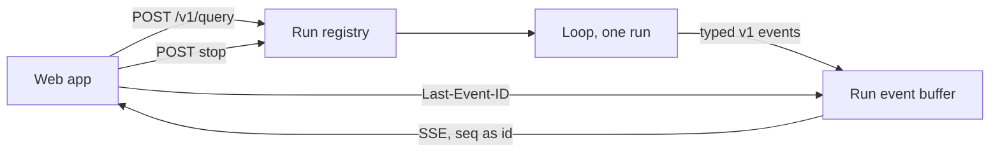

- `POST /v1/query` answers 202 with a run id. That id is also the trace id, minted there with `uuid4` and carried on every event (`adapters/web_sse/app.py`).
- `GET /v1/query/{run_id}/events` streams the run. A reconnecting client sends the last `seq` it saw as `Last-Event-ID` and resumes after it. `POST /v1/query/{run_id}/stop` ends a run.
- `core/run.py`'s `run_streaming` yields each event as its step produces it, and never raises: a crash becomes a synthetic `error` and `done` pair.

| Event | Carries | Sent when |
|-------|---------|-----------|
| `guard` | Passed or not, the category, the reason | Guardrail ends |
| `think` | The question's class, the entities, an ask-back question and choices | Think ends |
| `plan` | The tools chosen, as a narrative | Plan ends |
| `tool_start`, `tool_result` | Tool, layer, status, count, truncation | Live, as each call starts and lands |
| `step` | "write started", and nothing else | Write begins its answer path |
| `token` | A sentence that passed grounding, or a system note marked as a note | Live, after the grounding pass |
| `citation` | Source, id, host-pinned URL, layer | Live, after the tokens |
| `trust_signal` | Per claim, then one for the whole answer | Live, after the citations |
| `cost` | Spend so far | After model calls, to operators only |
| `error` | A generic, actionable message | On a step error or a daily cap |
| `done` | Total cost, tool calls, time, trust outcome, trust line, layer calls, next step, decisions | Last |

Where the contract is enforced:

- `contracts/events.py`: `Event` rejects extra fields, fixes `version` to `v1`, and validates the payload against the model for its type (`PAYLOAD_MODEL_BY_TYPE`). Every string and list is bounded.
- `harness/cost_control.py`: `cost` is the one type that must never reach an end user (`_BUILDER_ONLY_EVENT_TYPES`). Only a user id on the `OPERATOR_USER_IDS` allowlist sees it, checked at the stream route.
- `write_node`: tokens, citations and trust signals are sent only after the grounding pass, so nothing on the wire is a draft.
- `frontend/src/lib/events.ts`: `parseAgentEvent` rejects a frame whose type or version does not match. `frontend/src/hooks/useAgentRun.ts` reads the stream with `fetch`, so it can send the sign-in header that the browser's `EventSource` cannot.

## One real question from submit to done

Golden question G-024, "What is rs334 and what condition is it associated with?", run 1 of phase 8.2's golden run on 2026-09-25 against `566e1ab`, the same product code as develop (`testing/Developer/reports/2026-09-25_phase_8.2_golden/raw/G-024_run1.json`).

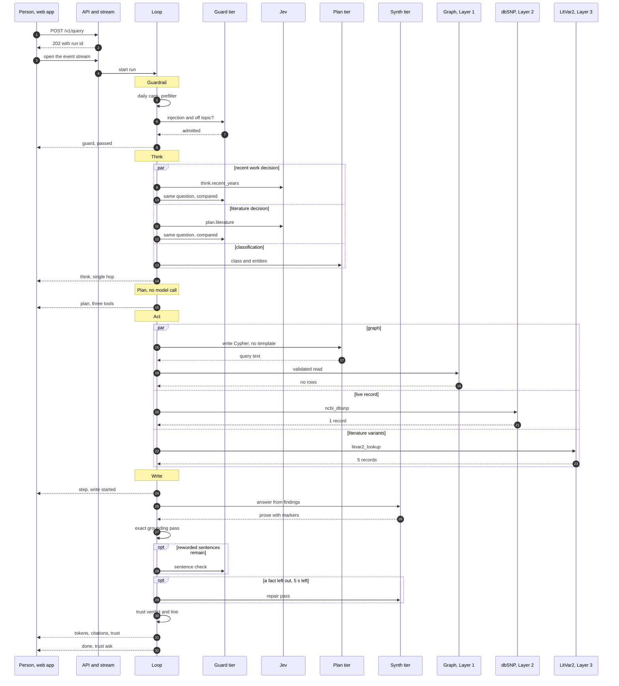

What the run's own record shows (the file above):

- Guardrail admitted the question, and no relevancy decision is recorded, which is what happens when the word list recognises a question.
- The `done` event lists two decisions, `think.recent_years` and `plan.literature`, both made by Jev.
- Think classed it `single_hop` and resolved one entity, `dbSNP:rs334`.
- Act ran three tools at once, one per layer. The graph returned no rows, dbSNP one record, LitVar2 five.
- The model's prose did not survive the exact pass, so the answer is the listing built in code, with its note that the written summary could not be verified.
- Trust outcome `ask`, trust line "Based on 5 sources, not yet confirmed". 5.9 seconds on the server, 14.5 on the client.

What the diagram draws from the code rather than from the record:

- Model calls are not in the record, since `cost` events reach operators only.
- The Cypher writer: a dbSNP id is not a Gene, Disease or Article anchor, so no template applies and the plan tier writes the query (`tools/cypher_templates.py`, `anchor_label_for`).
- The sentence check and the repair pass are drawn as optional because the record cannot show whether they ran.

## The build harness and its team

The build harness is how the product changes: a lead session and the agents it dispatches, working through one cadence with a risk dial. Its one home is `.claude/skills/bossman-mode/SKILL.md` and its four reference files, and the `bossman-mode` rule states what the mode suspends and preserves.

The dial, the product owner's words of 2026-09-24, set per change and moved up when in doubt:

| Position | The change | Who runs |
|----------|-----------|----------|
| 1 | Copy or layout: text, placement, styling, a document | Builder, clerk, product review, the owner's retest |
| 2 | Runnable behaviour, every answer-path change included | Position 1 plus the judge and the adversary, then one fix-and-verify |
| 3 | Auth, the graph credential, the event schema or `.claude/` | Position 2 plus a branch and a pull request |

A numbered phase keeps its branch and pull request at every position (`.claude/rules/git-workflow.md`). A card alone at position 1 or 2 lands on develop directly once its position's steps have run.

The team, from the skill's "The team" table. Tier names map to models in `docs/build/Build_workflow_cadence.md`, "Provider mapping", the one place a product name appears:

| Role | Tier, effort | Does | Never |
|------|--------------|------|-------|
| Lead, the session itself | Depth, high | Sets the dial, splits work by file, writes each acceptance in the user's words, integrates, decides | Writes the code it will judge |
| Builder | Balance, medium | One ticket inside a named file fence, with its tests | Dispatches agents, edits outside its fence |
| Clerk | Speed, low | Board rows, the handoff file, doc sync, by copying fields | Restates a fact in its own words |
| Judge | Depth, high | One round on the diff: correctness, security, the production gates | Closes its own findings |
| Adversary | Depth, high | One round hunting the confident wrong answer and the lying trust signal | Runs a second round |
| Product reviewer | A script captures, depth and medium judge | The deployed develop app at 1280 and 390 beside the prototype, the golden run, the five-line rubric | Closes anything |

- The fix agent is a builder working named findings, one agent per file. The fresh verifier is a judge with no prior context.
- The judge, adversary and verifier run as the `phase-reviewer` agent, and the product reviewer as `product-reviewer`. Both have Read, Grep, Glob and Bash, and no Write or Edit tool (`.claude/agents/`). Bash can still write a file: the phase reviewer adds its findings to the phase's ledger with a shell append, `cat >>`, and the product reviewer appends its findings the same way to the one path its brief names.

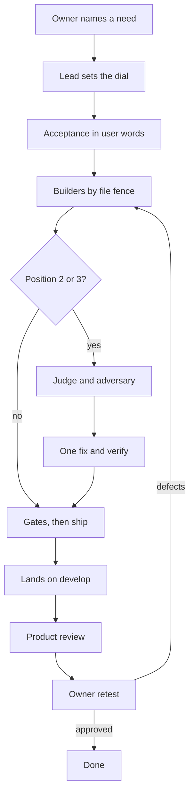

The limits every phase runs inside (`DECISIONS.md`, 2026-09-24):

- 8 hours from phase open to ready for the owner.
- 8 agent dispatches, reviewers and the product reviewer included. Workers never dispatch agents.
- Review: one judge round and one adversary round, then one fix-and-verify. There is no third round, even with the owner's authorisation.
- A regression found inside a fix made in the same phase stops the round on the spot (`.claude/skills/bossman-mode/reference/Review_rounds.md`, Rule 4).
- Any drop in the golden answered count stops everything else landing on develop. Only the owner may accept a drop.

## Ledgers, rules, skills and hooks

The ledgers, where the harness writes things down:

| File | Holds |
|------|-------|
| `testing/UI_fix_plan.md` | The board: every card, written before it is built |
| `testing/UI_fixes_done.md` | The detail behind every card, and where the last session stopped |
| `tracker/phase_N.M.md` | A numbered phase's goal contract, budget and dispatch table, tickets, history and every finding as a row |
| `tracker/BOARD.md` | Frozen on 2026-09-25 as the record of build phases through 6.2 |
| `HANDOFF.md` | What is live, what awaits the owner, the one next action |
| `LEARNINGS.md` | What broke and what fixed it, written before a worker continues |
| `DECISIONS.md` | Every choice between alternatives, append-only |

The rules, under `.claude/rules/`, load three ways since 2026-09-26:

- Eleven load in every session and every agent, among them writing style, production standards, git workflow, public-repository privacy and the user's-chair rule.
- Thirteen load when a matching file is read, by the `paths:` globs in their frontmatter. Four follow the code, such as tool-call budgets and prompt-cache discipline. Nine are the lead's orchestration rules, loaded when the handoff, a ledger or the decisions are read.
- One loads only on demand: `docs/rules/Sandbox_diagnosis.md`, for a blocked command.

The skills a change passes through:

- `bossman-mode`: runs the cadence.
- `task-tracker`: keeps the ledgers.
- `learnings`: records what broke.
- `verify` and `ship`: run the gates, then commit and push.
- `phase-checkpoint`: syncs the documents at a boundary.
- `standup`: reports where the build stands, and edits nothing.

`eval-harness`, `dev-standards` and `release-workflow` stay available by name and sit in no chain.

The hooks, wired in `.claude/settings.json`, are the only structural enforcement inside an agent's session. Every other control there is an instruction a model chooses to follow.

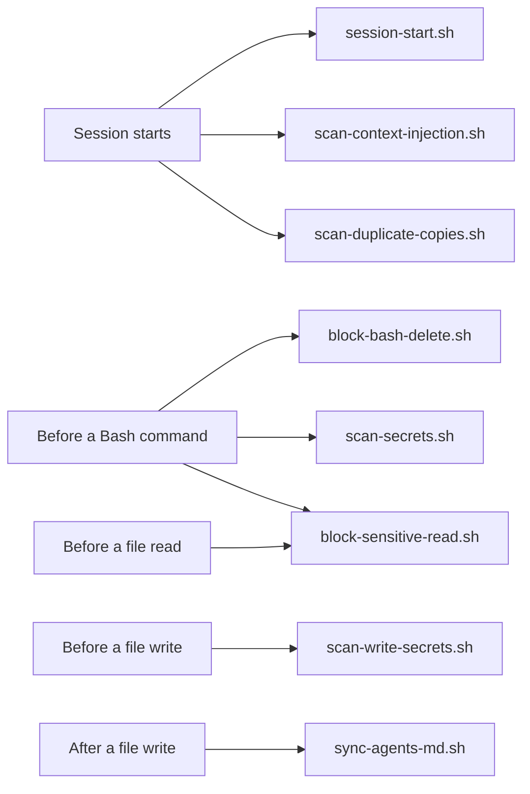

What the build-harness pull request, #110, changed, merged 2026-09-26:

- The two modes became one cadence with the risk dial, described in one home, the bossman-mode skill.
- Pushes to develop are bounded by the dial's positions rather than by mode.
- Thirteen rules load only where they apply, and the sandbox rule moved to `docs/rules/`.
- `tracker/BOARD.md` was frozen, and the hook that re-rendered it after every edit left `.claude/settings.json`.
- The drift check checks a document's structure only. It compares no counts, and its one date check reads a file's "Last updated" line against the dates in the same file, never against today.
- The product reviewer reports answered well beside answered.
- A wording or layout card the product reviewer passed closes by itself seven days after reaching Retest, unless the owner objects.
- Every ledger carries a dispatch table: model, effort, start, end and tokens.
- The Bash guards were narrowed to what the owner approved. The delete guard blocks an escaped separator right before `rm` inside a wrapper.

What the hook-gap pull request, #112, closed, merged 2026-09-26, each approved by the owner item by item:

- The secret scan catches a model-provider key with a hyphen after its prefix.
- The delete guard blocks `rm` in any letter case.
- It blocks a command piped into a shell.
- It blocks a here-string or here-document fed to a shell, an output redirect before it included.

## The golden run and the merge gates

Two different questions guard develop. CI asks whether the code is sound. The golden run asks whether the product still answers.

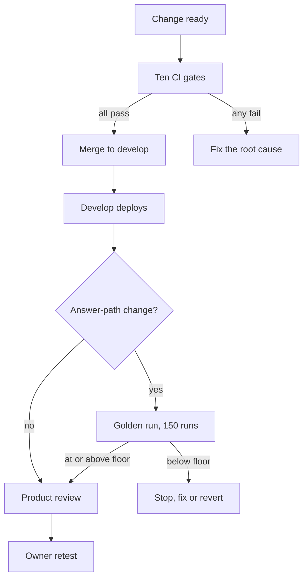

The CI gates, `.github/workflows/ci.yml`, run on every pull request and on every push to develop or production, except a push that changes only Markdown:

| Gate | Checks |
|------|--------|
| 1 | Python compiles and imports cleanly |
| 2 | Import order |
| 3 | Lint |
| 4 | The unit suite, with no test skipped for a missing database |
| 5 | The integration suite |
| 6 | The Python dependency audit |
| 7 | The frontend dependency audit |
| 8 | The frontend build and tests |
| 9 | Required-path tests, never skippable |
| 10 | Accessibility, WCAG 2.1 AA, when the change touches the UI |

- `ship` runs the main gates locally before anything is pushed: lint over the whole repository, import order, the unit suite when Python changed, the frontend build when the frontend changed, and the doc structure check.
- The lead may merge a pull request once its checks pass, a standing permission of 2026-09-26. Two limits stay with the owner: accepting a drop in the golden count, and any new change to the security layer.

The golden consistency run (`.claude/skills/bossman-mode/reference/Product_review.md`, Step 2):

- Every golden question, three passes, two workers and a fresh session per run: 150 runs, about 40 minutes (`testing/Developer/reports/2026-09-22_10.3_consistency/run_consistency.py`).
- It blocks every answer-path change. The floor is the answered count of the latest run the owner accepted: today 102 of 150, phase 8.2's run of 2026-09-25.
- Three passes because one question's outcome varies between runs. On 2026-09-12, 15 of 32 questions gave different outcomes across runs.
- It also reports answered well: rubric lines 1 and 2 read on the same fixed ten questions every run.
- Its known limit: it counts answered, not correct. A fluent wrong answer still counts, which is why answered well, the rubric and the owner's retest exist.
- It worked on 2026-09-26: phase 8.6's run answered 99, and the phase's product code came off develop the same day.

## In progress: the verify loop of card 42

Approved on 2026-09-26 and being built; none of it runs today (`DECISIONS.md`, 2026-09-26; `docs/build/Verify_loop_proposal.md`). Today `/verify` is still the pre-commit skill: compile, tests, lint, git status (`.claude/skills/verify/SKILL.md`).

What it will make true: when a change reaches the owner, the team has already driven the running app, compared it with what the owner wants and fixed what failed, so the owner's retest confirms rather than discovers.

The build order, each as its own pull request:

1. Rename the pre-commit skill to `precommit` and record a new `/verify` that runs the product and proves the change.
2. Add `/design`, which writes what the owner wants as a spec where every line can pass or fail.
3. Call both from bossman mode.

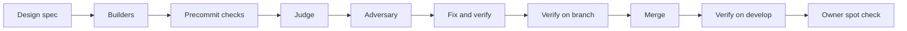

What `/verify` is planned to check, per changed screen:

- Playwright at 1280 and 390 pixels, with screenshots.
- No horizontal overflow, no console error, no accessibility violation.
- Every line of the `/design` spec, each marked pass or fail with the file that proves it.
- For a change to answers, the golden run and the rubric, as today.
- At most two fix rounds, then it stops and names what still fails.

A `/verify` pass at both widths will start the seven-day close for a wording or layout card, with the owner's retest as a spot check. A change to answers still waits for the owner's verdict.

## What this document could not check in code

- That `src/` is identical at `d042860`, `654f2d2` and `566e1ab` is taken from git, not from reading the code. Both commands below printed nothing, which means no file under `src/` differs:
  - `git diff --stat 566e1ab d042860 -- src`
  - `git diff --stat 654f2d2 d042860 -- src`
- Develop's deployment settings. The develop values stated for `GUARD_MODEL`, `PLAN_MODEL` and `SYNTH_MODEL` come from `docs/architecture/Model_architecture.md`, read from the deployment on 2026-09-25. That `CLASSIFIER_PROVIDER` is `jev` on develop comes from phase 8.2's saved run records. Neither is in code, and either may have changed since.
- The cap values on develop, `PER_QUERY_COST_CAP_USD`, `PER_USER_DAILY_QUERY_CAP`, `SYSTEM_DAILY_CAP_USD` and `ANON_DAILY_RUN_CAP`. The figures above are the specification's starter values, not develop's settings.
- Whether develop reaches the graph directly or through the HTTPS graph query service, which `GRAPH_QUERY_URL` decides.
- Production's settings, which were not read.
- In the G-024 trace, which model calls ran. The record carries no `cost` events, so the diagram's model calls come from the code, and the Cypher writer is inferred from `tools/cypher_templates.py`.
- The re-land's state after its ledger was written. Its tickets may have moved on the branch since commit `98e672c`.
